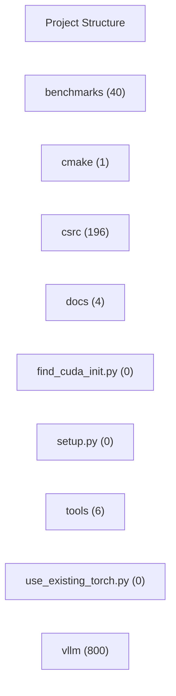

```mermaid
graph LR
    title["Project Structure"]
    benchmarks["benchmarks (40)"]
    cmake["cmake (1)"]
    csrc["csrc (196)"]
    docs["docs (4)"]
    find_cuda_init_py["find_cuda_init.py (0)"]
    setup_py["setup.py (0)"]
    tools["tools (6)"]
    use_existing_torch_py["use_existing_torch.py (0)"]
    vllm["vllm (800)"]
```