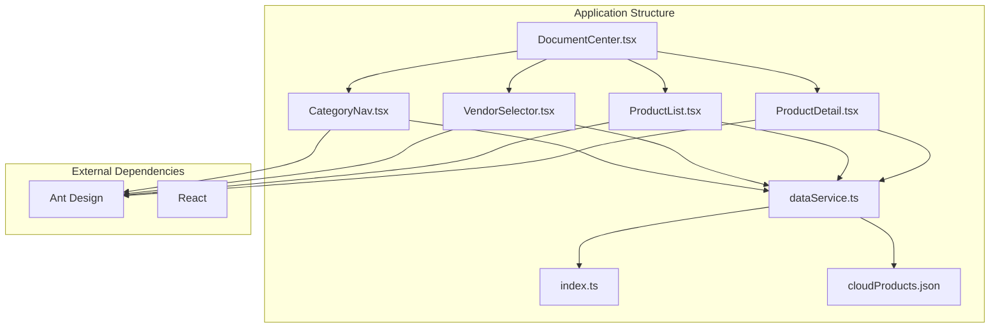
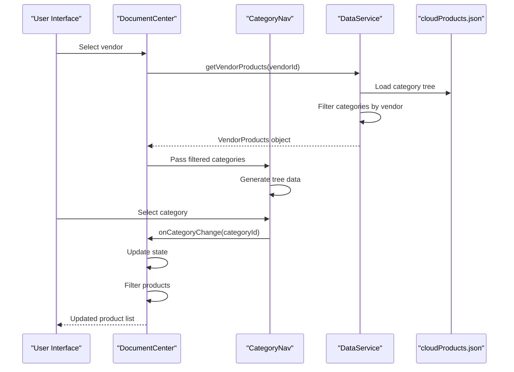
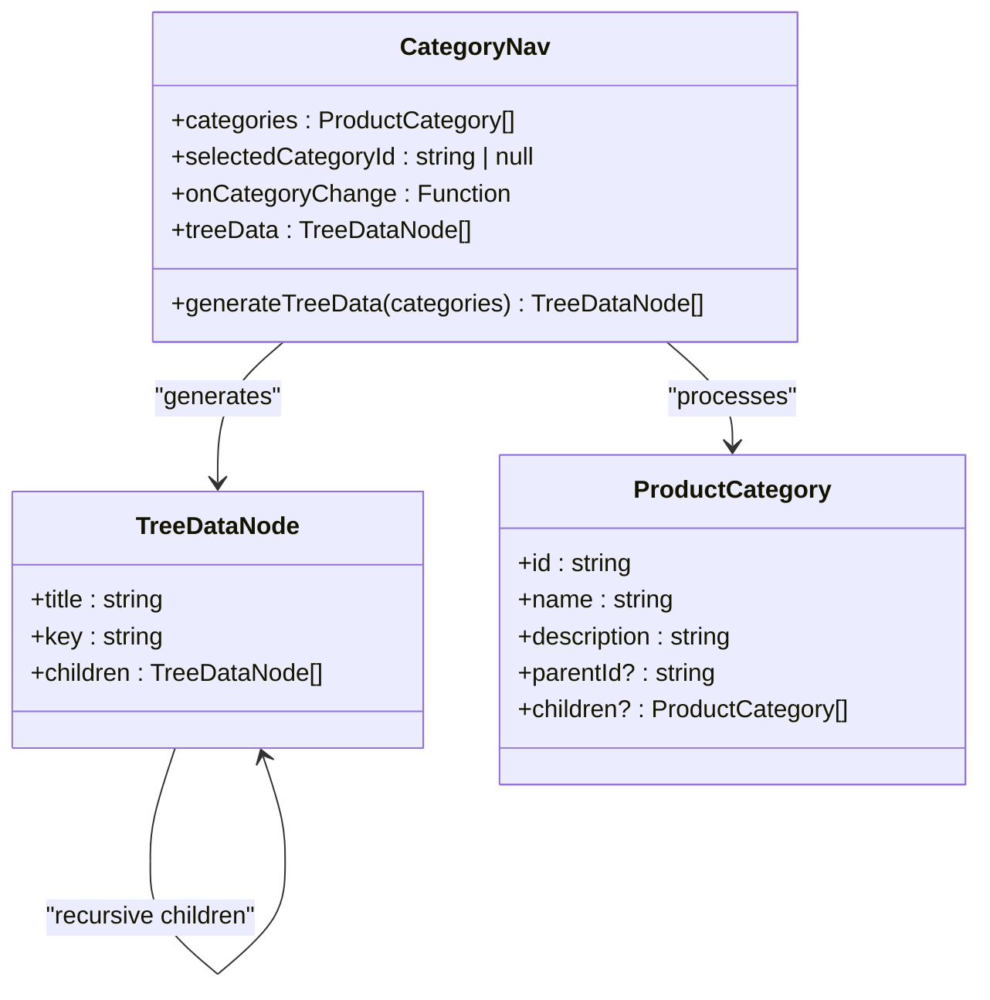
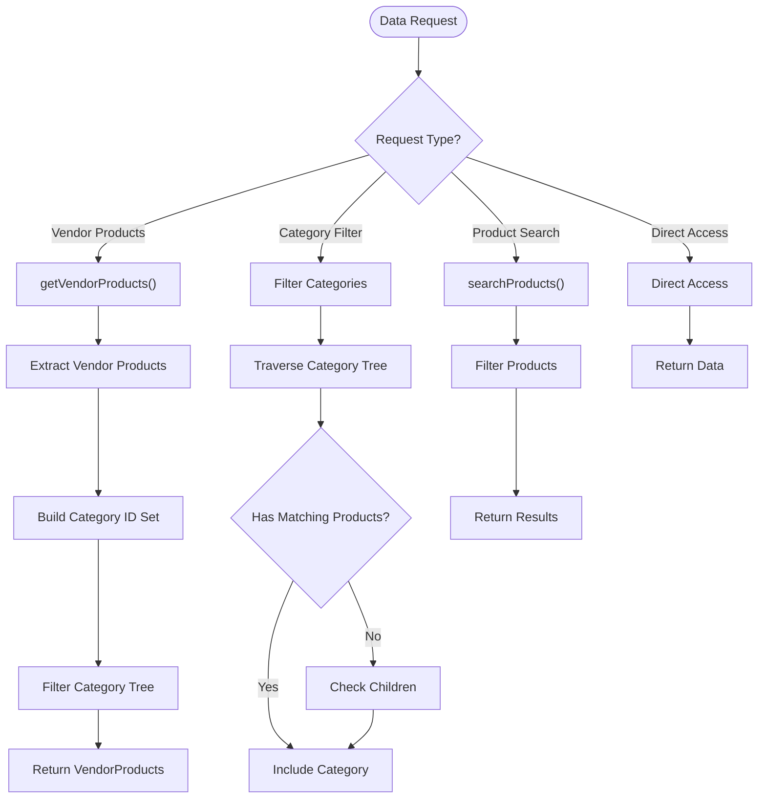
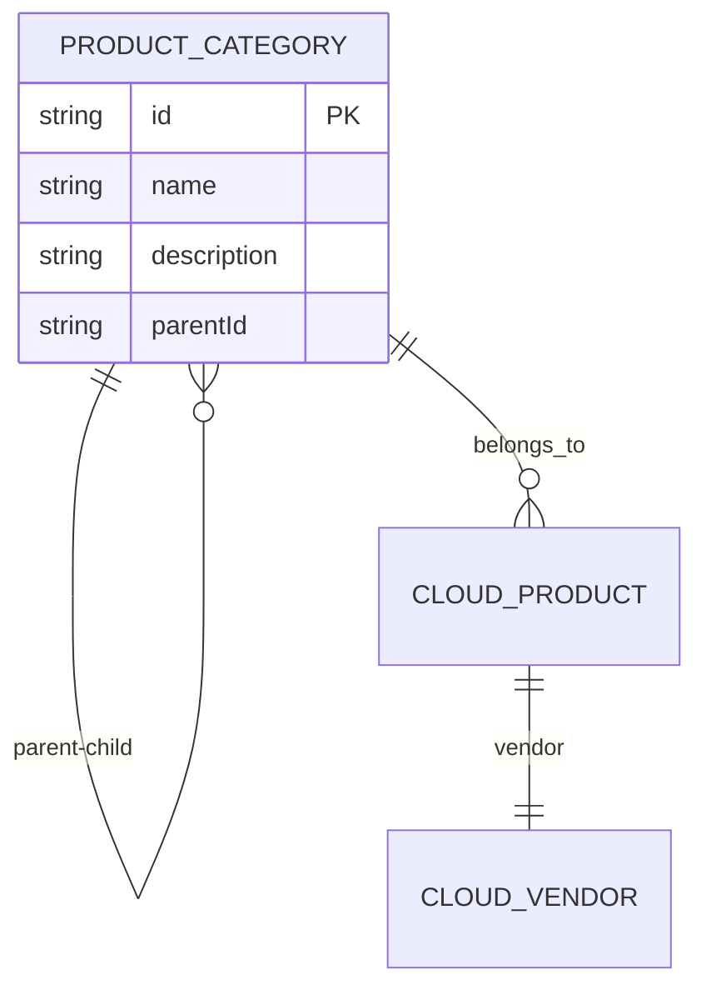
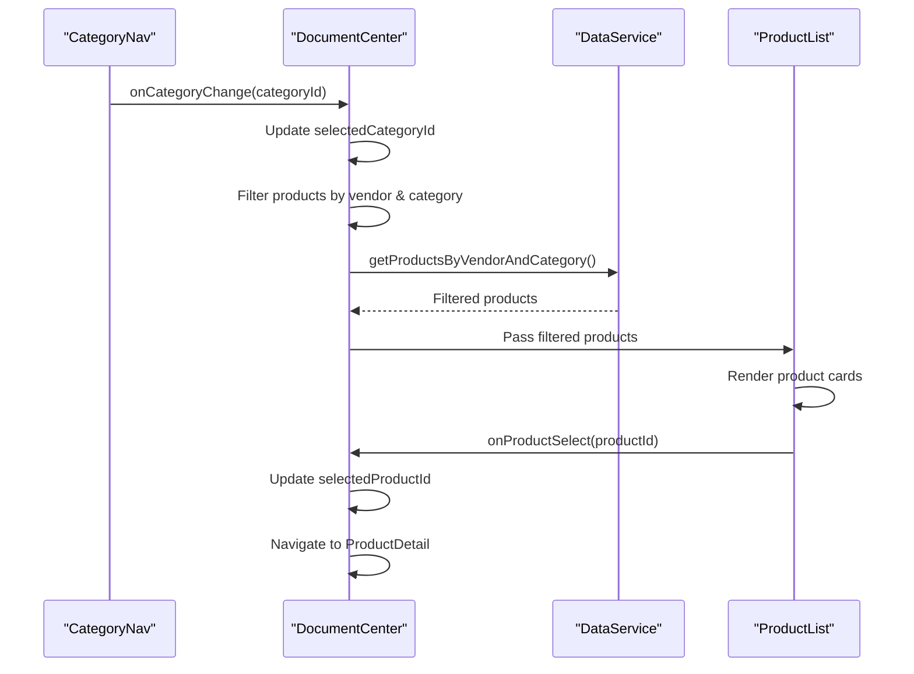
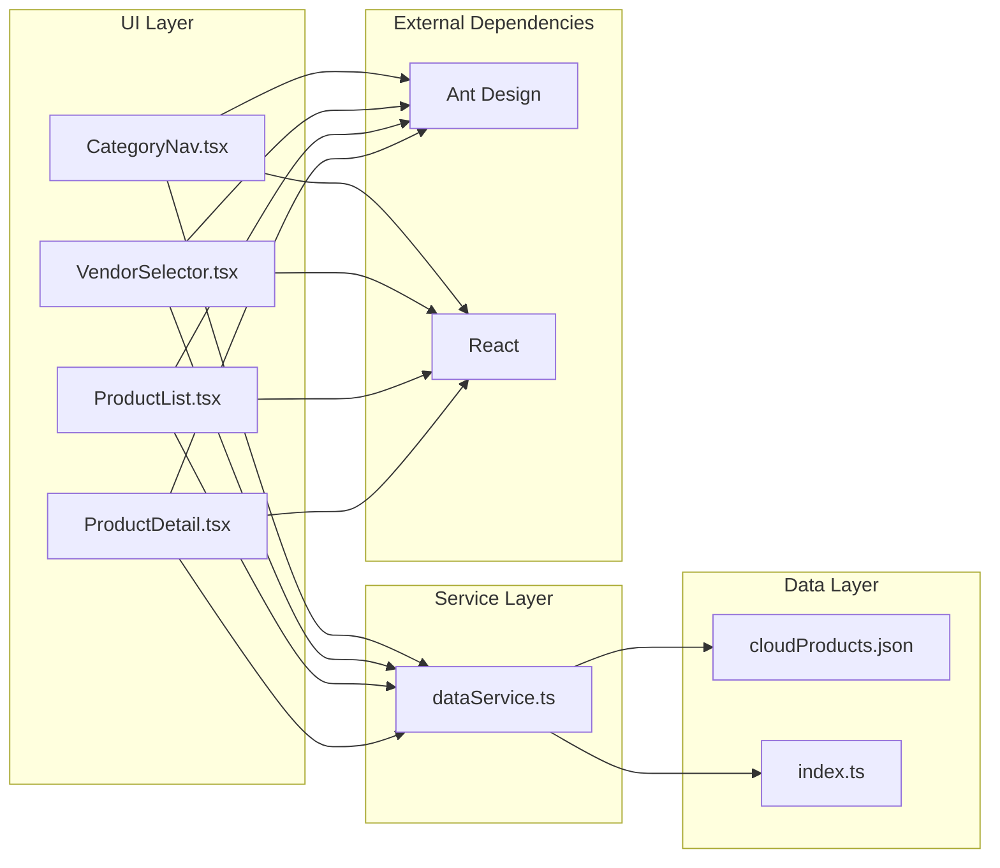

# Category Navigation System

<cite>
**Referenced Files in This Document**
- [CategoryNav.tsx](file://web/src/components/CategoryNav.tsx)
- [dataService.ts](file://web/src/services/dataService.ts)
- [index.ts](file://web/src/types/index.ts)
- [cloudProducts.json](file://web/src/data/cloudProducts.json)
- [DocumentCenter.tsx](file://web/src/pages/DocumentCenter.tsx)
- [VendorSelector.tsx](file://web/src/components/VendorSelector.tsx)
- [ProductList.tsx](file://web/src/components/ProductList.tsx)
- [ProductDetail.tsx](file://web/src/components/ProductDetail.tsx)
- [CategoryNav.test.tsx](file://web/src/components/CategoryNav.test.tsx)
</cite>

## Table of Contents
1. [Introduction](#introduction)
2. [Project Structure](#project-structure)
3. [Core Components](#core-components)
4. [Architecture Overview](#architecture-overview)
5. [Detailed Component Analysis](#detailed-component-analysis)
6. [Dependency Analysis](#dependency-analysis)
7. [Performance Considerations](#performance-considerations)
8. [Troubleshooting Guide](#troubleshooting-guide)
9. [Conclusion](#conclusion)

## Introduction

The CloudMaster application provides a comprehensive cloud computing resource discovery platform with hierarchical category navigation. This system enables users to browse cloud services organized in a multi-level category structure, filter products by vendor selection, and navigate through documentation resources efficiently.

The category navigation system is built around a sophisticated tree-based architecture that supports deep nesting, dynamic loading, and real-time filtering capabilities. Users can explore cloud services ranging from basic compute and storage offerings to advanced AI platforms and monitoring solutions.

## Project Structure

The category navigation system is organized within a modular React application structure:

**Diagram sources**
- [DocumentCenter.tsx:15-145](file://web/src/pages/DocumentCenter.tsx#L15-L145)
- [CategoryNav.tsx:1-57](file://web/src/components/CategoryNav.tsx#L1-L57)
- [dataService.ts:1-156](file://web/src/services/dataService.ts#L1-L156)

**Section sources**
- [DocumentCenter.tsx:1-145](file://web/src/pages/DocumentCenter.tsx#L1-L145)
- [CategoryNav.tsx:1-57](file://web/src/components/CategoryNav.tsx#L1-L57)

## Core Components

### Category Navigation Component

The CategoryNav component serves as the primary interface for hierarchical category browsing. It transforms flat category data into a tree structure suitable for React Ant Design's Tree component.

Key features include:
- Recursive category tree generation
- Dynamic selection state management
- Event-driven category change handling
- Responsive tree expansion controls

### Data Service Layer

The dataService provides centralized access to all application data, implementing sophisticated filtering and transformation logic:

- Category tree filtering based on vendor selection
- Bidirectional category-product relationship resolution
- Efficient product search capabilities
- Type-safe data transformation from JSON to typed objects

### Type System Architecture

The application employs a comprehensive type system defining cloud vendors, categories, products, and their relationships:

- Hierarchical category structure with optional parent-child relationships
- Rich product metadata including features, documents, and vendor associations
- Strongly typed vendor information with branding assets
- Comprehensive filtering interfaces for complex queries

**Section sources**
- [CategoryNav.tsx:7-57](file://web/src/components/CategoryNav.tsx#L7-L57)
- [dataService.ts:4-156](file://web/src/services/dataService.ts#L4-L156)
- [index.ts:1-69](file://web/src/types/index.ts#L1-L69)

## Architecture Overview

The category navigation system follows a layered architecture pattern with clear separation of concerns:

**Diagram sources**
- [DocumentCenter.tsx:32-78](file://web/src/pages/DocumentCenter.tsx#L32-L78)
- [CategoryNav.tsx:13-54](file://web/src/components/CategoryNav.tsx#L13-L54)
- [dataService.ts:105-140](file://web/src/services/dataService.ts#L105-L140)

The architecture ensures loose coupling between components while maintaining efficient data flow and responsive user interactions.

## Detailed Component Analysis

### CategoryNav Component Implementation

The CategoryNav component implements a sophisticated tree-based navigation system:

**Diagram sources**
- [CategoryNav.tsx:18-39](file://web/src/components/CategoryNav.tsx#L18-L39)
- [index.ts:9-15](file://web/src/types/index.ts#L9-L15)

#### Tree Generation Algorithm

The component employs a recursive algorithm to transform flat category data into a tree structure:

1. **Input Processing**: Accepts flat array of ProductCategory objects
2. **Recursive Transformation**: Maps each category to TreeDataNode format
3. **Child Processing**: Recursively processes nested children arrays
4. **Output Generation**: Produces Ant Design compatible tree data

#### Selection Handling Mechanism

The component manages selection state through React props and event handlers:

- **Selected Keys**: Controls which nodes appear selected
- **Event Delegation**: Handles click events and extracts category IDs
- **Callback Propagation**: Notifies parent components of selection changes

**Section sources**
- [CategoryNav.tsx:24-54](file://web/src/components/CategoryNav.tsx#L24-L54)

### Data Service Architecture

The dataService implements comprehensive data management with sophisticated filtering capabilities:

**Diagram sources**
- [dataService.ts:105-140](file://web/src/services/dataService.ts#L105-L140)
- [dataService.ts:145-151](file://web/src/services/dataService.ts#L145-L151)

#### Vendor-Specific Category Filtering

The system implements intelligent category filtering based on vendor selection:

1. **Product Collection**: Gather all products for the selected vendor
2. **Category Identification**: Extract unique category IDs from vendor products
3. **Tree Traversal**: Recursively traverse category tree
4. **Filter Application**: Include categories with matching products or children
5. **Result Compilation**: Return filtered category tree for vendor

#### Category Tree Traversal Logic

The filtering algorithm employs depth-first traversal with memoization:

- **Time Complexity**: O(n + m) where n is categories, m is products
- **Space Complexity**: O(h) where h is maximum tree depth
- **Optimization**: Early termination when no matching children exist

**Section sources**
- [dataService.ts:114-140](file://web/src/services/dataService.ts#L114-L140)

### Category Data Structure

The category system utilizes a flexible hierarchical structure supporting multiple levels:

**Diagram sources**
- [index.ts:9-15](file://web/src/types/index.ts#L9-L15)
- [index.ts:17-54](file://web/src/types/index.ts#L17-L54)

#### Category Metadata Handling

Each category maintains comprehensive metadata:

- **Identification**: Unique category IDs for programmatic access
- **Presentation**: Human-readable names and descriptions
- **Hierarchy**: Optional parent-child relationships for nesting
- **Navigation**: Children arrays for tree structure representation

#### Nested Category Organization

The system supports arbitrary nesting levels:

- **Depth Flexibility**: No enforced maximum depth limit
- **Parent Tracking**: Optional parentId for reverse navigation
- **Children Arrays**: Recursive child structures for complex hierarchies
- **Flattening Support**: Easy conversion to flat arrays when needed

**Section sources**
- [index.ts:9-15](file://web/src/types/index.ts#L9-L15)
- [cloudProducts.json:53-254](file://web/src/data/cloudProducts.json#L53-L254)

### Integration with Product Filtering

The category navigation seamlessly integrates with the broader product filtering system:

**Diagram sources**
- [DocumentCenter.tsx:60-78](file://web/src/pages/DocumentCenter.tsx#L60-L78)
- [dataService.ts:88-93](file://web/src/services/dataService.ts#L88-L93)

#### Category Change Handlers

The system implements robust category change handling:

- **State Updates**: Immediate state updates for visual feedback
- **Product Filtering**: Automatic product list updates
- **Breadcrumb Navigation**: Maintains context within category hierarchy
- **URL Integration**: Potential for URL-based navigation support

#### Recursive Rendering Patterns

The component demonstrates sophisticated recursive rendering:

- **Component Composition**: Self-referential tree structure
- **State Propagation**: Selection state passed down recursively
- **Event Bubbling**: Click events bubble up to parent handlers
- **Performance Optimization**: Memoized tree data generation

**Section sources**
- [DocumentCenter.tsx:32-78](file://web/src/pages/DocumentCenter.tsx#L32-L78)
- [CategoryNav.tsx:24-39](file://web/src/components/CategoryNav.tsx#L24-L39)

## Dependency Analysis

The category navigation system exhibits well-managed dependencies with clear boundaries:

**Diagram sources**
- [CategoryNav.tsx:1-57](file://web/src/components/CategoryNav.tsx#L1-L57)
- [dataService.ts:1-156](file://web/src/services/dataService.ts#L1-L156)

### Component Coupling Analysis

The system maintains low internal coupling with external dependencies:

- **UI Components**: Minimal inter-component communication
- **Service Layer**: Centralized data access with clear interfaces
- **Data Contracts**: Well-defined type interfaces prevent tight coupling
- **Event Patterns**: Unidirectional data flow reduces complexity

### External Dependencies

The system relies on minimal external dependencies:

- **React**: Core framework for component architecture
- **Ant Design**: UI components for tree navigation and layouts
- **TypeScript**: Type safety and development experience

**Section sources**
- [CategoryNav.tsx:1-57](file://web/src/components/CategoryNav.tsx#L1-L57)
- [dataService.ts:1-156](file://web/src/services/dataService.ts#L1-L156)

## Performance Considerations

The category navigation system implements several performance optimizations:

### Memory Management

- **Tree Data Caching**: Generated tree data is cached to avoid recomputation
- **State Optimization**: Minimal state updates reduce re-render cycles
- **Component Memoization**: React.memo patterns prevent unnecessary renders

### Data Loading Strategies

- **Lazy Loading**: Category trees load only when needed
- **Pagination Support**: Large category trees can be paginated
- **Virtual Scrolling**: Long category lists can utilize virtual scrolling

### Algorithmic Optimizations

- **Early Termination**: Filtering algorithms terminate early when no matches found
- **Set-Based Lookups**: O(1) category ID lookups for vendor filtering
- **Memoized Results**: Frequently accessed category trees cached in memory

### Scalability Considerations

- **Horizontal Scaling**: Category trees can be distributed across multiple components
- **Database Indexing**: Category IDs indexed for fast lookups
- **Caching Layers**: Multiple caching levels prevent redundant computations

## Troubleshooting Guide

### Common Issues and Solutions

#### Category Tree Rendering Problems

**Issue**: Categories not displaying correctly
**Solution**: Verify category data structure and ensure proper parentId relationships

**Issue**: Excessive re-renders
**Solution**: Implement proper React.memo patterns and use stable references

#### Performance Issues

**Issue**: Slow category navigation
**Solution**: Enable tree data caching and optimize category filtering algorithms

**Issue**: Memory leaks with large category trees
**Solution**: Implement proper cleanup and use WeakRef patterns where applicable

#### Data Consistency Problems

**Issue**: Inconsistent category selections
**Solution**: Ensure proper state synchronization between components

**Issue**: Broken vendor-category relationships
**Solution**: Validate data transformations and implement defensive programming

### Debugging Strategies

- **Console Logging**: Track category selection events and state changes
- **Performance Profiling**: Monitor render performance and identify bottlenecks
- **Network Monitoring**: Verify data loading and caching effectiveness
- **Component Inspection**: Use React DevTools to inspect component state and props

**Section sources**
- [CategoryNav.test.tsx:41-112](file://web/src/components/CategoryNav.test.tsx#L41-L112)

## Conclusion

The CloudMaster category navigation system demonstrates sophisticated engineering practices for building scalable, maintainable, and user-friendly hierarchical navigation interfaces. The system successfully balances complexity with usability through careful architectural decisions and performance optimizations.

Key achievements include:

- **Robust Architecture**: Clear separation of concerns with well-defined interfaces
- **Performance Optimization**: Efficient algorithms and caching strategies for large datasets
- **Type Safety**: Comprehensive TypeScript implementation prevents runtime errors
- **Extensibility**: Modular design allows easy addition of new features and categories
- **User Experience**: Intuitive navigation patterns with immediate feedback

The system serves as an excellent example of how to build complex navigation systems while maintaining code quality and performance standards. Future enhancements could include advanced search capabilities, internationalization support, and enhanced accessibility features.