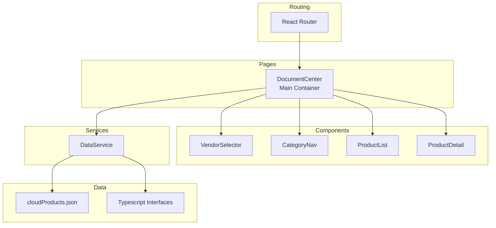
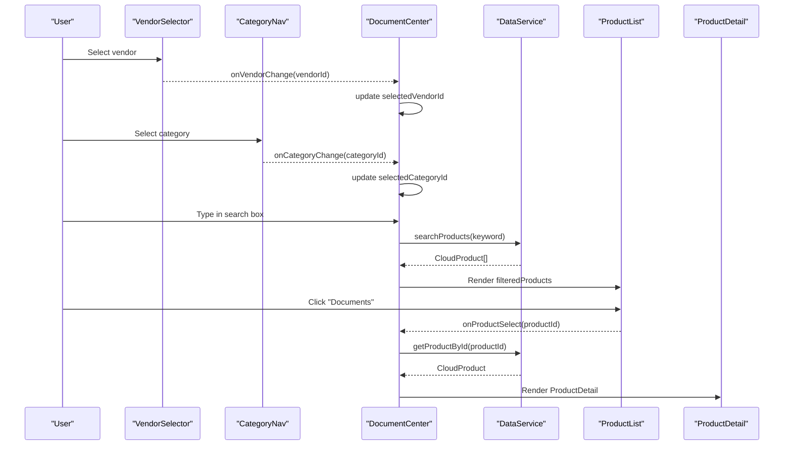
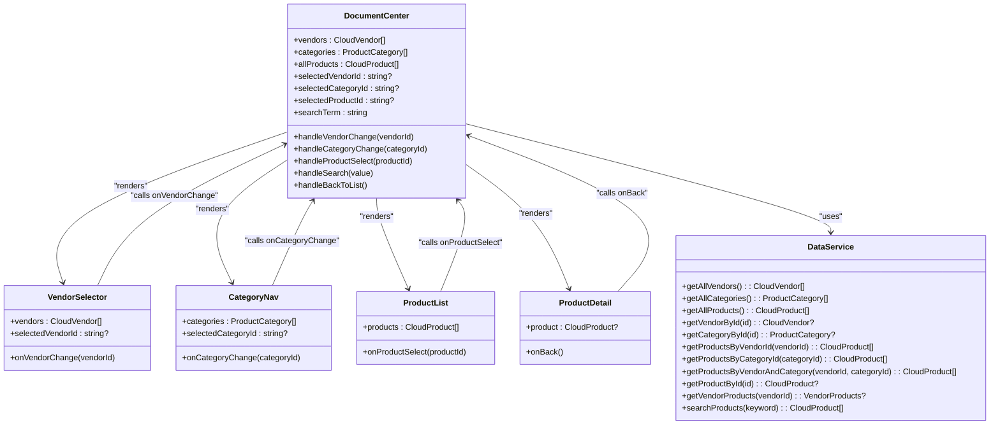
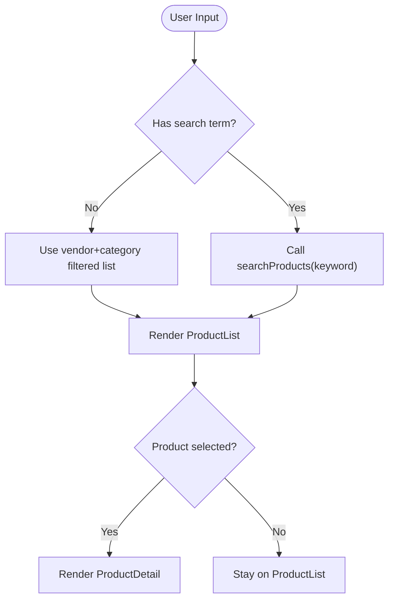
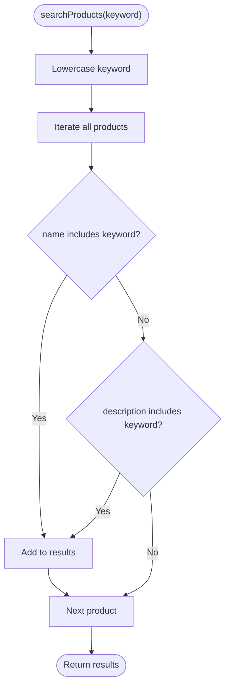
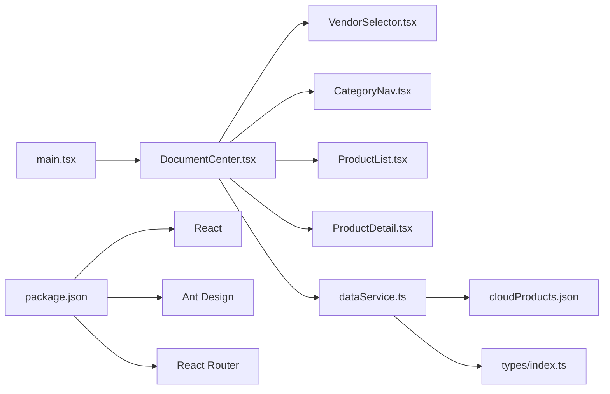
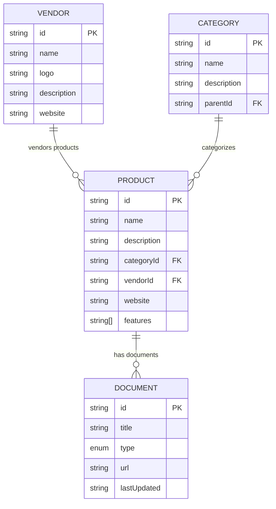

# Cloud Product Discovery System

<cite>
**Referenced Files in This Document**
- [DocumentCenter.tsx](file://web/src/pages/DocumentCenter.tsx)
- [dataService.ts](file://web/src/services/dataService.ts)
- [cloudProducts.json](file://web/src/data/cloudProducts.json)
- [index.ts](file://web/src/types/index.ts)
- [VendorSelector.tsx](file://web/src/components/VendorSelector.tsx)
- [CategoryNav.tsx](file://web/src/components/CategoryNav.tsx)
- [ProductList.tsx](file://web/src/components/ProductList.tsx)
- [ProductDetail.tsx](file://web/src/components/ProductDetail.tsx)
- [main.tsx](file://web/src/main.tsx)
- [package.json](file://web/package.json)
- [dataService.test.ts](file://web/src/services/dataService.test.ts)
- [CategoryNav.test.tsx](file://web/src/components/CategoryNav.test.tsx)
</cite>

## Table of Contents
1. [Introduction](#introduction)
2. [Project Structure](#project-structure)
3. [Core Components](#core-components)
4. [Architecture Overview](#architecture-overview)
5. [Detailed Component Analysis](#detailed-component-analysis)
6. [Dependency Analysis](#dependency-analysis)
7. [Performance Considerations](#performance-considerations)
8. [Troubleshooting Guide](#troubleshooting-guide)
9. [Conclusion](#conclusion)
10. [Appendices](#appendices)

## Introduction
This document describes the Cloud Product Discovery System, a React-based web application that enables users to discover cloud platform offerings across seven major vendors. It supports hierarchical category browsing, vendor selection, real-time search, and detailed product views. The system is structured around a central container page that composes reusable UI components and orchestrates state and data flows via a service layer. The data model is defined by TypeScript interfaces and backed by a JSON dataset containing vendors, categories, and products with associated documents.

## Project Structure
The project follows a component-driven structure with clear separation of concerns:
- Pages: Application shell and top-level containers
- Components: Reusable UI widgets for vendor selection, category navigation, product listing, and detail view
- Services: Centralized data access and transformation logic
- Types: Strongly typed interfaces for data contracts
- Data: Static JSON dataset with vendors, categories, and products
- Routing: Single-page routing configuration

**Diagram sources**
- [main.tsx:1-20](file://web/src/main.tsx#L1-L20)
- [DocumentCenter.tsx:1-145](file://web/src/pages/DocumentCenter.tsx#L1-L145)
- [VendorSelector.tsx:1-40](file://web/src/components/VendorSelector.tsx#L1-L40)
- [CategoryNav.tsx:1-57](file://web/src/components/CategoryNav.tsx#L1-L57)
- [ProductList.tsx:1-99](file://web/src/components/ProductList.tsx#L1-L99)
- [ProductDetail.tsx:1-124](file://web/src/components/ProductDetail.tsx#L1-L124)
- [dataService.ts:1-156](file://web/src/services/dataService.ts#L1-L156)
- [cloudProducts.json:1-800](file://web/src/data/cloudProducts.json#L1-L800)
- [index.ts:1-69](file://web/src/types/index.ts#L1-L69)

**Section sources**
- [main.tsx:1-20](file://web/src/main.tsx#L1-L20)
- [DocumentCenter.tsx:1-145](file://web/src/pages/DocumentCenter.tsx#L1-L145)

## Core Components
- DocumentCenter: The main container that loads data, manages state, applies filters, and renders either the product list or product detail view. It coordinates vendor and category selection, search input, and product selection events.
- VendorSelector: Renders a vertical radio group of vendors for quick vendor selection.
- CategoryNav: Renders a hierarchical tree of categories and handles selection events.
- ProductList: Displays products in a responsive grid with metadata, features, and document links.
- ProductDetail: Shows detailed information for a selected product, including features and documents.
- DataService: Provides methods to fetch vendors, categories, products, apply filters, and perform keyword search. It also transforms JSON documents into strongly typed document records.

Key responsibilities and interactions:
- State management: DocumentCenter maintains selected vendor, category, product, and search term using React hooks and memoization.
- Filtering pipeline: Filters by vendor and category first, then optionally applies keyword search.
- Navigation: Switches between list and detail views based on selection state.
- Data transformation: Converts raw JSON documents to typed records during initialization.

**Section sources**
- [DocumentCenter.tsx:15-145](file://web/src/pages/DocumentCenter.tsx#L15-L145)
- [VendorSelector.tsx:7-40](file://web/src/components/VendorSelector.tsx#L7-L40)
- [CategoryNav.tsx:7-57](file://web/src/components/CategoryNav.tsx#L7-L57)
- [ProductList.tsx:9-99](file://web/src/components/ProductList.tsx#L9-L99)
- [ProductDetail.tsx:8-124](file://web/src/components/ProductDetail.tsx#L8-L124)
- [dataService.ts:4-156](file://web/src/services/dataService.ts#L4-L156)

## Architecture Overview
The system uses a unidirectional data flow:
- UI components emit actions (selections, search input).
- DocumentCenter computes derived state and filtered datasets.
- DataService exposes pure data accessors and transformations.
- JSON dataset supplies immutable base data.

**Diagram sources**
- [DocumentCenter.tsx:32-78](file://web/src/pages/DocumentCenter.tsx#L32-L78)
- [dataService.ts:142-151](file://web/src/services/dataService.ts#L142-L151)
- [ProductList.tsx:36-43](file://web/src/components/ProductList.tsx#L36-L43)
- [ProductDetail.tsx:13-27](file://web/src/components/ProductDetail.tsx#L13-L27)

## Detailed Component Analysis

### DocumentCenter: Main Container
Responsibilities:
- Load base data from DataService.
- Manage state for selected vendor, category, product, and search term.
- Compute filtered product lists using vendor/category filters and optional keyword search.
- Render either ProductList or ProductDetail based on selection.
- Handle user interactions: vendor change, category change, product selection, search input, and back-to-list.

Filtering logic:
- Vendor and category filters are combined with AND semantics.
- Keyword search is applied only when non-empty; otherwise, the vendor+category filtered set is used.

Rendering logic:
- Uses Ant Design layout primitives for header, sider, and content areas.
- Conditionally renders ProductDetail when a product is selected; otherwise renders ProductList.

State management:
- Uses React hooks for local state and useMemo for derived computations to avoid unnecessary re-renders.

**Section sources**
- [DocumentCenter.tsx:15-145](file://web/src/pages/DocumentCenter.tsx#L15-L145)

### VendorSelector: Vendor Selection Widget
Responsibilities:
- Accepts a list of vendors and current selection.
- Renders a vertical radio group with vendor names.
- Emits selection changes to the parent container.

Interaction pattern:
- Uses Ant Design Radio.Group with button-style and small size for compactness.

**Section sources**
- [VendorSelector.tsx:7-40](file://web/src/components/VendorSelector.tsx#L7-L40)

### CategoryNav: Hierarchical Category Navigation
Responsibilities:
- Accepts a flat or nested category list.
- Recursively builds a tree structure suitable for Ant Design Tree.
- Handles selection events and propagates selected category ID to the parent.

Tree generation:
- Transforms category arrays into Ant Design-compatible nodes with titles and keys.
- Supports nested children recursively.

Selection behavior:
- Tracks currently selected key and updates on user selection.

**Section sources**
- [CategoryNav.tsx:7-57](file://web/src/components/CategoryNav.tsx#L7-L57)

### ProductList: Product Grid and Metadata Display
Responsibilities:
- Accepts a list of products to render.
- Displays product name, description, features, and related documents.
- Provides action buttons to open official websites and view documentation.
- Supports responsive grid layout using Ant Design layout primitives.

Document rendering:
- Maps document types to localized labels.
- Displays document title, type tag, last updated date, and external link.

**Section sources**
- [ProductList.tsx:9-99](file://web/src/components/ProductList.tsx#L9-L99)

### ProductDetail: Detailed Product View
Responsibilities:
- Accepts a single product and a back handler.
- Displays product description, category, website, features, and documents.
- Provides a back button to return to the list view.
- Gracefully handles missing product state.

Document rendering:
- Uses descriptive items and tags to present document metadata with color-coded types.

**Section sources**
- [ProductDetail.tsx:8-124](file://web/src/components/ProductDetail.tsx#L8-L124)

### DataService: Data Access and Transformation Layer
Responsibilities:
- Loads and normalizes data from cloudProducts.json.
- Exposes methods to fetch vendors, categories, products, and combinations.
- Implements keyword search across product names and descriptions.
- Transforms JSON documents into typed records with validated document types.

Data normalization:
- Converts raw JSON documents to typed ProductDocument with explicit type union.
- Ensures document type safety at runtime.

Category lookup:
- Provides recursive category search supporting nested hierarchies.

Vendor-specific aggregation:
- Builds vendor-centric views by filtering categories and products relevant to a given vendor.

Search algorithm:
- Case-insensitive substring match on product name and description.

**Section sources**
- [dataService.ts:4-156](file://web/src/services/dataService.ts#L4-L156)
- [cloudProducts.json:1-800](file://web/src/data/cloudProducts.json#L1-L800)
- [index.ts:17-60](file://web/src/types/index.ts#L17-L60)

### Data Types and Contracts
The system defines strict interfaces for vendors, categories, products, and documents:
- CloudVendor: identifier, name, logo, description, website.
- ProductCategory: identifier, name, description, optional parent/children for hierarchy.
- CloudProduct: identifier, name, description, vendor/category identifiers, website, features, documents.
- ProductDocument: typed document with id, title, type, url, lastUpdated.
- VendorProducts: bundle of vendor, relevant categories, and products.
- AppState: shape of state managed by DocumentCenter.

These types ensure compile-time safety and clear contracts between components and the service layer.

**Section sources**
- [index.ts:1-69](file://web/src/types/index.ts#L1-L69)

## Architecture Overview

**Diagram sources**
- [DocumentCenter.tsx:15-145](file://web/src/pages/DocumentCenter.tsx#L15-L145)
- [VendorSelector.tsx:7-40](file://web/src/components/VendorSelector.tsx#L7-L40)
- [CategoryNav.tsx:7-57](file://web/src/components/CategoryNav.tsx#L7-L57)
- [ProductList.tsx:9-99](file://web/src/components/ProductList.tsx#L9-L99)
- [ProductDetail.tsx:8-124](file://web/src/components/ProductDetail.tsx#L8-L124)
- [dataService.ts:25-151](file://web/src/services/dataService.ts#L25-L151)

## Detailed Component Analysis

### Filtering Workflows
The filtering pipeline combines vendor, category, and keyword search:
- Initial vendor/category filter: Products matching both vendorId and categoryId.
- Optional keyword filter: If searchTerm is non-empty, searchProducts is invoked; otherwise, pass-through the vendor+category filtered set.

**Diagram sources**
- [DocumentCenter.tsx:32-78](file://web/src/pages/DocumentCenter.tsx#L32-L78)
- [dataService.ts:142-151](file://web/src/services/dataService.ts#L142-L151)

### Search Algorithm Details
- Normalization: Keyword is lowercased for case-insensitive comparison.
- Matching: Products are included if either name or description contains the keyword.
- Complexity: O(n) per search operation across all products.

**Diagram sources**
- [dataService.ts:142-151](file://web/src/services/dataService.ts#L142-L151)

### Product Detail Rendering
- Back navigation: Returns to list view by clearing selected product.
- Empty state: Displays a message when no product is selected.
- Document rendering: Iterates over typed documents, mapping types to labels and colors.

**Section sources**
- [ProductDetail.tsx:13-124](file://web/src/components/ProductDetail.tsx#L13-L124)

### Category Organization and Navigation
- Hierarchical categories: Parent-child relationships enable nested navigation.
- Tree rendering: CategoryNav converts nested categories into Ant Design Tree nodes.
- Selection propagation: Selected category ID is passed up to DocumentCenter.

**Section sources**
- [CategoryNav.tsx:18-57](file://web/src/components/CategoryNav.tsx#L18-L57)
- [cloudProducts.json:53-254](file://web/src/data/cloudProducts.json#L53-L254)

### Multi-Vendor Support
- Seven vendors supported out of the box: Tencent Cloud, Huawei Cloud, Volcengine, Alibaba Cloud, AWS, Azure, Google Cloud.
- Vendor selection drives filtering of products and can be extended by adding entries to the JSON dataset.
- Vendor-specific aggregation: DataService can compute vendor-centric views by filtering relevant categories and products.

**Section sources**
- [cloudProducts.json:2-51](file://web/src/data/cloudProducts.json#L2-L51)
- [dataService.ts:105-140](file://web/src/services/dataService.ts#L105-L140)

### Extensibility Patterns
- Adding a new vendor: Extend vendors array in cloudProducts.json with id, name, logo, description, website.
- Adding a new category: Extend categories array with id, name, description, and optional children; ensure categoryId references align with existing products.
- Adding a new product: Append to products array with proper vendorId, categoryId, and documents.
- Extending document types: Update ProductDocument.type union in types/index.ts and normalize in DataService.

**Section sources**
- [cloudProducts.json:255-2532](file://web/src/data/cloudProducts.json#L255-L2532)
- [index.ts:17-23](file://web/src/types/index.ts#L17-L23)
- [dataService.ts:13-19](file://web/src/services/dataService.ts#L13-L19)

## Dependency Analysis

**Diagram sources**
- [DocumentCenter.tsx:1-145](file://web/src/pages/DocumentCenter.tsx#L1-L145)
- [VendorSelector.tsx:1-40](file://web/src/components/VendorSelector.tsx#L1-L40)
- [CategoryNav.tsx:1-57](file://web/src/components/CategoryNav.tsx#L1-L57)
- [ProductList.tsx:1-99](file://web/src/components/ProductList.tsx#L1-L99)
- [ProductDetail.tsx:1-124](file://web/src/components/ProductDetail.tsx#L1-L124)
- [dataService.ts:1-156](file://web/src/services/dataService.ts#L1-L156)
- [cloudProducts.json:1-800](file://web/src/data/cloudProducts.json#L1-L800)
- [index.ts:1-69](file://web/src/types/index.ts#L1-L69)
- [main.tsx:1-20](file://web/src/main.tsx#L1-L20)
- [package.json:15-24](file://web/package.json#L15-L24)

**Section sources**
- [package.json:15-24](file://web/package.json#L15-L24)

## Performance Considerations
- Memoization: DocumentCenter uses useMemo to compute filteredByVendorAndCategory and filteredProducts, preventing redundant recomputation when dependencies are unchanged.
- Search complexity: Keyword search is O(n); consider indexing or debouncing for large datasets.
- Rendering: ProductList uses a responsive grid; virtualization could improve performance for very large lists.
- Data loading: All data is loaded at startup; lazy-loading or pagination may be considered for scalability.
- Type conversion: Document type normalization occurs once during initialization; keep this cost minimal by avoiding repeated conversions.

[No sources needed since this section provides general guidance]

## Troubleshooting Guide
Common issues and resolutions:
- No products displayed after selecting vendor/category: Verify vendorId and categoryId values match entries in cloudProducts.json.
- Search yields no results: Confirm keyword matches product name or description; note case-insensitive matching.
- Category tree not expanding: Ensure category children arrays are properly structured in cloudProducts.json.
- Vendor selector not updating: Check that onVendorChange is wired correctly and selectedVendorId is managed in DocumentCenter.
- Product detail shows "not found": Occurs when selectedProductId does not correspond to any product; ensure product selection is handled correctly.

Testing coverage:
- Unit tests validate DataService methods for fetching vendors, categories, products, and search behavior.
- Component tests verify CategoryNav rendering and selection callbacks.

**Section sources**
- [dataService.test.ts:1-170](file://web/src/services/dataService.test.ts#L1-L170)
- [CategoryNav.test.tsx:1-112](file://web/src/components/CategoryNav.test.tsx#L1-L112)

## Conclusion
The Cloud Product Discovery System provides a clean, extensible foundation for exploring cloud offerings across multiple vendors. Its component-based architecture, centralized data service, and typed contracts enable straightforward maintenance and enhancement. The filtering and search mechanisms are efficient for the current dataset scale, while the hierarchical category navigation offers intuitive exploration. Extending the system involves updating the JSON dataset and ensuring type safety through the existing interfaces.

[No sources needed since this section summarizes without analyzing specific files]

## Appendices

### Data Model Diagram

**Diagram sources**
- [index.ts:1-69](file://web/src/types/index.ts#L1-L69)
- [cloudProducts.json:255-2532](file://web/src/data/cloudProducts.json#L255-L2532)