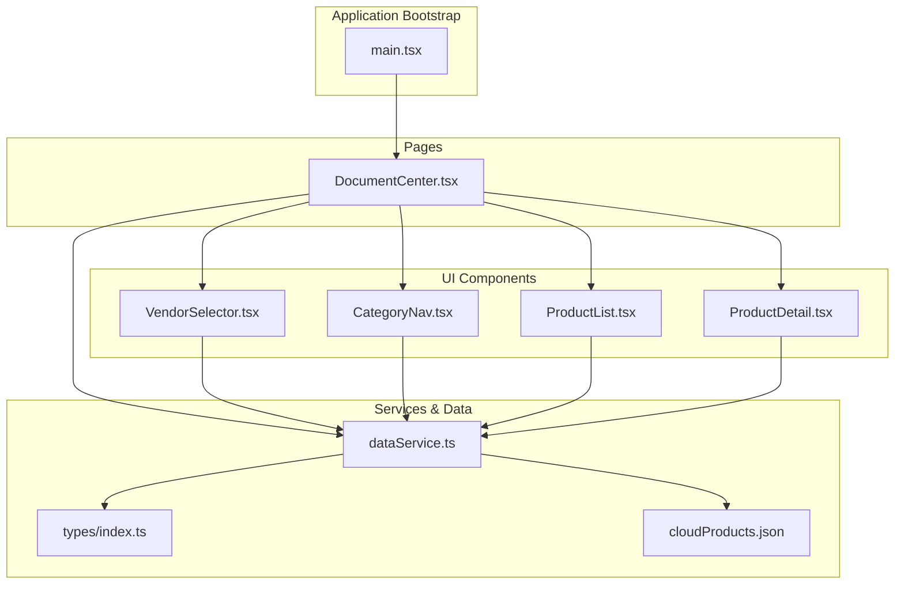
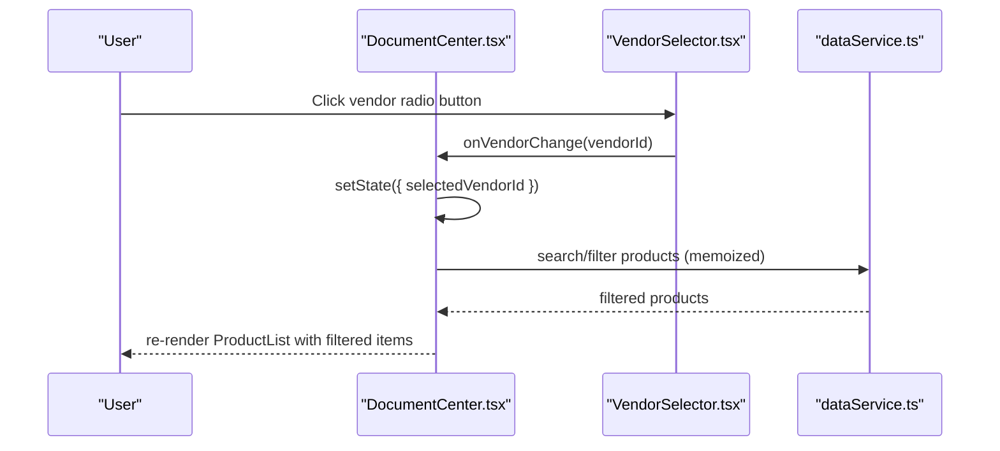
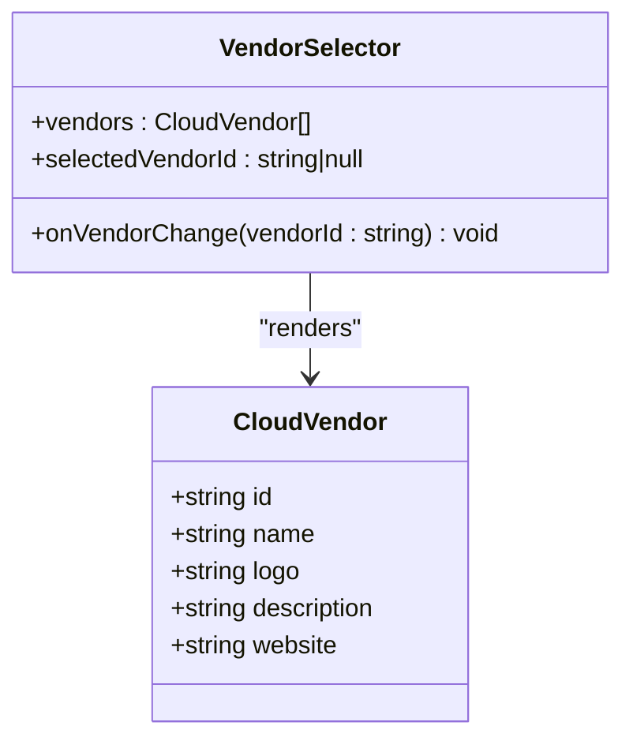
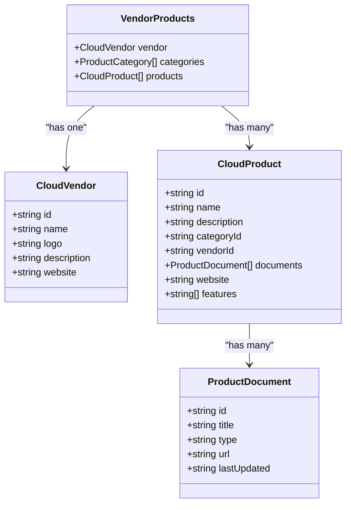
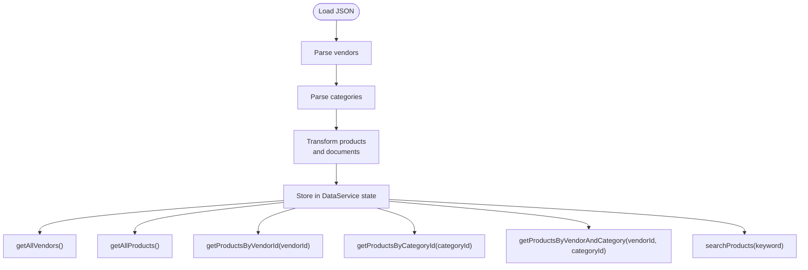
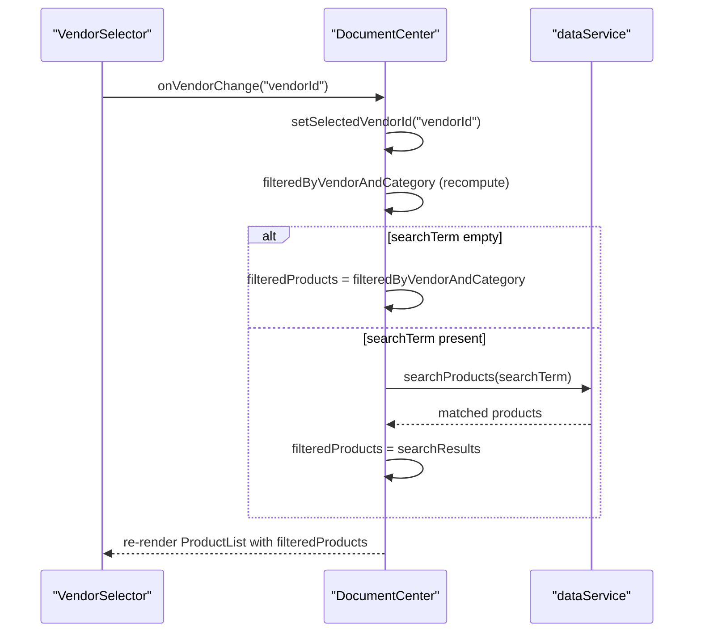
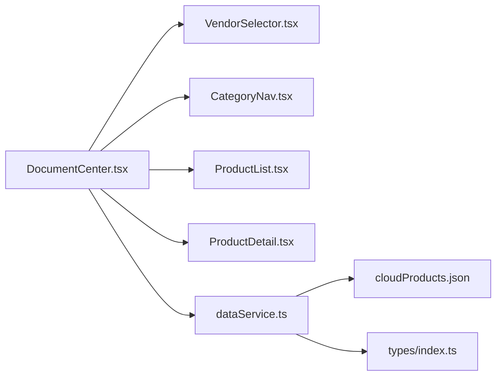
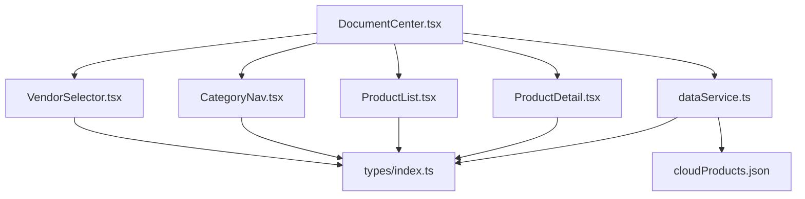

# Multi-Vendor Support

<cite>
**Referenced Files in This Document**
- [VendorSelector.tsx](file://web/src/components/VendorSelector.tsx)
- [VendorSelector.test.tsx](file://web/src/components/VendorSelector.test.tsx)
- [dataService.ts](file://web/src/services/dataService.ts)
- [cloudProducts.json](file://web/src/data/cloudProducts.json)
- [types/index.ts](file://web/src/types/index.ts)
- [DocumentCenter.tsx](file://web/src/pages/DocumentCenter.tsx)
- [CategoryNav.tsx](file://web/src/components/CategoryNav.tsx)
- [ProductList.tsx](file://web/src/components/ProductList.tsx)
- [ProductDetail.tsx](file://web/src/components/ProductDetail.tsx)
- [main.tsx](file://web/src/main.tsx)
</cite>

## Table of Contents
1. [Introduction](#introduction)
2. [Project Structure](#project-structure)
3. [Core Components](#core-components)
4. [Architecture Overview](#architecture-overview)
5. [Detailed Component Analysis](#detailed-component-analysis)
6. [Dependency Analysis](#dependency-analysis)
7. [Performance Considerations](#performance-considerations)
8. [Troubleshooting Guide](#troubleshooting-guide)
9. [Conclusion](#conclusion)

## Introduction
This document explains the multi-vendor support system implemented for seven cloud providers: AWS, Azure, Google Cloud, Alibaba Cloud, Tencent Cloud, Huawei Cloud, and Volcengine. It covers the VendorSelector component architecture, vendor data model, filtering logic, data loading from the data service, UI rendering, state management, vendor selection workflows, data transformation for vendor lists, integration with product filtering, vendor metadata handling, icon representation, extensibility for adding new cloud providers, and vendor change handlers with state synchronization patterns.

## Project Structure
The multi-vendor system spans UI components, a data service, type definitions, and a centralized JSON dataset. The main application initializes routing and locale configuration, while the DocumentCenter orchestrates state and renders the vendor selector, category navigation, and product list/detail views.

**Diagram sources**
- [main.tsx:1-20](file://web/src/main.tsx#L1-L20)
- [DocumentCenter.tsx:1-145](file://web/src/pages/DocumentCenter.tsx#L1-L145)
- [VendorSelector.tsx:1-40](file://web/src/components/VendorSelector.tsx#L1-L40)
- [CategoryNav.tsx:1-57](file://web/src/components/CategoryNav.tsx#L1-L57)
- [ProductList.tsx:1-99](file://web/src/components/ProductList.tsx#L1-L99)
- [ProductDetail.tsx:1-124](file://web/src/components/ProductDetail.tsx#L1-L124)
- [dataService.ts:1-156](file://web/src/services/dataService.ts#L1-L156)
- [types/index.ts:1-69](file://web/src/types/index.ts#L1-L69)
- [cloudProducts.json:1-800](file://web/src/data/cloudProducts.json#L1-L800)

**Section sources**
- [main.tsx:1-20](file://web/src/main.tsx#L1-L20)
- [DocumentCenter.tsx:1-145](file://web/src/pages/DocumentCenter.tsx#L1-L145)

## Core Components
- VendorSelector: Renders a vertical radio group of vendors and emits selection events.
- CategoryNav: Renders hierarchical categories as a selectable tree.
- ProductList: Displays products as cards with metadata and links to documentation.
- ProductDetail: Shows detailed product information and related documents.
- dataService: Centralized data access with vendor, category, and product queries plus search.
- Types: Defines CloudVendor, ProductCategory, CloudProduct, VendorProducts, and AppState.

Key responsibilities:
- VendorSelector manages vendor selection state and delegates changes to parent via onVendorChange.
- DocumentCenter composes state and passes props to child components.
- dataService loads and transforms JSON data into typed models and provides filtering/search capabilities.

**Section sources**
- [VendorSelector.tsx:1-40](file://web/src/components/VendorSelector.tsx#L1-L40)
- [CategoryNav.tsx:1-57](file://web/src/components/CategoryNav.tsx#L1-L57)
- [ProductList.tsx:1-99](file://web/src/components/ProductList.tsx#L1-L99)
- [ProductDetail.tsx:1-124](file://web/src/components/ProductDetail.tsx#L1-L124)
- [dataService.ts:1-156](file://web/src/services/dataService.ts#L1-L156)
- [types/index.ts:1-69](file://web/src/types/index.ts#L1-L69)

## Architecture Overview
The system follows a unidirectional data flow:
- Data initialization: dataService reads cloudProducts.json and exposes typed getters.
- UI composition: DocumentCenter initializes state and computes derived data (filtered products).
- Event handling: VendorSelector triggers handleVendorChange, which updates selectedVendorId.
- Filtering: Derived filters combine vendor, category, and search terms.
- Rendering: Components receive props and render vendor, category, and product views.

**Diagram sources**
- [DocumentCenter.tsx:55-78](file://web/src/pages/DocumentCenter.tsx#L55-L78)
- [VendorSelector.tsx:13-37](file://web/src/components/VendorSelector.tsx#L13-L37)
- [dataService.ts:145-151](file://web/src/services/dataService.ts#L145-L151)

## Detailed Component Analysis

### VendorSelector Component
Purpose:
- Render a set of vendor radio buttons.
- Reflect current selection via value prop.
- Emit vendorId on change.

Implementation highlights:
- Uses Ant Design Radio.Group/Radio.Button for consistent UX.
- Props-driven: vendors array, selectedVendorId, onVendorChange callback.
- No internal state; purely controlled component.

**Diagram sources**
- [VendorSelector.tsx:7-17](file://web/src/components/VendorSelector.tsx#L7-L17)
- [types/index.ts:1-7](file://web/src/types/index.ts#L1-L7)

**Section sources**
- [VendorSelector.tsx:13-37](file://web/src/components/VendorSelector.tsx#L13-L37)
- [VendorSelector.test.tsx:22-71](file://web/src/components/VendorSelector.test.tsx#L22-L71)

### Vendor Data Model and Metadata
Data model:
- CloudVendor: id, name, logo, description, website.
- CloudProduct: id, name, description, categoryId, vendorId, documents, website, features.
- ProductDocument: id, title, type, url, lastUpdated.
- VendorProducts: vendor, categories, products.

Metadata handling:
- Vendor metadata includes logo and website for external linking.
- Product documents include type enumeration mapped to localized labels.
- Features and documents enrich product presentation.

**Diagram sources**
- [types/index.ts:1-60](file://web/src/types/index.ts#L1-L60)

**Section sources**
- [types/index.ts:1-60](file://web/src/types/index.ts#L1-L60)

### Vendor Loading and Transformation
Data loading:
- dataService constructs in-memory collections from cloudProducts.json.
- JSONProduct and JSONProductDocument are transformed to typed CloudProduct and ProductDocument with strict type enforcement for document.type.

Filtering logic:
- getProductsByVendorId filters products by vendorId.
- getProductsByCategoryId filters by categoryId.
- getProductsByVendorAndCategory combines both filters.
- searchProducts performs case-insensitive substring matching on name and description.

**Diagram sources**
- [dataService.ts:9-20](file://web/src/services/dataService.ts#L9-L20)
- [dataService.ts:75-93](file://web/src/services/dataService.ts#L75-L93)
- [dataService.ts:145-151](file://web/src/services/dataService.ts#L145-L151)

**Section sources**
- [dataService.ts:9-20](file://web/src/services/dataService.ts#L9-L20)
- [dataService.ts:75-93](file://web/src/services/dataService.ts#L75-L93)
- [dataService.ts:145-151](file://web/src/services/dataService.ts#L145-L151)

### Vendor Selection Workflows and State Synchronization
State management:
- DocumentCenter maintains AppState: vendors, selectedVendorId, selectedCategoryId, selectedProductId, searchTerm.
- VendorSelector receives vendors and selectedVendorId, and calls onVendorChange(vendorId).
- handleVendorChange updates selectedVendorId, causing memoized filters to recalculate.

Filtering pipeline:
- filteredByVendorAndCategory applies vendor and category filters.
- filteredProducts applies search term or falls back to pre-filtered list.
- selectedProduct resolves to a single product when selectedProductId is present.

**Diagram sources**
- [DocumentCenter.tsx:55-78](file://web/src/pages/DocumentCenter.tsx#L55-L78)
- [dataService.ts:145-151](file://web/src/services/dataService.ts#L145-L151)

**Section sources**
- [DocumentCenter.tsx:21-78](file://web/src/pages/DocumentCenter.tsx#L21-L78)

### Integration with Product Filtering and Category Navigation
- CategoryNav displays hierarchical categories and updates selectedCategoryId via onCategoryChange.
- ProductList renders filtered CloudProduct items with features and document summaries.
- ProductDetail shows expanded product details and related documents.

**Diagram sources**
- [DocumentCenter.tsx:15-142](file://web/src/pages/DocumentCenter.tsx#L15-L142)
- [CategoryNav.tsx:13-54](file://web/src/components/CategoryNav.tsx#L13-L54)
- [ProductList.tsx:14-96](file://web/src/components/ProductList.tsx#L14-L96)
- [ProductDetail.tsx:13-121](file://web/src/components/ProductDetail.tsx#L13-L121)
- [dataService.ts:1-156](file://web/src/services/dataService.ts#L1-156)
- [cloudProducts.json:1-800](file://web/src/data/cloudProducts.json#L1-L800)
- [types/index.ts:1-69](file://web/src/types/index.ts#L1-L69)

**Section sources**
- [CategoryNav.tsx:13-54](file://web/src/components/CategoryNav.tsx#L13-L54)
- [ProductList.tsx:14-96](file://web/src/components/ProductList.tsx#L14-L96)
- [ProductDetail.tsx:13-121](file://web/src/components/ProductDetail.tsx#L13-L121)

### Extensibility for New Cloud Providers
To add a new provider:
- Extend cloudProducts.json with a new vendor entry under vendors (id, name, logo, description, website).
- Add products with vendorId matching the new vendor’s id.
- Ensure product documents’ type values are valid enumerations ('guide' | 'api' | 'faq' | 'tutorial' | 'whitepaper').
- No code changes required in TypeScript types or components; dataService and UI will automatically include the new vendor and its products.

Evidence from dataset:
- Seven existing vendors are defined in cloudProducts.json.
- Volcengine entries demonstrate the pattern for adding new vendorId references across products and documents.

**Section sources**
- [cloudProducts.json:2532-2532](file://web/src/data/cloudProducts.json#L2532-L2532)
- [dataService.ts:13-19](file://web/src/services/dataService.ts#L13-L19)

## Dependency Analysis
- VendorSelector depends on CloudVendor type and Ant Design components.
- DocumentCenter composes state and passes props to VendorSelector, CategoryNav, ProductList, and ProductDetail.
- dataService depends on types and cloudProducts.json; it exposes typed getters and computed results.
- ProductList and ProductDetail depend on CloudProduct and ProductDocument types.

**Diagram sources**
- [VendorSelector.tsx:1-40](file://web/src/components/VendorSelector.tsx#L1-L40)
- [CategoryNav.tsx:1-57](file://web/src/components/CategoryNav.tsx#L1-L57)
- [ProductList.tsx:1-99](file://web/src/components/ProductList.tsx#L1-L99)
- [ProductDetail.tsx:1-124](file://web/src/components/ProductDetail.tsx#L1-L124)
- [DocumentCenter.tsx:1-145](file://web/src/pages/DocumentCenter.tsx#L1-L145)
- [dataService.ts:1-156](file://web/src/services/dataService.ts#L1-L156)
- [types/index.ts:1-69](file://web/src/types/index.ts#L1-L69)
- [cloudProducts.json:1-800](file://web/src/data/cloudProducts.json#L1-L800)

**Section sources**
- [types/index.ts:1-69](file://web/src/types/index.ts#L1-L69)
- [dataService.ts:1-156](file://web/src/services/dataService.ts#L1-L156)

## Performance Considerations
- Memoization: DocumentCenter uses useMemo to avoid recomputing filtered lists unnecessarily.
- Single data load: dataService initializes once and caches parsed data in memory.
- Efficient filtering: filter arrays and Set-based lookups minimize repeated scans.
- UI rendering: Ant Design components are optimized; virtualization is not needed given typical dataset sizes.

Recommendations:
- For very large datasets, consider pagination or virtualized lists in ProductList.
- Debounce search input to reduce frequent recomputation.
- Lazy-load vendor/category icons if network latency becomes a concern.

[No sources needed since this section provides general guidance]

## Troubleshooting Guide
Common issues and resolutions:
- Vendor not appearing: Verify vendor id exists in cloudProducts.json vendors and that products reference the same id.
- No products shown after vendor selection: Confirm products exist for the selected vendorId and that filtering logic is not excluding them.
- Search yields no results: Ensure keywords match product names or descriptions; confirm searchProducts is invoked when searchTerm is non-empty.
- Icon/link issues: Validate logo URLs and website URLs in vendor entries; ensure external links open in new tabs.

Testing coverage:
- VendorSelector tests assert rendering, selection callbacks, and checked state.
- dataService tests validate vendor retrieval and category traversal.

**Section sources**
- [VendorSelector.test.tsx:22-71](file://web/src/components/VendorSelector.test.tsx#L22-L71)
- [dataService.ts:25-100](file://web/src/services/dataService.ts#L25-L100)

## Conclusion
The multi-vendor support system cleanly separates concerns across UI components, a typed data service, and a structured JSON dataset. VendorSelector integrates seamlessly with DocumentCenter’s state, enabling robust vendor and category filtering alongside search. The architecture is extensible—adding new cloud providers requires only updating the dataset. The system balances simplicity with maintainability and offers clear pathways for future enhancements such as debounced search and virtualized rendering.