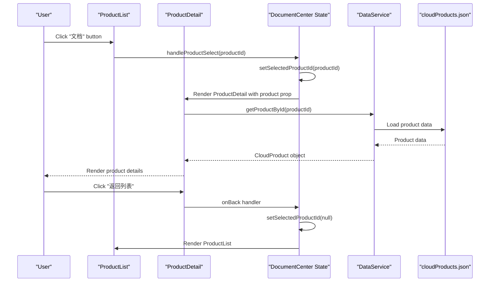
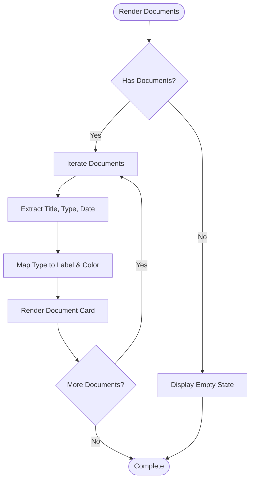
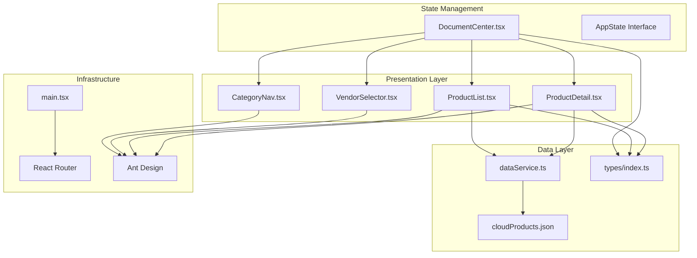

# Product Detail View

<cite>
**Referenced Files in This Document**
- [ProductDetail.tsx](file://web/src/components/ProductDetail.tsx)
- [ProductList.tsx](file://web/src/components/ProductList.tsx)
- [DocumentCenter.tsx](file://web/src/pages/DocumentCenter.tsx)
- [dataService.ts](file://web/src/services/dataService.ts)
- [cloudProducts.json](file://web/src/data/cloudProducts.json)
- [index.ts](file://web/src/types/index.ts)
- [main.tsx](file://web/src/main.tsx)
- [ProductDetail.test.tsx](file://web/src/components/ProductDetail.test.tsx)
</cite>

## Table of Contents
1. [Introduction](#introduction)
2. [Project Structure](#project-structure)
3. [Core Components](#core-components)
4. [Architecture Overview](#architecture-overview)
5. [Detailed Component Analysis](#detailed-component-analysis)
6. [Dependency Analysis](#dependency-analysis)
7. [Performance Considerations](#performance-considerations)
8. [Troubleshooting Guide](#troubleshooting-guide)
9. [Conclusion](#conclusion)

## Introduction
This document provides comprehensive technical documentation for the Product Detail View system. It explains how the ProductDetail component renders product information, handles document attachments, and integrates with the main filtering system. The documentation covers data structures, navigation patterns, responsive design considerations, loading states, error handling, and testing strategies.

## Project Structure
The Product Detail View system is part of a React application built with Ant Design and TypeScript. The system centers around a single-page application with routing managed by react-router-dom. The main application layout is implemented in the DocumentCenter page, which orchestrates vendor selection, category navigation, product listing, and product detail rendering.

```mermaid
graph TB
Main["main.tsx<br/>Application Entry Point"] --> Router["React Router<br/>BrowserRouter"]
Router --> Routes["Routes<br/>"/" and "/documents""]
Routes --> DocCenter["DocumentCenter.tsx<br/>Main Application Page"]
DocCenter --> VendorSel["VendorSelector.tsx<br/>Vendor Selection"]
DocCenter --> CatNav["CategoryNav.tsx<br/>Category Navigation"]
DocCenter --> ProductList["ProductList.tsx<br/>Product Listing"]
DocCenter --> ProductDetail["ProductDetail.tsx<br/>Product Detail View"]
DocCenter --> DataService["dataService.ts<br/>Data Access Layer"]
DataService --> JSONData["cloudProducts.json<br/>Static Product Data"]
ProductDetail --> Types["types/index.ts<br/>Type Definitions"]
```

**Diagram sources**
- [main.tsx:1-20](file://web/src/main.tsx#L1-L20)
- [DocumentCenter.tsx:15-142](file://web/src/pages/DocumentCenter.tsx#L15-L142)
- [ProductDetail.tsx:1-124](file://web/src/components/ProductDetail.tsx#L1-L124)
- [dataService.ts:1-156](file://web/src/services/dataService.ts#L1-L156)
- [cloudProducts.json:1-800](file://web/src/data/cloudProducts.json#L1-L800)
- [index.ts:1-69](file://web/src/types/index.ts#L1-L69)

**Section sources**
- [main.tsx:1-20](file://web/src/main.tsx#L1-L20)
- [DocumentCenter.tsx:15-142](file://web/src/pages/DocumentCenter.tsx#L15-L142)

## Core Components
The Product Detail View system consists of several interconnected components that work together to present product information and manage navigation:

### ProductDetail Component
The ProductDetail component is responsible for rendering individual product information with a clean, card-based layout. It displays product metadata, features, and associated documentation resources.

### Data Service Layer
The dataService provides centralized access to product data, including vendors, categories, and products. It handles data transformation and filtering operations.

### State Management
The DocumentCenter page manages application state including selected vendor, category, product, and search terms. It coordinates navigation between list and detail views.

**Section sources**
- [ProductDetail.tsx:8-124](file://web/src/components/ProductDetail.tsx#L8-L124)
- [dataService.ts:4-156](file://web/src/services/dataService.ts#L4-L156)
- [DocumentCenter.tsx:21-78](file://web/src/pages/DocumentCenter.tsx#L21-L78)

## Architecture Overview
The Product Detail View follows a unidirectional data flow pattern where state is managed at the application level and passed down to components as props. The system uses React hooks for state management and Ant Design components for UI presentation.



**Diagram sources**
- [DocumentCenter.tsx:65-73](file://web/src/pages/DocumentCenter.tsx#L65-L73)
- [ProductDetail.tsx:13-27](file://web/src/components/ProductDetail.tsx#L13-L27)
- [dataService.ts:98-100](file://web/src/services/dataService.ts#L98-L100)

## Detailed Component Analysis

### ProductDetail Component Implementation
The ProductDetail component implements a comprehensive product information display system with the following key features:

#### Data Structure and Props
The component expects a CloudProduct object with the following structure:
- `id`: Unique product identifier
- `name`: Product display name
- `description`: Product description text
- `categoryId`: Category identifier for categorization
- `vendorId`: Vendor identifier for vendor association
- `website`: Official product website URL
- `features`: Array of product feature strings
- `documents`: Array of ProductDocument objects containing documentation resources

#### Document Attachment Handling
The component includes sophisticated document attachment rendering with type-based categorization and visual indicators:



**Diagram sources**
- [ProductDetail.tsx:97-117](file://web/src/components/ProductDetail.tsx#L97-L117)
- [ProductDetail.tsx:29-49](file://web/src/components/ProductDetail.tsx#L29-L49)

#### Product Information Display
The component renders product information using Ant Design's Card and Descriptions components, providing structured presentation of:
- Product title with vendor branding
- Description text with secondary styling
- Category information with formatted display
- Website link with external resource indicator
- Feature tags with blue color scheme
- Document listings with type-based color coding

#### Navigation Patterns
The component implements two primary navigation patterns:
1. Back navigation using a left arrow button that triggers the onBack callback
2. External navigation to product websites using target="_blank" for security

**Section sources**
- [ProductDetail.tsx:13-124](file://web/src/components/ProductDetail.tsx#L13-L124)
- [index.ts:45-54](file://web/src/types/index.ts#L45-L54)

### Data Service Integration
The dataService provides essential data access capabilities for the Product Detail View:

#### Data Loading and Transformation
The service loads static JSON data and performs type-safe transformations:
- Converts JSONProductDocument to ProductDocument with strict type enforcement
- Maintains type safety for document types ('guide' | 'api' | 'faq' | 'tutorial' | 'whitepaper')
- Provides efficient lookup mechanisms for products, vendors, and categories

#### Filtering and Search Capabilities
The service implements comprehensive filtering:
- Vendor-based filtering using vendorId matching
- Category-based filtering using categoryId matching
- Combined vendor-category filtering for precise product selection
- Full-text search across product names and descriptions

**Section sources**
- [dataService.ts:9-20](file://web/src/services/dataService.ts#L9-L20)
- [dataService.ts:75-93](file://web/src/services/dataService.ts#L75-L93)
- [dataService.ts:145-151](file://web/src/services/dataService.ts#L145-L151)

### State Management and Navigation
The DocumentCenter page serves as the central state manager for the Product Detail View system:

#### State Variables
- `selectedVendorId`: Currently selected vendor for filtering
- `selectedCategoryId`: Currently selected category for filtering
- `selectedProductId`: Currently selected product for detail view
- `searchTerm`: Current search query string

#### Navigation Handlers
The component provides handlers for all navigation scenarios:
- `handleProductSelect`: Transitions from list view to detail view
- `handleBackToList`: Returns from detail view to list view
- `handleVendorChange`: Updates vendor selection state
- `handleCategoryChange`: Updates category selection state
- `handleSearch`: Manages search term updates

**Section sources**
- [DocumentCenter.tsx:21-78](file://web/src/pages/DocumentCenter.tsx#L21-L78)
- [DocumentCenter.tsx:127-137](file://web/src/pages/DocumentCenter.tsx#L127-L137)

### Responsive Design Implementation
The Product Detail View implements responsive design through multiple layers:

#### Ant Design Grid System
The layout utilizes Ant Design's responsive grid system with breakpoints:
- Extra small: 24 columns (single column)
- Small: 12 columns (two columns)
- Medium: 8 columns (three columns)
- Large: 8 columns (four columns)
- Extra large: 6 columns (four columns)
- Extra extra large: 6 columns (four columns)

#### Component-Level Responsiveness
Individual components adapt to different screen sizes:
- Product cards adjust column count based on viewport
- Typography scales appropriately across devices
- Spacing and padding adjust for mobile and desktop
- Navigation elements reposition for optimal touch targets

**Section sources**
- [ProductList.tsx:31-92](file://web/src/components/ProductList.tsx#L31-L92)
- [DocumentCenter.tsx:111-141](file://web/src/pages/DocumentCenter.tsx#L111-L141)

## Dependency Analysis
The Product Detail View system exhibits well-structured dependencies with clear separation of concerns:



**Diagram sources**
- [ProductDetail.tsx:1-124](file://web/src/components/ProductDetail.tsx#L1-L124)
- [DocumentCenter.tsx:15-142](file://web/src/pages/DocumentCenter.tsx#L15-L142)
- [dataService.ts:1-156](file://web/src/services/dataService.ts#L1-L156)
- [main.tsx:1-20](file://web/src/main.tsx#L1-L20)

### Component Coupling and Cohesion
The system demonstrates excellent component cohesion with clear boundaries:
- ProductDetail focuses solely on product presentation
- dataService encapsulates all data access logic
- DocumentCenter manages application-wide state coordination
- Individual components have minimal cross-dependencies

### External Dependencies
The system relies on several key external libraries:
- **React**: Core framework for component development
- **Ant Design**: UI component library with responsive design
- **react-router-dom**: Client-side routing for navigation
- **TypeScript**: Type safety and development experience

**Section sources**
- [package.json:15-24](file://web/package.json#L15-L24)
- [ProductDetail.tsx:1-6](file://web/src/components/ProductDetail.tsx#L1-L6)

## Performance Considerations
The Product Detail View system implements several performance optimization strategies:

### Efficient Data Loading
- Static JSON data loading eliminates network latency
- Data transformation occurs once during initialization
- Memoized computations prevent unnecessary recalculations

### Rendering Optimizations
- React.memo could be applied to expensive components
- Virtualized lists could improve performance for large datasets
- Lazy loading of images and external resources

### Memory Management
- Proper cleanup of event listeners and subscriptions
- Efficient state updates using functional updates
- Avoiding unnecessary re-renders through proper prop passing

## Troubleshooting Guide

### Common Issues and Solutions

#### Product Not Found Error Handling
The system gracefully handles missing product data:
- Displays "产品不存在" message when product is undefined
- Provides functional back navigation regardless of state
- Maintains consistent UI layout across error conditions

#### Navigation Problems
- Verify that handleBackToList is properly passed as onBack prop
- Ensure selectedProductId state is correctly managed in parent component
- Check that product IDs match between list and detail views

#### Data Type Mismatches
- Confirm that document types match the allowed union types
- Verify that category IDs follow the expected format
- Ensure website URLs are properly formatted

**Section sources**
- [ProductDetail.tsx:14-27](file://web/src/components/ProductDetail.tsx#L14-L27)
- [dataService.ts:13-19](file://web/src/services/dataService.ts#L13-L19)

### Testing Strategies
The component includes comprehensive test coverage:
- Renders product details correctly when product data is available
- Handles undefined product state gracefully
- Validates document rendering and type mapping
- Tests navigation button functionality
- Verifies external link generation

**Section sources**
- [ProductDetail.test.tsx:32-114](file://web/src/components/ProductDetail.test.tsx#L32-L114)

## Conclusion
The Product Detail View system provides a robust, scalable solution for displaying cloud product information with comprehensive navigation and filtering capabilities. The implementation demonstrates excellent separation of concerns, type safety, and responsive design principles. The system efficiently handles product data presentation, document attachment rendering, and seamless navigation between list and detail views while maintaining performance and user experience standards.

Key strengths of the implementation include:
- Clear component boundaries and responsibilities
- Comprehensive type safety throughout the data pipeline
- Responsive design that works across device sizes
- Efficient state management and navigation patterns
- Extensive test coverage ensuring reliability
- Well-structured data service layer for maintainability

The system provides a solid foundation for extending product detail functionality and integrating with additional cloud services and documentation systems.