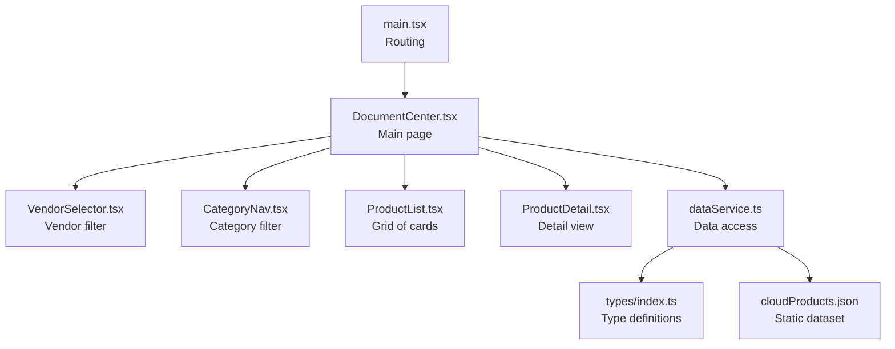
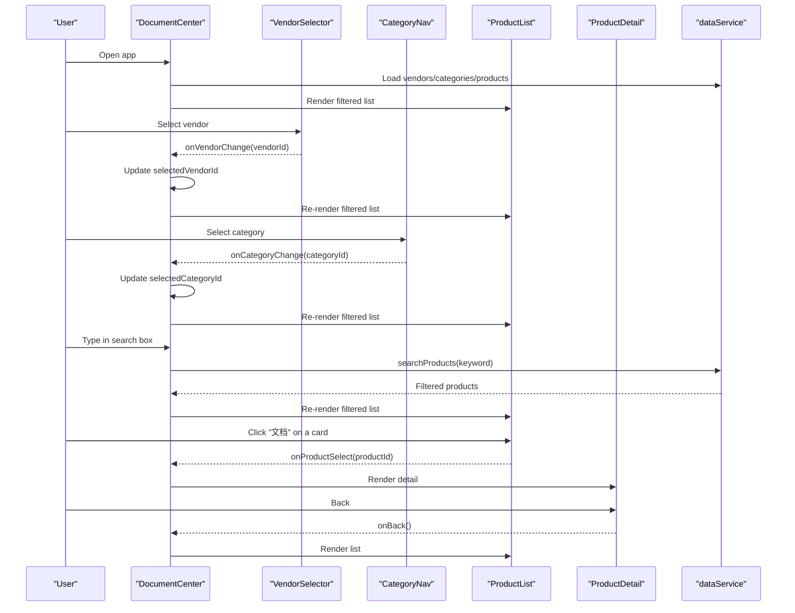
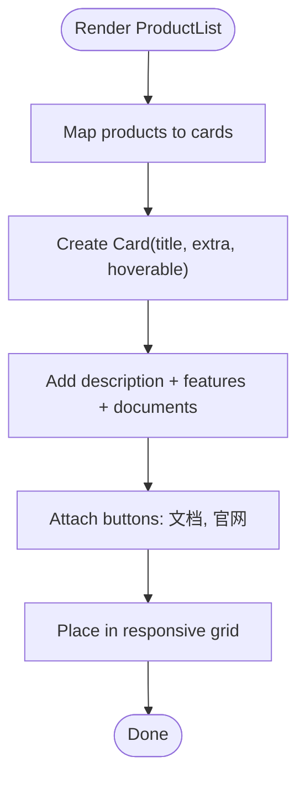
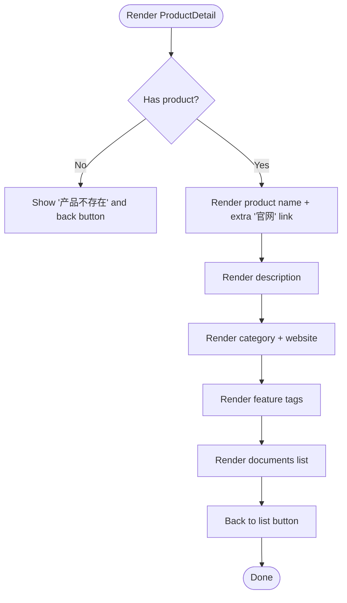
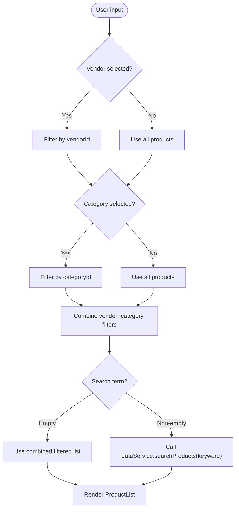
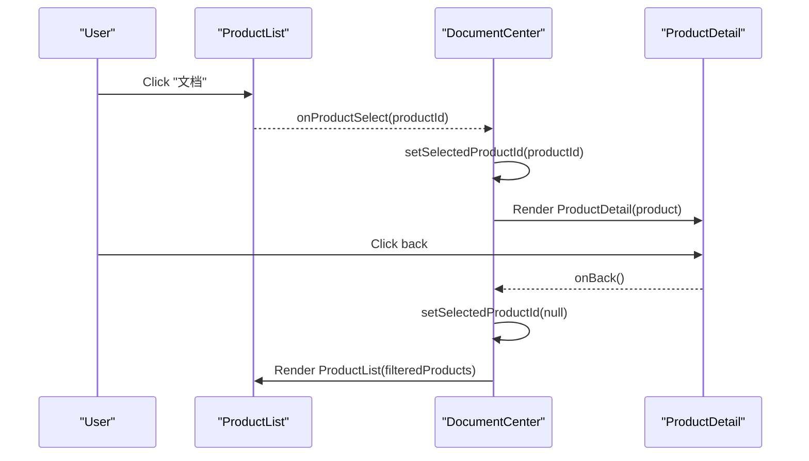
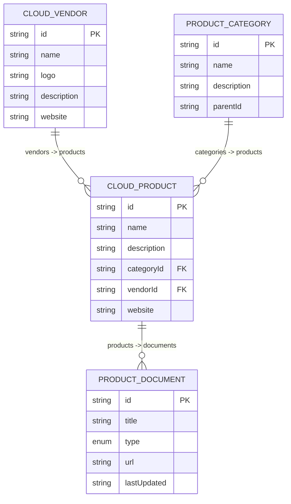
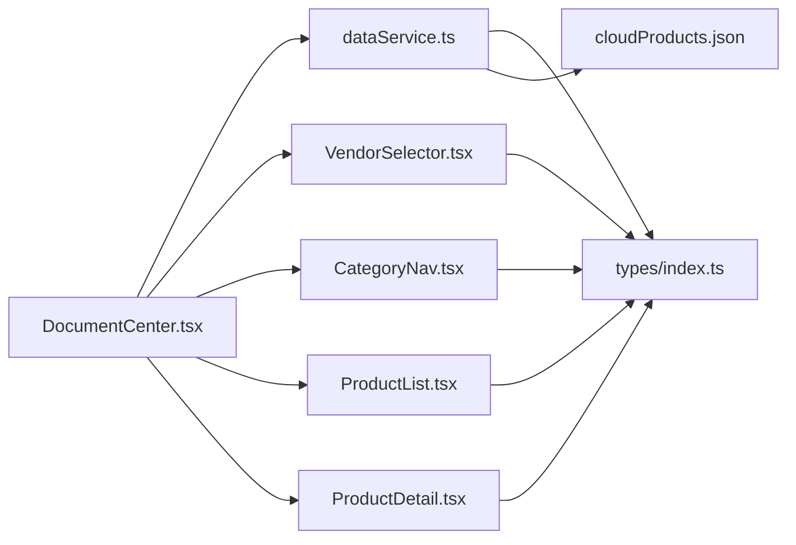

# Product Display and Listing

<cite>
**Referenced Files in This Document**
- [ProductList.tsx](file://web/src/components/ProductList.tsx)
- [ProductDetail.tsx](file://web/src/components/ProductDetail.tsx)
- [VendorSelector.tsx](file://web/src/components/VendorSelector.tsx)
- [CategoryNav.tsx](file://web/src/components/CategoryNav.tsx)
- [DocumentCenter.tsx](file://web/src/pages/DocumentCenter.tsx)
- [dataService.ts](file://web/src/services/dataService.ts)
- [index.ts](file://web/src/types/index.ts)
- [cloudProducts.json](file://web/src/data/cloudProducts.json)
- [main.tsx](file://web/src/main.tsx)
- [index.css](file://web/src/index.css)
- [App.css](file://web/src/App.css)
- [ProductList.test.tsx](file://web/src/components/ProductList.test.tsx)
</cite>

## Table of Contents
1. [Introduction](#introduction)
2. [Project Structure](#project-structure)
3. [Core Components](#core-components)
4. [Architecture Overview](#architecture-overview)
5. [Detailed Component Analysis](#detailed-component-analysis)
6. [Dependency Analysis](#dependency-analysis)
7. [Performance Considerations](#performance-considerations)
8. [Troubleshooting Guide](#troubleshooting-guide)
9. [Conclusion](#conclusion)
10. [Appendices](#appendices)

## Introduction
This document explains the product listing and display system for a cloud product catalog. It covers the ProductList component architecture, product card rendering, responsive layout implementation, product data model, filtering and search integration, and navigation to product detail. It also outlines strategies for pagination and infinite scroll, performance optimizations for large lists, and interactive elements such as vendor/category filters and search.

## Project Structure
The product display system is organized around a central page that orchestrates filtering and selection, and renders either a grid of product cards or a detailed product view.

**Diagram sources**
- [main.tsx:1-20](file://web/src/main.tsx#L1-L20)
- [DocumentCenter.tsx:15-145](file://web/src/pages/DocumentCenter.tsx#L15-L145)
- [VendorSelector.tsx:1-40](file://web/src/components/VendorSelector.tsx#L1-L40)
- [CategoryNav.tsx:1-57](file://web/src/components/CategoryNav.tsx#L1-L57)
- [ProductList.tsx:1-99](file://web/src/components/ProductList.tsx#L1-L99)
- [ProductDetail.tsx:1-124](file://web/src/components/ProductDetail.tsx#L1-L124)
- [dataService.ts:1-156](file://web/src/services/dataService.ts#L1-L156)
- [index.ts:1-69](file://web/src/types/index.ts#L1-L69)
- [cloudProducts.json:1-800](file://web/src/data/cloudProducts.json#L1-L800)

**Section sources**
- [main.tsx:1-20](file://web/src/main.tsx#L1-L20)
- [DocumentCenter.tsx:15-145](file://web/src/pages/DocumentCenter.tsx#L15-L145)

## Core Components
- ProductList: Renders a responsive grid of product cards with hover effects, feature tags, and document links. Provides “文档” (View Docs) and “官网” (Official Site) actions.
- ProductDetail: Displays a single product’s description, features, and associated documents with a back-to-list action.
- VendorSelector: Allows selecting a vendor to filter products.
- CategoryNav: Tree-based navigation to select a category to filter products.
- dataService: Loads and transforms static JSON data into typed models and provides filtering/search capabilities.
- DocumentCenter: Orchestrates state for vendor, category, search, and selection; switches between list and detail views.

**Section sources**
- [ProductList.tsx:9-99](file://web/src/components/ProductList.tsx#L9-L99)
- [ProductDetail.tsx:8-124](file://web/src/components/ProductDetail.tsx#L8-L124)
- [VendorSelector.tsx:7-40](file://web/src/components/VendorSelector.tsx#L7-L40)
- [CategoryNav.tsx:7-57](file://web/src/components/CategoryNav.tsx#L7-L57)
- [dataService.ts:4-156](file://web/src/services/dataService.ts#L4-L156)
- [DocumentCenter.tsx:15-145](file://web/src/pages/DocumentCenter.tsx#L15-L145)

## Architecture Overview
The system follows a unidirectional data flow:
- Static dataset is loaded and normalized by dataService.
- DocumentCenter computes filtered products based on vendor, category, and search term.
- ProductList renders the filtered list; clicking a product triggers selection.
- ProductDetail displays the selected product; back navigates to the list.

**Diagram sources**
- [DocumentCenter.tsx:15-145](file://web/src/pages/DocumentCenter.tsx#L15-L145)
- [VendorSelector.tsx:13-40](file://web/src/components/VendorSelector.tsx#L13-L40)
- [CategoryNav.tsx:13-57](file://web/src/components/CategoryNav.tsx#L13-L57)
- [ProductList.tsx:14-99](file://web/src/components/ProductList.tsx#L14-L99)
- [ProductDetail.tsx:13-124](file://web/src/components/ProductDetail.tsx#L13-L124)
- [dataService.ts:145-151](file://web/src/services/dataService.ts#L145-L151)

## Detailed Component Analysis

### ProductList Component
Responsibilities:
- Render a responsive grid of product cards.
- Display product name, description, features, and associated documents.
- Provide “文档” (View Docs) and “官网” (Official Site) actions.
- Apply hoverable card behavior and subtle shadows/borders.

Key rendering patterns:
- Responsive grid using Ant Design Col with responsive breakpoints (xs, sm, md, lg, xl, xxl).
- Each product card includes:
  - Title (product name)
  - Extra actions: “文档” button invokes onProductSelect(productId); “官网” opens product website in a new tab
  - Description text
  - Feature tags
  - Documents section with title, type tag, last updated date, and “查看” link

Hover and interactive effects:
- Cards are hoverable with rounded corners and soft borders/shadows.
- Buttons are small-sized and styled consistently.

**Diagram sources**
- [ProductList.tsx:26-95](file://web/src/components/ProductList.tsx#L26-L95)

**Section sources**
- [ProductList.tsx:9-99](file://web/src/components/ProductList.tsx#L9-L99)

### ProductDetail Component
Responsibilities:
- Display detailed information for a selected product.
- Provide a back-to-list action.
- Render product description, category, website, features, and documents.

Detail rendering patterns:
- Uses Ant Design Card and Descriptions to present structured information.
- Documents are shown as a vertical list with title, type tag, last updated date, and “查看” link.

**Diagram sources**
- [ProductDetail.tsx:13-121](file://web/src/components/ProductDetail.tsx#L13-L121)

**Section sources**
- [ProductDetail.tsx:8-124](file://web/src/components/ProductDetail.tsx#L8-L124)

### Filtering and Search Integration
DocumentCenter manages state and computed filters:
- Vendor filter: selectedVendorId restricts products to a single vendor.
- Category filter: selectedCategoryId restricts products to a single category.
- Combined filters: Products match both vendor and category conditions.
- Search: When searchTerm is non-empty, dataService.searchProducts(keyword) is used; otherwise, filteredByVendorAndCategory is used.

**Diagram sources**
- [DocumentCenter.tsx:32-47](file://web/src/pages/DocumentCenter.tsx#L32-L47)
- [dataService.ts:145-151](file://web/src/services/dataService.ts#L145-L151)

**Section sources**
- [DocumentCenter.tsx:32-78](file://web/src/pages/DocumentCenter.tsx#L32-L78)
- [dataService.ts:145-151](file://web/src/services/dataService.ts#L145-L151)

### Navigation and Selection Handlers
- onProductSelect(productId): Sets selectedProductId, switching view to ProductDetail.
- onBack(): Clears selectedProductId, returning to ProductList.
- onVendorChange(vendorId): Updates selectedVendorId.
- onCategoryChange(categoryId): Updates selectedCategoryId.
- handleSearch(value): Updates searchTerm, triggering recomputation of filteredProducts.

**Diagram sources**
- [ProductList.tsx:36-43](file://web/src/components/ProductList.tsx#L36-L43)
- [DocumentCenter.tsx:65-78](file://web/src/pages/DocumentCenter.tsx#L65-L78)
- [ProductDetail.tsx:17-25](file://web/src/components/ProductDetail.tsx#L17-L25)

**Section sources**
- [ProductList.tsx:36-43](file://web/src/components/ProductList.tsx#L36-L43)
- [DocumentCenter.tsx:65-78](file://web/src/pages/DocumentCenter.tsx#L65-L78)
- [ProductDetail.tsx:17-25](file://web/src/components/ProductDetail.tsx#L17-L25)

### Product Data Model and Presentation
Data model:
- CloudVendor: id, name, logo, description, website
- ProductCategory: id, name, description, parentId, children
- ProductDocument: id, title, type ('guide' | 'api' | 'faq' | 'tutorial' | 'whitepaper'), url, lastUpdated
- CloudProduct: id, name, description, categoryId, vendorId, documents, website, features
- AppState: selected vendor/category/product, search term

Presentation patterns:
- ProductList shows product name, description, features, and documents.
- ProductDetail shows category, website, features, and documents with color-coded type tags.

**Diagram sources**
- [index.ts:1-69](file://web/src/types/index.ts#L1-L69)

**Section sources**
- [index.ts:17-69](file://web/src/types/index.ts#L17-L69)
- [cloudProducts.json:255-480](file://web/src/data/cloudProducts.json#L255-L480)

## Dependency Analysis
- DocumentCenter depends on dataService for data access and filtering.
- ProductList receives filtered products and selection handler from DocumentCenter.
- ProductDetail receives selected product and back handler from DocumentCenter.
- VendorSelector and CategoryNav update DocumentCenter state via callbacks.
- dataService depends on cloudProducts.json and types/index.ts.

**Diagram sources**
- [DocumentCenter.tsx:15-145](file://web/src/pages/DocumentCenter.tsx#L15-L145)
- [dataService.ts:1-156](file://web/src/services/dataService.ts#L1-L156)
- [index.ts:1-69](file://web/src/types/index.ts#L1-L69)
- [cloudProducts.json:1-800](file://web/src/data/cloudProducts.json#L1-L800)

**Section sources**
- [DocumentCenter.tsx:15-145](file://web/src/pages/DocumentCenter.tsx#L15-L145)
- [dataService.ts:1-156](file://web/src/services/dataService.ts#L1-L156)

## Performance Considerations
Current implementation characteristics:
- Filtering is client-side using Array.filter and Array.find; suitable for moderate datasets.
- Memoization via useMemo reduces re-computation when dependencies change.
- No pagination or infinite scroll is implemented.

Optimization strategies (recommended for large datasets):
- Pagination
  - Introduce page size and current page state.
  - Compute startIndex/endIndex from page and pageSize.
  - Render only visible items.
- Infinite Scroll
  - Use IntersectionObserver to detect when the user scrolls near the bottom.
  - Append next page of items on trigger.
  - Maintain stable keys for virtualized rows.
- Virtual Scrolling
  - Render only visible viewport items with dynamic container height.
  - Libraries like react-window or react-virtualize can help.
- Lazy Loading
  - Defer loading of images or heavy DOM until item enters viewport.
  - Lazy-load document preview content if needed.
- Debounced Search
  - Debounce search input to reduce frequent recomputation.
- Efficient Filtering
  - Pre-index products by vendorId/categoryId for O(1) lookup.
  - Use Set-based membership checks for category filtering.

[No sources needed since this section provides general guidance]

## Troubleshooting Guide
Common issues and resolutions:
- Empty product list after filtering
  - Verify selectedVendorId and selectedCategoryId are set correctly.
  - Confirm filteredByVendorAndCategory logic includes both vendor and category conditions.
- Search yields unexpected results
  - Ensure search term is trimmed and lowercased consistently.
  - Confirm dataService.searchProducts performs case-insensitive substring matching.
- Product detail not showing
  - Check selectedProductId is set and dataService.getProductById returns a product.
  - Ensure back navigation clears selectedProductId.
- Responsive layout gaps
  - Verify padding/margin and flexbox wrapping are applied to the grid container.
  - Ensure Ant Design Col props are configured for desired breakpoints.

**Section sources**
- [DocumentCenter.tsx:32-78](file://web/src/pages/DocumentCenter.tsx#L32-L78)
- [dataService.ts:145-151](file://web/src/services/dataService.ts#L145-L151)
- [ProductList.tsx:29-95](file://web/src/components/ProductList.tsx#L29-L95)

## Conclusion
The product display system provides a clean separation of concerns: filtering and selection live in DocumentCenter, while ProductList and ProductDetail focus on rendering. The responsive grid and interactive elements deliver a good user experience. For larger datasets, consider pagination, infinite scroll, or virtual scrolling to maintain performance.

[No sources needed since this section summarizes without analyzing specific files]

## Appendices

### Product Card Layout and Interactive Elements
- Layout: Ant Design Card with hoverable behavior, extra actions, and body padding.
- Hover effects: Cards are hoverable with subtle shadows and borders.
- Interactive elements:
  - “文档” button triggers onProductSelect(productId).
  - “官网” button opens product website in a new tab.
  - “返回列表” button navigates back to ProductList.

**Section sources**
- [ProductList.tsx:26-95](file://web/src/components/ProductList.tsx#L26-L95)
- [ProductDetail.tsx:17-25](file://web/src/components/ProductDetail.tsx#L17-L25)

### Test Coverage Highlights
- ProductList renders product list and features correctly.
- ProductList documents display and “文档” button click triggers onProductSelect with correct productId.
- Official website links open in new tabs with correct URLs.

**Section sources**
- [ProductList.test.tsx:52-125](file://web/src/components/ProductList.test.tsx#L52-L125)

### Styling Notes
- Global styles define base fonts and colors.
- Component-level styles apply padding, margins, and hover animations.
- ProductList uses inline styles for grid spacing and card appearance.

**Section sources**
- [index.css:1-69](file://web/src/index.css#L1-L69)
- [App.css:1-43](file://web/src/App.css#L1-L43)
- [ProductList.tsx:56-61](file://web/src/components/ProductList.tsx#L56-L61)