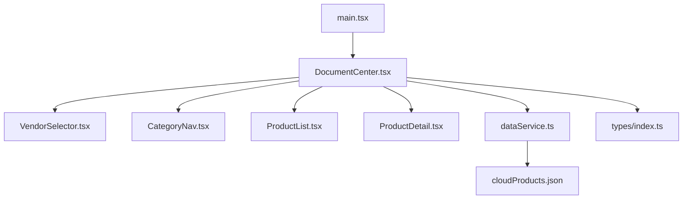
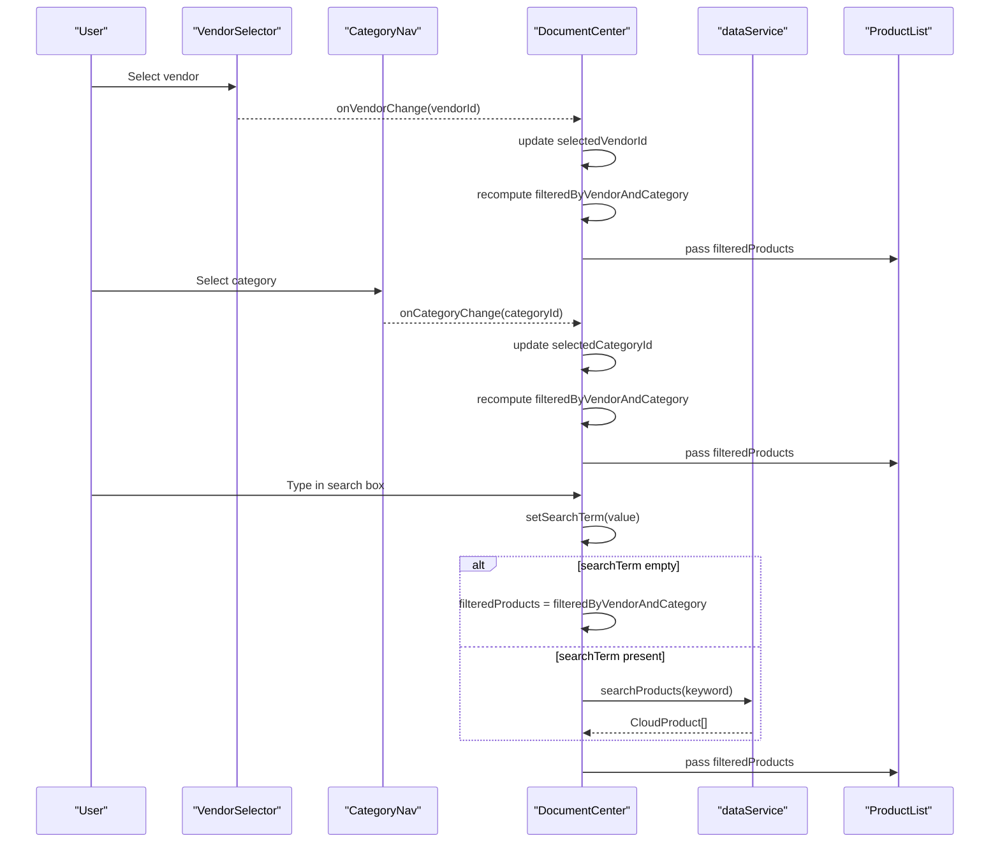
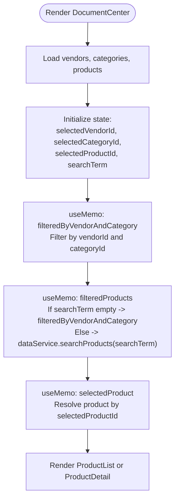
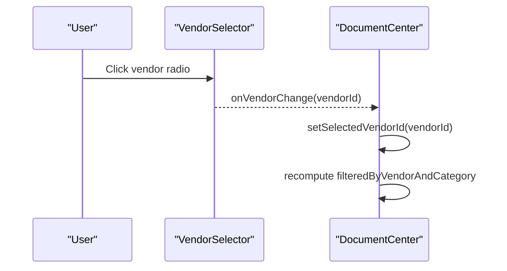
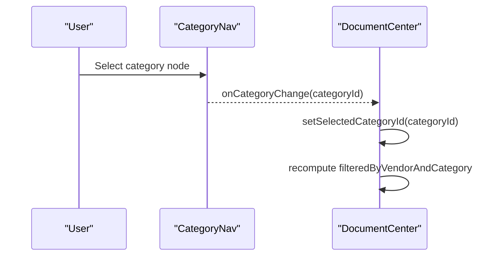
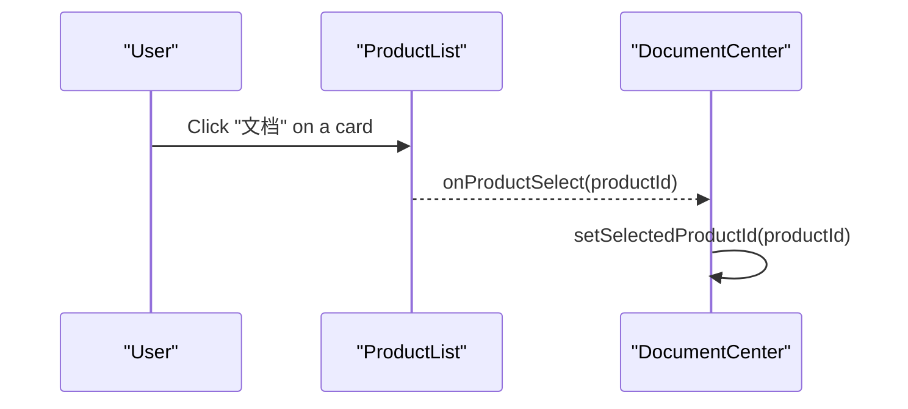
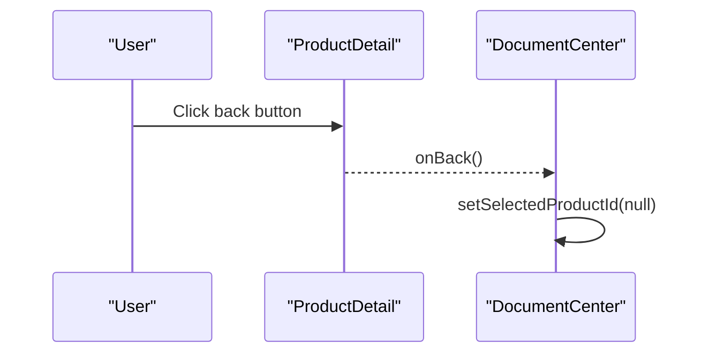
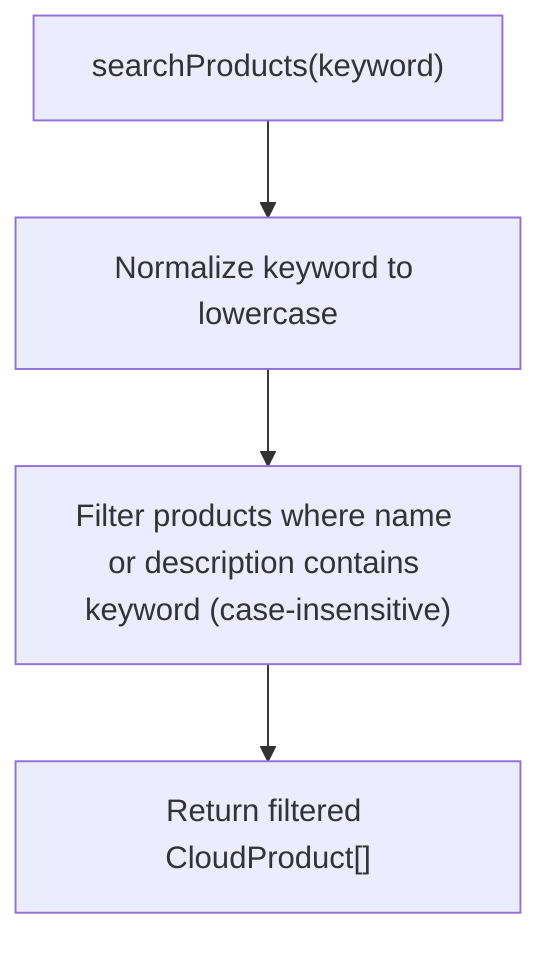
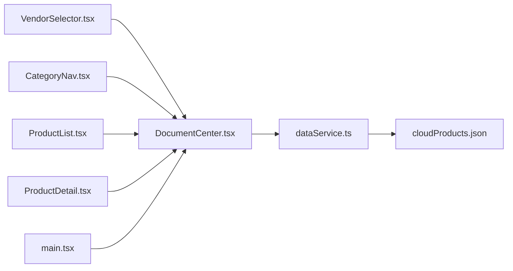

# Product Filtering and Search

<cite>
**Referenced Files in This Document**
- [DocumentCenter.tsx](file://web/src/pages/DocumentCenter.tsx)
- [VendorSelector.tsx](file://web/src/components/VendorSelector.tsx)
- [CategoryNav.tsx](file://web/src/components/CategoryNav.tsx)
- [ProductList.tsx](file://web/src/components/ProductList.tsx)
- [ProductDetail.tsx](file://web/src/components/ProductDetail.tsx)
- [dataService.ts](file://web/src/services/dataService.ts)
- [cloudProducts.json](file://web/src/data/cloudProducts.json)
- [index.ts](file://web/src/types/index.ts)
- [main.tsx](file://web/src/main.tsx)
</cite>

## Table of Contents
1. [Introduction](#introduction)
2. [Project Structure](#project-structure)
3. [Core Components](#core-components)
4. [Architecture Overview](#architecture-overview)
5. [Detailed Component Analysis](#detailed-component-analysis)
6. [Dependency Analysis](#dependency-analysis)
7. [Performance Considerations](#performance-considerations)
8. [Troubleshooting Guide](#troubleshooting-guide)
9. [Conclusion](#conclusion)

## Introduction
This document explains the product filtering and search functionality implemented in the application. It covers how vendor, category, and keyword search criteria combine to produce filtered results, how DocumentCenter manages filter state and applies memoization for performance, and how the search algorithm works. It also details the end-to-end workflow from user input to product display, including debouncing strategies and real-time updates. Practical examples demonstrate complex filter combinations, search term processing, and result ranking. Finally, it addresses performance considerations for large datasets, memory optimization techniques, and user experience enhancements, along with integration patterns across components.

## Project Structure
The filtering and search feature spans several layers:
- Page container: DocumentCenter orchestrates state, computes derived results, and renders child components.
- UI controls: VendorSelector and CategoryNav provide selection inputs.
- List rendering: ProductList displays filtered products; ProductDetail shows product details.
- Data service: dataService encapsulates data loading and search logic.
- Data model: types define CloudVendor, ProductCategory, CloudProduct, and AppState.
- Routing: main.tsx wires the page into the application.

**Diagram sources**
- [DocumentCenter.tsx:15-145](file://web/src/pages/DocumentCenter.tsx#L15-L145)
- [VendorSelector.tsx:13-40](file://web/src/components/VendorSelector.tsx#L13-L40)
- [CategoryNav.tsx:13-57](file://web/src/components/CategoryNav.tsx#L13-L57)
- [ProductList.tsx:14-99](file://web/src/components/ProductList.tsx#L14-L99)
- [ProductDetail.tsx:13-124](file://web/src/components/ProductDetail.tsx#L13-L124)
- [dataService.ts:4-156](file://web/src/services/dataService.ts#L4-L156)
- [cloudProducts.json:1-2532](file://web/src/data/cloudProducts.json#L1-L2532)
- [index.ts:1-69](file://web/src/types/index.ts#L1-L69)
- [main.tsx:9-20](file://web/src/main.tsx#L9-L20)

**Section sources**
- [DocumentCenter.tsx:15-145](file://web/src/pages/DocumentCenter.tsx#L15-L145)
- [main.tsx:9-20](file://web/src/main.tsx#L9-L20)

## Core Components
- DocumentCenter: Central state manager for vendor, category, product selection, and search term. Computes filtered results via two chained useMemo computations and passes props down to child components.
- VendorSelector: Renders vendor radio buttons and notifies DocumentCenter of changes.
- CategoryNav: Renders a hierarchical category tree and notifies DocumentCenter of selections.
- ProductList: Displays product cards and triggers product detail navigation.
- ProductDetail: Shows detailed information for a selected product.
- dataService: Loads and normalizes data from cloudProducts.json and implements keyword search.
- Types: Define CloudVendor, ProductCategory, CloudProduct, VendorProducts, and AppState.

**Section sources**
- [DocumentCenter.tsx:15-145](file://web/src/pages/DocumentCenter.tsx#L15-L145)
- [VendorSelector.tsx:13-40](file://web/src/components/VendorSelector.tsx#L13-L40)
- [CategoryNav.tsx:13-57](file://web/src/components/CategoryNav.tsx#L13-L57)
- [ProductList.tsx:14-99](file://web/src/components/ProductList.tsx#L14-L99)
- [ProductDetail.tsx:13-124](file://web/src/components/ProductDetail.tsx#L13-L124)
- [dataService.ts:4-156](file://web/src/services/dataService.ts#L4-L156)
- [index.ts:1-69](file://web/src/types/index.ts#L1-L69)

## Architecture Overview
The filtering pipeline is a composition of three stages:
1. Vendor and category filtering: A useMemo filters products by vendorId and categoryId.
2. Keyword search: Another useMemo either delegates to dataService.searchProducts or falls back to the vendor/category-filtered set.
3. Selected product lookup: A third useMemo resolves the current product by ID for detail view.

**Diagram sources**
- [DocumentCenter.tsx:32-47](file://web/src/pages/DocumentCenter.tsx#L32-L47)
- [dataService.ts:144-151](file://web/src/services/dataService.ts#L144-L151)
- [VendorSelector.tsx:21-24](file://web/src/components/VendorSelector.tsx#L21-L24)
- [CategoryNav.tsx:44-51](file://web/src/components/CategoryNav.tsx#L44-L51)

## Detailed Component Analysis

### DocumentCenter: State Management and Memoization
- Loads vendors, categories, and products from dataService.
- Maintains state for selected vendor, category, product, and search term.
- Computes filteredByVendorAndCategory using useMemo to avoid unnecessary recomputation when vendorId or categoryId change.
- Computes filteredProducts using useMemo to either:
  - Return filteredByVendorAndCategory when searchTerm is empty, or
  - Delegate to dataService.searchProducts for keyword filtering.
- Computes selectedProduct using useMemo to resolve the current product by ID.
- Exposes handlers for vendor change, category change, product selection, and search input.

**Diagram sources**
- [DocumentCenter.tsx:17-53](file://web/src/pages/DocumentCenter.tsx#L17-L53)

**Section sources**
- [DocumentCenter.tsx:17-78](file://web/src/pages/DocumentCenter.tsx#L17-L78)

### VendorSelector: Vendor Selection Control
- Receives vendors, selectedVendorId, and onVendorChange handler.
- Renders a vertical group of radio buttons for vendors.
- Calls onVendorChange with the chosen vendorId when the user selects a vendor.

**Diagram sources**
- [VendorSelector.tsx:21-24](file://web/src/components/VendorSelector.tsx#L21-L24)
- [DocumentCenter.tsx:56-58](file://web/src/pages/DocumentCenter.tsx#L56-L58)

**Section sources**
- [VendorSelector.tsx:13-40](file://web/src/components/VendorSelector.tsx#L13-L40)
- [DocumentCenter.tsx:56-58](file://web/src/pages/DocumentCenter.tsx#L56-L58)

### CategoryNav: Category Selection Control
- Receives categories, selectedCategoryId, and onCategoryChange handler.
- Recursively generates tree nodes from ProductCategory hierarchy.
- Uses Ant Design Tree to render a selectable category tree.
- Calls onCategoryChange with the selected category key.

**Diagram sources**
- [CategoryNav.tsx:44-51](file://web/src/components/CategoryNav.tsx#L44-L51)
- [DocumentCenter.tsx:61-63](file://web/src/pages/DocumentCenter.tsx#L61-L63)

**Section sources**
- [CategoryNav.tsx:13-57](file://web/src/components/CategoryNav.tsx#L13-L57)
- [DocumentCenter.tsx:61-63](file://web/src/pages/DocumentCenter.tsx#L61-L63)

### ProductList: Display Filtered Products
- Receives products and onProductSelect callback.
- Renders a responsive grid of product cards.
- Triggers onProductSelect with productId when the user clicks the “文档” button.

**Diagram sources**
- [ProductList.tsx:36-43](file://web/src/components/ProductList.tsx#L36-L43)
- [DocumentCenter.tsx:66-68](file://web/src/pages/DocumentCenter.tsx#L66-L68)

**Section sources**
- [ProductList.tsx:14-99](file://web/src/components/ProductList.tsx#L14-L99)
- [DocumentCenter.tsx:66-68](file://web/src/pages/DocumentCenter.tsx#L66-L68)

### ProductDetail: Show Selected Product
- Receives product and onBack callback.
- Displays product metadata, features, and associated documents.
- Provides a back button to return to the list.

**Diagram sources**
- [ProductDetail.tsx:53-55](file://web/src/components/ProductDetail.tsx#L53-L55)
- [DocumentCenter.tsx:71-73](file://web/src/pages/DocumentCenter.tsx#L71-L73)

**Section sources**
- [ProductDetail.tsx:13-124](file://web/src/components/ProductDetail.tsx#L13-L124)
- [DocumentCenter.tsx:71-73](file://web/src/pages/DocumentCenter.tsx#L71-L73)

### dataService: Search Algorithm and Data Access
- Loads normalized data from cloudProducts.json into memory.
- Implements searchProducts(keyword) using case-insensitive substring matching against product name and description.
- Provides getters for vendors, categories, products, and product-by-id lookups.

**Diagram sources**
- [dataService.ts:144-151](file://web/src/services/dataService.ts#L144-L151)

**Section sources**
- [dataService.ts:4-156](file://web/src/services/dataService.ts#L4-L156)
- [cloudProducts.json:255-800](file://web/src/data/cloudProducts.json#L255-L800)

### Types: Data Contracts
- Defines CloudVendor, ProductCategory, CloudProduct, VendorProducts, and AppState.
- Ensures type safety across components and services.

**Section sources**
- [index.ts:1-69](file://web/src/types/index.ts#L1-L69)

## Dependency Analysis
- DocumentCenter depends on dataService for data access and search.
- VendorSelector and CategoryNav depend on DocumentCenter for state updates.
- ProductList and ProductDetail depend on DocumentCenter for props and callbacks.
- dataService depends on cloudProducts.json for raw data.
- main.tsx mounts DocumentCenter under routing.

**Diagram sources**
- [DocumentCenter.tsx:1-145](file://web/src/pages/DocumentCenter.tsx#L1-L145)
- [VendorSelector.tsx:1-40](file://web/src/components/VendorSelector.tsx#L1-L40)
- [CategoryNav.tsx:1-57](file://web/src/components/CategoryNav.tsx#L1-L57)
- [ProductList.tsx:1-99](file://web/src/components/ProductList.tsx#L1-L99)
- [ProductDetail.tsx:1-124](file://web/src/components/ProductDetail.tsx#L1-L124)
- [dataService.ts:1-156](file://web/src/services/dataService.ts#L1-L156)
- [cloudProducts.json:1-2532](file://web/src/data/cloudProducts.json#L1-L2532)
- [main.tsx:1-20](file://web/src/main.tsx#L1-L20)

**Section sources**
- [DocumentCenter.tsx:1-145](file://web/src/pages/DocumentCenter.tsx#L1-L145)
- [dataService.ts:1-156](file://web/src/services/dataService.ts#L1-L156)
- [main.tsx:1-20](file://web/src/main.tsx#L1-L20)

## Performance Considerations
- Memoization strategy:
  - filteredByVendorAndCategory uses useMemo keyed by allProducts, selectedVendorId, and selectedCategoryId to avoid re-filtering when unrelated state changes.
  - filteredProducts uses useMemo keyed by filteredByVendorAndCategory and searchTerm to avoid redundant search work when filters remain unchanged.
  - selectedProduct uses useMemo keyed by selectedProductId to avoid repeated lookups.
- Search algorithm:
  - dataService.searchProducts performs linear filtering with case-insensitive substring checks on name and description. This is O(N) per search and acceptable for moderate dataset sizes.
- Debouncing:
  - The current implementation updates filteredProducts immediately on every keystroke. To reduce recomputation cost on rapid typing, consider adding a debounced input handler that delays invoking setSearchTerm until after the user pauses typing.
- Large dataset optimizations:
  - Normalize and index frequently searched fields (e.g., build a lowercase lookup map for product names/descriptions) to speed up substring checks.
  - Consider precomputing vendor/category subsets to minimize full scans.
  - Introduce pagination or virtualized lists for ProductList to limit DOM and rendering overhead.
- Memory optimization:
  - Keep only necessary product fields in the UI state; avoid deep cloning of large arrays.
  - Use stable references for unchanged arrays to maximize memoization benefits.
- User experience enhancements:
  - Show a “Searching...” indicator during search.
  - Provide “Clear filters” and “Clear search” actions.
  - Persist filters in URL query parameters for shareable links.

[No sources needed since this section provides general guidance]

## Troubleshooting Guide
- Filters not updating:
  - Verify that onVendorChange and onCategoryChange are invoked and update state in DocumentCenter.
  - Confirm useMemo dependencies include selectedVendorId and selectedCategoryId.
- Search yields unexpected results:
  - Ensure dataService.searchProducts is called when searchTerm is non-empty.
  - Check that keyword normalization to lowercase is applied consistently.
- Empty or stale data:
  - Confirm dataService constructors load and normalize cloudProducts.json correctly.
  - Verify that initialProducts are loaded before rendering filters.
- Product detail not showing:
  - Ensure selectedProductId is set and dataService.getProductById returns a match.

**Section sources**
- [DocumentCenter.tsx:32-53](file://web/src/pages/DocumentCenter.tsx#L32-L53)
- [dataService.ts:144-151](file://web/src/services/dataService.ts#L144-L151)
- [cloudProducts.json:1-2532](file://web/src/data/cloudProducts.json#L1-L2532)

## Conclusion
The filtering and search feature combines vendor and category filters with keyword search through a clean, memoized pipeline in DocumentCenter. VendorSelector and CategoryNav provide intuitive selection controls, while ProductList and ProductDetail deliver a responsive user experience. The current search algorithm is straightforward and effective for moderate datasets. For larger datasets, consider debouncing, precomputed indices, and pagination to maintain responsiveness. The modular architecture supports incremental improvements to performance and UX without disrupting existing functionality.