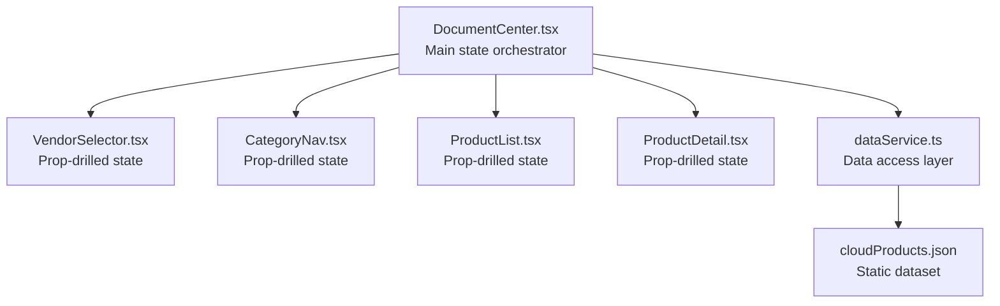
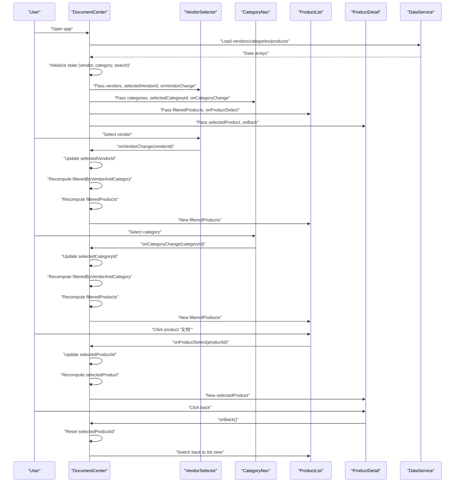
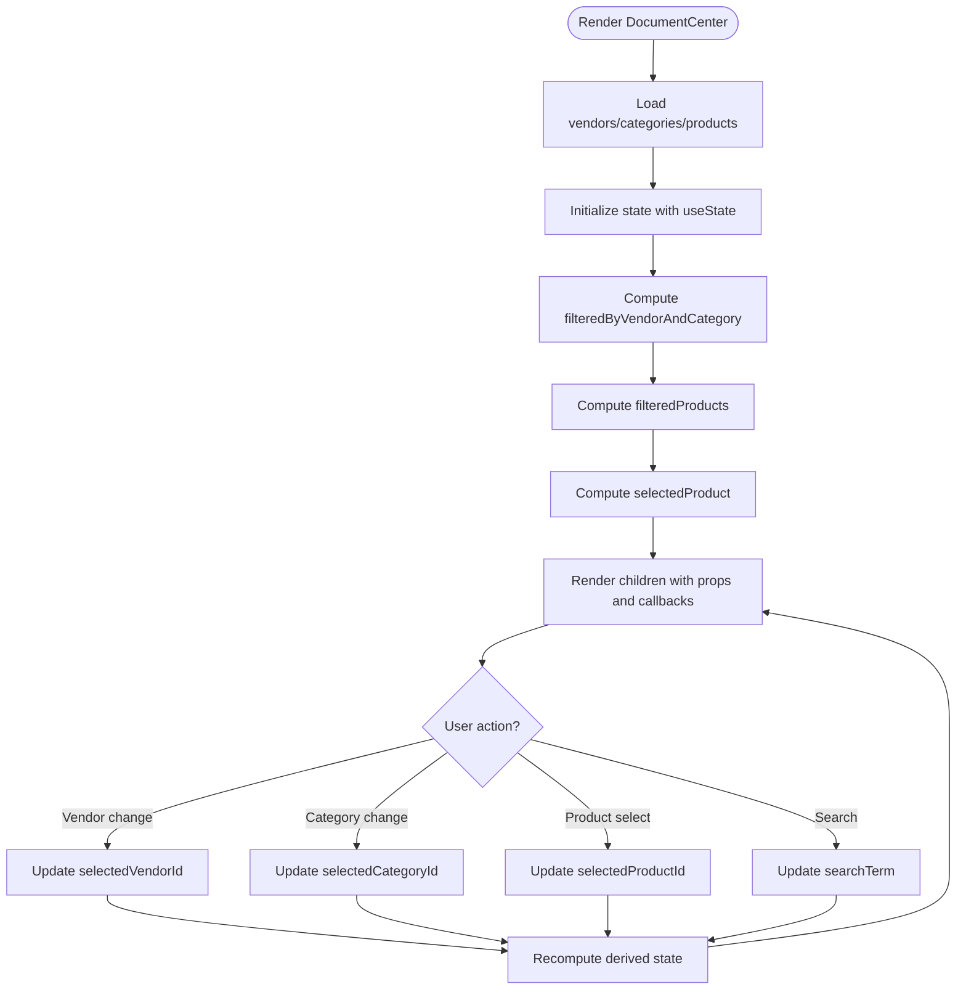
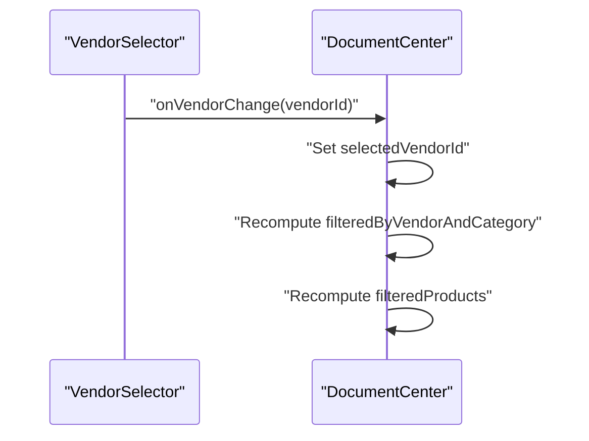
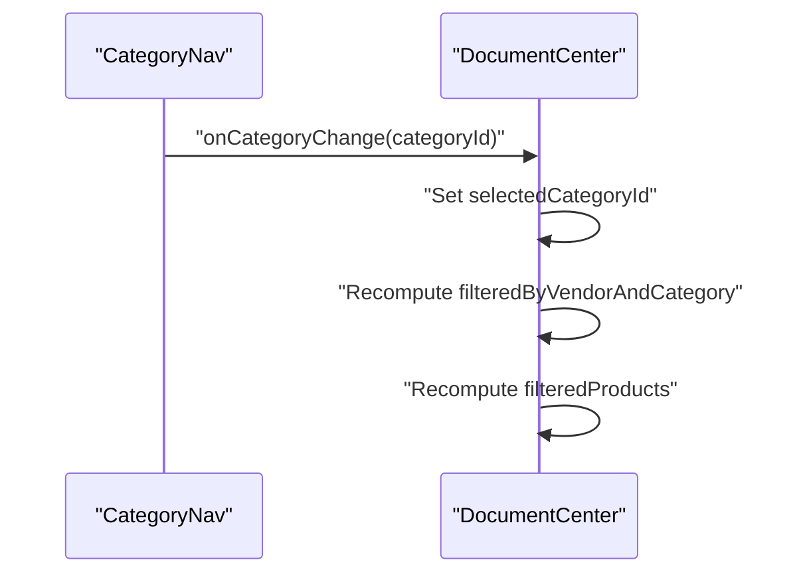
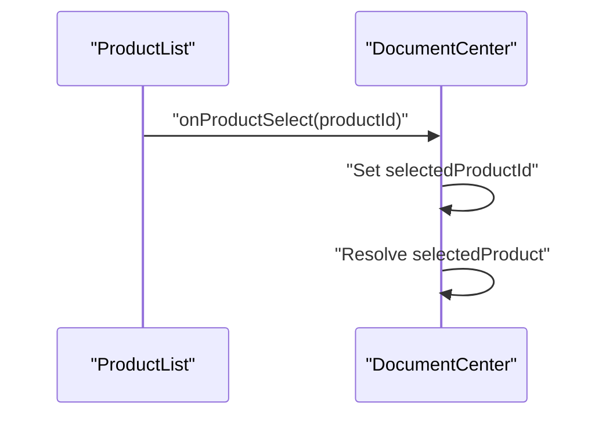
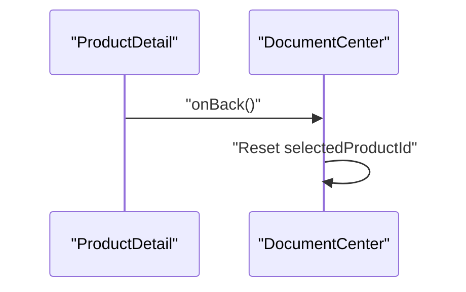
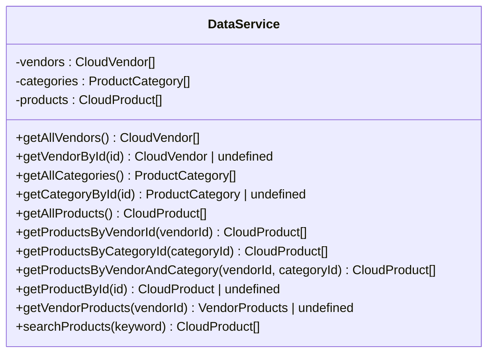
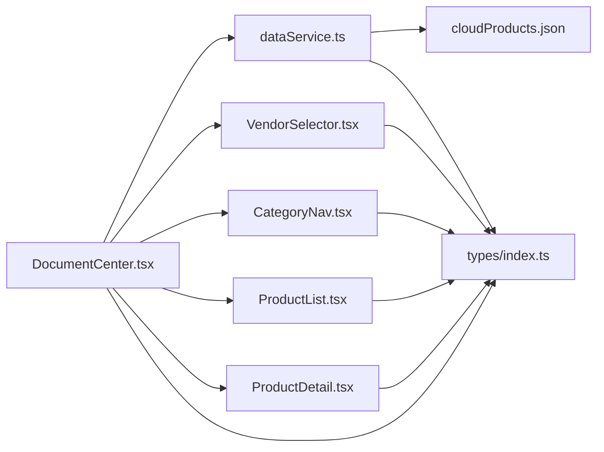

# State Management Patterns

<cite>
**Referenced Files in This Document**
- [DocumentCenter.tsx](file://web/src/pages/DocumentCenter.tsx)
- [VendorSelector.tsx](file://web/src/components/VendorSelector.tsx)
- [CategoryNav.tsx](file://web/src/components/CategoryNav.tsx)
- [ProductList.tsx](file://web/src/components/ProductList.tsx)
- [ProductDetail.tsx](file://web/src/components/ProductDetail.tsx)
- [dataService.ts](file://web/src/services/dataService.ts)
- [index.ts](file://web/src/types/index.ts)
- [cloudProducts.json](file://web/src/data/cloudProducts.json)
</cite>

## Table of Contents
1. [Introduction](#introduction)
2. [Project Structure](#project-structure)
3. [Core Components](#core-components)
4. [Architecture Overview](#architecture-overview)
5. [Detailed Component Analysis](#detailed-component-analysis)
6. [Dependency Analysis](#dependency-analysis)
7. [Performance Considerations](#performance-considerations)
8. [Troubleshooting Guide](#troubleshooting-guide)
9. [Conclusion](#conclusion)

## Introduction
This document explains the React state management patterns used in the cloud product discovery system. It focuses on how DocumentCenter orchestrates state using React hooks, how memoization optimizes rendering performance, and how callback handlers enable component communication. It also covers prop drilling patterns, data flow architecture, lifecycle considerations, and best practices for maintaining predictable state updates across components.

## Project Structure
The state management is centered around a single page component that manages filters, selections, and navigation state. Supporting components receive state and callbacks via props, enabling a unidirectional data flow.

**Diagram sources**
- [DocumentCenter.tsx:15-145](file://web/src/pages/DocumentCenter.tsx#L15-L145)
- [VendorSelector.tsx:13-37](file://web/src/components/VendorSelector.tsx#L13-L37)
- [CategoryNav.tsx:13-53](file://web/src/components/CategoryNav.tsx#L13-L53)
- [ProductList.tsx:14-96](file://web/src/components/ProductList.tsx#L14-L96)
- [ProductDetail.tsx:13-121](file://web/src/components/ProductDetail.tsx#L13-L121)
- [dataService.ts:4-156](file://web/src/services/dataService.ts#L4-L156)
- [cloudProducts.json:1-2532](file://web/src/data/cloudProducts.json#L1-L2532)

**Section sources**
- [DocumentCenter.tsx:15-145](file://web/src/pages/DocumentCenter.tsx#L15-L145)
- [dataService.ts:4-156](file://web/src/services/dataService.ts#L4-L156)

## Core Components
- DocumentCenter: Manages all filter and selection state, computes derived data, and passes callbacks to child components.
- VendorSelector: Receives vendor list and selection state, emits vendor change events.
- CategoryNav: Receives category tree and selection state, emits category change events.
- ProductList: Receives filtered product list and selection callback, renders product cards.
- ProductDetail: Receives selected product and back callback, displays product details.
- dataService: Provides typed accessors to the static dataset and implements filtering/search logic.

Key state hooks in DocumentCenter:
- useState for vendor, category, product, and search term selections
- useMemo for derived filtered lists and selected product resolution

Callback handlers:
- handleVendorChange, handleCategoryChange, handleProductSelect, handleBackToList, handleSearch

**Section sources**
- [DocumentCenter.tsx:21-78](file://web/src/pages/DocumentCenter.tsx#L21-L78)
- [VendorSelector.tsx:13-37](file://web/src/components/VendorSelector.tsx#L13-L37)
- [CategoryNav.tsx:13-53](file://web/src/components/CategoryNav.tsx#L13-L53)
- [ProductList.tsx:14-96](file://web/src/components/ProductList.tsx#L14-L96)
- [ProductDetail.tsx:13-121](file://web/src/components/ProductDetail.tsx#L13-L121)
- [dataService.ts:25-151](file://web/src/services/dataService.ts#L25-L151)

## Architecture Overview
The system follows a centralized state pattern within DocumentCenter with explicit prop drilling to child components. Derived state is computed via useMemo to minimize recomputation and optimize rendering.

**Diagram sources**
- [DocumentCenter.tsx:56-78](file://web/src/pages/DocumentCenter.tsx#L56-L78)
- [VendorSelector.tsx:22-23](file://web/src/components/VendorSelector.tsx#L22-L23)
- [CategoryNav.tsx:47-49](file://web/src/components/CategoryNav.tsx#L47-L49)
- [ProductList.tsx:39](file://web/src/components/ProductList.tsx#L39)
- [ProductDetail.tsx:17-18](file://web/src/components/ProductDetail.tsx#L17-L18)
- [dataService.ts:145-151](file://web/src/services/dataService.ts#L145-L151)

## Detailed Component Analysis

### DocumentCenter: Centralized State Orchestration
- Loads static data and initializes state with useState.
- Computes derived state with useMemo:
  - filteredByVendorAndCategory: filters products by vendor and category.
  - filteredProducts: applies search term to pre-filtered list.
  - selectedProduct: resolves selected product by ID.
- Exposes callback handlers for child components to mutate state.

**Diagram sources**
- [DocumentCenter.tsx:17-53](file://web/src/pages/DocumentCenter.tsx#L17-L53)
- [DocumentCenter.tsx:33-47](file://web/src/pages/DocumentCenter.tsx#L33-L47)
- [DocumentCenter.tsx:56-78](file://web/src/pages/DocumentCenter.tsx#L56-L78)

**Section sources**
- [DocumentCenter.tsx:15-145](file://web/src/pages/DocumentCenter.tsx#L15-L145)

### VendorSelector: Prop-Drilled Selection
- Receives vendors, selectedVendorId, and onVendorChange.
- Renders vendor radio buttons and forwards selection changes to parent.

**Diagram sources**
- [VendorSelector.tsx:22-23](file://web/src/components/VendorSelector.tsx#L22-L23)
- [DocumentCenter.tsx:56-58](file://web/src/pages/DocumentCenter.tsx#L56-L58)

**Section sources**
- [VendorSelector.tsx:13-37](file://web/src/components/VendorSelector.tsx#L13-L37)
- [DocumentCenter.tsx:56-58](file://web/src/pages/DocumentCenter.tsx#L56-L58)

### CategoryNav: Hierarchical Selection
- Receives categories, selectedCategoryId, and onCategoryChange.
- Converts flat categories to Ant Design Tree nodes and handles selection.

**Diagram sources**
- [CategoryNav.tsx:47-49](file://web/src/components/CategoryNav.tsx#L47-L49)
- [DocumentCenter.tsx:61-63](file://web/src/pages/DocumentCenter.tsx#L61-L63)

**Section sources**
- [CategoryNav.tsx:13-53](file://web/src/components/CategoryNav.tsx#L13-L53)
- [DocumentCenter.tsx:61-63](file://web/src/pages/DocumentCenter.tsx#L61-L63)

### ProductList: Display and Navigation Trigger
- Receives filteredProducts and onProductSelect.
- Renders product cards and triggers navigation to detail view.

**Diagram sources**
- [ProductList.tsx:39](file://web/src/components/ProductList.tsx#L39)
- [DocumentCenter.tsx:66-68](file://web/src/pages/DocumentCenter.tsx#L66-L68)

**Section sources**
- [ProductList.tsx:14-96](file://web/src/components/ProductList.tsx#L14-L96)
- [DocumentCenter.tsx:66-68](file://web/src/pages/DocumentCenter.tsx#L66-L68)

### ProductDetail: Back Navigation and Detail View
- Receives selectedProduct and onBack.
- Displays product details and navigates back to list.

**Diagram sources**
- [ProductDetail.tsx:17-18](file://web/src/components/ProductDetail.tsx#L17-L18)
- [DocumentCenter.tsx:71-73](file://web/src/pages/DocumentCenter.tsx#L71-L73)

**Section sources**
- [ProductDetail.tsx:13-121](file://web/src/components/ProductDetail.tsx#L13-L121)
- [DocumentCenter.tsx:71-73](file://web/src/pages/DocumentCenter.tsx#L71-L73)

### dataService: Data Access Layer
- Singleton service exposing typed methods to query vendors, categories, products, and search.
- Implements filtering and search logic used by DocumentCenter.

**Diagram sources**
- [dataService.ts:4-156](file://web/src/services/dataService.ts#L4-L156)

**Section sources**
- [dataService.ts:4-156](file://web/src/services/dataService.ts#L4-L156)

## Dependency Analysis
- DocumentCenter depends on dataService for data loading and filtering.
- Child components depend on DocumentCenter for state and callbacks.
- Types define the contract between components and dataService.

**Diagram sources**
- [DocumentCenter.tsx:17-19](file://web/src/pages/DocumentCenter.tsx#L17-L19)
- [dataService.ts:1-2](file://web/src/services/dataService.ts#L1-L2)
- [index.ts:1-69](file://web/src/types/index.ts#L1-L69)

**Section sources**
- [DocumentCenter.tsx:17-19](file://web/src/pages/DocumentCenter.tsx#L17-L19)
- [dataService.ts:1-2](file://web/src/services/dataService.ts#L1-L2)
- [index.ts:1-69](file://web/src/types/index.ts#L1-L69)

## Performance Considerations
Memoization strategies:
- filteredByVendorAndCategory: Computed once per vendor/category change, preventing repeated filtering of the entire product set.
- filteredProducts: Computed once per pre-filtered list and search term change, avoiding redundant search operations.
- selectedProduct: Computed once per productId change, minimizing lookups.

Rendering optimization:
- Child components receive only necessary props, reducing unnecessary re-renders.
- Callback handlers are stable references, preventing downstream re-renders due to handler recreation.

Lifecycle management:
- State updates are batched within event handlers; derived state recomputes only when dependencies change.
- No manual cleanup is required for these hooks; React manages lifecycle automatically.

Best practices:
- Keep derived state in useMemo/useCallback to avoid recomputation.
- Pass minimal props to children to reduce re-rendering.
- Prefer stable callbacks to prevent prop drift.

**Section sources**
- [DocumentCenter.tsx:33-53](file://web/src/pages/DocumentCenter.tsx#L33-L53)

## Troubleshooting Guide
Common issues and debugging tips:
- State not updating after selection:
  - Verify callback handlers are passed correctly and invoked with the right arguments.
  - Confirm dependencies in useMemo match the state that drives recomputation.
- Empty filtered list:
  - Check that vendor/category IDs align with product records.
  - Ensure search term normalization matches product data.
- Performance regressions:
  - Inspect useMemo dependencies to ensure they capture all relevant inputs.
  - Avoid passing new object/array instances as props unless necessary.

Testing patterns:
- Use Testing Library to simulate user interactions and assert state-driven UI changes.
- Mock dataService methods to isolate component behavior.

**Section sources**
- [ProductList.test.tsx:93-110](file://web/src/components/ProductList.test.tsx#L93-L110)
- [CategoryNav.test.tsx:71-87](file://web/src/components/CategoryNav.test.tsx#L71-L87)
- [dataService.test.ts:146-168](file://web/src/services/dataService.test.ts#L146-L168)

## Conclusion
The cloud product discovery system employs a clean, centralized state pattern within DocumentCenter, complemented by useMemo for performance and explicit callback handlers for component communication. Props are drilled down to child components, ensuring a predictable data flow and efficient re-renders. By adhering to memoization best practices and stable callback patterns, the system maintains responsiveness and scalability while keeping state management transparent and testable.