# Data Service Layer

<cite>
**Referenced Files in This Document**
- [dataService.ts](file://web/src/services/dataService.ts)
- [types/index.ts](file://web/src/types/index.ts)
- [cloudProducts.json](file://web/src/data/cloudProducts.json)
- [DocumentCenter.tsx](file://web/src/pages/DocumentCenter.tsx)
- [VendorSelector.tsx](file://web/src/components/VendorSelector.tsx)
- [CategoryNav.tsx](file://web/src/components/CategoryNav.tsx)
- [ProductList.tsx](file://web/src/components/ProductList.tsx)
- [ProductDetail.tsx](file://web/src/components/ProductDetail.tsx)
- [dataService.test.ts](file://web/src/services/dataService.test.ts)
- [jest.config.ts](file://web/jest.config.ts)
- [jest.setup.ts](file://web/jest.setup.ts)
- [main.tsx](file://web/src/main.tsx)
- [package.json](file://web/package.json)
</cite>

## Table of Contents
1. [Introduction](#introduction)
2. [Project Structure](#project-structure)
3. [Core Components](#core-components)
4. [Architecture Overview](#architecture-overview)
5. [Detailed Component Analysis](#detailed-component-analysis)
6. [Dependency Analysis](#dependency-analysis)
7. [Performance Considerations](#performance-considerations)
8. [Troubleshooting Guide](#troubleshooting-guide)
9. [Conclusion](#conclusion)
10. [Appendices](#appendices)

## Introduction
This document explains the data service layer implementation that powers the CloudMaster application. It focuses on the centralized data management via a singleton pattern, the data model for cloud products and vendor/category hierarchies, filtering and search algorithms, data transformation logic, caching mechanisms, error handling, and integration with React components. It also covers test coverage and quality assurance practices for data operations.

## Project Structure
The data service layer resides under the web application and integrates with React components and pages. The structure relevant to the data service layer is:

- Services: dataService.ts implements the central data manager and exposes a singleton instance.
- Types: Strongly typed interfaces define the shape of vendors, categories, products, and related documents.
- Data: cloudProducts.json provides the canonical dataset loaded by the service.
- Pages and Components: DocumentCenter orchestrates state and filters; VendorSelector and CategoryNav provide selection UI; ProductList and ProductDetail render filtered results and details.
- Tests: dataService.test.ts validates service behavior; Jest configuration and setup enable reliable unit tests.

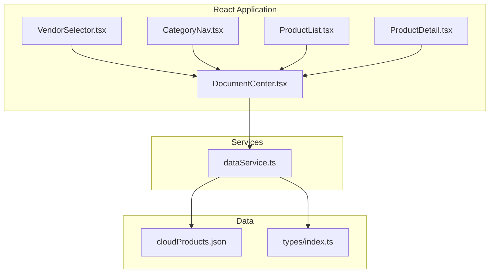

**Diagram sources**
- [DocumentCenter.tsx:15-145](file://web/src/pages/DocumentCenter.tsx#L15-L145)
- [dataService.ts:4-156](file://web/src/services/dataService.ts#L4-L156)
- [types/index.ts:1-69](file://web/src/types/index.ts#L1-L69)
- [cloudProducts.json:1-2532](file://web/src/data/cloudProducts.json#L1-L2532)

**Section sources**
- [dataService.ts:1-156](file://web/src/services/dataService.ts#L1-L156)
- [types/index.ts:1-69](file://web/src/types/index.ts#L1-L69)
- [cloudProducts.json:1-2532](file://web/src/data/cloudProducts.json#L1-L2532)
- [DocumentCenter.tsx:15-145](file://web/src/pages/DocumentCenter.tsx#L15-L145)

## Core Components
- Singleton data service: Centralized in-memory data manager with methods to fetch vendors, categories, products, and to search/filter by vendor and category.
- Type system: Interfaces define CloudVendor, ProductCategory, CloudProduct, VendorProducts, and related JSON shapes.
- Data source: cloudProducts.json supplies vendors, categories, and products with nested documents.
- React integration: DocumentCenter composes UI components and applies client-side filtering and search.

Key responsibilities:
- Load and normalize data during initialization.
- Provide lookup and filter APIs for vendors, categories, and products.
- Transform raw JSON documents into strongly typed ProductDocument entries.
- Support hierarchical category navigation and vendor-specific product sets.

**Section sources**
- [dataService.ts:4-156](file://web/src/services/dataService.ts#L4-L156)
- [types/index.ts:1-69](file://web/src/types/index.ts#L1-L69)
- [cloudProducts.json:1-2532](file://web/src/data/cloudProducts.json#L1-L2532)
- [DocumentCenter.tsx:15-145](file://web/src/pages/DocumentCenter.tsx#L15-L145)

## Architecture Overview
The data service layer follows a singleton pattern to ensure a single source of truth for the application’s data. The React application initializes the service once and reuses it across components. Filtering and search are performed client-side against in-memory collections.

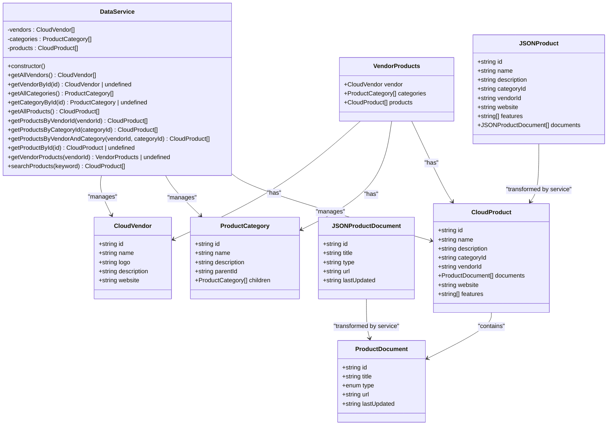

**Diagram sources**
- [dataService.ts:4-156](file://web/src/services/dataService.ts#L4-L156)
- [types/index.ts:1-69](file://web/src/types/index.ts#L1-L69)

## Detailed Component Analysis

### Singleton Data Service
The service encapsulates:
- Private arrays for vendors, categories, and products.
- Constructor loads data from cloudProducts.json and normalizes document types.
- Methods for retrieval, filtering, and search.
- getVendorProducts builds a vendor-centric view by pruning unused categories.

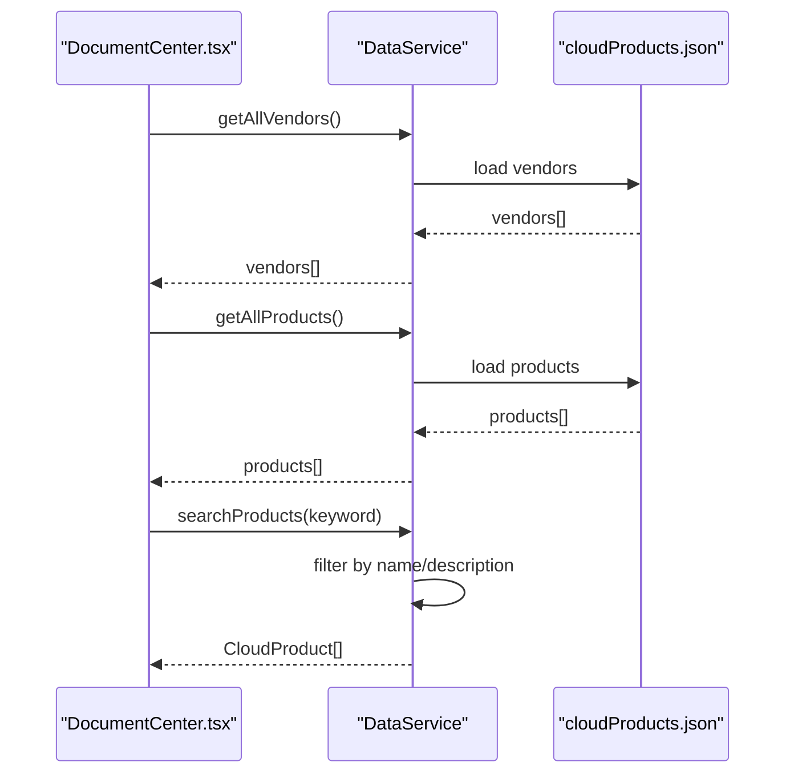

**Diagram sources**
- [DocumentCenter.tsx:17-19](file://web/src/pages/DocumentCenter.tsx#L17-L19)
- [dataService.ts:25-151](file://web/src/services/dataService.ts#L25-L151)
- [cloudProducts.json:1-2532](file://web/src/data/cloudProducts.json#L1-L2532)

**Section sources**
- [dataService.ts:9-20](file://web/src/services/dataService.ts#L9-L20)
- [dataService.ts:25-151](file://web/src/services/dataService.ts#L25-L151)

### Data Transformation Logic
During initialization, the service transforms JSONProductDocument entries into ProductDocument by casting the type field to a union of allowed document types. This ensures type safety for downstream consumers while preserving the original JSON structure.

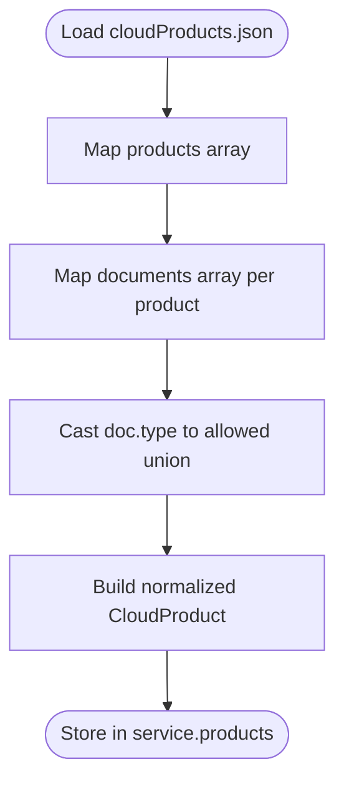

**Diagram sources**
- [dataService.ts:13-19](file://web/src/services/dataService.ts#L13-L19)
- [types/index.ts:17-32](file://web/src/types/index.ts#L17-L32)

**Section sources**
- [dataService.ts:13-19](file://web/src/services/dataService.ts#L13-L19)
- [types/index.ts:17-32](file://web/src/types/index.ts#L17-L32)

### Vendor Information Management
- getAllVendors returns the full vendor list.
- getVendorById performs O(n) lookup by id.
- getVendorProducts aggregates vendor-specific products and prunes category tree to only include categories with matching products.

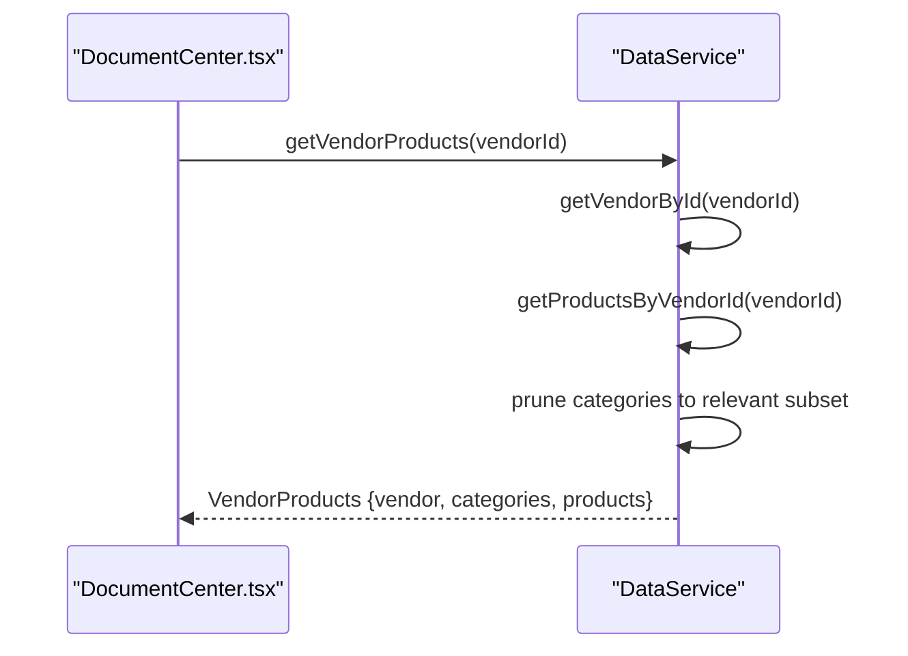

**Diagram sources**
- [dataService.ts:105-140](file://web/src/services/dataService.ts#L105-L140)
- [DocumentCenter.tsx:17-19](file://web/src/pages/DocumentCenter.tsx#L17-L19)

**Section sources**
- [dataService.ts:25-34](file://web/src/services/dataService.ts#L25-L34)
- [dataService.ts:105-140](file://web/src/services/dataService.ts#L105-L140)

### Category Hierarchy Processing
- getAllCategories returns the full category tree.
- getCategoryById traverses the tree recursively to find a category by id, supporting arbitrary nesting.
- getVendorProducts prunes the category tree to show only categories associated with the vendor’s products.

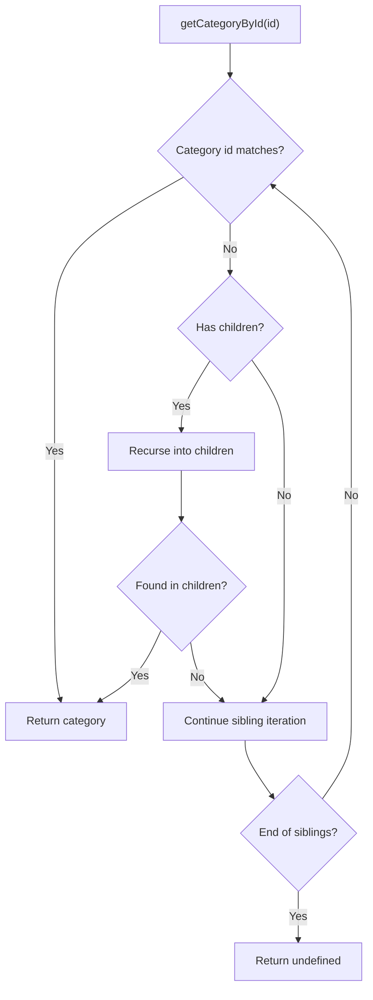

**Diagram sources**
- [dataService.ts:47-63](file://web/src/services/dataService.ts#L47-L63)

**Section sources**
- [dataService.ts:39-41](file://web/src/services/dataService.ts#L39-L41)
- [dataService.ts:47-63](file://web/src/services/dataService.ts#L47-L63)
- [dataService.ts:114-131](file://web/src/services/dataService.ts#L114-L131)

### Filtering Mechanisms
- Vendor filter: Applied via DocumentCenter state and a memoized filter over all products.
- Category filter: Applied similarly to vendor filter.
- Combined filter: Products must match both vendor and category selections.
- Search filter: Uses searchProducts to match name or description; if empty, falls back to the vendor+category filtered set.

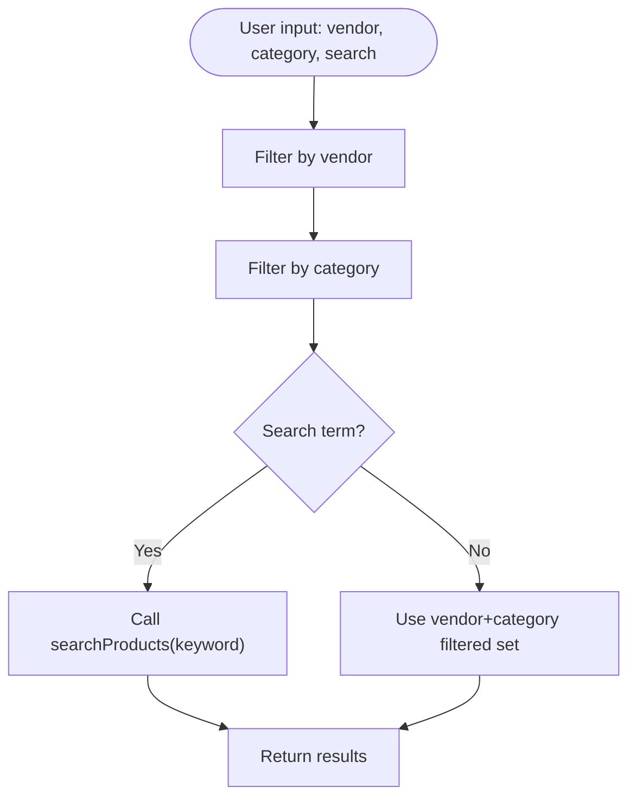

**Diagram sources**
- [DocumentCenter.tsx:33-47](file://web/src/pages/DocumentCenter.tsx#L33-L47)
- [dataService.ts:145-151](file://web/src/services/dataService.ts#L145-L151)

**Section sources**
- [DocumentCenter.tsx:33-47](file://web/src/pages/DocumentCenter.tsx#L33-L47)
- [dataService.ts:75-93](file://web/src/services/dataService.ts#L75-L93)
- [dataService.ts:145-151](file://web/src/services/dataService.ts#L145-L151)

### Search Algorithm
- Lowercases the keyword and checks both product name and description for inclusion.
- Complexity: O(n) per search across all products.
- Edge case: Empty keyword returns all products.

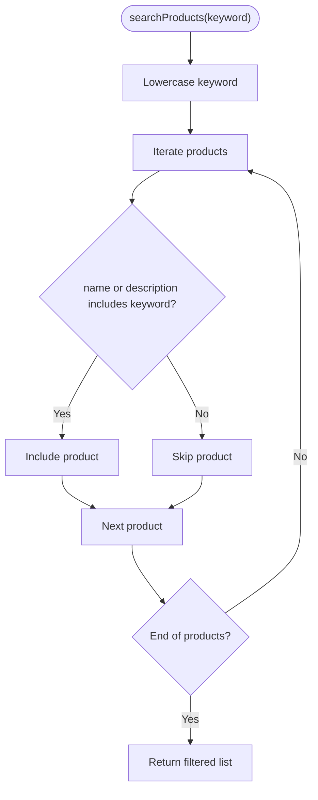

**Diagram sources**
- [dataService.ts:145-151](file://web/src/services/dataService.ts#L145-L151)

**Section sources**
- [dataService.ts:145-151](file://web/src/services/dataService.ts#L145-L151)

### Data Loading and Caching
- Data loading: Performed once in the service constructor by importing cloudProducts.json.
- In-memory caching: All vendors, categories, and products are stored in private arrays and reused across method calls.
- No external caching layer is present; caching occurs at the application scope via the singleton instance.

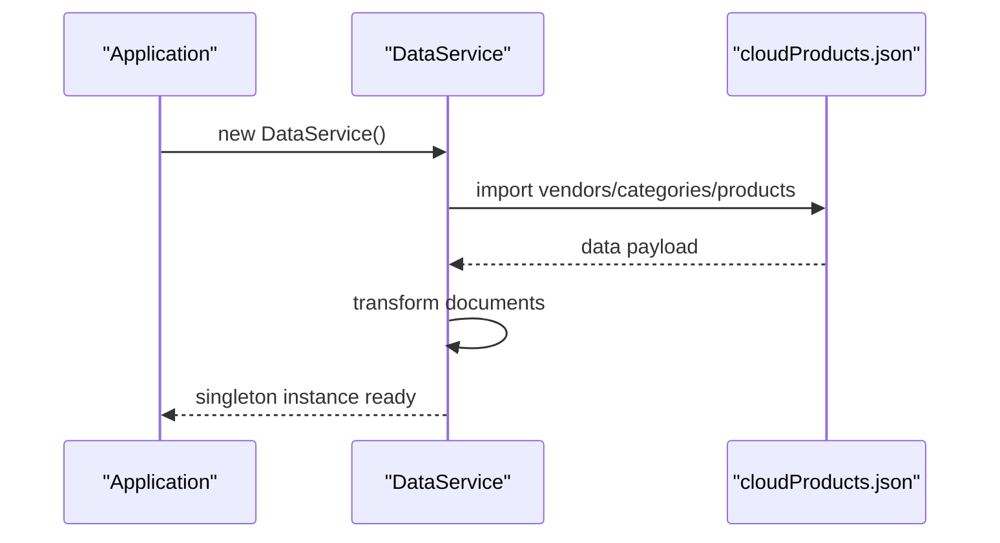

**Diagram sources**
- [dataService.ts:9-20](file://web/src/services/dataService.ts#L9-L20)
- [cloudProducts.json:1-2532](file://web/src/data/cloudProducts.json#L1-L2532)

**Section sources**
- [dataService.ts:9-20](file://web/src/services/dataService.ts#L9-L20)

### Error Handling Approaches
- Lookup methods return undefined when items are not found (e.g., getVendorById, getCategoryById, getProductById).
- Filter methods return empty arrays when no matches are found (e.g., getProductsByVendorId, getProductsByCategoryId, searchProducts).
- UI components handle undefined product state gracefully (ProductDetail displays a “not found” message).

**Section sources**
- [dataService.ts:32-34](file://web/src/services/dataService.ts#L32-L34)
- [dataService.ts:46-63](file://web/src/services/dataService.ts#L46-L63)
- [dataService.ts:98-100](file://web/src/services/dataService.ts#L98-L100)
- [dataService.ts:145-151](file://web/src/services/dataService.ts#L145-L151)
- [ProductDetail.tsx:14-27](file://web/src/components/ProductDetail.tsx#L14-L27)

### Integration with React Components
- DocumentCenter initializes data, manages state, and computes filtered results using useMemo.
- VendorSelector and CategoryNav provide selection controls bound to state.
- ProductList renders filtered products; ProductDetail renders selected product details.
- Routing is configured in main.tsx to mount DocumentCenter at root paths.

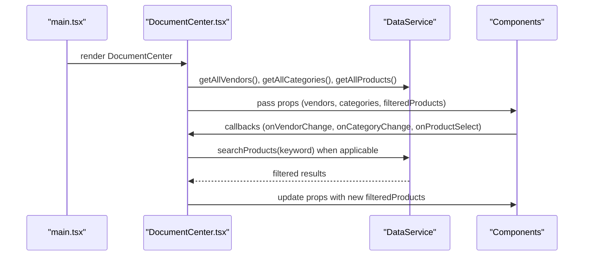

**Diagram sources**
- [main.tsx:9-20](file://web/src/main.tsx#L9-L20)
- [DocumentCenter.tsx:17-78](file://web/src/pages/DocumentCenter.tsx#L17-L78)
- [dataService.ts:25-151](file://web/src/services/dataService.ts#L25-L151)

**Section sources**
- [main.tsx:9-20](file://web/src/main.tsx#L9-L20)
- [DocumentCenter.tsx:17-145](file://web/src/pages/DocumentCenter.tsx#L17-L145)
- [VendorSelector.tsx:13-37](file://web/src/components/VendorSelector.tsx#L13-L37)
- [CategoryNav.tsx:13-53](file://web/src/components/CategoryNav.tsx#L13-L53)
- [ProductList.tsx:14-99](file://web/src/components/ProductList.tsx#L14-L99)
- [ProductDetail.tsx:13-124](file://web/src/components/ProductDetail.tsx#L13-L124)

## Dependency Analysis
- dataService.ts depends on types/index.ts for type definitions and cloudProducts.json for data.
- DocumentCenter.tsx depends on dataService.ts and component modules for rendering.
- Components depend on Ant Design UI primitives and react-router for navigation.
- Testing stack uses Jest with ts-jest and jsdom; setup mocks browser APIs.

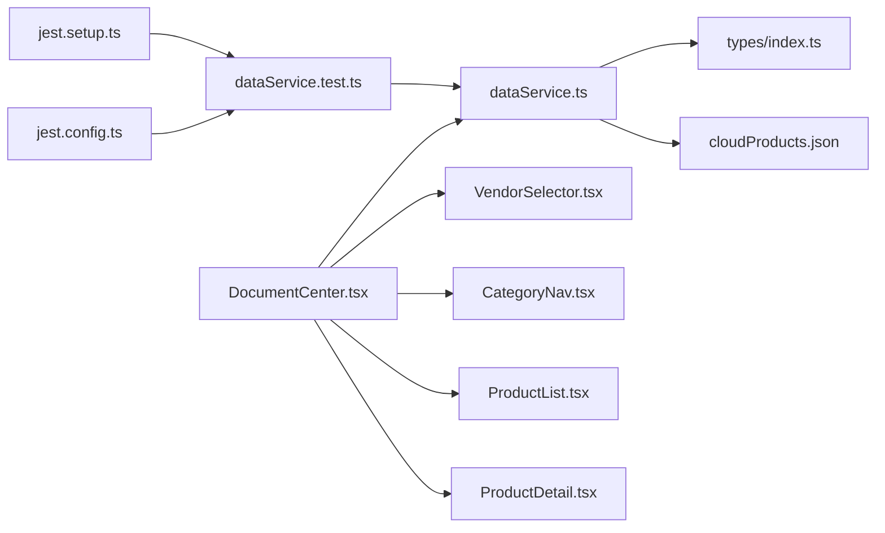

**Diagram sources**
- [dataService.ts:1-2](file://web/src/services/dataService.ts#L1-L2)
- [types/index.ts:1-69](file://web/src/types/index.ts#L1-L69)
- [cloudProducts.json:1-2532](file://web/src/data/cloudProducts.json#L1-L2532)
- [DocumentCenter.tsx:3-8](file://web/src/pages/DocumentCenter.tsx#L3-L8)
- [dataService.test.ts:1](file://web/src/services/dataService.test.ts#L1-L1)
- [jest.config.ts:3-24](file://web/jest.config.ts#L3-L24)
- [jest.setup.ts:1-59](file://web/jest.setup.ts#L1-L59)

**Section sources**
- [dataService.ts:1-2](file://web/src/services/dataService.ts#L1-L2)
- [DocumentCenter.tsx:3-8](file://web/src/pages/DocumentCenter.tsx#L3-L8)
- [dataService.test.ts:1](file://web/src/services/dataService.test.ts#L1-L1)
- [jest.config.ts:3-24](file://web/jest.config.ts#L3-L24)
- [jest.setup.ts:1-59](file://web/jest.setup.ts#L1-L59)

## Performance Considerations
- Current filtering is O(n) per operation; for larger datasets, consider:
  - Precomputing vendor and category indices for constant-time lookup.
  - Using a Map keyed by vendorId/categoryId for O(1) filtering.
  - Debouncing search input to reduce repeated filtering calls.
  - Virtualizing long lists in ProductList to limit DOM nodes.
  - Memoizing derived computations with useMemo/useCallback to avoid unnecessary re-renders.
- Data normalization occurs once at construction; keep transformations minimal to avoid startup overhead.

[No sources needed since this section provides general guidance]

## Troubleshooting Guide
Common issues and resolutions:
- Empty or missing data:
  - Verify cloudProducts.json is properly formatted and imported.
  - Confirm the singleton instance is initialized before use.
- Incorrect document types:
  - Ensure JSON document types are valid members of the allowed union; the service casts them during normalization.
- Search returns unexpected results:
  - Check that keywords are lowercased consistently and that both name and description are included in matching.
- UI not updating after selection:
  - Ensure state setters are invoked and memoized selectors are recalculated.

**Section sources**
- [dataService.ts:13-19](file://web/src/services/dataService.ts#L13-L19)
- [dataService.ts:145-151](file://web/src/services/dataService.ts#L145-L151)
- [DocumentCenter.tsx:33-78](file://web/src/pages/DocumentCenter.tsx#L33-L78)

## Conclusion
The data service layer provides a centralized, type-safe, and reusable foundation for the CloudMaster application. Its singleton pattern ensures consistent data access, while client-side filtering and search deliver responsive user experiences. With modest enhancements—such as precomputed indices, debounced search, and virtualization—the system can scale to larger datasets while maintaining excellent UX.

[No sources needed since this section summarizes without analyzing specific files]

## Appendices

### Data Access Patterns
- Retrieve all vendors, categories, and products once at app startup.
- Apply vendor and category filters in DocumentCenter using useMemo.
- Use searchProducts for keyword-based filtering; fall back to filtered set when empty.
- Navigate to product details by selecting a product ID and retrieving by ID.

**Section sources**
- [DocumentCenter.tsx:17-78](file://web/src/pages/DocumentCenter.tsx#L17-L78)
- [dataService.ts:25-151](file://web/src/services/dataService.ts#L25-L151)

### Test Coverage and Quality Assurance
- Unit tests validate service methods for vendors, categories, products, and search.
- Jest configuration enables TypeScript compilation, jsdom environment, and coverage reporting.
- Setup mocks browser APIs to avoid runtime errors in tests.

**Section sources**
- [dataService.test.ts:1-170](file://web/src/services/dataService.test.ts#L1-L170)
- [jest.config.ts:3-24](file://web/jest.config.ts#L3-L24)
- [jest.setup.ts:1-59](file://web/jest.setup.ts#L1-L59)
- [package.json:11-13](file://web/package.json#L11-L13)