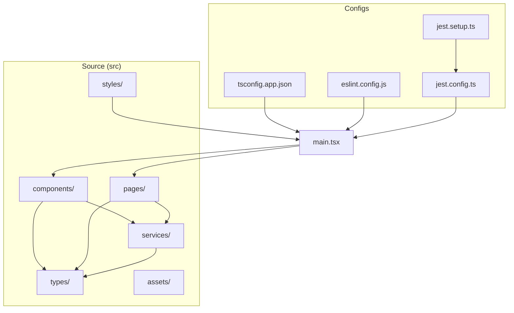
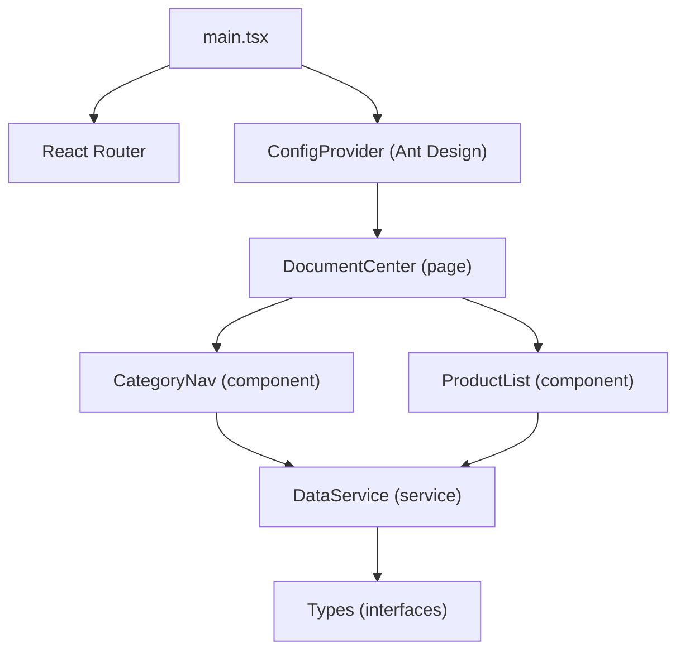
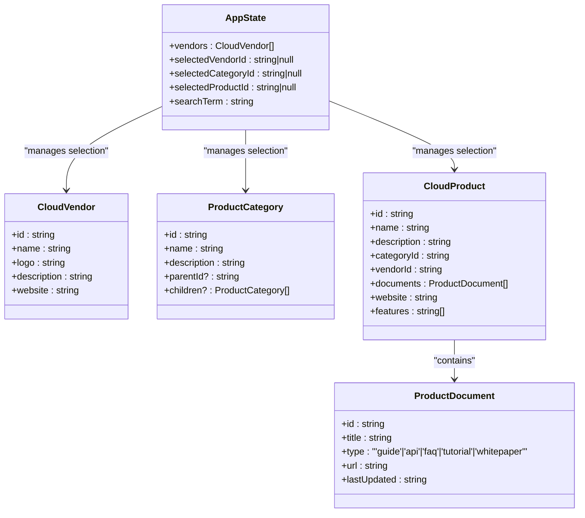
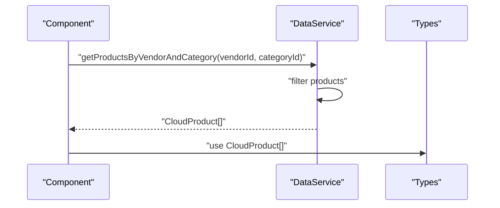
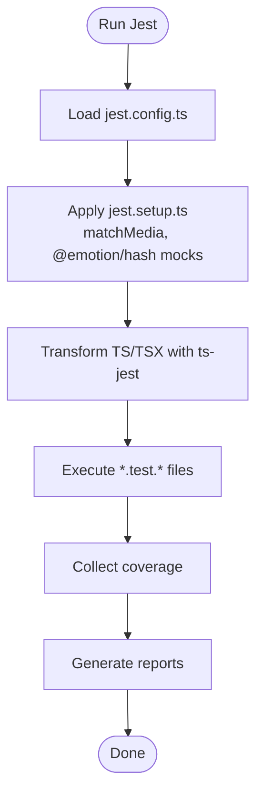
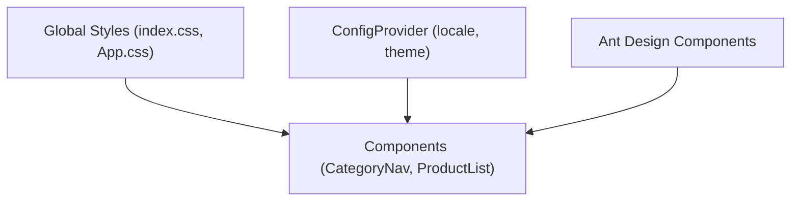
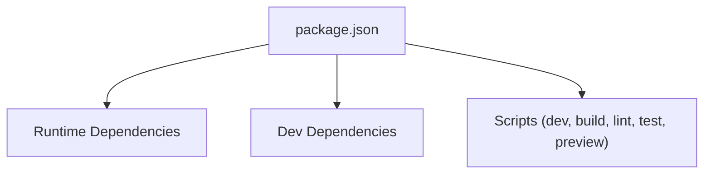

# Development Guidelines

<cite>
**Referenced Files in This Document**
- [package.json](file://web/package.json)
- [eslint.config.js](file://web/eslint.config.js)
- [tsconfig.json](file://web/tsconfig.json)
- [tsconfig.app.json](file://web/tsconfig.app.json)
- [jest.config.ts](file://web/jest.config.ts)
- [jest.setup.ts](file://web/jest.setup.ts)
- [main.tsx](file://web/src/main.tsx)
- [App.css](file://web/src/App.css)
- [index.css](file://web/src/index.css)
- [types/index.ts](file://web/src/types/index.ts)
- [services/dataService.ts](file://web/src/services/dataService.ts)
- [components/CategoryNav.tsx](file://web/src/components/CategoryNav.tsx)
- [components/CategoryNav.test.tsx](file://web/src/components/CategoryNav.test.tsx)
- [components/ProductList.tsx](file://web/src/components/ProductList.tsx)
- [services/dataService.test.ts](file://web/src/services/dataService.test.ts)
</cite>

## Table of Contents
1. [Introduction](#introduction)
2. [Project Structure](#project-structure)
3. [Core Components](#core-components)
4. [Architecture Overview](#architecture-overview)
5. [Detailed Component Analysis](#detailed-component-analysis)
6. [Dependency Analysis](#dependency-analysis)
7. [Performance Considerations](#performance-considerations)
8. [Troubleshooting Guide](#troubleshooting-guide)
9. [Conclusion](#conclusion)
10. [Appendices](#appendices)

## Introduction
This document defines comprehensive development guidelines for the frontend project. It covers code style conventions, TypeScript configuration standards, component architecture, Ant Design integration, CSS styling, build and testing configurations, performance and security considerations, and deployment preparation steps. The goal is to ensure consistent, maintainable, and scalable development across the team.

## Project Structure
The project follows a feature-based layout under the src directory with clear separation of concerns:
- Components: Reusable UI elements (CategoryNav, ProductList, etc.)
- Services: Business logic and data access (DataService)
- Types: Shared TypeScript interfaces and types
- Pages: Top-level page containers (DocumentCenter)
- Assets and styles: Static resources and global styles
- Tests: Unit and component tests for components and services

**Diagram sources**
- [main.tsx:1-20](file://web/src/main.tsx#L1-L20)
- [tsconfig.app.json:1-29](file://web/tsconfig.app.json#L1-L29)
- [eslint.config.js:1-36](file://web/eslint.config.js#L1-L36)
- [jest.config.ts:1-24](file://web/jest.config.ts#L1-L24)
- [jest.setup.ts:1-59](file://web/jest.setup.ts#L1-L59)

**Section sources**
- [main.tsx:1-20](file://web/src/main.tsx#L1-L20)
- [tsconfig.app.json:1-29](file://web/tsconfig.app.json#L1-L29)
- [eslint.config.js:1-36](file://web/eslint.config.js#L1-L36)
- [jest.config.ts:1-24](file://web/jest.config.ts#L1-L24)
- [jest.setup.ts:1-59](file://web/jest.setup.ts#L1-L59)

## Core Components
- TypeScript configuration enforces strictness and unused checks for safer code.
- ESLint enforces React Hooks rules and TypeScript best practices with a modern flat config.
- Jest config supports TSX transforms, jsdom environment, and coverage collection.
- Ant Design is integrated globally via ConfigProvider with Chinese locale.

Key configuration highlights:
- TypeScript strict mode enabled with unused locals and parameters tracking.
- ESLint rules include React Hooks enforcement and controlled use of explicit any.
- Jest presets and moduleNameMapper simplify imports and CSS mocking.
- Ant Design ConfigProvider sets locale and theme globally.

**Section sources**
- [tsconfig.app.json:20-24](file://web/tsconfig.app.json#L20-L24)
- [eslint.config.js:27-33](file://web/eslint.config.js#L27-L33)
- [jest.config.ts:3-24](file://web/jest.config.ts#L3-L24)
- [main.tsx:4-18](file://web/src/main.tsx#L4-L18)

## Architecture Overview
The app initializes with React Router and wraps the application in Ant Design’s ConfigProvider for consistent theming and localization. Components consume data via a centralized service layer that encapsulates data retrieval and filtering logic.

**Diagram sources**
- [main.tsx:1-20](file://web/src/main.tsx#L1-L20)
- [components/CategoryNav.tsx:1-57](file://web/src/components/CategoryNav.tsx#L1-L57)
- [components/ProductList.tsx:1-99](file://web/src/components/ProductList.tsx#L1-L99)
- [services/dataService.ts:1-156](file://web/src/services/dataService.ts#L1-L156)
- [types/index.ts:1-69](file://web/src/types/index.ts#L1-L69)

## Detailed Component Analysis

### Component Architecture Guidelines
- Props interfaces: Define clear, minimal props for each component. Use optional fields only when appropriate.
- Controlled interactions: Prefer passing callbacks for selection and navigation events.
- Composition: Keep components small and focused; delegate data fetching to services.
- Accessibility: Use semantic HTML and Ant Design components’ built-in accessibility features.

Examples in this codebase:
- CategoryNav defines props for categories, selection state, and change handler.
- ProductList renders cards and links while delegating selection to parent handlers.

**Section sources**
- [components/CategoryNav.tsx:7-17](file://web/src/components/CategoryNav.tsx#L7-L17)
- [components/ProductList.tsx:9-12](file://web/src/components/ProductList.tsx#L9-L12)

### Prop Interfaces and State Management Patterns
- Centralized state: Application state interfaces define vendor, category, product, and search terms.
- Component-driven updates: Parent components manage selection and pass down callbacks and data.
- Service-driven data: DataService exposes typed methods for filtering and retrieval.

**Diagram sources**
- [types/index.ts:62-69](file://web/src/types/index.ts#L62-L69)
- [types/index.ts:1-69](file://web/src/types/index.ts#L1-L69)

**Section sources**
- [types/index.ts:62-69](file://web/src/types/index.ts#L62-L69)
- [types/index.ts:1-69](file://web/src/types/index.ts#L1-L69)

### Data Service Usage
- Encapsulation: DataService loads and normalizes data, exposing typed getters and filters.
- Immutability: Returned arrays and mapped documents are copies to avoid accidental mutation.
- Search: Case-insensitive substring search across product name and description.

**Diagram sources**
- [services/dataService.ts:89-93](file://web/src/services/dataService.ts#L89-L93)
- [types/index.ts:45-54](file://web/src/types/index.ts#L45-L54)

**Section sources**
- [services/dataService.ts:89-93](file://web/src/services/dataService.ts#L89-L93)
- [services/dataService.ts:145-151](file://web/src/services/dataService.ts#L145-L151)
- [types/index.ts:45-54](file://web/src/types/index.ts#L45-L54)

### Testing Practices
- Component tests: Use Testing Library to render components, simulate user interactions, and assert behavior.
- Service tests: Verify getters, filters, and search logic with deterministic inputs.
- Test setup: jsdom environment, module name mapping, and CSS mocks enable reliable unit tests.

**Diagram sources**
- [jest.config.ts:1-24](file://web/jest.config.ts#L1-L24)
- [jest.setup.ts:1-59](file://web/jest.setup.ts#L1-L59)

**Section sources**
- [jest.config.ts:1-24](file://web/jest.config.ts#L1-L24)
- [jest.setup.ts:1-59](file://web/jest.setup.ts#L1-L59)
- [components/CategoryNav.test.tsx:1-112](file://web/src/components/CategoryNav.test.tsx#L1-L112)
- [services/dataService.test.ts:1-170](file://web/src/services/dataService.test.ts#L1-L170)

### CSS Styling Conventions and Ant Design Integration
- Global styles: index.css defines base typography, colors, and responsive defaults.
- Component styles: Use Ant Design components’ built-in spacing and theming; avoid overriding core styles unnecessarily.
- Responsive design: Leverage Ant Design’s grid and responsive props (xs, sm, md, lg, xl, xxl) for layouts.
- Locale: Configure Ant Design locale globally via ConfigProvider.

**Diagram sources**
- [index.css:1-69](file://web/src/index.css#L1-L69)
- [App.css:1-43](file://web/src/App.css#L1-L43)
- [main.tsx:4-18](file://web/src/main.tsx#L4-L18)
- [components/ProductList.tsx:31-92](file://web/src/components/ProductList.tsx#L31-L92)

**Section sources**
- [index.css:1-69](file://web/src/index.css#L1-L69)
- [App.css:1-43](file://web/src/App.css#L1-L43)
- [main.tsx:4-18](file://web/src/main.tsx#L4-L18)
- [components/ProductList.tsx:31-92](file://web/src/components/ProductList.tsx#L31-L92)

## Dependency Analysis
- Runtime dependencies include React, React DOM, React Router, Ant Design, icons, and Express for dev server.
- Dev dependencies include TypeScript, ESLint, Jest, Vite, and React hooks refresh plugin.
- Scripts orchestrate development, building, linting, previewing, and testing.

**Diagram sources**
- [package.json:1-50](file://web/package.json#L1-L50)

**Section sources**
- [package.json:1-50](file://web/package.json#L1-L50)

## Performance Considerations
- Keep components pure and memoized where appropriate to reduce re-renders.
- Use Ant Design’s lazy loading features and virtualization for large lists when needed.
- Minimize heavy computations in render; precompute derived data in services.
- Prefer efficient filtering and searching strategies; cache results when repeated queries occur.
- Bundle size: Use dynamic imports for routes and heavy features to defer load.

## Troubleshooting Guide
Common issues and resolutions:
- ESLint errors: Ensure TypeScript project references are configured and parserOptions point to the correct tsconfig.
- Jest failures: Confirm ts-jest transform targets tsconfig.app.json and jsdom environment is loaded.
- CSS import issues: Use moduleNameMapper to alias @/ and mock CSS modules via identity-obj-proxy.
- Responsive test failures: matchMedia is mocked in jest.setup.ts; verify tests rely on this mock.
- Ant Design locale: Ensure ConfigProvider wraps the application and locale is imported.

**Section sources**
- [eslint.config.js:20-25](file://web/eslint.config.js#L20-L25)
- [jest.config.ts:13-16](file://web/jest.config.ts#L13-L16)
- [jest.setup.ts:3-16](file://web/jest.setup.ts#L3-L16)
- [main.tsx:4-18](file://web/src/main.tsx#L4-L18)

## Conclusion
These guidelines establish a consistent foundation for building, testing, and maintaining the frontend. By adhering to TypeScript strictness, ESLint rules, Ant Design integration, and robust testing practices, the project remains scalable, readable, and secure.

## Appendices

### Build Configuration and Scripts
- Development: Start the Vite dev server with hot reload.
- Production build: Compile TypeScript declarations and bundle with Vite.
- Preview: Serve the production build locally.
- Lint: Run ESLint across the project.
- Test: Execute Jest tests with coverage.

**Section sources**
- [package.json:6-14](file://web/package.json#L6-L14)

### TypeScript Configuration Standards
- Strict mode enabled with unused locals and parameters tracking.
- JSX transform set to react-jsx with bundler module resolution.
- Exclude test files from type checking to speed up builds.

**Section sources**
- [tsconfig.app.json:20-24](file://web/tsconfig.app.json#L20-L24)
- [tsconfig.app.json:13-18](file://web/tsconfig.app.json#L13-L18)
- [tsconfig.app.json:26-28](file://web/tsconfig.app.json#L26-L28)

### ESLint Configuration and Formatting Rules
- Flat config with plugins for React Hooks and TypeScript.
- React Hooks enforced; exhaustive deps warnings recommended.
- Controlled use of explicit any; function return types and module boundaries relaxed for developer velocity.

**Section sources**
- [eslint.config.js:27-33](file://web/eslint.config.js#L27-L33)

### Component Implementation Examples
- Category navigation: Accepts categories, selection state, and change handler; renders a tree with Ant Design Tree.
- Product list: Renders cards with responsive grid props and Ant Design components.

**Section sources**
- [components/CategoryNav.tsx:13-54](file://web/src/components/CategoryNav.tsx#L13-L54)
- [components/ProductList.tsx:14-96](file://web/src/components/ProductList.tsx#L14-L96)

### Data Service Usage Examples
- Filtering by vendor and category.
- Searching products by keyword with case-insensitive substring matching.

**Section sources**
- [services/dataService.ts:89-93](file://web/src/services/dataService.ts#L89-L93)
- [services/dataService.ts:145-151](file://web/src/services/dataService.ts#L145-L151)

### Testing Practices
- Component tests: Render with Testing Library, fire events, and assert expectations.
- Service tests: Validate getters, filters, and search logic with known inputs.
- Test setup: Configure jsdom, module name mapping, and CSS mocks.

**Section sources**
- [components/CategoryNav.test.tsx:41-111](file://web/src/components/CategoryNav.test.tsx#L41-L111)
- [services/dataService.test.ts:3-169](file://web/src/services/dataService.test.ts#L3-L169)
- [jest.config.ts:7-11](file://web/jest.config.ts#L7-L11)
- [jest.setup.ts:18-57](file://web/jest.setup.ts#L18-L57)

### Security Considerations
- Sanitize external links: When rendering links from data, ensure protocols and targets are validated.
- Content Security Policy: Configure CSP headers in production servers to mitigate XSS risks.
- Dependency hygiene: Regularly audit dependencies and keep versions updated.

### Deployment Preparation Steps
- Build: Run the production build script to generate optimized bundles.
- Preview: Use the preview script to validate the production build locally.
- Lint: Ensure all lint errors are resolved before merging to main.
- Test: Run tests with coverage to confirm quality gates.

**Section sources**
- [package.json:7-14](file://web/package.json#L7-L14)