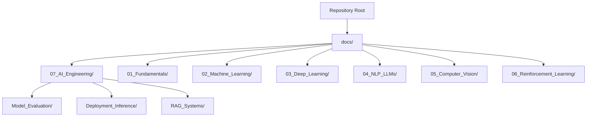
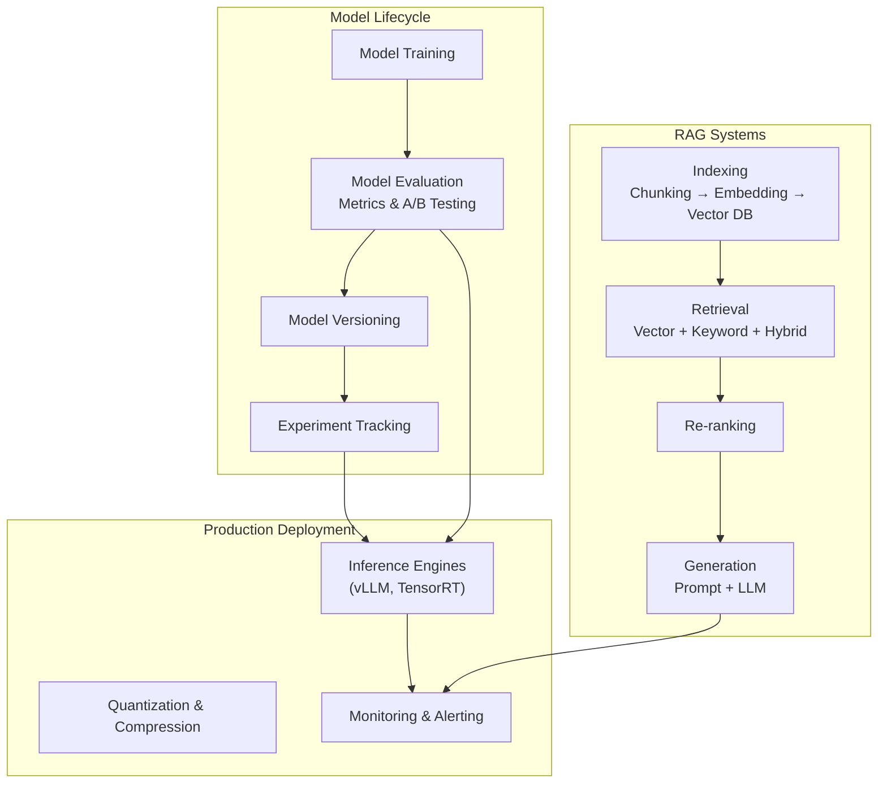
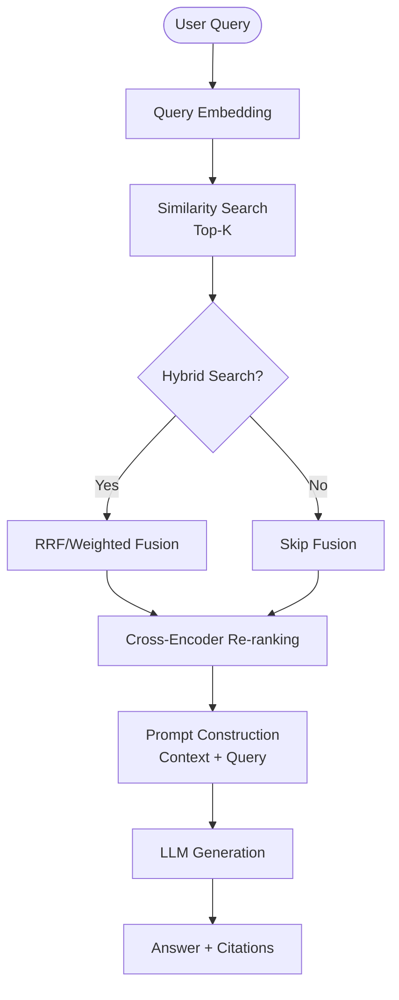
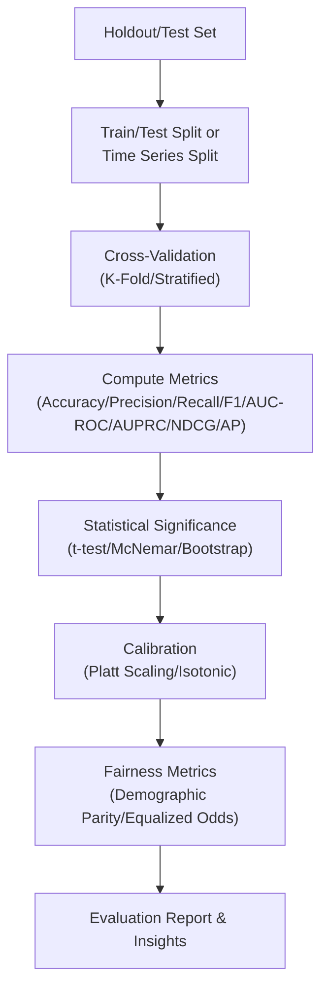
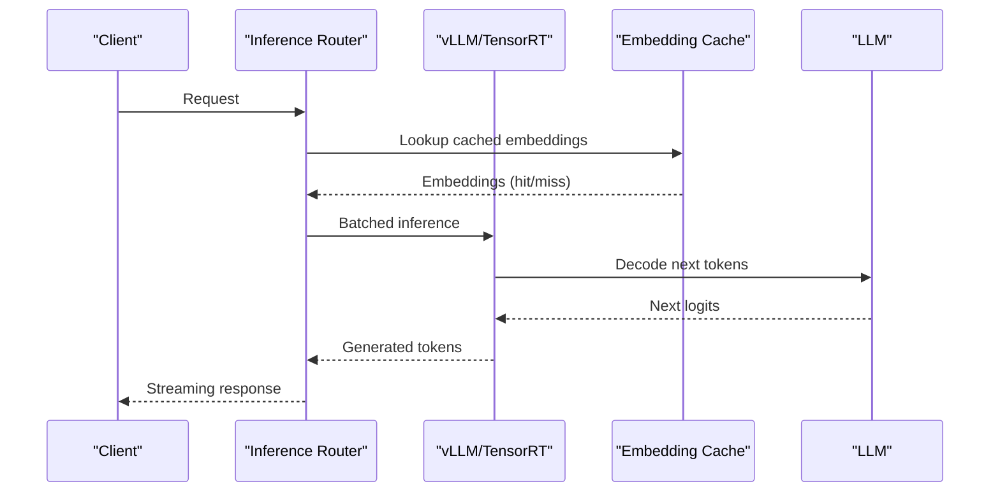
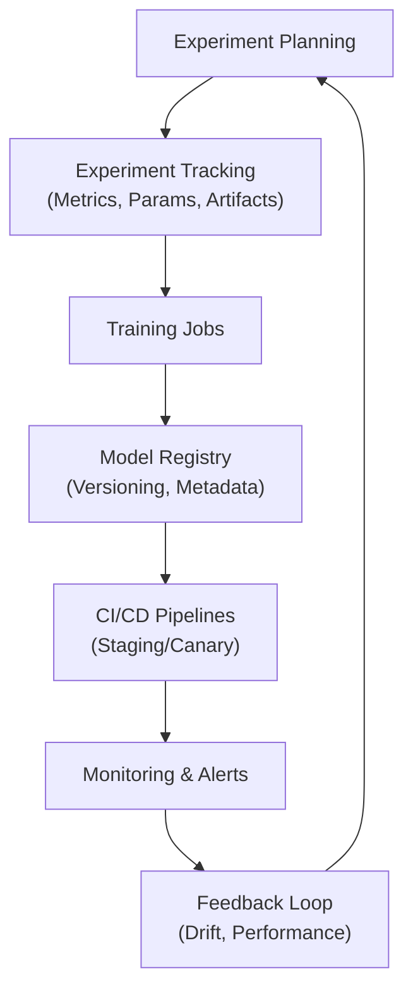
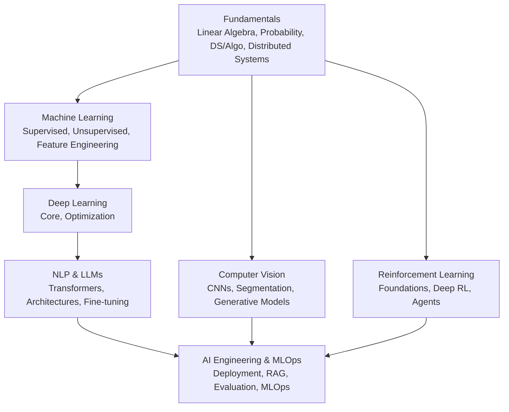

# AI Engineering & MLOps Education

<cite>
**Referenced Files in This Document**
- [README.md](file://README.md)
- [docs/README.md](file://docs/README.md)
- [docs/07_AI_Engineering/README.md](file://docs/07_AI_Engineering/README.md)
- [docs/07_AI_Engineering/RAG_Systems/RAG_Systems.md](file://docs/07_AI_Engineering/RAG_Systems/RAG_Systems.md)
- [docs/07_AI_Engineering/Model_Evaluation/Model_Evaluation.md](file://docs/07_AI_Engineering/Model_Evaluation/Model_Evaluation.md)
- [docs/01_Fundamentals/README.md](file://docs/01_Fundamentals/README.md)
- [docs/02_Machine_Learning/README.md](file://docs/02_Machine_Learning/README.md)
- [docs/03_Deep_Learning/README.md](file://docs/03_Deep_Learning/README.md)
- [docs/05_Computer_Vision/README.md](file://docs/05_Computer_Vision/README.md)
- [docs/06_Reinforcement_Learning/README.md](file://docs/06_Reinforcement_Learning/README.md)
</cite>

## Table of Contents
1. [Introduction](#introduction)
2. [Project Structure](#project-structure)
3. [Core Components](#core-components)
4. [Architecture Overview](#architecture-overview)
5. [Detailed Component Analysis](#detailed-component-analysis)
6. [Dependency Analysis](#dependency-analysis)
7. [Performance Considerations](#performance-considerations)
8. [Troubleshooting Guide](#troubleshooting-guide)
9. [Conclusion](#conclusion)
10. [Appendices](#appendices)

## Introduction
This document presents a comprehensive, structured guide to the AI engineering and MLOps education system. It explains the complete AI development lifecycle—from foundational skills to deployment—covering model training and evaluation methodologies, and the implementation of Retrieval-Augmented Generation (RAG) systems. The pedagogical approach emphasizes simplified explanations for complex engineering concepts, integrating theoretical foundations with practical MLOps workflows. A bilingual terminology system supports technical vocabulary in both English and Chinese, enabling learners to master AI engineering from fundamentals to enterprise-scale MLOps operations.

## Project Structure
The repository organizes knowledge into a taxonomy spanning fundamentals, classical machine learning, deep learning foundations, NLP and LLMs, computer vision, reinforcement learning, AI engineering and MLOps, ethics and safety, talks/perspectives, essential papers, and interview preparation. The AI engineering and MLOps chapter focuses on deployment, inference, RAG systems, MLOps pipelines, and model evaluation.

**Diagram sources**
- [README.md:16-73](file://README.md#L16-L73)
- [docs/README.md:5-90](file://docs/README.md#L5-L90)
- [docs/07_AI_Engineering/README.md:1-62](file://docs/07_AI_Engineering/README.md#L1-L62)

**Section sources**
- [README.md:16-73](file://README.md#L16-L73)
- [docs/README.md:5-90](file://docs/README.md#L5-L90)

## Core Components
- Fundamentals: Linear algebra, probability/statistics, data structures/algorithms, distributed systems. These underpin all subsequent topics.
- Classical Machine Learning: Supervised learning, unsupervised learning, and feature engineering.
- Deep Learning Foundations: Neural network core, optimization, and regularization.
- NLP & LLMs: Transformers, architectures, fine-tuning techniques.
- Computer Vision: Classification/detection, segmentation, multimodal vision, generative models.
- Reinforcement Learning: Foundations, deep RL, and agent architectures.
- AI Engineering & MLOps: Deployment/inference, RAG systems, MLOps pipelines, model evaluation.

These components form a coherent learning progression from essential AI skills through workflow orchestration, model lifecycle management, and production deployment.

**Section sources**
- [docs/01_Fundamentals/README.md:1-59](file://docs/01_Fundamentals/README.md#L1-L59)
- [docs/02_Machine_Learning/README.md:1-58](file://docs/02_Machine_Learning/README.md#L1-L58)
- [docs/03_Deep_Learning/README.md:1-50](file://docs/03_Deep_Learning/README.md#L1-L50)
- [docs/05_Computer_Vision/README.md:1-63](file://docs/05_Computer_Vision/README.md#L1-L63)
- [docs/06_Reinforcement_Learning/README.md:1-59](file://docs/06_Reinforcement_Learning/README.md#L1-L59)
- [docs/07_AI_Engineering/README.md:1-62](file://docs/07_AI_Engineering/README.md#L1-L62)

## Architecture Overview
The AI engineering and MLOps system integrates three pillars:
- Model Lifecycle: Training, evaluation, versioning, and experimentation tracking.
- Production Deployment: Inference optimization (quantization, acceleration), serving stacks, and monitoring.
- Knowledge Retrieval: RAG pipelines for retrieval-augmented generation, vector databases, hybrid search, and re-ranking.

**Diagram sources**
- [docs/07_AI_Engineering/README.md:5-29](file://docs/07_AI_Engineering/README.md#L5-L29)
- [docs/07_AI_Engineering/RAG_Systems/RAG_Systems.md:105-157](file://docs/07_AI_Engineering/RAG_Systems/RAG_Systems.md#L105-L157)
- [docs/07_AI_Engineering/Model_Evaluation/Model_Evaluation.md:1-23](file://docs/07_AI_Engineering/Model_Evaluation/Model_Evaluation.md#L1-L23)

## Detailed Component Analysis

### RAG Systems
RAG enhances LLMs by retrieving external knowledge to reduce hallucinations, address knowledge cutoffs, and improve domain-specific accuracy. The pipeline comprises three stages: indexing, retrieval, and generation, with optional enhancements like hybrid search and re-ranking.

**Diagram sources**
- [docs/07_AI_Engineering/RAG_Systems/RAG_Systems.md:105-157](file://docs/07_AI_Engineering/RAG_Systems/RAG_Systems.md#L105-L157)
- [docs/07_AI_Engineering/RAG_Systems/RAG_Systems.md:159-191](file://docs/07_AI_Engineering/RAG_Systems/RAG_Systems.md#L159-L191)
- [docs/07_AI_Engineering/RAG_Systems/RAG_Systems.md:192-215](file://docs/07_AI_Engineering/RAG_Systems/RAG_Systems.md#L192-L215)

Key capabilities and trade-offs:
- Indexing: chunking strategies, embedding models, vector databases.
- Retrieval: vector similarity, keyword/BM25, hybrid fusion.
- Generation: prompt engineering, citations, and LLM-as-Judge evaluation.

Common pitfalls and remedies:
- Improper chunk size, incorrect Top-K, mismatched embedding models, and missing metadata filtering.

Production considerations:
- Vector index scaling (HNSW/IVF), caching, batching, graceful degradation, monitoring, incremental updates, and cost-aware routing.

**Section sources**
- [docs/07_AI_Engineering/RAG_Systems/RAG_Systems.md:1-642](file://docs/07_AI_Engineering/RAG_Systems/RAG_Systems.md#L1-L642)

### Model Evaluation
Model evaluation ensures reliable generalization and aligns metrics with business outcomes. It covers classification/regression/ranking metrics, statistical significance, calibration, fairness, and LLM-specific benchmarks.

**Diagram sources**
- [docs/07_AI_Engineering/Model_Evaluation/Model_Evaluation.md:177-213](file://docs/07_AI_Engineering/Model_Evaluation/Model_Evaluation.md#L177-L213)
- [docs/07_AI_Engineering/Model_Evaluation/Model_Evaluation.md:312-344](file://docs/07_AI_Engineering/Model_Evaluation/Model_Evaluation.md#L312-L344)

Guidance highlights:
- Choose metrics aligned to business impact (e.g., precision for spam, recall for disease screening).
- Use stratified CV and proper time-series splits to avoid leakage.
- Employ LLM-as-Judge and human evaluation for generation tasks.

**Section sources**
- [docs/07_AI_Engineering/Model_Evaluation/Model_Evaluation.md:1-397](file://docs/07_AI_Engineering/Model_Evaluation/Model_Evaluation.md#L1-L397)

### Deployment & Inference
Production-grade inference requires acceleration and quantization to minimize latency and memory footprint while preserving quality. Serving stacks like vLLM and TensorRT enable efficient LLM serving.

**Diagram sources**
- [docs/07_AI_Engineering/README.md:35-36](file://docs/07_AI_Engineering/README.md#L35-L36)

Operational excellence:
- Continuous batching, PagedAttention, quantization (INT8/FP8), and compression (AWQ/GPTQ).
- Monitoring latency, throughput, and error rates; implementing retries and fallbacks.

**Section sources**
- [docs/07_AI_Engineering/README.md:35-36](file://docs/07_AI_Engineering/README.md#L35-L36)

### MLOps Pipeline
MLOps automates the end-to-end ML lifecycle: experiment tracking, model registry, CI/CD, and monitoring. It ensures reproducibility, governance, and reliability across teams.

**Diagram sources**
- [docs/07_AI_Engineering/README.md:37-38](file://docs/07_AI_Engineering/README.md#L37-L38)

Best practices:
- Artifact logging, parameter sweeps, reproducible environments, automated validation, and A/B testing readiness.

**Section sources**
- [docs/07_AI_Engineering/README.md:37-38](file://docs/07_AI_Engineering/README.md#L37-L38)

## Dependency Analysis
The AI engineering curriculum builds progressively on prior knowledge, ensuring strong foundations before advanced topics.

**Diagram sources**
- [docs/01_Fundamentals/README.md:1-59](file://docs/01_Fundamentals/README.md#L1-L59)
- [docs/02_Machine_Learning/README.md:1-58](file://docs/02_Machine_Learning/README.md#L1-L58)
- [docs/03_Deep_Learning/README.md:1-50](file://docs/03_Deep_Learning/README.md#L1-L50)
- [docs/05_Computer_Vision/README.md:1-63](file://docs/05_Computer_Vision/README.md#L1-L63)
- [docs/06_Reinforcement_Learning/README.md:1-59](file://docs/06_Reinforcement_Learning/README.md#L1-L59)
- [docs/07_AI_Engineering/README.md:40-46](file://docs/07_AI_Engineering/README.md#L40-L46)

**Section sources**
- [docs/01_Fundamentals/README.md:1-59](file://docs/01_Fundamentals/README.md#L1-L59)
- [docs/02_Machine_Learning/README.md:1-58](file://docs/02_Machine_Learning/README.md#L1-L58)
- [docs/03_Deep_Learning/README.md:1-50](file://docs/03_Deep_Learning/README.md#L1-L50)
- [docs/05_Computer_Vision/README.md:1-63](file://docs/05_Computer_Vision/README.md#L1-L63)
- [docs/06_Reinforcement_Learning/README.md:1-59](file://docs/06_Reinforcement_Learning/README.md#L1-L59)
- [docs/07_AI_Engineering/README.md:40-46](file://docs/07_AI_Engineering/README.md#L40-L46)

## Performance Considerations
- RAG performance hinges on chunk size selection, embedding model alignment, and hybrid retrieval weighting. Use recall and answer quality baselines to tune Top-K and fusion weights.
- Inference optimization trades off speed and accuracy via quantization and acceleration libraries; batch requests and cache embeddings to reduce latency.
- MLOps pipelines require robust monitoring and alerting to detect drift and regressions early, enabling rapid remediation.

[No sources needed since this section provides general guidance]

## Troubleshooting Guide
Common issues and resolutions:
- RAG hallucinations: enforce grounding prompts, cite sources, apply Self-RAG, and use NLI-based faithfulness checks.
- Retrieval noise: adjust chunk size and overlap, filter by metadata, and apply re-ranking.
- Model evaluation pitfalls: avoid accuracy-only metrics on imbalanced data, prevent data leakage, and validate differences statistically.
- Production instability: implement graceful degradation, monitor latency/throughput/error rates, and maintain rollback procedures.

**Section sources**
- [docs/07_AI_Engineering/RAG_Systems/RAG_Systems.md:579-600](file://docs/07_AI_Engineering/RAG_Systems/RAG_Systems.md#L579-L600)
- [docs/07_AI_Engineering/Model_Evaluation/Model_Evaluation.md:338-344](file://docs/07_AI_Engineering/Model_Evaluation/Model_Evaluation.md#L338-L344)

## Conclusion
This education system provides a rigorous, bilingual pathway from fundamentals to production-grade AI engineering. By combining theoretical rigor with practical MLOps workflows, learners acquire both technical depth and operational excellence. The RAG and evaluation chapters demonstrate how to build reliable, explainable, and high-performance AI systems ready for real-world deployment.

[No sources needed since this section summarizes without analyzing specific files]

## Appendices
- Bilingual Terminology: Core concepts are presented with English and Chinese terms to support multilingual learners.
- Industry References: Academic papers, standards, and open-source projects are cited throughout to anchor learning in best practices and cutting-edge research.

[No sources needed since this section provides general guidance]