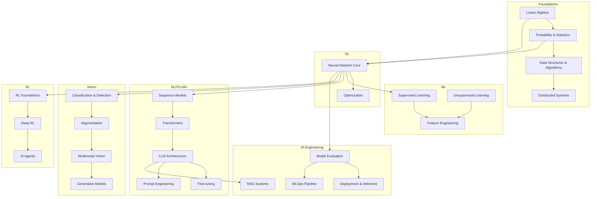
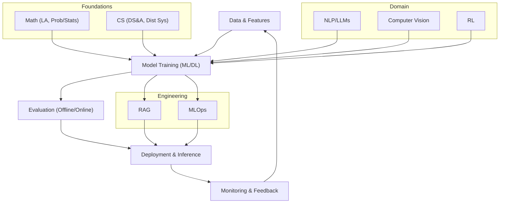
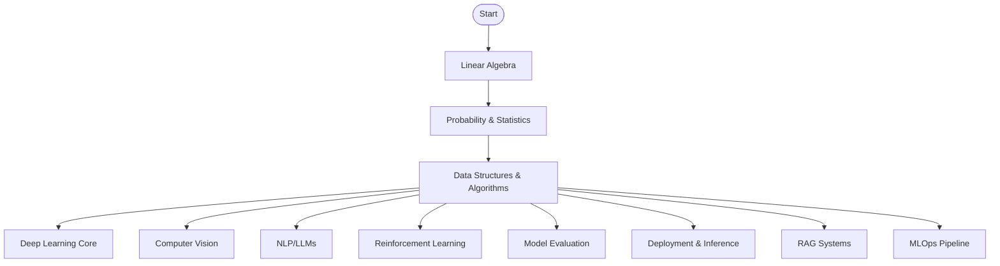
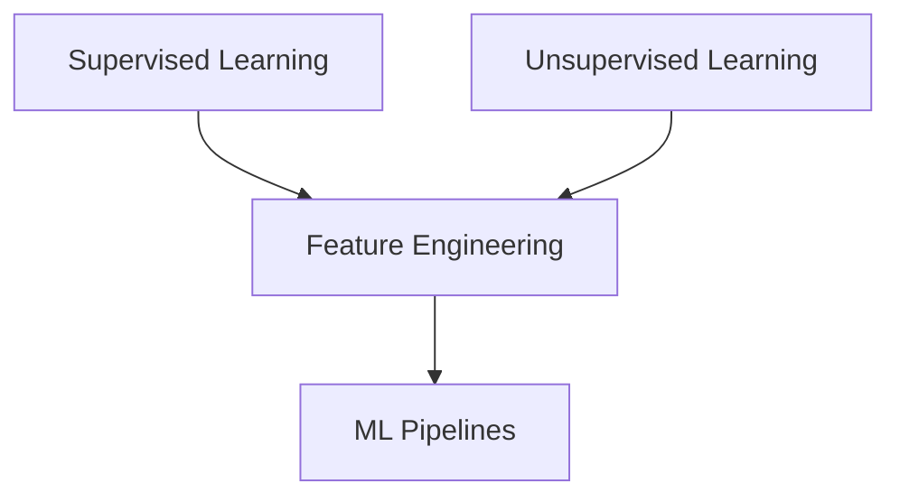
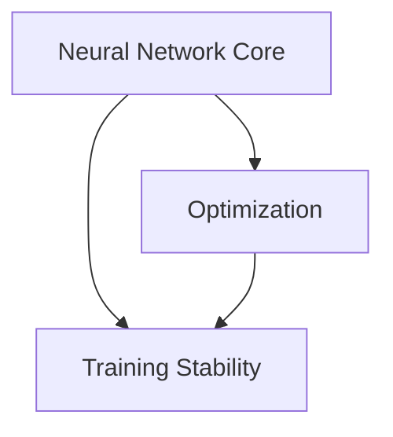
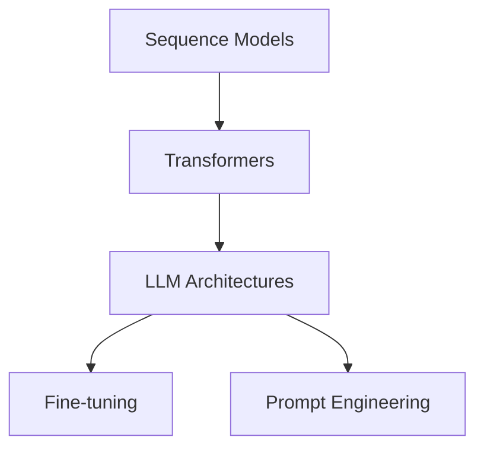
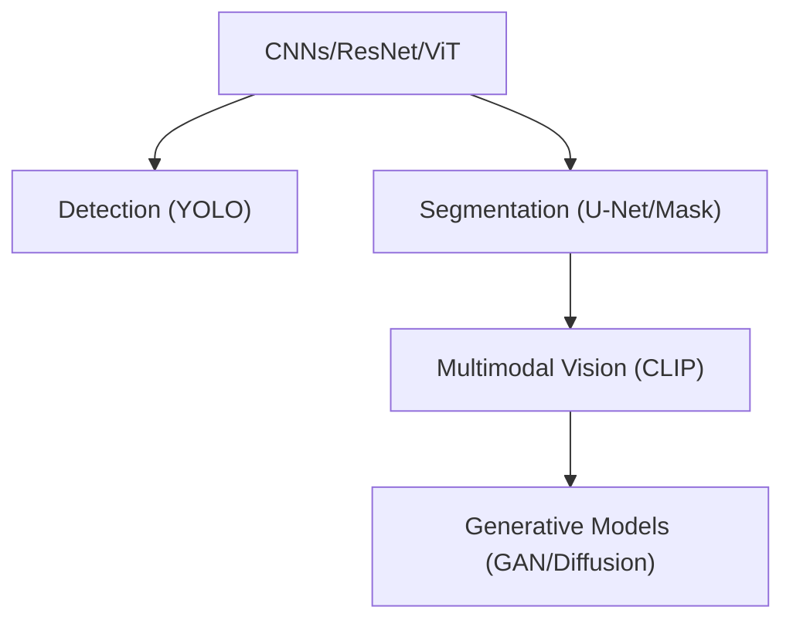
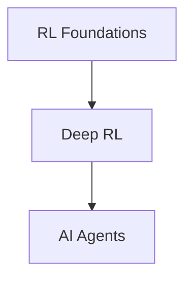
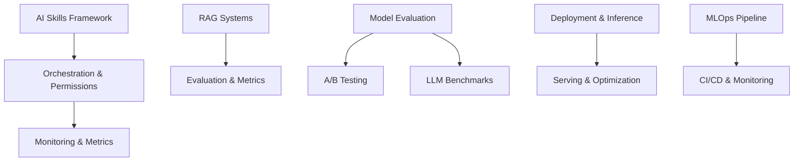
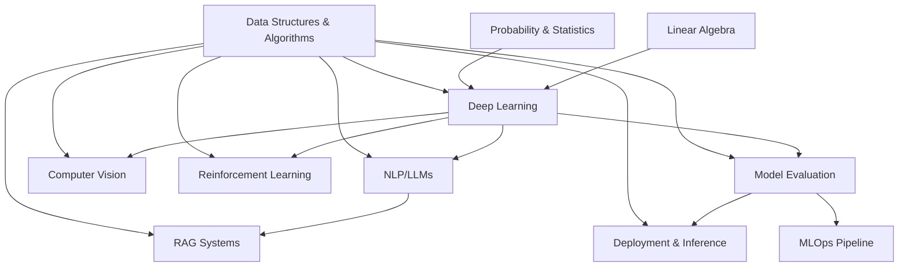

# AI Skills Foundation

<cite>
**Referenced Files in This Document**
- [README.md](file://docs/01_Fundamentals/README.md)
- [Data_Structures_Algorithms_for_dummy.md](file://docs/01_Fundamentals/Data_Structures_Algorithms/Data_Structures_Algorithms_for_dummy.md)
- [Probability_Statistics_for_dummy.md](file://docs/01_Fundamentals/Probability_Statistics/Probability_Statistics_for_dummy.md)
- [README.md](file://docs/02_Machine_Learning/README.md)
- [README.md](file://docs/03_Deep_Learning/README.md)
- [README_for_dummy.md](file://docs/04_NLP_LLMs/README_for_dummy.md)
- [README.md](file://docs/05_Computer_Vision/README.md)
- [README.md](file://docs/06_Reinforcement_Learning/README.md)
- [README.md](file://docs/07_AI_Engineering/README.md)
- [Skills-in-nutshell.md](file://docs/07_AI_Engineering/AI_Skills/Skills-in-nutshell.md)
- [RAG-in-nutshell.md](file://docs/07_AI_Engineering/RAG_Systems/RAG-in-nutshell.md)
- [Model_Evaluation_for_dummy.md](file://docs/07_AI_Engineering/Model_Evaluation/Model_Evaluation_for_dummy.md)
</cite>

## Table of Contents
1. [Introduction](#introduction)
2. [Project Structure](#project-structure)
3. [Core Components](#core-components)
4. [Architecture Overview](#architecture-overview)
5. [Detailed Component Analysis](#detailed-component-analysis)
6. [Dependency Analysis](#dependency-analysis)
7. [Performance Considerations](#performance-considerations)
8. [Troubleshooting Guide](#troubleshooting-guide)
9. [Conclusion](#conclusion)
10. [Appendices](#appendices)

## Introduction
This document presents a comprehensive AI skills foundation tailored for AI engineering roles. It synthesizes the repository’s structured chapters into a practical roadmap spanning fundamentals (mathematics and CS basics), machine learning, deep learning, NLP/LLMs, computer vision, reinforcement learning, and AI engineering (deployment, evaluation, and RAG). The emphasis is on building competencies through hands-on application, connecting theory to real-world challenges, and integrating soft skills such as problem-solving, critical thinking, and collaboration.

## Project Structure
The repository organizes knowledge into progressive domains:
- Fundamentals: Linear algebra, probability/statistics, data structures/algorithms, distributed systems
- Classical ML: Supervised learning, unsupervised learning, feature engineering
- Deep Learning: Neural network core, optimization
- NLP/LLMs: Sequence models, Transformers, LLM architectures, fine-tuning, prompt engineering
- Computer Vision: Classification/detection, segmentation, multimodal vision, generative models
- Reinforcement Learning: Foundations, deep RL, intelligent agents
- AI Engineering: Model evaluation, deployment/inference, RAG systems, MLOps pipeline

**Diagram sources**
- [README.md:1-59](file://docs/01_Fundamentals/README.md#L1-L59)
- [README.md:1-58](file://docs/02_Machine_Learning/README.md#L1-L58)
- [README.md:1-50](file://docs/03_Deep_Learning/README.md#L1-L50)
- [README_for_dummy.md:1-279](file://docs/04_NLP_LLMs/README_for_dummy.md#L1-L279)
- [README.md:1-63](file://docs/05_Computer_Vision/README.md#L1-L63)
- [README.md:1-59](file://docs/06_Reinforcement_Learning/README.md#L1-L59)
- [README.md:1-62](file://docs/07_AI_Engineering/README.md#L1-L62)

**Section sources**
- [README.md:1-59](file://docs/01_Fundamentals/README.md#L1-L59)
- [README.md:1-58](file://docs/02_Machine_Learning/README.md#L1-L58)
- [README.md:1-50](file://docs/03_Deep_Learning/README.md#L1-L50)
- [README_for_dummy.md:1-279](file://docs/04_NLP_LLMs/README_for_dummy.md#L1-L279)
- [README.md:1-63](file://docs/05_Computer_Vision/README.md#L1-L63)
- [README.md:1-59](file://docs/06_Reinforcement_Learning/README.md#L1-L59)
- [README.md:1-62](file://docs/07_AI_Engineering/README.md#L1-L62)

## Core Components
This section outlines the essential skill categories and their practical application focus, aligned with the repository’s chapter structure.

- Programming Proficiency (Python, R)
  - Practical emphasis: Data manipulation, model training, deployment scripting, and automation.
  - Integration: Used across ML/DL/NLP/Vision/RL and AI engineering tasks.

- Mathematics Foundations
  - Linear Algebra: Tensors, eigenvalue decomposition, SVD for model representation and dimensionality reduction.
  - Probability & Statistics: Bayes’ theorem, distributions, entropy, cross-entropy, KL divergence for uncertainty modeling and loss design.

- Data Structures & Algorithms
  - Complexity, computation graphs, automatic differentiation, beam search, vector search (HNSW), hash tables.
  - Application: Efficient model training, inference, and retrieval.

- Machine Learning
  - Supervised learning (classification/regression/ensemble), unsupervised learning (clustering, dimensionality reduction), feature engineering.
  - Tools: Scikit-learn, Pandas, XGBoost/LightGBM.

- Deep Learning
  - Neural network core (activation functions, normalization), backpropagation, optimizers (Adam/AdamW), regularization (dropout, weight decay).
  - Applications: Modern architectures and training stability.

- NLP/LLMs
  - Sequence models (RNN/LSTM/GRU), Transformers, attention mechanisms, LLM architectures (GPT/BERT), fine-tuning (LoRA, RLHF), prompt engineering.
  - Use cases: Text generation, understanding, retrieval-augmented generation.

- Computer Vision
  - CNNs, ResNet, ViT, YOLO, segmentation (U-Net/Mask R-CNN), multimodal models (CLIP), generative models (GAN/Diffusion).

- Reinforcement Learning
  - MDPs, Bellman equations, value/policy functions, DQN/PPO/SAC, intelligent agents (reasoning, memory, tool use).

- AI Engineering
  - Model evaluation (offline/online, A/B testing, LLM benchmarks), deployment/inference (quantization, acceleration), RAG systems (retrieval, reranking, hybrid search), MLOps (experiment tracking, CI/CD, monitoring).

Soft skills integration:
- Problem-solving: Framing problems, selecting appropriate models, designing experiments.
- Critical thinking: Evaluating metrics, interpreting trade-offs, validating assumptions.
- Collaboration: Clear documentation, reproducible pipelines, shared evaluation protocols.

**Section sources**
- [README.md:38-56](file://docs/01_Fundamentals/README.md#L38-L56)
- [Data_Structures_Algorithms_for_dummy.md:1-189](file://docs/01_Fundamentals/Data_Structures_Algorithms/Data_Structures_Algorithms_for_dummy.md#L1-L189)
- [Probability_Statistics_for_dummy.md:1-205](file://docs/01_Fundamentals/Probability_Statistics/Probability_Statistics_for_dummy.md#L1-L205)
- [README.md:37-55](file://docs/02_Machine_Learning/README.md#L37-L55)
- [README.md:29-47](file://docs/03_Deep_Learning/README.md#L29-L47)
- [README_for_dummy.md:141-177](file://docs/04_NLP_LLMs/README_for_dummy.md#L141-L177)
- [README.md:41-60](file://docs/05_Computer_Vision/README.md#L41-L60)
- [README.md:37-56](file://docs/06_Reinforcement_Learning/README.md#L37-L56)
- [README.md:40-60](file://docs/07_AI_Engineering/README.md#L40-L60)

## Architecture Overview
The AI engineering lifecycle integrates foundational knowledge, ML/DL, domain expertise, and engineering practices.

**Diagram sources**
- [README.md:1-59](file://docs/01_Fundamentals/README.md#L1-L59)
- [README.md:1-58](file://docs/02_Machine_Learning/README.md#L1-L58)
- [README.md:1-50](file://docs/03_Deep_Learning/README.md#L1-L50)
- [README_for_dummy.md:1-279](file://docs/04_NLP_LLMs/README_for_dummy.md#L1-L279)
- [README.md:1-63](file://docs/05_Computer_Vision/README.md#L1-L63)
- [README.md:1-59](file://docs/06_Reinforcement_Learning/README.md#L1-L59)
- [README.md:1-62](file://docs/07_AI_Engineering/README.md#L1-L62)

## Detailed Component Analysis

### Foundational Mathematics and CS
- Linear Algebra: Tensor operations, eigenvalue decomposition, SVD underpin model parameters and dimensionality reduction.
- Probability & Statistics: Bayes’ theorem, distributions, entropy, cross-entropy, KL divergence inform uncertainty modeling and loss design.
- Data Structures & Algorithms: Complexity, computation graphs, automatic differentiation, beam search, HNSW, hash tables power efficient training and retrieval.

**Diagram sources**
- [README.md:1-59](file://docs/01_Fundamentals/README.md#L1-L59)
- [Data_Structures_Algorithms_for_dummy.md:1-189](file://docs/01_Fundamentals/Data_Structures_Algorithms/Data_Structures_Algorithms_for_dummy.md#L1-L189)
- [Probability_Statistics_for_dummy.md:1-205](file://docs/01_Fundamentals/Probability_Statistics/Probability_Statistics_for_dummy.md#L1-L205)

**Section sources**
- [README.md:38-56](file://docs/01_Fundamentals/README.md#L38-L56)
- [Data_Structures_Algorithms_for_dummy.md:22-189](file://docs/01_Fundamentals/Data_Structures_Algorithms/Data_Structures_Algorithms_for_dummy.md#L22-L189)
- [Probability_Statistics_for_dummy.md:20-155](file://docs/01_Fundamentals/Probability_Statistics/Probability_Statistics_for_dummy.md#L20-L155)

### Machine Learning
- Supervised learning: Classification, regression, ensemble methods (XGBoost/LightGBM).
- Unsupervised learning: Clustering (K-Means/DBSCAN), dimensionality reduction (PCA/t-SNE).
- Feature engineering: Selection, construction, encoding to improve model performance.

**Diagram sources**
- [README.md:1-58](file://docs/02_Machine_Learning/README.md#L1-L58)

**Section sources**
- [README.md:37-55](file://docs/02_Machine_Learning/README.md#L37-L55)

### Deep Learning
- Neural network core: Activation functions, normalization, backpropagation.
- Optimization: Adam/AdamW, learning rate scheduling, dropout, weight decay.

**Diagram sources**
- [README.md:1-50](file://docs/03_Deep_Learning/README.md#L1-L50)

**Section sources**
- [README.md:29-47](file://docs/03_Deep_Learning/README.md#L29-L47)

### NLP and Large Language Models
- Sequence models, Transformers, attention, LLM architectures (GPT/BERT), fine-tuning (LoRA, RLHF), prompt engineering.

**Diagram sources**
- [README_for_dummy.md:17-118](file://docs/04_NLP_LLMs/README_for_dummy.md#L17-L118)

**Section sources**
- [README_for_dummy.md:141-177](file://docs/04_NLP_LLMs/README_for_dummy.md#L141-L177)

### Computer Vision
- CNNs, ResNet, ViT, detection (YOLO), segmentation (U-Net/Mask R-CNN), multimodal vision (CLIP), generative models (GAN/Diffusion).

**Diagram sources**
- [README.md:1-63](file://docs/05_Computer_Vision/README.md#L1-L63)

**Section sources**
- [README.md:41-60](file://docs/05_Computer_Vision/README.md#L41-L60)

### Reinforcement Learning
- Foundations: MDPs, Bellman equations, value/policy functions.
- Deep RL: DQN, PPO, SAC, actor-critic.
- Agents: Reasoning, memory, tool use, multi-agent systems.

**Diagram sources**
- [README.md:1-59](file://docs/06_Reinforcement_Learning/README.md#L1-L59)

**Section sources**
- [README.md:37-56](file://docs/06_Reinforcement_Learning/README.md#L37-L56)

### AI Engineering: Skills, RAG, Evaluation, Deployment
- AI Skills: Modular, composable capabilities with input/output schemas, permissions, monitoring, and orchestration.
- RAG: Retrieval-augmented generation with ingestion, chunking, embeddings, vector stores, hybrid search, reranking, and evaluation.
- Model Evaluation: Offline metrics, online A/B testing, LLM benchmarks.
- Deployment & Inference: Quantization, acceleration, serving.
- MLOps: Experiment tracking, model registry, CI/CD, monitoring.

**Diagram sources**
- [README.md:1-62](file://docs/07_AI_Engineering/README.md#L1-L62)
- [Skills-in-nutshell.md:1-858](file://docs/07_AI_Engineering/AI_Skills/Skills-in-nutshell.md#L1-L858)
- [RAG-in-nutshell.md:1-575](file://docs/07_AI_Engineering/RAG_Systems/RAG-in-nutshell.md#L1-L575)
- [Model_Evaluation_for_dummy.md:1-683](file://docs/07_AI_Engineering/Model_Evaluation/Model_Evaluation_for_dummy.md#L1-L683)

**Section sources**
- [README.md:40-60](file://docs/07_AI_Engineering/README.md#L40-L60)
- [Skills-in-nutshell.md:1-858](file://docs/07_AI_Engineering/AI_Skills/Skills-in-nutshell.md#L1-L858)
- [RAG-in-nutshell.md:1-575](file://docs/07_AI_Engineering/RAG_Systems/RAG-in-nutshell.md#L1-L575)
- [Model_Evaluation_for_dummy.md:1-683](file://docs/07_AI_Engineering/Model_Evaluation/Model_Evaluation_for_dummy.md#L1-L683)

## Dependency Analysis
The following diagram highlights dependencies among core domains and how they feed into AI engineering outcomes.

**Diagram sources**
- [README.md:1-59](file://docs/01_Fundamentals/README.md#L1-L59)
- [README.md:1-58](file://docs/02_Machine_Learning/README.md#L1-L58)
- [README.md:1-50](file://docs/03_Deep_Learning/README.md#L1-L50)
- [README_for_dummy.md:1-279](file://docs/04_NLP_LLMs/README_for_dummy.md#L1-L279)
- [README.md:1-63](file://docs/05_Computer_Vision/README.md#L1-L63)
- [README.md:1-59](file://docs/06_Reinforcement_Learning/README.md#L1-L59)
- [README.md:1-62](file://docs/07_AI_Engineering/README.md#L1-L62)

**Section sources**
- [README.md:1-59](file://docs/01_Fundamentals/README.md#L1-L59)
- [README.md:1-58](file://docs/02_Machine_Learning/README.md#L1-L58)
- [README.md:1-50](file://docs/03_Deep_Learning/README.md#L1-L50)
- [README_for_dummy.md:1-279](file://docs/04_NLP_LLMs/README_for_dummy.md#L1-L279)
- [README.md:1-63](file://docs/05_Computer_Vision/README.md#L1-L63)
- [README.md:1-59](file://docs/06_Reinforcement_Learning/README.md#L1-L59)
- [README.md:1-62](file://docs/07_AI_Engineering/README.md#L1-L62)

## Performance Considerations
- Algorithmic efficiency: Choose data structures and algorithms that scale with dataset size (e.g., HNSW for retrieval, efficient attention variants).
- Model efficiency: Quantization, pruning, distillation, and accelerated inference engines.
- Distributed training and inference: Data parallelism, ZeRO, and optimized communication primitives.
- Monitoring and observability: Track latency, throughput, error rates, and drift indicators.

[No sources needed since this section provides general guidance]

## Troubleshooting Guide
Common pitfalls and remedies across skills:
- Misleading accuracy on imbalanced datasets: Use precision, recall, F1, and AUC; apply resampling or cost-sensitive metrics.
- Overfitting: Regularization, dropout, early stopping, cross-validation.
- Poor retrieval quality in RAG: Adjust chunk sizes, embedding models, hybrid search, and reranking; filter by metadata.
- Inference latency: Quantization, batching, caching, and hardware acceleration.
- Model drift: Continuous monitoring, retraining triggers, and A/B testing for updates.

**Section sources**
- [Model_Evaluation_for_dummy.md:15-43](file://docs/07_AI_Engineering/Model_Evaluation/Model_Evaluation_for_dummy.md#L15-L43)
- [RAG-in-nutshell.md:469-491](file://docs/07_AI_Engineering/RAG_Systems/RAG-in-nutshell.md#L469-L491)

## Conclusion
This foundation integrates mathematical rigor, algorithmic thinking, domain expertise, and engineering practices to prepare AI engineers for real-world challenges. Progression moves from fundamentals to specialized domains and culminates in production-focused skills such as evaluation, deployment, and RAG. Soft skills—problem-solving, critical thinking, and collaboration—are embedded throughout to ensure responsible and effective AI development.

[No sources needed since this section summarizes without analyzing specific files]

## Appendices

### Learning Pathway and Milestones
- Foundations: Linear algebra, probability/statistics, data structures/algorithms, distributed systems.
- ML: Supervised/unsupervised learning, feature engineering.
- DL: Neural networks, optimization.
- Domains: NLP/LLMs, computer vision, reinforcement learning.
- Engineering: Model evaluation, deployment/inference, RAG, MLOps.

**Section sources**
- [README.md:5-27](file://docs/01_Fundamentals/README.md#L5-L27)
- [README.md:5-27](file://docs/02_Machine_Learning/README.md#L5-L27)
- [README.md:5-20](file://docs/03_Deep_Learning/README.md#L5-L20)
- [README_for_dummy.md:17-36](file://docs/04_NLP_LLMs/README_for_dummy.md#L17-L36)
- [README.md:5-30](file://docs/05_Computer_Vision/README.md#L5-L30)
- [README.md:5-27](file://docs/06_Reinforcement_Learning/README.md#L5-L27)
- [README.md:5-29](file://docs/07_AI_Engineering/README.md#L5-L29)

### Hands-On Exercises and Projects
- Build a modular AI skill framework with input/output schemas, permissions, and monitoring.
- Implement a RAG pipeline: ingestion → chunking → embeddings → vector store → retrieval → generation → evaluation.
- Train and evaluate classification/regression models with offline metrics and online A/B testing.
- Deploy a model with quantization and measure latency/throughput improvements.
- Design a small RL agent with environment simulation and evaluation metrics.

**Section sources**
- [Skills-in-nutshell.md:140-401](file://docs/07_AI_Engineering/AI_Skills/Skills-in-nutshell.md#L140-L401)
- [RAG-in-nutshell.md:166-244](file://docs/07_AI_Engineering/RAG_Systems/RAG-in-nutshell.md#L166-L244)
- [Model_Evaluation_for_dummy.md:296-362](file://docs/07_AI_Engineering/Model_Evaluation/Model_Evaluation_for_dummy.md#L296-L362)

### Assessment Criteria
- Foundational math: Demonstrate tensor operations, probability computations, and algorithmic complexity reasoning.
- ML/DL: Implement pipelines, interpret metrics, and apply regularization.
- NLP/LLMs: Evaluate prompts, fine-tune models, and assess generation quality.
- Vision: Train detectors/segmenters, compare architectures, and analyze robustness.
- RL: Define environments, select algorithms, and evaluate policies.
- Engineering: Evaluate models offline and online, deploy efficiently, and operate RAG systems.

**Section sources**
- [README.md:38-56](file://docs/01_Fundamentals/README.md#L38-L56)
- [README.md:37-55](file://docs/02_Machine_Learning/README.md#L37-L55)
- [README.md:29-47](file://docs/03_Deep_Learning/README.md#L29-L47)
- [README_for_dummy.md:141-177](file://docs/04_NLP_LLMs/README_for_dummy.md#L141-L177)
- [README.md:41-60](file://docs/05_Computer_Vision/README.md#L41-L60)
- [README.md:37-56](file://docs/06_Reinforcement_Learning/README.md#L37-L56)
- [README.md:40-60](file://docs/07_AI_Engineering/README.md#L40-L60)

### Learning Resources and Certifications
- Online courses: Deep Learning Specialization, Fast.ai, CS231n, Reinforcement Learning courses.
- Books: “Pattern Recognition and Machine Learning,” “The Hundred-Page Machine Learning Book,” “Deep Learning” by Goodfellow et al.
- Certifications: AWS Certified Machine Learning, Google Professional Data Engineer, Microsoft Azure AI Engineer.
- Community: Papers with code, Hugging Face, ArXiv, ML conferences.

[No sources needed since this section provides general guidance]

### Industry Benchmarks and Career Progression
- Associate AI Engineer: Foundational math, basic ML/DL, simple pipelines.
- AI Engineer: Domain specialization, evaluation, deployment, MLOps basics.
- Senior AI Engineer: Production systems, RAG, performance optimization, team mentorship.
- Principal/Staff: Platform engineering, standards, cross-domain integration.

[No sources needed since this section provides general guidance]