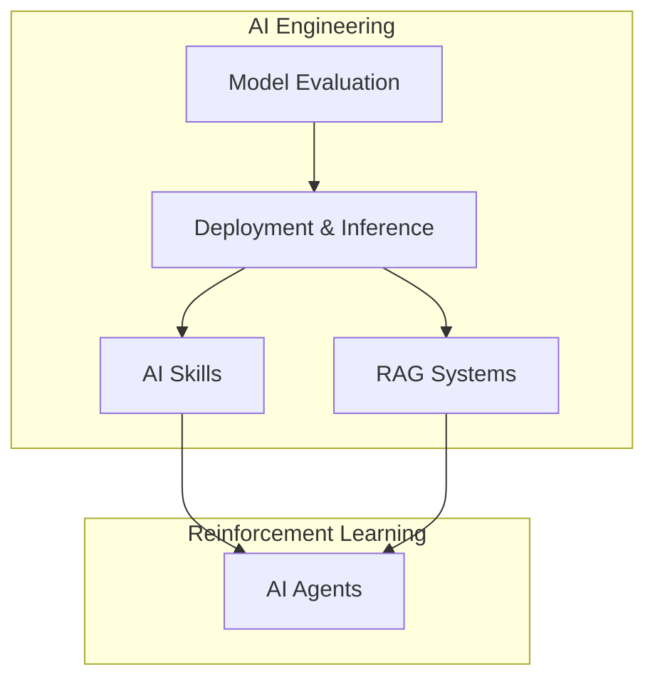
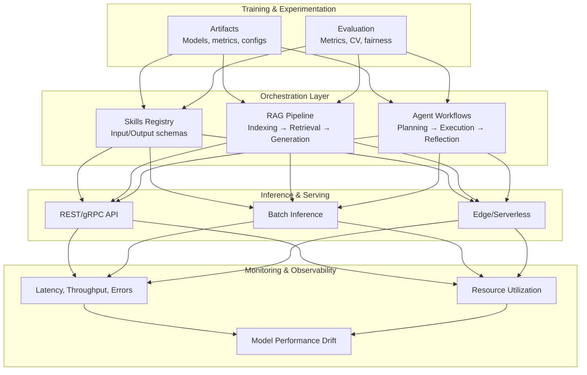
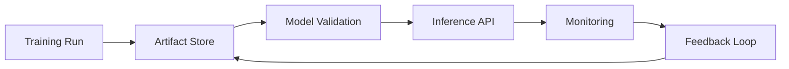
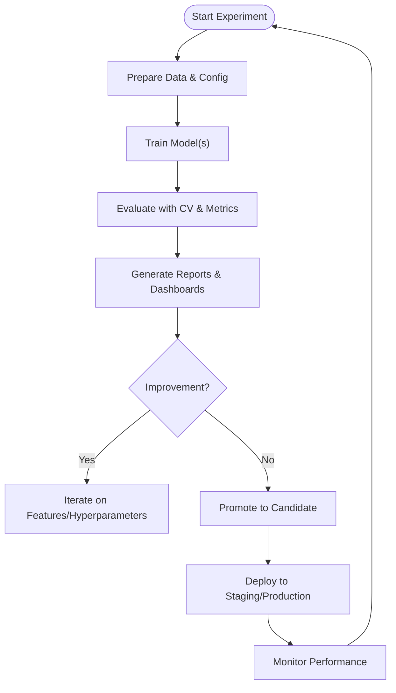
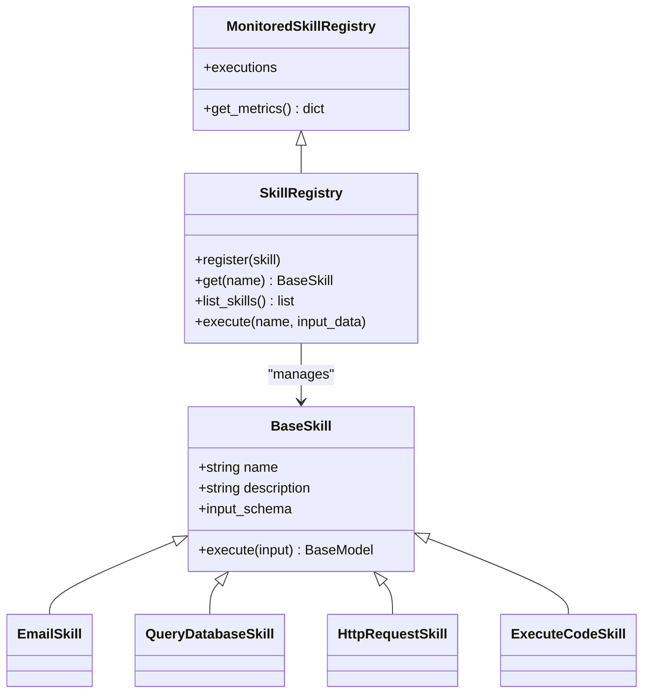
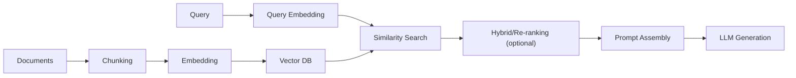
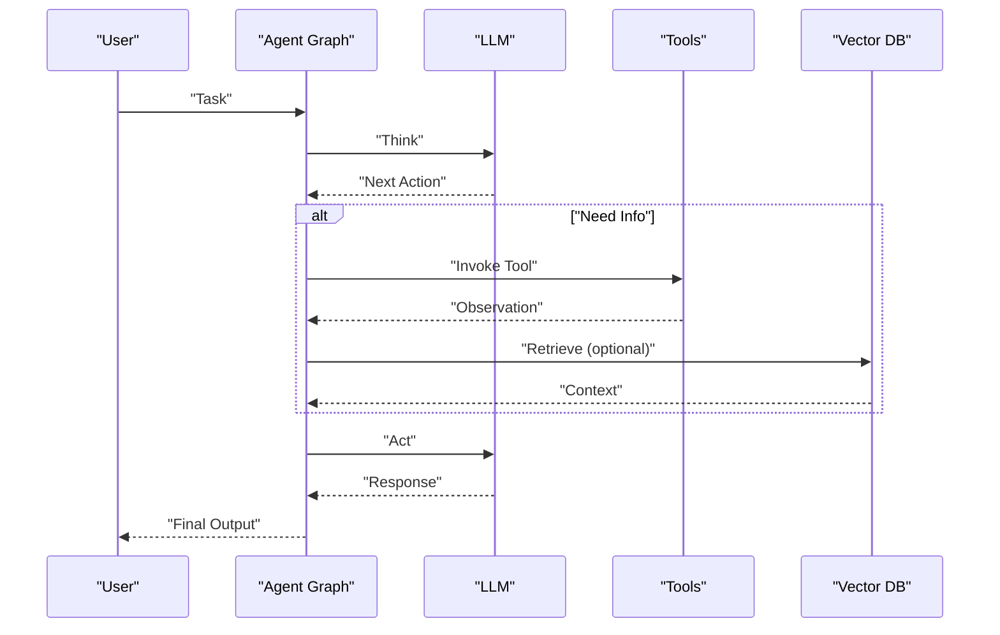
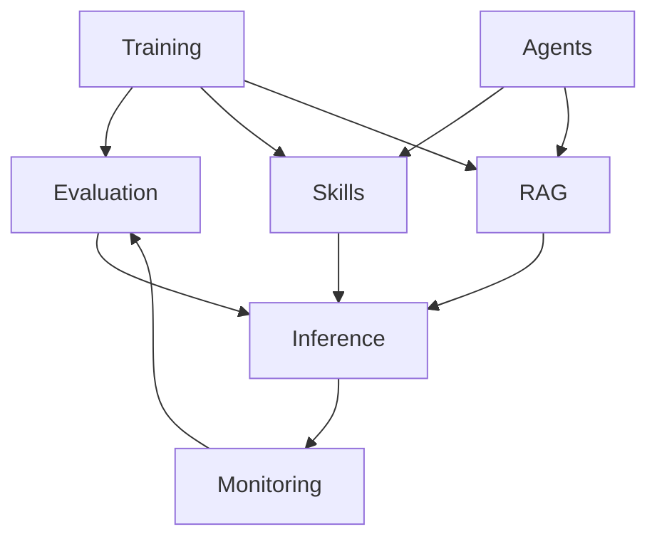

# AI Workflow Orchestration

<cite>
**Referenced Files in This Document**
- [Inference-in-nutshell.md](file://docs/07_AI_Engineering/Deployment_Inference/Inference-in-nutshell.md)
- [Model_Evaluation.md](file://docs/07_AI_Engineering/Model_Evaluation/Model_Evaluation.md)
- [Skills-in-nutshell.md](file://docs/07_AI_Engineering/AI_Skills/Skills-in-nutshell.md)
- [RAG-in-nutshell.md](file://docs/07_AI_Engineering/RAG_Systems/RAG-in-nutshell.md)
- [RAG_Systems.md](file://docs/07_AI_Engineering/RAG_Systems/RAG_Systems.md)
- [AI_Agents.md](file://docs/06_Reinforcement_Learning/AI_Agents/AI_Agents.md)
</cite>

## Table of Contents
1. [Introduction](#introduction)
2. [Project Structure](#project-structure)
3. [Core Components](#core-components)
4. [Architecture Overview](#architecture-overview)
5. [Detailed Component Analysis](#detailed-component-analysis)
6. [Dependency Analysis](#dependency-analysis)
7. [Performance Considerations](#performance-considerations)
8. [Troubleshooting Guide](#troubleshooting-guide)
9. [Conclusion](#conclusion)
10. [Appendices](#appendices)

## Introduction
This document presents a comprehensive guide to AI workflow orchestration tailored for enterprise-grade AI/ML projects. It synthesizes practical guidance from the repository’s AI engineering materials to define workflow design principles, data pipeline construction, experiment tracking methodologies, and collaboration practices across data scientists, ML engineers, and DevOps teams. It also covers integration touchpoints with version control, automated testing, CI/CD, and monitoring; describes scalable and cost-aware strategies; and provides templates and troubleshooting guidance grounded in the repository’s content.

## Project Structure
The repository organizes AI/ML knowledge across foundational topics, machine learning fundamentals, deep learning, NLP/LLMs, computer vision, reinforcement learning, and AI engineering. For orchestration, the most relevant materials are:
- AI Engineering: inference, evaluation, skills, and RAG systems
- Reinforcement Learning: agents and workflows

[No sources needed since this diagram shows conceptual structure, not a direct code mapping]

## Core Components
This section distills the core building blocks for orchestrating AI/ML workflows, aligned with the repository’s materials.

- Training-to-Inference Pipeline
  - Training produces artifacts (models, metrics, metadata).
  - Inference consumes trained models via standardized APIs and runtime environments.
  - Monitoring tracks latency, throughput, error rates, and resource utilization.

- Experiment Tracking and Evaluation
  - Use robust evaluation metrics and cross-validation strategies.
  - Maintain reproducible experiments with explicit datasets, hyperparameters, and metrics.

- Skills and Tools Orchestration
  - Standardized skills with input/output schemas enable modular composition.
  - Registry-based dispatch supports permissioning, rate limiting, and observability.

- Retrieval-Augmented Generation (RAG) Pipelines
  - Indexing, retrieval, and generation stages form a production-grade RAG workflow.
  - Hybrid search, re-ranking, and query expansion improve quality and latency.

- Agent Workflows
  - Multi-agent collaboration, planning, and reflection cycles support complex, autonomous tasks.

**Section sources**
- [Inference-in-nutshell.md: 67–124:67-124](file://docs/07_AI_Engineering/Deployment_Inference/Inference-in-nutshell.md#L67-L124)
- [Model_Evaluation.md: 5–23:5-23](file://docs/07_AI_Engineering/Model_Evaluation/Model_Evaluation.md#L5-L23)
- [Skills-in-nutshell.md: 67–137:67-137](file://docs/07_AI_Engineering/AI_Skills/Skills-in-nutshell.md#L67-L137)
- [RAG-in-nutshell.md: 35–163:35-163](file://docs/07_AI_Engineering/RAG_Systems/RAG-in-nutshell.md#L35-L163)
- [AI_Agents.md: 52–119:52-119](file://docs/06_Reinforcement_Learning/AI_Agents/AI_Agents.md#L52-L119)

## Architecture Overview
The orchestration architecture integrates training, evaluation, inference, and operational monitoring. It leverages standardized skills and RAG pipelines to support both model serving and intelligent agent workflows.

**Diagram sources**
- [Skills-in-nutshell.md: 350–401:350-401](file://docs/07_AI_Engineering/AI_Skills/Skills-in-nutshell.md#L350-L401)
- [RAG-in-nutshell.md: 37–163:37-163](file://docs/07_AI_Engineering/RAG_Systems/RAG-in-nutshell.md#L37-L163)
- [AI_Agents.md: 542–640:542-640](file://docs/06_Reinforcement_Learning/AI_Agents/AI_Agents.md#L542-L640)
- [Inference-in-nutshell.md: 111–190:111-190](file://docs/07_AI_Engineering/Deployment_Inference/Inference-in-nutshell.md#L111-L190)

## Detailed Component Analysis

### Training-to-Inference Pipeline
- Design principles
  - Artifact versioning and metadata tracking
  - Reproducible preprocessing and training runs
  - Clear separation between training and serving environments
- Inference deployment options
  - REST/gRPC for microservices
  - Batch processing for offline workloads
  - Edge and serverless for specialized latency and scale needs
- Optimization techniques
  - Quantization, ONNX export, and request batching
  - Pre-warming and health/readiness checks
- Monitoring targets
  - Latency percentiles, error rates, GPU/memory utilization

**Diagram sources**
- [Inference-in-nutshell.md: 111–190:111-190](file://docs/07_AI_Engineering/Deployment_Inference/Inference-in-nutshell.md#L111-L190)
- [Inference-in-nutshell.md: 300–356:300-356](file://docs/07_AI_Engineering/Deployment_Inference/Inference-in-nutshell.md#L300-L356)

**Section sources**
- [Inference-in-nutshell.md: 67–124:67-124](file://docs/07_AI_Engineering/Deployment_Inference/Inference-in-nutshell.md#L67-L124)
- [Inference-in-nutshell.md: 221–297:221-297](file://docs/07_AI_Engineering/Deployment_Inference/Inference-in-nutshell.md#L221-L297)
- [Inference-in-nutshell.md: 300–418:300-418](file://docs/07_AI_Engineering/Deployment_Inference/Inference-in-nutshell.md#L300-L418)

### Experiment Tracking and Evaluation
- Evaluation methodology
  - Use stratified cross-validation and appropriate metrics per task type
  - Consider statistical significance and calibration
- Fairness and ethics
  - Evaluate parity metrics and integrate ethical safeguards
- Reporting and dashboarding
  - Track metrics over time and alert on regressions

**Diagram sources**
- [Model_Evaluation.md: 177–213:177-213](file://docs/07_AI_Engineering/Model_Evaluation/Model_Evaluation.md#L177-L213)
- [Model_Evaluation.md: 312–344:312-344](file://docs/07_AI_Engineering/Model_Evaluation/Model_Evaluation.md#L312-L344)

**Section sources**
- [Model_Evaluation.md: 5–23:5-23](file://docs/07_AI_Engineering/Model_Evaluation/Model_Evaluation.md#L5-L23)
- [Model_Evaluation.md: 295–310:295-310](file://docs/07_AI_Engineering/Model_Evaluation/Model_Evaluation.md#L295-L310)
- [Model_Evaluation.md: 345–357:345-357](file://docs/07_AI_Engineering/Model_Evaluation/Model_Evaluation.md#L345-L357)

### Skills and Tools Orchestration
- Standardized skills with Pydantic schemas
- Central registry for discovery, permissioning, and execution
- Monitoring and metrics collection per skill invocation
- Security controls: permission levels, input validation, and rate limits

**Diagram sources**
- [Skills-in-nutshell.md: 154–182:154-182](file://docs/07_AI_Engineering/AI_Skills/Skills-in-nutshell.md#L154-L182)
- [Skills-in-nutshell.md: 350–401:350-401](file://docs/07_AI_Engineering/AI_Skills/Skills-in-nutshell.md#L350-L401)
- [Skills-in-nutshell.md: 597–648:597-648](file://docs/07_AI_Engineering/AI_Skills/Skills-in-nutshell.md#L597-L648)

**Section sources**
- [Skills-in-nutshell.md: 67–137:67-137](file://docs/07_AI_Engineering/AI_Skills/Skills-in-nutshell.md#L67-L137)
- [Skills-in-nutshell.md: 332–402:332-402](file://docs/07_AI_Engineering/AI_Skills/Skills-in-nutshell.md#L332-L402)
- [Skills-in-nutshell.md: 565–648:565-648](file://docs/07_AI_Engineering/AI_Skills/Skills-in-nutshell.md#L565-L648)

### RAG Pipeline Orchestration
- Indexing stage: parsing, chunking, embedding, and storing
- Retrieval stage: vector similarity search, optional hybrid and re-ranking
- Generation stage: prompt assembly and LLM inference
- Operationalization: caching, filtering, and latency budgeting

**Diagram sources**
- [RAG-in-nutshell.md: 37–163:37-163](file://docs/07_AI_Engineering/RAG_Systems/RAG-in-nutshell.md#L37-L163)
- [RAG_Systems.md: 105–157:105-157](file://docs/07_AI_Engineering/RAG_Systems/RAG_Systems.md#L105-L157)

**Section sources**
- [RAG-in-nutshell.md: 166–244:166-244](file://docs/07_AI_Engineering/RAG_Systems/RAG-in-nutshell.md#L166-L244)
- [RAG_Systems.md: 27–102:27-102](file://docs/07_AI_Engineering/RAG_Systems/RAG_Systems.md#L27-L102)

### Agent Workflows and Multi-Agent Coordination
- Agent architecture: perception, planning, decision-making, action, reflection, memory
- Multi-agent patterns: hierarchical, peer-to-peer, debate, voting
- Practical frameworks: LangGraph for ReAct-style agents; AutoGen for multi-agent collaboration

**Diagram sources**
- [AI_Agents.md: 542–640:542-640](file://docs/06_Reinforcement_Learning/AI_Agents/AI_Agents.md#L542-L640)
- [AI_Agents.md: 642–733:642-733](file://docs/06_Reinforcement_Learning/AI_Agents/AI_Agents.md#L642-L733)

**Section sources**
- [AI_Agents.md: 50–119:50-119](file://docs/06_Reinforcement_Learning/AI_Agents/AI_Agents.md#L50-L119)
- [AI_Agents.md: 285–347:285-347](file://docs/06_Reinforcement_Learning/AI_Agents/AI_Agents.md#L285-L347)
- [AI_Agents.md: 642–733:642-733](file://docs/06_Reinforcement_Learning/AI_Agents/AI_Agents.md#L642-L733)

## Dependency Analysis
The orchestration components depend on each other as follows:
- Inference depends on validated artifacts from training and evaluation
- Skills and RAG pipelines consume artifacts and provide standardized interfaces
- Agent workflows coordinate skills and RAG capabilities
- Monitoring feeds back to training and evaluation to detect drift and trigger retraining

[No sources needed since this diagram shows conceptual dependencies, not a direct code mapping]

## Performance Considerations
- Inference optimization
  - Quantization and ONNX/TensorRT acceleration
  - Request batching and pre-warming
- RAG efficiency
  - Hybrid search and re-ranking trade-offs
  - Metadata filtering and caching
- Agent throughput
  - Tool invocation batching and retries
  - Memory retrieval strategies (similarity, time decay, frequency)

[No sources needed since this section provides general guidance]

## Troubleshooting Guide
Common issues and resolutions across inference, evaluation, skills, and RAG:

- Inference
  - Symptoms: high latency, errors, memory pressure
  - Actions: switch to eval mode, disable gradients, validate device placement, apply quantization and batching
- Evaluation
  - Symptoms: unstable metrics, overfitting, unfair outcomes
  - Actions: use stratified CV, calibrate probabilities, evaluate fairness metrics, ensure adequate test sizes
- Skills
  - Symptoms: permission errors, invalid inputs, excessive execution time
  - Actions: enforce schema validation, apply rate limits, monitor execution metrics, secure with permission levels
- RAG
  - Symptoms: hallucinations, slow responses, outdated info
  - Actions: adjust chunk size, use hybrid search and re-ranking, add date filters, reduce temperature

**Section sources**
- [Inference-in-nutshell.md: 421–443:421-443](file://docs/07_AI_Engineering/Deployment_Inference/Inference-in-nutshell.md#L421-L443)
- [Model_Evaluation.md: 338–344:338-344](file://docs/07_AI_Engineering/Model_Evaluation/Model_Evaluation.md#L338-L344)
- [Skills-in-nutshell.md: 479–539:479-539](file://docs/07_AI_Engineering/AI_Skills/Skills-in-nutshell.md#L479-L539)
- [RAG-in-nutshell.md: 469–491:469-491](file://docs/07_AI_Engineering/RAG_Systems/RAG-in-nutshell.md#L469-L491)

## Conclusion
Effective AI workflow orchestration requires a cohesive approach spanning training, evaluation, inference, and operations. By standardizing skills, implementing robust evaluation and monitoring, and leveraging RAG and agent workflows, teams can achieve scalable, reliable, and collaborative AI systems. The repository’s materials provide practical blueprints for each stage, enabling enterprises to design resilient pipelines that evolve with changing data, models, and business needs.

[No sources needed since this section summarizes without analyzing specific files]

## Appendices

### Templates and Best Practices
- Inference deployment checklist
  - Validate model integrity, configure health/ready endpoints, benchmark latency, and monitor GPU/memory
- RAG operational checklist
  - Set up indexing, test retrieval quality, measure latency, and implement caching and filtering
- Agent workflow template
  - Define roles, tools, and reflection loops; use graph-based composition for iterative refinement

**Section sources**
- [Inference-in-nutshell.md: 359–418:359-418](file://docs/07_AI_Engineering/Deployment_Inference/Inference-in-nutshell.md#L359-L418)
- [RAG-in-nutshell.md: 425–466:425-466](file://docs/07_AI_Engineering/RAG_Systems/RAG-in-nutshell.md#L425-L466)
- [AI_Agents.md: 542–640:542-640](file://docs/06_Reinforcement_Learning/AI_Agents/AI_Agents.md#L542-L640)