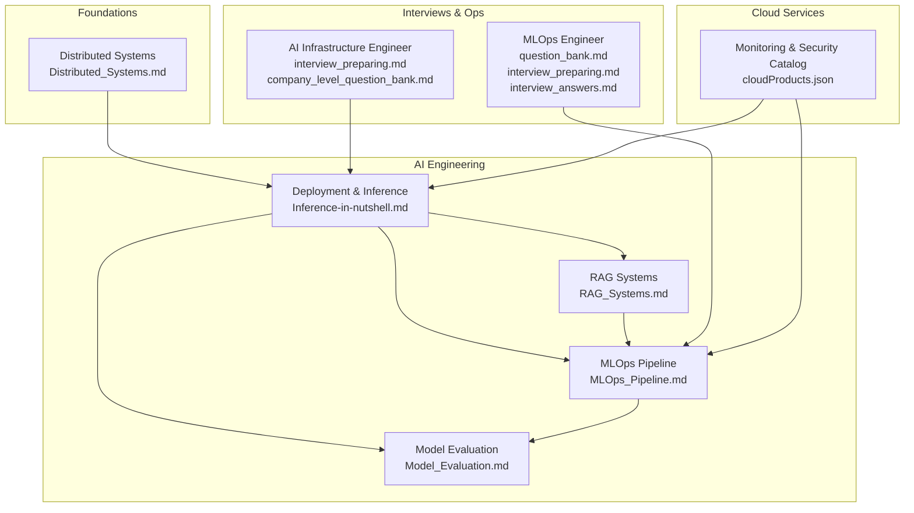
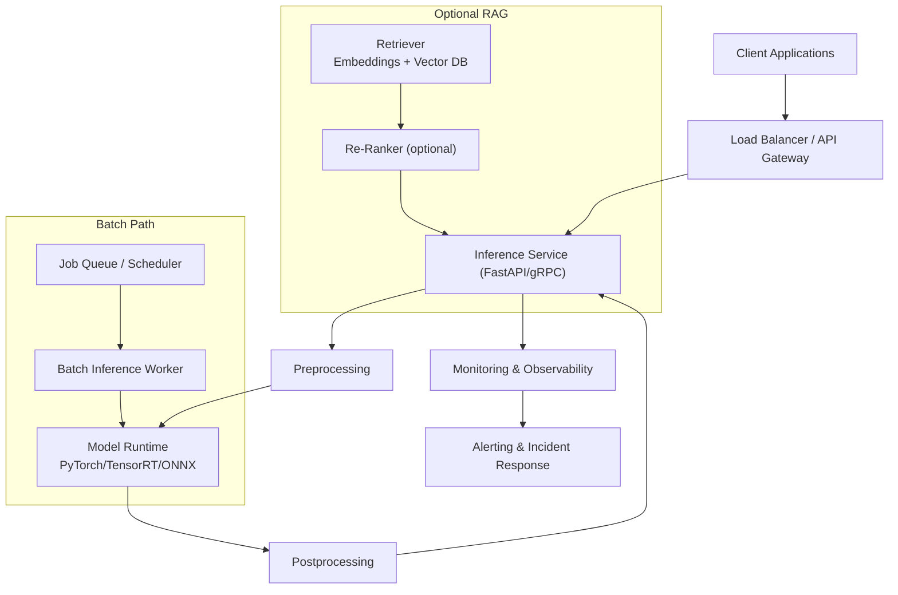
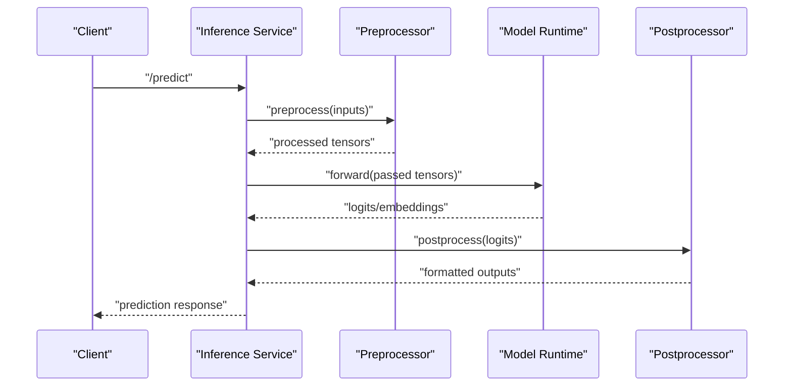
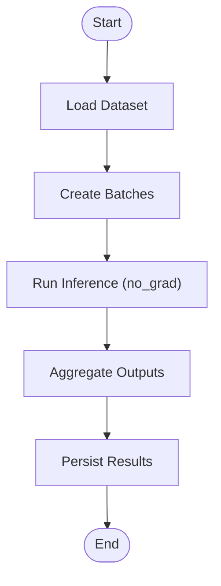
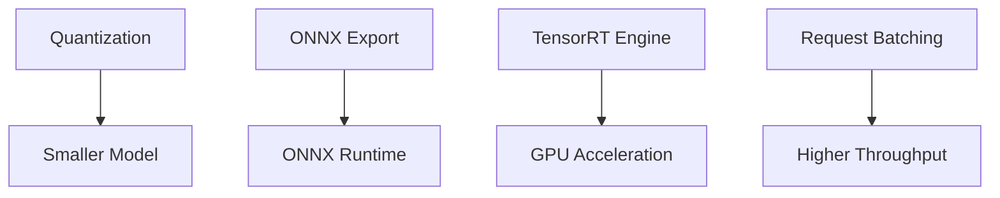
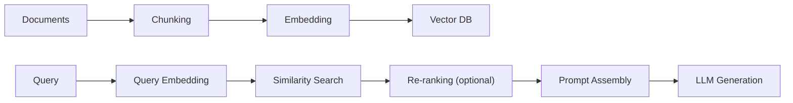
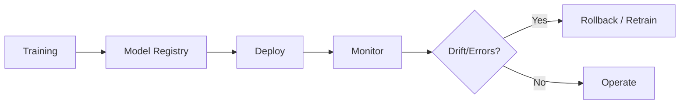
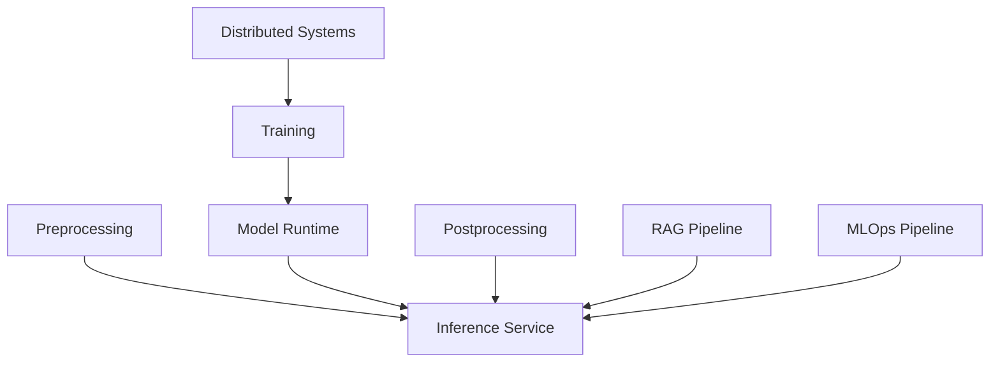
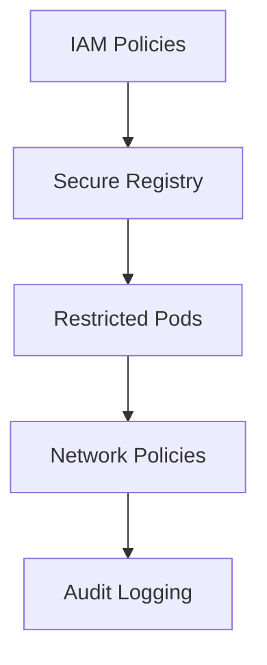

# Deployment & Inference Systems

<cite>
**Referenced Files in This Document**
- [Inference-in-nutshell.md](file://docs/07_AI_Engineering/Deployment_Inference/Inference-in-nutshell.md)
- [Model_Evaluation.md](file://docs/07_AI_Engineering/Model_Evaluation/Model_Evaluation.md)
- [RAG_Systems.md](file://docs/07_AI_Engineering/RAG_Systems/RAG_Systems.md)
- [Distributed_Systems.md](file://docs/01_Fundamentals/Distributed_Systems/Distributed_Systems.md)
- [MLOps_Pipeline.md](file://docs/07_AI_Engineering/MLOps_Pipeline/MLOps_Pipeline.md)
- [ai_infrastructure_engineer/interview_preparing.md](file://docs/11_interviews/ai_infrastructure_engineer/interview_preparing.md)
- [ai_infrastructure_engineer/company_level_question_bank.md](file://docs/11_interviews/ai_infrastructure_engineer/company_level_question_bank.md)
- [mlops_engineer/question_bank.md](file://docs/11_interviews/mlops_engineer/question_bank.md)
- [mlops_engineer/interview_preparing.md](file://docs/11_interviews/mlops_engineer/interview_preparing.md)
- [mlops_engineer/interview_answers.md](file://docs/11_interviews/mlops_engineer/interview_answers.md)
- [cloudProducts.json](file://web/src/data/cloudProducts.json)
</cite>

## Table of Contents
1. [Introduction](#introduction)
2. [Project Structure](#project-structure)
3. [Core Components](#core-components)
4. [Architecture Overview](#architecture-overview)
5. [Detailed Component Analysis](#detailed-component-analysis)
6. [Dependency Analysis](#dependency-analysis)
7. [Performance Considerations](#performance-considerations)
8. [Troubleshooting Guide](#troubleshooting-guide)
9. [Security and Compliance](#security-and-compliance)
10. [Monitoring and Observability](#monitoring-and-observability)
11. [Cost Optimization and Resource Planning](#cost-optimization-and-resource-planning)
12. [Implementation Playbooks](#implementation-playbooks)
13. [Conclusion](#conclusion)

## Introduction
This document provides a comprehensive guide to deploying and operating AI inference systems at scale. It bridges model development and production by detailing containerization, orchestration, microservices patterns, serving frameworks, real-time and batch inference, edge deployments, scalability, monitoring, security, and cost optimization. The content synthesizes practical guidance from the repository’s AI Engineering materials and related infrastructure and MLOps resources.

## Project Structure
The repository organizes AI engineering knowledge across topical areas. For deployment and inference, the most relevant materials are:
- Deployment and inference fundamentals and examples
- Model evaluation and monitoring
- RAG systems for retrieval-augmented generation
- Distributed systems foundations
- MLOps pipeline guidance
- Interview-focused infrastructure and MLOps topics
- Cloud product catalog for monitoring and security services

**Diagram sources**
- [Inference-in-nutshell.md](file://docs/07_AI_Engineering/Deployment_Inference/Inference-in-nutshell.md)
- [Model_Evaluation.md](file://docs/07_AI_Engineering/Model_Evaluation/Model_Evaluation.md)
- [RAG_Systems.md](file://docs/07_AI_Engineering/RAG_Systems/RAG_Systems.md)
- [MLOps_Pipeline.md](file://docs/07_AI_Engineering/MLOps_Pipeline/MLOps_Pipeline.md)
- [Distributed_Systems.md](file://docs/01_Fundamentals/Distributed_Systems/Distributed_Systems.md)
- [ai_infrastructure_engineer/interview_preparing.md](file://docs/11_interviews/ai_infrastructure_engineer/interview_preparing.md)
- [ai_infrastructure_engineer/company_level_question_bank.md](file://docs/11_interviews/ai_infrastructure_engineer/company_level_question_bank.md)
- [mlops_engineer/question_bank.md](file://docs/11_interviews/mlops_engineer/question_bank.md)
- [mlops_engineer/interview_preparing.md](file://docs/11_interviews/mlops_engineer/interview_preparing.md)
- [mlops_engineer/interview_answers.md](file://docs/11_interviews/mlops_engineer/interview_answers.md)
- [cloudProducts.json](file://web/src/data/cloudProducts.json)

**Section sources**
- [Inference-in-nutshell.md](file://docs/07_AI_Engineering/Deployment_Inference/Inference-in-nutshell.md)
- [Model_Evaluation.md](file://docs/07_AI_Engineering/Model_Evaluation/Model_Evaluation.md)
- [RAG_Systems.md](file://docs/07_AI_Engineering/RAG_Systems/RAG_Systems.md)
- [MLOps_Pipeline.md](file://docs/07_AI_Engineering/MLOps_Pipeline/MLOps_Pipeline.md)
- [Distributed_Systems.md](file://docs/01_Fundamentals/Distributed_Systems/Distributed_Systems.md)
- [ai_infrastructure_engineer/interview_preparing.md](file://docs/11_interviews/ai_infrastructure_engineer/interview_preparing.md)
- [ai_infrastructure_engineer/company_level_question_bank.md](file://docs/11_interviews/ai_infrastructure_engineer/company_level_question_bank.md)
- [mlops_engineer/question_bank.md](file://docs/11_interviews/mlops_engineer/question_bank.md)
- [mlops_engineer/interview_preparing.md](file://docs/11_interviews/mlops_engineer/interview_preparing.md)
- [mlops_engineer/interview_answers.md](file://docs/11_interviews/mlops_engineer/interview_answers.md)
- [cloudProducts.json](file://web/src/data/cloudProducts.json)

## Core Components
- Real-time inference service (REST/gRPC) with pre/post-processing and health checks
- Batch inference pipeline for offline throughput
- Containerization with Docker and runtime orchestration
- Serving frameworks and optimization techniques (quantization, ONNX/TensorRT, batching)
- Monitoring and alerting aligned with latency, throughput, error rate, GPU/memory utilization
- RAG pipeline for retrieval-augmented generation with hybrid search and re-ranking
- MLOps practices for model lifecycle, CI/CD, and observability
- Distributed systems foundations for multi-GPU and cluster-scale training/inference

**Section sources**
- [Inference-in-nutshell.md](file://docs/07_AI_Engineering/Deployment_Inference/Inference-in-nutshell.md)
- [Model_Evaluation.md](file://docs/07_AI_Engineering/Model_Evaluation/Model_Evaluation.md)
- [RAG_Systems.md](file://docs/07_AI_Engineering/RAG_Systems/RAG_Systems.md)
- [MLOps_Pipeline.md](file://docs/07_AI_Engineering/MLOps_Pipeline/MLOps_Pipeline.md)
- [Distributed_Systems.md](file://docs/01_Fundamentals/Distributed_Systems/Distributed_Systems.md)

## Architecture Overview
The production AI inference stack integrates model serving, orchestration, and observability. It supports real-time and batch workloads, with optional RAG augmentation and distributed training foundations.

**Diagram sources**
- [Inference-in-nutshell.md](file://docs/07_AI_Engineering/Deployment_Inference/Inference-in-nutshell.md)
- [RAG_Systems.md](file://docs/07_AI_Engineering/RAG_Systems/RAG_Systems.md)

## Detailed Component Analysis

### Real-Time Inference Service
- REST/gRPC endpoints with health/readiness probes
- Pre/post-processing pipeline for text/image/audio
- Model.eval and no_grad for inference mode
- Request batching to improve throughput
- GPU utilization and memory monitoring

**Diagram sources**
- [Inference-in-nutshell.md](file://docs/07_AI_Engineering/Deployment_Inference/Inference-in-nutshell.md)

**Section sources**
- [Inference-in-nutshell.md](file://docs/07_AI_Engineering/Deployment_Inference/Inference-in-nutshell.md)

### Batch Inference Pipeline
- DataLoader-based batching for high throughput
- Offloading to CPU/GPU as appropriate
- Results aggregation and persistence

**Diagram sources**
- [Inference-in-nutshell.md](file://docs/07_AI_Engineering/Deployment_Inference/Inference-in-nutshell.md)

**Section sources**
- [Inference-in-nutshell.md](file://docs/07_AI_Engineering/Deployment_Inference/Inference-in-nutshell.md)

### Containerization and Orchestration
- Docker image builds with Python runtime and model artifacts
- Exposing service ports and process entrypoints
- Orchestration via Kubernetes for scaling and resilience

**Diagram sources**
- [Inference-in-nutshell.md](file://docs/07_AI_Engineering/Deployment_Inference/Inference-in-nutshell.md)

**Section sources**
- [Inference-in-nutshell.md](file://docs/07_AI_Engineering/Deployment_Inference/Inference-in-nutshell.md)

### Serving Frameworks and Optimization
- Quantization (dynamic INT8) to reduce model size and latency
- ONNX export for cross-runtime acceleration
- TensorRT for NVIDIA GPU acceleration
- Request batching to increase throughput

**Diagram sources**
- [Inference-in-nutshell.md](file://docs/07_AI_Engineering/Deployment_Inference/Inference-in-nutshell.md)

**Section sources**
- [Inference-in-nutshell.md](file://docs/07_AI_Engineering/Deployment_Inference/Inference-in-nutshell.md)

### RAG Inference Pipeline
- Indexing: chunking → embedding → vector DB
- Retrieval: query embedding → similarity search → optional re-ranking
- Generation: prompt assembly + LLM generation
- Hybrid search and graph-enhanced retrieval for complex reasoning

**Diagram sources**
- [RAG_Systems.md](file://docs/07_AI_Engineering/RAG_Systems/RAG_Systems.md)

**Section sources**
- [RAG_Systems.md](file://docs/07_AI_Engineering/RAG_Systems/RAG_Systems.md)

### MLOps and Model Lifecycle
- Experiment tracking, model registry, CI/CD
- Offline metrics and online A/B testing
- Monitoring, drift detection, and rollback strategies

**Diagram sources**
- [MLOps_Pipeline.md](file://docs/07_AI_Engineering/MLOps_Pipeline/MLOps_Pipeline.md)

**Section sources**
- [MLOps_Pipeline.md](file://docs/07_AI_Engineering/MLOps_Pipeline/MLOps_Pipeline.md)

## Dependency Analysis
- Inference depends on preprocessing, model runtime, and postprocessing
- RAG augments inference with retrieval and re-ranking
- MLOps underpins deployment, monitoring, and governance
- Distributed systems enable multi-GPU and cluster-scale training/inference

**Diagram sources**
- [Inference-in-nutshell.md](file://docs/07_AI_Engineering/Deployment_Inference/Inference-in-nutshell.md)
- [RAG_Systems.md](file://docs/07_AI_Engineering/RAG_Systems/RAG_Systems.md)
- [MLOps_Pipeline.md](file://docs/07_AI_Engineering/MLOps_Pipeline/MLOps_Pipeline.md)
- [Distributed_Systems.md](file://docs/01_Fundamentals/Distributed_Systems/Distributed_Systems.md)

**Section sources**
- [Inference-in-nutshell.md](file://docs/07_AI_Engineering/Deployment_Inference/Inference-in-nutshell.md)
- [RAG_Systems.md](file://docs/07_AI_Engineering/RAG_Systems/RAG_Systems.md)
- [MLOps_Pipeline.md](file://docs/07_AI_Engineering/MLOps_Pipeline/MLOps_Pipeline.md)
- [Distributed_Systems.md](file://docs/01_Fundamentals/Distributed_Systems/Distributed_Systems.md)

## Performance Considerations
- Latency targets: P50 < 100ms, P99 < 500ms
- Throughput: maximize requests/sec with batching and efficient models
- GPU utilization > 80%, memory < 80%
- Optimization levers: quantization, ONNX/TensorRT, batching, warm-up, caching
- Distributed training foundations support larger models and faster iteration

**Section sources**
- [Inference-in-nutshell.md](file://docs/07_AI_Engineering/Deployment_Inference/Inference-in-nutshell.md)
- [Model_Evaluation.md](file://docs/07_AI_Engineering/Model_Evaluation/Model_Evaluation.md)
- [Distributed_Systems.md](file://docs/01_Fundamentals/Distributed_Systems/Distributed_Systems.md)

## Troubleshooting Guide
Common issues and resolutions:
- Model not in eval mode or gradients enabled leading to instability
- Device mismatch causing CUDA errors
- Input shape mismatches after preprocessing
- Memory leaks over long runs
- High latency due to cold starts or unoptimized models

Recommended actions:
- Add model.eval and torch.no_grad during inference
- Validate device placement and input shapes
- Clear caches and check references to prevent leaks
- Warm up model on startup
- Enable health and readiness probes

**Section sources**
- [Inference-in-nutshell.md](file://docs/07_AI_Engineering/Deployment_Inference/Inference-in-nutshell.md)

## Security and Compliance
- Identity and Access Management (IAM) for granular permissions
- Audit logs and compliance reporting
- Secure container registries and secrets management
- Network policies and encryption in transit and at rest
- Principle of least privilege and role-based access controls

**Diagram sources**
- [cloudProducts.json](file://web/src/data/cloudProducts.json)

**Section sources**
- [cloudProducts.json](file://web/src/data/cloudProducts.json)

## Monitoring and Observability
- Key metrics: latency (P50/P99), throughput, error rate, GPU/memory utilization
- Logging: structured logs with request IDs and timing
- Alerting: threshold-based alerts with noise reduction and escalation
- Tracing: end-to-end request tracing across services
- RAG-specific: retrieval quality metrics (Precision@K, NDCG), answer faithfulness

**Section sources**
- [Inference-in-nutshell.md](file://docs/07_AI_Engineering/Deployment_Inference/Inference-in-nutshell.md)
- [Model_Evaluation.md](file://docs/07_AI_Engineering/Model_Evaluation/Model_Evaluation.md)
- [RAG_Systems.md](file://docs/07_AI_Engineering/RAG_Systems/RAG_Systems.md)

## Cost Optimization and Resource Planning
- Right-size instances and accelerators (CPU/GPU/TPU) per workload
- Use autoscaling (horizontal and vertical) to match demand
- Batch workloads during off-peak hours
- Monitor and optimize model sizes and inference graphs
- Leverage spot instances and reserved capacity where feasible

[No sources needed since this section provides general guidance]

## Implementation Playbooks

### Cloud-Native Deployment
- Containerize the inference service with Docker
- Define Kubernetes manifests (Deployments, Services, HPA)
- Integrate with managed monitoring and logging
- Enforce network policies and secret management

**Section sources**
- [Inference-in-nutshell.md](file://docs/07_AI_Engineering/Deployment_Inference/Inference-in-nutshell.md)
- [cloudProducts.json](file://web/src/data/cloudProducts.json)

### Hybrid and Multi-Region Strategies
- Regional failover and replication
- Edge caching for low-latency inference
- Centralized model registry with regional serving
- Cross-region monitoring and alerting

[No sources needed since this section provides general guidance]

### MLOps Integration
- CI/CD for model and service updates
- Model versioning and experiment tracking
- Automated testing and A/B experiments
- Drift detection and automated remediation

**Section sources**
- [MLOps_Pipeline.md](file://docs/07_AI_Engineering/MLOps_Pipeline/MLOps_Pipeline.md)

### Infrastructure and Reliability
- Capacity planning and resource tagging
- Disaster recovery and backup strategies
- Incident response playbooks and runbooks

**Section sources**
- [ai_infrastructure_engineer/interview_preparing.md](file://docs/11_interviews/ai_infrastructure_engineer/interview_preparing.md)
- [ai_infrastructure_engineer/company_level_question_bank.md](file://docs/11_interviews/ai_infrastructure_engineer/company_level_question_bank.md)
- [mlops_engineer/interview_preparing.md](file://docs/11_interviews/mlops_engineer/interview_preparing.md)
- [mlops_engineer/question_bank.md](file://docs/11_interviews/mlops_engineer/question_bank.md)
- [mlops_engineer/interview_answers.md](file://docs/11_interviews/mlops_engineer/interview_answers.md)

## Conclusion
Deploying robust, scalable AI inference systems requires integrating optimized serving, reliable orchestration, comprehensive monitoring, strong security, and mature MLOps practices. The repository’s materials provide a solid foundation for building production-grade services, from lightweight REST APIs to complex RAG pipelines, while ensuring reliability, performance, and cost-effectiveness.