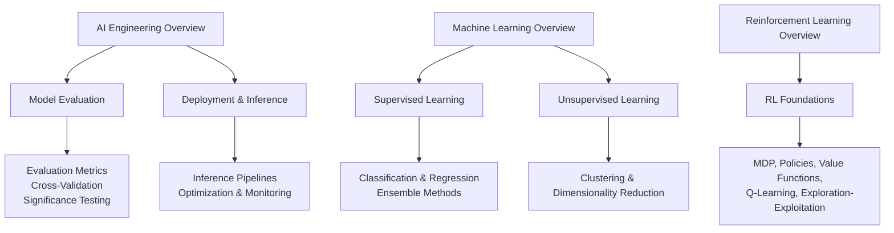
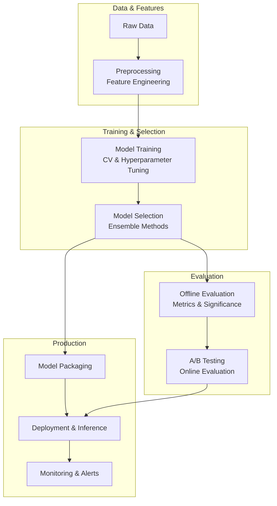
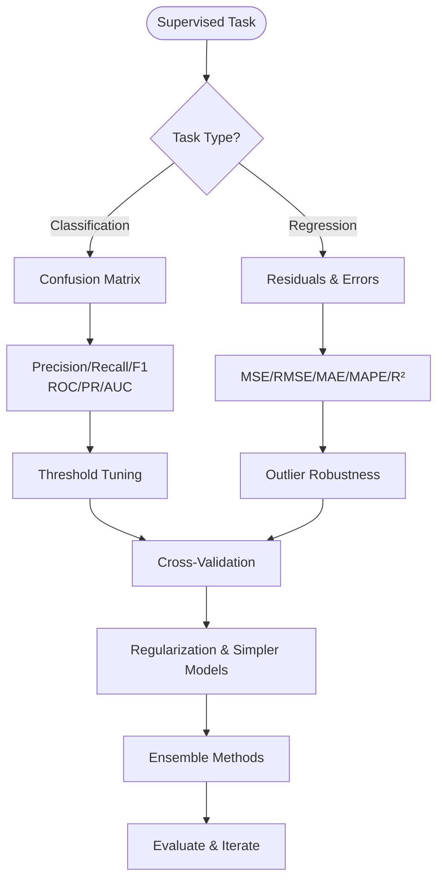
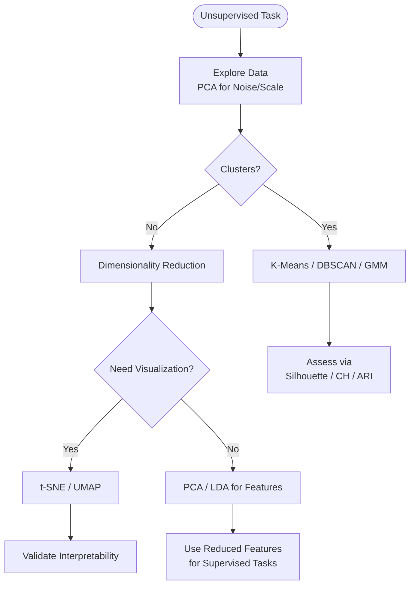
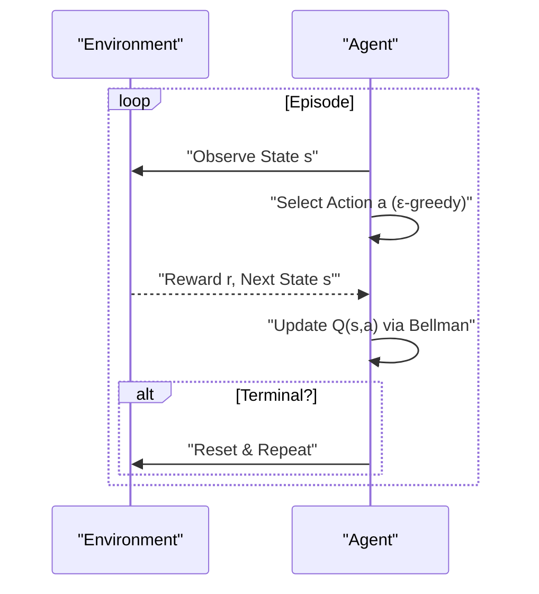
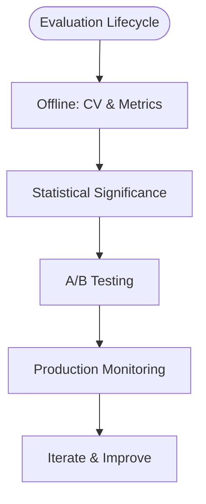
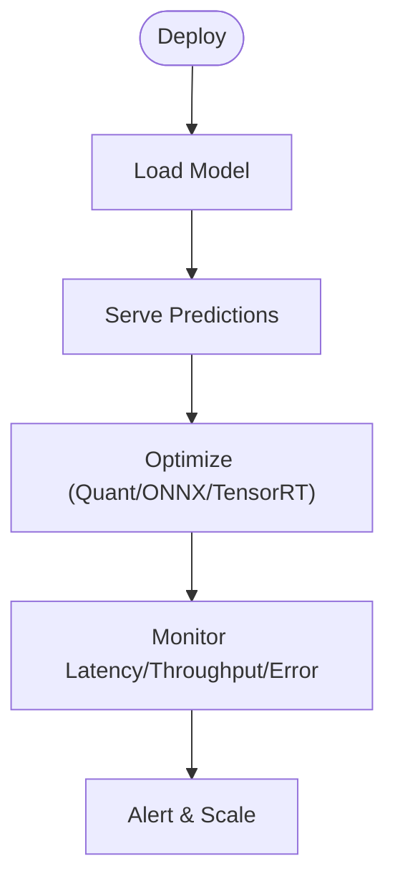
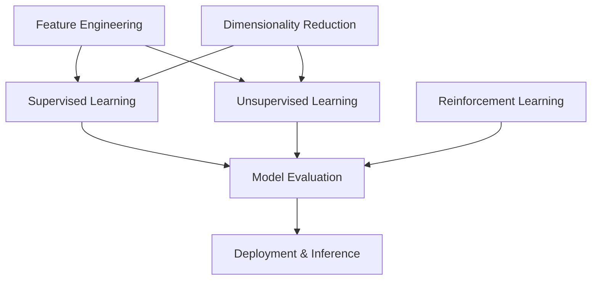

# Model Training & Evaluation

<cite>
**Referenced Files in This Document**
- [Model_Evaluation.md](file://docs/07_AI_Engineering/Model_Evaluation/Model_Evaluation.md)
- [Model_Evaluation_for_dummy.md](file://docs/07_AI_Engineering/Model_Evaluation/Model_Evaluation_for_dummy.md)
- [README.md](file://docs/07_AI_Engineering/README.md)
- [Supervised_Learning_for_dummy.md](file://docs/02_Machine_Learning/Supervised_Learning/Supervised_Learning_for_dummy.md)
- [Unsupervised_Learning.md](file://docs/02_Machine_Learning/Unsupervised_Learning/Unsupervised_Learning.md)
- [README.md](file://docs/02_Machine_Learning/README.md)
- [README.md](file://docs/06_Reinforcement_Learning/README.md)
- [RL_Foundations_for_dummy.md](file://docs/06_Reinforcement_Learning/RL_Foundations/RL_Foundations_for_dummy.md)
- [Inference-in-nutshell.md](file://docs/07_AI_Engineering/Deployment_Inference/Inference-in-nutshell.md)
</cite>

## Table of Contents
1. [Introduction](#introduction)
2. [Project Structure](#project-structure)
3. [Core Components](#core-components)
4. [Architecture Overview](#architecture-overview)
5. [Detailed Component Analysis](#detailed-component-analysis)
6. [Dependency Analysis](#dependency-analysis)
7. [Performance Considerations](#performance-considerations)
8. [Troubleshooting Guide](#troubleshooting-guide)
9. [Conclusion](#conclusion)
10. [Appendices](#appendices)

## Introduction
This document provides a comprehensive guide to model training and evaluation methodologies across supervised learning (classification, regression), unsupervised learning (clustering, dimensionality reduction), and reinforcement learning strategies. It synthesizes evaluation practices, cross-validation, bias-variance trade-offs, overfitting prevention, and interpretability, while offering practical guidance on data preprocessing, feature engineering, model selection, and ensemble methods. It also covers integration of experimentation tracking, model versioning, and A/B testing frameworks, with emphasis on reproducible research and production readiness.

## Project Structure
The repository organizes machine learning fundamentals, supervised and unsupervised learning, reinforcement learning foundations, and AI engineering topics including model evaluation and deployment. The following diagram maps the relevant sections used to compile this document.

**Diagram sources**
- [README.md:1-62](file://docs/07_AI_Engineering/README.md#L1-L62)
- [Model_Evaluation.md:1-397](file://docs/07_AI_Engineering/Model_Evaluation/Model_Evaluation.md#L1-L397)
- [README.md:1-58](file://docs/02_Machine_Learning/README.md#L1-L58)
- [Supervised_Learning_for_dummy.md:1-201](file://docs/02_Machine_Learning/Supervised_Learning/Supervised_Learning_for_dummy.md#L1-L201)
- [Unsupervised_Learning.md:1-952](file://docs/02_Machine_Learning/Unsupervised_Learning/Unsupervised_Learning.md#L1-L952)
- [README.md:1-59](file://docs/06_Reinforcement_Learning/README.md#L1-L59)
- [RL_Foundations_for_dummy.md:1-561](file://docs/06_Reinforcement_Learning/RL_Foundations/RL_Foundations_for_dummy.md#L1-L561)
- [Inference-in-nutshell.md:1-521](file://docs/07_AI_Engineering/Deployment_Inference/Inference-in-nutshell.md#L1-L521)

**Section sources**
- [README.md:1-62](file://docs/07_AI_Engineering/README.md#L1-L62)
- [README.md:1-58](file://docs/02_Machine_Learning/README.md#L1-L58)
- [README.md:1-59](file://docs/06_Reinforcement_Learning/README.md#L1-L59)

## Core Components
- Model evaluation: classification/regression metrics, ROC/PR curves, cross-validation, statistical significance, calibration, fairness.
- Supervised learning: classification and regression, ensembles, overfitting prevention via regularization and CV.
- Unsupervised learning: clustering (K-Means, DBSCAN, GMM), dimensionality reduction (PCA, t-SNE, UMAP), anomaly detection.
- Reinforcement learning: MDP, value/policy functions, Q-learning, exploration-exploitation trade-off.
- Deployment and inference: serving pipelines, optimization, monitoring, and production readiness.

**Section sources**
- [Model_Evaluation.md:1-397](file://docs/07_AI_Engineering/Model_Evaluation/Model_Evaluation.md#L1-L397)
- [Supervised_Learning_for_dummy.md:1-201](file://docs/02_Machine_Learning/Supervised_Learning/Supervised_Learning_for_dummy.md#L1-L201)
- [Unsupervised_Learning.md:1-952](file://docs/02_Machine_Learning/Unsupervised_Learning/Unsupervised_Learning.md#L1-L952)
- [RL_Foundations_for_dummy.md:1-561](file://docs/06_Reinforcement_Learning/RL_Foundations/RL_Foundations_for_dummy.md#L1-L561)
- [Inference-in-nutshell.md:1-521](file://docs/07_AI_Engineering/Deployment_Inference/Inference-in-nutshell.md#L1-L521)

## Architecture Overview
The end-to-end lifecycle integrates data preparation, model training and selection, rigorous evaluation, and production deployment with monitoring.

[No sources needed since this diagram shows conceptual workflow, not actual code structure]

## Detailed Component Analysis

### Supervised Learning: Classification and Regression
- Classification tasks rely on confusion matrices, precision/recall/F1, ROC/PR analysis, and AUC. Practical guidance includes stratified cross-validation and threshold tuning for business objectives.
- Regression tasks use MSE/RMSE/MAE/MAPE/R²; guidance emphasizes robustness to outliers and appropriate scaling.
- Overfitting prevention via regularization, cross-validation, and simpler models; ensemble methods (bagging/boosting) improve generalization.

**Diagram sources**
- [Model_Evaluation.md:27-117](file://docs/07_AI_Engineering/Model_Evaluation/Model_Evaluation.md#L27-L117)
- [Supervised_Learning_for_dummy.md:124-147](file://docs/02_Machine_Learning/Supervised_Learning/Supervised_Learning_for_dummy.md#L124-L147)

**Section sources**
- [Model_Evaluation.md:27-117](file://docs/07_AI_Engineering/Model_Evaluation/Model_Evaluation.md#L27-L117)
- [Supervised_Learning_for_dummy.md:124-147](file://docs/02_Machine_Learning/Supervised_Learning/Supervised_Learning_for_dummy.md#L124-L147)

### Unsupervised Learning: Clustering and Dimensionality Reduction
- Clustering: K-Means (elbow/silhouette), DBSCAN (density-based, eps/minPts), GMM (probabilistic soft assignment), spectral clustering, density peak clustering, clustering ensembles.
- Dimensionality reduction: PCA (linear), LDA (supervised), t-SNE (nonlinear, for visualization), UMAP (scalable nonlinear).
- Practical pitfalls: data normalization, high-dimensional curse, parameter sensitivity, and correct usage of visualization-only methods.

**Diagram sources**
- [Unsupervised_Learning.md:35-326](file://docs/02_Machine_Learning/Unsupervised_Learning/Unsupervised_Learning.md#L35-L326)
- [Unsupervised_Learning.md:359-401](file://docs/02_Machine_Learning/Unsupervised_Learning/Unsupervised_Learning.md#L359-L401)

**Section sources**
- [Unsupervised_Learning.md:35-326](file://docs/02_Machine_Learning/Unsupervised_Learning/Unsupervised_Learning.md#L35-L326)
- [Unsupervised_Learning.md:359-401](file://docs/02_Machine_Learning/Unsupervised_Learning/Unsupervised_Learning.md#L359-L401)

### Reinforcement Learning Strategies
- MDP modeling, policies, value functions, and Q-learning form the foundation. Exploration vs exploitation trade-offs and discount factors balance immediate and long-term rewards.
- RL differs from supervised learning by learning from rewards rather than labels; real-world deployment often uses simulation pretraining and safety constraints.

**Diagram sources**
- [RL_Foundations_for_dummy.md:161-224](file://docs/06_Reinforcement_Learning/RL_Foundations/RL_Foundations_for_dummy.md#L161-L224)

**Section sources**
- [README.md:1-59](file://docs/06_Reinforcement_Learning/README.md#L1-L59)
- [RL_Foundations_for_dummy.md:1-561](file://docs/06_Reinforcement_Learning/RL_Foundations/RL_Foundations_for_dummy.md#L1-L561)

### Model Evaluation and Experimentation
- Offline evaluation: cross-validation, stratification, and appropriate metrics per task type; statistical significance tests (paired t-test, McNemar’s test, bootstrap).
- Online evaluation: A/B testing with proper randomization, duration, and monitoring of side effects.
- Interpretability: calibration curves, fairness metrics, and post-hoc explanations; production monitoring for drift and performance.

**Diagram sources**
- [Model_Evaluation.md:177-213](file://docs/07_AI_Engineering/Model_Evaluation/Model_Evaluation.md#L177-L213)
- [Model_Evaluation.md:314-344](file://docs/07_AI_Engineering/Model_Evaluation/Model_Evaluation.md#L314-L344)

**Section sources**
- [Model_Evaluation.md:177-213](file://docs/07_AI_Engineering/Model_Evaluation/Model_Evaluation.md#L177-L213)
- [Model_Evaluation.md:314-344](file://docs/07_AI_Engineering/Model_Evaluation/Model_Evaluation.md#L314-L344)

### Deployment and Production Readiness
- Inference pipeline: pre/post-processing, model serving modes, batching, and optimization (quantization, ONNX/TensorRT).
- Monitoring: latency percentiles, throughput, error rates, GPU/memory utilization; health/readiness checks and graceful shutdown.

**Diagram sources**
- [Inference-in-nutshell.md:67-108](file://docs/07_AI_Engineering/Deployment_Inference/Inference-in-nutshell.md#L67-L108)
- [Inference-in-nutshell.md:221-297](file://docs/07_AI_Engineering/Deployment_Inference/Inference-in-nutshell.md#L221-L297)
- [Inference-in-nutshell.md:300-356](file://docs/07_AI_Engineering/Deployment_Inference/Inference-in-nutshell.md#L300-L356)

**Section sources**
- [Inference-in-nutshell.md:67-108](file://docs/07_AI_Engineering/Deployment_Inference/Inference-in-nutshell.md#L67-L108)
- [Inference-in-nutshell.md:221-297](file://docs/07_AI_Engineering/Deployment_Inference/Inference-in-nutshell.md#L221-L297)
- [Inference-in-nutshell.md:300-356](file://docs/07_AI_Engineering/Deployment_Inference/Inference-in-nutshell.md#L300-L356)

## Dependency Analysis
- Model evaluation depends on supervised and unsupervised learning outcomes and reinforcement learning policy assessments.
- Deployment relies on trained models and evaluation results; it feeds back operational signals for retraining and iteration.
- Cross-cutting concerns: feature engineering supports both supervised and unsupervised tasks; dimensionality reduction improves downstream performance.

[No sources needed since this diagram shows conceptual relationships, not specific code structure]

## Performance Considerations
- Prefer stratified cross-validation to avoid optimistic bias.
- Use appropriate metrics aligned with business impact (precision vs recall trade-offs).
- Prevent overfitting with regularization, early stopping, and simpler baselines.
- Optimize inference with quantization, batching, and platform-specific accelerators.
- Monitor latency percentiles and resource utilization to maintain production quality.

[No sources needed since this section provides general guidance]

## Troubleshooting Guide
Common pitfalls and remedies:
- Using accuracy on imbalanced data; switch to precision/recall/F1 or area under precision-recall curve.
- Incorrect CV for time series; use forward chaining splits.
- Misusing visualization-only embeddings (e.g., t-SNE) as training features; use PCA/UMAP transforms or autoencoders.
- Ignoring calibration; apply Platt scaling or isotonic regression.
- Not accounting for fairness; evaluate disparate impact and equalized odds.
- Inference issues: remember to set eval mode and disable gradients; ensure device alignment and input shapes.

**Section sources**
- [Model_Evaluation.md:338-344](file://docs/07_AI_Engineering/Model_Evaluation/Model_Evaluation.md#L338-L344)
- [Unsupervised_Learning.md:800-822](file://docs/02_Machine_Learning/Unsupervised_Learning/Unsupervised_Learning.md#L800-L822)
- [Inference-in-nutshell.md:421-443](file://docs/07_AI_Engineering/Deployment_Inference/Inference-in-nutshell.md#L421-L443)

## Conclusion
A robust ML lifecycle integrates careful data preparation, principled model training and selection, rigorous offline and online evaluation, and production-grade deployment and monitoring. By aligning metrics with business goals, applying sound statistical practices, and maintaining reproducibility and interpretability, teams can deliver reliable, scalable systems that generalize well and remain trustworthy in production.

[No sources needed since this section summarizes without analyzing specific files]

## Appendices

### Practical Guidance by Task Type
- Classification: focus on precision/recall/F1, ROC/PR curves, stratified CV, and optimal threshold selection guided by cost analysis.
- Regression: emphasize robust error metrics (MAE/MAPE) and residual diagnostics; consider quantile losses for distributional targets.
- Clustering: combine elbow/silhouette with domain knowledge; DBSCAN for arbitrary shapes and noise; GMM for probabilistic assignments.
- Dimensionality reduction: PCA/LDA for linear structure; t-SNE/UMAP for visualization; use UMAP for transformable embeddings.
- Reinforcement learning: balance exploration/exploitation, use discounted returns, and validate policies in simulation before real-world deployment.

**Section sources**
- [Model_Evaluation.md:27-117](file://docs/07_AI_Engineering/Model_Evaluation/Model_Evaluation.md#L27-L117)
- [Unsupervised_Learning.md:209-326](file://docs/02_Machine_Learning/Unsupervised_Learning/Unsupervised_Learning.md#L209-L326)
- [RL_Foundations_for_dummy.md:225-300](file://docs/06_Reinforcement_Learning/RL_Foundations/RL_Foundations_for_dummy.md#L225-L300)