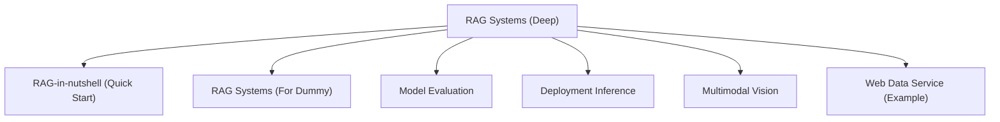
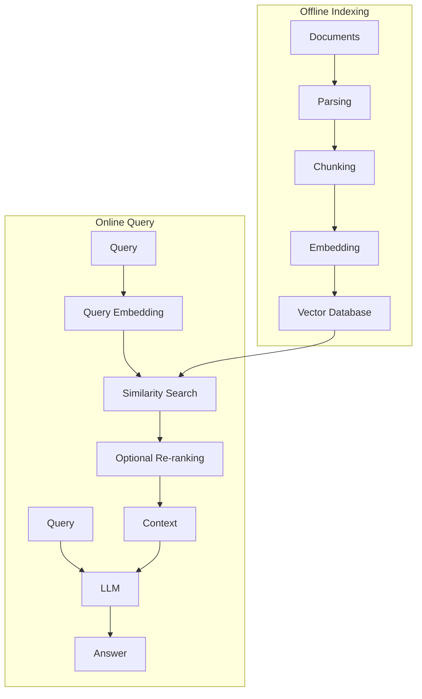
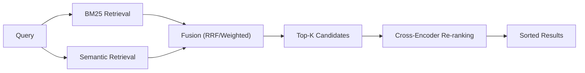
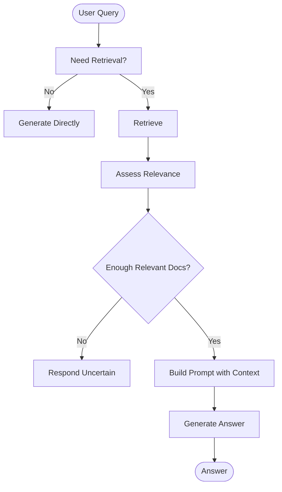
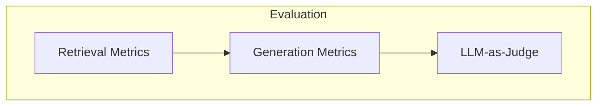
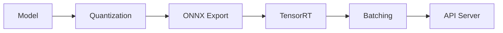
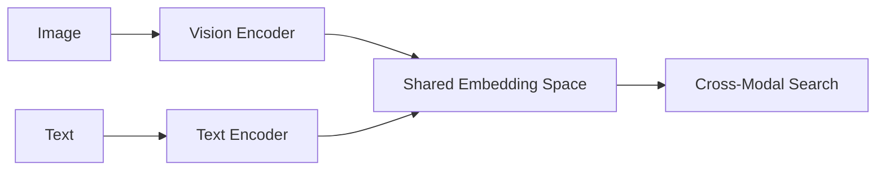
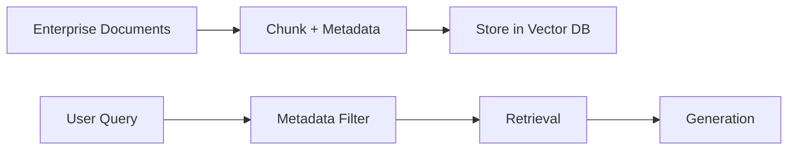
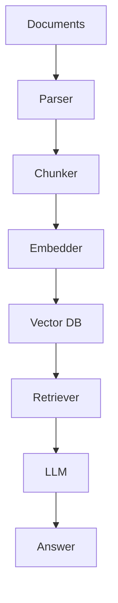

# RAG Systems Integration

<cite>
**Referenced Files in This Document**
- [RAG_Systems.md](file://docs/07_AI_Engineering/RAG_Systems/RAG_Systems.md)
- [RAG-in-nutshell.md](file://docs/07_AI_Engineering/RAG_Systems/RAG-in-nutshell.md)
- [RAG_Systems_for_dummy.md](file://docs/07_AI_Engineering/RAG_Systems/RAG_Systems_for_dummy.md)
- [Model_Evaluation.md](file://docs/07_AI_Engineering/Model_Evaluation/Model_Evaluation.md)
- [Inference-in-nutshell.md](file://docs/07_AI_Engineering/Deployment_Inference/Inference-in-nutshell.md)
- [Multimodal_Vision_for_dummy.md](file://docs/05_Computer_Vision/Multimodal_Vision/Multimodal_Vision_for_dummy.md)
- [dataService.ts](file://web/src/services/dataService.ts)
</cite>

## Table of Contents
1. [Introduction](#introduction)
2. [Project Structure](#project-structure)
3. [Core Components](#core-components)
4. [Architecture Overview](#architecture-overview)
5. [Detailed Component Analysis](#detailed-component-analysis)
6. [Dependency Analysis](#dependency-analysis)
7. [Performance Considerations](#performance-considerations)
8. [Troubleshooting Guide](#troubleshooting-guide)
9. [Conclusion](#conclusion)
10. [Appendices](#appendices)

## Introduction
This document provides comprehensive guidance for building and operating Retrieval-Augmented Generation (RAG) systems. It explains the RAG pipeline, embedding models, vector databases, hybrid search, re-ranking, and generation strategies. It also covers prompt engineering, hallucination mitigation, evaluation metrics, scalability, real-time indexing, caching, and production deployment. Practical examples leverage popular frameworks and vector databases, and it outlines integration with document management systems and enterprise data sources.

## Project Structure
The repository organizes RAG knowledge across three complementary materials:
- A deep technical guide with algorithms, comparisons, and code examples
- A quick-start guide for practitioners
- A simplified primer for beginners
- Supporting materials on evaluation and deployment

**Section sources**
- [RAG_Systems.md:1-642](file://docs/07_AI_Engineering/RAG_Systems/RAG_Systems.md#L1-L642)
- [RAG-in-nutshell.md:1-575](file://docs/07_AI_Engineering/RAG_Systems/RAG-in-nutshell.md#L1-L575)
- [RAG_Systems_for_dummy.md:1-587](file://docs/07_AI_Engineering/RAG_Systems/RAG_Systems_for_dummy.md#L1-L587)
- [Model_Evaluation.md:1-397](file://docs/07_AI_Engineering/Model_Evaluation/Model_Evaluation.md#L1-L397)
- [Inference-in-nutshell.md:1-521](file://docs/07_AI_Engineering/Deployment_Inference/Inference-in-nutshell.md#L1-L521)
- [Multimodal_Vision_for_dummy.md:1-461](file://docs/05_Computer_Vision/Multimodal_Vision/Multimodal_Vision_for_dummy.md#L1-L461)
- [dataService.ts:1-41](file://web/src/services/dataService.ts#L1-L41)

## Core Components
RAG consists of three stages:
- Indexing: parse, chunk, embed, and store documents
- Retrieval: embed query, search, and optionally rerank
- Generation: construct prompts and produce answers

Key concepts:
- Chunking strategies and overlap
- Embedding model selection and costs
- Vector database capabilities and scale
- Hybrid search (semantic + lexical) and fusion
- Re-ranking with cross-encoders
- Prompt engineering and hallucination mitigation
- Evaluation metrics and LLM-as-judge
- Production deployment and inference optimization

**Section sources**
- [RAG_Systems.md:29-54](file://docs/07_AI_Engineering/RAG_Systems/RAG_Systems.md#L29-L54)
- [RAG_Systems.md:56-86](file://docs/07_AI_Engineering/RAG_Systems/RAG_Systems.md#L56-L86)
- [RAG_Systems.md:87-101](file://docs/07_AI_Engineering/RAG_Systems/RAG_Systems.md#L87-L101)
- [RAG-in-nutshell.md:35-54](file://docs/07_AI_Engineering/RAG_Systems/RAG-in-nutshell.md#L35-L54)
- [RAG_Systems_for_dummy.md:42-104](file://docs/07_AI_Engineering/RAG_Systems/RAG_Systems_for_dummy.md#L42-L104)

## Architecture Overview
The RAG pipeline integrates document ingestion, vector storage, retrieval, and generation.

**Diagram sources**
- [RAG_Systems.md:105-157](file://docs/07_AI_Engineering/RAG_Systems/RAG_Systems.md#L105-L157)
- [RAG-in-nutshell.md:37-54](file://docs/07_AI_Engineering/RAG_Systems/RAG-in-nutshell.md#L37-L54)

**Section sources**
- [RAG_Systems.md:105-157](file://docs/07_AI_Engineering/RAG_Systems/RAG_Systems.md#L105-L157)
- [RAG-in-nutshell.md:37-54](file://docs/07_AI_Engineering/RAG_Systems/RAG-in-nutshell.md#L37-L54)

## Detailed Component Analysis

### Embedding Models and Selection
- Compare embedding models by dimensionality, multilingual support, cost, and MTEB scores
- Choose based on budget, language needs, and long-text scenarios

Best practices:
- Align embedding model with indexing and query-time models
- Consider long-context models for long documents

**Section sources**
- [RAG_Systems.md:71-86](file://docs/07_AI_Engineering/RAG_Systems/RAG_Systems.md#L71-L86)
- [RAG_Systems_for_dummy.md:269-278](file://docs/07_AI_Engineering/RAG_Systems/RAG_Systems_for_dummy.md#L269-L278)

### Vector Databases and Scale
- Compare FAISS, Chroma, Pinecone, Milvus, Weaviate, Qdrant
- Choose based on filtering needs, distribution, and scale

Guidance:
- Prototype with FAISS/Chroma
- Production with Pinecone or Milvus/Qdrant
- Mixed retrieval needs with Weaviate

**Section sources**
- [RAG_Systems.md:87-101](file://docs/07_AI_Engineering/RAG_Systems/RAG_Systems.md#L87-L101)
- [RAG_Systems_for_dummy.md:499-517](file://docs/07_AI_Engineering/RAG_Systems/RAG_Systems_for_dummy.md#L499-L517)

### Hybrid Search and Re-ranking
- Combine semantic vectors and lexical BM25
- Fuse with reciprocal rank fusion or weighted combination
- Use cross-encoder re-ranking for precision

**Diagram sources**
- [RAG_Systems.md:159-215](file://docs/07_AI_Engineering/RAG_Systems/RAG_Systems.md#L159-L215)

**Section sources**
- [RAG_Systems.md:159-215](file://docs/07_AI_Engineering/RAG_Systems/RAG_Systems.md#L159-L215)
- [RAG-in-nutshell.md:299-377](file://docs/07_AI_Engineering/RAG_Systems/RAG-in-nutshell.md#L299-L377)

### Prompt Engineering and Hallucination Mitigation
- Enforce grounding in retrieved context
- Add explicit instructions to acknowledge uncertainty
- Use Self-RAG to self-assess retrieval quality and answer reliability

**Diagram sources**
- [RAG_Systems.md:337-399](file://docs/07_AI_Engineering/RAG_Systems/RAG_Systems.md#L337-L399)

**Section sources**
- [RAG_Systems.md:557-578](file://docs/07_AI_Engineering/RAG_Systems/RAG_Systems.md#L557-L578)
- [RAG_Systems.md:337-399](file://docs/07_AI_Engineering/RAG_Systems/RAG_Systems.md#L337-L399)

### Evaluation and Quality Assurance
- Use retrieval metrics (Precision@K, Recall@K, MRR, NDCG)
- Use generation metrics (accuracy, faithfulness, citation recall)
- Employ LLM-as-judge for scalable quality assessment

**Diagram sources**
- [Model_Evaluation.md:131-172](file://docs/07_AI_Engineering/Model_Evaluation/Model_Evaluation.md#L131-L172)
- [RAG_Systems.md:446-469](file://docs/07_AI_Engineering/RAG_Systems/RAG_Systems.md#L446-L469)

**Section sources**
- [Model_Evaluation.md:131-172](file://docs/07_AI_Engineering/Model_Evaluation/Model_Evaluation.md#L131-L172)
- [RAG_Systems.md:446-469](file://docs/07_AI_Engineering/RAG_Systems/RAG_Systems.md#L446-L469)

### Production Deployment and Inference Optimization
- Use REST/gRPC APIs, batching, and containerization
- Optimize with quantization, ONNX/TensorRT, and request batching
- Monitor latency, throughput, error rates, GPU/memory utilization

**Diagram sources**
- [Inference-in-nutshell.md:225-296](file://docs/07_AI_Engineering/Deployment_Inference/Inference-in-nutshell.md#L225-L296)

**Section sources**
- [Inference-in-nutshell.md:111-133](file://docs/07_AI_Engineering/Deployment_Inference/Inference-in-nutshell.md#L111-L133)
- [Inference-in-nutshell.md:221-296](file://docs/07_AI_Engineering/Deployment_Inference/Inference-in-nutshell.md#L221-L296)
- [Inference-in-nutshell.md:300-356](file://docs/07_AI_Engineering/Deployment_Inference/Inference-in-nutshell.md#L300-L356)

### Multi-modal Retrieval (Text and Images)
- Extend retrieval to images using CLIP-like encoders
- Enable cross-modal retrieval (text-to-image and image-to-text)
- Integrate with vision-language models for VQA and captioning

**Diagram sources**
- [Multimodal_Vision_for_dummy.md:264-310](file://docs/05_Computer_Vision/Multimodal_Vision/Multimodal_Vision_for_dummy.md#L264-L310)

**Section sources**
- [Multimodal_Vision_for_dummy.md:169-204](file://docs/05_Computer_Vision/Multimodal_Vision/Multimodal_Vision_for_dummy.md#L169-L204)
- [Multimodal_Vision_for_dummy.md:243-260](file://docs/05_Computer_Vision/Multimodal_Vision/Multimodal_Vision_for_dummy.md#L243-L260)

### Integration with Document Management Systems and Enterprise Data
- Extract metadata during chunking (source, author, date)
- Filter by metadata during retrieval (department, year, category)
- Example service pattern for organizing product documentation and linking to external resources

**Diagram sources**
- [RAG-in-nutshell.md:379-396](file://docs/07_AI_Engineering/RAG_Systems/RAG-in-nutshell.md#L379-L396)
- [dataService.ts:1-41](file://web/src/services/dataService.ts#L1-L41)

**Section sources**
- [RAG-in-nutshell.md:379-396](file://docs/07_AI_Engineering/RAG_Systems/RAG-in-nutshell.md#L379-L396)
- [dataService.ts:1-41](file://web/src/services/dataService.ts#L1-L41)

## Dependency Analysis
RAG depends on:
- Document parsing and chunking libraries
- Embedding providers or local models
- Vector databases (cloud or self-hosted)
- Retrievers (semantic, lexical, ensemble)
- LLMs for generation
- Evaluation and deployment toolchains

**Diagram sources**
- [RAG_Systems.md:105-157](file://docs/07_AI_Engineering/RAG_Systems/RAG_Systems.md#L105-L157)

**Section sources**
- [RAG_Systems.md:105-157](file://docs/07_AI_Engineering/RAG_Systems/RAG_Systems.md#L105-L157)

## Performance Considerations
- Indexing
  - Use HNSW/IVF for large-scale vector search
  - Cache embeddings for frequent queries
  - Batch embedding requests
- Retrieval
  - Tune Top-K and fusion weights
  - Use re-ranking selectively for latency-sensitive apps
- Generation
  - Use smaller models for low-latency fallback
  - Apply prompt templates to reduce variability
- Deployment
  - Quantize models and export to ONNX/TensorRT
  - Use batching and async processing
  - Monitor GPU/memory and latency percentiles

[No sources needed since this section provides general guidance]

## Troubleshooting Guide
Common issues and remedies:
- Poor answer quality: adjust chunk size, increase Top-K, enable hybrid search
- Hallucinations: enforce grounding, add uncertainty prompts, use Self-RAG
- Slow latency: cache embeddings, batch requests, optimize vector index
- High cost: use local embeddings, cache results, reduce API calls
- Outdated information: add timestamps and filter by date

**Section sources**
- [RAG_Systems_for_dummy.md:469-496](file://docs/07_AI_Engineering/RAG_Systems/RAG_Systems_for_dummy.md#L469-L496)
- [RAG_Systems.md:579-600](file://docs/07_AI_Engineering/RAG_Systems/RAG_Systems.md#L579-L600)

## Conclusion
RAG systems integrate retrieval and generation to deliver accurate, grounded answers from private or enterprise knowledge. By selecting appropriate embeddings and vector databases, implementing hybrid search and re-ranking, and applying robust prompt engineering and evaluation, teams can build reliable, scalable RAG applications. Production-grade deployment requires careful optimization, monitoring, and operational safeguards.

[No sources needed since this section summarizes without analyzing specific files]

## Appendices

### Implementation Examples and Frameworks
- LangChain RAG pipeline with FAISS and Ollama
- Hybrid retriever combining BM25 and semantic search
- Self-RAG with relevance assessment and iterative retrieval

**Section sources**
- [RAG_Systems.md:237-286](file://docs/07_AI_Engineering/RAG_Systems/RAG_Systems.md#L237-L286)
- [RAG_Systems.md:288-335](file://docs/07_AI_Engineering/RAG_Systems/RAG_Systems.md#L288-L335)
- [RAG_Systems.md:337-399](file://docs/07_AI_Engineering/RAG_Systems/RAG_Systems.md#L337-L399)

### Monitoring and Metrics
- Track retrieval metrics (Precision@K, Recall@K, MRR, NDCG)
- Track generation metrics (accuracy, faithfulness, citation recall)
- Use LLM-as-judge for scalable evaluation

**Section sources**
- [Model_Evaluation.md:131-172](file://docs/07_AI_Engineering/Model_Evaluation/Model_Evaluation.md#L131-L172)
- [RAG_Systems.md:446-469](file://docs/07_AI_Engineering/RAG_Systems/RAG_Systems.md#L446-L469)