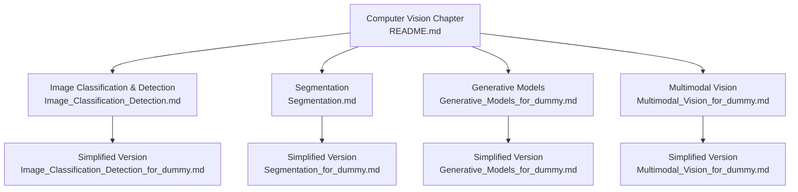
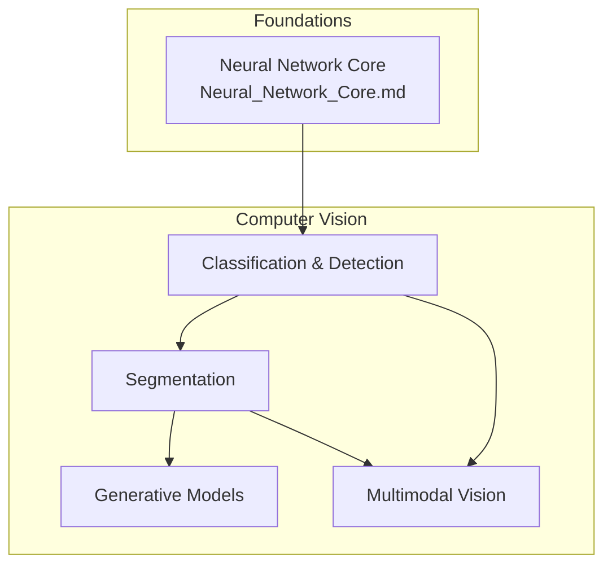
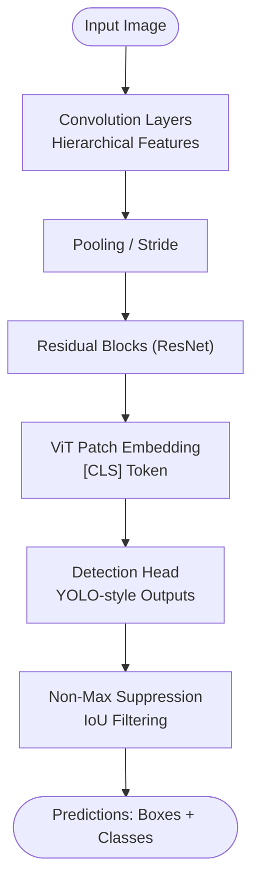
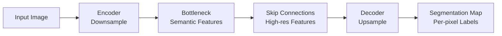
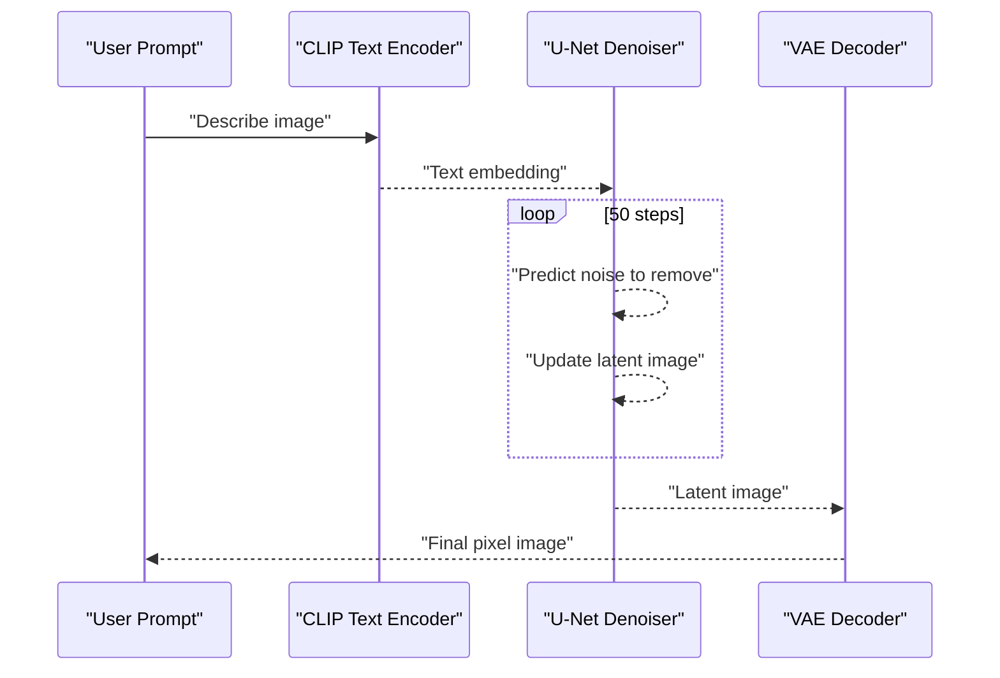
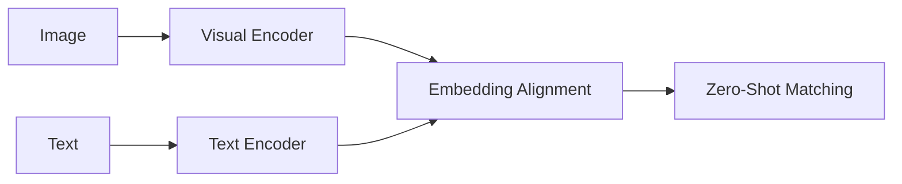
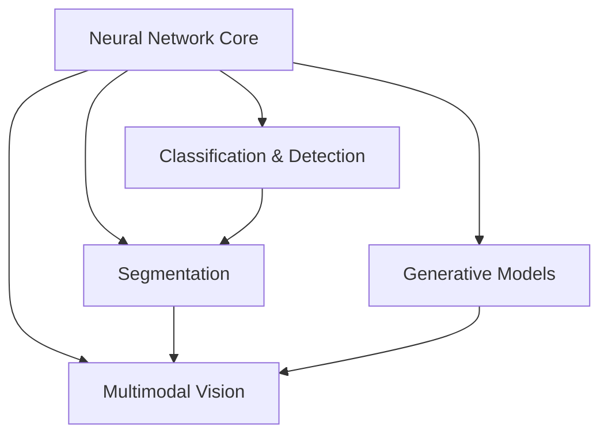
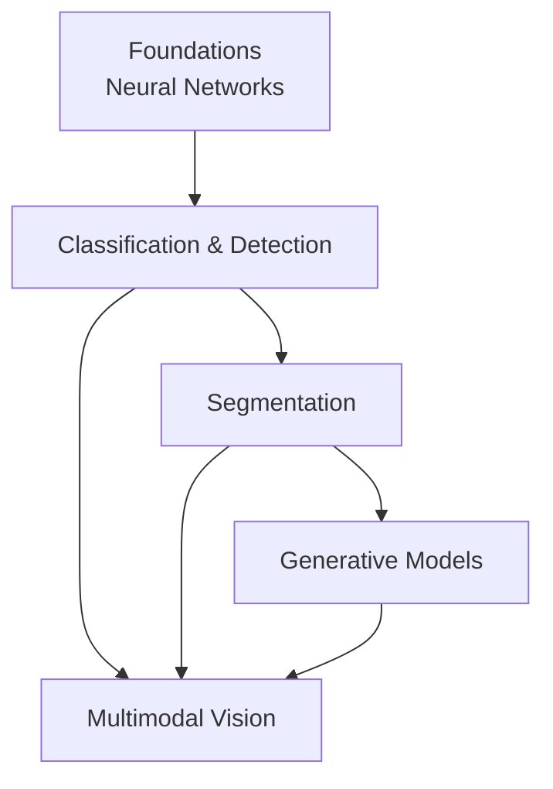

# Computer Vision Education

<cite>
**Referenced Files in This Document**
- [Computer Vision README](file://docs/05_Computer_Vision/README.md)
- [Image Classification & Detection](file://docs/05_Computer_Vision/Image_Classification_Detection/Image_Classification_Detection.md)
- [Segmentation](file://docs/05_Computer_Vision/Segmentation/Segmentation.md)
- [Segmentation for Dummy](file://docs/05_Computer_Vision/Segmentation/Segmentation_for_dummy.md)
- [Generative Models for Dummy](file://docs/05_Computer_Vision/Generative_Models/Generative_Models_for_dummy.md)
- [Multimodal Vision for Dummy](file://docs/05_Computer_Vision/Multimodal_Vision/Multimodal_Vision_for_dummy.md)
- [Neural Network Core](file://docs/03_Deep_Learning/Neural_Network_Core/Neural_Network_Core.md)
</cite>

## Table of Contents
1. [Introduction](#introduction)
2. [Project Structure](#project-structure)
3. [Core Components](#core-components)
4. [Architecture Overview](#architecture-overview)
5. [Detailed Component Analysis](#detailed-component-analysis)
6. [Dependency Analysis](#dependency-analysis)
7. [Performance Considerations](#performance-considerations)
8. [Troubleshooting Guide](#troubleshooting-guide)
9. [Conclusion](#conclusion)
10. [Appendices](#appendices)

## Introduction
This document presents a comprehensive, pedagogical computer vision education system that bridges classical computer vision techniques with modern deep learning. It covers:
- Image classification and detection (CNNs, ResNet, ViT, YOLO)
- Segmentation (semantic, instance, panoptic) with U-Net, DeepLab, Mask R-CNN, and SAM
- Generative models (GANs, diffusion, latent diffusion, Stable Diffusion)
- Multimodal vision (CLIP, LLaVA, GPT-4V, cross-modal retrieval)

The curriculum emphasizes simplified explanations for complex concepts, integrates traditional CV with modern DL, and supports bilingual terminology in English and Chinese. It outlines a learning progression from fundamentals (image processing, CNN basics) to advanced topics (generative modeling, segmentation, multimodal systems), with source attribution to influential research and industry practices.

## Project Structure
The computer vision section is organized as a standalone chapter with four primary topical areas and a dedicated README that defines the learning path, prerequisites, and key terminology glossary. Each topic includes:
- A technical deep-dive document (where available)
- A simplified “for dummy” companion document
- Practical code examples and references

**Diagram sources**
- [Computer Vision README:1-63](file://docs/05_Computer_Vision/README.md#L1-L63)
- [Image Classification & Detection:1-659](file://docs/05_Computer_Vision/Image_Classification_Detection/Image_Classification_Detection.md#L1-L659)
- [Segmentation:1-334](file://docs/05_Computer_Vision/Segmentation/Segmentation.md#L1-L334)
- [Generative Models for Dummy:1-583](file://docs/05_Computer_Vision/Generative_Models/Generative_Models_for_dummy.md#L1-L583)
- [Multimodal Vision for Dummy:1-461](file://docs/05_Computer_Vision/Multimodal_Vision/Multimodal_Vision_for_dummy.md#L1-L461)

**Section sources**
- [Computer Vision README:1-63](file://docs/05_Computer_Vision/README.md#L1-L63)

## Core Components
- Image Classification & Detection: CNN fundamentals, ResNet residual blocks, ViT patch embeddings, YOLO series evolution, evaluation metrics (IoU, mAP), and practical PyTorch and YOLOv8 code.
- Segmentation: Semantic, instance, and panoptic tasks; encoder-decoder architectures; FCN, U-Net, DeepLab, Mask R-CNN; SAM and loss functions.
- Generative Models: GAN adversarial training, diffusion process, latent diffusion, Stable Diffusion pipeline, and practical comparisons.
- Multimodal Vision: CLIP zero-shot understanding, LLaVA pipeline, GPT-4V capabilities, cross-modal retrieval, and applications.

**Section sources**
- [Image Classification & Detection:1-659](file://docs/05_Computer_Vision/Image_Classification_Detection/Image_Classification_Detection.md#L1-L659)
- [Segmentation:1-334](file://docs/05_Computer_Vision/Segmentation/Segmentation.md#L1-L334)
- [Generative Models for Dummy:1-583](file://docs/05_Computer_Vision/Generative_Models/Generative_Models_for_dummy.md#L1-L583)
- [Multimodal Vision for Dummy:1-461](file://docs/05_Computer_Vision/Multimodal_Vision/Multimodal_Vision_for_dummy.md#L1-L461)

## Architecture Overview
The system follows a layered pedagogy:
- Foundational layer: neural network basics and CNN mechanics
- Intermediate layer: classification, detection, and segmentation
- Advanced layer: generative models and multimodal systems

**Diagram sources**
- [Neural Network Core:359-400](file://docs/03_Deep_Learning/Neural_Network_Core/Neural_Network_Core.md#L359-L400)
- [Image Classification & Detection:1-659](file://docs/05_Computer_Vision/Image_Classification_Detection/Image_Classification_Detection.md#L1-L659)
- [Segmentation:1-334](file://docs/05_Computer_Vision/Segmentation/Segmentation.md#L1-L334)
- [Generative Models for Dummy:1-583](file://docs/05_Computer_Vision/Generative_Models/Generative_Models_for_dummy.md#L1-L583)
- [Multimodal Vision for Dummy:1-461](file://docs/05_Computer_Vision/Multimodal_Vision/Multimodal_Vision_for_dummy.md#L1-L461)

## Detailed Component Analysis

### Image Classification & Detection
- CNN fundamentals: convolution operation, parameter sharing, local connectivity, translation invariance, hierarchical feature extraction.
- Architectural evolution: AlexNet, VGG, GoogLeNet, ResNet (residual connections), DenseNet, MobileNet v2, EfficientNet, ViT.
- ResNet residual block: identity shortcut, gradient flow via addition, practical implementation outline.
- ViT: patch embedding, positional encoding, [CLS] token, transformer encoder, comparison to CNNs.
- YOLO series: single-shot regression paradigm, multi-scale predictions, anchor-free heads, decoupled heads, data augmentation, and speed/accuracy trade-offs.
- Evaluation: IoU, mAP@0.5, mAP@0.5:0.95, two-stage vs one-stage detectors.
- Hands-on: ResNet residual block PyTorch module, YOLOv8 inference and training workflow, ONNX export.

**Diagram sources**
- [Image Classification & Detection:192-232](file://docs/05_Computer_Vision/Image_Classification_Detection/Image_Classification_Detection.md#L192-L232)

**Section sources**
- [Image Classification & Detection:39-111](file://docs/05_Computer_Vision/Image_Classification_Detection/Image_Classification_Detection.md#L39-L111)
- [Image Classification & Detection:107-150](file://docs/05_Computer_Vision/Image_Classification_Detection/Image_Classification_Detection.md#L107-L150)
- [Image Classification & Detection:151-187](file://docs/05_Computer_Vision/Image_Classification_Detection/Image_Classification_Detection.md#L151-L187)
- [Image Classification & Detection:192-232](file://docs/05_Computer_Vision/Image_Classification_Detection/Image_Classification_Detection.md#L192-L232)
- [Image Classification & Detection:238-284](file://docs/05_Computer_Vision/Image_Classification_Detection/Image_Classification_Detection.md#L238-L284)
- [Image Classification & Detection:287-482](file://docs/05_Computer_Vision/Image_Classification_Detection/Image_Classification_Detection.md#L287-L482)
- [Image Classification & Detection:484-541](file://docs/05_Computer_Vision/Image_Classification_Detection/Image_Classification_Detection.md#L484-L541)
- [Image Classification & Detection:512-628](file://docs/05_Computer_Vision/Image_Classification_Detection/Image_Classification_Detection.md#L512-L628)

### Segmentation
- Task hierarchy: semantic, instance, panoptic segmentation.
- Encoder-decoder architecture: downsampling for semantics, upsampling for resolution, skip connections for detail preservation.
- FCN: fully convolutional, transposed convolutions, skip fusion.
- U-Net: symmetric encoder-decoder, dense skip connections, variants (U-Net++, Attention U-Net, nnU-Net).
- DeepLab: atrous/dilated convolutions, ASPP, multi-scale context.
- Mask R-CNN: two-stage detection plus per-proposal mask branch, ROI Align.
- SAM/SAM 2: universal segmentation foundation, interactive prompts (points, boxes, text), zero-shot generalization, video extension.
- Losses: cross-entropy, Dice, Focal, Lovász, hybrid combinations.
- Applications: autonomous driving, medical imaging, remote sensing, AR/VR, industrial inspection.

**Diagram sources**
- [Segmentation:43-62](file://docs/05_Computer_Vision/Segmentation/Segmentation.md#L43-L62)

**Section sources**
- [Segmentation:5-31](file://docs/05_Computer_Vision/Segmentation/Segmentation.md#L5-L31)
- [Segmentation:33-63](file://docs/05_Computer_Vision/Segmentation/Segmentation.md#L33-L63)
- [Segmentation:65-74](file://docs/05_Computer_Vision/Segmentation/Segmentation.md#L65-L74)
- [Segmentation:75-103](file://docs/05_Computer_Vision/Segmentation/Segmentation.md#L75-L103)
- [Segmentation:104-124](file://docs/05_Computer_Vision/Segmentation/Segmentation.md#L104-L124)
- [Segmentation:125-144](file://docs/05_Computer_Vision/Segmentation/Segmentation.md#L125-L144)
- [Segmentation:145-164](file://docs/05_Computer_Vision/Segmentation/Segmentation.md#L145-L164)
- [Segmentation:167-225](file://docs/05_Computer_Vision/Segmentation/Segmentation.md#L167-L225)
- [Segmentation:228-248](file://docs/05_Computer_Vision/Segmentation/Segmentation.md#L228-L248)
- [Segmentation:251-277](file://docs/05_Computer_Vision/Segmentation/Segmentation.md#L251-L277)
- [Segmentation:280-311](file://docs/05_Computer_Vision/Segmentation/Segmentation.md#L280-L311)

### Generative Models
- GANs: generator-discriminator adversarial training, equilibrium, instability, mode collapse.
- Diffusion: forward(noise addition), reverse(noise removal), iterative denoising steps, latent space improvements.
- Stable Diffusion: CLIP text encoder, U-Net denoiser, VAE decoder, latent space workflow.
- Practical comparisons: speed, stability, diversity, quality.
- Tasks: text-to-image, image-to-image, inpainting, super-resolution.

**Diagram sources**
- [Generative Models for Dummy:403-432](file://docs/05_Computer_Vision/Generative_Models/Generative_Models_for_dummy.md#L403-L432)

**Section sources**
- [Generative Models for Dummy:87-144](file://docs/05_Computer_Vision/Generative_Models/Generative_Models_for_dummy.md#L87-L144)
- [Generative Models for Dummy:145-200](file://docs/05_Computer_Vision/Generative_Models/Generative_Models_for_dummy.md#L145-L200)
- [Generative Models for Dummy:201-254](file://docs/05_Computer_Vision/Generative_Models/Generative_Models_for_dummy.md#L201-L254)
- [Generative Models for Dummy:255-284](file://docs/05_Computer_Vision/Generative_Models/Generative_Models_for_dummy.md#L255-L284)
- [Generative Models for Dummy:286-332](file://docs/05_Computer_Vision/Generative_Models/Generative_Models_for_dummy.md#L286-L332)

### Multimodal Vision
- Multimodality: combining vision and language for richer understanding.
- CLIP: zero-shot image classification by aligning text and image embeddings.
- LLaVA: visual encoder + projector + LLM reasoning pipeline.
- GPT-4V: advanced vision-language reasoning, OCR, chart interpretation, commonsense inference.
- Cross-modal retrieval: text-to-image and image-to-text search.
- Applications: shopping search, accessibility, education, content creation.

**Diagram sources**
- [Multimodal Vision for Dummy:264-280](file://docs/05_Computer_Vision/Multimodal_Vision/Multimodal_Vision_for_dummy.md#L264-L280)

**Section sources**
- [Multimodal Vision for Dummy:80-130](file://docs/05_Computer_Vision/Multimodal_Vision/Multimodal_Vision_for_dummy.md#L80-L130)
- [Multimodal Vision for Dummy:131-168](file://docs/05_Computer_Vision/Multimodal_Vision/Multimodal_Vision_for_dummy.md#L131-L168)
- [Multimodal Vision for Dummy:169-195](file://docs/05_Computer_Vision/Multimodal_Vision/Multimodal_Vision_for_dummy.md#L169-L195)
- [Multimodal Vision for Dummy:205-261](file://docs/05_Computer_Vision/Multimodal_Vision/Multimodal_Vision_for_dummy.md#L205-L261)
- [Multimodal Vision for Dummy:262-336](file://docs/05_Computer_Vision/Multimodal_Vision/Multimodal_Vision_for_dummy.md#L262-L336)

## Dependency Analysis
- Prerequisites: neural network core and optimization underpin CNNs, detection heads, segmentation encoders/decoders, and generative pipelines.
- Interdependencies:
  - Classification/Detection → Segmentation (encoder-decoder, attention)
  - Segmentation → Multimodal Vision (prompted segmentation, zero-shot)
  - Generative Models → Multimodal Vision (text-to-image, editing)
- Data and evaluation:
  - Detection: COCO, PASCAL VOC, Open Images
  - Segmentation: Cityscapes, ADE20K, COCO Panoptic
  - Generative: CLIP, LAION, LAION-Aesthetics

**Diagram sources**
- [Neural Network Core:359-400](file://docs/03_Deep_Learning/Neural_Network_Core/Neural_Network_Core.md#L359-L400)
- [Image Classification & Detection:1-659](file://docs/05_Computer_Vision/Image_Classification_Detection/Image_Classification_Detection.md#L1-L659)
- [Segmentation:1-334](file://docs/05_Computer_Vision/Segmentation/Segmentation.md#L1-L334)
- [Generative Models for Dummy:1-583](file://docs/05_Computer_Vision/Generative_Models/Generative_Models_for_dummy.md#L1-L583)
- [Multimodal Vision for Dummy:1-461](file://docs/05_Computer_Vision/Multimodal_Vision/Multimodal_Vision_for_dummy.md#L1-L461)

**Section sources**
- [Computer Vision README:41-47](file://docs/05_Computer_Vision/README.md#L41-L47)
- [Segmentation:280-291](file://docs/05_Computer_Vision/Segmentation/Segmentation.md#L280-L291)
- [Image Classification & Detection:543-557](file://docs/05_Computer_Vision/Image_Classification_Detection/Image_Classification_Detection.md#L543-L557)

## Performance Considerations
- Detection: YOLO’s single-shot design achieves real-time FPS; two-stage detectors offer higher accuracy but lower speed.
- Segmentation: U-Net leverages skip connections to preserve edges; DeepLab’s atrous convolutions expand receptive fields without resolution loss; SAM enables fast, flexible interactive segmentation.
- Generative: Diffusion models require many denoising steps; latent diffusion and specialized samplers accelerate inference while preserving quality.
- Multimodal: CLIP zero-shot avoids fine-tuning; GPT-4V adds strong reasoning but increases latency; lightweight pipelines enable mobile deployment.

[No sources needed since this section provides general guidance]

## Troubleshooting Guide
Common pitfalls and remedies:
- Detection
  - Class imbalance: focal loss, oversampling, augmentation
  - Poor localization: DIoU/CIoU losses, anchor-free heads
- Segmentation
  - Class imbalance: Dice/Focal/Lovász losses, weighted CE
  - Boundary leakage: skip connections, boundary supervision
- Generative
  - Mode collapse: label smoothing, feature matching, spectral normalization
  - Slow inference: latent diffusion, accelerated samplers
- Multimodal
  - Hallucinations: grounding with vision-language alignment, external knowledge
  - Prompt ambiguity: explicit prompting, iterative refinement

**Section sources**
- [Image Classification & Detection:532-541](file://docs/05_Computer_Vision/Image_Classification_Detection/Image_Classification_Detection.md#L532-L541)
- [Segmentation:271-277](file://docs/05_Computer_Vision/Segmentation/Segmentation.md#L271-L277)
- [Generative Models for Dummy:462-485](file://docs/05_Computer_Vision/Generative_Models/Generative_Models_for_dummy.md#L462-L485)
- [Multimodal Vision for Dummy:382-400](file://docs/05_Computer_Vision/Multimodal_Vision/Multimodal_Vision_for_dummy.md#L382-L400)

## Conclusion
This education system systematically progresses learners from foundational image processing and CNN mechanics to advanced detection, segmentation, generative modeling, and multimodal vision. By combining simplified explanations with technical depth, integrating classical CV with modern DL, and offering bilingual terminology support, it equips learners to master computer vision from fundamentals to cutting-edge applications.

[No sources needed since this section summarizes without analyzing specific files]

## Appendices

### Learning Progression Map

**Diagram sources**
- [Neural Network Core:359-400](file://docs/03_Deep_Learning/Neural_Network_Core/Neural_Network_Core.md#L359-L400)
- [Image Classification & Detection:1-659](file://docs/05_Computer_Vision/Image_Classification_Detection/Image_Classification_Detection.md#L1-L659)
- [Segmentation:1-334](file://docs/05_Computer_Vision/Segmentation/Segmentation.md#L1-L334)
- [Generative Models for Dummy:1-583](file://docs/05_Computer_Vision/Generative_Models/Generative_Models_for_dummy.md#L1-L583)
- [Multimodal Vision for Dummy:1-461](file://docs/05_Computer_Vision/Multimodal_Vision/Multimodal_Vision_for_dummy.md#L1-L461)

### Key Terminology Glossary (English–Chinese)
- CNN: 卷积神经网络
- ResNet: 残差网络
- ViT: Vision Transformer
- Object Detection: 目标检测
- Semantic Segmentation: 语义分割
- Instance Segmentation: 实例分割
- CLIP: 视觉-语言预训练模型
- GAN: 生成对抗网络
- Diffusion Model: 扩散模型
- Latent Diffusion: 潜在扩散
- Multimodal Vision: 多模态视觉

**Section sources**
- [Computer Vision README:48-60](file://docs/05_Computer_Vision/README.md#L48-L60)