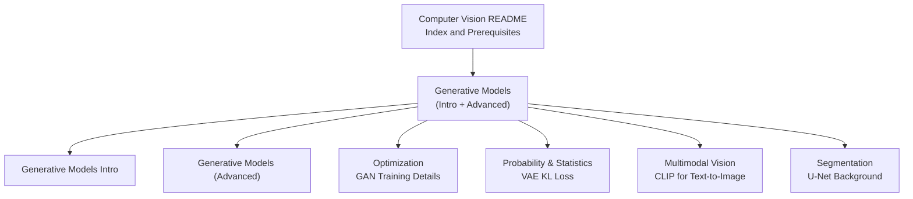
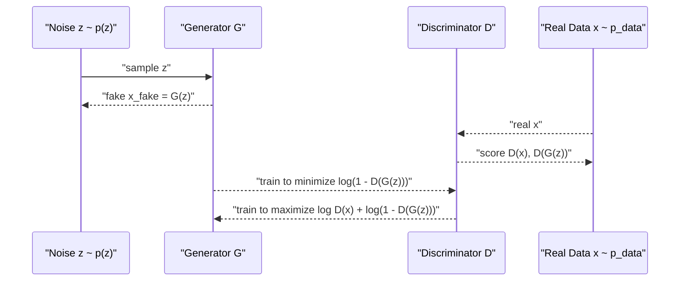
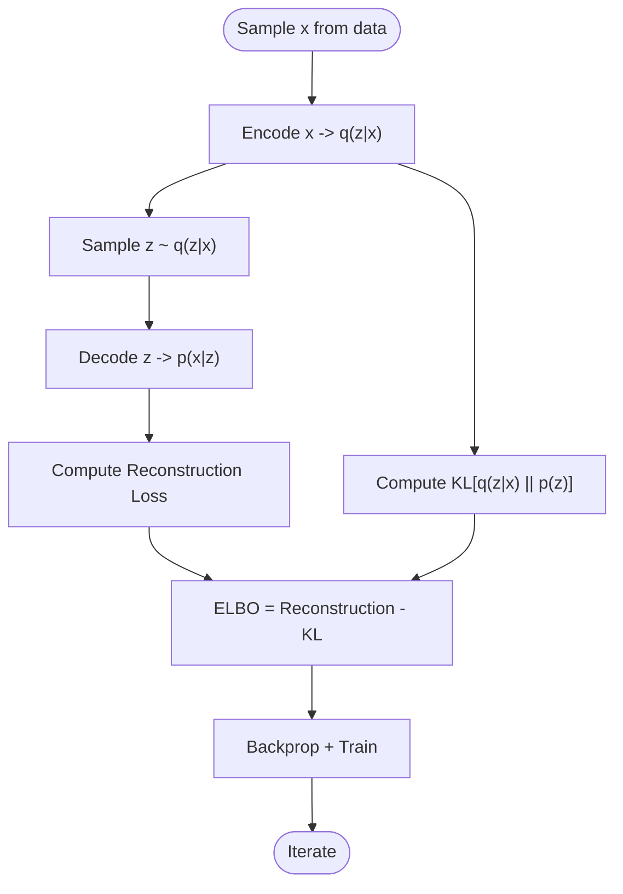
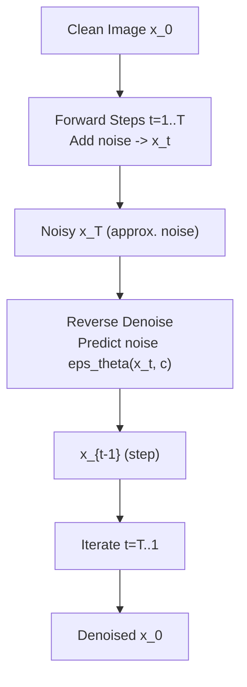
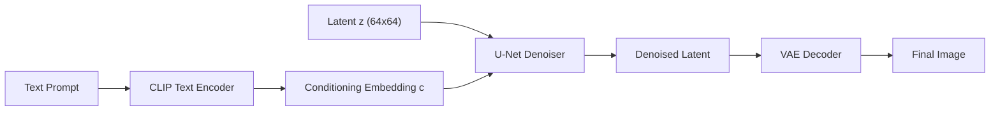
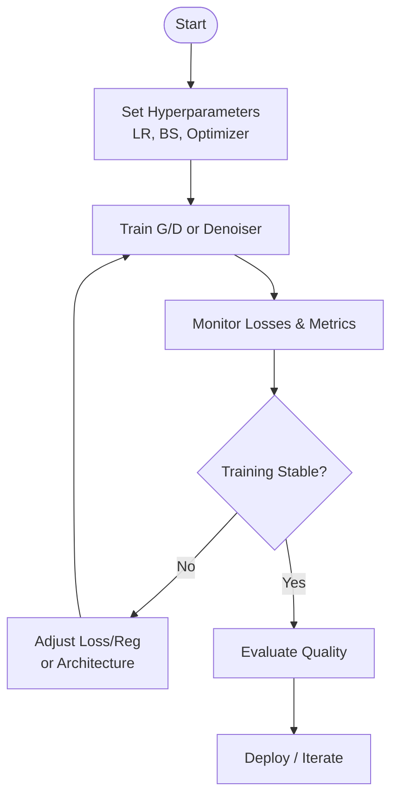
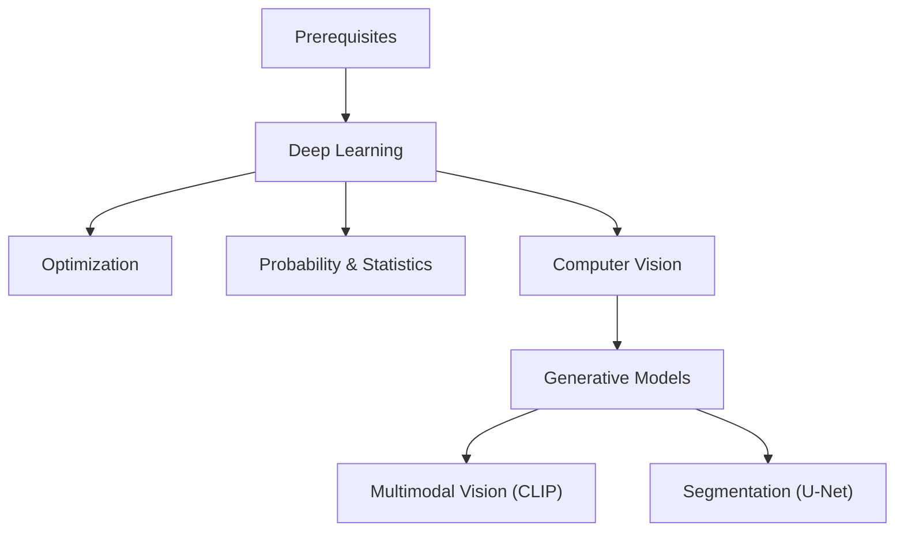

# Generative Models

<cite>
**Referenced Files in This Document**
- [Generative_Models_for_dummy.md](file://docs/05_Computer_Vision/Generative_Models/Generative_Models_for_dummy.md)
- [Generative_Models.md](file://docs/05_Computer_Vision/Generative_Models/Generative_Models.md)
- [README.md](file://docs/05_Computer_Vision/README.md)
- [Optimization.md](file://docs/03_Deep_Learning/Optimization/Optimization.md)
- [Probability_Statistics.md](file://docs/01_Fundamentals/Probability_Statistics/Probability_Statistics.md)
- [Multimodal_Vision_for_dummy.md](file://docs/05_Computer_Vision/Multimodal_Vision/Multimodal_Vision_for_dummy.md)
- [Segmentation_for_dummy.md](file://docs/05_Computer_Vision/Segmentation/Segmentation_for_dummy.md)
</cite>

## Table of Contents
1. [Introduction](#introduction)
2. [Project Structure](#project-structure)
3. [Core Components](#core-components)
4. [Architecture Overview](#architecture-overview)
5. [Detailed Component Analysis](#detailed-component-analysis)
6. [Dependency Analysis](#dependency-analysis)
7. [Performance Considerations](#performance-considerations)
8. [Troubleshooting Guide](#troubleshooting-guide)
9. [Conclusion](#conclusion)
10. [Appendices](#appendices)

## Introduction
This document synthesizes the repository’s materials on generative models in computer vision. It explains the theoretical foundations of GANs, VAEs, and diffusion models, documents training dynamics and stability techniques, and connects these ideas to practical tasks such as text-to-image generation, image-to-image translation, super-resolution, inpainting, and creative content generation. It also outlines evaluation and comparison frameworks and provides hands-on guidance grounded in the repository’s curated learning resources.

## Project Structure
The generative modeling content is organized primarily under the Computer Vision section with supporting materials in fundamentals and deep learning optimization. The structure enables a layered learning path from conceptual introductions to technical depth.



**Diagram sources**
- [README.md:32-63](file://docs/05_Computer_Vision/README.md#L32-L63)
- [Generative_Models_for_dummy.md:1-583](file://docs/05_Computer_Vision/Generative_Models/Generative_Models_for_dummy.md#L1-L583)
- [Generative_Models.md](file://docs/05_Computer_Vision/Generative_Models/Generative_Models.md)
- [Optimization.md:829-838](file://docs/03_Deep_Learning/Optimization/Optimization.md#L829-L838)
- [Probability_Statistics.md:452-465](file://docs/01_Fundamentals/Probability_Statistics/Probability_Statistics.md#L452-L465)
- [Multimodal_Vision_for_dummy.md:1-461](file://docs/05_Computer_Vision/Multimodal_Vision/Multimodal_Vision_for_dummy.md#L1-L461)
- [Segmentation_for_dummy.md:1-428](file://docs/05_Computer_Vision/Segmentation/Segmentation_for_dummy.md#L1-L428)

**Section sources**
- [README.md:32-63](file://docs/05_Computer_Vision/README.md#L32-L63)

## Core Components
- Generative Adversarial Networks (GANs): Two-player minimax game between Generator and Discriminator; training dynamics, losses, and stability challenges.
- Variational Autoencoders (VAEs): Probabilistic latent variable model with reconstruction and KL regularization; latent space geometry and disentanglement.
- Diffusion Models: Denoising process trained by reversing a forward Markov chain; latent diffusion and text-to-image pipelines.
- Conditional Generation: Conditioning on labels, text embeddings, and cross-modal signals.
- Controllable Generation: Style injection, attention modulation, progressive growing, and hierarchical latents.
- Practical Applications: Text-to-image, image-to-image translation, super-resolution, inpainting, and creative editing.
- Evaluation and Comparison: Metrics and frameworks for assessing quality and diversity.

**Section sources**
- [Generative_Models_for_dummy.md:87-284](file://docs/05_Computer_Vision/Generative_Models/Generative_Models_for_dummy.md#L87-L284)
- [Generative_Models.md](file://docs/05_Computer_Vision/Generative_Models/Generative_Models.md)
- [Optimization.md:829-838](file://docs/03_Deep_Learning/Optimization/Optimization.md#L829-L838)
- [Probability_Statistics.md:452-465](file://docs/01_Fundamentals/Probability_Statistics/Probability_Statistics.md#L452-L465)
- [Multimodal_Vision_for_dummy.md:80-167](file://docs/05_Computer_Vision/Multimodal_Vision/Multimodal_Vision_for_dummy.md#L80-L167)
- [Segmentation_for_dummy.md:140-179](file://docs/05_Computer_Vision/Segmentation/Segmentation_for_dummy.md#L140-L179)

## Architecture Overview
The repository presents three primary paradigms:
- GANs: Generator produces images to fool the Discriminator; iterative equilibrium yields realistic samples.
- VAEs: Encoder-decoder with probabilistic latent variables; reconstruction plus KL regularizer constrains the posterior.
- Diffusion: Forward process adds noise; reverse process learns to denoise step-by-step; latent diffusion accelerates training and inference.

```mermaid
graph TB
subgraph "GAN"
G["Generator G"] --> |maps z~p(z)| IMG["Fake Images"]
D["Discriminator D"] --> |scores real/fake| LOSS["Adversarial Loss"]
end
subgraph "VAE"
ENC["Encoder q(z|x)"] --> Z["Latent z"]
DEC["Decoder p(x|z)"] --> RECON["Reconstruction"]
KL["KL Regularizer"] --> LOSS2["ELBO Loss"]
end
subgraph "Diffusion"
FWD["Forward Noise Addition"] --> NOISY["Noisy x_t"]
REV["Reverse Denoising (U-Net)"] --> IMG2["Denoised x_0"]
end
```

**Diagram sources**
- [Generative_Models_for_dummy.md:87-200](file://docs/05_Computer_Vision/Generative_Models/Generative_Models_for_dummy.md#L87-L200)
- [Generative_Models.md](file://docs/05_Computer_Vision/Generative_Models/Generative_Models.md)
- [Probability_Statistics.md:452-465](file://docs/01_Fundamentals/Probability_Statistics/Probability_Statistics.md#L452-L465)

## Detailed Component Analysis

### Generative Adversarial Networks (GANs)
- Roles and Dynamics: Generator creates realistic fake images; Discriminator distinguishes real from fake. Training stabilizes when both reach equilibrium.
- Losses and Objectives: Adversarial loss formulations and alternatives to mitigate saturation and vanishing gradients.
- Stability Challenges: Mode collapse, gradient saturation, and training imbalance; remedies include spectral normalization, Wassertein distance, least-squares loss, and two-time-scale updates.
- Architectural Improvements: DCGAN (fully convolutional, batch normalization), WGAN (earth-mover distance + gradient penalty), StyleGAN (style injection and AdaIN), BigGAN (large-batch self-attention).



**Diagram sources**
- [Generative_Models_for_dummy.md:335-364](file://docs/05_Computer_Vision/Generative_Models/Generative_Models_for_dummy.md#L335-L364)
- [Optimization.md:829-838](file://docs/03_Deep_Learning/Optimization/Optimization.md#L829-L838)

**Section sources**
- [Generative_Models_for_dummy.md:87-144](file://docs/05_Computer_Vision/Generative_Models/Generative_Models_for_dummy.md#L87-L144)
- [Generative_Models.md](file://docs/05_Computer_Vision/Generative_Models/Generative_Models.md)
- [Optimization.md:829-838](file://docs/03_Deep_Learning/Optimization/Optimization.md#L829-L838)

### Variational Autoencoders (VAEs)
- Objective: ELBO with reconstruction term and KL divergence between approximate posterior and prior.
- Role of KL: Prevents posterior collapse, encourages continuous and interpolable latent space.
- Practical Implications: Enables generation via sampling from the prior and decoding; useful for disentangled representation learning.



**Diagram sources**
- [Probability_Statistics.md:452-465](file://docs/01_Fundamentals/Probability_Statistics/Probability_Statistics.md#L452-L465)

**Section sources**
- [Probability_Statistics.md:452-465](file://docs/01_Fundamentals/Probability_Statistics/Probability_Statistics.md#L452-L465)

### Diffusion Models and Latent Diffusion
- Forward Process: Adds Gaussian noise progressively to clean images until they become noise.
- Reverse Process: Learns to remove noise timestep by timestep; often modeled by a U-Net.
- Latent Diffusion: Operates in a compressed latent space (e.g., VAE latents) to reduce compute while preserving quality.
- Text-to-Image: CLIP text encoder embeds prompts; U-Net denoiser conditions on text embeddings; VAE decoder reconstructs pixel space.



**Diagram sources**
- [Generative_Models_for_dummy.md:145-200](file://docs/05_Computer_Vision/Generative_Models/Generative_Models_for_dummy.md#L145-L200)
- [Multimodal_Vision_for_dummy.md:206-253](file://docs/05_Computer_Vision/Multimodal_Vision/Multimodal_Vision_for_dummy.md#L206-L253)
- [Segmentation_for_dummy.md:140-179](file://docs/05_Computer_Vision/Segmentation/Segmentation_for_dummy.md#L140-L179)

**Section sources**
- [Generative_Models_for_dummy.md:145-200](file://docs/05_Computer_Vision/Generative_Models/Generative_Models_for_dummy.md#L145-L200)
- [Multimodal_Vision_for_dummy.md:206-253](file://docs/05_Computer_Vision/Multimodal_Vision/Multimodal_Vision_for_dummy.md#L206-L253)
- [Segmentation_for_dummy.md:140-179](file://docs/05_Computer_Vision/Segmentation/Segmentation_for_dummy.md#L140-L179)

### Conditional Generation, Style Transfer, and Controllable Generation
- Conditioning: Labels, class indices, or text embeddings guide generation; CLIP embeddings enable text-to-image alignment.
- Style Transfer: StyleGAN-style techniques inject semantic styles into latent representations for attribute manipulation.
- Attention and Hierarchical Models: Self-attention and multi-resolution latents improve global coherence and fine details.
- Progressive Growing: Start small and gradually increase resolution during training for stable high-quality synthesis.



**Diagram sources**
- [Multimodal_Vision_for_dummy.md:206-253](file://docs/05_Computer_Vision/Multimodal_Vision/Multimodal_Vision_for_dummy.md#L206-L253)

**Section sources**
- [Multimodal_Vision_for_dummy.md:80-167](file://docs/05_Computer_Vision/Multimodal_Vision/Multimodal_Vision_for_dummy.md#L80-L167)
- [Generative_Models_for_dummy.md:201-253](file://docs/05_Computer_Vision/Generative_Models/Generative_Models_for_dummy.md#L201-L253)

### Practical Implementation Guidance
- Stable GAN Training:
  - Alternating updates (e.g., 1:1 or 5:1 discriminator-to-generator).
  - Gradient penalty (e.g., WGAN-GP) and spectral normalization.
  - Non-saturating and least-squares losses to avoid gradient vanishing.
- Addressing Mode Collapse:
  - Unrolled GANs, label smoothing, and diverse augmentation.
- Improving Sample Quality:
  - Consistency training, mixing strategies, and improved initialization.
- Diffusion Efficiency:
  - Latent diffusion, faster samplers (e.g., DDIM), and distillation-like fast models.



**Diagram sources**
- [Optimization.md:829-838](file://docs/03_Deep_Learning/Optimization/Optimization.md#L829-L838)

**Section sources**
- [Optimization.md:829-838](file://docs/03_Deep_Learning/Optimization/Optimization.md#L829-L838)
- [Generative_Models.md](file://docs/05_Computer_Vision/Generative_Models/Generative_Models.md)

### Applications
- Text-to-Image: Prompt-conditioned generation using CLIP and latent diffusion.
- Image-to-Image Translation: Style transfer, colorization, and domain adaptation.
- Super-Resolution: Upscaling low-resolution inputs with perceptual fidelity.
- Inpainting: Removing or replacing regions guided by masks and context.
- Creative Content Generation: Editing, interpolation, and artistic stylization.

**Section sources**
- [Generative_Models_for_dummy.md:286-332](file://docs/05_Computer_Vision/Generative_Models/Generative_Models_for_dummy.md#L286-L332)
- [Multimodal_Vision_for_dummy.md:206-253](file://docs/05_Computer_Vision/Multimodal_Vision/Multimodal_Vision_for_dummy.md#L206-L253)

### Evaluation and Comparison
- Metrics: Inception Score, Fréchet Inception Distance, CLIP Score, and human studies.
- Benchmarks: Standard datasets and tasks for fair comparisons across methods.
- Frameworks: Use standardized protocols to report quality, diversity, and fidelity.

**Section sources**
- [Generative_Models.md](file://docs/05_Computer_Vision/Generative_Models/Generative_Models.md)

## Dependency Analysis
Generative modeling relies on foundational topics and integrates with multimodal and segmentation components.



**Diagram sources**
- [README.md:41-63](file://docs/05_Computer_Vision/README.md#L41-L63)
- [Optimization.md:829-838](file://docs/03_Deep_Learning/Optimization/Optimization.md#L829-L838)
- [Probability_Statistics.md:452-465](file://docs/01_Fundamentals/Probability_Statistics/Probability_Statistics.md#L452-L465)
- [Multimodal_Vision_for_dummy.md:80-167](file://docs/05_Computer_Vision/Multimodal_Vision/Multimodal_Vision_for_dummy.md#L80-L167)
- [Segmentation_for_dummy.md:140-179](file://docs/05_Computer_Vision/Segmentation/Segmentation_for_dummy.md#L140-L179)

**Section sources**
- [README.md:41-63](file://docs/05_Computer_Vision/README.md#L41-L63)

## Performance Considerations
- GANs: Prefer architectures and losses that stabilize training; monitor mode collapse and gradient behavior.
- Diffusion: Use latent space, efficient samplers, and attention-aware designs to balance speed and quality.
- Scaling: Batch size, learning rate scheduling, and mixed precision accelerate training; ensure numerical stability.

[No sources needed since this section provides general guidance]

## Troubleshooting Guide
Common issues and remedies:
- Training Instability (GANs): Use gradient penalty, adjust learning rates, and alternate updates carefully.
- Mode Collapse: Increase diversity in generated samples and consider label smoothing or unrolled objectives.
- Slow Diffusion Inference: Employ latent diffusion and faster samplers; tune inference steps.
- Poor Conditioning Quality: Improve text encoders and conditioning strategies; align prompts with model capabilities.

**Section sources**
- [Optimization.md:829-838](file://docs/03_Deep_Learning/Optimization/Optimization.md#L829-L838)
- [Generative_Models_for_dummy.md:462-485](file://docs/05_Computer_Vision/Generative_Models/Generative_Models_for_dummy.md#L462-L485)

## Conclusion
The repository’s materials present a cohesive pathway from conceptual understanding to technical implementation of generative models. By combining adversarial training, variational inference, and diffusion dynamics—grounded in solid optimization and probability theory—practitioners can build robust systems for realistic image synthesis and editing. Integrating multimodal conditioning and leveraging segmentation architectures further expands capabilities across applications.

[No sources needed since this section summarizes without analyzing specific files]

## Appendices
- Hands-on Libraries and Frameworks:
  - PyTorch ecosystem for prototyping GANs, VAEs, and diffusion pipelines.
  - Stable Diffusion variants and open-source text-to-image toolchains.
  - CLIP-based conditioning and latent diffusion frameworks.
- Recommended Reading Paths:
  - Start with the introductory generative models guide, then progress to advanced topics and optimization details.
  - Explore multimodal vision for text-to-image conditioning and segmentation for image manipulation.

**Section sources**
- [Generative_Models_for_dummy.md:560-583](file://docs/05_Computer_Vision/Generative_Models/Generative_Models_for_dummy.md#L560-L583)
- [Multimodal_Vision_for_dummy.md:438-461](file://docs/05_Computer_Vision/Multimodal_Vision/Multimodal_Vision_for_dummy.md#L438-L461)
- [Segmentation_for_dummy.md:407-428](file://docs/05_Computer_Vision/Segmentation/Segmentation_for_dummy.md#L407-L428)