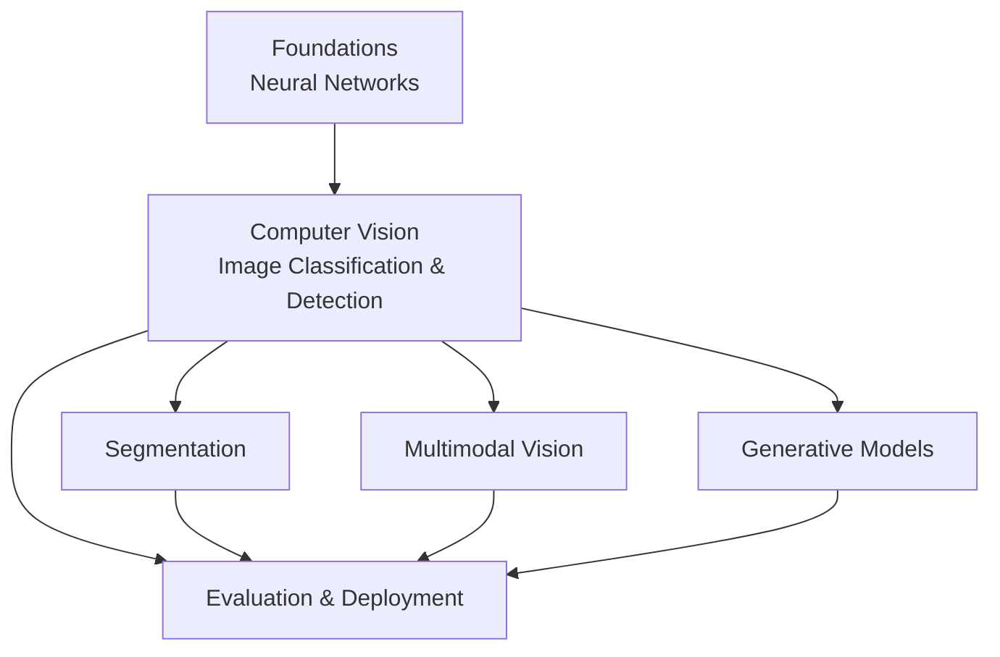
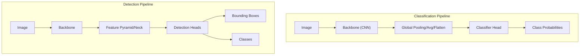
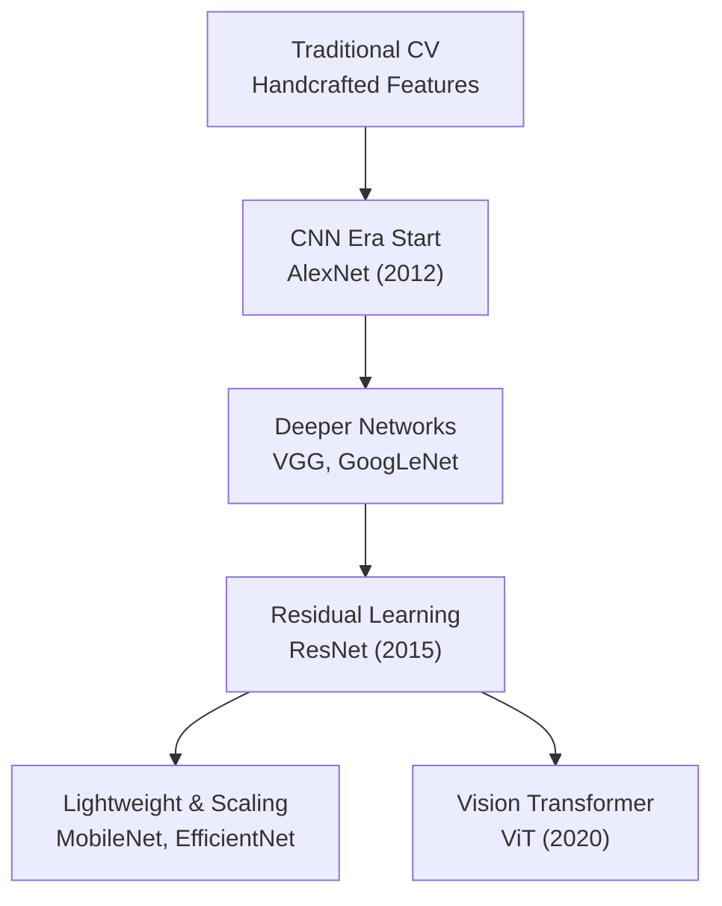
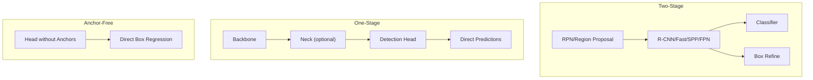
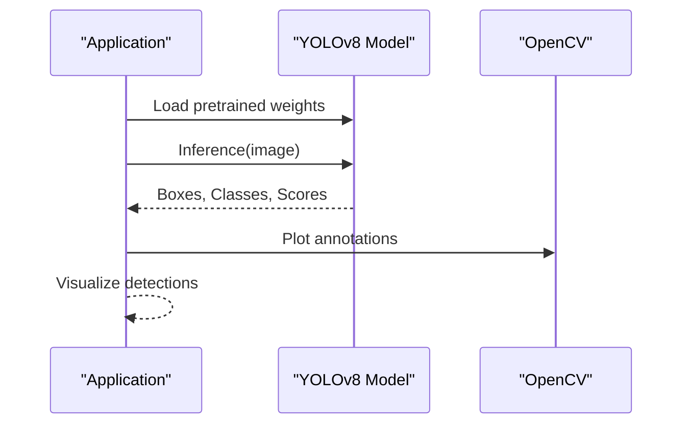
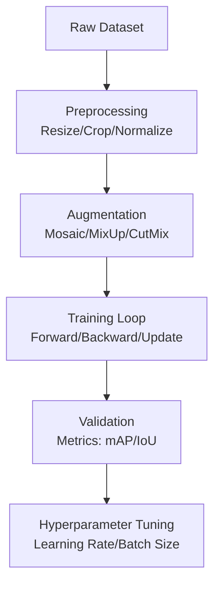
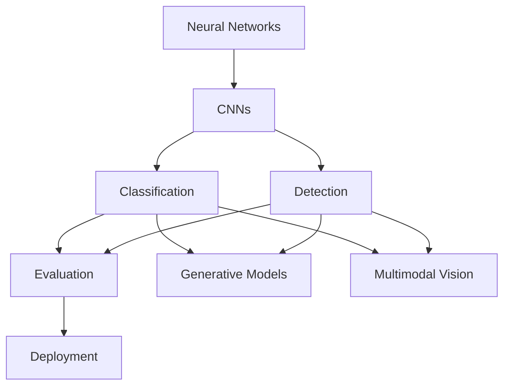

# Image Classification and Detection

<cite>
**Referenced Files in This Document**
- [Image_Classification_Detection.md](file://docs/05_Computer_Vision/Image_Classification_Detection/Image_Classification_Detection.md)
- [Segmentation.md](file://docs/05_Computer_Vision/Segmentation/Segmentation.md)
- [README.md](file://docs/05_Computer_Vision/README.md)
- [Neural_Network_Core.md](file://docs/03_Deep_Learning/Neural_Network_Core/Neural_Network_Core.md)
- [Model_Evaluation.md](file://docs/07_AI_Engineering/Model_Evaluation/Model_Evaluation.md)
- [Inference-in-nutshell.md](file://docs/07_AI_Engineering/Deployment_Inference/Inference-in-nutshell.md)
- [Generative_Models.md](file://docs/05_Computer_Vision/Generative_Models/Generative_Models.md)
- [Multimodal_Vision_for_dummy.md](file://docs/05_Computer_Vision/Multimodal_Vision/Multimodal_Vision_for_dummy.md)
</cite>

## Table of Contents
1. [Introduction](#introduction)
2. [Project Structure](#project-structure)
3. [Core Components](#core-components)
4. [Architecture Overview](#architecture-overview)
5. [Detailed Component Analysis](#detailed-component-analysis)
6. [Dependency Analysis](#dependency-analysis)
7. [Performance Considerations](#performance-considerations)
8. [Troubleshooting Guide](#troubleshooting-guide)
9. [Conclusion](#conclusion)
10. [Appendices](#appendices)

## Introduction
This document synthesizes the repository’s computer vision materials into a comprehensive guide for image classification and detection systems. It explains supervised image classification fundamentals, object detection methodologies, and the evolution from classical computer vision to modern deep learning. It documents CNN architectures, feature extraction, classification pipelines, detection frameworks (R-CNN family, single-shot detectors, anchor-free approaches), dataset preparation, data augmentation, evaluation metrics, practical implementation examples, pretrained model usage, transfer learning strategies, and production deployment considerations. It also addresses common challenges such as class imbalance, occlusion, and multi-scale detection.

## Project Structure
The repository organizes computer vision knowledge progressively:
- Foundations: Neural network basics underpin CNNs and training.
- Vision Tasks: Classification and detection, segmentation, multimodal vision, and generative models.
- Engineering: Model evaluation and deployment/inference.

**Section sources**
- [README.md: Computer Vision Learning Path:7-30](file://docs/05_Computer_Vision/README.md#L7-L30)

## Core Components
- Supervised image classification: mapping images to discrete categories via learned feature extractors.
- Object detection: joint localization (bounding boxes) and classification.
- CNNs: hierarchical feature extraction with translation equivariance and parameter sharing.
- Detection families: two-stage (region proposal) and one-stage (single-shot) detectors; anchor-free paradigms.
- Evaluation: per-class precision/recall/F1 and mAP; IoU thresholds; ROC/AUC for ranking.
- Deployment: quantization, ONNX export, batching, and monitoring.

**Section sources**
- [Image_Classification_Detection.md: Overview:5-12](file://docs/05_Computer_Vision/Image_Classification_Detection/Image_Classification_Detection.md#L5-L12)
- [Image_Classification_Detection.md: CNN Basics:41-92](file://docs/05_Computer_Vision/Image_Classification_Detection/Image_Classification_Detection.md#L41-L92)
- [Segmentation.md: Task Hierarchy:11-23](file://docs/05_Computer_Vision/Segmentation/Segmentation.md#L11-L23)

## Architecture Overview
The typical classification pipeline:
- Input image → CNN backbone → global pooling → classifier head → category probabilities.
Detection pipelines add:
- Feature pyramid/network for multi-scale → detection heads → bounding box regression + classification.

**Diagram sources**
- [Image_Classification_Detection.md: CNN Layers:75-92](file://docs/05_Computer_Vision/Image_Classification_Detection/Image_Classification_Detection.md#L75-L92)
- [Image_Classification_Detection.md: YOLO Output Structure:209-220](file://docs/05_Computer_Vision/Image_Classification_Detection/Image_Classification_Detection.md#L209-L220)

## Detailed Component Analysis

### CNN Architectures and Evolution
- AlexNet introduced deep learning to CV with ReLU, dropout, and data augmentation.
- VGG popularized uniform small kernels; GoogLeNet introduced inception modules; ResNet solved vanishing gradients with residual connections.
- DenseNet improved parameter efficiency; MobileNet and EfficientNet emphasized efficiency and scaling.
- Vision Transformer (ViT) moved beyond strong CNN inductive biases to a pure transformer approach.

**Diagram sources**
- [Image_Classification_Detection.md: Historical Timeline:13-35](file://docs/05_Computer_Vision/Image_Classification_Detection/Image_Classification_Detection.md#L13-L35)

**Section sources**
- [Image_Classification_Detection.md: Classic CNN Architectures:94-106](file://docs/05_Computer_Vision/Image_Classification_Detection/Image_Classification_Detection.md#L94-L106)
- [Image_Classification_Detection.md: Residual Block:107-150](file://docs/05_Computer_Vision/Image_Classification_Detection/Image_Classification_Detection.md#L107-L150)
- [Image_Classification_Detection.md: ViT:151-187](file://docs/05_Computer_Vision/Image_Classification_Detection/Image_Classification_Detection.md#L151-L187)

### Object Detection Families
- Two-stage detectors (R-CNN family): region proposals followed by classification/regression; higher accuracy, slower.
- One-stage detectors (YOLO series): single-shot prediction; real-time, near state-of-the-art.
- Anchor-free detectors: eliminate predefined anchors; simplify heads and improve localization.
- ViT-based detection (DETR) and recent YOLO variants (v8/v10) continue pushing speed/accuracy.

**Diagram sources**
- [Image_Classification_Detection.md: Two-Stage vs One-Stage:275-284](file://docs/05_Computer_Vision/Image_Classification_Detection/Image_Classification_Detection.md#L275-L284)
- [Image_Classification_Detection.md: YOLO Versions:222-232](file://docs/05_Computer_Vision/Image_Classification_Detection/Image_Classification_Detection.md#L222-L232)

**Section sources**
- [Image_Classification_Detection.md: YOLO Core:192-232](file://docs/05_Computer_Vision/Image_Classification_Detection/Image_Classification_Detection.md#L192-L232)
- [Image_Classification_Detection.md: mAP & IoU:238-274](file://docs/05_Computer_Vision/Image_Classification_Detection/Image_Classification_Detection.md#L238-L274)

### Practical Implementation Examples
- ResNet residual block and simplified ResNet-18 implementation for classification.
- YOLOv8 inference and training workflow with Ultralytics, including exporting to ONNX.

**Diagram sources**
- [Image_Classification_Detection.md: YOLO Inference:400-449](file://docs/05_Computer_Vision/Image_Classification_Detection/Image_Classification_Detection.md#L400-L449)

**Section sources**
- [Image_Classification_Detection.md: ResNet PyTorch:289-398](file://docs/05_Computer_Vision/Image_Classification_Detection/Image_Classification_Detection.md#L289-L398)
- [Image_Classification_Detection.md: YOLO Training/Export:450-473](file://docs/05_Computer_Vision/Image_Classification_Detection/Image_Classification_Detection.md#L450-L473)

### Dataset Preparation, Augmentation, and Evaluation
- Datasets: ImageNet, COCO, Pascal VOC, Open Images.
- Augmentation: Mosaic, MixUp, CutMix, RandAugment; designed to improve generalization and robustness.
- Evaluation: mAP@0.5 and mAP@0.5:0.95; IoU thresholds; PR curves and AUC for ranking.

**Diagram sources**
- [Image_Classification_Detection.md: Data Augmentation:514-523](file://docs/05_Computer_Vision/Image_Classification_Detection/Image_Classification_Detection.md#L514-L523)
- [Model_Evaluation.md: Classification Metrics:27-117](file://docs/07_AI_Engineering/Model_Evaluation/Model_Evaluation.md#L27-L117)

**Section sources**
- [Image_Classification_Detection.md: Datasets:645-649](file://docs/05_Computer_Vision/Image_Classification_Detection/Image_Classification_Detection.md#L645-L649)
- [Model_Evaluation.md: Metrics Overview:27-117](file://docs/07_AI_Engineering/Model_Evaluation/Model_Evaluation.md#L27-L117)

### Transfer Learning and Pretrained Models
- Use pretrained backbones (e.g., ImageNet) and fine-tune for downstream tasks.
- ViT and CNN backbones are commonly adapted for classification and detection.

**Section sources**
- [Image_Classification_Detection.md: ViT:151-187](file://docs/05_Computer_Vision/Image_Classification_Detection/Image_Classification_Detection.md#L151-L187)
- [Segmentation.md: ViT in Segmentation:145-164](file://docs/05_Computer_Vision/Segmentation/Segmentation.md#L145-L164)

### Production Deployment Considerations
- Inference modes: disable gradients, set eval mode, avoid unnecessary computation.
- Optimization: quantization, ONNX export, batching, and platform-specific accelerators.
- Monitoring: latency percentiles, throughput, GPU/memory utilization, health/readiness checks.

**Diagram sources**
- [Inference-in-nutshell.md: Optimization Overview:221-233](file://docs/07_AI_Engineering/Deployment_Inference/Inference-in-nutshell.md#L221-L233)

**Section sources**
- [Inference-in-nutshell.md: Inference Mode:33-64](file://docs/07_AI_Engineering/Deployment_Inference/Inference-in-nutshell.md#L33-L64)
- [Inference-in-nutshell.md: Optimization Techniques:221-277](file://docs/07_AI_Engineering/Deployment_Inference/Inference-in-nutshell.md#L221-L277)
- [Inference-in-nutshell.md: Monitoring:300-324](file://docs/07_AI_Engineering/Deployment_Inference/Inference-in-nutshell.md#L300-L324)

## Dependency Analysis
- Foundational DL concepts underpin CNNs and training dynamics.
- Computer vision tasks build upon these foundations and feed into evaluation and deployment.
- Multimodal and generative models complement classification/detection with broader representation learning.

**Diagram sources**
- [Neural_Network_Core.md: Core Concepts:56-56](file://docs/03_Deep_Learning/Neural_Network_Core/Neural_Network_Core.md#L56-L56)
- [README.md: CV Learning Path:7-30](file://docs/05_Computer_Vision/README.md#L7-L30)

**Section sources**
- [Neural_Network_Core.md: CNN Core:359-378](file://docs/03_Deep_Learning/Neural_Network_Core/Neural_Network_Core.md#L359-L378)
- [Generative_Models.md: Diffusion:145-200](file://docs/05_Computer_Vision/Generative_Models/Generative_Models.md#L145-L200)
- [Multimodal_Vision_for_dummy.md: CLIP:80-130](file://docs/05_Computer_Vision/Multimodal_Vision/Multimodal_Vision_for_dummy.md#L80-L130)

## Performance Considerations
- Depth vs width trade-offs: deeper networks capture richer semantics but require careful initialization and residual connections.
- Attention vs convolutions: ViT excels at scale but needs large datasets; CNNs remain efficient and robust for smaller datasets.
- Detection speed/accuracy: anchor-free and decoupled heads reduce complexity; Mosaic/MixUp improve robustness.
- Inference: quantization and ONNX/TensorRT accelerate runtime; batching improves throughput.

[No sources needed since this section provides general guidance]

## Troubleshooting Guide
Common pitfalls and remedies:
- Class imbalance: use focal loss, weighted CE, oversampling/undersampling, and appropriate metrics (PR-AUC).
- Overfitting: augment data, use dropout/L2, early stopping, and monitor validation curves.
- Localization errors: use DIoU/CIoU losses; ensure sufficient supervision at small scales.
- Inference issues: ensure eval mode, disable gradients, match device and input shapes, pre-warm models.

**Section sources**
- [Image_Classification_Detection.md: Common Pitfalls:532-540](file://docs/05_Computer_Vision/Image_Classification_Detection/Image_Classification_Detection.md#L532-L540)
- [Inference-in-nutshell.md: Common Problems:421-443](file://docs/07_AI_Engineering/Deployment_Inference/Inference-in-nutshell.md#L421-L443)

## Conclusion
This repository’s materials provide a complete pathway from foundational neural networks to advanced classification and detection systems, with strong coverage of evaluation and production deployment. By leveraging pretrained models, transfer learning, and modern detection paradigms, practitioners can rapidly build robust computer vision systems tailored to real-world applications.

[No sources needed since this section summarizes without analyzing specific files]

## Appendices

### A. Evaluation Metrics Quick Reference
- Classification: accuracy, precision, recall, F1, ROC-AUC, PR-AUC.
- Detection: IoU thresholds, mAP@.5 and mAP@.5:.95.

**Section sources**
- [Model_Evaluation.md: Classification Metrics:27-117](file://docs/07_AI_Engineering/Model_Evaluation/Model_Evaluation.md#L27-L117)
- [Image_Classification_Detection.md: mAP & IoU:238-274](file://docs/05_Computer_Vision/Image_Classification_Detection/Image_Classification_Detection.md#L238-L274)

### B. Model Selection Guidelines
- Real-time applications: YOLOv8/v10; high-precision: two-stage detectors.
- Mobile/embedded: lightweight CNNs or MobileNet-based detectors.
- Large-scale data: ViT-based detectors; small data: CNNs.

**Section sources**
- [Image_Classification_Detection.md: Model Selection FAQ:604-612](file://docs/05_Computer_Vision/Image_Classification_Detection/Image_Classification_Detection.md#L604-L612)