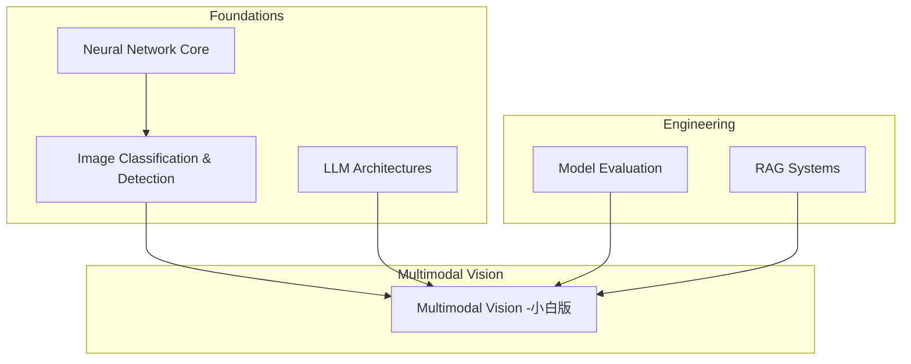
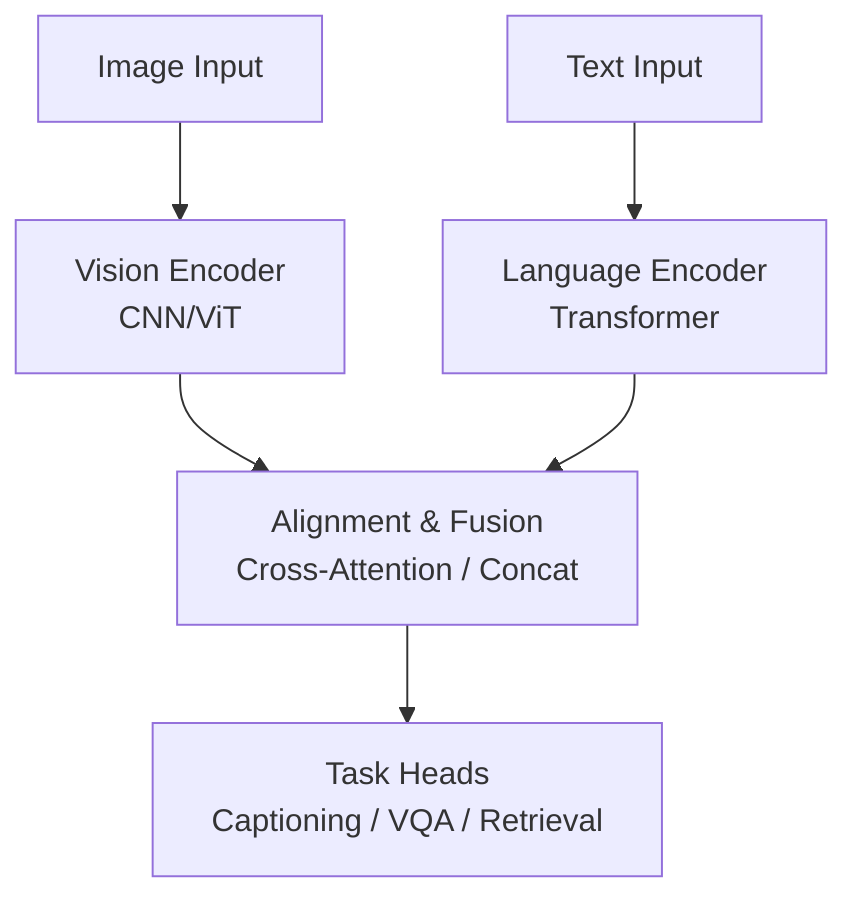
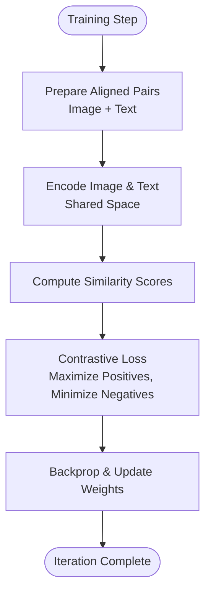
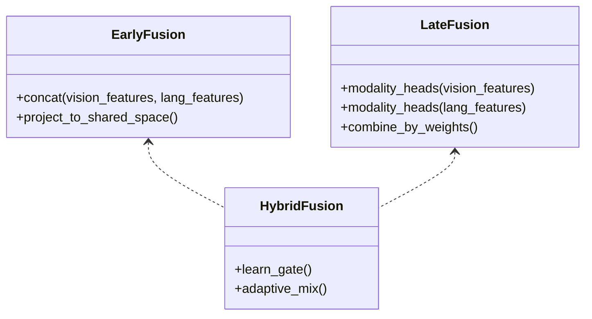
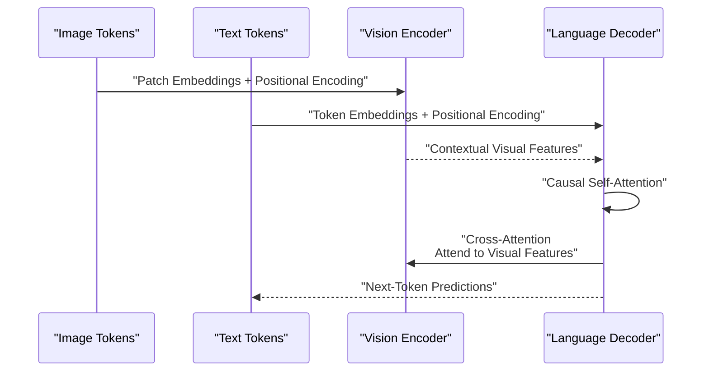
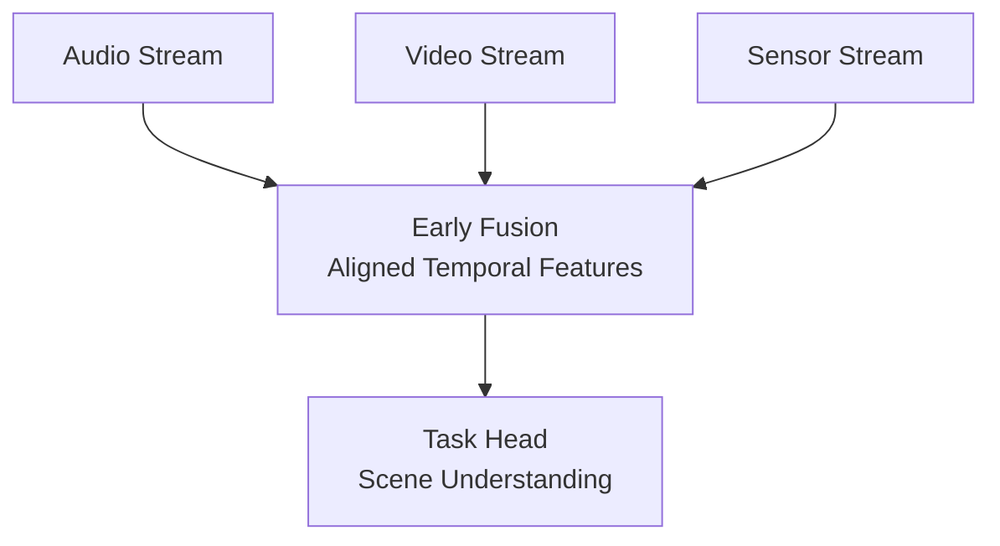
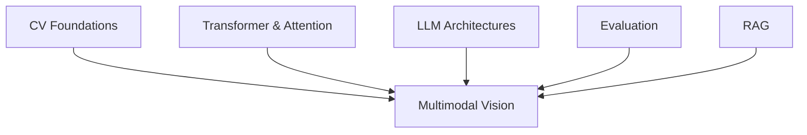

# Multimodal Vision Systems

<cite>
**Referenced Files in This Document**
- [Multimodal Vision -小白版](file://docs/05_Computer_Vision/Multimodal_Vision/Multimodal_Vision_for_dummy.md)
- [Image Classification & Detection](file://docs/05_Computer_Vision/Image_Classification_Detection/Image_Classification_Detection.md)
- [Neural Network Core](file://docs/03_Deep_Learning/Neural_Network_Core/Neural_Network_Core.md)
- [Model Evaluation](file://docs/07_AI_Engineering/Model_Evaluation/Model_Evaluation.md)
- [LLM Architectures](file://docs/04_NLP_LLMs/LLM_Architectures/LLM_Architectures.md)
- [RAG Systems](file://docs/07_AI_Engineering/RAG_Systems/RAG_Systems.md)
- [Computer Vision Chapter](file://docs/05_Computer_Vision/README.md)
</cite>

## Table of Contents
1. [Introduction](#introduction)
2. [Project Structure](#project-structure)
3. [Core Components](#core-components)
4. [Architecture Overview](#architecture-overview)
5. [Detailed Component Analysis](#detailed-component-analysis)
6. [Dependency Analysis](#dependency-analysis)
7. [Performance Considerations](#performance-considerations)
8. [Troubleshooting Guide](#troubleshooting-guide)
9. [Conclusion](#conclusion)
10. [Appendices](#appendices)

## Introduction
This document explains multimodal vision systems that integrate computer vision with other modalities such as natural language processing, audio, and sensor data. It covers cross-modal representation learning, alignment mechanisms, fusion strategies, attention-based architectures, and transformer-based multimodal designs. Applications include image captioning, visual question answering, cross-modal retrieval, and emerging audio-visual scene analysis. The guide also outlines preprocessing, handling missing data, heterogeneous input formats, evaluation benchmarks, datasets, and metrics, along with practical implementation guidance for building custom multimodal systems.

## Project Structure
The repository organizes knowledge across foundational deep learning, computer vision, NLP/LLMs, and engineering practices. Multimodal vision sits at the intersection of:
- Computer Vision fundamentals (classification, detection, segmentation)
- Transformer architectures and attention mechanisms
- Large Language Model (LLM) architectures and multimodal extensions
- Model evaluation and benchmarking
- Retrieval-Augmented Generation (RAG) techniques for hybrid search

**Diagram sources**
- [Neural Network Core:1-100](file://docs/03_Deep_Learning/Neural_Network_Core/Neural_Network_Core.md#L1-L100)
- [Image Classification & Detection:1-120](file://docs/05_Computer_Vision/Image_Classification_Detection/Image_Classification_Detection.md#L1-L120)
- [LLM Architectures:1-120](file://docs/04_NLP_LLMs/LLM_Architectures/LLM_Architectures.md#L1-L120)
- [Multimodal Vision -小白版:1-120](file://docs/05_Computer_Vision/Multimodal_Vision/Multimodal_Vision_for_dummy.md#L1-L120)
- [Model Evaluation:1-80](file://docs/07_AI_Engineering/Model_Evaluation/Model_Evaluation.md#L1-L80)
- [RAG Systems:150-228](file://docs/07_AI_Engineering/RAG_Systems/RAG_Systems.md#L150-L228)

**Section sources**
- [Computer Vision Chapter:1-63](file://docs/05_Computer_Vision/README.md#L1-L63)
- [Multimodal Vision -小白版:1-120](file://docs/05_Computer_Vision/Multimodal_Vision/Multimodal_Vision_for_dummy.md#L1-L120)

## Core Components
- Cross-modal representation learning: Aligning visual and linguistic embeddings into a shared semantic space.
- Alignment mechanisms: Contrastive learning and metric losses to maximize co-occurrence similarity and minimize mismatch.
- Fusion strategies: Early fusion (joint embedding), late fusion (independent heads), and hybrid approaches.
- Attention and transformers: Self-attention and cross-attention for joint processing of heterogeneous sequences.
- Transformer-based architectures: Vision encoders (ViT), language decoders (GPT-style), and hybrid encoder-decoder stacks.
- Multimodal retrieval: Zero-shot classification, cross-modal search, and reranking pipelines.
- Applications: Image captioning, visual question answering, audio-visual scene analysis, and AR-assisted recognition.

**Section sources**
- [Multimodal Vision -小白版:80-260](file://docs/05_Computer_Vision/Multimodal_Vision/Multimodal_Vision_for_dummy.md#L80-L260)
- [Image Classification & Detection:150-190](file://docs/05_Computer_Vision/Image_Classification_Detection/Image_Classification_Detection.md#L150-L190)
- [Neural Network Core:395-406](file://docs/03_Deep_Learning/Neural_Network_Core/Neural_Network_Core.md#L395-L406)
- [LLM Architectures:39-80](file://docs/04_NLP_LLMs/LLM_Architectures/LLM_Architectures.md#L39-L80)

## Architecture Overview
A typical multimodal pipeline integrates a vision encoder (CNN or ViT), a language encoder (Transformer), and a fusion module. The vision encoder extracts patch-wise or global visual features; the language encoder processes text tokens; a fusion block aligns and combines modalities; finally, task-specific heads produce outputs (captioning, VQA, retrieval scores).

**Diagram sources**
- [Multimodal Vision -小白版:131-167](file://docs/05_Computer_Vision/Multimodal_Vision/Multimodal_Vision_for_dummy.md#L131-L167)
- [Image Classification & Detection:150-190](file://docs/05_Computer_Vision/Image_Classification_Detection/Image_Classification_Detection.md#L150-L190)
- [Neural Network Core:395-406](file://docs/03_Deep_Learning/Neural_Network_Core/Neural_Network_Core.md#L395-L406)

## Detailed Component Analysis

### Cross-Modal Representation Learning and Alignment
- Contrastive training: Encourage aligned pairs to be close and misaligned pairs to be distant in a shared embedding space.
- Zero-shot capabilities: Use semantic prompts or class names to classify unseen categories via similarity.
- Shared embedding space: Enables cross-modal retrieval and reasoning.

**Diagram sources**
- [Multimodal Vision -小白版:339-361](file://docs/05_Computer_Vision/Multimodal_Vision/Multimodal_Vision_for_dummy.md#L339-L361)

**Section sources**
- [Multimodal Vision -小白版:80-129](file://docs/05_Computer_Vision/Multimodal_Vision/Multimodal_Vision_for_dummy.md#L80-L129)

### Fusion Strategies
- Early fusion: Concatenate or element-wise combine embeddings after initial encoding.
- Late fusion: Independent heads per modality with weighted combination.
- Hybrid fusion: Learnable mixing weights or gating mechanisms.

**Diagram sources**
- [Multimodal Vision -小白版:131-167](file://docs/05_Computer_Vision/Multimodal_Vision/Multimodal_Vision_for_dummy.md#L131-L167)

**Section sources**
- [Multimodal Vision -小白版:131-167](file://docs/05_Computer_Vision/Multimodal_Vision/Multimodal_Vision_for_dummy.md#L131-L167)

### Attention and Transformer-Based Multimodal Architectures
- Self-attention enables long-range dependencies and parallel computation.
- Cross-attention allows the decoder to attend to both source and memory representations.
- ViT-based vision encoders and GPT-style decoders form a strong backbone for vision-language tasks.

**Diagram sources**
- [Neural Network Core:395-406](file://docs/03_Deep_Learning/Neural_Network_Core/Neural_Network_Core.md#L395-L406)
- [LLM Architectures:39-80](file://docs/04_NLP_LLMs/LLM_Architectures/LLM_Architectures.md#L39-L80)

**Section sources**
- [Neural Network Core:395-406](file://docs/03_Deep_Learning/Neural_Network_Core/Neural_Network_Core.md#L395-L406)
- [LLM Architectures:39-80](file://docs/04_NLP_LLMs/LLM_Architectures/LLM_Architectures.md#L39-L80)

### Applications: Image Captioning, Visual Question Answering, Cross-Modal Retrieval
- Image captioning: Generate fluent descriptions conditioned on visual context.
- Visual question answering: Answer questions grounded in images using joint reasoning.
- Cross-modal retrieval: Retrieve relevant images given text queries or vice versa.

**Diagram sources**
- [Multimodal Vision -小白版:205-260](file://docs/05_Computer_Vision/Multimodal_Vision/Multimodal_Vision_for_dummy.md#L205-L260)

**Section sources**
- [Multimodal Vision -小白版:205-260](file://docs/05_Computer_Vision/Multimodal_Vision/Multimodal_Vision_for_dummy.md#L205-L260)

### Audio-Visual Scene Analysis and Multi-Sensor Fusion
- Extend the framework to incorporate audio features (e.g., spectrograms) and inertial/sensor data.
- Use early fusion for synchronized streams or temporal transformers for asynchronous sensors.
- Apply cross-modal attention to align audio and visual streams.

[No sources needed since this diagram shows conceptual workflow, not actual code structure]

### Preprocessing, Missing Data, and Heterogeneous Inputs
- Normalize and resize images; tokenize and truncate text; align timestamps for audio/video.
- Handle missing modalities via masking or learnable embeddings.
- Manage variable-length sequences with padding and attention masks.

**Section sources**
- [Model Evaluation:177-213](file://docs/07_AI_Engineering/Model_Evaluation/Model_Evaluation.md#L177-L213)

### Evaluation Benchmarks, Datasets, and Metrics
- Benchmarks: COCO (captions, detection), VQA datasets, Flickr30k, MS-COCO Retrieval.
- Metrics: BLEU, METEOR, ROUGE-L for generation; accuracy, precision/recall, AUC for classification; mAP for detection/retrieval.
- Human evaluation and LLM-as-judge for quality assessment.

**Section sources**
- [Model Evaluation:102-152](file://docs/07_AI_Engineering/Model_Evaluation/Model_Evaluation.md#L102-L152)
- [Image Classification & Detection:238-274](file://docs/05_Computer_Vision/Image_Classification_Detection/Image_Classification_Detection.md#L238-L274)

### Implementation Guidance
- Start with pretrained encoders (e.g., ViT, CLIP, LLM) and fine-tune on downstream tasks.
- Use contrastive losses for alignment; add task heads for captioning/VQA.
- Deploy with efficient inference (quantization, pruning) and monitoring pipelines.

**Section sources**
- [Multimodal Vision -小白版:131-204](file://docs/05_Computer_Vision/Multimodal_Vision/Multimodal_Vision_for_dummy.md#L131-L204)
- [LLM Architectures:456-498](file://docs/04_NLP_LLMs/LLM_Architectures/LLM_Architectures.md#L456-L498)

## Dependency Analysis
Multimodal vision depends on:
- Computer Vision foundations (CNNs, ViT, detection)
- Transformer architectures and attention
- LLM backbones for language modeling and generation
- Evaluation frameworks for robust measurement
- Retrieval systems for hybrid search

**Diagram sources**
- [Computer Vision Chapter:1-63](file://docs/05_Computer_Vision/README.md#L1-L63)
- [Neural Network Core:395-406](file://docs/03_Deep_Learning/Neural_Network_Core/Neural_Network_Core.md#L395-L406)
- [LLM Architectures:456-498](file://docs/04_NLP_LLMs/LLM_Architectures/LLM_Architectures.md#L456-L498)
- [Model Evaluation:1-80](file://docs/07_AI_Engineering/Model_Evaluation/Model_Evaluation.md#L1-L80)
- [RAG Systems:159-228](file://docs/07_AI_Engineering/RAG_Systems/RAG_Systems.md#L159-L228)

**Section sources**
- [Computer Vision Chapter:1-63](file://docs/05_Computer_Vision/README.md#L1-L63)

## Performance Considerations
- Use pre-normalization (LayerNorm) and gradient clipping to stabilize training.
- Optimize inference with efficient attention variants and KV cache management.
- Monitor calibration and fairness to ensure reliable deployment.

[No sources needed since this section provides general guidance]

## Troubleshooting Guide
- Data leakage: Ensure proper train/validation splits and time-aware validation.
- Class imbalance: Use appropriate metrics (PR-AUC) and resampling strategies.
- Overfitting: Apply regularization, early stopping, and cross-validation.
- Calibration: Employ ECE and Platt scaling for probability reliability.

**Section sources**
- [Model Evaluation:312-344](file://docs/07_AI_Engineering/Model_Evaluation/Model_Evaluation.md#L312-L344)

## Conclusion
Multimodal vision systems unify diverse sensory inputs through shared representations and attention-based fusion. By leveraging pretrained vision-language encoders, contrastive alignment, and robust evaluation practices, practitioners can build powerful systems for captioning, VQA, retrieval, and emerging audio-visual applications. Engineering best practices around calibration, fairness, and deployment ensure reliable real-world performance.

[No sources needed since this section summarizes without analyzing specific files]

## Appendices

### Appendix A: Practical Workflows
- Zero-shot classification: Compute similarities against candidate prompts.
- Retrieval pipeline: Embed queries and images; rank by cosine similarity; optionally rerank with cross-encoders.
- RAG augmentation: Combine retrieval with generative models for contextual answers.

**Section sources**
- [Multimodal Vision -小白版:312-335](file://docs/05_Computer_Vision/Multimodal_Vision/Multimodal_Vision_for_dummy.md#L312-L335)
- [RAG Systems:159-228](file://docs/07_AI_Engineering/RAG_Systems/RAG_Systems.md#L159-L228)