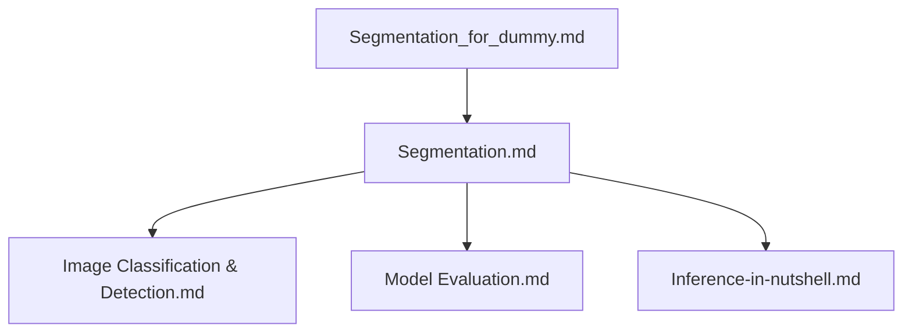
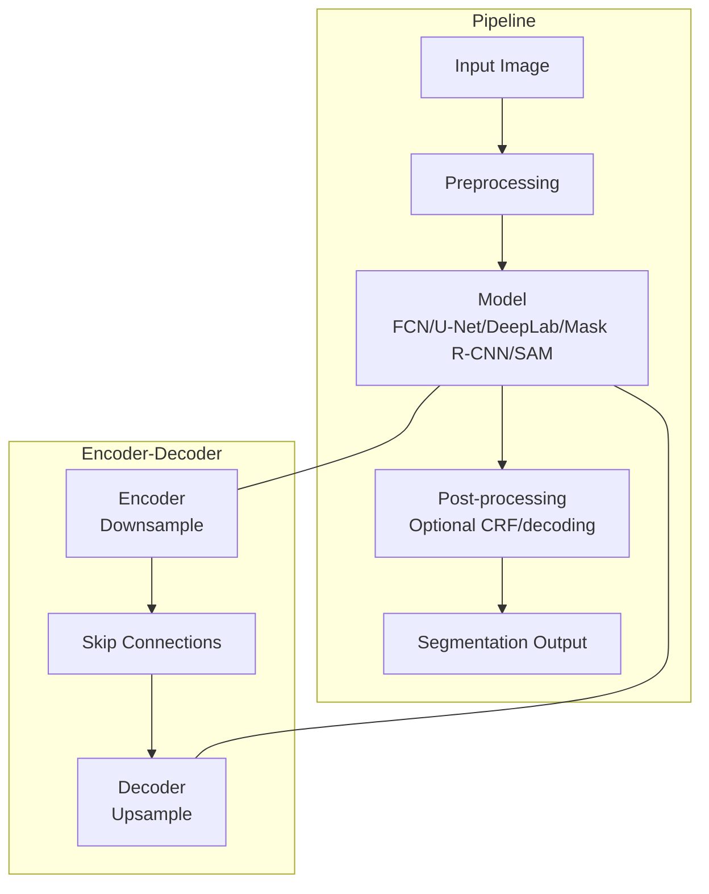
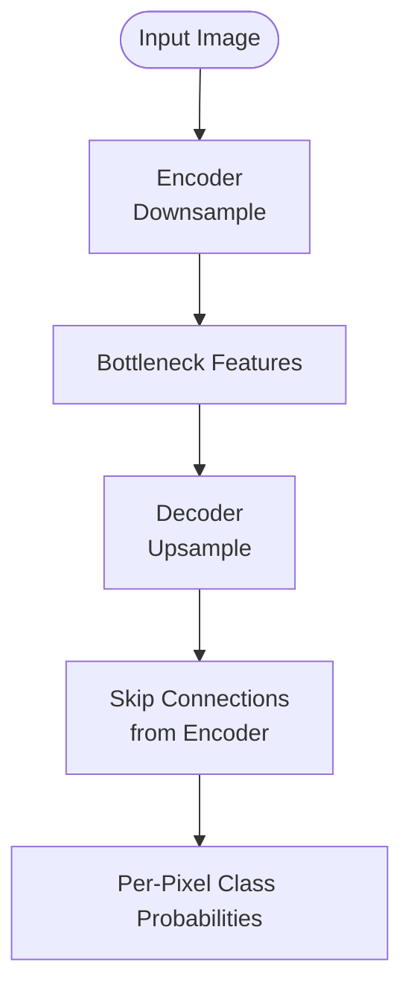
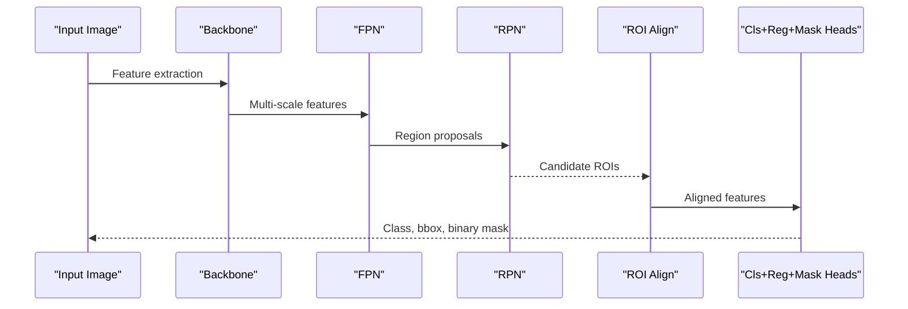
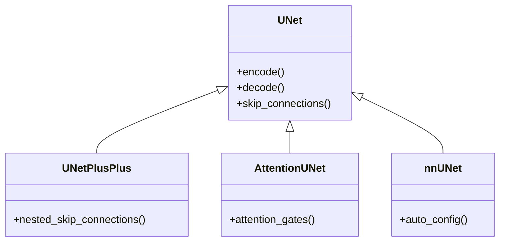
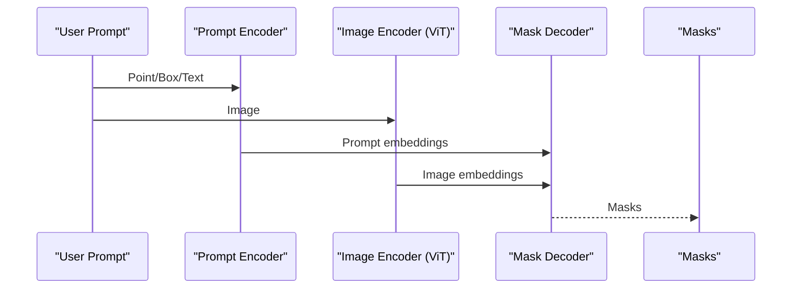
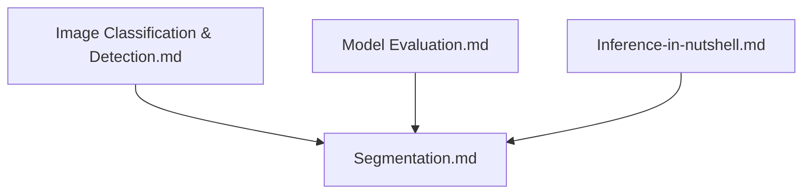

# Segmentation Techniques

<cite>
**Referenced Files in This Document**
- [Segmentation.md](file://docs/05_Computer_Vision/Segmentation/Segmentation.md)
- [Segmentation_for_dummy.md](file://docs/05_Computer_Vision/Segmentation/Segmentation_for_dummy.md)
- [Image_Classification_Detection.md](file://docs/05_Computer_Vision/Image_Classification_Detection/Image_Classification_Detection.md)
- [Model_Evaluation.md](file://docs/07_AI_Engineering/Model_Evaluation/Model_Evaluation.md)
- [Inference-in-nutshell.md](file://docs/07_AI_Engineering/Deployment_Inference/Inference-in-nutshell.md)
</cite>

## Table of Contents
1. [Introduction](#introduction)
2. [Project Structure](#project-structure)
3. [Core Components](#core-components)
4. [Architecture Overview](#architecture-overview)
5. [Detailed Component Analysis](#detailed-component-analysis)
6. [Dependency Analysis](#dependency-analysis)
7. [Performance Considerations](#performance-considerations)
8. [Troubleshooting Guide](#troubleshooting-guide)
9. [Conclusion](#conclusion)
10. [Appendices](#appendices)

## Introduction
This document provides comprehensive, practical guidance on computer vision segmentation techniques. It explains the fundamental differences among semantic segmentation, instance segmentation, and panoptic segmentation, and covers classical pixel-wise classification and boundary-based methods alongside modern deep learning approaches such as U-Net, Mask R-CNN, and transformer-based models like SAM. It also documents encoder-decoder architectures, skip connections, multi-scale fusion, loss functions, evaluation metrics, and deployment considerations for real-world applications across domains such as medical imaging, autonomous driving, and industrial inspection.

## Project Structure
The segmentation knowledge base is organized under the Computer Vision section with dedicated documentation for segmentation and related topics:
- Segmentation fundamentals and advanced techniques
- Classical segmentation methods (thresholding, region growing, clustering)
- Modern deep learning segmentation models
- Evaluation metrics and deployment guidance

**Diagram sources**
- [Segmentation.md:1-334](file://docs/05_Computer_Vision/Segmentation/Segmentation.md#L1-L334)
- [Image_Classification_Detection.md:1-659](file://docs/05_Computer_Vision/Image_Classification_Detection/Image_Classification_Detection.md#L1-L659)
- [Model_Evaluation.md:1-397](file://docs/07_AI_Engineering/Model_Evaluation/Model_Evaluation.md#L1-L397)
- [Inference-in-nutshell.md:1-521](file://docs/07_AI_Engineering/Deployment_Inference/Inference-in-nutshell.md#L1-L521)

**Section sources**
- [Segmentation.md:1-334](file://docs/05_Computer_Vision/Segmentation/Segmentation.md#L1-L334)
- [Segmentation_for_dummy.md:1-428](file://docs/05_Computer_Vision/Segmentation/Segmentation_for_dummy.md#L1-L428)

## Core Components
- Task taxonomy and outputs:
  - Semantic segmentation: per-pixel class labels; does not distinguish instances of the same class.
  - Instance segmentation: per-pixel instance IDs; distinguishes different individuals of the same class.
  - Panoptic segmentation: combines semantic and instance segmentation; treats countable objects as instances and uncountable backgrounds as semantic classes.
- Encoder-decoder architecture with skip connections:
  - Encoder progressively downsamples to extract semantic features.
  - Decoder upsamples to reconstruct spatial detail, guided by skip connections from encoder layers.
- Classical segmentation methods:
  - Thresholding, region growing, and clustering (e.g., K-means, hierarchical clustering, DBSCAN) remain useful baselines and preprocessing steps for segmentation pipelines.
- Modern deep learning:
  - FCN, U-Net, DeepLab (ASPP), Mask R-CNN (ROI Align + mask head), and SAM (ViT-based image encoder + promptable mask decoder).

**Section sources**
- [Segmentation.md:9-61](file://docs/05_Computer_Vision/Segmentation/Segmentation.md#L9-L61)
- [Segmentation_for_dummy.md:50-138](file://docs/05_Computer_Vision/Segmentation/Segmentation_for_dummy.md#L50-L138)

## Architecture Overview
The segmentation pipeline integrates classical and deep learning components. At a high level:
- Input image → Preprocessing → Model (CNN/Transformer) → Post-processing (optional CRF/decoding) → Output segmentation map
- Encoder-decoder with skip connections recovers fine details while preserving semantics.
- For instance segmentation, ROI alignment and per-ROI mask heads refine instance boundaries.

**Diagram sources**
- [Segmentation.md:43-61](file://docs/05_Computer_Vision/Segmentation/Segmentation.md#L43-L61)
- [Segmentation.md:67-164](file://docs/05_Computer_Vision/Segmentation/Segmentation.md#L67-L164)

**Section sources**
- [Segmentation.md:43-61](file://docs/05_Computer_Vision/Segmentation/Segmentation.md#L43-L61)
- [Segmentation.md:67-164](file://docs/05_Computer_Vision/Segmentation/Segmentation.md#L67-L164)

## Detailed Component Analysis

### Semantic Segmentation
- Definition: Assign a class label to each pixel; does not distinguish instances of the same class.
- Challenges: Balancing global semantics and local detail; high computational cost due to per-pixel classification.
- Architectures: FCN pioneered fully convolutional pixel-wise classification; U-Net excels in small datasets with dense skip connections; DeepLab expands receptive field via atrous convolutions and ASPP.

**Diagram sources**
- [Segmentation.md:43-61](file://docs/05_Computer_Vision/Segmentation/Segmentation.md#L43-L61)

**Section sources**
- [Segmentation.md:35-42](file://docs/05_Computer_Vision/Segmentation/Segmentation.md#L35-L42)
- [Segmentation.md:67-124](file://docs/05_Computer_Vision/Segmentation/Segmentation.md#L67-L124)

### Instance Segmentation (Mask R-CNN)
- Adds a mask branch to detectron-style two-stage detectors.
- Key innovations: ROI Align avoids quantization artifacts; shared backbone enables efficient joint classification and mask prediction.

**Diagram sources**
- [Segmentation.md:125-144](file://docs/05_Computer_Vision/Segmentation/Segmentation.md#L125-L144)

**Section sources**
- [Segmentation.md:125-144](file://docs/05_Computer_Vision/Segmentation/Segmentation.md#L125-L144)

### Panoptic Segmentation
- Combines semantic segmentation and instance segmentation.
- Countable objects are segmented as instances; uncountable backgrounds are treated semantically.

**Section sources**
- [Segmentation.md:25-29](file://docs/05_Computer_Vision/Segmentation/Segmentation.md#L25-L29)

### U-Net Family
- U-Net’s symmetric encoder-decoder with dense skip connections preserves spatial detail.
- Variants: U-Net++, Attention U-Net, nnU-Net.

**Diagram sources**
- [Segmentation.md:75-103](file://docs/05_Computer_Vision/Segmentation/Segmentation.md#L75-L103)

**Section sources**
- [Segmentation.md:75-103](file://docs/05_Computer_Vision/Segmentation/Segmentation.md#L75-L103)

### DeepLab and Atrous Convolutions
- Atrous convolutions expand receptive field without losing resolution.
- ASPP fuses multi-scale contextual information.

**Section sources**
- [Segmentation.md:104-124](file://docs/05_Computer_Vision/Segmentation/Segmentation.md#L104-L124)

### SAM (Segment Anything Model)
- ViT-based image encoder with promptable mask decoder.
- Supports point/box/text prompts and zero-shot generalization.

**Diagram sources**
- [Segmentation.md:145-164](file://docs/05_Computer_Vision/Segmentation/Segmentation.md#L145-L164)

**Section sources**
- [Segmentation.md:145-164](file://docs/05_Computer_Vision/Segmentation/Segmentation.md#L145-L164)

### Classical Segmentation Methods
- Thresholding: simple pixel-wise classification based on intensity or color.
- Region growing: seeds expand regions based on similarity criteria.
- Clustering: K-means, hierarchical clustering, DBSCAN for unsupervised grouping.

**Section sources**
- [Segmentation_for_dummy.md:1-428](file://docs/05_Computer_Vision/Segmentation/Segmentation_for_dummy.md#L1-L428)

### Boundary Detection and Contour Extraction
- Edge detection and contour extraction complement pixel-wise classification to refine object boundaries.
- These methods are often integrated with deep segmentation heads to improve boundary precision.

**Section sources**
- [Segmentation.md:271-277](file://docs/05_Computer_Vision/Segmentation/Segmentation.md#L271-L277)

## Dependency Analysis
- Segmentation builds upon CNN foundations and detection concepts.
- Evaluation metrics and deployment practices apply broadly across segmentation tasks.

**Diagram sources**
- [Image_Classification_Detection.md:1-659](file://docs/05_Computer_Vision/Image_Classification_Detection/Image_Classification_Detection.md#L1-L659)
- [Model_Evaluation.md:1-397](file://docs/07_AI_Engineering/Model_Evaluation/Model_Evaluation.md#L1-L397)
- [Inference-in-nutshell.md:1-521](file://docs/07_AI_Engineering/Deployment_Inference/Inference-in-nutshell.md#L1-L521)

**Section sources**
- [Segmentation.md:280-291](file://docs/05_Computer_Vision/Segmentation/Segmentation.md#L280-L291)

## Performance Considerations
- Real-time segmentation: BiSeNet v2, PIDNet, MobileSeg.
- 3D segmentation: PointNet/PointNet++ for point clouds; 3D convolutions for voxels.
- Video segmentation: SAM 2 and memory-based trackers.

**Section sources**
- [Segmentation.md:251-270](file://docs/05_Computer_Vision/Segmentation/Segmentation.md#L251-L270)

## Troubleshooting Guide
Common pitfalls and best practices:
- Class imbalance: use Dice/Focal/Lovász losses; adjust class weights; OHEM sampling.
- Boundary blurring: leverage skip connections and boundary supervision.
- Multi-scale challenges: FPN/ASPP for large/small targets.
- Overfitting: data augmentation, semi-supervised learning.

**Section sources**
- [Segmentation.md:271-277](file://docs/05_Computer_Vision/Segmentation/Segmentation.md#L271-L277)

## Conclusion
Segmentation spans classical pixel-wise classification and modern deep learning paradigms. The taxonomy of semantic, instance, and panoptic segmentation defines distinct goals and outputs. Encoder-decoder architectures with skip connections and multi-scale fusion enable robust performance. Loss functions and evaluation metrics must align with task characteristics and class distributions. Deployment requires careful optimization and monitoring. The provided references and diagrams offer a structured pathway to model selection, training, and production deployment across diverse domains.

## Appendices

### Evaluation Metrics and Guidelines
- Segmentation loss functions:
  - Cross-entropy, Dice loss, Focal loss, Lovász loss, and hybrid CE+Dice.
- General evaluation principles:
  - Choose metrics aligned with business goals; avoid misleading accuracy on imbalanced data; use stratified CV and significance tests.

**Section sources**
- [Segmentation.md:239-248](file://docs/05_Computer_Vision/Segmentation/Segmentation.md#L239-L248)
- [Model_Evaluation.md:16-22](file://docs/07_AI_Engineering/Model_Evaluation/Model_Evaluation.md#L16-L22)

### Practical Guidance: Model Selection, Training, and Deployment
- Model selection:
  - Medical imaging: U-Net variants; small datasets favor U-Net++/Attention U-Net/nnU-Net.
  - General-purpose: DeepLab v3+/ASPP; instance segmentation: Mask R-CNN; open-vocabulary: SAM.
- Training optimization:
  - Address class imbalance; use appropriate losses; augment data; monitor metrics.
- Deployment:
  - Use eval mode and no_grad; export to ONNX/TensorRT; batch requests; monitor latency and throughput.

**Section sources**
- [Segmentation.md:239-248](file://docs/05_Computer_Vision/Segmentation/Segmentation.md#L239-L248)
- [Inference-in-nutshell.md:58-63](file://docs/07_AI_Engineering/Deployment_Inference/Inference-in-nutshell.md#L58-L63)
- [Inference-in-nutshell.md:221-296](file://docs/07_AI_Engineering/Deployment_Inference/Inference-in-nutshell.md#L221-L296)

### Annotation Strategies, Dataset Preparation, and Datasets
- Annotation strategies:
  - Pixel-level masks for semantic/instance segmentation; polygon/point prompts for SAM-like models.
- Dataset preparation:
  - Organize images and labels; ensure consistent class definitions; split train/val/test.
- Benchmark datasets:
  - Cityscapes, ADE20K, COCO Panoptic.

**Section sources**
- [Segmentation.md:327-331](file://docs/05_Computer_Vision/Segmentation/Segmentation.md#L327-L331)

### Challenging Scenarios
- Small object detection: multi-scale features (ASPP/FPN), focal loss, data augmentation.
- Class imbalance: Dice/Focal/Lovász losses, weighted CE, OHEM.
- Occluded regions: context modeling (ASPP), transformer-based encoders (ViT), post-processing refinement.

**Section sources**
- [Segmentation.md:271-277](file://docs/05_Computer_Vision/Segmentation/Segmentation.md#L271-L277)

### Interactive, Few-Shot, and Continual Learning
- Interactive segmentation: SAM’s prompt interface enables point/box/text-driven segmentation.
- Few-shot segmentation: leverage meta-learning or prompt tuning on foundation models.
- Continual learning: incremental adaptation and catastrophic forgetting mitigation for evolving domains.

[No sources needed since this section provides general guidance]