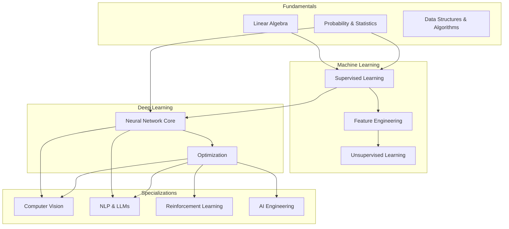
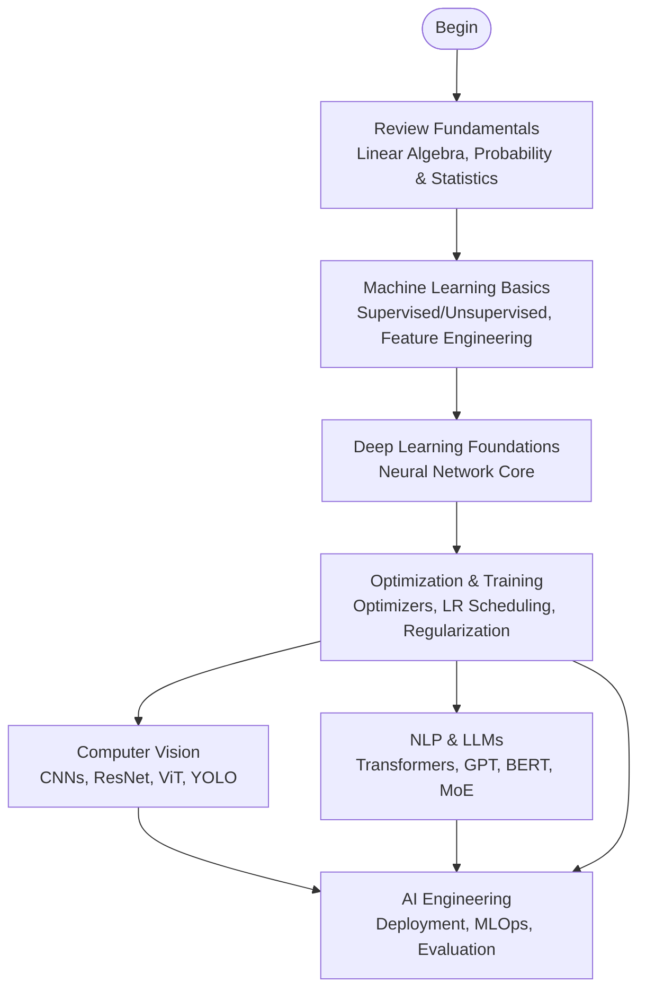
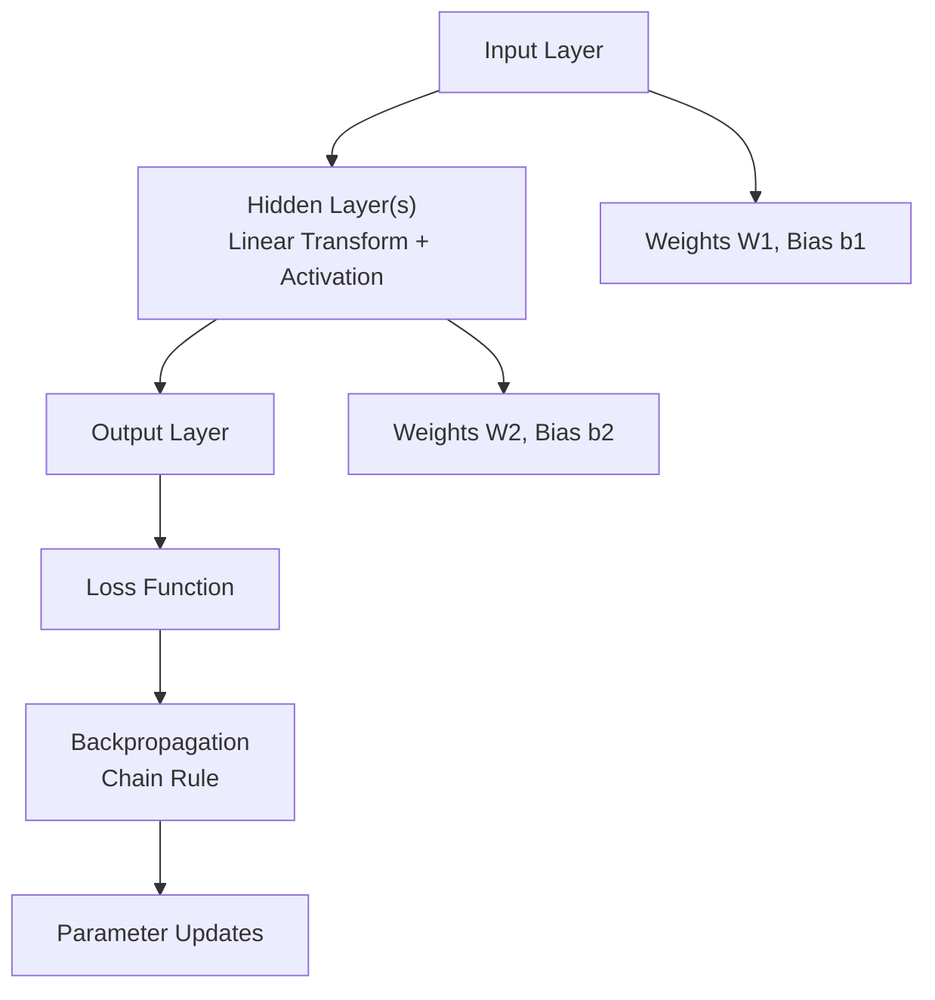
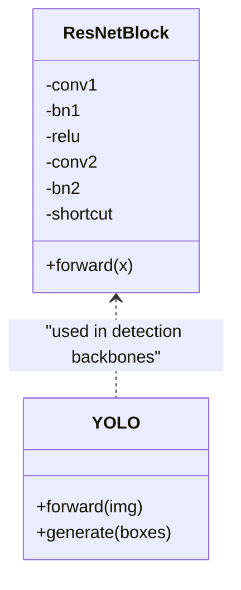
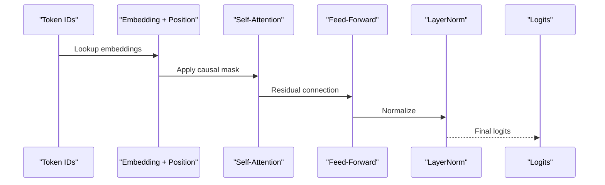
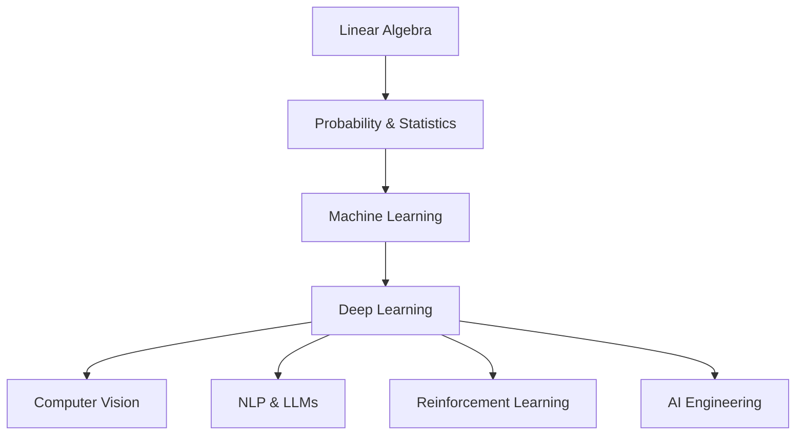

# Deep Learning Education

<cite>
**Referenced Files in This Document**
- [README.md](file://docs/03_Deep_Learning/README.md)
- [README_for_dummy.md](file://docs/03_Deep_Learning/README_for_dummy.md)
- [Neural_Network_Core.md](file://docs/03_Deep_Learning/Neural_Network_Core/Neural_Network_Core.md)
- [Optimization.md](file://docs/03_Deep_Learning/Optimization/Optimization.md)
- [LLM_Architectures.md](file://docs/04_NLP_LLMs/LLM_Architectures/LLM_Architectures.md)
- [Image_Classification_Detection.md](file://docs/05_Computer_Vision/Image_Classification_Detection/Image_Classification_Detection.md)
- [Probability_Statistics.md](file://docs/01_Fundamentals/Probability_Statistics/Probability_Statistics.md)
- [README.md](file://docs/02_Machine_Learning/README.md)
</cite>

## Table of Contents
1. [Introduction](#introduction)
2. [Project Structure](#project-structure)
3. [Core Components](#core-components)
4. [Architecture Overview](#architecture-overview)
5. [Detailed Component Analysis](#detailed-component-analysis)
6. [Dependency Analysis](#dependency-analysis)
7. [Performance Considerations](#performance-considerations)
8. [Troubleshooting Guide](#troubleshooting-guide)
9. [Conclusion](#conclusion)
10. [Appendices](#appendices)

## Introduction
This document presents a comprehensive deep learning education system designed to guide learners from foundational concepts to modern architectures. It emphasizes:
- Pedagogical clarity: simplified explanations for complex topics, bilingual terminology support, and practical implementation.
- Systematic progression: from perceptrons to convolutional networks, recurrent networks, and transformers.
- Balanced theory-practice integration: mathematical foundations linked to hands-on code examples.
- Industry-relevant optimization and training techniques: gradient descent, regularization, and advanced scheduling.

## Project Structure
The repository organizes content by domain and difficulty, enabling a structured learning journey:
- Fundamentals: Linear Algebra, Probability & Statistics, Data Structures & Algorithms.
- Classical Machine Learning: Supervised/Unsupervised Learning and Feature Engineering.
- Deep Learning Foundations: Neural Network Core and Optimization.
- Specializations: Computer Vision, Natural Language Processing and Large Language Models, Reinforcement Learning, and AI Engineering.



**Section sources**
- [README.md:1-50](file://docs/03_Deep_Learning/README.md#L1-L50)
- [README_for_dummy.md:1-142](file://docs/03_Deep_Learning/README_for_dummy.md#L1-L142)
- [README.md:1-58](file://docs/02_Machine_Learning/README.md#L1-L58)

## Core Components
This section outlines the pillars of the deep learning curriculum and how they connect to broader domains.

- Neural Network Core
  - Covers perceptrons, multilayer perceptrons, activation functions (ReLU, GELU, Swish, Mish), backpropagation, initialization strategies, normalization (BatchNorm, LayerNorm), and residual connections.
  - Includes code examples for building MLPs, training loops, and activation comparisons.
  - Links to computer vision and NLP applications.

- Optimization
  - Surveys gradient descent variants, momentum, adaptive methods (AdaGrad, RMSProp, Adam, AdamW), learning rate scheduling (step decay, exponential decay, cosine annealing, warm restarts, warmup), gradient clipping, mixed precision training, gradient accumulation, and batch normalization’s role in optimization.
  - Provides comparative visualizations and end-to-end training pipelines.

- Mathematics Foundations
  - Probability and statistics underpin uncertainty modeling, loss design, and probabilistic interpretations of common losses (cross-entropy, KL divergence).
  - Connects to machine learning fundamentals and deep learning training.

- Machine Learning Prerequisites
  - Supervised learning, unsupervised learning, and feature engineering form essential groundwork for deep learning.

**Section sources**
- [Neural_Network_Core.md:1-800](file://docs/03_Deep_Learning/Neural_Network_Core/Neural_Network_Core.md#L1-L800)
- [Optimization.md:1-800](file://docs/03_Deep_Learning/Optimization/Optimization.md#L1-L800)
- [Probability_Statistics.md:1-622](file://docs/01_Fundamentals/Probability_Statistics/Probability_Statistics.md#L1-L622)
- [README.md:1-58](file://docs/02_Machine_Learning/README.md#L1-L58)

## Architecture Overview
The learning architecture progresses from conceptual understanding to practical mastery:



[No sources needed since this diagram shows conceptual workflow, not actual code structure]

## Detailed Component Analysis

### Neural Network Core
This component introduces the building blocks of modern deep learning:
- Perceptrons and the XOR limitation motivate the need for nonlinearities and depth.
- Activation functions are compared with emphasis on GELU in transformers and ReLU in CV.
- Backpropagation is explained via chain rule, with visual computation graphs and remedies for vanishing/exploding gradients.
- Weight initialization strategies (Xavier/He) and normalization (BatchNorm/LayerNorm) stabilize training.
- Residual connections address degradation in very deep networks.
- Practical code demonstrates MLP construction, training, and visualization of activations and gradients.



**Diagram sources**
- [Neural_Network_Core.md:46-55](file://docs/03_Deep_Learning/Neural_Network_Core/Neural_Network_Core.md#L46-L55)

**Section sources**
- [Neural_Network_Core.md:56-800](file://docs/03_Deep_Learning/Neural_Network_Core/Neural_Network_Core.md#L56-L800)

### Optimization Techniques
This component covers the mechanics of training:
- Families of gradient descent (batch, stochastic, mini-batch) and trade-offs.
- Momentum and Nesterov accelerate convergence and escape poor local regions.
- Adaptive methods (AdaGrad, RMSProp, Adam, AdamW) tailor learning rates per parameter and improve robustness.
- Learning rate schedules (warmup, cosine annealing, step decay) stabilize early training and fine-tune later stages.
- Gradient clipping prevents explosions; mixed precision and gradient accumulation scale training efficiently.
- BatchNorm’s dual role in smoothing loss surfaces and regularizing training.

```mermaid
sequenceDiagram
participant Train as "Training Loop"
participant Model as "Model"
participant Loss as "Loss Function"
participant Opt as "Optimizer"
participant Sched as "LR Scheduler"
Train->>Model : Forward pass
Model-->>Train : Predictions
Train->>Loss : Compute loss
Loss-->>Train : Loss value
Train->>Model : Backward pass
Model-->>Train : Gradients
Train->>Opt : Step (update parameters)
Opt-->>Train : Updated parameters
Train->>Sched : Step (adjust LR)
Sched-->>Train : New LR
```

**Diagram sources**
- [Optimization.md:464-791](file://docs/03_Deep_Learning/Optimization/Optimization.md#L464-L791)

**Section sources**
- [Optimization.md:1-800](file://docs/03_Deep_Learning/Optimization/Optimization.md#L1-L800)

### Computer Vision: From CNNs to Transformers
This specialization builds on the neural network core and optimization:
- CNN basics: convolution, pooling, hierarchical feature extraction.
- Classic architectures: AlexNet, VGG, GoogLeNet, ResNet, DenseNet, MobileNet, EfficientNet.
- ViT: treating images as sequences and applying transformer encoder blocks.
- Object detection: two-stage (R-CNN family) versus one-stage (YOLO series), evaluation metrics (IoU, mAP).
- Practical code includes ResNet block implementation and YOLO inference/training workflows.



**Diagram sources**
- [Image_Classification_Detection.md:289-398](file://docs/05_Computer_Vision/Image_Classification_Detection/Image_Classification_Detection.md#L289-L398)

**Section sources**
- [Image_Classification_Detection.md:1-659](file://docs/05_Computer_Vision/Image_Classification_Detection/Image_Classification_Detection.md#L1-L659)

### NLP and Large Language Models: Transformers to MoE
This specialization leverages the optimization and core concepts:
- Transformer architecture: masked/self-attention, positional encodings, pre/post normalization.
- Decoder-only models (GPT-style), encoder-only (BERT-style), and encoder-decoder (T5-style).
- Advanced techniques: grouped-query attention (GQA), rotary position embeddings (RoPE), mixture-of-experts (MoE), scaling laws, and context window extensions.
- Practical code demonstrates decoder-only transformer blocks and end-to-end generation.



**Diagram sources**
- [LLM_Architectures.md:328-456](file://docs/04_NLP_LLMs/LLM_Architectures/LLM_Architectures.md#L328-L456)

**Section sources**
- [LLM_Architectures.md:1-619](file://docs/04_NLP_LLMs/LLM_Architectures/LLM_Architectures.md#L1-L619)

### Pedagogy and Bilingual Terminology
- Simplified explanations for beginners (README_for_dummy) bridge intuition and formalism.
- Bilingual glossaries and cross-references support technical vocabulary in both English and Chinese.
- Visuals, analogies, and code examples reinforce comprehension.

**Section sources**
- [README_for_dummy.md:1-142](file://docs/03_Deep_Learning/README_for_dummy.md#L1-L142)
- [README.md:35-47](file://docs/03_Deep_Learning/README.md#L35-L47)

## Dependency Analysis
Conceptual dependencies among topics:



[No sources needed since this diagram shows conceptual relationships, not specific code files]

## Performance Considerations
- Choose optimizers and schedulers aligned with task characteristics (AdamW for transformers, SGD with momentum for CV).
- Use normalization and regularization to stabilize training and reduce overfitting.
- Employ mixed precision, gradient accumulation, and gradient checkpointing for memory-constrained scenarios.
- Select appropriate batch sizes and learning rates; warmup and cosine decay improve stability.

[No sources needed since this section provides general guidance]

## Troubleshooting Guide
Common pitfalls and remedies:
- Forgetting to switch to eval mode during inference leads to incorrect behavior with dropout/batch norm.
- Excessive learning rates cause instability; use warmup and decay schedules.
- Data leakage from test set affects evaluation; fit preprocessing only on training data.
- Overfitting manifests as low training error and high validation error; apply dropout, weight decay, early stopping, and augmentation.

**Section sources**
- [Neural_Network_Core.md:761-778](file://docs/03_Deep_Learning/Neural_Network_Core/Neural_Network_Core.md#L761-L778)
- [Optimization.md:372-383](file://docs/03_Deep_Learning/Optimization/Optimization.md#L372-L383)

## Conclusion
This education system offers a coherent pathway from fundamentals to cutting-edge architectures. By combining intuitive explanations, rigorous mathematics, and practical implementation, learners can master both the theory and craft of deep learning. The bilingual terminology and progressive structure ensure accessibility and depth, preparing learners for advanced research and industry practice.

[No sources needed since this section summarizes without analyzing specific files]

## Appendices

### Learning Pathways and Connections
- From supervised learning to deep learning: supervised learning provides modeling intuition and evaluation skills.
- From probability/statistics to deep learning: probabilistic interpretation of losses and uncertainty quantification.
- From deep learning to specializations: CV and NLP build upon core concepts and optimization.

**Section sources**
- [README.md:1-58](file://docs/02_Machine_Learning/README.md#L1-L58)
- [Probability_Statistics.md:1-622](file://docs/01_Fundamentals/Probability_Statistics/Probability_Statistics.md#L1-L622)
- [README.md:22-28](file://docs/03_Deep_Learning/README.md#L22-L28)