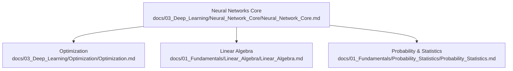
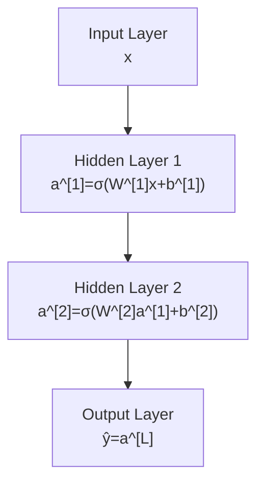
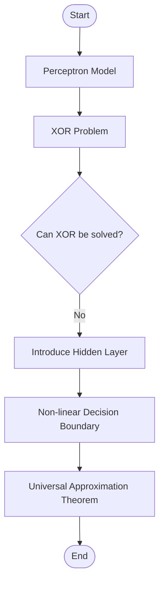
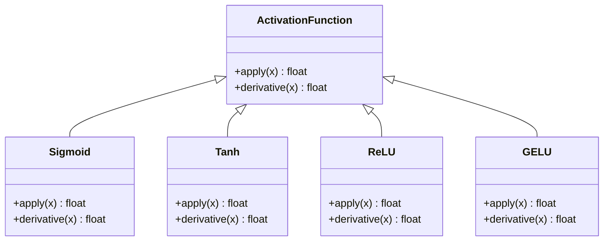
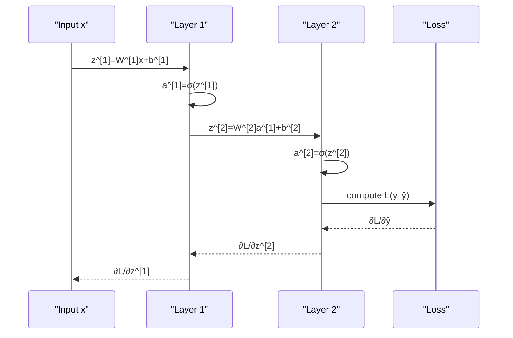
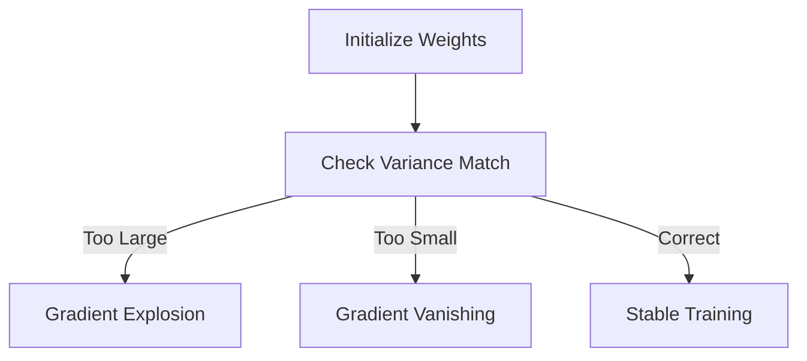
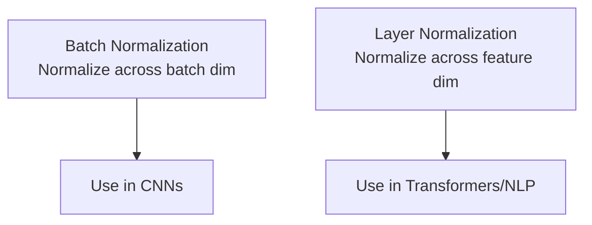
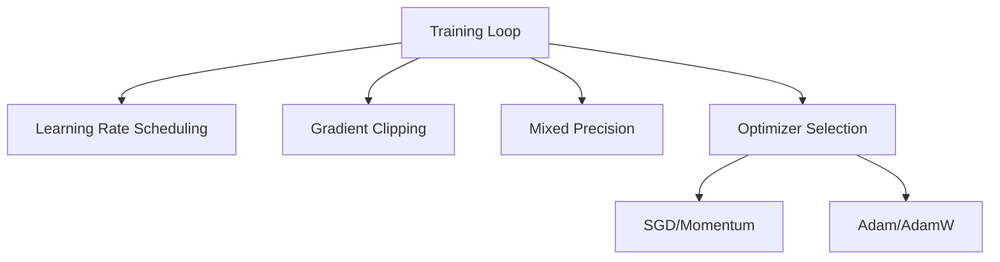
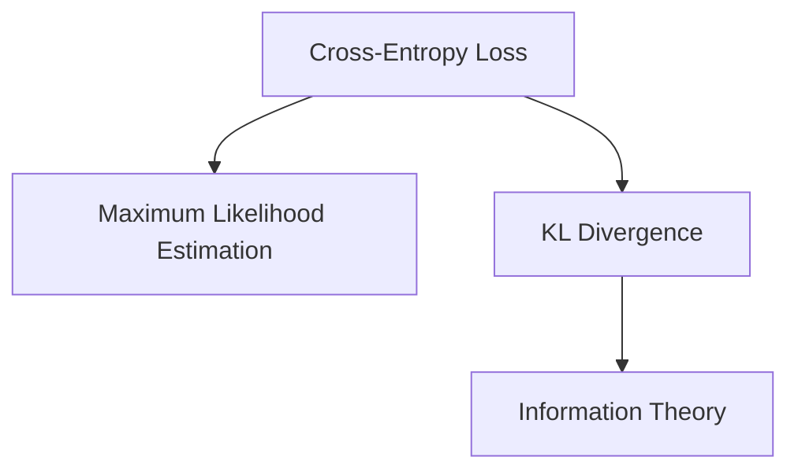
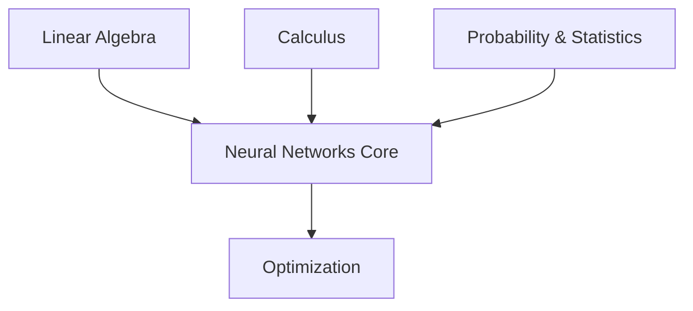

# Neural Network Core Concepts

<cite>
**Referenced Files in This Document**
- [Neural_Network_Core.md](file://docs/03_Deep_Learning/Neural_Network_Core/Neural_Network_Core.md)
- [Optimization.md](file://docs/03_Deep_Learning/Optimization/Optimization.md)
- [Probability_Statistics.md](file://docs/01_Fundamentals/Probability_Statistics/Probability_Statistics.md)
- [Linear_Algebra.md](file://docs/01_Fundamentals/Linear_Algebra/Linear_Algebra.md)
</cite>

## Table of Contents
1. [Introduction](#introduction)
2. [Project Structure](#project-structure)
3. [Core Components](#core-components)
4. [Architecture Overview](#architecture-overview)
5. [Detailed Component Analysis](#detailed-component-analysis)
6. [Dependency Analysis](#dependency-analysis)
7. [Performance Considerations](#performance-considerations)
8. [Troubleshooting Guide](#troubleshooting-guide)
9. [Conclusion](#conclusion)
10. [Appendices](#appendices)

## Introduction
This document explains the core concepts of artificial neural networks with a focus on building blocks, mathematical foundations, and practical training techniques. It covers perceptrons, activation functions, forward propagation, backpropagation, weight initialization, bias terms, gradient computation, and the progression from simple feedforward networks to multi-layer perceptrons. It also connects these ideas to optimization, probability/statistics, and linear algebra fundamentals, and provides guidance on convergence criteria and common pitfalls.

## Project Structure
The neural network core concepts are documented in a dedicated deep learning chapter that references foundational topics in linear algebra, calculus, and probability/statistics. The document integrates theory with hands-on code examples and optimization techniques.



**Diagram sources**
- [Neural_Network_Core.md:1-50](file://docs/03_Deep_Learning/Neural_Network_Core/Neural_Network_Core.md#L1-L50)
- [Optimization.md:1-20](file://docs/03_Deep_Learning/Optimization/Optimization.md#L1-L20)
- [Probability_Statistics.md:1-10](file://docs/01_Fundamentals/Probability_Statistics/Probability_Statistics.md#L1-L10)
- [Linear_Algebra.md:1-10](file://docs/01_Fundamentals/Linear_Algebra/Linear_Algebra.md#L1-L10)

**Section sources**
- [Neural_Network_Core.md:1-50](file://docs/03_Deep_Learning/Neural_Network_Core/Neural_Network_Core.md#L1-L50)
- [Optimization.md:1-20](file://docs/03_Deep_Learning/Optimization/Optimization.md#L1-L20)
- [Probability_Statistics.md:1-10](file://docs/01_Fundamentals/Probability_Statistics/Probability_Statistics.md#L1-L10)
- [Linear_Algebra.md:1-10](file://docs/01_Fundamentals/Linear_Algebra/Linear_Algebra.md#L1-L10)

## Core Components
- Perceptrons and the XOR limitation
- Multi-layer perceptrons and the universal approximation theorem
- Activation functions and their properties
- Forward propagation and backpropagation
- Weight initialization strategies
- Normalization techniques
- Optimization and learning rate scheduling
- Probability and statistics connections (cross-entropy, KL divergence)

**Section sources**
- [Neural_Network_Core.md:58-105](file://docs/03_Deep_Learning/Neural_Network_Core/Neural_Network_Core.md#L58-L105)
- [Neural_Network_Core.md:106-167](file://docs/03_Deep_Learning/Neural_Network_Core/Neural_Network_Core.md#L106-L167)
- [Neural_Network_Core.md:168-246](file://docs/03_Deep_Learning/Neural_Network_Core/Neural_Network_Core.md#L168-L246)
- [Neural_Network_Core.md:247-291](file://docs/03_Deep_Learning/Neural_Network_Core/Neural_Network_Core.md#L247-L291)
- [Neural_Network_Core.md:292-344](file://docs/03_Deep_Learning/Neural_Network_Core/Neural_Network_Core.md#L292-L344)
- [Optimization.md:61-225](file://docs/03_Deep_Learning/Optimization/Optimization.md#L61-L225)
- [Probability_Statistics.md:245-296](file://docs/01_Fundamentals/Probability_Statistics/Probability_Statistics.md#L245-L296)

## Architecture Overview
The document presents a layered feedforward architecture with linear transformations followed by activation functions, and shows how gradients flow backward through layers using the chain rule.



**Diagram sources**
- [Neural_Network_Core.md:35-49](file://docs/03_Deep_Learning/Neural_Network_Core/Neural_Network_Core.md#L35-L49)

**Section sources**
- [Neural_Network_Core.md:35-49](file://docs/03_Deep_Learning/Neural_Network_Core/Neural_Network_Core.md#L35-L49)

## Detailed Component Analysis

### Perceptrons and Multi-Layer Perceptrons
- Perceptron model and learning rule
- XOR problem demonstration and limitations
- MLP architecture and the universal approximation theorem



**Diagram sources**
- [Neural_Network_Core.md:60-105](file://docs/03_Deep_Learning/Neural_Network_Core/Neural_Network_Core.md#L60-L105)

**Section sources**
- [Neural_Network_Core.md:60-105](file://docs/03_Deep_Learning/Neural_Network_Core/Neural_Network_Core.md#L60-L105)

### Activation Functions
- Sigmoid, Tanh, ReLU, Leaky ReLU, ELU, GELU, Swish, Mish
- Properties, advantages, disadvantages, and typical use cases
- Why modern architectures prefer smooth, zero-centered, or self-gated activations



**Diagram sources**
- [Neural_Network_Core.md:110-157](file://docs/03_Deep_Learning/Neural_Network_Core/Neural_Network_Core.md#L110-L157)

**Section sources**
- [Neural_Network_Core.md:110-157](file://docs/03_Deep_Learning/Neural_Network_Core/Neural_Network_Core.md#L110-L157)

### Forward Propagation and Backpropagation
- Mathematical formulation of forward pass and loss
- Chain rule derivation for gradients
- Generalized delta rule and gradient computation per layer
- Visualization of forward and backward computation graphs



**Diagram sources**
- [Neural_Network_Core.md:177-218](file://docs/03_Deep_Learning/Neural_Network_Core/Neural_Network_Core.md#L177-L218)

**Section sources**
- [Neural_Network_Core.md:177-218](file://docs/03_Deep_Learning/Neural_Network_Core/Neural_Network_Core.md#L177-L218)

### Weight Initialization and Bias Terms
- Zero initialization pitfalls
- Xavier/Glorot and He/Kaiming initialization strategies
- Why initialization affects gradient flow and training stability



**Diagram sources**
- [Neural_Network_Core.md:247-291](file://docs/03_Deep_Learning/Neural_Network_Core/Neural_Network_Core.md#L247-L291)

**Section sources**
- [Neural_Network_Core.md:247-291](file://docs/03_Deep_Learning/Neural_Network_Core/Neural_Network_Core.md#L247-L291)

### Normalization Techniques
- Batch normalization and layer normalization
- Differences in normalization dimensionality and behavior
- Practical guidance for choosing normalization and when to apply it



**Diagram sources**
- [Neural_Network_Core.md:292-344](file://docs/03_Deep_Learning/Neural_Network_Core/Neural_Network_Core.md#L292-L344)

**Section sources**
- [Neural_Network_Core.md:292-344](file://docs/03_Deep_Learning/Neural_Network_Core/Neural_Network_Core.md#L292-L344)

### Optimization and Learning Rate Scheduling
- Optimization challenges in high-dimensional non-convex spaces
- Families of gradient descent variants
- Momentum, Adam, AdamW, warmup, cosine annealing
- Gradient clipping and mixed precision training



**Diagram sources**
- [Optimization.md:61-225](file://docs/03_Deep_Learning/Optimization/Optimization.md#L61-L225)

**Section sources**
- [Optimization.md:61-225](file://docs/03_Deep_Learning/Optimization/Optimization.md#L61-L225)

### Probability and Statistics Connections
- Cross-entropy loss and its relation to maximum likelihood estimation
- KL divergence and information theory foundations
- Practical implications for classification tasks



**Diagram sources**
- [Probability_Statistics.md:245-296](file://docs/01_Fundamentals/Probability_Statistics/Probability_Statistics.md#L245-L296)

**Section sources**
- [Probability_Statistics.md:245-296](file://docs/01_Fundamentals/Probability_Statistics/Probability_Statistics.md#L245-L296)

## Dependency Analysis
The neural network core concepts depend on linear algebra for matrix operations, calculus for derivatives and optimization, and probability/statistics for loss functions and inference.



**Diagram sources**
- [Neural_Network_Core.md:781-790](file://docs/03_Deep_Learning/Neural_Network_Core/Neural_Network_Core.md#L781-L790)
- [Optimization.md:787-788](file://docs/03_Deep_Learning/Optimization/Optimization.md#L787-L788)
- [Probability_Statistics.md:783-784](file://docs/01_Fundamentals/Probability_Statistics/Probability_Statistics.md#L783-L784)
- [Linear_Algebra.md:782-783](file://docs/01_Fundamentals/Linear_Algebra/Linear_Algebra.md#L782-L783)

**Section sources**
- [Neural_Network_Core.md:781-790](file://docs/03_Deep_Learning/Neural_Network_Core/Neural_Network_Core.md#L781-L790)
- [Optimization.md:787-788](file://docs/03_Deep_Learning/Optimization/Optimization.md#L787-L788)
- [Probability_Statistics.md:783-784](file://docs/01_Fundamentals/Probability_Statistics/Probability_Statistics.md#L783-L784)
- [Linear_Algebra.md:782-783](file://docs/01_Fundamentals/Linear_Algebra/Linear_Algebra.md#L782-L783)

## Performance Considerations
- Choose activation functions that mitigate vanishing gradients (e.g., ReLU variants)
- Use appropriate initialization to stabilize early training
- Apply normalization to accelerate convergence and reduce sensitivity to initialization
- Employ robust optimizers (Adam/AdamW) with warmup and cosine annealing schedules
- Use gradient clipping and mixed precision to handle exploding gradients and improve throughput

[No sources needed since this section provides general guidance]

## Troubleshooting Guide
Common issues and remedies:
- Forgetting to switch to evaluation mode during inference (BatchNorm/LayerNorm behavior differs)
- Poor learning rate selection causing oscillations or divergence
- Data leakage from global statistics computed on the full dataset
- Overfitting symptoms: low training error, high validation error; address with dropout, L2 regularization, early stopping, and data augmentation

**Section sources**
- [Neural_Network_Core.md:761-778](file://docs/03_Deep_Learning/Neural_Network_Core/Neural_Network_Core.md#L761-L778)

## Conclusion
Neural networks rely on a small set of powerful ideas: linear transformations plus nonlinear activation functions, iterative gradient-based optimization, and careful initialization and normalization. The universal approximation theorem underpins the expressive power of MLPs, while modern activation functions, normalization, and optimization strategies enable stable and efficient training at scale.

[No sources needed since this section summarizes without analyzing specific files]

## Appendices

### Practical Example: Network Construction and Training
- Build a simple MLP with configurable hidden layers and activation
- Initialize weights with He/Kaiming for ReLU-like activations
- Train with AdamW, cosine annealing, and gradient clipping
- Evaluate on validation data and track metrics

```mermaid
sequenceDiagram
participant Data as "Data Loader"
participant Net as "MLP"
participant Loss as "Cross-Entropy"
participant Opt as "AdamW Optimizer"
participant Sched as "Cosine Annealing Scheduler"
Data->>Net : forward(x)
Net->>Loss : compute L(y, ŷ)
Loss-->>Net : backward()
Net->>Opt : step()
Opt->>Sched : step()
```

**Diagram sources**
- [Neural_Network_Core.md:409-602](file://docs/03_Deep_Learning/Neural_Network_Core/Neural_Network_Core.md#L409-L602)

**Section sources**
- [Neural_Network_Core.md:409-602](file://docs/03_Deep_Learning/Neural_Network_Core/Neural_Network_Core.md#L409-L602)

### Convergence Criteria
- Monitor training and validation loss curves
- Track accuracy/metrics on held-out validation set
- Use early stopping when validation loss plateaus
- Consider plateau detection with learning rate reduction on plateau

**Section sources**
- [Optimization.md:228-327](file://docs/03_Deep_Learning/Optimization/Optimization.md#L228-L327)