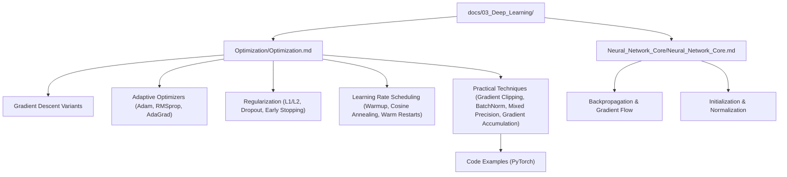
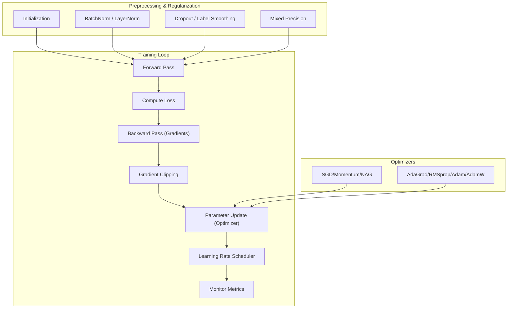
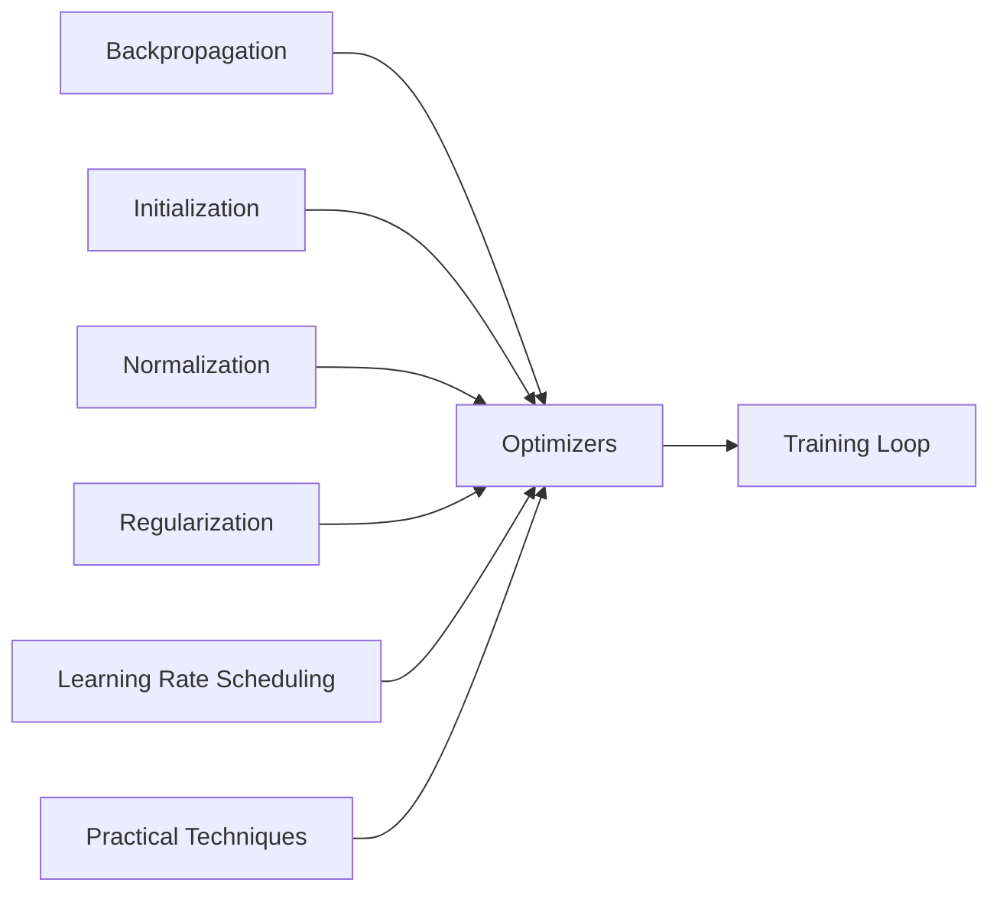

# Optimization Techniques

<cite>
**Referenced Files in This Document**
- [Optimization.md](file://docs/03_Deep_Learning/Optimization/Optimization.md)
- [Neural_Network_Core.md](file://docs/03_Deep_Learning/Neural_Network_Core/Neural_Network_Core.md)
</cite>

## Table of Contents
1. [Introduction](#introduction)
2. [Project Structure](#project-structure)
3. [Core Components](#core-components)
4. [Architecture Overview](#architecture-overview)
5. [Detailed Component Analysis](#detailed-component-analysis)
6. [Dependency Analysis](#dependency-analysis)
7. [Performance Considerations](#performance-considerations)
8. [Troubleshooting Guide](#troubleshooting-guide)
9. [Conclusion](#conclusion)
10. [Appendices](#appendices)

## Introduction
This document synthesizes the repository’s deep learning optimization content into a comprehensive guide. It explains gradient descent variants, adaptive optimization algorithms, regularization and scheduling strategies, and practical implementation patterns. It also addresses common optimization challenges such as vanishing/exploding gradients, saddle points, and local minima, and provides guidance on convergence monitoring and hyperparameter tuning.

## Project Structure
The optimization content is primarily located under the Deep Learning section, with a dedicated “Optimization” module that complements foundational neural network theory.



**Diagram sources**
- [Optimization.md:1-1049](file://docs/03_Deep_Learning/Optimization/Optimization.md#L1-L1049)
- [Neural_Network_Core.md:1-969](file://docs/03_Deep_Learning/Neural_Network_Core/Neural_Network_Core.md#L1-L969)

**Section sources**
- [Optimization.md:1-1049](file://docs/03_Deep_Learning/Optimization/Optimization.md#L1-L1049)
- [Neural_Network_Core.md:1-969](file://docs/03_Deep_Learning/Neural_Network_Core/Neural_Network_Core.md#L1-L969)

## Core Components
- Gradient descent families: batch, stochastic, and mini-batch
- Momentum-based methods: SGD with Momentum and Nesterov Accelerated Gradient
- Adaptive learning rate methods: AdaGrad, RMSProp, Adam, AdamW
- Regularization: L1/L2, Dropout, Label Smoothing, Early Stopping
- Learning rate scheduling: Step decay, exponential decay, cosine annealing, warm restarts, warmup
- Practical training techniques: gradient clipping, batch normalization, mixed precision, gradient accumulation
- Implementation patterns and code examples in PyTorch

**Section sources**
- [Optimization.md:65-225](file://docs/03_Deep_Learning/Optimization/Optimization.md#L65-L225)
- [Optimization.md:228-463](file://docs/03_Deep_Learning/Optimization/Optimization.md#L228-L463)
- [Optimization.md:464-791](file://docs/03_Deep_Learning/Optimization/Optimization.md#L464-L791)
- [Neural_Network_Core.md:168-246](file://docs/03_Deep_Learning/Neural_Network_Core/Neural_Network_Core.md#L168-L246)

## Architecture Overview
The optimization pipeline integrates gradient computation, parameter updates, and training controls. It connects to initialization, normalization, and regularization to stabilize and accelerate convergence.



**Diagram sources**
- [Optimization.md:228-463](file://docs/03_Deep_Learning/Optimization/Optimization.md#L228-L463)
- [Optimization.md:464-791](file://docs/03_Deep_Learning/Optimization/Optimization.md#L464-L791)
- [Neural_Network_Core.md:247-344](file://docs/03_Deep_Learning/Neural_Network_Core/Neural_Network_Core.md#L247-L344)

## Detailed Component Analysis

### Gradient Descent Variants
- Batch Gradient Descent (BGD): Uses the full dataset per update; stable but computationally expensive and unsuitable for big data.
- Stochastic Gradient Descent (SGD): Updates using a single sample; fast and helps escape small local minima but noisy.
- Mini-batch Gradient Descent: Balances efficiency and stability; standard in industry with typical sizes 32–256.

Trade-offs:
- Speed vs. stability: SGD is fastest but noisy; BGD is stable but slow; mini-batch offers a practical middle ground.
- Hardware utilization: Mini-batch benefits from GPU/TPU parallelism.

**Section sources**
- [Optimization.md:65-95](file://docs/03_Deep_Learning/Optimization/Optimization.md#L65-L95)

### Momentum-Based Methods
- SGD with Momentum: Accumulates past gradients to smooth updates and accelerate movement in consistent directions.
- Nesterov Accelerated Gradient (NAG): Computes gradient at a future position estimate, reducing overshoot.

Effects:
- Reduced oscillations
- Faster convergence along persistent directions
- Improved escape from small local minima

**Section sources**
- [Optimization.md:106-145](file://docs/03_Deep_Learning/Optimization/Optimization.md#L106-L145)

### Adaptive Learning Rate Algorithms
- AdaGrad: Adapts per-parameter learning rates by accumulating squared gradients; good for sparse data but learning rate decays monotonically.
- RMSProp: Uses exponentially weighted moving average of squared gradients to mitigate AdaGrad’s decay.
- Adam: Combines momentum (first moment) and RMSProp (second moment) with bias correction; robust default choice.
- AdamW: Decouples weight decay from gradient, improving generalization compared to Adam.

Implementation highlights:
- Default hyperparameters and bias correction rationale
- Practical differences between Adam and AdamW

**Section sources**
- [Optimization.md:148-209](file://docs/03_Deep_Learning/Optimization/Optimization.md#L148-L209)

### Regularization Techniques
- L1 and L2 regularization: Penalize weights to prevent overfitting; L2 often preferred for smoothness.
- Dropout: Randomly deactivates neurons during training to reduce co-adaptation.
- Label Smoothing: Encourages well-calibrated probabilities and improves generalization.
- Early Stopping: Monitors validation metrics and halts training when performance plateaus.

Integration points:
- Mixed precision and gradient accumulation can complement regularization for large-scale training.

**Section sources**
- [Optimization.md:228-463](file://docs/03_Deep_Learning/Optimization/Optimization.md#L228-L463)
- [Neural_Network_Core.md:750-778](file://docs/03_Deep_Learning/Neural_Network_Core/Neural_Network_Core.md#L750-L778)

### Learning Rate Scheduling and Dynamic Strategies
- Step decay: Multiplicative decay at fixed intervals.
- Exponential decay: Continuous decay.
- Cosine annealing: Smooth decay to a minimum learning rate.
- Warm restarts (SGDR): Periodic restarts to escape poor local minima.
- Warmup: Linear increase at training start to stabilize early updates.

Practical guidance:
- Warmup is essential for Adam-based optimizers and large batch training.
- Combine warmup with cosine annealing for strong empirical performance.

**Section sources**
- [Optimization.md:228-295](file://docs/03_Deep_Learning/Optimization/Optimization.md#L228-L295)
- [Optimization.md:297-327](file://docs/03_Deep_Learning/Optimization/Optimization.md#L297-L327)

### Practical Implementation Patterns
- Gradient clipping: Norm-based clipping to prevent exploding gradients.
- Batch normalization: Stabilizes activations and allows higher learning rates.
- Mixed precision training: FP16 forward pass with FP32 master weights and dynamic loss scaling.
- Gradient accumulation: Simulate larger batches without memory overhead.

Code examples demonstrate:
- Optimizer comparisons on a benchmark function
- Learning rate scheduler behavior
- Gradient clipping effects
- Full training pipeline integrating all techniques

**Section sources**
- [Optimization.md:297-463](file://docs/03_Deep_Learning/Optimization/Optimization.md#L297-L463)
- [Optimization.md:464-791](file://docs/03_Deep_Learning/Optimization/Optimization.md#L464-L791)

### Optimization Challenges and Mitigations
- Vanishing/exploding gradients: Addressed by ReLU, residual connections, batch normalization, proper initialization, gradient clipping, and gradient accumulation.
- Saddle points and local minima: Momentum and NAG help navigate; warmup and adaptive optimizers improve escape behavior.
- Numerical instability: Mixed precision with dynamic loss scaling; gradient clipping; careful initialization.

**Section sources**
- [Neural_Network_Core.md:220-246](file://docs/03_Deep_Learning/Neural_Network_Core/Neural_Network_Core.md#L220-L246)
- [Optimization.md:329-355](file://docs/03_Deep_Learning/Optimization/Optimization.md#L329-L355)
- [Optimization.md:385-427](file://docs/03_Deep_Learning/Optimization/Optimization.md#L385-L427)

### Code-Level Architecture (PyTorch)
```mermaid
sequenceDiagram
participant Train as "Training Loop"
participant Model as "Model"
participant Opt as "Optimizer"
participant Sch as "Scheduler"
participant AMP as "Autocast/GradScaler"
Train->>Model : Forward pass
Model-->>Train : Predictions
Train->>Train : Compute loss
Train->>Model : Backward pass
Model-->>Train : Gradients
Train->>Train : Clip gradients (optional)
Train->>Opt : Step (param update)
Train->>Sch : Step (LR update)
Note over Train,AMP : Mixed precision path (autocast + scaler)
```

**Diagram sources**
- [Optimization.md:654-791](file://docs/03_Deep_Learning/Optimization/Optimization.md#L654-L791)

## Dependency Analysis
- Optimization depends on backpropagation and gradient computation.
- Regularization and normalization influence gradient dynamics and convergence stability.
- Scheduling interacts with optimizer internals (e.g., warmup affects Adam’s initial moments).
- Practical techniques (gradient clipping, mixed precision) depend on framework APIs.



**Diagram sources**
- [Neural_Network_Core.md:168-246](file://docs/03_Deep_Learning/Neural_Network_Core/Neural_Network_Core.md#L168-L246)
- [Optimization.md:228-463](file://docs/03_Deep_Learning/Optimization/Optimization.md#L228-L463)

**Section sources**
- [Neural_Network_Core.md:168-246](file://docs/03_Deep_Learning/Neural_Network_Core/Neural_Network_Core.md#L168-L246)
- [Optimization.md:228-463](file://docs/03_Deep_Learning/Optimization/Optimization.md#L228-L463)

## Performance Considerations
- Choose mini-batch size based on hardware and dataset scale; balance speed and generalization.
- Prefer AdamW for transformer-like architectures; use SGD with momentum for strong generalization goals.
- Apply warmup and cosine annealing for stable and efficient convergence.
- Use gradient clipping and normalization to stabilize training.
- Employ mixed precision and gradient accumulation to scale up batch size efficiently.

[No sources needed since this section provides general guidance]

## Troubleshooting Guide
Common pitfalls and remedies:
- Skipping warmup leads to divergence in Adam-based training; add warmup schedules.
- Conflicting regularization effects when combining BatchNorm and Dropout; prefer BatchNorm or use Dropout cautiously.
- NaN losses due to large learning rates; apply gradient clipping and monitor gradient norms.
- Noisy validation curves with small batches; increase batch size or switch to LayerNorm.

**Section sources**
- [Optimization.md:866-883](file://docs/03_Deep_Learning/Optimization/Optimization.md#L866-L883)
- [Optimization.md:967-995](file://docs/03_Deep_Learning/Optimization/Optimization.md#L967-L995)
- [Neural_Network_Core.md:864-876](file://docs/03_Deep_Learning/Neural_Network_Core/Neural_Network_Core.md#L864-L876)

## Conclusion
Effective deep learning optimization combines principled gradient descent variants, adaptive optimizers, and robust training practices. By integrating scheduling, regularization, and practical techniques—supported by code examples—the repository provides a practical blueprint for stable, fast, and generalizable training across diverse tasks.

[No sources needed since this section summarizes without analyzing specific files]

## Appendices
- Scenario-specific configurations:
  - Computer Vision: SGD with momentum and schedule for strong generalization.
  - NLP: AdamW with warmup and cosine annealing for transformers.
  - Reinforcement Learning: Adam with gradient clipping and entropy regularization.
  - GANs: Adam with careful hyperparameters and gradient penalties.

**Section sources**
- [Optimization.md:795-838](file://docs/03_Deep_Learning/Optimization/Optimization.md#L795-L838)