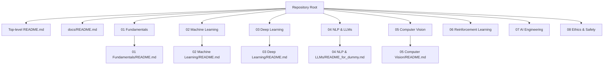
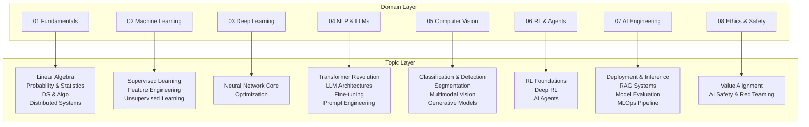
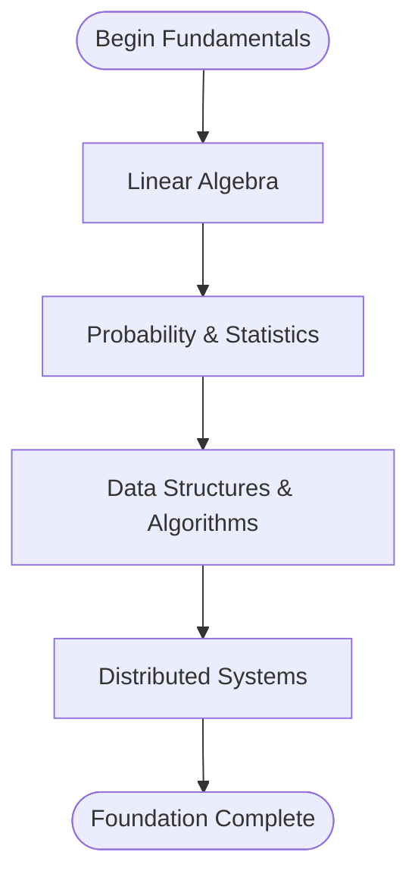
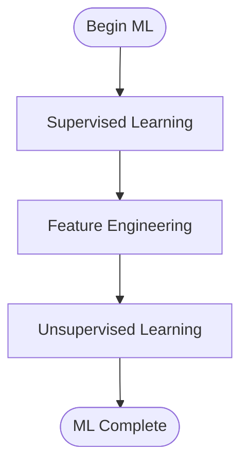
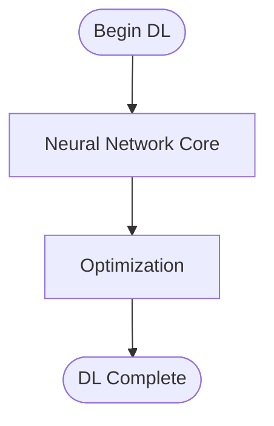
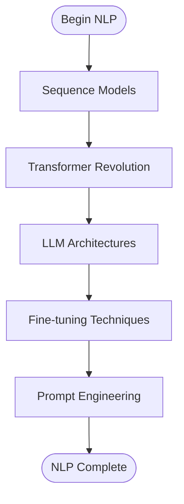
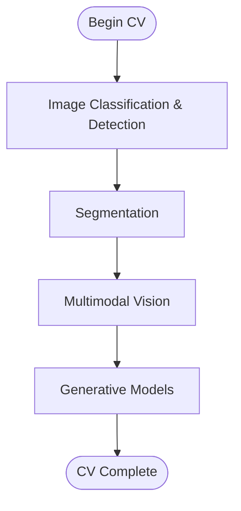
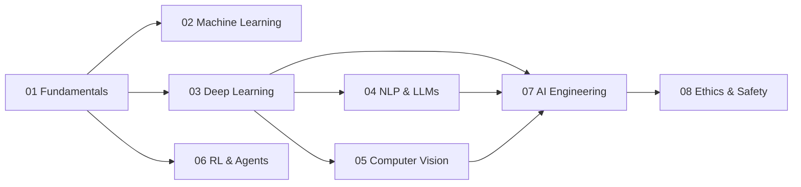

# Educational Content Management

<cite>
**Referenced Files in This Document**
- [README.md](file://README.md)
- [docs/README.md](file://docs/README.md)
- [docs/01_Fundamentals/README.md](file://docs/01_Fundamentals/README.md)
- [docs/02_Machine_Learning/README.md](file://docs/02_Machine_Learning/README.md)
- [docs/03_Deep_Learning/README.md](file://docs/03_Deep_Learning/README.md)
- [docs/03_Deep_Learning/Neural_Network_Core/Neural_Network_Core.md](file://docs/03_Deep_Learning/Neural_Network_Core/Neural_Network_Core.md)
- [docs/04_NLP_LLMs/LLM_Architectures/LLM_Architectures.md](file://docs/04_NLP_LLMs/LLM_Architectures/LLM_Architectures.md)
- [docs/04_NLP_LLMs/README_for_dummy.md](file://docs/04_NLP_LLMs/README_for_dummy.md)
- [docs/05_Computer_Vision/README.md](file://docs/05_Computer_Vision/README.md)
- [docs/05_Computer_Vision/Image_Classification_Detection/Image_Classification_Detection.md](file://docs/05_Computer_Vision/Image_Classification_Detection/Image_Classification_Detection.md)
- [docs/02_Machine_Learning/Supervised_Learning/Supervised_Learning_for_dummy.md](file://docs/02_Machine_Learning/Supervised_Learning/Supervised_Learning_for_dummy.md)
- [docs/03_Deep_Learning/README_for_dummy.md](file://docs/03_Deep_Learning/README_for_dummy.md)
</cite>

## Table of Contents
1. [Introduction](#introduction)
2. [Project Structure](#project-structure)
3. [Core Components](#core-components)
4. [Architecture Overview](#architecture-overview)
5. [Detailed Component Analysis](#detailed-component-analysis)
6. [Dependency Analysis](#dependency-analysis)
7. [Performance Considerations](#performance-considerations)
8. [Troubleshooting Guide](#troubleshooting-guide)
9. [Conclusion](#conclusion)
10. [Appendices](#appendices)

## Introduction
This document describes the educational content management system that organizes structured learning paths across eight major AI domains. It explains how content is hierarchically arranged from fundamentals to advanced topics, how bilingual terminology is integrated, and how academic rigor is maintained via peer-reviewed sources and industry practices. The documentation also covers the learning progression mapping, prerequisite knowledge, content curation process, and the systematic organization of knowledge. Finally, it highlights the integration between theoretical foundations and practical applications across AI domains.

## Project Structure
The repository is organized around a taxonomy of eight AI domains, each with curated topic pages and optional beginner-friendly “for dummy” variants. The top-level index and domain-level readmes define learning paths, prerequisites, and cross-references. Within each domain, topic-specific documents explain core concepts, algorithms, and practical implementations.

**Diagram sources**
- [README.md:1-73](file://README.md#L1-L73)
- [docs/README.md:1-90](file://docs/README.md#L1-L90)

**Section sources**
- [README.md:16-73](file://README.md#L16-L73)
- [docs/README.md:5-89](file://docs/README.md#L5-L89)

## Core Components
- Eight-domain taxonomy: Fundamentals, Classical Machine Learning, Deep Learning Foundations, NLP & LLMs, Computer Vision, Reinforcement Learning, AI Engineering, Ethics & Safety.
- Hierarchical learning paths per domain with prerequisites and cross-links.
- Bilingual terminology integration: each topic includes English and Chinese labels for core terms.
- Academic rigor: references to peer-reviewed papers and authoritative industry sources.
- Practical integration: each domain balances theory with hands-on code examples and real-world applications.

**Section sources**
- [docs/01_Fundamentals/README.md:1-59](file://docs/01_Fundamentals/README.md#L1-L59)
- [docs/02_Machine_Learning/README.md:1-58](file://docs/02_Machine_Learning/README.md#L1-L58)
- [docs/03_Deep_Learning/README.md:1-50](file://docs/03_Deep_Learning/README.md#L1-L50)
- [docs/04_NLP_LLMs/README_for_dummy.md:1-279](file://docs/04_NLP_LLMs/README_for_dummy.md#L1-L279)
- [docs/05_Computer_Vision/README.md:1-63](file://docs/05_Computer_Vision/README.md#L1-L63)

## Architecture Overview
The system’s architecture centers on a taxonomy-driven content model with layered documentation:
- Domain-level readmes define learning paths and prerequisites.
- Topic-level documents explain concepts, algorithms, and practical implementations.
- Cross-references connect related topics and domains.
- Beginner-friendly “for dummy” readmes provide simplified entry points.

**Diagram sources**
- [docs/README.md:9-87](file://docs/README.md#L9-L87)
- [docs/01_Fundamentals/README.md:5-36](file://docs/01_Fundamentals/README.md#L5-L36)
- [docs/02_Machine_Learning/README.md:5-35](file://docs/02_Machine_Learning/README.md#L5-L35)
- [docs/03_Deep_Learning/README.md:5-27](file://docs/03_Deep_Learning/README.md#L5-L27)
- [docs/04_NLP_LLMs/README_for_dummy.md:17-36](file://docs/04_NLP_LLMs/README_for_dummy.md#L17-L36)
- [docs/05_Computer_Vision/README.md:5-29](file://docs/05_Computer_Vision/README.md#L5-L29)

## Detailed Component Analysis

### Fundamentals (01)
- Learning path: Linear algebra → Probability & statistics → Data structures & algorithms → Distributed systems.
- Prerequisites: High-school math and basic Python/NumPy.
- Bilingual terminology: Core terms include tensor, eigenvalue decomposition, singular value decomposition, Bayes’ theorem, entropy, KL divergence, computation graph, All-Reduce, data parallelism, ZeRO optimization.
- Academic rigor: References to authoritative sources such as the Deep Learning Book and Mathematics for Machine Learning.

**Diagram sources**
- [docs/01_Fundamentals/README.md:5-26](file://docs/01_Fundamentals/README.md#L5-L26)

**Section sources**
- [docs/01_Fundamentals/README.md:38-56](file://docs/01_Fundamentals/README.md#L38-L56)
- [docs/README.md:12-14](file://docs/README.md#L12-L14)

### Machine Learning (02)
- Learning path: Supervised learning → Feature engineering → Unsupervised learning.
- Prerequisites: Linear algebra and probability/statistics.
- Bilingual terminology: Overfitting, regularization, cross-validation, ensemble learning, gradient boosting, PCA, t-SNE, K-Means, DBSCAN.
- Academic rigor: References to Scikit-learn documentation and Pattern Recognition and Machine Learning by Bishop.

**Diagram sources**
- [docs/02_Machine_Learning/README.md:5-26](file://docs/02_Machine_Learning/README.md#L5-L26)

**Section sources**
- [docs/02_Machine_Learning/README.md:37-54](file://docs/02_Machine_Learning/README.md#L37-L54)
- [docs/README.md:20-22](file://docs/README.md#L20-L22)

### Deep Learning Foundations (03)
- Learning path: Neural network core → Optimization.
- Prerequisites: Linear algebra and probability/statistics.
- Bilingual terminology: Backpropagation, activation functions, vanishing/exploding gradients, BatchNorm, LayerNorm, optimizers, learning rate scheduling, dropout, weight decay, residual connections.
- Academic rigor: References to PyTorch tutorials and CS231n.

**Diagram sources**
- [docs/03_Deep_Learning/README.md:5-19](file://docs/03_Deep_Learning/README.md#L5-L19)

**Section sources**
- [docs/03_Deep_Learning/README.md:29-46](file://docs/03_Deep_Learning/README.md#L29-L46)
- [docs/README.md:28-30](file://docs/README.md#L28-L30)

### NLP & LLMs (04)
- Learning path: Sequence models → Transformer revolution → LLM architectures → Fine-tuning → Prompt engineering.
- Prerequisites: Deep learning core and Transformer basics.
- Bilingual terminology: Token, attention, pre-training, fine-tuning, LoRA, QLoRA, RLHF, DPO, prompting, few-shot, chain-of-thought.
- Academic rigor: References to seminal papers (e.g., Attention Is All You Need), course materials, and open-source model repositories.

**Diagram sources**
- [docs/04_NLP_LLMs/README_for_dummy.md:17-36](file://docs/04_NLP_LLMs/README_for_dummy.md#L17-L36)

**Section sources**
- [docs/04_NLP_LLMs/LLM_Architectures/LLM_Architectures.md:11-21](file://docs/04_NLP_LLMs/LLM_Architectures/LLM_Architectures.md#L11-L21)
- [docs/README.md:37-39](file://docs/README.md#L37-L39)

### Computer Vision (05)
- Learning path: Image classification & detection → Segmentation → Multimodal vision → Generative models.
- Prerequisites: Deep learning core and optimization; recommended: Transformers.
- Bilingual terminology: CNN, ResNet, ViT, object detection (YOLO), segmentation (U-Net/Mask R-CNN), CLIP, GAN, diffusion models, latent diffusion.
- Academic rigor: References to arXiv papers, official model repos, and datasets.

**Diagram sources**
- [docs/05_Computer_Vision/README.md:5-29](file://docs/05_Computer_Vision/README.md#L5-L29)

**Section sources**
- [docs/05_Computer_Vision/Image_Classification_Detection/Image_Classification_Detection.md:13-35](file://docs/05_Computer_Vision/Image_Classification_Detection/Image_Classification_Detection.md#L13-L35)
- [docs/README.md:45-47](file://docs/README.md#L45-L47)

### Reinforcement Learning & Agents (06)
- Learning path: RL foundations → Deep RL → AI agents.
- Prerequisites: Calculus, probability/statistics, and deep learning.
- Bilingual terminology: MDP, Bellman equation, Q-learning, policy gradient, DQN, PPO, SAC, tool calling, memory, multi-agent systems.
- Academic rigor: References to Sutton & Barto’s RL book and OpenAI Spinning Up.

**Section sources**
- [docs/README.md:53-55](file://docs/README.md#L53-L55)

### AI Engineering & MLOps (07)
- Learning path: Deployment & inference → RAG systems → Model evaluation → MLOps pipeline.
- Prerequisites: Deep learning and domain-specific skills.
- Bilingual terminology: ONNX, TensorRT, serving (vLLM/TGI), quantization (INT8/FP8/AWQ/GGUF), vector databases (Milvus/Pinecone/FAISS), retrieval-augmented generation.
- Academic rigor: References to vLLM, Pinecone learning center, and industry best practices.

**Section sources**
- [docs/README.md:61-63](file://docs/README.md#L61-L63)

### Ethics, Safety & Alignment (08)
- Learning path: Value alignment → AI safety & red teaming.
- Bilingual terminology: RLHF, DPO, preference optimization, red teaming, prompt injection defense.
- Academic rigor: References to Anthropic’s AI safety views and IEEE ethics guidelines.

**Section sources**
- [docs/README.md:69-71](file://docs/README.md#L69-L71)

### Beginner-Friendly Entry Points
- “For dummy” readmes provide simplified learning maps and glossaries:
  - Deep Learning Foundations: [docs/03_Deep_Learning/README_for_dummy.md](file://docs/03_Deep_Learning/README_for_dummy.md)
  - NLP & LLMs: [docs/04_NLP_LLMs/README_for_dummy.md](file://docs/04_NLP_LLMs/README_for_dummy.md)
  - Machine Learning: [docs/02_Machine_Learning/Supervised_Learning/Supervised_Learning_for_dummy.md](file://docs/02_Machine_Learning/Supervised_Learning/Supervised_Learning_for_dummy.md)

**Section sources**
- [docs/03_Deep_Learning/README_for_dummy.md:13-27](file://docs/03_Deep_Learning/README_for_dummy.md#L13-L27)
- [docs/04_NLP_LLMs/README_for_dummy.md:17-36](file://docs/04_NLP_LLMs/README_for_dummy.md#L17-L36)
- [docs/02_Machine_Learning/Supervised_Learning/Supervised_Learning_for_dummy.md:1-201](file://docs/02_Machine_Learning/Supervised_Learning/Supervised_Learning_for_dummy.md#L1-L201)

## Dependency Analysis
The system enforces a strict prerequisite model:
- Fundamentals underpin all subsequent domains.
- Deep Learning Foundations is a prerequisite for NLP, Computer Vision, and AI Engineering.
- NLP and Computer Vision share foundational DL concepts and benefit from shared terminology.
- AI Engineering integrates concepts from multiple domains.

**Diagram sources**
- [docs/01_Fundamentals/README.md:38-42](file://docs/01_Fundamentals/README.md#L38-L42)
- [docs/02_Machine_Learning/README.md:37-41](file://docs/02_Machine_Learning/README.md#L37-L41)
- [docs/03_Deep_Learning/README.md:29-33](file://docs/03_Deep_Learning/README.md#L29-L33)
- [docs/05_Computer_Vision/README.md:41-46](file://docs/05_Computer_Vision/README.md#L41-L46)

**Section sources**
- [docs/01_Fundamentals/README.md:38-56](file://docs/01_Fundamentals/README.md#L38-L56)
- [docs/02_Machine_Learning/README.md:37-54](file://docs/02_Machine_Learning/README.md#L37-L54)
- [docs/03_Deep_Learning/README.md:29-46](file://docs/03_Deep_Learning/README.md#L29-L46)
- [docs/05_Computer_Vision/README.md:41-59](file://docs/05_Computer_Vision/README.md#L41-L59)

## Performance Considerations
- Practical implementations emphasize efficient training and inference:
  - Regularization and optimization techniques reduce overfitting and accelerate convergence.
  - Distributed training primitives (All-Reduce) and parallel strategies (data/model/pipeline) scale model sizes.
  - Quantization and pruning enable deployment on constrained hardware.
  - Attention variants (e.g., grouped-query attention) balance memory and accuracy.
- These practices reflect real-world engineering trade-offs and are documented alongside theory.

[No sources needed since this section provides general guidance]

## Troubleshooting Guide
Common pitfalls and remedies across domains:
- Deep Learning
  - Symptom: Exploding/vanishing gradients.
  - Remedy: Use residual connections, appropriate initialization (Xavier/He), normalization, gradient clipping.
- Computer Vision
  - Symptom: Poor localization or small-object detection.
  - Remedy: Use anchor-free heads, IoU-based losses (DIoU/CIoU), data augmentation (Mosaic, MixUp).
- NLP
  - Symptom: Hallucinations or off-topic responses.
  - Remedy: Retrieval augmentation, tool use, careful prompt design, and preference optimization (RLHF/DPO).
- AI Engineering
  - Symptom: High latency or memory pressure during inference.
  - Remedy: Use optimized backends (TensorRT), speculative decoding, PagedAttention, and quantization.

**Section sources**
- [docs/03_Deep_Learning/Neural_Network_Core/Neural_Network_Core.md:220-246](file://docs/03_Deep_Learning/Neural_Network_Core/Neural_Network_Core.md#L220-L246)
- [docs/05_Computer_Vision/Image_Classification_Detection/Image_Classification_Detection.md:532-540](file://docs/05_Computer_Vision/Image_Classification_Detection/Image_Classification_Detection.md#L532-L540)
- [docs/04_NLP_LLMs/LLM_Architectures/LLM_Architectures.md:500-505](file://docs/04_NLP_LLMs/LLM_Architectures/LLM_Architectures.md#L500-L505)

## Conclusion
This educational content management system provides a rigorous, bilingual, and practice-oriented pathway through eight AI domains. Its hierarchical structure, explicit prerequisites, and cross-domain references support progressive mastery from fundamentals to expert-level topics. Academic rigor is ensured via peer-reviewed references and industry standards, while practical implementations bridge theory and real-world applications.

[No sources needed since this section summarizes without analyzing specific files]

## Appendices

### Bilingual Terminology System
- Each domain and topic includes English and Chinese labels for core concepts, enabling precise academic communication and accessibility.
- Examples:
  - Fundamentals: tensor, eigenvalue decomposition, Bayes’ theorem, entropy, KL divergence, computation graph, All-Reduce, ZeRO.
  - Machine Learning: overfitting, regularization, cross-validation, ensemble learning, gradient boosting, PCA, t-SNE, K-Means, DBSCAN.
  - Deep Learning: backpropagation, activation functions, BatchNorm, LayerNorm, optimizers, dropout, residual connections.
  - NLP & LLMs: token, attention, pre-training, fine-tuning, LoRA, RLHF, DPO, prompting.
  - Computer Vision: CNN, ResNet, ViT, object detection (YOLO), segmentation (U-Net/Mask R-CNN), CLIP, GAN, diffusion models.
  - AI Engineering: ONNX, TensorRT, serving (vLLM/TGI), quantization (INT8/FP8/AWQ/GGUF), vector databases, RAG.
  - Ethics & Safety: RLHF, DPO, red teaming, prompt injection defense.

**Section sources**
- [docs/01_Fundamentals/README.md:44-56](file://docs/01_Fundamentals/README.md#L44-L56)
- [docs/02_Machine_Learning/README.md:43-54](file://docs/02_Machine_Learning/README.md#L43-L54)
- [docs/03_Deep_Learning/README.md:35-46](file://docs/03_Deep_Learning/README.md#L35-L46)
- [docs/04_NLP_LLMs/README_for_dummy.md:180-195](file://docs/04_NLP_LLMs/README_for_dummy.md#L180-L195)
- [docs/05_Computer_Vision/README.md:48-59](file://docs/05_Computer_Vision/README.md#L48-L59)

### Academic Rigor and Source Attribution
- Each domain and topic references authoritative sources:
  - Fundamentals: Deep Learning Book, Mathematics for Machine Learning.
  - Machine Learning: Scikit-learn documentation, Pattern Recognition and Machine Learning by Bishop.
  - Deep Learning: PyTorch tutorials, CS231n.
  - NLP & LLMs: Attention Is All You Need, Hugging Face course.
  - Computer Vision: arXiv papers, official model repos, datasets.
  - Reinforcement Learning: Sutton & Barto, OpenAI Spinning Up.
  - AI Engineering: vLLM, Pinecone learning center.
  - Ethics & Safety: Anthropic, IEEE ethics guidelines.

**Section sources**
- [docs/README.md:12-71](file://docs/README.md#L12-L71)

### Content Curation Process
- Structured learning paths guide learners from fundamentals to advanced topics.
- Prerequisite mapping ensures knowledge continuity across domains.
- Cross-references connect related topics and domains.
- Beginner-friendly “for dummy” readmes simplify entry barriers.
- Practical code examples and real-world applications reinforce theoretical understanding.

**Section sources**
- [docs/01_Fundamentals/README.md:5-26](file://docs/01_Fundamentals/README.md#L5-L26)
- [docs/02_Machine_Learning/README.md:5-26](file://docs/02_Machine_Learning/README.md#L5-L26)
- [docs/03_Deep_Learning/README.md:5-19](file://docs/03_Deep_Learning/README.md#L5-L19)
- [docs/04_NLP_LLMs/README_for_dummy.md:17-36](file://docs/04_NLP_LLMs/README_for_dummy.md#L17-L36)
- [docs/05_Computer_Vision/README.md:5-29](file://docs/05_Computer_Vision/README.md#L5-L29)