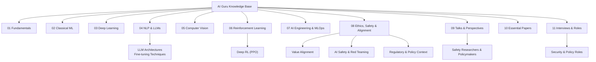
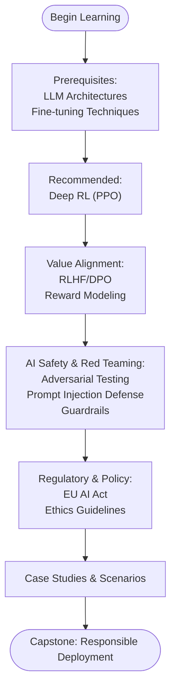
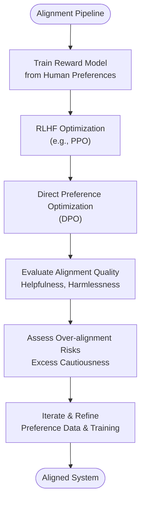
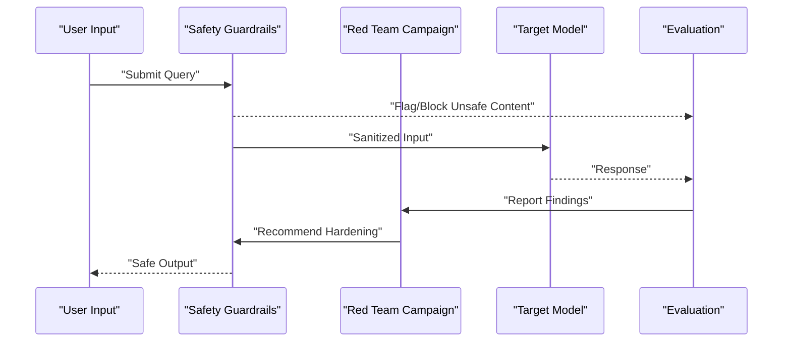
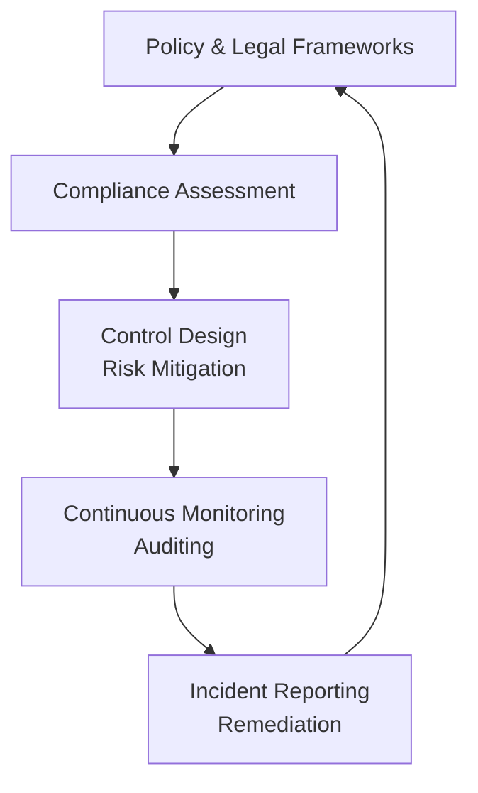
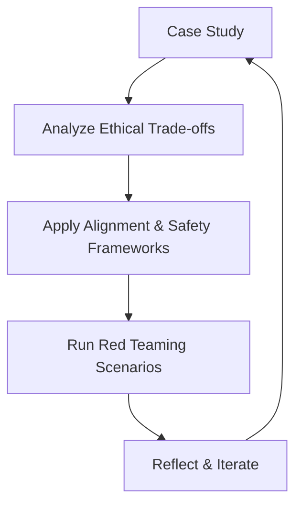
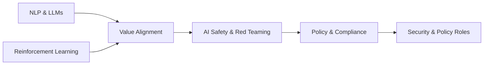

# Ethics & Safety Education

<cite>
**Referenced Files in This Document**
- [README.md](file://README.md)
- [docs/README.md](file://docs/README.md)
- [docs/08_Ethics_Safety/README.md](file://docs/08_Ethics_Safety/README.md)
- [docs/08_Ethics_Safety/Value_Alignment/Value_Alignment.md](file://docs/08_Ethics_Safety/Value_Alignment/Value_Alignment.md)
- [docs/08_Ethics_Safety/AI_Safety_RedTeaming/AI_Safety_RedTeaming.md](file://docs/08_Ethics_Safety/AI_Safety_RedTeaming/AI_Safety_RedTeaming.md)
- [docs/04_NLP_LLMs/Fine_tuning_Techniques/Fine_tuning_Techniques.md](file://docs/04_NLP_LLMs/Fine_tuning_Techniques/Fine_tuning_Techniques.md)
- [docs/09_talks/dario_amodei/sayings.md](file://docs/09_talks/dario_amodei/sayings.md)
- [docs/11_interviews/ai_security_engineer/question_bank.md](file://docs/11_interviews/ai_security_engineer/question_bank.md)
- [docs/11_interviews/ai_policy_specialist/question_bank.md](file://docs/11_interviews/ai_policy_specialist/question_bank.md)
</cite>

## Table of Contents
1. [Introduction](#introduction)
2. [Project Structure](#project-structure)
3. [Core Components](#core-components)
4. [Architecture Overview](#architecture-overview)
5. [Detailed Component Analysis](#detailed-component-analysis)
6. [Dependency Analysis](#dependency-analysis)
7. [Performance Considerations](#performance-considerations)
8. [Troubleshooting Guide](#troubleshooting-guide)
9. [Conclusion](#conclusion)
10. [Appendices](#appendices)

## Introduction
This document presents a comprehensive ethics and safety education system grounded in the repository’s structured curriculum. It synthesizes AI safety principles, red teaming methodologies, and value alignment frameworks into a coherent learning pathway. The system integrates theoretical foundations with practical implementation, covering risk assessment, adversarial testing, and alignment solutions. It also emphasizes pedagogy through case studies and real-world scenarios, preparing practitioners to anticipate and mitigate risks across the lifecycle of AI systems.

## Project Structure
The ethics and safety domain is organized as a standalone chapter within the broader knowledge base taxonomy. It links to prerequisite topics in NLP and reinforcement learning and connects to external authoritative sources and talks from leading safety researchers and policymakers.

**Diagram sources**
- [README.md:16-72](file://README.md#L16-L72)
- [docs/README.md:5-89](file://docs/README.md#L5-L89)

**Section sources**
- [README.md:16-72](file://README.md#L16-L72)
- [docs/README.md:5-89](file://docs/README.md#L5-L89)

## Core Components
- Value Alignment: Techniques such as reward modeling and preference optimization (RLHF/DPO) to steer model behavior toward human intent and preferences.
- AI Safety & Red Teaming: Practical adversarial testing, prompt injection defense, jailbreaking detection, and guardrails to prevent misuse.
- Regulatory & Policy Context: Coverage of legal frameworks (e.g., EU AI Act) and ethical guidelines (e.g., IEEE) to inform responsible deployment.
- Pedagogy: Case studies and scenario-based exercises to explore complex ethical dilemmas and apply frameworks in realistic settings.

**Section sources**
- [docs/08_Ethics_Safety/README.md:1-52](file://docs/08_Ethics_Safety/README.md#L1-L52)
- [docs/README.md:65-71](file://docs/README.md#L65-L71)

## Architecture Overview
The ethics and safety education system follows a layered learning architecture:
- Foundational prerequisites in NLP and reinforcement learning.
- Intermediate alignment techniques grounded in human feedback and preference modeling.
- Advanced safety engineering focused on adversarial robustness and operational guardrails.
- Governance and policy literacy to guide responsible deployment.

**Diagram sources**
- [docs/08_Ethics_Safety/README.md:30-36](file://docs/08_Ethics_Safety/README.md#L30-L36)
- [docs/08_Ethics_Safety/README.md:25-28](file://docs/08_Ethics_Safety/README.md#L25-L28)
- [docs/README.md:65-71](file://docs/README.md#L65-L71)

## Detailed Component Analysis

### Value Alignment
Value alignment ensures AI systems act in accordance with human intentions and preferences. The curriculum covers:
- Reward modeling and preference optimization via RLHF and DPO.
- Balancing helpfulness, honesty, and harmlessness.
- Understanding over-alignment risks and trade-offs.

**Diagram sources**
- [docs/08_Ethics_Safety/Value_Alignment/Value_Alignment.md:744-793](file://docs/08_Ethics_Safety/Value_Alignment/Value_Alignment.md#L744-L793)
- [docs/04_NLP_LLMs/Fine_tuning_Techniques/Fine_tuning_Techniques.md:239-271](file://docs/04_NLP_LLMs/Fine_tuning_Techniques/Fine_tuning_Techniques.md#L239-L271)

**Section sources**
- [docs/08_Ethics_Safety/Value_Alignment/Value_Alignment.md:599-793](file://docs/08_Ethics_Safety/Value_Alignment/Value_Alignment.md#L599-L793)
- [docs/04_NLP_LLMs/Fine_tuning_Techniques/Fine_tuning_Techniques.md:239-271](file://docs/04_NLP_LLMs/Fine_tuning_Techniques/Fine_tuning_Techniques.md#L239-L271)

### AI Safety & Red Teaming
Red teaming focuses on adversarial testing and defensive hardening:
- Detecting and mitigating prompt injection and jailbreaking attempts.
- Implementing safety guardrails to filter harmful inputs/outputs.
- Evaluating robustness against adversarial examples and exploit campaigns.

**Diagram sources**
- [docs/08_Ethics_Safety/AI_Safety_RedTeaming/AI_Safety_RedTeaming.md:218-229](file://docs/08_Ethics_Safety/AI_Safety_RedTeaming/AI_Safety_RedTeaming.md#L218-L229)
- [docs/08_Ethics_Safety/AI_Safety_RedTeaming/AI_Safety_RedTeaming.md:619-628](file://docs/08_Ethics_Safety/AI_Safety_RedTeaming/AI_Safety_RedTeaming.md#L619-L628)

**Section sources**
- [docs/08_Ethics_Safety/AI_Safety_RedTeaming/AI_Safety_RedTeaming.md:218-229](file://docs/08_Ethics_Safety/AI_Safety_RedTeaming/AI_Safety_RedTeaming.md#L218-L229)
- [docs/08_Ethics_Safety/AI_Safety_RedTeaming/AI_Safety_RedTeaming.md:619-628](file://docs/08_Ethics_Safety/AI_Safety_RedTeaming/AI_Safety_RedTeaming.md#L619-L628)

### Regulatory & Policy Context
The curriculum incorporates governance and policy to ensure responsible deployment:
- EU AI Act risk classification and obligations.
- Ethical guidelines and compliance frameworks.
- Practical assessments and checklists for model release.

**Diagram sources**
- [docs/README.md:65-71](file://docs/README.md#L65-L71)
- [docs/11_interviews/ai_policy_specialist/question_bank.md:1-25](file://docs/11_interviews/ai_policy_specialist/question_bank.md#L1-L25)

**Section sources**
- [docs/README.md:65-71](file://docs/README.md#L65-L71)
- [docs/11_interviews/ai_policy_specialist/question_bank.md:1-25](file://docs/11_interviews/ai_policy_specialist/question_bank.md#L1-L25)

### Pedagogy: Case Studies and Practical Scenarios
The system emphasizes hands-on learning:
- Scenario-based exercises to explore ethical trade-offs.
- Red teaming projects simulating adversarial campaigns.
- Interview-style questions to prepare for roles in security and policy.

**Diagram sources**
- [docs/11_interviews/ai_security_engineer/question_bank.md:1-25](file://docs/11_interviews/ai_security_engineer/question_bank.md#L1-L25)
- [docs/11_interviews/ai_policy_specialist/question_bank.md:1-25](file://docs/11_interviews/ai_policy_specialist/question_bank.md#L1-L25)

**Section sources**
- [docs/11_interviews/ai_security_engineer/question_bank.md:1-25](file://docs/11_interviews/ai_security_engineer/question_bank.md#L1-L25)
- [docs/11_interviews/ai_policy_specialist/question_bank.md:1-25](file://docs/11_interviews/ai_policy_specialist/question_bank.md#L1-L25)

## Dependency Analysis
The ethics and safety curriculum depends on prior knowledge in NLP and reinforcement learning, and it feeds into practical roles and governance.

**Diagram sources**
- [docs/08_Ethics_Safety/README.md:30-36](file://docs/08_Ethics_Safety/README.md#L30-L36)
- [docs/08_Ethics_Safety/README.md:25-28](file://docs/08_Ethics_Safety/README.md#L25-L28)
- [docs/README.md:65-71](file://docs/README.md#L65-L71)

**Section sources**
- [docs/08_Ethics_Safety/README.md:30-36](file://docs/08_Ethics_Safety/README.md#L30-L36)
- [docs/08_Ethics_Safety/README.md:25-28](file://docs/08_Ethics_Safety/README.md#L25-L28)
- [docs/README.md:65-71](file://docs/README.md#L65-L71)

## Performance Considerations
- Efficiency in alignment training: Prefer direct preference optimization (DPO) when computational resources are constrained while maintaining strong alignment outcomes.
- Guardrail latency: Optimize rule-based filters and ML classifiers to minimize inference latency without sacrificing safety coverage.
- Red teaming throughput: Automate campaign generation and evaluation to scale adversarial testing across diverse attack vectors.

[No sources needed since this section provides general guidance]

## Troubleshooting Guide
Common challenges and mitigation strategies:
- Over-alignment symptoms: Excessive refusal to answer benign queries. Mitigate by refining reward modeling data and calibration procedures.
- False positives in guardrails: Reduce collateral damage by tuning thresholds and incorporating contextual understanding.
- Red team evasion: Strengthen adversarial test suites and incorporate automated benchmarking tools to track regressions.

**Section sources**
- [docs/04_NLP_LLMs/Fine_tuning_Techniques/Fine_tuning_Techniques.md:474-474](file://docs/04_NLP_LLMs/Fine_tuning_Techniques/Fine_tuning_Techniques.md#L474-L474)
- [docs/08_Ethics_Safety/AI_Safety_RedTeaming/AI_Safety_RedTeaming.md:934-955](file://docs/08_Ethics_Safety/AI_Safety_RedTeaming/AI_Safety_RedTeaming.md#L934-L955)

## Conclusion
The ethics and safety education system offers a structured, practice-oriented pathway from foundational alignment techniques to advanced safety engineering and responsible deployment. By integrating value alignment, adversarial testing, and governance, learners develop the skills to anticipate and mitigate risks systematically. The curriculum’s emphasis on case studies and scenario-based exercises ensures learners can apply frameworks to real-world dilemmas and contribute to safer, more reliable AI systems.

[No sources needed since this section summarizes without analyzing specific files]

## Appendices

### Learning Progression Map
- Foundation: LLM architectures, fine-tuning techniques.
- Intermediate: RLHF/DPO, reward modeling, fairness.
- Advanced: Red teaming, adversarial testing, guardrails.
- Capstone: Compliance, policy, and responsible deployment.

**Section sources**
- [docs/08_Ethics_Safety/README.md:30-36](file://docs/08_Ethics_Safety/README.md#L30-L36)
- [docs/08_Ethics_Safety/README.md:25-28](file://docs/08_Ethics_Safety/README.md#L25-L28)

### Selected Safety Research and Policy References
- Anthropic: Core Views on AI Safety, Constitutional AI, Safety Research.
- IEEE: AI Ethics Guidelines.
- OpenAI: Safety Best Practices.
- Microsoft AI Red Team, Google AI Safety, DeepMind Safety Research.

**Section sources**
- [docs/README.md:69-71](file://docs/README.md#L69-L71)
- [docs/09_talks/dario_amodei/sayings.md:1-14](file://docs/09_talks/dario_amodei/sayings.md#L1-L14)