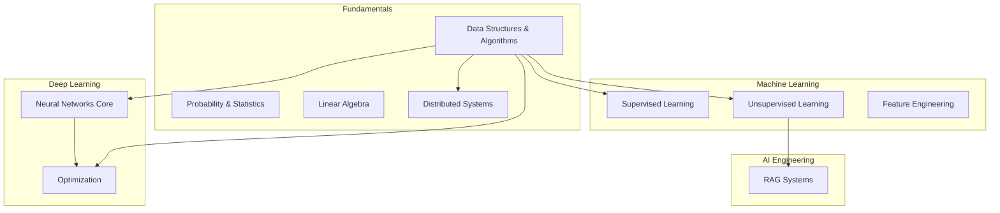
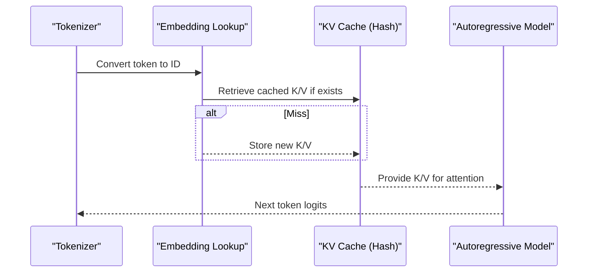
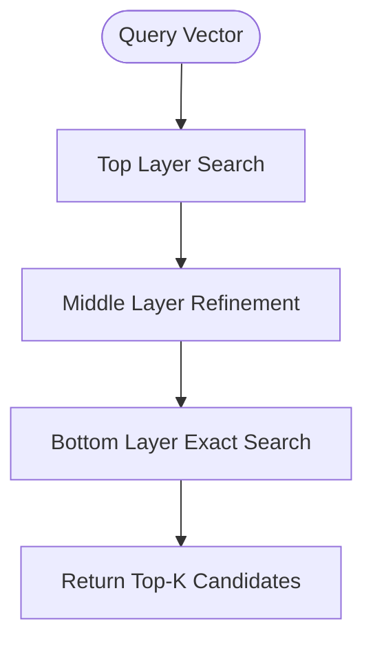
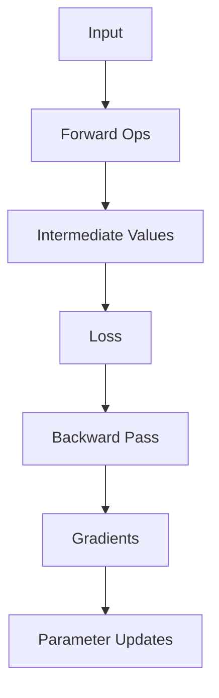
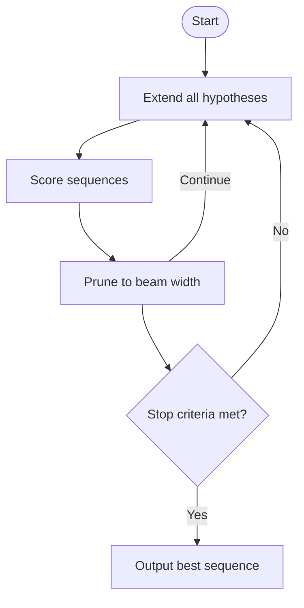
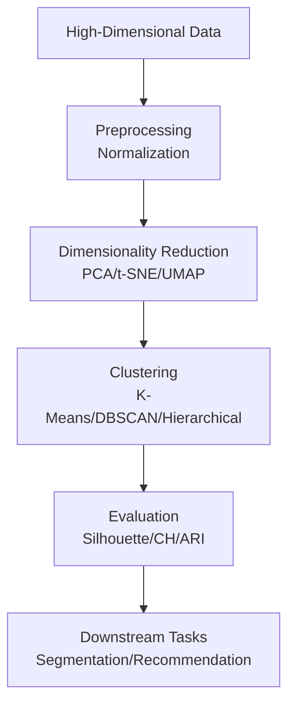
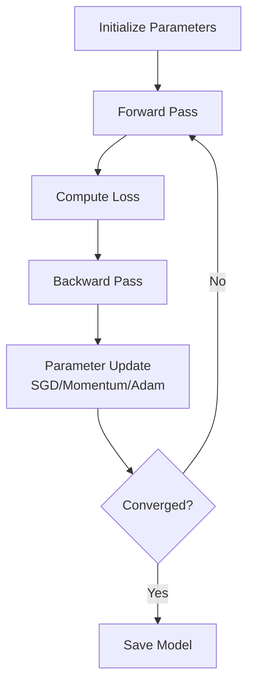
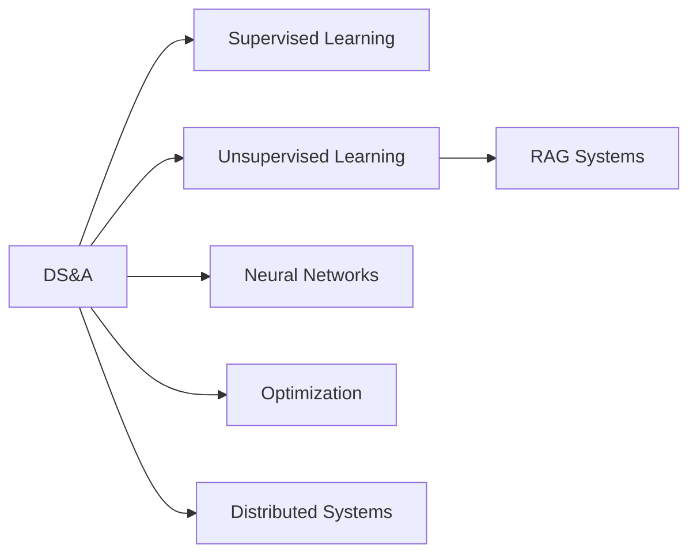

# Data Structures and Algorithms

<cite>
**Referenced Files in This Document**
- [Data_Structures_Algorithms_for_dummy.md](file://docs/01_Fundamentals/Data_Structures_Algorithms/Data_Structures_Algorithms_for_dummy.md)
- [Data_Structures_Algorithms.md](file://docs/01_Fundamentals/Data_Structures_Algorithms/Data_Structures_Algorithms.md)
- [README.md](file://docs/01_Fundamentals/README.md)
- [README.md](file://docs/02_Machine_Learning/README.md)
- [Neural_Network_Core.md](file://docs/03_Deep_Learning/Neural_Network_Core/Neural_Network_Core.md)
- [Optimization.md](file://docs/03_Deep_Learning/Optimization/Optimization.md)
- [Unsupervised_Learning.md](file://docs/02_Machine_Learning/Unsupervised_Learning/Unsupervised_Learning.md)
- [README.md](file://docs/03_Deep_Learning/README.md)
- [Distributed_Systems.md](file://docs/01_Fundamentals/Distributed_Systems/Distributed_Systems.md)
- [RAG_Systems.md](file://docs/07_AI_Engineering/RAG_Systems/RAG_Systems.md)
</cite>

## Table of Contents
1. [Introduction](#introduction)
2. [Project Structure](#project-structure)
3. [Core Components](#core-components)
4. [Architecture Overview](#architecture-overview)
5. [Detailed Component Analysis](#detailed-component-analysis)
6. [Dependency Analysis](#dependency-analysis)
7. [Performance Considerations](#performance-considerations)
8. [Troubleshooting Guide](#troubleshooting-guide)
9. [Conclusion](#conclusion)
10. [Appendices](#appendices)

## Introduction
This document synthesizes the repository’s materials on data structures and algorithms with a focus on AI/ML relevance. It explains arrays, linked lists, trees, graphs, hash tables, and their algorithmic applications, and connects them to machine learning workflows. It also covers complexity analysis, sorting/searching, optimization techniques, and practical implementations grounded in the repository’s content.

## Project Structure
The repository organizes foundational topics (including data structures and algorithms) under Fundamentals, with cross-links to Machine Learning, Deep Learning, and AI Engineering. The Data Structures and Algorithms section is complemented by:
- Machine Learning topics that rely on clustering, dimensionality reduction, and tree-based models
- Deep Learning materials covering computation graphs, backpropagation, and optimization
- Distributed Systems materials that touch on communication bottlenecks and parallelism
- RAG Systems that depend on vector indexing and retrieval

**Section sources**
- [README.md:1-27](file://docs/01_Fundamentals/README.md#L1-L27)
- [README.md:29-58](file://docs/02_Machine_Learning/README.md#L29-L58)
- [README.md:1-40](file://docs/03_Deep_Learning/README.md#L1-L40)

## Core Components
This section distills the repository’s coverage of data structures and algorithms into practical, AI-relevant building blocks.

- Arrays and Linked Lists
  - Arrays enable fast random access and efficient bulk operations, suitable for dense feature matrices and contiguous memory layouts in ML pipelines.
  - Linked lists are less common in ML due to poor cache locality; however, they can model dynamic sequences (e.g., computation graphs) where insertion/deletion is frequent.
  - Practical ML usage: arrays for fixed-size tensors and contiguous buffers; linked structures for dynamic computation graphs or sparse adjacency lists.

- Trees
  - Decision trees and ensembles (random forests, gradient boosting) are widely used in structured/tabular data modeling.
  - Tree traversal and balancing are foundational for understanding recursive algorithms and hierarchical data.
  - In ML: tree-based models underpin feature selection, ranking, and interpretable predictions.

- Graphs
  - Graphs model relationships in knowledge bases, neural network topologies, and message-passing in GNNs.
  - Algorithms like BFS/DFS, shortest paths, and topological sort are essential for preprocessing and reasoning.

- Hash Tables (Dictionaries)
  - Hash tables provide near O(1) average-time lookups, critical for vocabulary indexing, embeddings lookup, and caching (e.g., KV caches in autoregressive models).
  - In practice: word-to-id mappings, embedding tables, and memoization.

- Sorting and Searching
  - Sorting underpins nearest neighbor search, ranking, and data preparation.
  - Searching strategies (binary search on sorted arrays, hash-based lookups) are central to retrieval systems.

- Complexity Analysis
  - The repository emphasizes how algorithmic complexity directly impacts training and inference speed—e.g., quadratic scaling in attention mechanisms and the importance of linear/logarithmic operations for scalability.

**Section sources**
- [Data_Structures_Algorithms_for_dummy.md:24-44](file://docs/01_Fundamentals/Data_Structures_Algorithms/Data_Structures_Algorithms_for_dummy.md#L24-L44)
- [Data_Structures_Algorithms_for_dummy.md:140-151](file://docs/01_Fundamentals/Data_Structures_Algorithms/Data_Structures_Algorithms_for_dummy.md#L140-L151)
- [Unsupervised_Learning.md:39-66](file://docs/02_Machine_Learning/Unsupervised_Learning/Unsupervised_Learning.md#L39-L66)
- [Neural_Network_Core.md:168-246](file://docs/03_Deep_Learning/Neural_Network_Core/Neural_Network_Core.md#L168-L246)

## Architecture Overview
The repository’s materials show how data structures and algorithms underpin modern AI systems:

- Computation Graphs: A directed acyclic graph (DAG) of operations drives forward and backward passes in neural networks.
- Retrieval Pipelines: Vector databases leverage hierarchical navigable small world (HNSW) graphs for efficient similarity search.
- Optimization: Iterative algorithms (gradient descent variants) update parameters guided by computed gradients.

**Diagram sources**
- [Data_Structures_Algorithms_for_dummy.md:117-136](file://docs/01_Fundamentals/Data_Structures_Algorithms/Data_Structures_Algorithms_for_dummy.md#L117-L136)
- [Data_Structures_Algorithms_for_dummy.md:140-151](file://docs/01_Fundamentals/Data_Structures_Algorithms/Data_Structures_Algorithms_for_dummy.md#L140-L151)
- [Neural_Network_Core.md:395-406](file://docs/03_Deep_Learning/Neural_Network_Core/Neural_Network_Core.md#L395-L406)

## Detailed Component Analysis

### Hash Tables and Caching (KV Cache)
Hash tables enable constant-time lookups and are essential for:
- Token-to-vector lookup in tokenizers
- KV cache storage during autoregressive decoding to avoid recomputation

**Diagram sources**
- [Data_Structures_Algorithms_for_dummy.md:146-150](file://docs/01_Fundamentals/Data_Structures_Algorithms/Data_Structures_Algorithms_for_dummy.md#L146-L150)
- [Neural_Network_Core.md:395-406](file://docs/03_Deep_Learning/Neural_Network_Core/Neural_Network_Core.md#L395-L406)

**Section sources**
- [Data_Structures_Algorithms_for_dummy.md:140-151](file://docs/01_Fundamentals/Data_Structures_Algorithms/Data_Structures_Algorithms_for_dummy.md#L140-L151)
- [Neural_Network_Core.md:395-406](file://docs/03_Deep_Learning/Neural_Network_Core/Neural_Network_Core.md#L395-L406)

### Vector Search with HNSW
HNSW accelerates similarity search by navigating multi-layer graphs:
- Global layer quickly narrows candidates
- Finer layers refine results

**Diagram sources**
- [Data_Structures_Algorithms_for_dummy.md:117-136](file://docs/01_Fundamentals/Data_Structures_Algorithms/Data_Structures_Algorithms_for_dummy.md#L117-L136)

**Section sources**
- [Data_Structures_Algorithms_for_dummy.md:117-136](file://docs/01_Fundamentals/Data_Structures_Algorithms/Data_Structures_Algorithms_for_dummy.md#L117-L136)

### Computation Graphs and Backpropagation
Computation graphs represent the order of operations; backpropagation computes gradients via chain rule.

**Diagram sources**
- [Data_Structures_Algorithms_for_dummy.md:47-71](file://docs/01_Fundamentals/Data_Structures_Algorithms/Data_Structures_Algorithms_for_dummy.md#L47-L71)
- [Neural_Network_Core.md:168-209](file://docs/03_Deep_Learning/Neural_Network_Core/Neural_Network_Core.md#L168-L209)

**Section sources**
- [Data_Structures_Algorithms_for_dummy.md:47-71](file://docs/01_Fundamentals/Data_Structures_Algorithms/Data_Structures_Algorithms_for_dummy.md#L47-L71)
- [Neural_Network_Core.md:168-209](file://docs/03_Deep_Learning/Neural_Network_Core/Neural_Network_Core.md#L168-L209)

### Beam Search for Text Generation
Beam search maintains multiple hypotheses and selects globally optimal sequences.

**Diagram sources**
- [Data_Structures_Algorithms_for_dummy.md:91-114](file://docs/01_Fundamentals/Data_Structures_Algorithms/Data_Structures_Algorithms_for_dummy.md#L91-L114)

**Section sources**
- [Data_Structures_Algorithms_for_dummy.md:91-114](file://docs/01_Fundamentals/Data_Structures_Algorithms/Data_Structures_Algorithms_for_dummy.md#L91-L114)

### Unsupervised Learning Algorithms (Clustering, Dimensionality Reduction)
- K-Means: iterative assignment and update steps minimizing intra-cluster variance
- Hierarchical Clustering: builds dendrograms via agglomerative/splitting strategies
- DBSCAN: density-based clustering with automatic cluster count
- PCA: linear dimensionality reduction via eigenvalue decomposition
- t-SNE/UMAP: nonlinear dimensionality reduction for visualization and downstream tasks

**Diagram sources**
- [Unsupervised_Learning.md:39-66](file://docs/02_Machine_Learning/Unsupervised_Learning/Unsupervised_Learning.md#L39-L66)
- [Unsupervised_Learning.md:118-140](file://docs/02_Machine_Learning/Unsupervised_Learning/Unsupervised_Learning.md#L118-L140)
- [Unsupervised_Learning.md:213-235](file://docs/02_Machine_Learning/Unsupervised_Learning/Unsupervised_Learning.md#L213-L235)
- [Unsupervised_Learning.md:271-281](file://docs/02_Machine_Learning/Unsupervised_Learning/Unsupervised_Learning.md#L271-L281)

**Section sources**
- [Unsupervised_Learning.md:39-66](file://docs/02_Machine_Learning/Unsupervised_Learning/Unsupervised_Learning.md#L39-L66)
- [Unsupervised_Learning.md:118-140](file://docs/02_Machine_Learning/Unsupervised_Learning/Unsupervised_Learning.md#L118-L140)
- [Unsupervised_Learning.md:213-235](file://docs/02_Machine_Learning/Unsupervised_Learning/Unsupervised_Learning.md#L213-L235)
- [Unsupervised_Learning.md:271-281](file://docs/02_Machine_Learning/Unsupervised_Learning/Unsupervised_Learning.md#L271-L281)

### Optimization and Training Dynamics
Optimization focuses on minimizing loss functions using gradient-based methods, addressing challenges like local minima, saddle points, vanishing/exploding gradients, and noisy gradients.

**Diagram sources**
- [Optimization.md:1-39](file://docs/03_Deep_Learning/Optimization/Optimization.md#L1-L39)
- [Neural_Network_Core.md:168-246](file://docs/03_Deep_Learning/Neural_Network_Core/Neural_Network_Core.md#L168-L246)

**Section sources**
- [Optimization.md:1-39](file://docs/03_Deep_Learning/Optimization/Optimization.md#L1-L39)
- [Neural_Network_Core.md:168-246](file://docs/03_Deep_Learning/Neural_Network_Core/Neural_Network_Core.md#L168-L246)

## Dependency Analysis
The repository links data structures and algorithms to broader AI topics:

- Fundamentals to Machine Learning: supervised and unsupervised learning rely on distance metrics, clustering, and dimensionality reduction
- Fundamentals to Deep Learning: computation graphs, backpropagation, and optimization
- Fundamentals to AI Engineering: vector indexing and retrieval for RAG systems

**Diagram sources**
- [README.md:1-27](file://docs/01_Fundamentals/README.md#L1-L27)
- [README.md:29-58](file://docs/02_Machine_Learning/README.md#L29-L58)
- [README.md:1-40](file://docs/03_Deep_Learning/README.md#L1-L40)
- [RAG_Systems.md](file://docs/07_AI_Engineering/RAG_Systems/RAG_Systems.md#L491)

**Section sources**
- [README.md:1-27](file://docs/01_Fundamentals/README.md#L1-L27)
- [README.md:29-58](file://docs/02_Machine_Learning/README.md#L29-L58)
- [README.md:1-40](file://docs/03_Deep_Learning/README.md#L1-L40)
- [RAG_Systems.md](file://docs/07_AI_Engineering/RAG_Systems/RAG_Systems.md#L491)

## Performance Considerations
- Complexity matters: quadratic attention scaling limits sequence length; prefer linear/logarithmic alternatives where feasible
- Hash tables reduce lookup overhead; ensure good hash distribution and collision handling
- Vector indexing (HNSW) dramatically reduces search cost in retrieval; tune parameters for recall/latency trade-offs
- Distributed systems impact training throughput; bandwidth and latency dominate scaling

**Section sources**
- [Data_Structures_Algorithms_for_dummy.md:24-44](file://docs/01_Fundamentals/Data_Structures_Algorithms/Data_Structures_Algorithms_for_dummy.md#L24-L44)
- [Distributed_Systems.md:417-449](file://docs/01_Fundamentals/Distributed_Systems/Distributed_Systems.md#L417-L449)

## Troubleshooting Guide
Common pitfalls and remedies:
- Misunderstanding complexity: choose algorithms that scale with data size (e.g., logarithmic vs. linear vs. quadratic)
- Poor hash quality: ensure uniform distribution and handle collisions (open addressing/chaining)
- Inefficient retrieval: use HNSW or IVF indices; validate recall and latency
- Training instability: monitor gradients, apply clipping, adjust initialization, and use normalization layers
- Data leakage: avoid information from the future/test set influencing preprocessing

**Section sources**
- [Data_Structures_Algorithms_for_dummy.md:117-151](file://docs/01_Fundamentals/Data_Structures_Algorithms/Data_Structures_Algorithms_for_dummy.md#L117-L151)
- [Neural_Network_Core.md:220-246](file://docs/03_Deep_Learning/Neural_Network_Core/Neural_Network_Core.md#L220-L246)
- [Unsupervised_Learning.md:722-740](file://docs/02_Machine_Learning/Unsupervised_Learning/Unsupervised_Learning.md#L722-L740)

## Conclusion
Data structures and algorithms form the backbone of AI/ML systems. Arrays and hash tables enable efficient data representation and lookup; trees and graphs support modeling relationships; vector search scales retrieval; and optimization ensures robust training. Understanding complexity and applying appropriate structures and algorithms is essential for building scalable, accurate, and efficient AI systems.

## Appendices
- Practical ML workflows leveraging these concepts:
  - Tokenization and embedding lookup with hash tables
  - Autoregressive generation with KV caching
  - Retrieval-Augmented Generation with HNSW indices
  - Clustering and dimensionality reduction for feature engineering and visualization
  - Optimization strategies for convergence and stability

**Section sources**
- [Data_Structures_Algorithms_for_dummy.md:140-168](file://docs/01_Fundamentals/Data_Structures_Algorithms/Data_Structures_Algorithms_for_dummy.md#L140-L168)
- [RAG_Systems.md](file://docs/07_AI_Engineering/RAG_Systems/RAG_Systems.md#L491)
- [Unsupervised_Learning.md:604-671](file://docs/02_Machine_Learning/Unsupervised_Learning/Unsupervised_Learning.md#L604-L671)
- [Optimization.md:464-557](file://docs/03_Deep_Learning/Optimization/Optimization.md#L464-L557)