# Distributed Systems Foundations

<cite>
**Referenced Files in This Document**
- [Distributed_Systems.md](file://docs/01_Fundamentals/Distributed_Systems/Distributed_Systems.md)
- [Inference-in-nutshell.md](file://docs/07_AI_Engineering/Deployment_Inference/Inference-in-nutshell.md)
- [RAG_Systems.md](file://docs/07_AI_Engineering/RAG_Systems/RAG_Systems.md)
- [LLM_Architectures.md](file://docs/04_NLP_LLMs/LLM_Architectures/LLM_Architectures.md)
- [README.md (AI Engineering)](file://docs/07_AI_Engineering/README.md)
- [README.md (Fundamentals)](file://docs/01_Fundamentals/README.md)
- [README.md (AI Reliability Engineer)](file://docs/11_interviews/ai_reliability_engineer/company_level_question_bank.md)
</cite>

## Table of Contents
1. [Introduction](#introduction)
2. [Project Structure](#project-structure)
3. [Core Components](#core-components)
4. [Architecture Overview](#architecture-overview)
5. [Detailed Component Analysis](#detailed-component-analysis)
6. [Dependency Analysis](#dependency-analysis)
7. [Performance Considerations](#performance-considerations)
8. [Troubleshooting Guide](#troubleshooting-guide)
9. [Conclusion](#conclusion)
10. [Appendices](#appendices)

## Introduction
This document synthesizes distributed systems principles essential for modern AI infrastructure. It explains distributed computing fundamentals, fault tolerance, consistency models, and scalability patterns, with a focus on AI/ML applications such as distributed training, model serving, and big data processing. It also covers trade-offs among consistency, availability, and partition tolerance, along with security, monitoring, and debugging considerations in distributed environments.

## Project Structure
The repository organizes foundational AI topics and AI engineering practices. The distributed systems content is primarily located under the Fundamentals section, while AI engineering chapters cover deployment, inference, and RAG systems. These materials collectively support understanding how distributed systems power modern AI infrastructure.

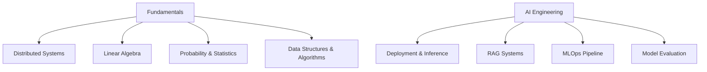

**Section sources**
- [README.md (Fundamentals):1-59](file://docs/01_Fundamentals/README.md#L1-L59)
- [README.md (AI Engineering):1-62](file://docs/07_AI_Engineering/README.md#L1-L62)

## Core Components
This section distills the core distributed systems concepts and their application to AI infrastructure.

- Communication primitives and All-Reduce algorithms
  - All-Reduce ring algorithm and complexity characteristics
  - Broadcast, Reduce, All-Gather, Reduce-Scatter, Scatter
- Parallel strategies
  - Data parallelism (DP), tensor parallelism (TP), pipeline parallelism (PP)
  - Combined 3D parallelism (DP × TP × PP)
- Memory optimization
  - ZeRO stages (1–3) and comparison with data parallel baseline
  - FSDP as a practical implementation of ZeRO-3
- Communication bottlenecks and optimization
  - α-β communication model
  - Practical optimizations: gradient accumulation, mixed precision, gradient compression

These components form the backbone of scalable AI training and inference systems.

**Section sources**
- [Distributed_Systems.md:27-44](file://docs/01_Fundamentals/Distributed_Systems/Distributed_Systems.md#L27-L44)
- [Distributed_Systems.md:46-101](file://docs/01_Fundamentals/Distributed_Systems/Distributed_Systems.md#L46-L101)
- [Distributed_Systems.md:104-214](file://docs/01_Fundamentals/Distributed_Systems/Distributed_Systems.md#L104-L214)
- [Distributed_Systems.md:219-311](file://docs/01_Fundamentals/Distributed_Systems/Distributed_Systems.md#L219-L311)
- [Distributed_Systems.md:315-366](file://docs/01_Fundamentals/Distributed_Systems/Distributed_Systems.md#L315-L366)
- [Distributed_Systems.md:368-415](file://docs/01_Fundamentals/Distributed_Systems/Distributed_Systems.md#L368-L415)
- [Distributed_Systems.md:417-449](file://docs/01_Fundamentals/Distributed_Systems/Distributed_Systems.md#L417-L449)

## Architecture Overview
The distributed AI architecture integrates training and inference layers with supporting systems for data, storage, and observability.

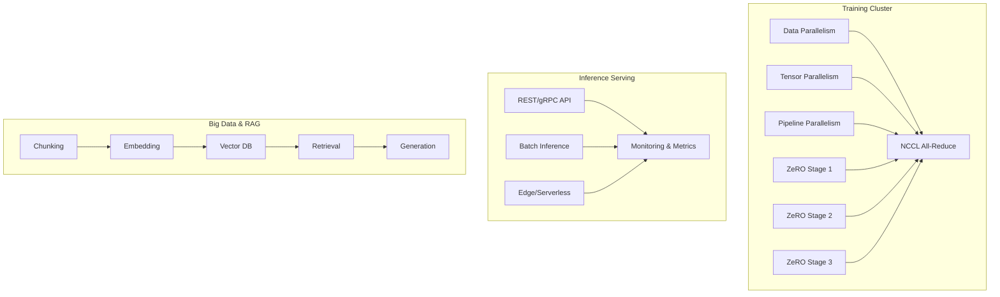

**Diagram sources**
- [Distributed_Systems.md:104-214](file://docs/01_Fundamentals/Distributed_Systems/Distributed_Systems.md#L104-L214)
- [Distributed_Systems.md:219-311](file://docs/01_Fundamentals/Distributed_Systems/Distributed_Systems.md#L219-L311)
- [Inference-in-nutshell.md:111-133](file://docs/07_AI_Engineering/Deployment_Inference/Inference-in-nutshell.md#L111-L133)
- [RAG_Systems.md:105-157](file://docs/07_AI_Engineering/RAG_Systems/RAG_Systems.md#L105-L157)

## Detailed Component Analysis

### Communication Primitives and All-Reduce
- Purpose: Synchronize gradients across devices during distributed training.
- Characteristics:
  - Ring All-Reduce achieves near-optimal bandwidth utilization with logarithmic latency scaling.
  - Communication volume approximates constant regardless of node count in ring topology.
- Trade-offs:
  - Latency increases linearly with node count.
  - Requires high-bandwidth, low-latency interconnects (e.g., NVLink).

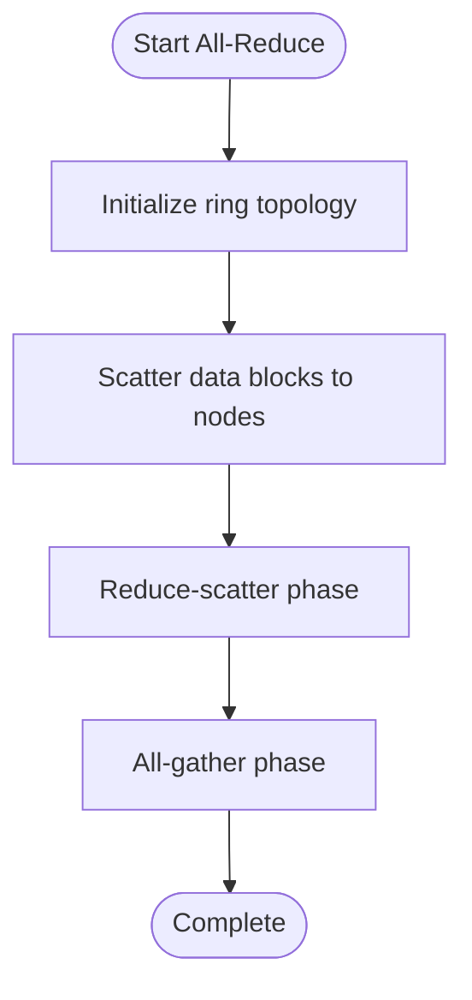

**Diagram sources**
- [Distributed_Systems.md:46-101](file://docs/01_Fundamentals/Distributed_Systems/Distributed_Systems.md#L46-L101)

**Section sources**
- [Distributed_Systems.md:27-44](file://docs/01_Fundamentals/Distributed_Systems/Distributed_Systems.md#L27-L44)
- [Distributed_Systems.md:46-101](file://docs/01_Fundamentals/Distributed_Systems/Distributed_Systems.md#L46-L101)

### Parallel Strategies: DP, TP, PP, and 3D
- Data Parallelism (DP)
  - Replicates model copies across devices; synchronizes gradients via All-Reduce.
  - Advantages: simple implementation, linear scaling of communication volume.
  - Limitations: requires single-device memory fit; small batches increase per-step overhead.
- Tensor Parallelism (TP)
  - Partitions weights within layers across devices; frequent communication per layer.
  - Advantages: reduces per-device memory footprint.
  - Limitations: constrained to high-bandwidth networks (e.g., NVLink).
- Pipeline Parallelism (PP)
  - Partitions layers across devices; micro-batching mitigates pipeline bubbles.
  - Advantages: enables arbitrary model-to-device scaling; minimal inter-layer communication.
  - Limitations: bubble time reduces GPU utilization; recomputation of activations.
- 3D Parallelism
  - Combines DP, TP, and PP to scale to very large models and clusters.

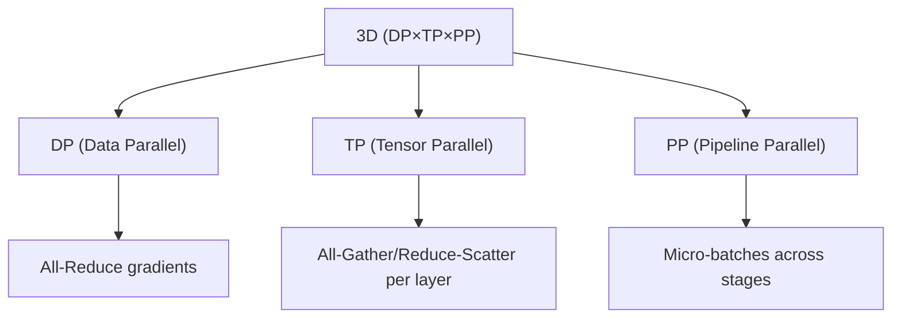

**Diagram sources**
- [Distributed_Systems.md:104-214](file://docs/01_Fundamentals/Distributed_Systems/Distributed_Systems.md#L104-L214)
- [Distributed_Systems.md:368-415](file://docs/01_Fundamentals/Distributed_Systems/Distributed_Systems.md#L368-L415)

**Section sources**
- [Distributed_Systems.md:104-214](file://docs/01_Fundamentals/Distributed_Systems/Distributed_Systems.md#L104-L214)
- [Distributed_Systems.md:368-415](file://docs/01_Fundamentals/Distributed_Systems/Distributed_Systems.md#L368-L415)

### ZeRO and FSDP: Memory Optimization
- ZeRO stages:
  - Stage 1: shard optimizer states.
  - Stage 2: shard gradients.
  - Stage 3: shard parameters; use All-Gather during compute.
- FSDP (PyTorch) mirrors ZeRO-3 with automatic wrapping and mixed precision support.
- Impact:
  - Dramatic reduction in per-GPU memory at modest communication cost.

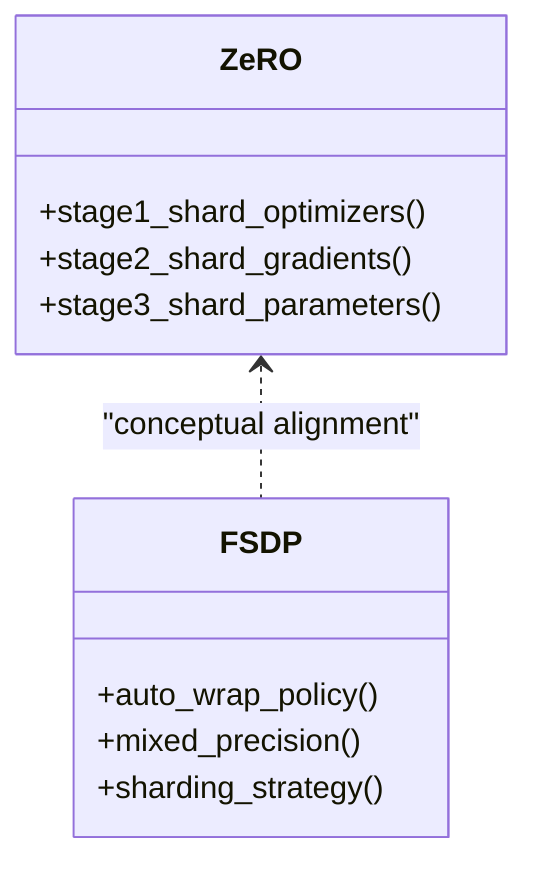

**Diagram sources**
- [Distributed_Systems.md:219-311](file://docs/01_Fundamentals/Distributed_Systems/Distributed_Systems.md#L219-L311)
- [Distributed_Systems.md:315-366](file://docs/01_Fundamentals/Distributed_Systems/Distributed_Systems.md#L315-L366)

**Section sources**
- [Distributed_Systems.md:219-311](file://docs/01_Fundamentals/Distributed_Systems/Distributed_Systems.md#L219-L311)
- [Distributed_Systems.md:315-366](file://docs/01_Fundamentals/Distributed_Systems/Distributed_Systems.md#L315-L366)

### Communication Bottlenecks and Optimization
- α-β model: fixed latency plus bandwidth-limited message cost.
- Practical optimizations:
  - Gradient accumulation to reduce frequency.
  - Mixed precision to halve communication volume.
  - Gradient compression to reduce bandwidth (trade-off in accuracy).

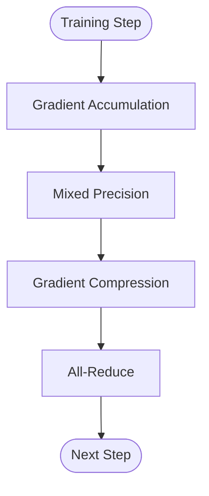

**Diagram sources**
- [Distributed_Systems.md:417-449](file://docs/01_Fundamentals/Distributed_Systems/Distributed_Systems.md#L417-L449)

**Section sources**
- [Distributed_Systems.md:417-449](file://docs/01_Fundamentals/Distributed_Systems/Distributed_Systems.md#L417-L449)

### Distributed Training Workflows
- PyTorch DDP example demonstrates initialization, distributed sampling, and training loop with automatic gradient synchronization.
- DeepSpeed configuration shows ZeRO stage selection, offload options, and mixed precision.

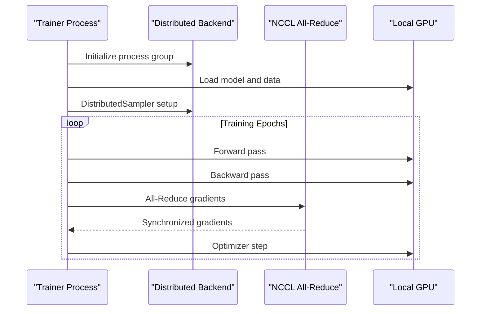

**Diagram sources**
- [Distributed_Systems.md:451-521](file://docs/01_Fundamentals/Distributed_Systems/Distributed_Systems.md#L451-L521)
- [Distributed_Systems.md:523-562](file://docs/01_Fundamentals/Distributed_Systems/Distributed_Systems.md#L523-L562)

**Section sources**
- [Distributed_Systems.md:451-521](file://docs/01_Fundamentals/Distributed_Systems/Distributed_Systems.md#L451-L521)
- [Distributed_Systems.md:523-562](file://docs/01_Fundamentals/Distributed_Systems/Distributed_Systems.md#L523-L562)

### Model Serving and Inference
- Inference modes differ from training: disable gradients, disable dropout, use fixed BatchNorm statistics.
- Deployment options include REST/gRPC APIs, batch inference, containerized deployments, and edge/serverless.
- Optimization techniques: quantization, ONNX export, TensorRT acceleration, request batching.

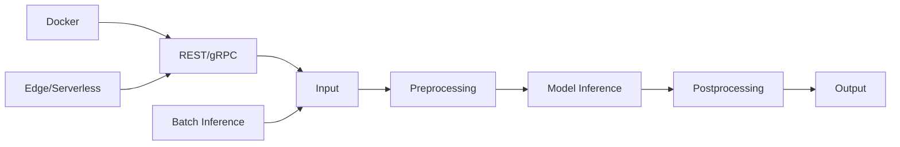

**Diagram sources**
- [Inference-in-nutshell.md:67-108](file://docs/07_AI_Engineering/Deployment_Inference/Inference-in-nutshell.md#L67-L108)
- [Inference-in-nutshell.md:111-133](file://docs/07_AI_Engineering/Deployment_Inference/Inference-in-nutshell.md#L111-L133)

**Section sources**
- [Inference-in-nutshell.md:31-64](file://docs/07_AI_Engineering/Deployment_Inference/Inference-in-nutshell.md#L31-L64)
- [Inference-in-nutshell.md:111-133](file://docs/07_AI_Engineering/Deployment_Inference/Inference-in-nutshell.md#L111-L133)
- [Inference-in-nutshell.md:221-297](file://docs/07_AI_Engineering/Deployment_Inference/Inference-in-nutshell.md#L221-L297)

### Big Data Processing and RAG
- RAG pipeline stages: indexing, retrieval, generation.
- Retrieval strategies: vector similarity, BM25, hybrid search, re-ranking.
- Vector databases and embedding models selection guidance.

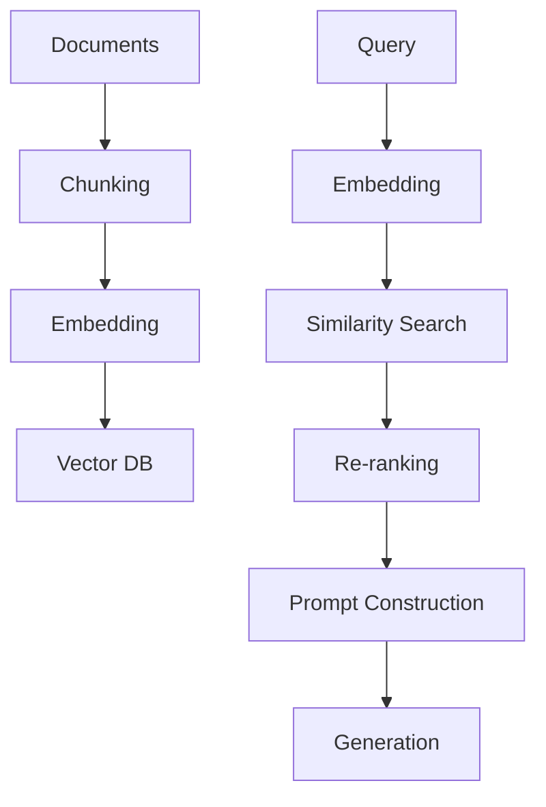

**Diagram sources**
- [RAG_Systems.md:105-157](file://docs/07_AI_Engineering/RAG_Systems/RAG_Systems.md#L105-L157)

**Section sources**
- [RAG_Systems.md:27-102](file://docs/07_AI_Engineering/RAG_Systems/RAG_Systems.md#L27-L102)
- [RAG_Systems.md:103-191](file://docs/07_AI_Engineering/RAG_Systems/RAG_Systems.md#L103-L191)
- [RAG_Systems.md:192-234](file://docs/07_AI_Engineering/RAG_Systems/RAG_Systems.md#L192-L234)

### LLM Architectures and Scalability
- Decoder-only architectures dominate modern LLMs due to simplicity and scalability.
- Techniques for long-context windows, grouped-query attention (GQA), and MoE routing.
- Scaling laws and resource estimation for training compute budgets.

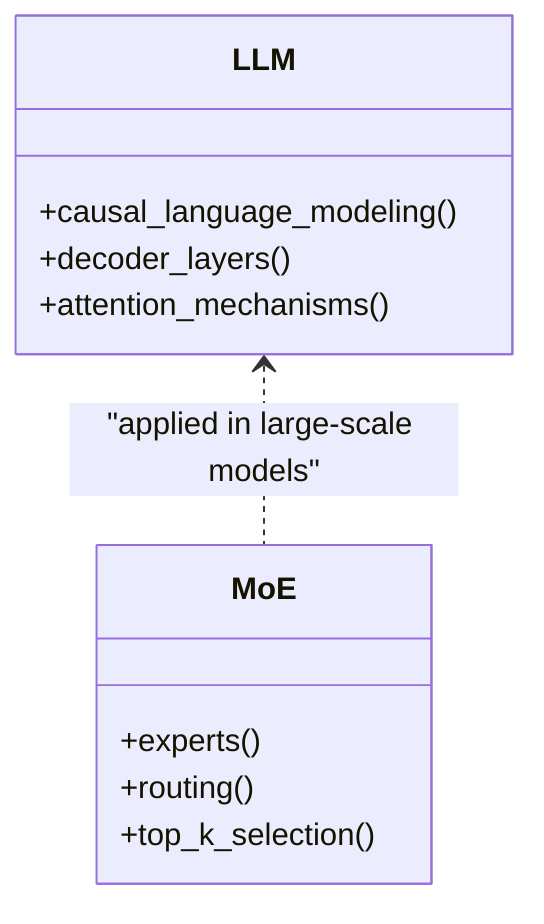

**Diagram sources**
- [LLM_Architectures.md:41-83](file://docs/04_NLP_LLMs/LLM_Architectures/LLM_Architectures.md#L41-L83)
- [LLM_Architectures.md:100-174](file://docs/04_NLP_LLMs/LLM_Architectures/LLM_Architectures.md#L100-L174)

**Section sources**
- [LLM_Architectures.md:84-174](file://docs/04_NLP_LLMs/LLM_Architectures/LLM_Architectures.md#L84-L174)
- [LLM_Architectures.md:215-324](file://docs/04_NLP_LLMs/LLM_Architectures/LLM_Architectures.md#L215-L324)

## Dependency Analysis
The distributed systems content depends on mathematical foundations and is applied across AI engineering domains.

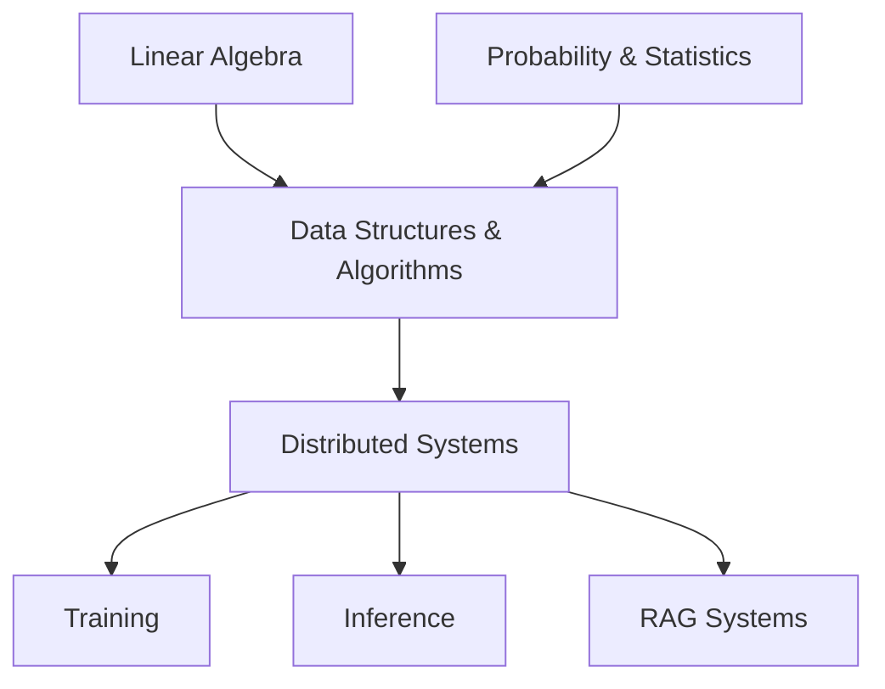

**Diagram sources**
- [README.md (Fundamentals):1-59](file://docs/01_Fundamentals/README.md#L1-L59)
- [README.md (AI Engineering):1-62](file://docs/07_AI_Engineering/README.md#L1-L62)

**Section sources**
- [README.md (Fundamentals):29-56](file://docs/01_Fundamentals/README.md#L29-L56)
- [README.md (AI Engineering):31-58](file://docs/07_AI_Engineering/README.md#L31-L58)

## Performance Considerations
- Communication scaling:
  - Prefer ring All-Reduce for large-scale training on high-bandwidth networks.
  - Use gradient accumulation to reduce communication frequency.
- Memory scaling:
  - ZeRO-3 dramatically reduces per-GPU memory at modest communication overhead.
- Inference optimization:
  - Quantization, ONNX/TensorRT, batching, and pre-warming improve latency and throughput.
- RAG retrieval:
  - Hybrid search and re-ranking balance recall and precision; vector and keyword indices complement each other.

[No sources needed since this section provides general guidance]

## Troubleshooting Guide
Common pitfalls and remedies in distributed AI systems:

- Training
  - Asynchronous vs synchronous DP: asynchronous updates may slow convergence due to stale gradients.
  - Elastic training: handle dynamic node additions/removals with periodic checkpointing and reinitialization of process groups.
  - Communication deadlocks: use separate process groups for different parallel strategies.
  - Non-determinism: synchronize RNG seeds across devices.
- Inference
  - Incorrect mode: ensure model.eval() and torch.no_grad() are used.
  - Device mismatches: verify model placement and input tensors on the same device.
  - Memory leaks: clear caches and manage references carefully.
  - High latency: apply quantization, batching, and pre-warming strategies.
- Observability
  - Define SLIs/SLOs, set alert thresholds, and establish incident response procedures.
  - Monitor latency percentiles, error rates, GPU utilization, and memory usage.

**Section sources**
- [Distributed_Systems.md:596-623](file://docs/01_Fundamentals/Distributed_Systems/Distributed_Systems.md#L596-L623)
- [Inference-in-nutshell.md:421-443](file://docs/07_AI_Engineering/Deployment_Inference/Inference-in-nutshell.md#L421-L443)
- [README.md (AI Reliability Engineer):1-37](file://docs/11_interviews/ai_reliability_engineer/company_level_question_bank.md#L1-L37)

## Conclusion
Distributed systems underpin modern AI infrastructure. By combining communication-efficient primitives, parallel strategies, and memory optimization techniques, AI systems achieve scalable training and efficient inference. Real-world deployment demands careful attention to reliability, monitoring, and operational practices to ensure robustness and performance.

[No sources needed since this section summarizes without analyzing specific files]

## Appendices

### Trade-offs: Consistency, Availability, Partition Tolerance
- In distributed AI, network partitions are common; systems must choose among:
  - Strong consistency with reduced availability (CP).
  - High availability with eventual consistency (AP).
  - Partition tolerance with eventual consistency (AP).
- Practical implications:
  - Training: synchronous All-Reduce favors consistency but may reduce availability under failures.
  - Inference: AP designs (eventual consistency) often preferred for resilience and latency.
  - RAG: hybrid retrieval strategies balance speed and accuracy under partial failures.

[No sources needed since this section provides general guidance]

### Security Considerations
- Access control and identity management for training clusters and inference endpoints.
- Encryption at rest and in transit for model artifacts and sensitive data.
- Least privilege access for distributed workers and monitoring systems.
- Audit logs for compliance and incident investigations.

[No sources needed since this section provides general guidance]