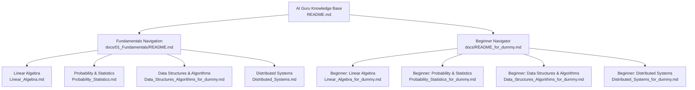
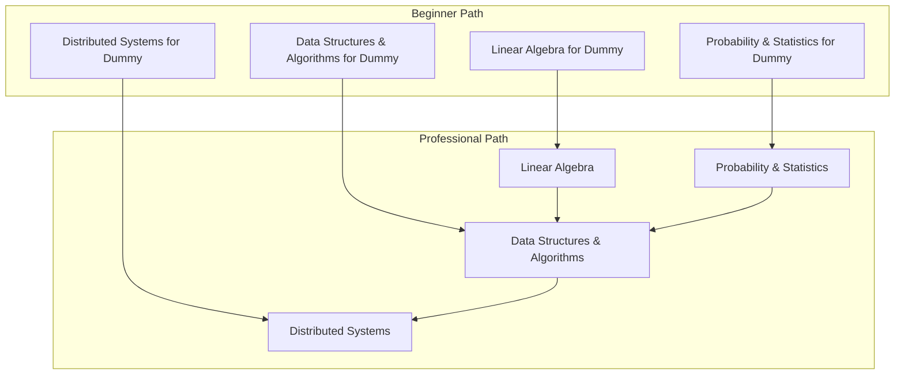
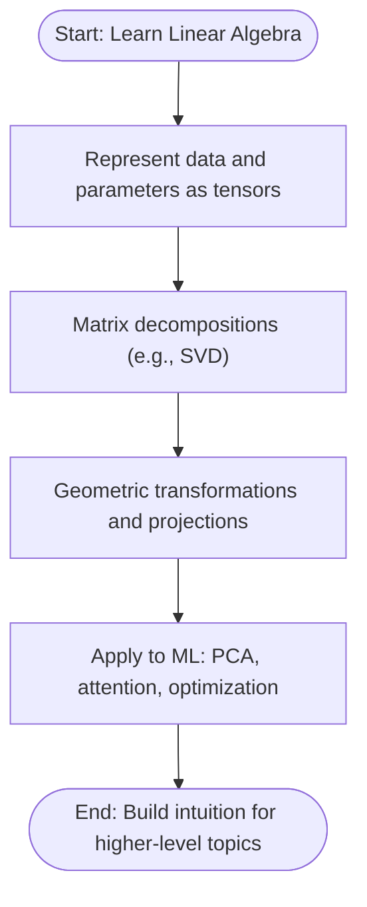
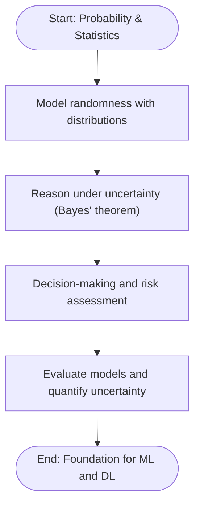
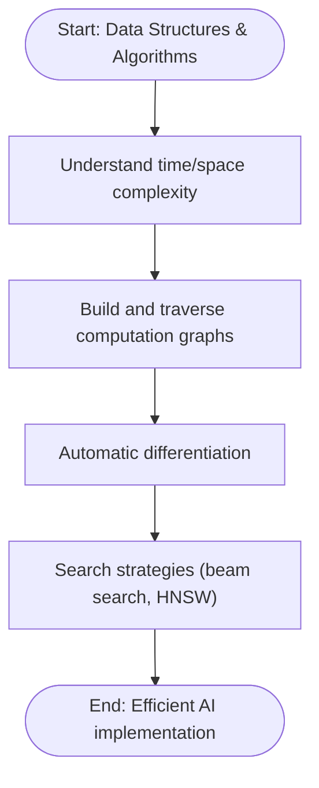
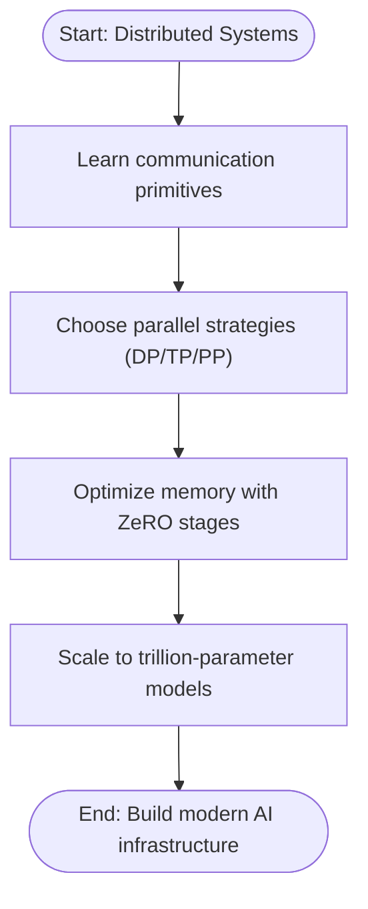
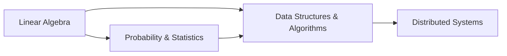

# Fundamentals Education

<cite>
**Referenced Files in This Document**
- [README.md](file://README.md)
- [README_for_dummy.md](file://docs/README_for_dummy.md)
- [Fundamentals README.md](file://docs/01_Fundamentals/README.md)
- [Linear_Algebra.md](file://docs/01_Fundamentals/Linear_Algebra/Linear_Algebra.md)
- [Linear_Algebra_for_dummy.md](file://docs/01_Fundamentals/Linear_Algebra/Linear_Algebra_for_dummy.md)
- [Probability_Statistics.md](file://docs/01_Fundamentals/Probability_Statistics/Probability_Statistics.md)
- [Probability_Statistics_for_dummy.md](file://docs/01_Fundamentals/Probability_Statistics/Probability_Statistics_for_dummy.md)
- [Data_Structures_Algorithms_for_dummy.md](file://docs/01_Fundamentals/Data_Structures_Algorithms/Data_Structures_Algorithms_for_dummy.md)
- [Distributed_Systems.md](file://docs/01_Fundamentals/Distributed_Systems/Distributed_Systems.md)
</cite>

## Table of Contents
1. [Introduction](#introduction)
2. [Project Structure](#project-structure)
3. [Core Components](#core-components)
4. [Architecture Overview](#architecture-overview)
5. [Detailed Component Analysis](#detailed-component-analysis)
6. [Dependency Analysis](#dependency-analysis)
7. [Performance Considerations](#performance-considerations)
8. [Troubleshooting Guide](#troubleshooting-guide)
9. [Conclusion](#conclusion)
10. [Appendices](#appendices)

## Introduction
This document presents a comprehensive guide to the fundamentals education system that underpins modern AI/ML technologies. It explains the foundational knowledge structure spanning linear algebra, probability and statistics, data structures and algorithms, and distributed systems. The pedagogical approach emphasizes simplified explanations for complex concepts, a bilingual terminology system with English and Chinese terms, and a progressive difficulty scale from beginner to advanced. It also connects theoretical mathematics to practical implementation, highlights academic foundations, and outlines a systematic method for building strong computational thinking skills.

## Project Structure
The fundamentals section is organized as a learning pathway with clear prerequisites, bilingual glossaries, and cross-references to advanced topics. The structure supports both novice and expert learners via dedicated “for dummy” navigators and professional versions.

**Diagram sources**
- [README.md:16-25](file://README.md#L16-L25)
- [Fundamentals README.md:29-36](file://docs/01_Fundamentals/README.md#L29-L36)
- [README_for_dummy.md:30-39](file://docs/README_for_dummy.md#L30-L39)

**Section sources**
- [README.md:16-25](file://README.md#L16-L25)
- [Fundamentals README.md:29-36](file://docs/01_Fundamentals/README.md#L29-L36)
- [README_for_dummy.md:30-39](file://docs/README_for_dummy.md#L30-L39)

## Core Components
The fundamentals education system is composed of four pillars:

- Linear Algebra: Provides tensor representation, matrix decompositions (e.g., SVD), eigenvalue/eigenvector analysis, and geometric intuition for transformations. These concepts are foundational for representing model parameters and data in ML systems.
- Probability and Statistics: Teaches modeling uncertainty, Bayesian reasoning, common distributions, estimation (MLE/MAP), and information theory (entropy, cross-entropy, KL divergence). These tools are essential for probabilistic modeling and designing robust loss functions.
- Data Structures and Algorithms: Introduces computational graphs, algorithmic complexity, automatic differentiation, beam search, and vector search (e.g., HNSW). These enable efficient computation and retrieval in AI systems.
- Distributed Systems: Covers communication primitives (e.g., All-Reduce), parallel strategies (data, tensor, pipeline), and memory optimization (e.g., ZeRO). These are essential for scaling training to trillion-parameter models.

Pedagogical approach:
- Simplified explanations for complex ideas, using analogies and step-by-step reasoning.
- Bilingual terminology system with English and Chinese terms for core concepts.
- Progressive difficulty scaling: beginner-friendly summaries (“for dummy”) and advanced, mathematically rigorous content.

Integration between theory and practice:
- Each topic links theoretical concepts to practical implementations (e.g., cross-entropy loss, All-Reduce, HNSW).
- Academic foundations are cited, ensuring authoritative grounding.

**Section sources**
- [Fundamentals README.md:33-36](file://docs/01_Fundamentals/README.md#L33-L36)
- [Fundamentals README.md:44-55](file://docs/01_Fundamentals/README.md#L44-L55)
- [README.md:14](file://README.md#L14)

## Architecture Overview
The system is designed as a layered pipeline: fundamentals feed into machine learning, which feeds into deep learning, and so forth. The fundamentals section establishes prerequisite knowledge for all subsequent domains.

**Diagram sources**
- [README_for_dummy.md:11-26](file://docs/README_for_dummy.md#L11-L26)
- [Fundamentals README.md:5-27](file://docs/01_Fundamentals/README.md#L5-L27)

## Detailed Component Analysis

### Linear Algebra
- Purpose: Establish the mathematical backbone for representing and transforming data and model parameters.
- Key concepts: Tensors, matrix decompositions (e.g., SVD), eigenvalue decomposition, and geometric interpretations.
- Pedagogy: Uses analogies and visual reasoning to explain transformations and dimensionality reduction.
- Practical relevance: Underpins neural network computations, attention mechanisms, and optimization landscapes.

**Section sources**
- [Fundamentals README.md:33](file://docs/01_Fundamentals/README.md#L33)
- [Linear_Algebra_for_dummy.md:1-12](file://docs/01_Fundamentals/Linear_Algebra/Linear_Algebra_for_dummy.md#L1-L12)

### Probability and Statistics
- Purpose: Equip learners to model uncertainty, reason under incomplete information, and design robust ML systems.
- Key concepts: Probability axioms, conditional probability, Bayes’ theorem, common distributions, MLE/MAP, entropy, cross-entropy, KL divergence.
- Pedagogy: Emphasizes intuitive understanding and real-world examples (e.g., spam classification).
- Practical relevance: Loss functions, variational inference, reinforcement learning exploration, and generative modeling.

**Section sources**
- [Fundamentals README.md:34](file://docs/01_Fundamentals/README.md#L34)
- [Probability_Statistics.md:9-21](file://docs/01_Fundamentals/Probability_Statistics/Probability_Statistics.md#L9-L21)
- [Probability_Statistics_for_dummy.md:1-12](file://docs/01_Fundamentals/Probability_Statistics/Probability_Statistics_for_dummy.md#L1-L12)

### Data Structures and Algorithms
- Purpose: Develop algorithmic thinking and efficiency awareness for AI workloads.
- Key concepts: Complexity classes, computational graphs, automatic differentiation, beam search, hash tables, and vector search (HNSW).
- Pedagogy: Uses everyday analogies (e.g., library search, recipe steps) to explain computation graphs and search strategies.
- Practical relevance: Automatic differentiation, text generation, retrieval-augmented generation (RAG), and scalable inference.

**Section sources**
- [Fundamentals README.md:35](file://docs/01_Fundamentals/README.md#L35)
- [Data_Structures_Algorithms_for_dummy.md:22-114](file://docs/01_Fundamentals/Data_Structures_Algorithms/Data_Structures_Algorithms_for_dummy.md#L22-L114)

### Distributed Systems
- Purpose: Enable scaling AI training to massive models and datasets.
- Key concepts: Communication primitives (All-Reduce, All-Gather), parallel strategies (data, tensor, pipeline), and memory optimization (ZeRO).
- Pedagogy: Explains factory-line metaphors for data/model/pipeline parallelism and ring-based All-Reduce.
- Practical relevance: Production training frameworks, large language model engineering, and cluster resource management.

**Section sources**
- [Fundamentals README.md:36](file://docs/01_Fundamentals/README.md#L36)
- [Distributed_Systems.md:9-23](file://docs/01_Fundamentals/Distributed_Systems/Distributed_Systems.md#L9-L23)

## Dependency Analysis
The fundamentals form a prerequisite chain: linear algebra and probability/statistics underpin data structures/algorithms, which in turn support distributed systems. Cross-references reinforce connections across topics.

**Diagram sources**
- [Fundamentals README.md:5-27](file://docs/01_Fundamentals/README.md#L5-L27)
- [Probability_Statistics.md:519-527](file://docs/01_Fundamentals/Probability_Statistics/Probability_Statistics.md#L519-L527)
- [Distributed_Systems.md:627-634](file://docs/01_Fundamentals/Distributed_Systems/Distributed_Systems.md#L627-L634)

**Section sources**
- [Fundamentals README.md:5-27](file://docs/01_Fundamentals/README.md#L5-L27)
- [Probability_Statistics.md:519-527](file://docs/01_Fundamentals/Probability_Statistics/Probability_Statistics.md#L519-L527)
- [Distributed_Systems.md:627-634](file://docs/01_Fundamentals/Distributed_Systems/Distributed_Systems.md#L627-L634)

## Performance Considerations
- Algorithmic complexity: Choosing efficient data structures and algorithms directly impacts runtime and scalability.
- Distributed training: Parallel strategies must balance communication overhead against compute utilization; hybrid approaches (e.g., 3D parallel) optimize throughput.
- Memory optimization: Techniques like ZeRO reduce memory footprint at the cost of increased communication, enabling larger models.

[No sources needed since this section provides general guidance]

## Troubleshooting Guide
Common pitfalls and remedies:
- Misunderstanding probability concepts (e.g., misinterpreting p-values) and Simpson’s paradox.
- Overfitting with point estimates; favor Bayesian approaches or regularization.
- Distributed training deadlocks or imbalances; use proper process groups and balanced layer assignments.

**Section sources**
- [Probability_Statistics.md:504-514](file://docs/01_Fundamentals/Probability_Statistics/Probability_Statistics.md#L504-L514)
- [Distributed_Systems.md:612-622](file://docs/01_Fundamentals/Distributed_Systems/Distributed_Systems.md#L612-L622)

## Conclusion
The fundamentals education system provides a structured, bilingual, and progressively scaled foundation for understanding and building modern AI systems. By connecting theoretical mathematics to practical implementation and citing authoritative sources, it equips learners to advance confidently into specialized domains while developing robust computational thinking.

[No sources needed since this section summarizes without analyzing specific files]

## Appendices

### Bilingual Terminology System
- Core concepts are presented with both English and Chinese terms to support multilingual learners and precise academic communication.
- Glossary entries appear in the fundamentals navigation and topic-specific documents.

**Section sources**
- [Fundamentals README.md:44-55](file://docs/01_Fundamentals/README.md#L44-L55)

### Academic Foundations and References
- The system traces concepts to canonical textbooks, papers, and industry practices, ensuring rigor and relevance.

**Section sources**
- [Probability_Statistics.md:580-622](file://docs/01_Fundamentals/Probability_Statistics/Probability_Statistics.md#L580-L622)
- [Distributed_Systems.md:702-747](file://docs/01_Fundamentals/Distributed_Systems/Distributed_Systems.md#L702-L747)