# Linear Algebra Foundations

<cite>
**Referenced Files in This Document**
- [README.md](file://README.md)
- [Linear_Algebra.md](file://docs/01_Fundamentals/Linear_Algebra/Linear_Algebra.md)
- [Linear_Algebra_for_dummy.md](file://docs/01_Fundamentals/Linear_Algebra/Linear_Algebra_for_dummy.md)
- [README.md](file://docs/01_Fundamentals/README.md)
- [Neural_Network_Core.md](file://docs/03_Deep_Learning/Neural_Network_Core/Neural_Network_Core.md)
- [Optimization.md](file://docs/03_Deep_Learning/Optimization/Optimization.md)
</cite>

## Table of Contents
1. [Introduction](#introduction)
2. [Project Structure](#project-structure)
3. [Core Components](#core-components)
4. [Architecture Overview](#architecture-overview)
5. [Detailed Component Analysis](#detailed-component-analysis)
6. [Dependency Analysis](#dependency-analysis)
7. [Performance Considerations](#performance-considerations)
8. [Troubleshooting Guide](#troubleshooting-guide)
9. [Conclusion](#conclusion)
10. [Appendices](#appendices)

## Introduction
This document synthesizes the linear algebra foundations essential for AI and machine learning applications. It explains vector spaces, matrix operations, eigenvalues/eigenvectors, and their geometric interpretations, and connects these ideas to neural networks, dimensionality reduction, and optimization. Practical derivations and computational significance are emphasized, along with common misconceptions and intuitive visual explanations.

## Project Structure
The repository organizes linear algebra content under the Fundamentals section. The primary reference is a dedicated linear algebra document that introduces tensors, SVD, eigenvalue decomposition, and their roles in modeling and computation. Supporting materials appear in deep learning chapters that demonstrate how linear algebra underpins neural network computations and optimization.

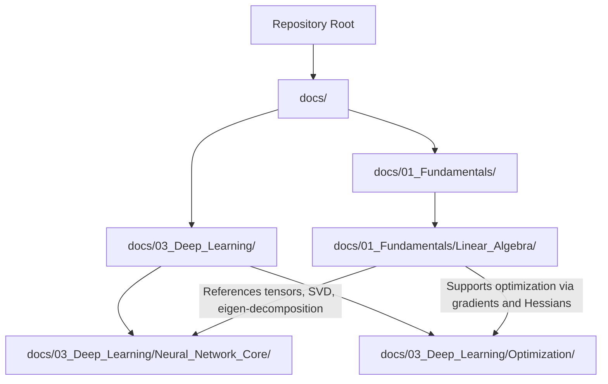

**Diagram sources**
- [README.md:1-30](file://README.md#L1-L30)
- [Linear_Algebra.md:1-60](file://docs/01_Fundamentals/Linear_Algebra/Linear_Algebra.md#L1-L60)
- [Neural_Network_Core.md:600-700](file://docs/03_Deep_Learning/Neural_Network_Core/Neural_Network_Core.md#L600-L700)
- [Optimization.md:500-530](file://docs/03_Deep_Learning/Optimization/Optimization.md#L500-L530)

**Section sources**
- [README.md:1-30](file://README.md#L1-L30)
- [README.md:29-59](file://docs/01_Fundamentals/README.md#L29-L59)

## Core Components
- Vector spaces and tensors: Representations of data and model parameters; central to neural networks and embeddings.
- Matrix operations and linear transformations: Basis for forward/backward passes, projections, and basis changes.
- Eigenvalues and eigenvectors: Characterize scaling and direction under linear maps; inform stability and principal directions.
- Singular value decomposition (SVD): Dimensionality reduction, noise filtering, and low-rank approximations.
- Symmetric, positive definite matrices: Convexity guarantees in optimization and meaningful spectral properties.

These components collectively ground modern AI systems in rigorous mathematical frameworks and enable efficient computation on GPUs/TPUs.

**Section sources**
- [Linear_Algebra.md:1-60](file://docs/01_Fundamentals/Linear_Algebra/Linear_Algebra.md#L1-L60)
- [Linear_Algebra.md:110-160](file://docs/01_Fundamentals/Linear_Algebra/Linear_Algebra.md#L110-L160)
- [Linear_Algebra.md:250-330](file://docs/01_Fundamentals/Linear_Algebra/Linear_Algebra.md#L250-L330)

## Architecture Overview
The linear algebra foundation supports downstream deep learning modules by providing:
- Data representation (tensors) and transformations (matrix/vector ops)
- Spectral understanding (eigen/SVD) for dimensionality reduction and stability
- Optimization machinery (gradients, Hessians) built atop vector calculus

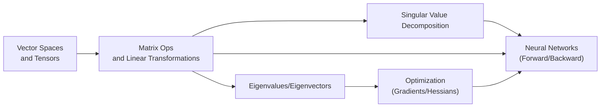

**Diagram sources**
- [Linear_Algebra.md:1-60](file://docs/01_Fundamentals/Linear_Algebra/Linear_Algebra.md#L1-L60)
- [Linear_Algebra.md:110-160](file://docs/01_Fundamentals/Linear_Algebra/Linear_Algebra.md#L110-L160)
- [Linear_Algebra.md:250-330](file://docs/01_Fundamentals/Linear_Algebra/Linear_Algebra.md#L250-L330)
- [Neural_Network_Core.md:600-700](file://docs/03_Deep_Learning/Neural_Network_Core/Neural_Network_Core.md#L600-L700)
- [Optimization.md:500-530](file://docs/03_Deep_Learning/Optimization/Optimization.md#L500-L530)

## Detailed Component Analysis

### Vector Spaces and Tensors
- Definition and intuition: A vector space is a set closed under addition and scalar multiplication; tensors generalize scalars, vectors, and matrices to arbitrary dimensions.
- Role in AI: Inputs, embeddings, model weights, and activations are represented as tensors. Operations on these tensors define computations in neural networks.
- Computational significance: Batched operations enable massive parallelization on accelerators.

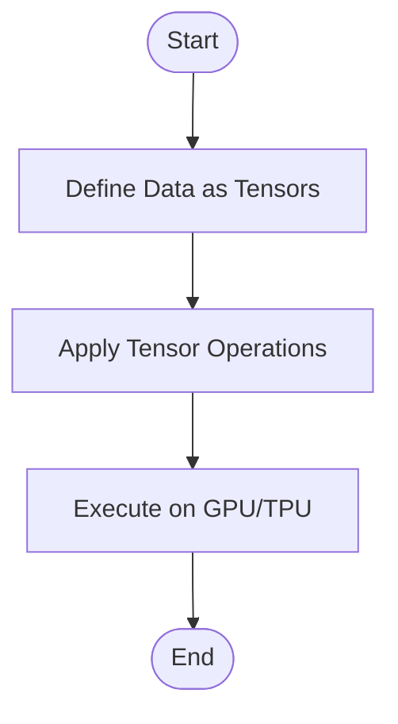

**Section sources**
- [Linear_Algebra.md:1-60](file://docs/01_Fundamentals/Linear_Algebra/Linear_Algebra.md#L1-L60)

### Matrix Operations and Linear Transformations
- Matrix-vector and matrix-matrix multiplications capture linear mappings.
- Geometric interpretation: Rotation, scaling, shearing, projection.
- Computational efficiency: Highly optimized BLAS/LAPACK libraries and hardware acceleration.

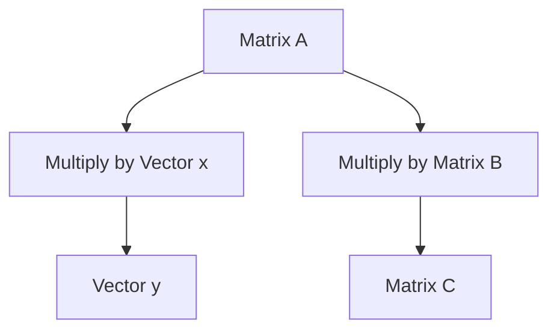

**Section sources**
- [Linear_Algebra.md:60-120](file://docs/01_Fundamentals/Linear_Algebra/Linear_Algebra.md#L60-L120)

### Eigenvalues and Eigenvectors
- Definition: For a square matrix A, a scalar λ and nonzero vector v satisfy Av = λv.
- Geometric meaning: Eigenvectors are directions unchanged by the transformation; eigenvalues quantify scaling along those directions.
- Applications:
  - Principal component analysis (PCA) via spectral decomposition
  - Stability analysis in dynamical systems
  - Understanding curvature in optimization (via Hessian spectrum)

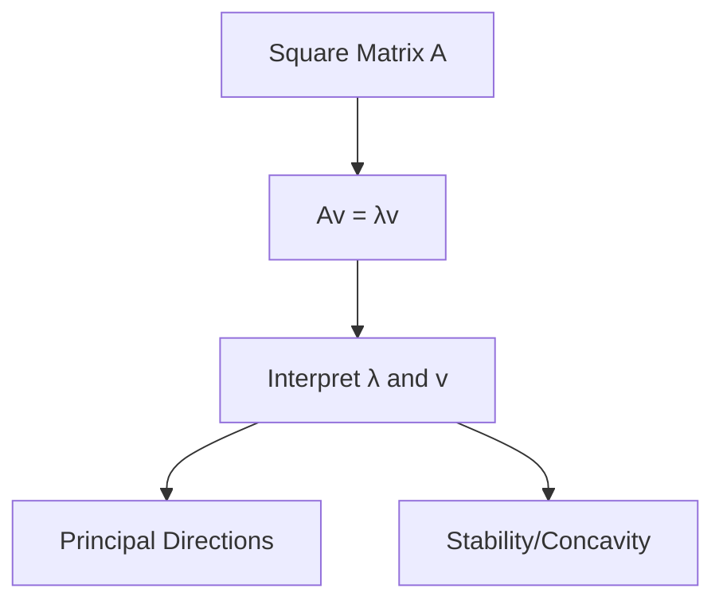

**Section sources**
- [Linear_Algebra.md:120-160](file://docs/01_Fundamentals/Linear_Algebra/Linear_Algebra.md#L120-L160)

### Singular Value Decomposition (SVD)
- Any matrix A can be decomposed as UΣV^T, where U and V are orthogonal and Σ contains singular values.
- Uses:
  - Dimensionality reduction (keep top-k singular values/vectors)
  - Noise suppression and robustness
  - Recommender systems and latent factor models

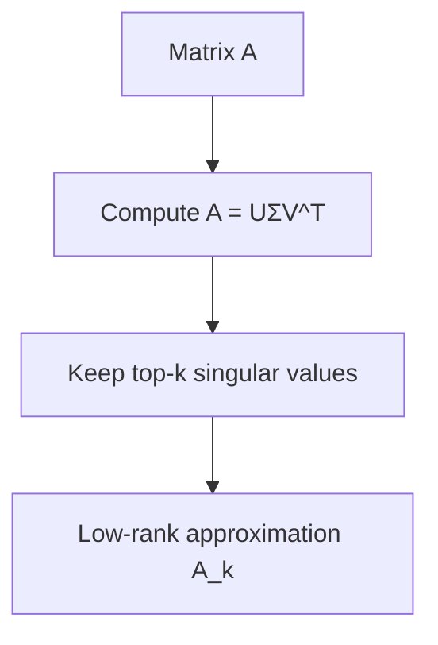

**Section sources**
- [Linear_Algebra.md:250-330](file://docs/01_Fundamentals/Linear_Algebra/Linear_Algebra.md#L250-L330)

### Symmetric and Positive Definite Matrices
- Symmetric matrices (A = A^T) have real eigenvalues and orthogonal eigenvectors.
- Positive definiteness (x^T Ax > 0) ensures convexity, crucial for convergence of optimization algorithms.

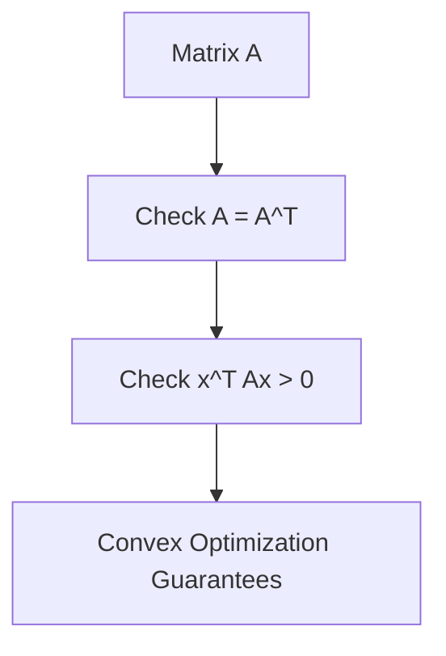

**Section sources**
- [Linear_Algebra.md:110-140](file://docs/01_Fundamentals/Linear_Algebra/Linear_Algebra.md#L110-L140)

### Neural Networks: From Linear Algebra to Computation
- Forward pass: Matrix-vector multiplications and nonlinearities define layer-wise transformations.
- Backpropagation: Gradients computed via the chain rule; matrix calculus underpins parameter updates.
- Practical example references:
  - Example tensor operations and gradient-enabled variables in neural network code.
  - Numerical checks for eigenvalues and SVD-based dimensionality reduction.

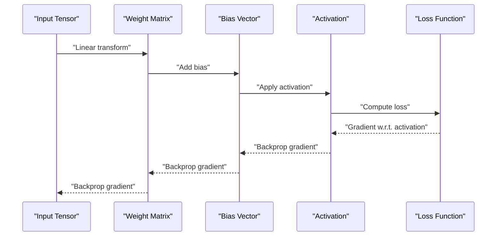

**Section sources**
- [Neural_Network_Core.md:660-680](file://docs/03_Deep_Learning/Neural_Network_Core/Neural_Network_Core.md#L660-L680)
- [Neural_Network_Core.md:940-960](file://docs/03_Deep_Learning/Neural_Network_Core/Neural_Network_Core.md#L940-L960)
- [Linear_Algebra.md:250-330](file://docs/01_Fundamentals/Linear_Algebra/Linear_Algebra.md#L250-L330)
- [Linear_Algebra.md:310-325](file://docs/01_Fundamentals/Linear_Algebra/Linear_Algebra.md#L310-L325)

### Optimization: Gradients, Hessians, and Convergence
- Gradient descent relies on vector derivatives; positive definiteness of the Hessian implies local convexity and convergence guarantees.
- Practical example references:
  - Gradient computation with parameter tensors requiring gradients.
  - Numerical routines for SVD and eigenvalue checks.

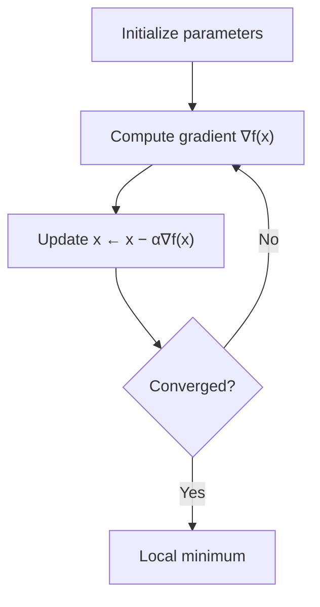

**Section sources**
- [Optimization.md:510-520](file://docs/03_Deep_Learning/Optimization/Optimization.md#L510-L520)
- [Linear_Algebra.md:110-140](file://docs/01_Fundamentals/Linear_Algebra/Linear_Algebra.md#L110-L140)
- [Linear_Algebra.md:250-330](file://docs/01_Fundamentals/Linear_Algebra/Linear_Algebra.md#L250-L330)

## Dependency Analysis
- Linear algebra underpins neural networks and optimization:
  - Tensors and matrix operations define computation graphs.
  - Eigen/SVD inform dimensionality reduction and stability.
  - Symmetric/positive definite matrices ensure favorable optimization geometry.

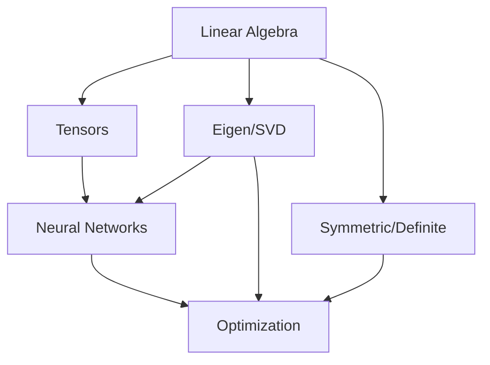

**Diagram sources**
- [Linear_Algebra.md:1-60](file://docs/01_Fundamentals/Linear_Algebra/Linear_Algebra.md#L1-L60)
- [Linear_Algebra.md:110-160](file://docs/01_Fundamentals/Linear_Algebra/Linear_Algebra.md#L110-L160)
- [Linear_Algebra.md:250-330](file://docs/01_Fundamentals/Linear_Algebra/Linear_Algebra.md#L250-L330)
- [Neural_Network_Core.md:660-680](file://docs/03_Deep_Learning/Neural_Network_Core/Neural_Network_Core.md#L660-L680)
- [Optimization.md:510-520](file://docs/03_Deep_Learning/Optimization/Optimization.md#L510-L520)

**Section sources**
- [Linear_Algebra.md:1-60](file://docs/01_Fundamentals/Linear_Algebra/Linear_Algebra.md#L1-L60)
- [Neural_Network_Core.md:660-680](file://docs/03_Deep_Learning/Neural_Network_Core/Neural_Network_Core.md#L660-L680)
- [Optimization.md:510-520](file://docs/03_Deep_Learning/Optimization/Optimization.md#L510-L520)

## Performance Considerations
- Parallelization: Matrix operations are highly parallelizable; leverage BLAS and accelerator libraries.
- Memory layout: Contiguous arrays and blocked algorithms improve cache locality.
- Numerical precision: Use appropriate precisions (FP32/FP64) and iterative refinement for ill-conditioned problems.
- SVD and eigen-decomposition: Exploit structure (symmetric, sparse) to reduce cost.

[No sources needed since this section provides general guidance]

## Troubleshooting Guide
Common pitfalls and misconceptions:
- Confusing order of operations in matrix multiplication and transposes.
- Misinterpreting eigenvalues as magnitudes of transformation rather than scaling factors along eigenvectors.
- Assuming all matrices behave like diagonalizable ones; handle generalized eigenvalue problems carefully.
- Overlooking numerical conditioning when computing SVD or solving linear systems.

Concrete checks:
- Verify orthogonality of eigenvectors and correctness of eigenvalue equations.
- Confirm SVD reconstruction quality by inspecting singular value decay.
- Monitor condition numbers to detect near-singular matrices.

**Section sources**
- [Linear_Algebra.md:120-160](file://docs/01_Fundamentals/Linear_Algebra/Linear_Algebra.md#L120-L160)
- [Linear_Algebra.md:250-330](file://docs/01_Fundamentals/Linear_Algebra/Linear_Algebra.md#L250-L330)
- [Linear_Algebra.md:310-325](file://docs/01_Fundamentals/Linear_Algebra/Linear_Algebra.md#L310-L325)

## Conclusion
Linear algebra is the backbone of modern AI. Vector spaces and tensors represent data and models; matrix operations implement computations; eigenvalues and SVD reveal structure and guide dimensionality reduction and optimization. By grounding abstract concepts in computational practice—through examples and numerical checks—we build intuition and reliability for real-world AI systems.

[No sources needed since this section summarizes without analyzing specific files]

## Appendices

### Step-by-Step Derivation: Change of Basis via SVD
- Goal: Express a matrix A in a new orthonormal basis.
- Steps:
  1. Compute A = UΣV^T.
  2. Use V to change to input basis, Σ to scale along principal directions, U to change to output basis.
- Significance: Rotation and scaling decoupled; useful for visualization and preconditioning.

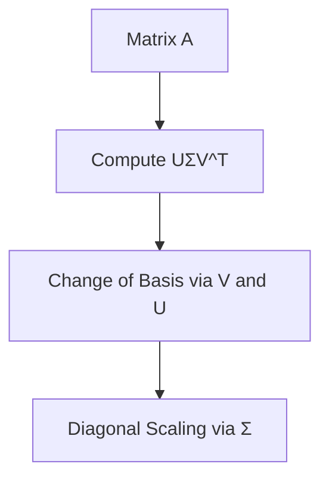

**Section sources**
- [Linear_Algebra.md:250-330](file://docs/01_Fundamentals/Linear_Algebra/Linear_Algebra.md#L250-L330)

### Practical Example References
- Neural network tensor operations and gradient computation:
  - [Neural_Network_Core.md:660-680](file://docs/03_Deep_Learning/Neural_Network_Core/Neural_Network_Core.md#L660-L680)
- Numerical SVD and eigenvalue checks:
  - [Linear_Algebra.md:250-330](file://docs/01_Fundamentals/Linear_Algebra/Linear_Algebra.md#L250-L330)
  - [Linear_Algebra.md:310-325](file://docs/01_Fundamentals/Linear_Algebra/Linear_Algebra.md#L310-L325)

**Section sources**
- [Neural_Network_Core.md:660-680](file://docs/03_Deep_Learning/Neural_Network_Core/Neural_Network_Core.md#L660-L680)
- [Linear_Algebra.md:250-330](file://docs/01_Fundamentals/Linear_Algebra/Linear_Algebra.md#L250-L330)
- [Linear_Algebra.md:310-325](file://docs/01_Fundamentals/Linear_Algebra/Linear_Algebra.md#L310-L325)