# Probability and Statistics Foundations

<cite>
**Referenced Files in This Document**
- [Probability_Statistics.md](file://docs/01_Fundamentals/Probability_Statistics/Probability_Statistics.md)
- [Probability_Statistics_for_dummy.md](file://docs/01_Fundamentals/Probability_Statistics/Probability_Statistics_for_dummy.md)
- [Model_Evaluation.md](file://docs/07_AI_Engineering/Model_Evaluation/Model_Evaluation.md)
- [Model_Evaluation_for_dummy.md](file://docs/07_AI_Engineering/Model_Evaluation/Model_Evaluation_for_dummy.md)
- [Supervised_Learning_for_dummy.md](file://docs/02_Machine_Learning/Supervised_Learning/Supervised_Learning_for_dummy.md)
- [Neural_Network_Core.md](file://docs/03_Deep_Learning/Neural_Network_Core/Neural_Network_Core.md)
</cite>

## Table of Contents
1. [Introduction](#introduction)
2. [Project Structure](#project-structure)
3. [Core Components](#core-components)
4. [Architecture Overview](#architecture-overview)
5. [Detailed Component Analysis](#detailed-component-analysis)
6. [Dependency Analysis](#dependency-analysis)
7. [Performance Considerations](#performance-considerations)
8. [Troubleshooting Guide](#troubleshooting-guide)
9. [Conclusion](#conclusion)
10. [Appendices](#appendices)

## Introduction
This document presents a comprehensive guide to probability and statistics fundamentals essential for AI/ML practitioners. It explains core concepts such as probability axioms, conditional probability, Bayes’ theorem, common distributions, frequentist versus Bayesian paradigms, estimation (MLE/MAP), information theory (entropy, cross-entropy, KL divergence), and practical applications in machine learning. The content follows a dual-language approach with English and Chinese terminology to enhance comprehension. It connects theoretical foundations to real-world problems and demonstrates the transition from basic probability to advanced statistical methods used in model evaluation and uncertainty quantification.

## Project Structure
The repository organizes materials across foundational topics, machine learning, deep learning, and AI engineering. For this document, we focus on:
- Probability and statistics fundamentals
- Model evaluation and statistical inference
- Supervised learning and neural networks

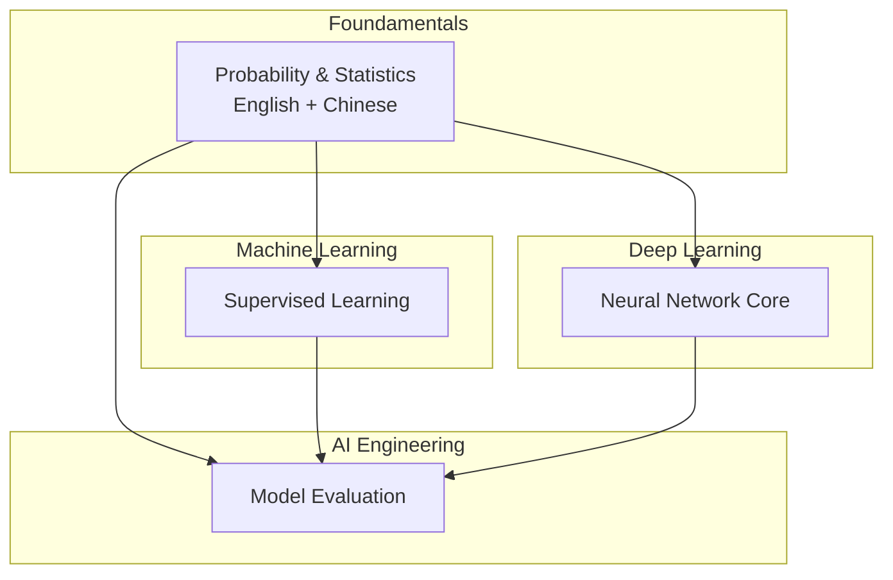

[No sources needed since this diagram shows conceptual structure, not direct code mapping]

## Core Components
- Probability basics: axioms, conditional probability, independence, and Bayes’ theorem
- Distributions: discrete and continuous families with AI applications
- Estimation: maximum likelihood estimation (MLE) and maximum a posteriori (MAP)
- Information theory: entropy, cross-entropy, and KL divergence
- Practical ML applications: cross-entropy loss, naive Bayes, variational autoencoders, policy gradients
- Model evaluation: metrics, AUC/ROC, PR curves, cross-validation, significance testing

**Section sources**
- [Probability_Statistics.md: 28–160:28-160](file://docs/01_Fundamentals/Probability_Statistics/Probability_Statistics.md#L28-L160)
- [Model_Evaluation.md: 25–127:25-127](file://docs/07_AI_Engineering/Model_Evaluation/Model_Evaluation.md#L25-L127)

## Architecture Overview
The learning pipeline integrates probability theory into ML practice:
- Probability theory underpins modeling uncertainty and inference
- Estimation techniques (MLE/MAP) train models and quantify parameter uncertainty
- Information theory defines loss functions and regularization
- Model evaluation applies statistical tests and metrics to assess generalization

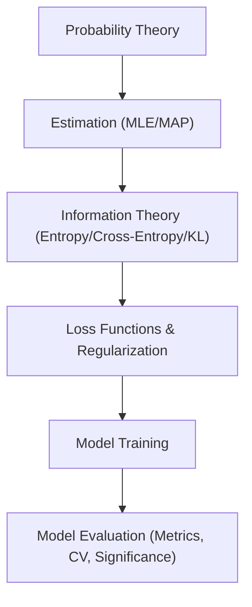

[No sources needed since this diagram shows conceptual workflow, not actual code structure]

## Detailed Component Analysis

### Probability Basics and Terminology
- Kolmogorov axioms define probability spaces
- Conditional probability and independence form the foundation for graphical models and Naive Bayes
- Bayes’ theorem unifies prior beliefs, evidence, and posteriors

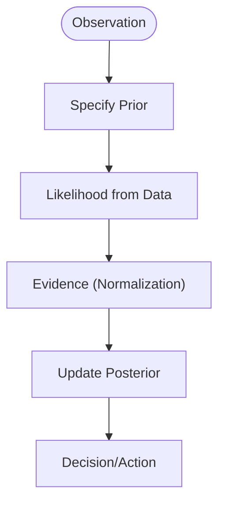

**Section sources**
- [Probability_Statistics.md: 30–48:30-48](file://docs/01_Fundamentals/Probability_Statistics/Probability_Statistics.md#L30-L48)
- [Probability_Statistics.md: 52–93:52-93](file://docs/01_Fundamentals/Probability_Statistics/Probability_Statistics.md#L52-L93)

### Distributions and Their AI Applications
- Discrete: Bernoulli, Binomial, Multinomial, Poisson
- Continuous: Uniform, Normal, Exponential, Beta, Dirichlet
- Shape intuition and typical use cases in modeling weights, noise, and class probabilities

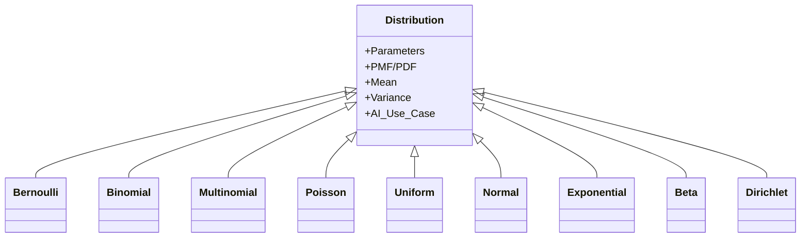

**Section sources**
- [Probability_Statistics.md: 105–144:105-144](file://docs/01_Fundamentals/Probability_Statistics/Probability_Statistics.md#L105-L144)

### Frequentist vs Bayesian Paradigms
- Frequentist: long-run frequencies, point estimates (e.g., MLE)
- Bayesian: explicit priors, posterior distributions, credible intervals
- Practical implications: regularization, uncertainty quantification, and robustness

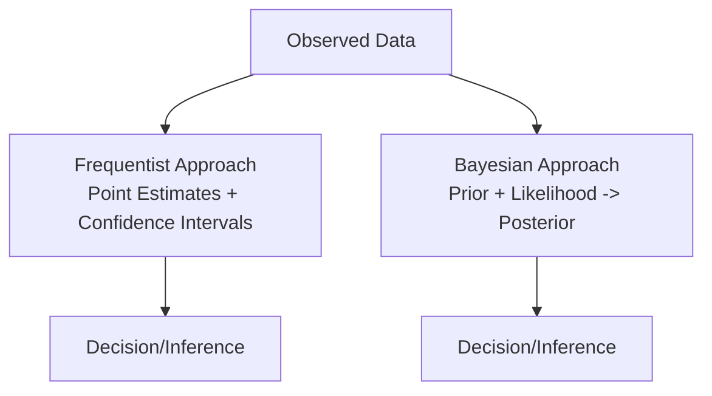

**Section sources**
- [Probability_Statistics.md: 148–160:148-160](file://docs/01_Fundamentals/Probability_Statistics/Probability_Statistics.md#L148-L160)

### Maximum Likelihood Estimation (MLE)
- Objective: maximize the likelihood of observed data
- Numerical stability: optimize log-likelihood
- Example: Gaussian MLE yields sample mean and biased variance

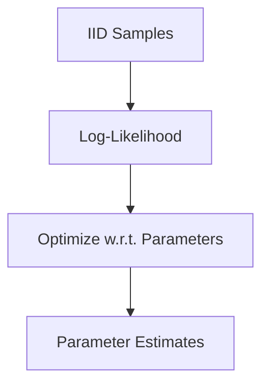

**Section sources**
- [Probability_Statistics.md: 165–194:165-194](file://docs/01_Fundamentals/Probability_Statistics/Probability_Statistics.md#L165-L194)

### Maximum A Posteriori (MAP) and Regularization
- Incorporates prior beliefs into estimation
- MAP equals MLE plus log-prior penalty
- Common priors: Ridge (L2) and Lasso (L1) regularization

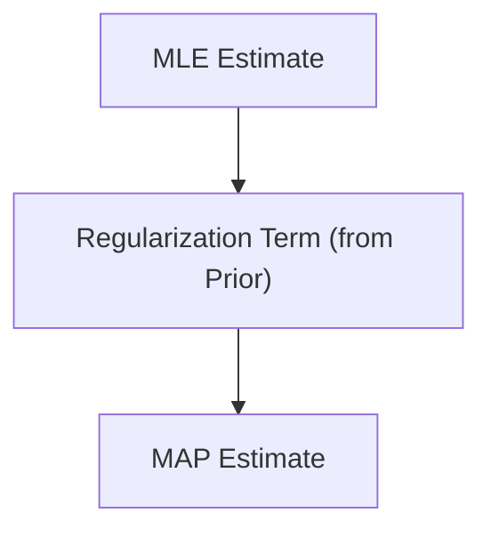

**Section sources**
- [Probability_Statistics.md: 197–242:197-242](file://docs/01_Fundamentals/Probability_Statistics/Probability_Statistics.md#L197-L242)

### Information Theory: Entropy, Cross-Entropy, and KL Divergence
- Entropy measures uncertainty
- Cross-entropy measures coding cost under an incorrect distribution
- KL divergence quantifies difference between distributions
- Practical: cross-entropy loss aligns with MLE and gradient-friendly forms

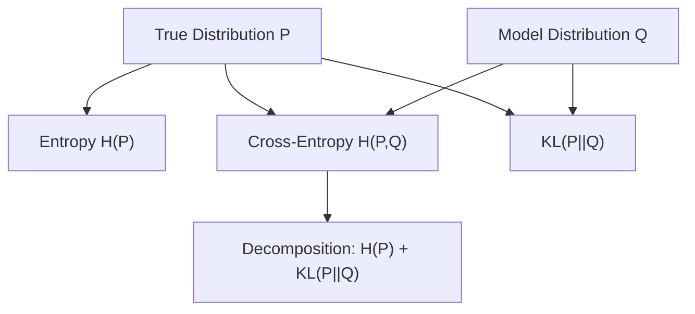

**Section sources**
- [Probability_Statistics.md: 245–295:245-295](file://docs/01_Fundamentals/Probability_Statistics/Probability_Statistics.md#L245-L295)

### Practical ML Applications
- Cross-entropy loss in neural networks
- Variational autoencoders with KL regularization
- Policy gradients with entropy bonus for exploration

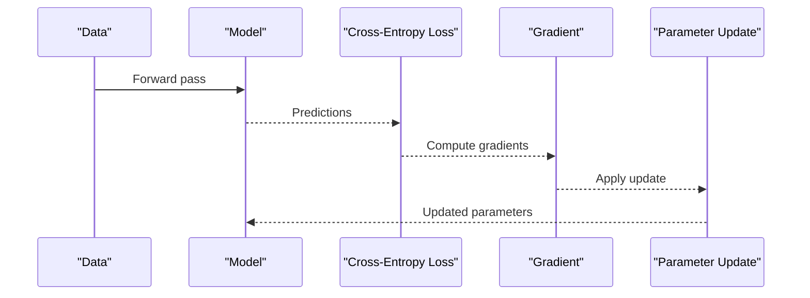

**Section sources**
- [Probability_Statistics.md: 440–475:440-475](file://docs/01_Fundamentals/Probability_Statistics/Probability_Statistics.md#L440-L475)

### Model Evaluation and Statistical Inference
- Classification metrics: confusion matrix, precision/recall/F1, specificity, AUC-ROC, PR curves
- Regression metrics: MSE, RMSE, MAE, MAPE, R²
- Cross-validation and significance testing
- Calibration and fairness assessment

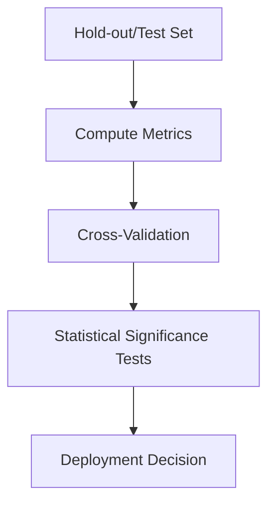

**Section sources**
- [Model_Evaluation.md: 25–127:25-127](file://docs/07_AI_Engineering/Model_Evaluation/Model_Evaluation.md#L25-L127)
- [Model_Evaluation.md: 177–213:177-213](file://docs/07_AI_Engineering/Model_Evaluation/Model_Evaluation.md#L177-L213)
- [Model_Evaluation.md: 314–344:314-344](file://docs/07_AI_Engineering/Model_Evaluation/Model_Evaluation.md#L314-L344)

### Transition to Advanced Methods
- From basic probability to estimation (MLE/MAP)
- From estimation to information-theoretic losses (cross-entropy)
- From losses to evaluation and uncertainty quantification (calibration, significance)

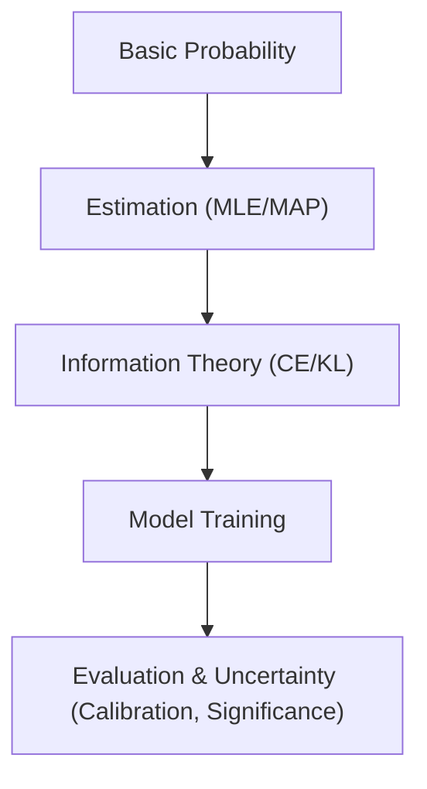

**Section sources**
- [Probability_Statistics.md: 165–295:165-295](file://docs/01_Fundamentals/Probability_Statistics/Probability_Statistics.md#L165-L295)
- [Model_Evaluation.md: 314–344:314-344](file://docs/07_AI_Engineering/Model_Evaluation/Model_Evaluation.md#L314-L344)

## Dependency Analysis
- Probability and statistics underpin supervised learning and deep learning
- Model evaluation depends on sound statistical inference and appropriate metrics
- Neural network training relies on information-theoretic losses derived from probability theory

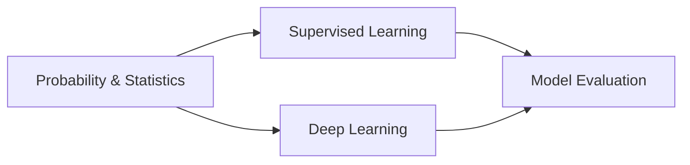

[No sources needed since this diagram shows conceptual relationships, not direct code mapping]

**Section sources**
- [Supervised_Learning_for_dummy.md: 1–201:1-201](file://docs/02_Machine_Learning/Supervised_Learning/Supervised_Learning_for_dummy.md#L1-L201)
- [Neural_Network_Core.md: 1–100:1-100](file://docs/03_Deep_Learning/Neural_Network_Core/Neural_Network_Core.md#L1-L100)

## Performance Considerations
- Choose metrics aligned with business goals and data distribution
- Use stratified cross-validation to reduce variance and bias
- Calibrate model probabilities to improve reliability in downstream decisions
- Monitor for class imbalance and apply appropriate thresholds or sampling strategies

[No sources needed since this section provides general guidance]

## Troubleshooting Guide
Common pitfalls and remedies:
- Misinterpreting p-values and confusing frequentist coverage with posterior probability
- Over-relying on accuracy in imbalanced datasets; prefer precision/recall/F1 or PR-AUC
- Ignoring calibration; use Platt scaling or temperature scaling
- Forgetting to account for multiple comparisons when evaluating many models

**Section sources**
- [Probability_Statistics.md: 504–514:504-514](file://docs/01_Fundamentals/Probability_Statistics/Probability_Statistics.md#L504-L514)
- [Model_Evaluation.md: 338–344:338-344](file://docs/07_AI_Engineering/Model_Evaluation/Model_Evaluation.md#L338-L344)

## Conclusion
Probability and statistics provide the mathematical backbone for AI/ML systems. By mastering probability axioms, Bayes’ theorem, estimation, and information theory, practitioners can build robust models, select appropriate evaluation metrics, and quantify uncertainty. The repository’s materials bridge theory and practice, offering both conceptual clarity and hands-on insights for real-world problem solving.

[No sources needed since this section summarizes without analyzing specific files]

## Appendices

### Appendix A: Terminology Reference (English–Chinese)
- Probability: 概率 (probability)
- Conditional probability: 条件概率 (conditional probability)
- Bayes’ theorem: 贝叶斯定理 (Bayes’ theorem)
- Prior: 先验 (prior)
- Likelihood: 似然 (likelihood)
- Posterior: 后验 (posterior)
- Evidence: 证据 (evidence)
- MLE: 最大似然估计 (maximum likelihood estimation)
- MAP: 最大后验估计 (maximum a posteriori)
- Entropy: 熵 (entropy)
- Cross-entropy: 交叉熵 (cross-entropy)
- KL divergence: KL 散度 (Kullback–Leibler divergence)
- Confusion matrix: 混淆矩阵 (confusion matrix)
- AUC-ROC: AUC-ROC 曲线 (AUC-ROC curve)
- PR curve: PR 曲线 (precision-recall curve)
- Calibration: 校准 (calibration)

[No sources needed since this section provides glossary, not code analysis]