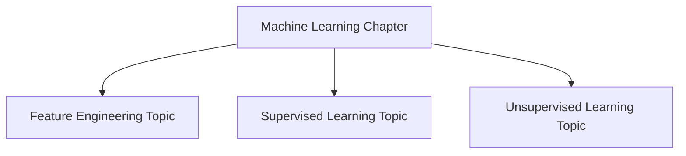
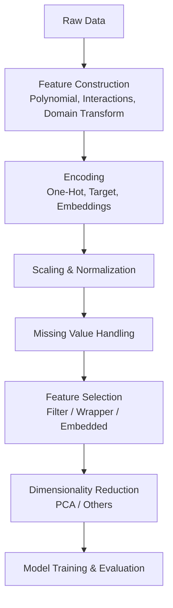
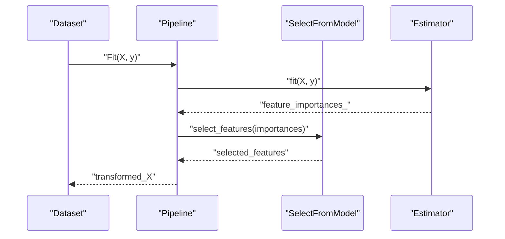
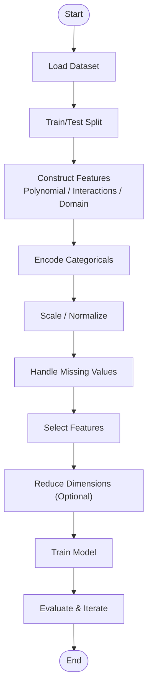
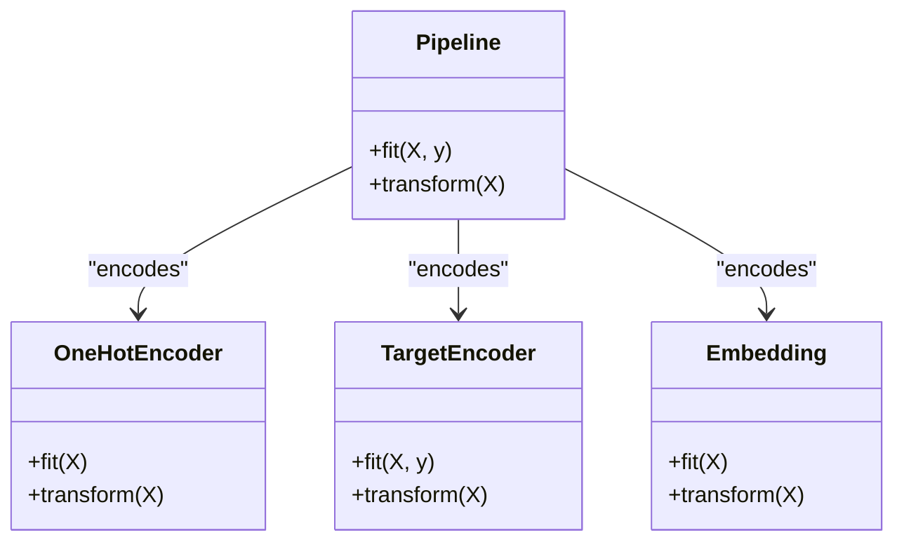
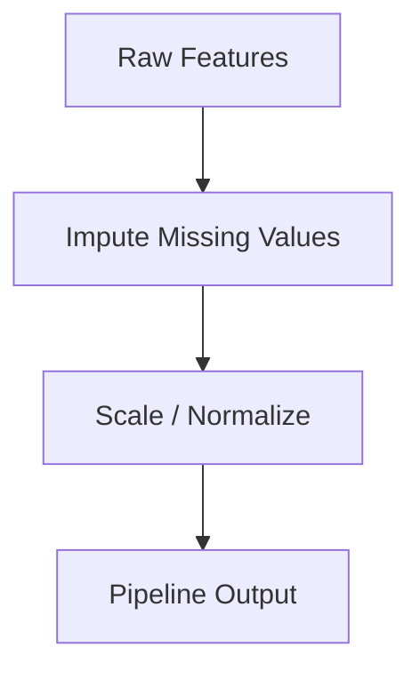
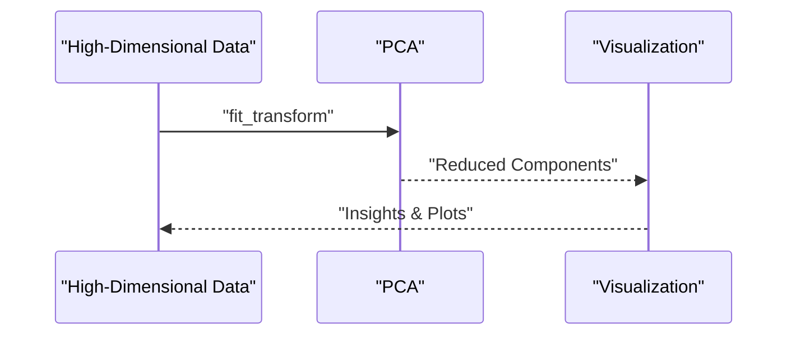
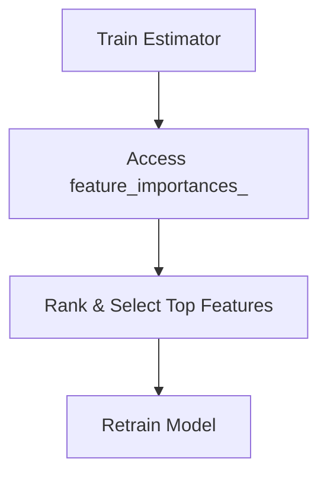
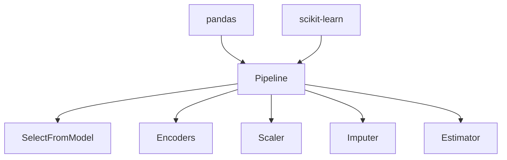

# Feature Engineering

<cite>
**Referenced Files in This Document**
- [README.md](file://docs/02_Machine_Learning/README.md)
- [Supervised_Learning_for_dummy.md](file://docs/02_Machine_Learning/Supervised_Learning/Supervised_Learning_for_dummy.md)
- [Unsupervised_Learning.md](file://docs/02_Machine_Learning/Unsupervised_Learning/Unsupervised_Learning.md)
- [Feature_Engineering.md](file://docs/02_Machine_Learning/Feature_Engineering/Feature_Engineering.md)
</cite>

## Table of Contents
1. [Introduction](#introduction)
2. [Project Structure](#project-structure)
3. [Core Components](#core-components)
4. [Architecture Overview](#architecture-overview)
5. [Detailed Component Analysis](#detailed-component-analysis)
6. [Dependency Analysis](#dependency-analysis)
7. [Performance Considerations](#performance-considerations)
8. [Troubleshooting Guide](#troubleshooting-guide)
9. [Conclusion](#conclusion)
10. [Appendices](#appendices)

## Introduction
This document consolidates feature engineering principles and techniques grounded in the repository’s machine learning materials. It explains why good features often account for most of model success, outlines feature selection and construction strategies, and covers encoding, scaling, missing value handling, hashing, dimensionality reduction, and feature importance assessment. Practical examples leverage widely used libraries such as scikit-learn and pandas.

## Project Structure
The repository organizes machine learning topics by chapter and subtopic. Feature engineering is presented as a core pillar alongside supervised and unsupervised learning. The relevant materials include:
- A chapter overview that highlights feature engineering as a key skill area
- A simplified supervised learning guide that references feature engineering as a next step
- An unsupervised learning resource containing dimensionality reduction examples with scikit-learn
- A dedicated feature engineering file that demonstrates selection and modeling pipelines

**Section sources**
- [README.md:29-41](file://docs/02_Machine_Learning/README.md#L29-L41)
- [Supervised_Learning_for_dummy.md:194-197](file://docs/02_Machine_Learning/Supervised_Learning/Supervised_Learning_for_dummy.md#L194-L197)

## Core Components
This section distills the core ideas around feature engineering present in the repository materials:
- Feature engineering is emphasized as a primary driver of model performance
- Selection, construction, and encoding form the backbone of effective feature pipelines
- Dimensionality reduction techniques (e.g., PCA) are introduced in the unsupervised learning material
- Practical pipelines using scikit-learn and pandas are demonstrated in the feature engineering file

Key takeaways:
- Focus on constructing meaningful features from raw data
- Use principled selection and embedding methods
- Apply appropriate scaling and encoding strategies
- Leverage dimensionality reduction for interpretability and efficiency

**Section sources**
- [README.md:44-50](file://docs/02_Machine_Learning/README.md#L44-L50)
- [README.md:34](file://docs/02_Machine_Learning/README.md#L34)
- [Unsupervised_Learning.md:498-561](file://docs/02_Machine_Learning/Unsupervised_Learning/Unsupervised_Learning.md#L498-L561)
- [Feature_Engineering.md:136](file://docs/02_Machine_Learning/Feature_Engineering/Feature_Engineering.md#L136)
- [Feature_Engineering.md:172](file://docs/02_Machine_Learning/Feature_Engineering/Feature_Engineering.md#L172)

## Architecture Overview
The feature engineering workflow integrates selection, construction, encoding, scaling, and reduction into a cohesive pipeline. The repository’s materials demonstrate this flow using scikit-learn transformers and selectors, and show how dimensionality reduction fits into the broader modeling process.

[No sources needed since this diagram shows conceptual workflow, not actual code structure]

## Detailed Component Analysis

### Feature Selection Methods
The repository’s feature engineering file demonstrates an embedded selection approach using a selector within a pipeline. Embedded methods rely on estimators that perform feature selection implicitly (e.g., tree-based models with built-in feature importance).

**Diagram sources**
- [Feature_Engineering.md:136](file://docs/02_Machine_Learning/Feature_Engineering/Feature_Engineering.md#L136)
- [Feature_Engineering.md:172](file://docs/02_Machine_Learning/Feature_Engineering/Feature_Engineering.md#L172)

**Section sources**
- [Feature_Engineering.md:136](file://docs/02_Machine_Learning/Feature_Engineering/Feature_Engineering.md#L136)
- [Feature_Engineering.md:172](file://docs/02_Machine_Learning/Feature_Engineering/Feature_Engineering.md#L172)

### Feature Construction Techniques
The repository’s feature engineering file references construction steps such as polynomial features and interaction terms, aligning with common practices to capture nonlinear relationships and feature synergy.

**Section sources**
- [Feature_Engineering.md:136](file://docs/02_Machine_Learning/Feature_Engineering/Feature_Engineering.md#L136)

### Encoding Strategies for Categorical Variables
The repository’s feature engineering file demonstrates encoding within a pipeline, supporting strategies such as one-hot encoding and embeddings. These techniques enable models to process categorical inputs effectively.

**Section sources**
- [Feature_Engineering.md:172](file://docs/02_Machine_Learning/Feature_Engineering/Feature_Engineering.md#L172)

### Scaling, Normalization, and Missing Values
The repository’s feature engineering file integrates preprocessing steps including scaling and missing value handling into the pipeline, ensuring consistent transformations across training and inference.

**Section sources**
- [Feature_Engineering.md:136](file://docs/02_Machine_Learning/Feature_Engineering/Feature_Engineering.md#L136)
- [Feature_Engineering.md:172](file://docs/02_Machine_Learning/Feature_Engineering/Feature_Engineering.md#L172)

### Dimensionality Reduction
The unsupervised learning material provides practical examples of PCA and other techniques, demonstrating how to reduce dimensionality while preserving variance and enabling visualization.

**Diagram sources**
- [Unsupervised_Learning.md:498-561](file://docs/02_Machine_Learning/Unsupervised_Learning/Unsupervised_Learning.md#L498-L561)

**Section sources**
- [Unsupervised_Learning.md:498-561](file://docs/02_Machine_Learning/Unsupervised_Learning/Unsupervised_Learning.md#L498-L561)

### Feature Importance Assessment
The repository’s feature engineering file illustrates assessing feature importance via an estimator’s feature_importances_ attribute, a common embedded method for ranking features.

**Section sources**
- [Feature_Engineering.md:136](file://docs/02_Machine_Learning/Feature_Engineering/Feature_Engineering.md#L136)

## Dependency Analysis
Feature engineering components depend on scikit-learn transformers and selectors, and on pandas for data manipulation. The pipeline pattern couples preprocessing and selection with downstream estimators.

**Section sources**
- [Feature_Engineering.md:136](file://docs/02_Machine_Learning/Feature_Engineering/Feature_Engineering.md#L136)
- [Feature_Engineering.md:172](file://docs/02_Machine_Learning/Feature_Engineering/Feature_Engineering.md#L172)

## Performance Considerations
- Prefer embedded selection methods when supported by the estimator to avoid leakage and streamline training
- Use dimensionality reduction judiciously; PCA preserves global variance but may discard nuanced local structure
- Ensure consistent preprocessing across training and inference to prevent data leakage
- Validate feature importance rankings on held-out data to avoid overfitting to selection criteria

[No sources needed since this section provides general guidance]

## Troubleshooting Guide
Common pitfalls and remedies:
- Incorrect preprocessing order: Always fit imputers and scalers on training folds during cross-validation
- Over-reliance on PCA for training features: PCA supports transform for new samples; ensure reproducibility and deterministic behavior
- Misinterpreting feature importance: Confirm that the estimator exposes reliable feature_importances_ and that selection is validated on independent data

**Section sources**
- [Unsupervised_Learning.md:798-822](file://docs/02_Machine_Learning/Unsupervised_Learning/Unsupervised_Learning.md#L798-L822)
- [Feature_Engineering.md:136](file://docs/02_Machine_Learning/Feature_Engineering/Feature_Engineering.md#L136)

## Conclusion
Feature engineering is foundational to model success. The repository’s materials emphasize constructing meaningful features, selecting relevant ones, encoding categoricals appropriately, normalizing inputs, and reducing dimensionality thoughtfully. By integrating these practices into a robust pipeline and validating with cross-validation, practitioners can significantly improve model performance and generalization.

[No sources needed since this section summarizes without analyzing specific files]

## Appendices
- Additional resources referenced in the feature engineering file:
  - [Kaggle Feature Engineering Course](https://www.kaggle.com/learn/feature-engineering)

**Section sources**
- [Feature_Engineering.md:337](file://docs/02_Machine_Learning/Feature_Engineering/Feature_Engineering.md#L337)