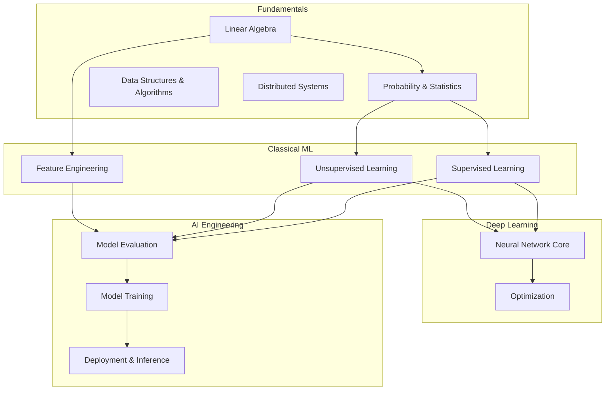
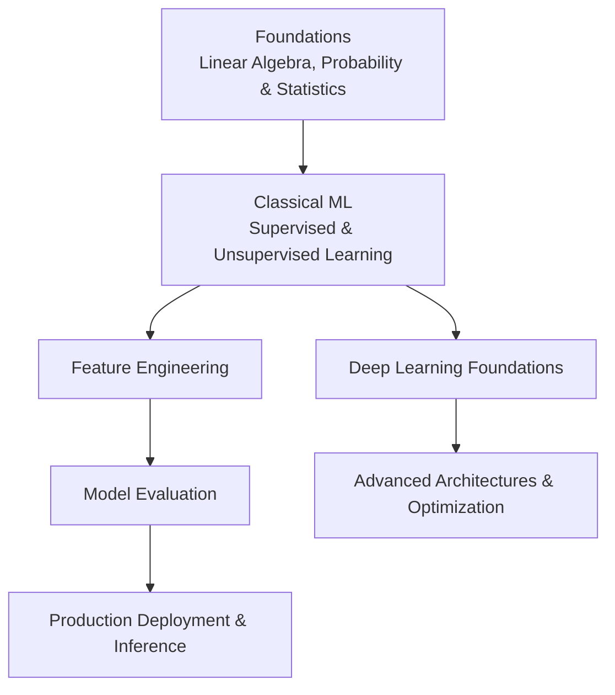
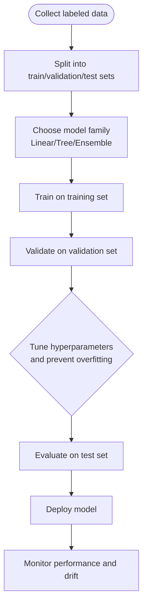
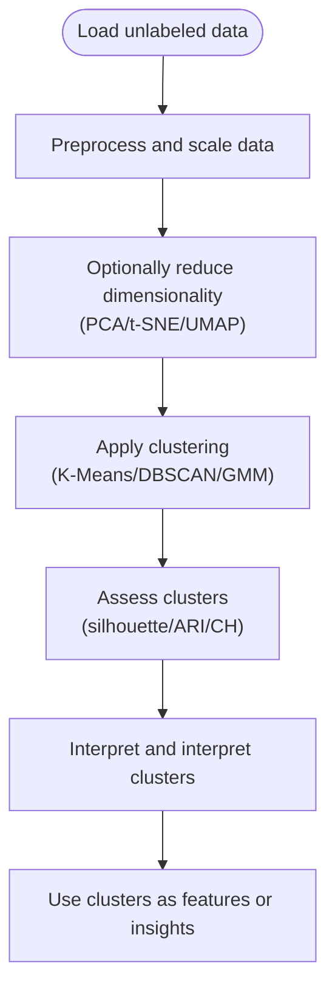
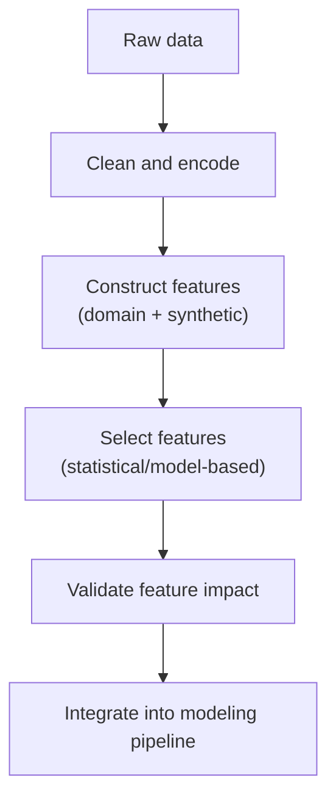
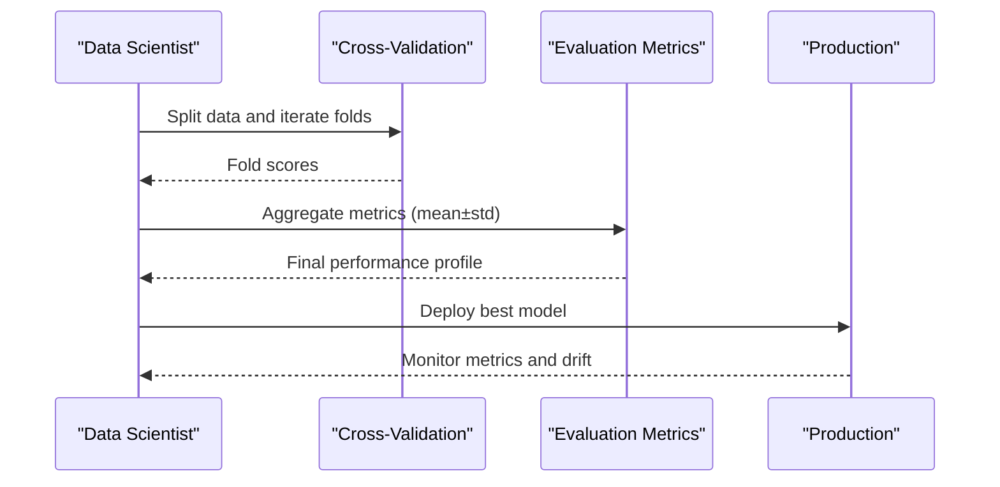
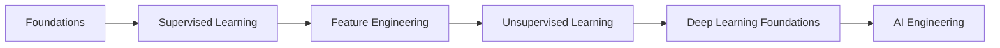
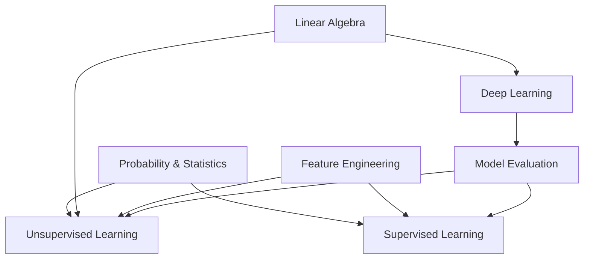

# Machine Learning Education

<cite>
**Referenced Files in This Document**
- [README.md](file://docs/02_Machine_Learning/README.md)
- [README_for_dummy.md](file://docs/02_Machine_Learning/README_for_dummy.md)
- [Supervised_Learning_for_dummy.md](file://docs/02_Machine_Learning/Supervised_Learning/Supervised_Learning_for_dummy.md)
- [Unsupervised_Learning.md](file://docs/02_Machine_Learning/Unsupervised_Learning/Unsupervised_Learning.md)
- [Probability_Statistics.md](file://docs/01_Fundamentals/Probability_Statistics/Probability_Statistics.md)
- [README.md](file://docs/01_Fundamentals/README.md)
- [Model_Evaluation.md](file://docs/07_AI_Engineering/Model_Evaluation/Model_Evaluation.md)
- [README.md](file://docs/03_Deep_Learning/README.md)
</cite>

## Table of Contents
1. [Introduction](#introduction)
2. [Project Structure](#project-structure)
3. [Core Components](#core-components)
4. [Architecture Overview](#architecture-overview)
5. [Detailed Component Analysis](#detailed-component-analysis)
6. [Dependency Analysis](#dependency-analysis)
7. [Performance Considerations](#performance-considerations)
8. [Troubleshooting Guide](#troubleshooting-guide)
9. [Conclusion](#conclusion)
10. [Appendices](#appendices)

## Introduction
This document presents a comprehensive machine learning education curriculum grounded in the repository’s pedagogical materials. It explains the supervised and unsupervised learning frameworks, feature engineering principles, and the systematic progression from basic algorithms to advanced techniques. The curriculum emphasizes simplified explanations for ML concepts, integrates theoretical foundations with practical applications, and supports bilingual terminology for both English and Chinese technical vocabulary. It also details the learning path from fundamentals to advanced ML techniques, including algorithm complexity analysis, model evaluation methodologies, and real-world implementation strategies, while maintaining a balance between mathematical rigor and practical applicability.

## Project Structure
The curriculum is organized into thematic chapters that progressively build knowledge and skills:
- Fundamentals: Linear algebra, probability and statistics, data structures and algorithms, distributed systems
- Classical Machine Learning: Supervised learning, unsupervised learning, feature engineering
- Deep Learning Foundations: Neural network core, optimization
- AI Engineering: Model evaluation, training, deployment, inference
- Additional topics: NLP/LLMs, Computer Vision, Reinforcement Learning, Ethics and Safety

**Diagram sources**
- [README.md:1-59](file://docs/01_Fundamentals/README.md#L1-L59)
- [README.md:1-58](file://docs/02_Machine_Learning/README.md#L1-L58)
- [README.md:1-50](file://docs/03_Deep_Learning/README.md#L1-L50)

**Section sources**
- [README.md:1-59](file://docs/01_Fundamentals/README.md#L1-L59)
- [README.md:1-58](file://docs/02_Machine_Learning/README.md#L1-L58)
- [README.md:1-50](file://docs/03_Deep_Learning/README.md#L1-L50)

## Core Components
- Supervised Learning: Classification and regression tasks, linear/logistic regression, decision trees, ensemble methods (bagging/boosting), overfitting/underfitting, regularization, cross-validation, and gradient boosting machines.
- Unsupervised Learning: Clustering (K-Means, hierarchical clustering, DBSCAN, GMM), dimensionality reduction (PCA, t-SNE, UMAP), anomaly detection (Isolation Forest), and evaluation metrics (silhouette score, ARI, CH index).
- Feature Engineering: Feature selection, construction, encoding, and leveraging unsupervised techniques (e.g., clustering labels) as engineered features.
- Model Evaluation: Classification metrics (confusion matrix, precision/recall/F1, AUC-ROC, PR curves), regression metrics (MSE/RMSE/MAE/MAPE/R²), ranking metrics (NDCG/MAP/MRR/HIT), cross-validation strategies, and LLM-as-Judge assessment.
- Deep Learning Foundations: Neural networks, activation functions, backpropagation, normalization, optimizers (Adam/AdamW), regularization (Dropout, weight decay), residual connections.
- Probabilistic Foundations: Probability axioms, Bayes’ theorem, common distributions, frequentist vs Bayesian paradigms, MLE/MAP estimation.

**Section sources**
- [Supervised_Learning_for_dummy.md:1-201](file://docs/02_Machine_Learning/Supervised_Learning/Supervised_Learning_for_dummy.md#L1-L201)
- [Unsupervised_Learning.md:1-952](file://docs/02_Machine_Learning/Unsupervised_Learning/Unsupervised_Learning.md#L1-L952)
- [Model_Evaluation.md:1-397](file://docs/07_AI_Engineering/Model_Evaluation/Model_Evaluation.md#L1-L397)
- [README.md:1-50](file://docs/03_Deep_Learning/README.md#L1-L50)
- [Probability_Statistics.md:1-622](file://docs/01_Fundamentals/Probability_Statistics/Probability_Statistics.md#L1-L622)

## Architecture Overview
The curriculum follows a layered architecture:
- Foundational layer: Mathematics and probability underpin all ML concepts.
- Core ML layer: Supervised and unsupervised learning form the backbone of classical ML.
- Advanced ML layer: Deep learning builds upon core ML with neural architectures and optimization.
- Engineering layer: Model evaluation, training, and deployment operationalize ML systems.

**Diagram sources**
- [README.md:1-59](file://docs/01_Fundamentals/README.md#L1-L59)
- [README.md:1-58](file://docs/02_Machine_Learning/README.md#L1-L58)
- [README.md:1-50](file://docs/03_Deep_Learning/README.md#L1-L50)
- [Model_Evaluation.md:1-397](file://docs/07_AI_Engineering/Model_Evaluation/Model_Evaluation.md#L1-L397)

## Detailed Component Analysis

### Supervised Learning Framework
Supervised learning teaches learners how models generalize from labeled examples to new data. The framework covers:
- Task types: classification (discrete outcomes) and regression (continuous outcomes)
- Algorithms: linear/logistic regression, decision trees, support vector machines, ensemble methods
- Overfitting/underfitting diagnostics and remedies: regularization, cross-validation, data augmentation
- Gradient boosting machines (XGBoost/LightGBM) for tabular data

**Diagram sources**
- [Supervised_Learning_for_dummy.md:160-180](file://docs/02_Machine_Learning/Supervised_Learning/Supervised_Learning_for_dummy.md#L160-L180)

**Section sources**
- [Supervised_Learning_for_dummy.md:1-201](file://docs/02_Machine_Learning/Supervised_Learning/Supervised_Learning_for_dummy.md#L1-L201)

### Unsupervised Learning Framework
Unsupervised learning discovers hidden patterns in unlabeled data:
- Clustering: K-Means, hierarchical clustering, DBSCAN, GMM
- Dimensionality reduction: PCA, t-SNE, UMAP
- Anomaly detection: Isolation Forest, One-Class SVM, robust covariance
- Evaluation: internal metrics (silhouette, CH index), external metrics (ARI, NMI)

**Diagram sources**
- [Unsupervised_Learning.md:402-496](file://docs/02_Machine_Learning/Unsupervised_Learning/Unsupervised_Learning.md#L402-L496)

**Section sources**
- [Unsupervised_Learning.md:1-952](file://docs/02_Machine_Learning/Unsupervised_Learning/Unsupervised_Learning.md#L1-L952)

### Feature Engineering Principles
Feature engineering transforms raw data into signals that models can exploit:
- Data preprocessing: scaling, encoding categorical variables, handling missing values
- Feature construction: domain features, polynomial features, interaction terms
- Feature selection: statistical tests, model-based importance, recursive elimination
- Unsupervised features: use clustering labels or embeddings as new predictors

**Diagram sources**
- [Unsupervised_Learning.md:402-496](file://docs/02_Machine_Learning/Unsupervised_Learning/Unsupervised_Learning.md#L402-L496)

**Section sources**
- [Unsupervised_Learning.md:402-496](file://docs/02_Machine_Learning/Unsupervised_Learning/Unsupervised_Learning.md#L402-L496)

### Model Evaluation Methodologies
Evaluation ensures models generalize and meet business goals:
- Classification: confusion matrix, precision/recall/F1, AUC-ROC, PR curves
- Regression: MSE/RMSE/MAE/MAPE/R²
- Ranking: NDCG/MAP/MRR/HIT
- Cross-validation: K-Fold, stratified folds, time series forward chaining
- LLM-as-Judge: automated quality scoring for generation tasks

**Diagram sources**
- [Model_Evaluation.md:177-200](file://docs/07_AI_Engineering/Model_Evaluation/Model_Evaluation.md#L177-L200)

**Section sources**
- [Model_Evaluation.md:1-397](file://docs/07_AI_Engineering/Model_Evaluation/Model_Evaluation.md#L1-L397)

### Pedagogical Approach and Bilingual Terminology
- Simplified explanations: analogies and visualizations (e.g., “classification vs regression” as “multiple choice vs fill-in-the-blank”)
- Progressive scaffolding: beginner-friendly summaries followed by technical depth
- Bilingual glossaries: English and Chinese terms coexist to support multilingual learners
- Practical integration: hands-on code examples and real-world applications

**Section sources**
- [README_for_dummy.md:1-35](file://docs/02_Machine_Learning/README_for_dummy.md#L1-L35)
- [Supervised_Learning_for_dummy.md:1-201](file://docs/02_Machine_Learning/Supervised_Learning/Supervised_Learning_for_dummy.md#L1-L201)
- [README.md:43-55](file://docs/02_Machine_Learning/README.md#L43-L55)

### Learning Path Progression
The repository defines a structured learning path:
- Foundations: linear algebra and probability/statistics
- Classical ML: supervised learning → feature engineering → unsupervised learning
- Deep Learning: neural network core → optimization
- AI Engineering: model evaluation, training, deployment/inference

**Diagram sources**
- [README.md:5-27](file://docs/02_Machine_Learning/README.md#L5-L27)
- [README.md:5-27](file://docs/01_Fundamentals/README.md#L5-L27)
- [README.md:5-20](file://docs/03_Deep_Learning/README.md#L5-L20)

**Section sources**
- [README.md:5-27](file://docs/02_Machine_Learning/README.md#L5-L27)
- [README.md:5-27](file://docs/01_Fundamentals/README.md#L5-L27)
- [README.md:5-20](file://docs/03_Deep_Learning/README.md#L5-L20)

## Dependency Analysis
- Supervised learning depends on probabilistic reasoning and statistical estimation.
- Unsupervised learning relies on linear algebra (e.g., PCA) and probability (e.g., GMM).
- Feature engineering leverages unsupervised techniques to construct predictive features.
- Model evaluation requires understanding of probability distributions and hypothesis testing.
- Deep learning builds on foundational mathematics and supervised learning intuitions.

**Diagram sources**
- [Probability_Statistics.md:1-622](file://docs/01_Fundamentals/Probability_Statistics/Probability_Statistics.md#L1-L622)
- [Unsupervised_Learning.md:1-952](file://docs/02_Machine_Learning/Unsupervised_Learning/Unsupervised_Learning.md#L1-L952)
- [README.md:29-33](file://docs/03_Deep_Learning/README.md#L29-L33)

**Section sources**
- [Probability_Statistics.md:1-622](file://docs/01_Fundamentals/Probability_Statistics/Probability_Statistics.md#L1-L622)
- [README.md:29-33](file://docs/03_Deep_Learning/README.md#L29-L33)

## Performance Considerations
- Algorithmic complexity:
  - K-Means: O(n·K·I·d) per iteration; sensitive to initialization and outliers
  - DBSCAN: O(n log n) with KD-trees; parameter-sensitive
  - PCA: O(min(n·d², d·n²)); efficient for moderate sizes
  - t-SNE: O(n²); computationally expensive; not suitable for training features
  - UMAP: scalable; supports transform for new samples
- Practical tips:
  - Scale features before clustering and dimensionality reduction
  - Use elbow/silhouette methods for K selection
  - Prefer PCA for linear structure; UMAP for nonlinear manifolds
  - Avoid using t-SNE for downstream training; use PCA or Autoencoders instead

**Section sources**
- [Unsupervised_Learning.md:388-401](file://docs/02_Machine_Learning/Unsupervised_Learning/Unsupervised_Learning.md#L388-L401)
- [Unsupervised_Learning.md:818-822](file://docs/02_Machine_Learning/Unsupervised_Learning/Unsupervised_Learning.md#L818-L822)

## Troubleshooting Guide
Common pitfalls and remedies:
- Overfitting: apply regularization, increase data, simplify model, use cross-validation
- Poor clustering: check feature scaling, choose appropriate distance/similarity, tune parameters (ε, MinPts, K)
- Misuse of t-SNE: do not use for training features; visualize only; adjust perplexity
- High-dimensional data: apply PCA or UMAP before clustering; address curse of dimensionality
- Imbalanced datasets: use precision/recall/F1/AUC-PR; resampling or class weights as needed

**Section sources**
- [Supervised_Learning_for_dummy.md:124-147](file://docs/02_Machine_Learning/Supervised_Learning/Supervised_Learning_for_dummy.md#L124-L147)
- [Unsupervised_Learning.md:722-740](file://docs/02_Machine_Learning/Unsupervised_Learning/Unsupervised_Learning.md#L722-L740)
- [Unsupervised_Learning.md:818-822](file://docs/02_Machine_Learning/Unsupervised_Learning/Unsupervised_Learning.md#L818-L822)

## Conclusion
This curriculum systematically bridges foundational theory and practical ML, progressing from supervised and unsupervised learning to deep learning and engineering. It balances mathematical rigor with accessible explanations, integrates evaluation and real-world implementation, and supports bilingual terminology. Learners can advance from basic concepts to expert-level competency through structured pathways, hands-on practice, and continuous evaluation.

## Appendices

### Appendix A: Key Terminology (English–Chinese)
- Overfitting: 过拟合
- Regularization: 正则化
- Cross-validation: 交叉验证
- Ensemble learning: 集成学习
- Gradient boosting: 梯度提升
- Feature engineering: 特征工程
- Principal Component Analysis (PCA): 主成分分析
- t-Distributed Stochastic Neighbor Embedding (t-SNE): t-SNE
- K-Means: K-Means
- DBSCAN: DBSCAN

**Section sources**
- [README.md:43-55](file://docs/02_Machine_Learning/README.md#L43-L55)

### Appendix B: References and Further Reading
- Unsupervised learning references include seminal works on t-SNE, UMAP, DBSCAN, and isolation forests.
- Foundational texts and courses referenced in the curriculum support deeper study.

**Section sources**
- [Unsupervised_Learning.md:921-952](file://docs/02_Machine_Learning/Unsupervised_Learning/Unsupervised_Learning.md#L921-L952)