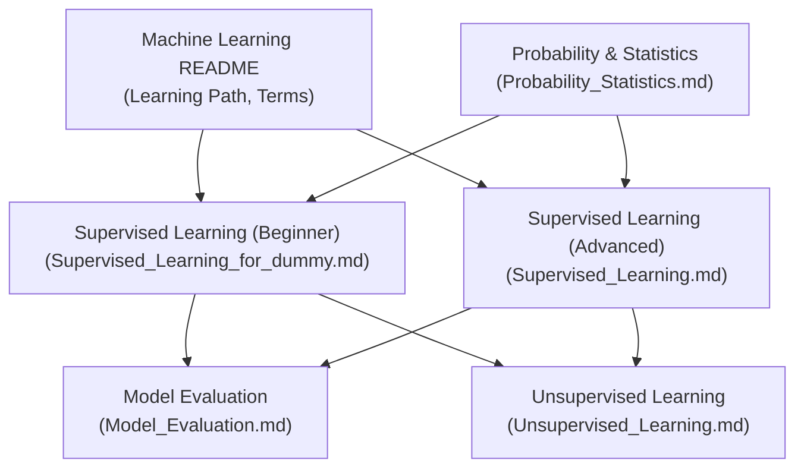
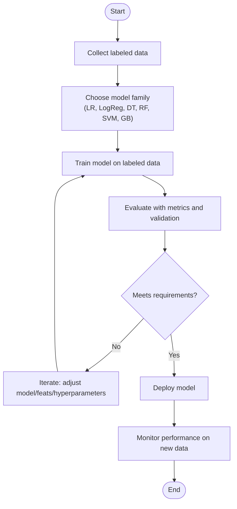
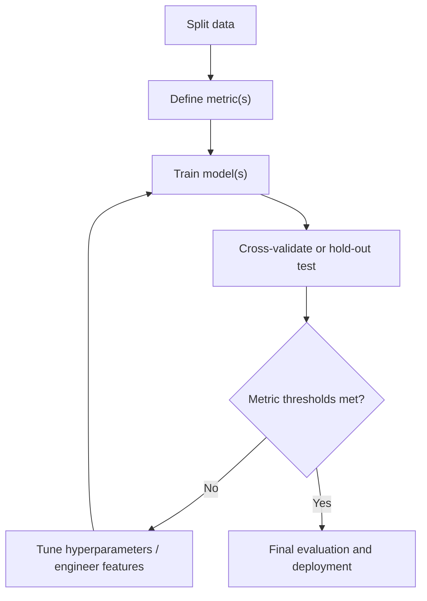
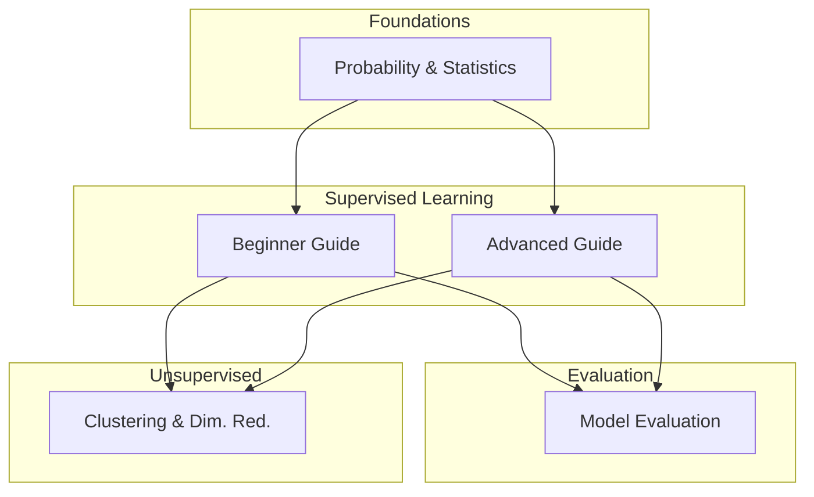
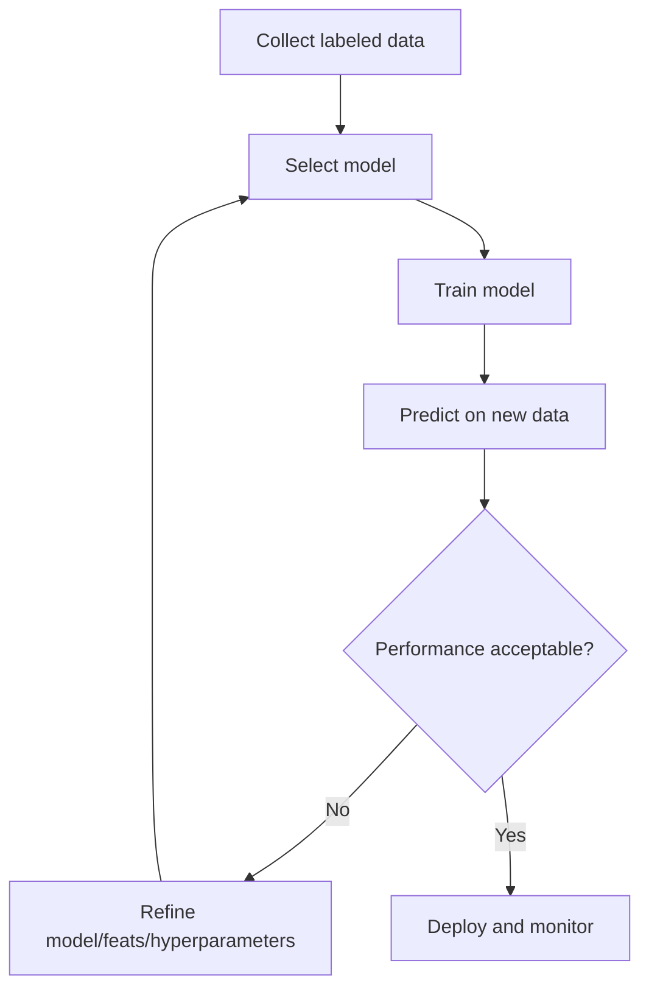
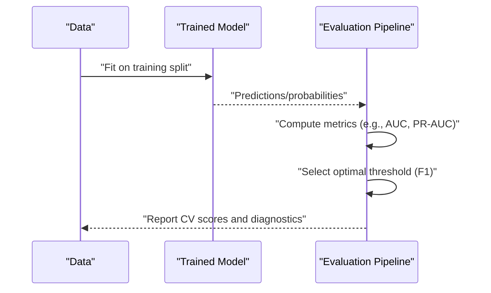
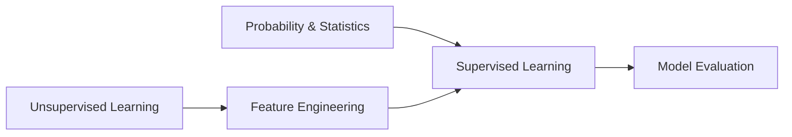

# Supervised Learning

<cite>
**Referenced Files in This Document**
- [Supervised_Learning_for_dummy.md](file://docs/02_Machine_Learning/Supervised_Learning/Supervised_Learning_for_dummy.md)
- [README.md](file://docs/02_Machine_Learning/README.md)
- [README_for_dummy.md](file://docs/02_Machine_Learning/README_for_dummy.md)
- [Model_Evaluation.md](file://docs/07_AI_Engineering/Model_Evaluation/Model_Evaluation.md)
- [Probability_Statistics.md](file://docs/01_Fundamentals/Probability_Statistics/Probability_Statistics.md)
- [Unsupervised_Learning.md](file://docs/02_Machine_Learning/Unsupervised_Learning/Unsupervised_Learning.md)
</cite>

## Table of Contents
1. [Introduction](#introduction)
2. [Project Structure](#project-structure)
3. [Core Components](#core-components)
4. [Architecture Overview](#architecture-overview)
5. [Detailed Component Analysis](#detailed-component-analysis)
6. [Dependency Analysis](#dependency-analysis)
7. [Performance Considerations](#performance-considerations)
8. [Troubleshooting Guide](#troubleshooting-guide)
9. [Conclusion](#conclusion)
10. [Appendices](#appendices)

## Introduction
This document synthesizes the supervised learning materials available in the repository to present a comprehensive yet accessible guide to classification and regression tasks, foundational algorithms, and practical modeling workflows. It consolidates conceptual explanations, algorithmic insights, evaluation practices, and cross-cutting topics such as overfitting, regularization, and feature engineering. The content is grounded in the repository’s structured chapters on classical machine learning and related fundamentals.

## Project Structure
The supervised learning content is organized as follows:
- Machine Learning chapter provides a learning path and glossary of key terms.
- Supervised Learning is presented in two forms: a simplified beginner-friendly guide and a more detailed advanced guide.
- Model evaluation is covered under AI Engineering, including metrics, validation strategies, and practical workflows.
- Probability and statistics form the mathematical foundation for supervised learning.
- Unsupervised learning complements supervised learning by introducing clustering and dimensionality reduction techniques.

**Diagram sources**
- [README.md:1-58](file://docs/02_Machine_Learning/README.md#L1-L58)
- [Supervised_Learning_for_dummy.md:1-201](file://docs/02_Machine_Learning/Supervised_Learning/Supervised_Learning_for_dummy.md#L1-L201)
- [Model_Evaluation.md:1-265](file://docs/07_AI_Engineering/Model_Evaluation/Model_Evaluation.md#L1-L265)
- [Probability_Statistics.md:1-622](file://docs/01_Fundamentals/Probability_Statistics/Probability_Statistics.md#L1-L622)
- [Unsupervised_Learning.md:563-614](file://docs/02_Machine_Learning/Unsupervised_Learning/Unsupervised_Learning.md#L563-L614)

**Section sources**
- [README.md:1-58](file://docs/02_Machine_Learning/README.md#L1-L58)
- [README_for_dummy.md:1-35](file://docs/02_Machine_Learning/README_for_dummy.md#L1-L35)

## Core Components
- Classification vs Regression: The repository distinguishes classification (select-one outcomes) and regression (numeric prediction) with intuitive examples and diagrams.
- Linear Regression: Explained as fitting a line to predict numeric values, illustrated via scatter plots and predictions.
- Logistic Regression: Described as a classifier that finds a decision boundary, despite its name, emphasizing probability outputs.
- Decision Trees: Modeled as sequential “if-then” questions, highlighting interpretability and overfitting risks.
- Ensemble Learning: Bagging (e.g., Random Forest) and Boosting (e.g., XGBoost) are introduced conceptually, with ensemble intuition and representative algorithms.
- Overfitting vs Underfitting: Framed as extremes of memorization versus poor learning, with remedies such as regularization, cross-validation, and data augmentation.
- SVM: Introduced as finding the widest margin separator, with kernel-based extension to higher dimensions.
- Evaluation and Validation: The repository emphasizes proper metrics, cross-validation, and methodological safeguards against overfitting.

**Section sources**
- [Supervised_Learning_for_dummy.md:21-191](file://docs/02_Machine_Learning/Supervised_Learning/Supervised_Learning_for_dummy.md#L21-L191)
- [Model_Evaluation.md:1-265](file://docs/07_AI_Engineering/Model_Evaluation/Model_Evaluation.md#L1-L265)

## Architecture Overview
The supervised learning workflow integrates data preparation, model selection and training, evaluation, and iterative refinement guided by metrics and validation strategies.

[No sources needed since this diagram shows conceptual workflow, not actual code structure]

## Detailed Component Analysis

### Classification vs Regression
- Classification answers “which category?” with discrete labels; Regression predicts continuous numeric values.
- The repository uses relatable examples (spam detection, face unlock, price prediction) and visual metaphors (multiple-choice vs fill-in-the-blank) to clarify task types.

**Section sources**
- [Supervised_Learning_for_dummy.md:23-36](file://docs/02_Machine_Learning/Supervised_Learning/Supervised_Learning_for_dummy.md#L23-L36)

### Linear Regression
- Concept: Fit a line to capture the relationship between input features and a numeric outcome.
- Practical use: Predict continuous quantities (e.g., exam scores given study hours) using a learned linear mapping.

**Section sources**
- [Supervised_Learning_for_dummy.md:39-61](file://docs/02_Machine_Learning/Supervised_Learning/Supervised_Learning_for_dummy.md#L39-L61)

### Logistic Regression
- Concept: Despite its name, logistic regression is a classification method that separates classes using a decision boundary and outputs probabilities.
- Practical use: Binary or multiclass classification tasks framed as boundary-finding problems.

**Section sources**
- [Supervised_Learning_for_dummy.md:64-73](file://docs/02_Machine_Learning/Supervised_Learning/Supervised_Learning_for_dummy.md#L64-L73)

### Decision Trees
- Concept: A tree of if-then decisions splits the feature space to reach predictions.
- Pros and cons: Highly interpretable but prone to overfitting without pruning or ensemble strategies.

**Section sources**
- [Supervised_Learning_for_dummy.md:76-98](file://docs/02_Machine_Learning/Supervised_Learning/Supervised_Learning_for_dummy.md#L76-L98)

### Ensemble Learning (Bagging and Boosting)
- Bagging (e.g., Random Forest): Combine diverse base learners trained on different subsets; aggregation reduces variance.
- Boosting (e.g., XGBoost): Sequential learners focus on correcting previous errors; often yields strong predictive performance.
- The repository frames ensembles as combining weak learners to achieve stronger collective performance.

**Section sources**
- [Supervised_Learning_for_dummy.md:101-122](file://docs/02_Machine_Learning/Supervised_Learning/Supervised_Learning_for_dummy.md#L101-L122)

### Overfitting vs Underfitting
- Underfitting: Model too simple to learn the pattern.
- Overfitting: Model learns noise or specific details of training data, harming generalization.
- Mitigation strategies: Regularization, cross-validation, increased data, and appropriate model complexity.

**Section sources**
- [Supervised_Learning_for_dummy.md:124-147](file://docs/02_Machine_Learning/Supervised_Learning/Supervised_Learning_for_dummy.md#L124-L147)

### Support Vector Machines (SVM)
- Concept: Find the maximum-margin separator between classes; leverage kernels to handle nonlinearly separable data by mapping to higher dimensions.

**Section sources**
- [Supervised_Learning_for_dummy.md:150-159](file://docs/02_Machine_Learning/Supervised_Learning/Supervised_Learning_for_dummy.md#L150-L159)

### Model Evaluation and Validation
- Metrics: The repository highlights classification metrics, ROC AUC, PR AUC, confusion matrices, and threshold selection via F1 optimization.
- Validation: Cross-validation (including stratified folds), time series split, and out-of-time validation to assess generalization.
- Principle: Never evaluate on training data alone; ensure statistical significance and alignment with business goals.

**Section sources**
- [Model_Evaluation.md:1-265](file://docs/07_AI_Engineering/Model_Evaluation/Model_Evaluation.md#L1-L265)

### Mathematical Foundations
- Probability and statistics provide the backbone for supervised learning, including conditional probability, Bayes’ theorem, distributions, and information theory concepts used in loss functions and probabilistic models.

**Section sources**
- [Probability_Statistics.md:1-622](file://docs/01_Fundamentals/Probability_Statistics/Probability_Statistics.md#L1-L622)

### Unsupervised Learning Context
- Clustering (e.g., K-Means, DBSCAN) and dimensionality reduction (e.g., PCA, t-SNE) complement supervised learning by uncovering structure in unlabeled data and preparing features for supervised tasks.

**Section sources**
- [Unsupervised_Learning.md:563-614](file://docs/02_Machine_Learning/Unsupervised_Learning/Unsupervised_Learning.md#L563-L614)

## Architecture Overview
The repository presents supervised learning as a pipeline integrating conceptual understanding, algorithmic families, and rigorous evaluation. The Machine Learning chapter anchors the learning path, while the Beginner and Advanced Supervised Learning guides progressively introduce tasks, algorithms, and practical considerations.

**Diagram sources**
- [README.md:1-58](file://docs/02_Machine_Learning/README.md#L1-L58)
- [Supervised_Learning_for_dummy.md:1-201](file://docs/02_Machine_Learning/Supervised_Learning/Supervised_Learning_for_dummy.md#L1-L201)
- [Model_Evaluation.md:1-265](file://docs/07_AI_Engineering/Model_Evaluation/Model_Evaluation.md#L1-L265)
- [Unsupervised_Learning.md:563-614](file://docs/02_Machine_Learning/Unsupervised_Learning/Unsupervised_Learning.md#L563-L614)

## Detailed Component Analysis

### Supervised Learning Workflow (Beginner)
- The Beginner guide outlines the end-to-end process: collect labeled data, choose and train a model, test on new data, and iterate based on performance.

**Section sources**
- [Supervised_Learning_for_dummy.md:160-181](file://docs/02_Machine_Learning/Supervised_Learning/Supervised_Learning_for_dummy.md#L160-L181)

### Algorithm Families Overview
- Linear/Logistic Regression: Parametric models for numeric and binary classification tasks.
- Decision Trees: Non-parametric, interpretable models; susceptible to overfitting.
- Ensembles: Random Forest (bagging) and gradient boosting (e.g., XGBoost) combine multiple learners to improve accuracy and robustness.
- SVM: Margin-based classifiers with kernel tricks for nonlinear separation.

**Section sources**
- [Supervised_Learning_for_dummy.md:39-159](file://docs/02_Machine_Learning/Supervised_Learning/Supervised_Learning_for_dummy.md#L39-L159)

### Evaluation Practices
- Metrics: Classification reports, confusion matrices, ROC AUC, PR AUC, optimal thresholds via F1 maximization.
- Validation: Cross-validation (including stratified folds), time series split, and statistical significance checks.

**Section sources**
- [Model_Evaluation.md:215-265](file://docs/07_AI_Engineering/Model_Evaluation/Model_Evaluation.md#L215-L265)

## Dependency Analysis
Supervised learning depends on:
- Foundational math (probability and statistics) to define likelihoods, losses, and uncertainty quantification.
- Evaluation rigor to avoid overfitting and ensure generalizable performance.
- Feature engineering and unsupervised techniques to prepare and enrich data.

**Diagram sources**
- [Probability_Statistics.md:1-622](file://docs/01_Fundamentals/Probability_Statistics/Probability_Statistics.md#L1-L622)
- [Model_Evaluation.md:1-265](file://docs/07_AI_Engineering/Model_Evaluation/Model_Evaluation.md#L1-L265)
- [Unsupervised_Learning.md:563-614](file://docs/02_Machine_Learning/Unsupervised_Learning/Unsupervised_Learning.md#L563-L614)

**Section sources**
- [README.md:37-55](file://docs/02_Machine_Learning/README.md#L37-L55)

## Performance Considerations
- Prefer appropriate metrics aligned with business objectives and class balance.
- Use cross-validation to estimate generalization; avoid optimistic bias from single train/test splits.
- Manage overfitting via regularization, pruning, early stopping, and controlled model complexity.
- Scale features when algorithms are sensitive to magnitude (e.g., SVM, logistic regression).
- Increase data volume and quality when performance plateaus; augment via domain-appropriate transformations.

[No sources needed since this section provides general guidance]

## Troubleshooting Guide
- Overfitting symptoms: high training accuracy, low test accuracy, complex decision boundaries; solutions include regularization, cross-validation, and simpler models.
- Underfitting symptoms: poor performance on both training and test sets; solutions include adding features, increasing model capacity, or using more expressive algorithms.
- Metric misalignment: ensure the chosen metric reflects business impact (e.g., precision vs recall trade-offs).
- Data leakage: avoid future information in temporal splits; use time-aware validation.

**Section sources**
- [Model_Evaluation.md:16-23](file://docs/07_AI_Engineering/Model_Evaluation/Model_Evaluation.md#L16-L23)
- [Supervised_Learning_for_dummy.md:124-147](file://docs/02_Machine_Learning/Supervised_Learning/Supervised_Learning_for_dummy.md#L124-L147)

## Conclusion
The repository offers a cohesive pathway into supervised learning: from conceptual task distinction and algorithm families to rigorous evaluation and practical mitigation of overfitting. By grounding concepts in probability and statistics, and by emphasizing validated evaluation practices, practitioners can build reliable, generalizable models across domains.

[No sources needed since this section summarizes without analyzing specific files]

## Appendices
- Learning path and key terms are cataloged in the Machine Learning chapter for quick reference and navigation.

**Section sources**
- [README.md:29-55](file://docs/02_Machine_Learning/README.md#L29-L55)
- [README_for_dummy.md:17-31](file://docs/02_Machine_Learning/README_for_dummy.md#L17-L31)