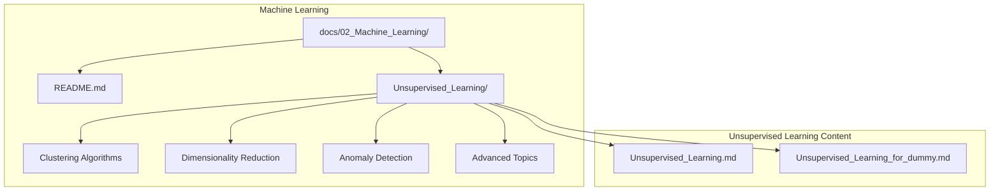
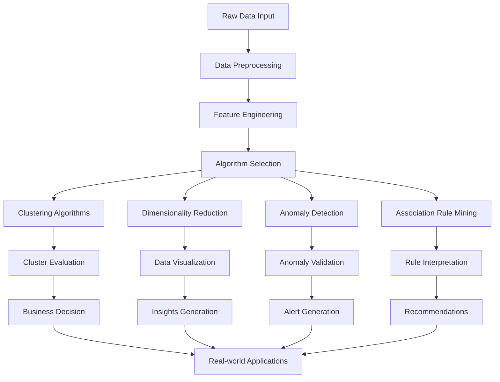
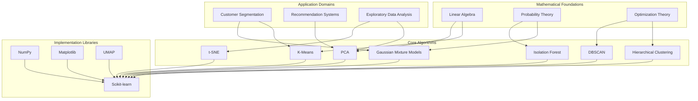

# Unsupervised Learning

<cite>
**Referenced Files in This Document**
- [Unsupervised_Learning.md](file://docs/02_Machine_Learning/Unsupervised_Learning/Unsupervised_Learning.md)
- [README.md](file://docs/02_Machine_Learning/README.md)
</cite>

## Table of Contents
1. [Introduction](#introduction)
2. [Project Structure](#project-structure)
3. [Core Components](#core-components)
4. [Architecture Overview](#architecture-overview)
5. [Detailed Component Analysis](#detailed-component-analysis)
6. [Dependency Analysis](#dependency-analysis)
7. [Performance Considerations](#performance-considerations)
8. [Troubleshooting Guide](#troubleshooting-guide)
9. [Conclusion](#conclusion)
10. [Appendices](#appendices)

## Introduction
This document provides comprehensive coverage of unsupervised learning techniques and clustering algorithms as presented in the repository. Unsupervised learning focuses on discovering hidden patterns and structures in unlabeled data, enabling exploratory data analysis, feature extraction, and pattern recognition without explicit target variables.

The repository organizes unsupervised learning as a core component of classical machine learning, positioned as a foundational topic that bridges supervised learning and advanced topics. It emphasizes practical applications in customer segmentation, recommendation systems, and exploratory data analysis while maintaining mathematical rigor.

## Project Structure
The unsupervised learning content is organized within the Machine Learning section of the repository, specifically in the Unsupervised_Learning directory. The structure follows a pedagogical progression from fundamental concepts to advanced techniques, with supporting materials in the broader Machine Learning ecosystem.



**Diagram sources**
- [README.md:1-58](file://docs/02_Machine_Learning/README.md#L1-L58)
- [Unsupervised_Learning.md:1-50](file://docs/02_Machine_Learning/Unsupervised_Learning/Unsupervised_Learning.md#L1-L50)

**Section sources**
- [README.md:1-58](file://docs/02_Machine_Learning/README.md#L1-L58)

## Core Components
The unsupervised learning framework encompasses four primary categories of techniques:

### 1. Clustering Analysis
Clustering aims to group similar data points together while maximizing intra-cluster similarity and minimizing inter-cluster similarity. The repository covers multiple clustering paradigms:

- **Distance-based clustering**: K-Means, hierarchical clustering
- **Density-based clustering**: DBSCAN
- **Model-based clustering**: Gaussian Mixture Models
- **Advanced clustering**: Spectral clustering, density peak clustering

### 2. Dimensionality Reduction
Dimensionality reduction techniques transform high-dimensional data into lower-dimensional representations while preserving essential information:

- **Linear methods**: Principal Component Analysis (PCA)
- **Non-linear methods**: t-SNE, UMAP
- **Discriminant methods**: Linear Discriminant Analysis (LDA)

### 3. Anomaly Detection
Anomaly detection identifies rare events or observations that differ significantly from the majority of the data:

- **Tree-based methods**: Isolation Forest
- **Support vector methods**: One-Class SVM
- **Statistical methods**: Robust covariance estimation

### 4. Association Rule Mining
Association rule mining discovers interesting relationships between variables in large databases, commonly used in market basket analysis and recommendation systems.

**Section sources**
- [Unsupervised_Learning.md:35-208](file://docs/02_Machine_Learning/Unsupervised_Learning/Unsupervised_Learning.md#L35-L208)

## Architecture Overview
The unsupervised learning architecture follows a structured approach combining mathematical foundations with practical implementation:



**Diagram sources**
- [Unsupervised_Learning.md:20-31](file://docs/02_Machine_Learning/Unsupervised_Learning/Unsupervised_Learning.md#L20-L31)
- [Unsupervised_Learning.md:604-671](file://docs/02_Machine_Learning/Unsupervised_Learning/Unsupervised_Learning.md#L604-L671)

## Detailed Component Analysis

### K-Means Clustering
K-Means represents one of the most widely used clustering algorithms, optimizing the minimization of within-cluster sum of squares (WCSS).

#### Mathematical Foundation
The algorithm seeks to minimize the objective function:
```
WCSS = Σ(k=1 to K) Σ(x∈Ck) ||x - μk||²
```

Where μk represents the centroid of cluster k, and Ck is the set of points in cluster k.

#### Algorithm Implementation
The iterative process consists of two main steps:
1. **Assignment Step**: Each point is assigned to the nearest centroid based on Euclidean distance
2. **Update Step**: Centroids are recalculated as the mean of all points in each cluster

#### Parameter Selection Methods
The repository outlines three primary methods for determining optimal K:

1. **Elbow Method**: Analyzes the trade-off between number of clusters and WCSS reduction
2. **Silhouette Analysis**: Measures cluster quality based on intra-cluster cohesion and inter-cluster separation
3. **Gap Statistic**: Compares observed WCSS with expected WCSS under null reference distribution

#### Computational Complexity
K-Means operates with complexity O(n · K · I · d), where n is the number of samples, K is the number of clusters, I is the number of iterations, and d is the number of dimensions.

**Section sources**
- [Unsupervised_Learning.md:39-100](file://docs/02_Machine_Learning/Unsupervised_Learning/Unsupervised_Learning.md#L39-L100)

### Hierarchical Clustering
Hierarchical clustering builds tree-like structures (dendrograms) representing nested cluster relationships.

#### Linkage Criteria
The algorithm employs four primary linkage criteria:

| Linkage Type | Distance Definition | Characteristics |
|--------------|-------------------|-----------------|
| Single Linkage | min d(x,y) | Produces chain-like clusters |
| Complete Linkage | max d(x,y) | Forms compact, spherical clusters |
| Average Linkage | average distance | Balanced between chain and compact |
| Ward Linkage | minimizes variance increase | Creates clusters of similar size |

#### Algorithm Types
- **Agglomerative**: Bottom-up approach, merging similar clusters
- **Divisive**: Top-down approach, splitting clusters recursively

#### Advantages and Limitations
- **Advantages**: No pre-specified number of clusters, handles various cluster shapes
- **Limitations**: Computationally expensive, sensitive to noise and outliers

**Section sources**
- [Unsupervised_Learning.md:101-117](file://docs/02_Machine_Learning/Unsupervised_Learning/Unsupervised_Learning.md#L101-L117)

### DBSCAN (Density-Based Spatial Clustering)
DBSCAN identifies clusters based on density connectivity, automatically determining cluster count and handling noise effectively.

#### Core Concepts
The algorithm defines three point types:
- **Core Points**: Points within ε radius containing at least MinPts neighbors
- **Border Points**: Points with fewer than MinPts neighbors but reachable from core points
- **Noise Points**: Points neither core nor border

#### Parameter Selection Strategy
The repository provides systematic approaches for parameter tuning:

1. **MinPts Selection**: 
   - Empirical rule: MinPts ≥ dimension + 1
   - Practical guidelines: 4 for low-dimensional data, increased for high-dimensional data

2. **ε Selection Using K-Distance Graph**:
   - Calculate distance to k-th nearest neighbor for each point
   - Sort distances and identify elbow point as optimal ε

#### Comparative Analysis
| Feature | DBSCAN | K-Means |
|---------|--------|---------|
| Cluster Shape | Arbitrary | Convex/spherical |
| Cluster Count | Automatic | Prespecified |
| Noise Handling | Identifies | Forces assignment |
| Density Assumption | Different densities | Similar densities |
| Complexity | O(n log n) | O(n · K · I) |
| Parameter Sensitivity | ε and MinPts | Initialization |

**Section sources**
- [Unsupervised_Learning.md:118-172](file://docs/02_Machine_Larning/Unsupervised_Learning/Unsupervised_Learning.md#L118-L172)

### Gaussian Mixture Models (GMM)
GMM provides a probabilistic approach to clustering, modeling data as a mixture of multiple Gaussian distributions.

#### Mathematical Formulation
The model assumes data follows:
```
P(x) = Σ(k=1 to K) πk · N(x|μk, Σk)
```

Where πk are mixing coefficients, μk are means, and Σk are covariance matrices.

#### Expectation-Maximization Algorithm
The EM algorithm iterates between two steps:

**E-step**: Compute posterior probabilities (responsibilities)
```
γ(zik) = (πk · N(xi|μk, Σk)) / Σj (πj · N(xi|μj, Σj))
```

**M-step**: Update parameters
```
Nk = Σi γ(zik)
μk = (1/Nk) Σi γ(zik) · xi
Σk = (1/Nk) Σi γ(zik) · (xi - μk)(xi - μk)ᵀ
πk = Nk/N
```

#### Relationship to K-Means
GMM generalizes K-Means by allowing:
- Soft assignments (probabilistic cluster membership)
- Ellipsoidal cluster shapes (through covariance matrices)
- Probabilistic interpretation of cluster memberships

**Section sources**
- [Unsupervised_Learning.md:173-208](file://docs/02_Machine_Learning/Unsupervised_Learning/Unsupervised_Learning.md#L173-L208)

### Principal Component Analysis (PCA)
PCA serves as a fundamental linear dimensionality reduction technique, identifying directions of maximum variance in the data.

#### Mathematical Foundation
PCA solves the optimization problem:
```
maximize wᵀΣw subject to ||w|| = 1
```

Where Σ is the covariance matrix of centered data.

#### Implementation Steps
1. **Data Centering**: Remove mean from each feature
2. **Covariance Matrix Calculation**: Σ = (1/m) X̄ᵀX̄
3. **Eigenvalue Decomposition**: Σ = VΛVᵀ
4. **Component Selection**: Choose top k eigenvectors
5. **Projection**: Z = X̄V_k

#### Variance Explanation
The explained variance ratio quantifies information retention:
```
Explained Variance Ratio = λi / Σj λj
```

#### Practical Guidelines
- **Component Selection**: Cumulative variance ≥ 85-95%
- **Scree Plot Analysis**: Identify elbow point in eigenvalue spectrum
- **Limitations**: Assumes linear relationships, sensitivity to outliers

**Section sources**
- [Unsupervised_Learning.md:209-260](file://docs/02_Machine_Learning/Unsupervised_Learning/Unsupervised_Learning.md#L209-L260)

### t-SNE (t-Distributed Stochastic Neighbor Embedding)
t-SNE focuses on preserving local neighborhood relationships during dimensionality reduction, excelling in data visualization.

#### Core Principle
t-SNE maintains similarity relationships through probability distributions:
- **High-dimensional**: p_{j|i} = exp(-||x_i - x_j||²/2σ_i²) / Σ_{k≠i} exp(-||x_i - x_k||²/2σ_i²)
- **Low-dimensional**: q_{ij} = (1 + ||y_i - y_j||²)^(-1) / Σ_{k≠l} (1 + ||y_k - y_l||²)^(-1)

#### Optimization Objective
Minimizes KL divergence between distributions:
```
C = Σi KL(Pi || Qi) = Σi Σj p_{ij} log(p_{ij}/q_{ij})
```

#### Hyperparameter Tuning
Key parameters requiring careful selection:
- **Perplexity**: Controls local neighborhood size (recommended 5-50)
- **Learning Rate**: Typically 100-1000
- **Iterations**: Minimum 1000 for convergence

#### Comparative Analysis with PCA
| Aspect | t-SNE | PCA |
|--------|-------|-----|
| Linearity | Nonlinear | Linear |
| Structure Preservation | Local neighborhoods | Global variance |
| Computational Complexity | O(n²) | O(nd² + d³) |
| Determinism | Random (different runs) | Deterministic |
| Reversibility | Not reversible | Reversible |
| Primary Use | Visualization | Feature extraction/compression |
| Hyperparameters | Requires tuning | Minimal tuning |

**Section sources**
- [Unsupervised_Learning.md:271-306](file://docs/02_Machine_Learning/Unsupervised_Learning/Unsupervised_Learning.md#L271-L306)

### Isolation Forest (Anomaly Detection)
Isolation Forest identifies anomalies by isolating observations in random partition trees.

#### Core Philosophy
Anomalies are easier to isolate—requiring fewer random splits to separate them from normal data.

#### Algorithm Workflow
**Training Phase**:
1. Randomly sample data subsets
2. Build isolation trees (iTree) recursively until:
   - Single sample reached
   - Maximum depth achieved
   - All samples identical

**Prediction Phase**:
1. Calculate average path length h(x) for each sample
2. Compute anomaly score: s(x) = 2^(-h(x)/c(n))

#### Computational Advantages
- **Linear Complexity**: O(n) for anomaly detection
- **No Distance Calculations**: Tree-based isolation
- **High-Dimensional Effectiveness**: Handles curse of dimensionality

#### Practical Applications
- **Credit Card Fraud Detection**: Identifies unusual transaction patterns
- **Network Intrusion Detection**: Flags abnormal traffic behavior
- **Industrial Equipment Monitoring**: Detects equipment degradation

**Section sources**
- [Unsupervised_Learning.md:327-356](file://docs/02_Machine_Learning/Unsupervised_Learning/Unsupervised_Learning.md#L327-L356)

### Cluster Validation and Evaluation
The repository emphasizes comprehensive evaluation strategies for unsupervised learning results.

#### Internal Validation Metrics
These metrics assess cluster quality without ground truth labels:

**Silhouette Coefficient**:
```
s = (1/n) Σi [(bi - ai)/max(ai, bi)]
```
Where ai is average intra-cluster distance, bi is minimum average distance to other clusters.

**Calinski-Harabasz Index**:
```
CH = (SSB/(K-1))/(SSW/(n-K))
```
Higher values indicate better clustering.

**Davies-Bouldin Index**:
```
DB = (1/K) Σi max(j≠i) (σi + σj)/d(ci, cj)
```
Lower values indicate better clustering.

#### External Validation Metrics
When ground truth labels are available:
- **Adjusted Rand Index (ARI)**: Accounts for chance agreement
- **Normalized Mutual Information (NMI)**: Information-theoretic measure

#### Comprehensive Evaluation Strategy
The repository recommends using multiple complementary metrics:
1. **Silhouette Analysis**: Assess cluster cohesion and separation
2. **Calinski-Harabasz Index**: Evaluate cluster validity
3. **Domain Expertise**: Incorporate business knowledge
4. **Visualization**: Confirm intuitive cluster structure

**Section sources**
- [Unsupervised_Learning.md:359-387](file://docs/02_Machine_Learning/Unsupervised_Learning/Unsupervised_Learning.md#L359-L387)

## Dependency Analysis
The unsupervised learning framework exhibits strong internal dependencies and external library integrations:



**Diagram sources**
- [Unsupervised_Learning.md:402-602](file://docs/02_Machine_Learning/Unsupervised_Learning/Unsupervised_Learning.md#L402-L602)

### Algorithm Dependencies
The mathematical relationships between algorithms reveal important design choices:

1. **K-Means as Special Case**: GMM reduces to K-Means when covariance matrices approach zero
2. **PCA Foundation**: Many clustering algorithms benefit from PCA preprocessing
3. **t-SNE Limitations**: Designed specifically for visualization, not training features

### External Library Integration
The implementation relies heavily on established scientific computing libraries:
- **Scikit-learn**: Primary implementation for clustering and dimensionality reduction
- **NumPy**: Numerical computations and array operations
- **Matplotlib**: Visualization and plotting capabilities
- **UMAP**: Alternative dimensionality reduction method

**Section sources**
- [Unsupervised_Learning.md:402-602](file://docs/02_Machine_Learning/Unsupervised_Learning/Unsupervised_Learning.md#L402-L602)

## Performance Considerations
The repository provides comprehensive guidance on algorithm performance characteristics and optimization strategies:

### Computational Complexity Analysis
| Algorithm | Time Complexity | Space Complexity | Scalability |
|-----------|----------------|------------------|-------------|
| K-Means | O(n · K · I · d) | O(n · d) | Excellent |
| Hierarchical | O(n³) | O(n²) | Limited |
| DBSCAN | O(n log n) | O(n) | Good |
| GMM | O(n · K · I · d) | O(n · d) | Moderate |
| PCA | O(nd² + d³) | O(d²) | Excellent |
| t-SNE | O(n²) | O(n²) | Poor |
| Isolation Forest | O(n) | O(n) | Excellent |

### Memory Optimization Strategies
1. **Mini-batch K-Means**: Reduces memory footprint for large datasets
2. **Incremental DBSCAN**: Processes data in chunks for streaming scenarios
3. **Sparse Representations**: Utilize sparse matrices for high-dimensional data
4. **Approximate Methods**: Employ approximate algorithms for large-scale problems

### Parallel Processing Opportunities
- **Vectorized Operations**: Leverage NumPy for batch computations
- **Multi-core Execution**: Scikit-learn implementations support parallel processing
- **Distributed Computing**: Apache Spark MLlib for big data scenarios

### Numerical Stability Considerations
- **Feature Scaling**: Essential for distance-based algorithms
- **Initialization Strategies**: K-Means++ for improved convergence
- **Regularization**: Prevent overfitting in GMM parameter estimation

## Troubleshooting Guide
The repository documents common pitfalls and their solutions:

### Data Preprocessing Issues
**Problem**: Inconsistent feature scales leading to biased clustering results
**Solution**: Apply StandardScaler or MinMaxScaler before algorithm execution
**Example**: Age (0-100) vs Income (0-1000000) requires normalization

**Problem**: High-dimensional data causing distance concentration
**Solution**: Apply PCA for dimensionality reduction before clustering
**Guideline**: Reduce to 50-100 dimensions for complex datasets

### Algorithm Selection Challenges
**Problem**: Choosing inappropriate clustering algorithm for data characteristics
**Solution**: Follow decision tree based on data visualization and domain knowledge

**Problem**: Parameter selection uncertainty for DBSCAN
**Solution**: Use K-distance graph method for ε selection and empirical rules for MinPts

### Evaluation Methodology
**Problem**: Misleading cluster quality assessment
**Solution**: Use multiple complementary metrics (Silhouette, CH Index, Davies-Bouldin)
**Guideline**: Never rely on a single metric for cluster validation

### Visualization Pitfalls
**Problem**: Misinterpreting t-SNE results as training features
**Solution**: Remember t-SNE is for visualization only, not for model training
**Alternative**: Use PCA or UMAP for feature extraction

**Section sources**
- [Unsupervised_Learning.md:722-740](file://docs/02_Machine_Learning/Unsupervised_Learning/Unsupervised_Learning.md#L722-L740)

## Conclusion
The repository provides a comprehensive foundation for unsupervised learning, balancing theoretical understanding with practical implementation. The content demonstrates the evolution from basic clustering concepts to advanced techniques, emphasizing:

1. **Mathematical Rigor**: Clear formulation of algorithms with precise mathematical notation
2. **Practical Guidance**: Real-world parameter selection strategies and implementation tips
3. **Evaluation Framework**: Comprehensive metrics for validating unsupervised learning results
4. **Application Focus**: Concrete use cases in customer segmentation, recommendation systems, and exploratory data analysis

The structured approach from fundamental concepts to advanced topics creates a solid learning pathway for practitioners seeking to apply unsupervised learning techniques effectively in real-world scenarios.

## Appendices

### Real-World Applications
The repository highlights several practical applications:

#### Customer Segmentation
- **Approach**: Combine behavioral data with clustering algorithms
- **Benefits**: Personalized marketing, targeted product development
- **Implementation**: K-Means or GMM for customer groups identification

#### Recommendation Systems
- **Integration**: Use clustering results as features for collaborative filtering
- **Enhancement**: Combine multiple algorithms for robust recommendations
- **Scalability**: Consider incremental clustering for dynamic user preferences

#### Exploratory Data Analysis
- **Visualization**: t-SNE for high-dimensional data exploration
- **Pattern Discovery**: Automated cluster identification for hypothesis generation
- **Quality Assessment**: Statistical validation of discovered patterns

### Advanced Topics for Further Study
The repository references several advanced areas:
- **Spectral Clustering**: Graph-based clustering for complex data structures
- **Clustering Ensembles**: Combining multiple clustering results for improved stability
- **Deep Clustering**: Neural network approaches to unsupervised learning

### Learning Resources
The repository provides extensive references for continued study:
- **Academic Papers**: Foundational works in each algorithm area
- **Textbook References**: Comprehensive coverage of theoretical foundations
- **Online Resources**: Interactive tutorials and practical implementations