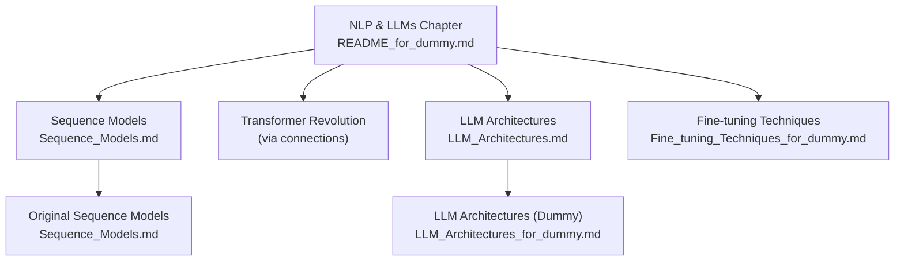
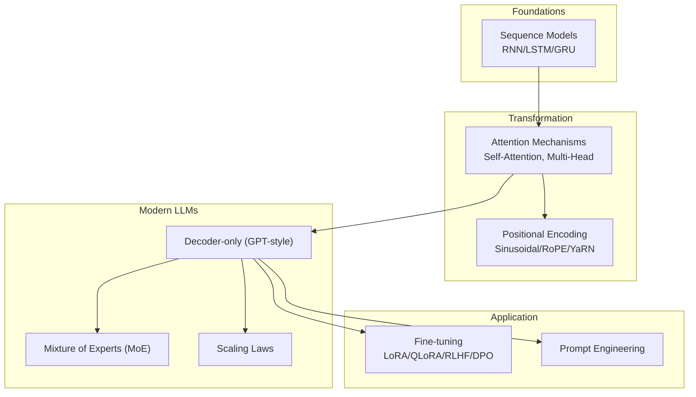
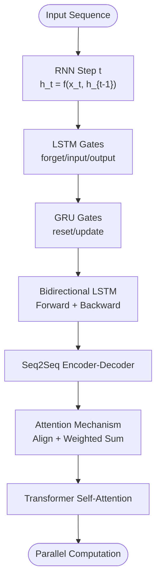
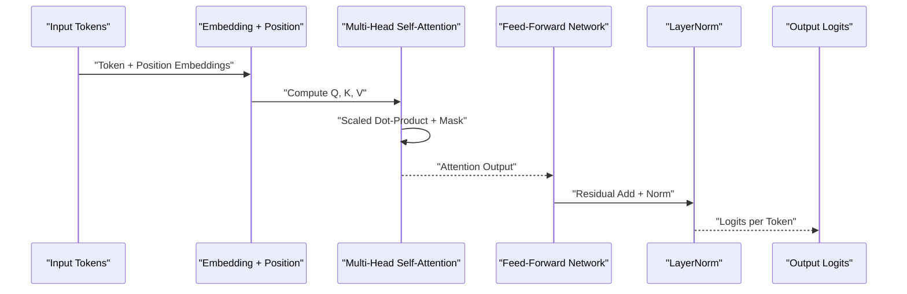
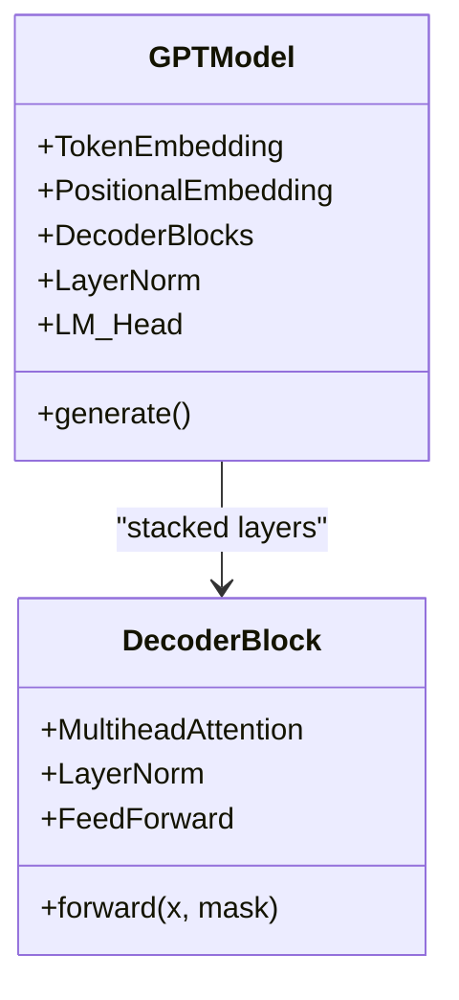
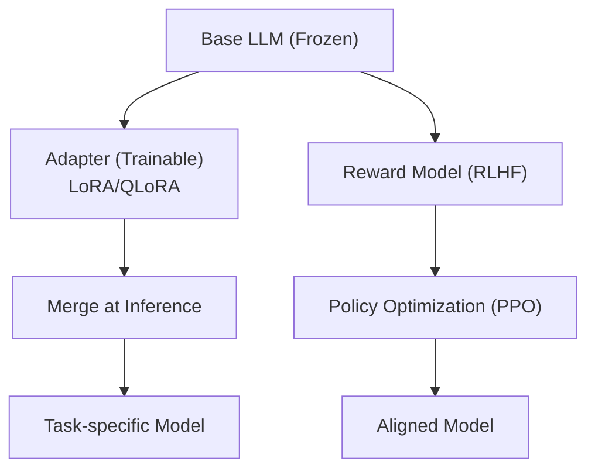
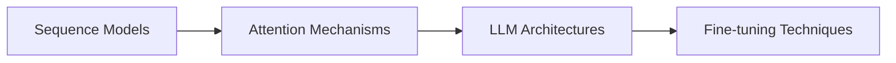

# NLP & LLMs Education

<cite>
**Referenced Files in This Document**
- [README_for_dummy.md](file://docs/04_NLP_LLMs/README_for_dummy.md)
- [Sequence_Models.md](file://docs/04_NLP_LLMs/Sequence_Models/Sequence_Models.md)
- [LLM_Architectures.md](file://docs/04_NLP_LLMs/LLM_Architectures/LLM_Architectures.md)
- [LLM_Architectures_for_dummy.md](file://docs/04_NLP_LLMs/LLM_Architectures/LLM_Architectures_for_dummy.md)
- [Fine_tuning_Techniques_for_dummy.md](file://docs/04_NLP_LLMs/Fine_tuning_Techniques/Fine_tuning_Techniques_for_dummy.md)
</cite>

## Table of Contents
1. [Introduction](#introduction)
2. [Project Structure](#project-structure)
3. [Core Components](#core-components)
4. [Architecture Overview](#architecture-overview)
5. [Detailed Component Analysis](#detailed-component-analysis)
6. [Dependency Analysis](#dependency-analysis)
7. [Performance Considerations](#performance-considerations)
8. [Troubleshooting Guide](#troubleshooting-guide)
9. [Conclusion](#conclusion)
10. [Appendices](#appendices)

## Introduction
This document presents a comprehensive, pedagogical guide to natural language processing and large language models education. It explains the transformer architecture revolution, fine-tuning techniques, sequence modeling approaches, and the progression from traditional NLP to modern LLM applications. The materials emphasize simplified explanations for complex transformer concepts, integrate attention mechanisms with practical implementation, and support bilingual terminology in both English and Chinese. The learning path progresses from basic sequence models through advanced transformer architectures, including self-attention mechanisms, positional encoding, multi-head attention, and scaling laws. It balances theoretical understanding with practical application, cites influential papers and industry innovations, and outlines a systematic approach to mastering NLP from foundational concepts to state-of-the-art language model engineering.

## Project Structure
The NLP and LLMs educational content is organized as a structured learning pathway with both simplified “for dummy” versions and deeper technical originals. The simplified versions focus on conceptual understanding and everyday analogies, while the originals include mathematical formulations, code examples, and advanced topics.

**Diagram sources**
- [README_for_dummy.md:17-36](file://docs/04_NLP_LLMs/README_for_dummy.md#L17-L36)
- [Sequence_Models.md:16-27](file://docs/04_NLP_LLMs/Sequence_Models/Sequence_Models.md#L16-L27)
- [LLM_Architectures.md:5-36](file://docs/04_NLP_LLMs/LLM_Architectures/LLM_Architectures.md#L5-L36)
- [LLM_Architectures_for_dummy.md:1-449](file://docs/04_NLP_LLMs/LLM_Architectures/LLM_Architectures_for_dummy.md#L1-L449)
- [Fine_tuning_Techniques_for_dummy.md:1-496](file://docs/04_NLP_LLMs/Fine_tuning_Techniques/Fine_tuning_Techniques_for_dummy.md#L1-L496)

**Section sources**
- [README_for_dummy.md:17-36](file://docs/04_NLP_LLMs/README_for_dummy.md#L17-L36)
- [README_for_dummy.md:180-196](file://docs/04_NLP_LLMs/README_for_dummy.md#L180-L196)

## Core Components
- Sequence Models (RNN, LSTM, GRU): Foundational architectures that introduced memory and sequential reasoning, leading to attention mechanisms and transformers.
- Transformer Revolution: Self-attention, multi-head attention, positional encodings, and the shift from recurrent to attention-based computation.
- LLM Architectures: Decoder-only (GPT-style), encoder-only (BERT-style), encoder-decoder (T5-style), mixture-of-experts (MoE), scaling laws, and inference optimizations.
- Fine-tuning Techniques: Full-parameter fine-tuning, low-rank adaptation (LoRA), quantized low-rank adaptation (QLoRA), reward modeling and reinforcement learning from human feedback (RLHF), and direct preference optimization (DPO).

These components form a coherent learning pipeline from sequential memory to attention-based generation, and from pretraining to practical deployment via efficient fine-tuning.

**Section sources**
- [Sequence_Models.md:33-149](file://docs/04_NLP_LLMs/Sequence_Models/Sequence_Models.md#L33-L149)
- [LLM_Architectures.md:41-324](file://docs/04_NLP_LLMs/LLM_Architectures/LLM_Architectures.md#L41-L324)
- [Fine_tuning_Techniques_for_dummy.md:51-271](file://docs/04_NLP_LLMs/Fine_tuning_Techniques/Fine_tuning_Techniques_for_dummy.md#L51-L271)

## Architecture Overview
The education system follows a structured progression:
- Foundations: Sequence models introduce memory and sequential dependencies.
- Transformation: Attention mechanisms supersede recurrence, enabling parallel computation and long-range dependencies.
- Modern LLMs: Decoder-only architectures dominate, with scaling laws and MoE for efficiency.
- Practical Application: Fine-tuning and prompting enable customization and alignment with human preferences.

**Diagram sources**
- [Sequence_Models.md:33-149](file://docs/04_NLP_LLMs/Sequence_Models/Sequence_Models.md#L33-L149)
- [LLM_Architectures.md:41-324](file://docs/04_NLP_LLMs/LLM_Architectures/LLM_Architectures.md#L41-L324)
- [Fine_tuning_Techniques_for_dummy.md:51-271](file://docs/04_NLP_LLMs/Fine_tuning_Techniques/Fine_tuning_Techniques_for_dummy.md#L51-L271)

## Detailed Component Analysis

### Sequence Models: From Memory to Attention
- Motivation: Traditional feed-forward networks cannot capture temporal dependencies; sequence models address this by maintaining hidden states across time steps.
- RNN: Basic recurrent unit with shared weights across time; suffers from vanishing/exploding gradients.
- LSTM: Introduces gates and a cell state to mitigate gradient issues and improve long-term memory.
- GRU: Simplified variant combining reset/update gates, fewer parameters, and competitive performance.
- Bidirectional LSTM: Captures both past and future contexts for tasks like named entity recognition.
- Seq2Seq with Attention: Encoder captures context; decoder attends to relevant parts of the source sequence, solving the fixed-length bottleneck.
- Transition to Transformers: Attention enables parallel computation and strong long-range dependencies, replacing recurrence.

**Diagram sources**
- [Sequence_Models.md:33-196](file://docs/04_NLP_LLMs/Sequence_Models/Sequence_Models.md#L33-L196)

**Section sources**
- [Sequence_Models.md:33-149](file://docs/04_NLP_LLMs/Sequence_Models/Sequence_Models.md#L33-L149)
- [Sequence_Models.md:154-196](file://docs/04_NLP_LLMs/Sequence_Models/Sequence_Models.md#L154-L196)

### Transformer Revolution: Self-Attention and Parallelism
- Self-Attention: Each position attends to all positions, computing weighted sums of values guided by compatibility scores between queries and keys.
- Multi-Head Attention: Parallel attention heads capture diverse relationships; outputs are concatenated and projected.
- Positional Encodings: Inject absolute or relative position information; sinusoidal, rotary (RoPE), or extended variants (YaRN) support long contexts.
- Causal Masking: Ensures autoregressive generation by masking future tokens during training.
- Decoder-only Architecture: GPT-style models rely on causal self-attention for text generation.

**Diagram sources**
- [LLM_Architectures.md:328-456](file://docs/04_NLP_LLMs/LLM_Architectures/LLM_Architectures.md#L328-L456)

**Section sources**
- [LLM_Architectures.md:41-100](file://docs/04_NLP_LLMs/LLM_Architectures/LLM_Architectures.md#L41-L100)
- [LLM_Architectures.md:217-281](file://docs/04_NLP_LLMs/LLM_Architectures/LLM_Architectures.md#L217-L281)

### LLM Architectures: Decoder-only, MoE, Scaling Laws
- Decoder-only (GPT-style): Autoregressive generation with causal masking; simple stacking yields strong performance.
- Encoder-only (BERT-style): Bidirectional attention for understanding tasks; less dominant today but foundational.
- Encoder-Decoder (T5-style): Flexible for translation and summarization; less common now due to decoder-only dominance.
- Mixture of Experts (MoE): Sparse activation across many experts to scale capacity while controlling compute; routing strategies vary.
- Scaling Laws: Optimal trade-offs between parameters and training tokens under fixed compute budgets; informs model sizing and data planning.
- Context Window Extensions: Techniques like NTK-aware scaling, YaRN, ALiBi, sliding windows, and dual-chunk attention enable long-context inference.

**Diagram sources**
- [LLM_Architectures.md:328-456](file://docs/04_NLP_LLMs/LLM_Architectures/LLM_Architectures.md#L328-L456)

**Section sources**
- [LLM_Architectures.md:84-175](file://docs/04_NLP_LLMs/LLM_Architectures/LLM_Architectures.md#L84-L175)
- [LLM_Architectures.md:175-241](file://docs/04_NLP_LLMs/LLM_Architectures/LLM_Architectures.md#L175-L241)
- [LLM_Architectures.md:242-324](file://docs/04_NLP_LLMs/LLM_Architectures/LLM_Architectures.md#L242-L324)

### Fine-tuning Techniques: LoRA, QLoRA, RLHF, DPO
- Purpose: Transform general-purpose pre-trained models into specialized tools without retraining the entire model.
- LoRA: Low-rank adaptation trains a small adapter while freezing base weights; highly efficient and reversible.
- QLoRA: Combines quantization (e.g., 4-bit) with LoRA to fit large models on consumer GPUs.
- RLHF: Reward modeling followed by reinforcement learning with human preference data; aligns model outputs with helpfulness, honesty, and harmlessness.
- DPO: Preference optimization without a separate reward model; simpler pipeline with comparable effectiveness.

**Diagram sources**
- [Fine_tuning_Techniques_for_dummy.md:91-271](file://docs/04_NLP_LLMs/Fine_tuning_Techniques/Fine_tuning_Techniques_for_dummy.md#L91-L271)

**Section sources**
- [Fine_tuning_Techniques_for_dummy.md:51-271](file://docs/04_NLP_LLMs/Fine_tuning_Techniques/Fine_tuning_Techniques_for_dummy.md#L51-L271)

### Pedagogy and Bilingual Terminology
- Simplified Explanations: Analogies compare AI to students (writers, readers, versatile learners) and training to university education and on-the-job specialization.
- Bilingual Vocabulary: Key terms are presented with English definitions and Chinese translations to support multilingual learners.
- Practical Guidance: Hands-on code examples and implementation pointers help bridge theory and practice.

**Section sources**
- [README_for_dummy.md:180-196](file://docs/04_NLP_LLMs/README_for_dummy.md#L180-L196)
- [LLM_Architectures_for_dummy.md:19-44](file://docs/04_NLP_LLMs/LLM_Architectures/LLM_Architectures_for_dummy.md#L19-L44)
- [LLM_Architectures_for_dummy.md:128-164](file://docs/04_NLP_LLMs/LLM_Architectures/LLM_Architectures_for_dummy.md#L128-L164)

## Dependency Analysis
The learning modules build upon each other:
- Sequence Models provide intuition for memory and sequential reasoning.
- Attention mechanisms generalize and improve upon sequential dependencies.
- LLM Architectures demonstrate how attention scales to massive models and how inference is optimized.
- Fine-tuning Techniques show how to adapt and align models for real-world tasks.

**Diagram sources**
- [Sequence_Models.md:16-27](file://docs/04_NLP_LLMs/Sequence_Models/Sequence_Models.md#L16-L27)
- [LLM_Architectures.md:5-36](file://docs/04_NLP_LLMs/LLM_Architectures/LLM_Architectures.md#L5-L36)

**Section sources**
- [README_for_dummy.md:17-36](file://docs/04_NLP_LLMs/README_for_dummy.md#L17-L36)

## Performance Considerations
- Computational Complexity: Attention scales quadratically with sequence length; efficient implementations (KV cache, grouped-query attention, paged attention) are essential for long-context inference.
- Memory Footprint: Parameter precision (FP32/FP16/INT4/INT8) and optimizer states significantly impact memory usage; gradient checkpointing reduces activation memory at the cost of speed.
- Scaling Laws: Optimal parameter and data scaling under fixed compute budgets; misalignment leads to undertrained models.
- Inference Optimization: Speculative decoding, FlashDecoding, and hybrid routing reduce latency and improve throughput.

[No sources needed since this section provides general guidance]

## Troubleshooting Guide
Common pitfalls and remedies:
- Vanishing/Exploding Gradients in RNNs: Use LSTM/GRU with proper initialization and gradient clipping.
- Overfitting in LLMs: Ensure sufficient task data; use regularization and adapter-only fine-tuning.
- Hallucinations: Augment with retrieval-augmented generation or tool use; apply instruction tuning and RLHF.
- Context Length Limitations: Apply YaRN, ALiBi, or sliding window strategies; consider MoE to manage compute.

**Section sources**
- [Sequence_Models.md:332-347](file://docs/04_NLP_LLMs/Sequence_Models/Sequence_Models.md#L332-L347)
- [LLM_Architectures.md:485-506](file://docs/04_NLP_LLMs/LLM_Architectures/LLM_Architectures.md#L485-L506)

## Conclusion
This education system offers a clear, bilingual pathway from foundational sequence models to modern transformer-based LLMs and practical fine-tuning. By combining simplified analogies with technical depth, it equips learners to understand both the “why” and the “how” behind today’s language technologies. The materials emphasize scalable, efficient engineering practices and provide references to seminal works and contemporary innovations, enabling learners to progress from conceptual mastery to hands-on implementation.

[No sources needed since this section summarizes without analyzing specific files]

## Appendices
- Learning Path Navigation: The chapter’s roadmap guides sequential study from sequence models to transformers, LLM architectures, and fine-tuning.
- Additional Resources: References to classic papers, tutorials, and open-source implementations are included for further exploration.

**Section sources**
- [README_for_dummy.md:260-271](file://docs/04_NLP_LLMs/README_for_dummy.md#L260-L271)
- [Sequence_Models.md:383-403](file://docs/04_NLP_LLMs/Sequence_Models/Sequence_Models.md#L383-L403)
- [LLM_Architectures.md:591-619](file://docs/04_NLP_LLMs/LLM_Architectures/LLM_Architectures.md#L591-L619)
- [Fine_tuning_Techniques_for_dummy.md:453-467](file://docs/04_NLP_LLMs/Fine_tuning_Techniques/Fine_tuning_Techniques_for_dummy.md#L453-L467)