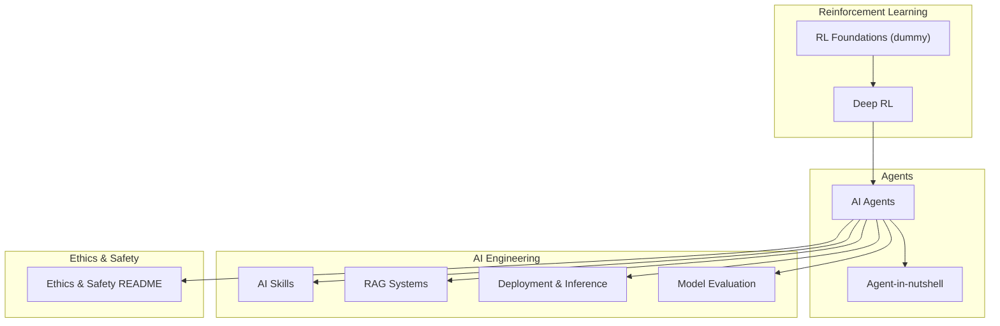
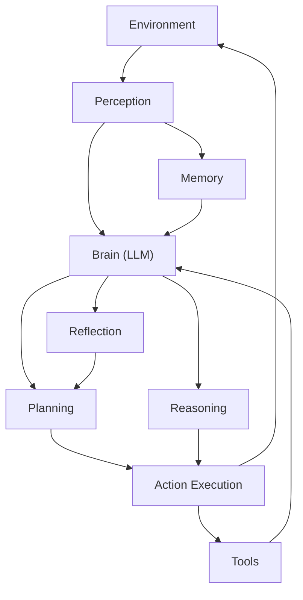
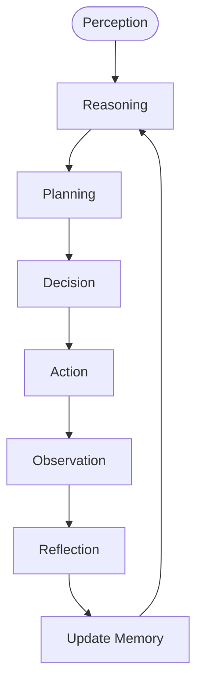
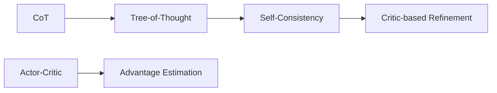
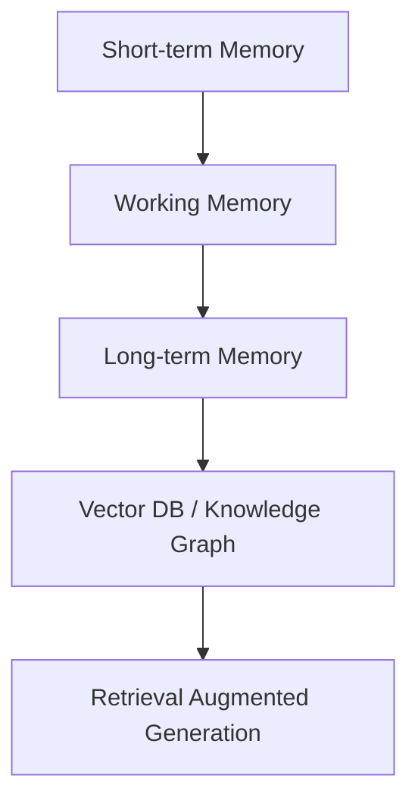
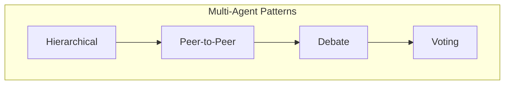
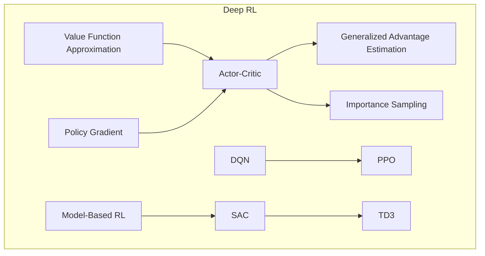
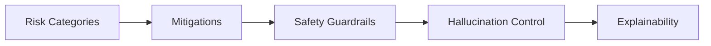
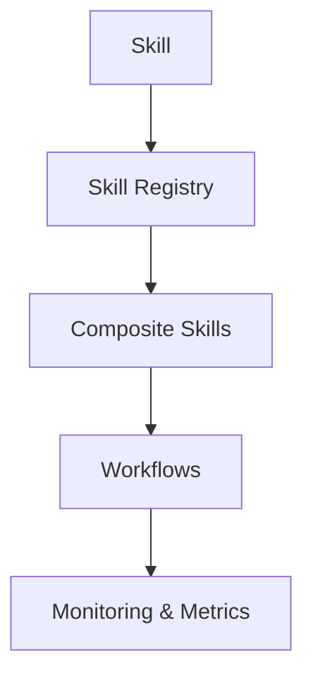
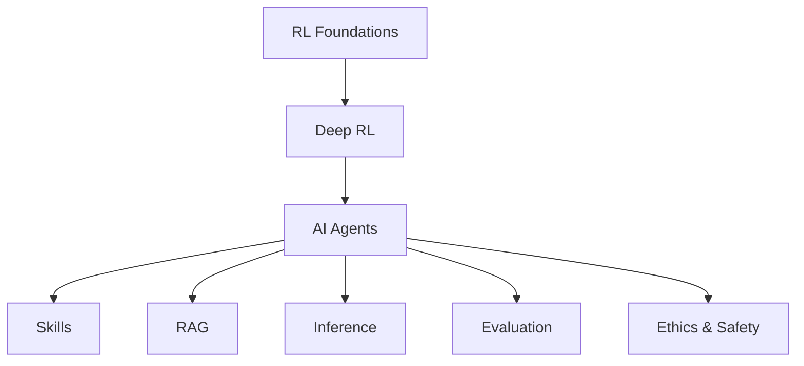

# AI Agents and Autonomous Systems

<cite>
**Referenced Files in This Document**
- [AI_Agents.md](file://docs/06_Reinforcement_Learning/AI_Agents/AI_Agents.md)
- [Agent-in-nutshell.md](file://docs/06_Reinforcement_Learning/AI_Agents/Agent-in-nutshell.md)
- [Deep_RL.md](file://docs/06_Reinforcement_Learning/Deep_RL/Deep_RL.md)
- [RL_Foundations_for_dummy.md](file://docs/06_Reinforcement_Learning/RL_Foundations/RL_Foundations_for_dummy.md)
- [Inference-in-nutshell.md](file://docs/07_AI_Engineering/Deployment_Inference/Inference-in-nutshell.md)
- [Skills-in-nutshell.md](file://docs/07_AI_Engineering/AI_Skills/Skills-in-nutshell.md)
- [RAG-in-nutshell.md](file://docs/07_AI_Engineering/RAG_Systems/RAG-in-nutshell.md)
- [Model_Evaluation.md](file://docs/07_AI_Engineering/Model_Evaluation/Model_Evaluation.md)
- [README.md](file://docs/08_Ethics_Safety/README.md)
</cite>

## Table of Contents
1. [Introduction](#introduction)
2. [Project Structure](#project-structure)
3. [Core Components](#core-components)
4. [Architecture Overview](#architecture-overview)
5. [Detailed Component Analysis](#detailed-component-analysis)
6. [Dependency Analysis](#dependency-analysis)
7. [Performance Considerations](#performance-considerations)
8. [Troubleshooting Guide](#troubleshooting-guide)
9. [Conclusion](#conclusion)
10. [Appendices](#appendices)

## Introduction
This document synthesizes the repository’s materials on AI agents and autonomous systems grounded in reinforcement learning (RL). It explains agent architectures, perception-action cycles, multi-agent systems, and distributed RL approaches. It also documents memory systems, planning capabilities, and decision-making frameworks, and covers advanced topics such as hierarchical RL, inverse RL, imitation learning, and transfer learning. Practical guidance is included for agent development workflows, simulation environments, testing methodologies, and deployment strategies, with emphasis on safety, robustness, interpretability, and ethical implications.

## Project Structure
The repository organizes RL and agent-related content under a structured hierarchy:
- Reinforcement Learning fundamentals and deep RL
- AI agents and autonomous systems
- AI engineering topics (skills, RAG, inference, evaluation)
- Ethics, safety, and alignment

**Diagram sources**
- [RL_Foundations_for_dummy.md:1-561](file://docs/06_Reinforcement_Learning/RL_Foundations/RL_Foundations_for_dummy.md#L1-L561)
- [Deep_RL.md:1-925](file://docs/06_Reinforcement_Learning/Deep_RL/Deep_RL.md#L1-L925)
- [AI_Agents.md:1-1287](file://docs/06_Reinforcement_Learning/AI_Agents/AI_Agents.md#L1-L1287)
- [Agent-in-nutshell.md:1-681](file://docs/06_Reinforcement_Learning/AI_Agents/Agent-in-nutshell.md#L1-L681)
- [Skills-in-nutshell.md:1-858](file://docs/07_AI_Engineering/AI_Skills/Skills-in-nutshell.md#L1-L858)
- [RAG-in-nutshell.md:1-575](file://docs/07_AI_Engineering/RAG_Systems/RAG-in-nutshell.md#L1-L575)
- [Inference-in-nutshell.md:1-521](file://docs/07_AI_Engineering/Deployment_Inference/Inference-in-nutshell.md#L1-L521)
- [Model_Evaluation.md:1-397](file://docs/07_AI_Engineering/Model_Evaluation/Model_Evaluation.md#L1-L397)
- [README.md:1-52](file://docs/08_Ethics_Safety/README.md#L1-L52)

**Section sources**
- [RL_Foundations_for_dummy.md:1-561](file://docs/06_Reinforcement_Learning/RL_Foundations/RL_Foundations_for_dummy.md#L1-L561)
- [Deep_RL.md:1-925](file://docs/06_Reinforcement_Learning/Deep_RL/Deep_RL.md#L1-L925)
- [AI_Agents.md:1-1287](file://docs/06_Reinforcement_Learning/AI_Agents/AI_Agents.md#L1-L1287)
- [Agent-in-nutshell.md:1-681](file://docs/06_Reinforcement_Learning/AI_Agents/Agent-in-nutshell.md#L1-L681)
- [Skills-in-nutshell.md:1-858](file://docs/07_AI_Engineering/AI_Skills/Skills-in-nutshell.md#L1-L858)
- [RAG-in-nutshell.md:1-575](file://docs/07_AI_Engineering/RAG_Systems/RAG-in-nutshell.md#L1-L575)
- [Inference-in-nutshell.md:1-521](file://docs/07_AI_Engineering/Deployment_Inference/Inference-in-nutshell.md#L1-L521)
- [Model_Evaluation.md:1-397](file://docs/07_AI_Engineering/Model_Evaluation/Model_Evaluation.md#L1-L397)
- [README.md:1-52](file://docs/08_Ethics_Safety/README.md#L1-L52)

## Core Components
- Agent architecture: perception, planning, decision-making, action execution, reflection, and memory.
- Perception-action cycle: OODA loop adapted to AI.
- Planning and reasoning: CoT, ToT, self-consistency, and critic-based refinement.
- Memory systems: short-term, working, and long-term memory with retrieval strategies.
- Multi-agent architectures: hierarchical, peer-to-peer, debate, and voting.
- Deep RL foundations: value function approximation, policy gradient, actor-critic, advantage estimation, importance sampling.
- Advanced RL: DQN, PPO, SAC, TD3, and model-based RL.
- Agent safety, hallucination control, and explainability.
- Production deployment, monitoring, and evaluation.

**Section sources**
- [AI_Agents.md:50-1287](file://docs/06_Reinforcement_Learning/AI_Agents/AI_Agents.md#L50-L1287)
- [Agent-in-nutshell.md:33-681](file://docs/06_Reinforcement_Learning/AI_Agents/Agent-in-nutshell.md#L33-L681)
- [Deep_RL.md:37-925](file://docs/06_Reinforcement_Learning/Deep_RL/Deep_RL.md#L37-L925)
- [RL_Foundations_for_dummy.md:49-561](file://docs/06_Reinforcement_Learning/RL_Foundations/RL_Foundations_for_dummy.md#L49-L561)

## Architecture Overview
The repository presents two complementary views of agent architecture:
- A layered, multi-component architecture integrating perception, memory, planning, reasoning, reflection, tools, and execution.
- A ReAct-style perception-action loop with feedback.

**Diagram sources**
- [AI_Agents.md:52-133](file://docs/06_Reinforcement_Learning/AI_Agents/AI_Agents.md#L52-L133)
- [Agent-in-nutshell.md:37-156](file://docs/06_Reinforcement_Learning/AI_Agents/Agent-in-nutshell.md#L37-L156)

**Section sources**
- [AI_Agents.md:52-133](file://docs/06_Reinforcement_Learning/AI_Agents/AI_Agents.md#L52-L133)
- [Agent-in-nutshell.md:37-156](file://docs/06_Reinforcement_Learning/AI_Agents/Agent-in-nutshell.md#L37-L156)

## Detailed Component Analysis

### Perception, Planning, Decision, Action, Reflection, Memory
- Perception: intake of text, images, sensor data.
- Planning: task decomposition, subgoal generation, plan refinement.
- Decision: policy selection guided by value/reasoning.
- Action: tool invocation, code execution, API calls, document operations.
- Reflection: self-evaluation, error analysis, strategy adjustment.
- Memory: short-term (context), working (plan/results), long-term (vector DB, knowledge graph, experience replay).

**Diagram sources**
- [AI_Agents.md:121-193](file://docs/06_Reinforcement_Learning/AI_Agents/AI_Agents.md#L121-L193)

**Section sources**
- [AI_Agents.md:19-193](file://docs/06_Reinforcement_Learning/AI_Agents/AI_Agents.md#L19-L193)
- [Agent-in-nutshell.md:85-156](file://docs/06_Reinforcement_Learning/AI_Agents/Agent-in-nutshell.md#L85-L156)

### Planning and Reasoning Methods
- Chain-of-Thought (CoT), Tree-of-Thought (ToT), Self-Consistency, and critic-based refinement.
- Actor-critic architecture and advantage estimation.

**Diagram sources**
- [AI_Agents.md:350-503](file://docs/06_Reinforcement_Learning/AI_Agents/AI_Agents.md#L350-L503)
- [Deep_RL.md:75-127](file://docs/06_Reinforcement_Learning/Deep_RL/Deep_RL.md#L75-L127)

**Section sources**
- [AI_Agents.md:350-503](file://docs/06_Reinforcement_Learning/AI_Agents/AI_Agents.md#L350-L503)
- [Deep_RL.md:75-127](file://docs/06_Reinforcement_Learning/Deep_RL/Deep_RL.md#L75-L127)

### Memory Systems and Retrieval
- Multi-layer memory: short-term, working, long-term.
- Retrieval strategies: similarity search, temporal decay, frequency weighting.
- RAG integration for grounded generation.

**Diagram sources**
- [AI_Agents.md:246-284](file://docs/06_Reinforcement_Learning/AI_Agents/AI_Agents.md#L246-L284)
- [RAG-in-nutshell.md:37-163](file://docs/07_AI_Engineering/RAG_Systems/RAG-in-nutshell.md#L37-L163)

**Section sources**
- [AI_Agents.md:246-284](file://docs/06_Reinforcement_Learning/AI_Agents/AI_Agents.md#L246-L284)
- [RAG-in-nutshell.md:37-163](file://docs/07_AI_Engineering/RAG_Systems/RAG-in-nutshell.md#L37-L163)

### Multi-Agent Architectures
- Hierarchical, peer-to-peer, debate, and voting.
- Coordination, conflict resolution, task allocation, and knowledge sharing.

**Diagram sources**
- [AI_Agents.md:285-347](file://docs/06_Reinforcement_Learning/AI_Agents/AI_Agents.md#L285-L347)

**Section sources**
- [AI_Agents.md:285-347](file://docs/06_Reinforcement_Learning/AI_Agents/AI_Agents.md#L285-L347)

### Deep RL Algorithms and Principles
- Value function approximation, policy gradient, actor-critic, advantage estimation, importance sampling.
- DQN (experience replay, target network), PPO (clipping), SAC (maximum entropy), TD3 (twin delayed DDPG), and model-based RL.

**Diagram sources**
- [Deep_RL.md:39-143](file://docs/06_Reinforcement_Learning/Deep_RL/Deep_RL.md#L39-L143)
- [Deep_RL.md:146-424](file://docs/06_Reinforcement_Learning/Deep_RL/Deep_RL.md#L146-L424)

**Section sources**
- [Deep_RL.md:39-424](file://docs/06_Reinforcement_Learning/Deep_RL/Deep_RL.md#L39-L424)

### Agent Safety, Hallucination Control, and Explainability
- Safety boundaries: risk categories and mitigations.
- Hallucination control: tool grounding, self-verification, multi-agent cross-check, RAG.
- Explainability: transparent reasoning traces, visualization, natural language explanations, audit logs.

**Diagram sources**
- [AI_Agents.md:870-998](file://docs/06_Reinforcement_Learning/AI_Agents/AI_Agents.md#L870-L998)

**Section sources**
- [AI_Agents.md:870-998](file://docs/06_Reinforcement_Learning/AI_Agents/AI_Agents.md#L870-L998)

### Skills, Tools, and Workflows
- Skills as reusable capabilities with standardized input/output schemas.
- Composable skills enabling complex workflows.
- Monitoring, permissions, and operational deployment.

**Diagram sources**
- [Skills-in-nutshell.md:69-401](file://docs/07_AI_Engineering/AI_Skills/Skills-in-nutshell.md#L69-L401)

**Section sources**
- [Skills-in-nutshell.md:69-401](file://docs/07_AI_Engineering/AI_Skills/Skills-in-nutshell.md#L69-L401)

### Deployment, Inference, and Evaluation
- Inference pipeline: pre/post-processing, model serving, optimization (quantization, batching).
- Evaluation: classification/regression/retrieval metrics, statistical significance, calibration, fairness.

**Diagram sources**
- [Inference-in-nutshell.md:69-165](file://docs/07_AI_Engineering/Deployment_Inference/Inference-in-nutshell.md#L69-L165)
- [Model_Evaluation.md:215-397](file://docs/07_AI_Engineering/Model_Evaluation/Model_Evaluation.md#L215-L397)

**Section sources**
- [Inference-in-nutshell.md:69-165](file://docs/07_AI_Engineering/Deployment_Inference/Inference-in-nutshell.md#L69-L165)
- [Model_Evaluation.md:215-397](file://docs/07_AI_Engineering/Model_Evaluation/Model_Evaluation.md#L215-L397)

## Dependency Analysis
- RL Foundations underpin Deep RL.
- Deep RL supports agent decision-making and planning.
- Agents integrate skills, RAG, and inference.
- Evaluation and ethics/safety inform agent design and deployment.

**Diagram sources**
- [RL_Foundations_for_dummy.md:1-561](file://docs/06_Reinforcement_Learning/RL_Foundations/RL_Foundations_for_dummy.md#L1-L561)
- [Deep_RL.md:1-925](file://docs/06_Reinforcement_Learning/Deep_RL/Deep_RL.md#L1-L925)
- [AI_Agents.md:1-1287](file://docs/06_Reinforcement_Learning/AI_Agents/AI_Agents.md#L1-L1287)
- [Skills-in-nutshell.md:1-858](file://docs/07_AI_Engineering/AI_Skills/Skills-in-nutshell.md#L1-L858)
- [RAG-in-nutshell.md:1-575](file://docs/07_AI_Engineering/RAG_Systems/RAG-in-nutshell.md#L1-L575)
- [Inference-in-nutshell.md:1-521](file://docs/07_AI_Engineering/Deployment_Inference/Inference-in-nutshell.md#L1-L521)
- [Model_Evaluation.md:1-397](file://docs/07_AI_Engineering/Model_Evaluation/Model_Evaluation.md#L1-L397)
- [README.md:1-52](file://docs/08_Ethics_Safety/README.md#L1-L52)

**Section sources**
- [RL_Foundations_for_dummy.md:1-561](file://docs/06_Reinforcement_Learning/RL_Foundations/RL_Foundations_for_dummy.md#L1-L561)
- [Deep_RL.md:1-925](file://docs/06_Reinforcement_Learning/Deep_RL/Deep_RL.md#L1-L925)
- [AI_Agents.md:1-1287](file://docs/06_Reinforcement_Learning/AI_Agents/AI_Agents.md#L1-L1287)
- [Skills-in-nutshell.md:1-858](file://docs/07_AI_Engineering/AI_Skills/Skills-in-nutshell.md#L1-L858)
- [RAG-in-nutshell.md:1-575](file://docs/07_AI_Engineering/RAG_Systems/RAG-in-nutshell.md#L1-L575)
- [Inference-in-nutshell.md:1-521](file://docs/07_AI_Engineering/Deployment_Inference/Inference-in-nutshell.md#L1-L521)
- [Model_Evaluation.md:1-397](file://docs/07_AI_Engineering/Model_Evaluation/Model_Evaluation.md#L1-L397)
- [README.md:1-52](file://docs/08_Ethics_Safety/README.md#L1-L52)

## Performance Considerations
- Inference optimization: quantization, ONNX export, TensorRT, request batching.
- Training stability: experience replay, target networks, clipping, normalization.
- Sample efficiency: HER, curiosity, reward shaping, domain randomization.
- Monitoring: latency, throughput, error rates, GPU/memory utilization.

[No sources needed since this section provides general guidance]

## Troubleshooting Guide
Common issues and remedies:
- Infinite loops: max steps, loop detection, progress monitoring, self-interruption.
- Hallucinations: tool grounding, verification, multi-agent cross-check, RAG.
- Safety risks: sandboxing, whitelist, human-in-the-loop, budgeting.
- Performance bottlenecks: quantization, batching, caching, smaller models.

**Section sources**
- [AI_Agents.md:1149-1229](file://docs/06_Reinforcement_Learning/AI_Agents/AI_Agents.md#L1149-L1229)
- [Inference-in-nutshell.md:421-521](file://docs/07_AI_Engineering/Deployment_Inference/Inference-in-nutshell.md#L421-L521)

## Conclusion
The repository provides a cohesive foundation for building AI agents and autonomous systems rooted in RL. It connects RL theory to practical agent design, integrates skills and RAG for grounded decision-making, and emphasizes production-grade deployment, evaluation, and safety. By combining perception-action cycles, planning and reasoning, memory, and multi-agent collaboration, practitioners can develop robust, interpretable, and ethically aligned autonomous systems.

[No sources needed since this section summarizes without analyzing specific files]

## Appendices

### Practical Development Workflow
- Start with RL foundations and deep RL.
- Design agent architecture with perception, planning, memory, and tools.
- Implement skills and composable workflows.
- Integrate RAG for grounded generation.
- Evaluate rigorously and deploy with inference optimization and monitoring.

**Section sources**
- [RL_Foundations_for_dummy.md:1-561](file://docs/06_Reinforcement_Learning/RL_Foundations/RL_Foundations_for_dummy.md#L1-L561)
- [Deep_RL.md:1-925](file://docs/06_Reinforcement_Learning/Deep_RL/Deep_RL.md#L1-L925)
- [Agent-in-nutshell.md:160-681](file://docs/06_Reinforcement_Learning/AI_Agents/Agent-in-nutshell.md#L160-L681)
- [Skills-in-nutshell.md:140-858](file://docs/07_AI_Engineering/AI_Skills/Skills-in-nutshell.md#L140-L858)
- [RAG-in-nutshell.md:166-575](file://docs/07_AI_Engineering/RAG_Systems/RAG-in-nutshell.md#L166-L575)
- [Inference-in-nutshell.md:111-521](file://docs/07_AI_Engineering/Deployment_Inference/Inference-in-nutshell.md#L111-L521)
- [Model_Evaluation.md:215-397](file://docs/07_AI_Engineering/Model_Evaluation/Model_Evaluation.md#L215-L397)

### Real-World Applications
- Robotics control, autonomous driving, game AI, recommendation systems, resource scheduling, finance trading, and scientific discovery.

**Section sources**
- [Deep_RL.md:587-622](file://docs/06_Reinforcement_Learning/Deep_RL/Deep_RL.md#L587-L622)

### Advanced Topics
- Hierarchical RL, inverse RL, imitation learning, transfer learning, world models, meta-RL, and human alignment.

**Section sources**
- [Deep_RL.md:704-725](file://docs/06_Reinforcement_Learning/Deep_RL/Deep_RL.md#L704-L725)
- [README.md:25-52](file://docs/08_Ethics_Safety/README.md#L25-L52)