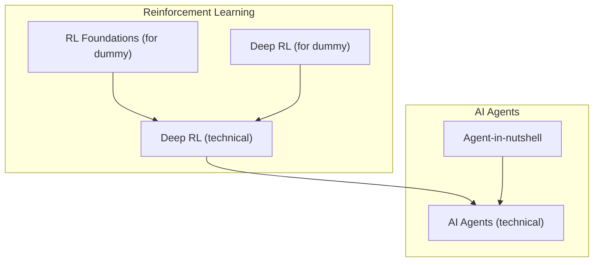
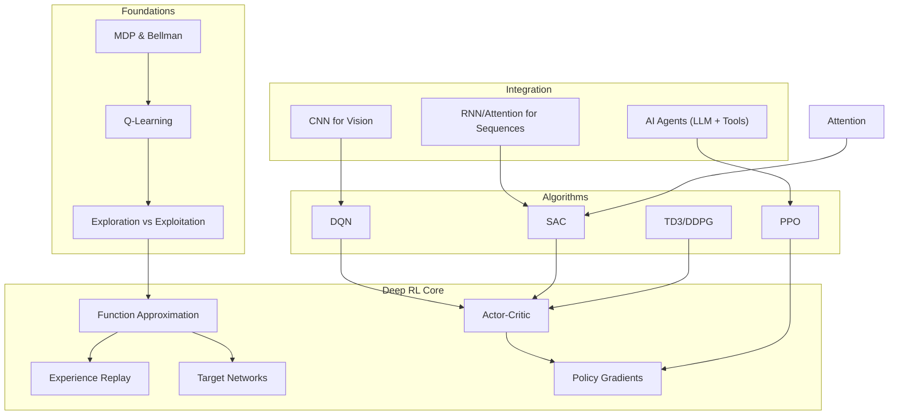
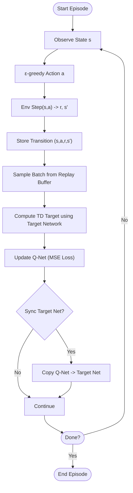
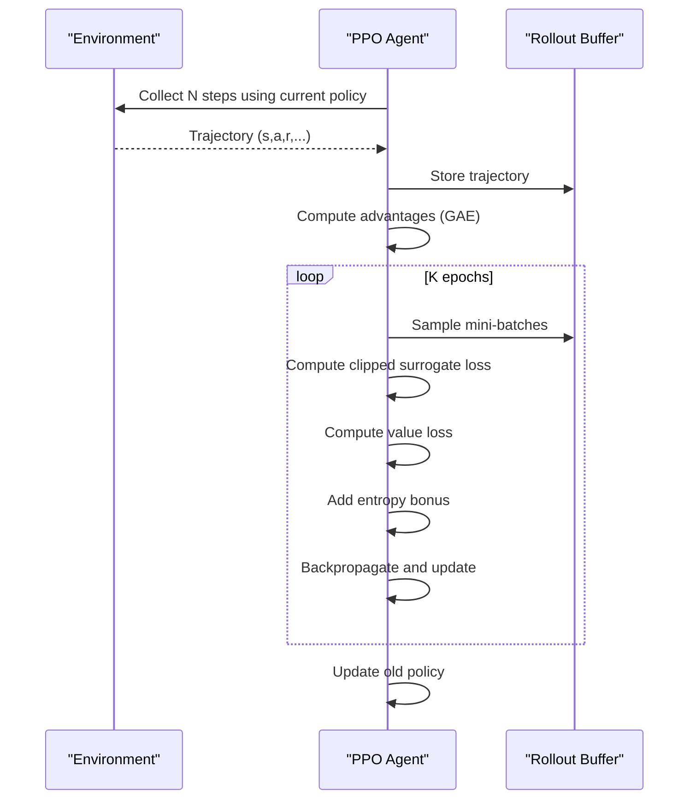
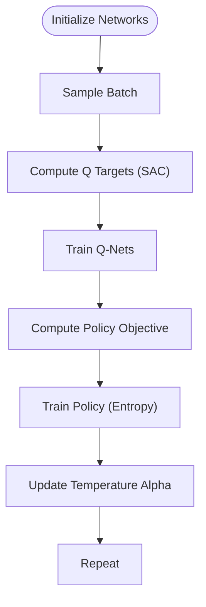
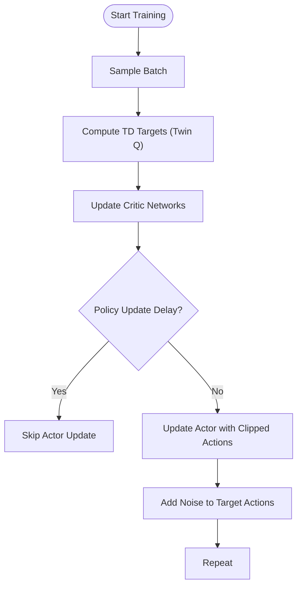
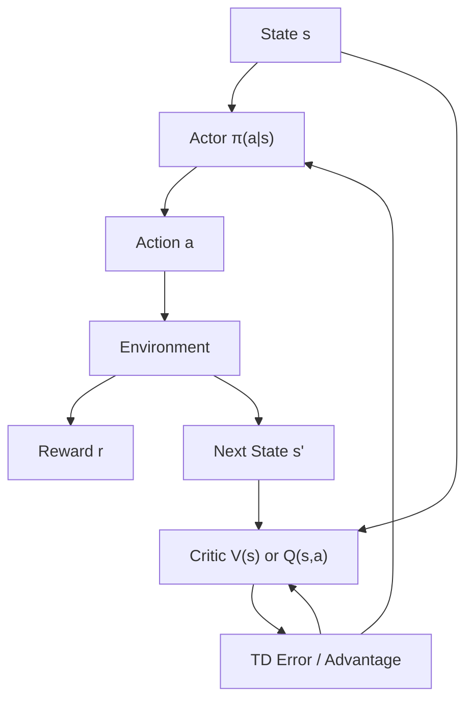
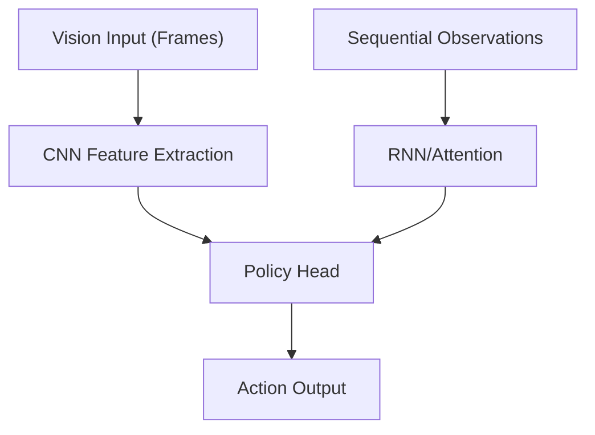
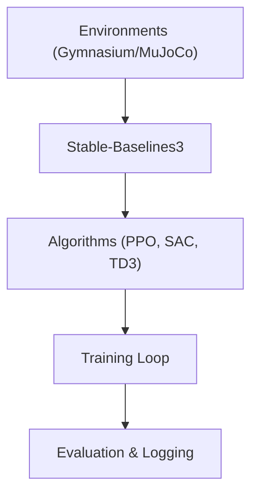
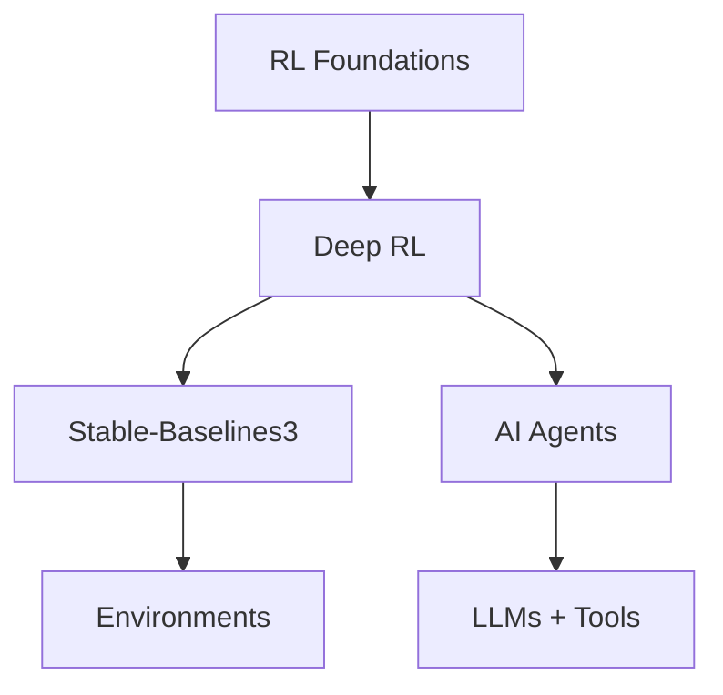

# Deep Reinforcement Learning

<cite>
**Referenced Files in This Document**
- [Deep_RL.md](file://docs/06_Reinforcement_Learning/Deep_RL/Deep_RL.md)
- [Deep_RL_for_dummy.md](file://docs/06_Reinforcement_Learning/Deep_RL/Deep_RL_for_dummy.md)
- [RL_Foundations_for_dummy.md](file://docs/06_Reinforcement_Learning/RL_Foundations/RL_Foundations_for_dummy.md)
- [AI_Agents.md](file://docs/06_Reinforcement_Learning/AI_Agents/AI_Agents.md)
- [Agent-in-nutshell.md](file://docs/06_Reinforcement_Learning/AI_Agents/Agent-in-nutshell.md)
</cite>

## Table of Contents
1. [Introduction](#introduction)
2. [Project Structure](#project-structure)
3. [Core Components](#core-components)
4. [Architecture Overview](#architecture-overview)
5. [Detailed Component Analysis](#detailed-component-analysis)
6. [Dependency Analysis](#dependency-analysis)
7. [Performance Considerations](#performance-considerations)
8. [Troubleshooting Guide](#troubleshooting-guide)
9. [Conclusion](#conclusion)
10. [Appendices](#appendices)

## Introduction
This document synthesizes the repository’s materials on deep reinforcement learning (Deep RL) into a practical, layered guide. It covers neural network-based function approximation, DQN, policy gradient methods, actor-critic architectures, and advanced algorithms such as PPO, DDPG/TD3, and SAC. It also explains experience replay, target networks, and the challenges of credit assignment in deep RL. Practical topics include integration of deep learning with RL (CNNs for vision, RNNs/attention for sequential decision-making), hyperparameter tuning, exploration strategies, reward shaping, regularization, library usage, performance optimization, and debugging.

## Project Structure
The Deep RL content is organized as a comprehensive technical article with a simplified companion for beginners. It is complemented by foundational RL materials and advanced AI agent architectures that demonstrate how RL integrates with modern systems.

**Diagram sources**
- [Deep_RL.md:1-925](file://docs/06_Reinforcement_Learning/Deep_RL/Deep_RL.md#L1-L925)
- [Deep_RL_for_dummy.md:1-653](file://docs/06_Reinforcement_Learning/Deep_RL/Deep_RL_for_dummy.md#L1-L653)
- [RL_Foundations_for_dummy.md:1-561](file://docs/06_Reinforcement_Learning/RL_Foundations/RL_Foundations_for_dummy.md#L1-L561)
- [AI_Agents.md:1-1287](file://docs/06_Reinforcement_Learning/AI_Agents/AI_Agents.md#L1-L1287)
- [Agent-in-nutshell.md:1-681](file://docs/06_Reinforcement_Learning/AI_Agents/Agent-in-nutshell.md#L1-L681)

**Section sources**
- [Deep_RL.md:1-925](file://docs/06_Reinforcement_Learning/Deep_RL/Deep_RL.md#L1-L925)
- [Deep_RL_for_dummy.md:1-653](file://docs/06_Reinforcement_Learning/Deep_RL/Deep_RL_for_dummy.md#L1-L653)
- [RL_Foundations_for_dummy.md:1-561](file://docs/06_Reinforcement_Learning/RL_Foundations/RL_Foundations_for_dummy.md#L1-L561)
- [AI_Agents.md:1-1287](file://docs/06_Reinforcement_Learning/AI_Agents/AI_Agents.md#L1-L1287)
- [Agent-in-nutshell.md:1-681](file://docs/06_Reinforcement_Learning/AI_Agents/Agent-in-nutshell.md#L1-L681)

## Core Components
- Neural network function approximation for value functions and policies
- Experience replay and target networks for stability
- Actor-critic architecture combining value evaluation with policy updates
- Advanced algorithms: DQN, PPO, SAC, TD3/DDPG
- Integration of CNNs, RNNs, and attention for perception and sequential decision-making
- Practical considerations: hyperparameters, exploration, reward shaping, regularization, and debugging

**Section sources**
- [Deep_RL.md:37-144](file://docs/06_Reinforcement_Learning/Deep_RL/Deep_RL.md#L37-L144)
- [Deep_RL.md:146-424](file://docs/06_Reinforcement_Learning/Deep_RL/Deep_RL.md#L146-L424)
- [Deep_RL.md:425-623](file://docs/06_Reinforcement_Learning/Deep_RL/Deep_RL.md#L425-L623)

## Architecture Overview
The repository presents a modular view of Deep RL, starting from foundational RL concepts and progressing to advanced actor-critic and policy-gradient algorithms. It also connects RL to modern AI agents that integrate LLMs, tools, and memory.

**Diagram sources**
- [Deep_RL.md:1-925](file://docs/06_Reinforcement_Learning/Deep_RL/Deep_RL.md#L1-L925)
- [RL_Foundations_for_dummy.md:1-561](file://docs/06_Reinforcement_Learning/RL_Foundations/RL_Foundations_for_dummy.md#L1-L561)
- [AI_Agents.md:1-1287](file://docs/06_Reinforcement_Learning/AI_Agents/AI_Agents.md#L1-L1287)

## Detailed Component Analysis

### DQN: Deep Q-Network
- Neural network architecture for Q-function approximation
- Experience replay to break temporal correlation and improve data efficiency
- Target networks to stabilize bootstrapping by decoupling online and target value targets
- Variants: Double DQN, Dueling DQN, Prioritized Experience Replay, Rainbow DQN

**Diagram sources**
- [Deep_RL.md:146-245](file://docs/06_Reinforcement_Learning/Deep_RL/Deep_RL.md#L146-L245)

**Section sources**
- [Deep_RL.md:146-245](file://docs/06_Reinforcement_Learning/Deep_RL/Deep_RL.md#L146-L245)

### PPO: Proximal Policy Optimization
- Policy gradient with clipped surrogate objective to limit policy updates
- Generalized Advantage Estimation (GAE) for bias-variance trade-off
- Entropy bonus to encourage exploration
- Stable and efficient for both discrete and continuous control

**Diagram sources**
- [Deep_RL.md:246-322](file://docs/06_Reinforcement_Learning/Deep_RL/Deep_RL.md#L246-L322)

**Section sources**
- [Deep_RL.md:246-322](file://docs/06_Reinforcement_Learning/Deep_RL/Deep_RL.md#L246-L322)

### SAC: Soft Actor-Critic
- Maximum entropy reinforcement learning for continuous control
- Two Q networks and one target Q network to reduce overestimation
- Automatic entropy temperature adjustment
- Suitable for complex continuous control tasks

**Diagram sources**
- [Deep_RL.md:323-376](file://docs/06_Reinforcement_Learning/Deep_RL/Deep_RL.md#L323-L376)

**Section sources**
- [Deep_RL.md:323-376](file://docs/06_Reinforcement_Learning/Deep_RL/Deep_RL.md#L323-L376)

### TD3/DDPG: Twin Delayed Deep Deterministic
- Off-policy actor-critic with delayed policy updates
- Twin Q-networks to reduce overestimation
- Target policy smoothing to improve robustness

**Diagram sources**
- [Deep_RL.md:377-400](file://docs/06_Reinforcement_Learning/Deep_RL/Deep_RL.md#L377-L400)

**Section sources**
- [Deep_RL.md:377-400](file://docs/06_Reinforcement_Learning/Deep_RL/Deep_RL.md#L377-L400)

### Actor-Critic and Policy Gradients
- Actor-Critic combines value evaluation (Critic) and policy improvement (Actor)
- Policy gradients maximize expected return via stochastic policy parameterization
- Advantage function reduces variance compared to Monte Carlo returns

**Diagram sources**
- [Deep_RL.md:75-127](file://docs/06_Reinforcement_Learning/Deep_RL/Deep_RL.md#L75-L127)

**Section sources**
- [Deep_RL.md:58-127](file://docs/06_Reinforcement_Learning/Deep_RL/Deep_RL.md#L58-L127)

### Integration of Deep Learning with RL
- CNNs for visual inputs (e.g., Atari frames)
- RNNs/attention for sequential decision-making and memory
- Attention mechanisms for long-range dependencies and focus

**Diagram sources**
- [Deep_RL.md:146-245](file://docs/06_Reinforcement_Learning/Deep_RL/Deep_RL.md#L146-L245)

**Section sources**
- [Deep_RL.md:146-245](file://docs/06_Reinforcement_Learning/Deep_RL/Deep_RL.md#L146-L245)

### Practical Implementation Details and Libraries
- Stable-Baselines3 for PPO and other algorithms
- Gymnasium environments
- MuJoCo and Isaac Gym for physics simulation
- RLlib for distributed training

**Diagram sources**
- [Deep_RL.md:906-917](file://docs/06_Reinforcement_Learning/Deep_RL/Deep_RL.md#L906-L917)

**Section sources**
- [Deep_RL.md:906-917](file://docs/06_Reinforcement_Learning/Deep_RL/Deep_RL.md#L906-L917)

## Dependency Analysis
Deep RL depends on:
- Foundational RL concepts (MDP, Bellman, Q-learning)
- Deep learning infrastructure (neural networks, optimization)
- Environment simulation (Gymnasium, MuJoCo)
- Agent frameworks for higher-level integration (LangChain, AutoGen)

**Diagram sources**
- [Deep_RL.md:1-925](file://docs/06_Reinforcement_Learning/Deep_RL/Deep_RL.md#L1-L925)
- [RL_Foundations_for_dummy.md:1-561](file://docs/06_Reinforcement_Learning/RL_Foundations/RL_Foundations_for_dummy.md#L1-L561)
- [AI_Agents.md:1-1287](file://docs/06_Reinforcement_Learning/AI_Agents/AI_Agents.md#L1-L1287)

**Section sources**
- [Deep_RL.md:1-925](file://docs/06_Reinforcement_Learning/Deep_RL/Deep_RL.md#L1-L925)
- [RL_Foundations_for_dummy.md:1-561](file://docs/06_Reinforcement_Learning/RL_Foundations/RL_Foundations_for_dummy.md#L1-L561)
- [AI_Agents.md:1-1287](file://docs/06_Reinforcement_Learning/AI_Agents/AI_Agents.md#L1-L1287)

## Performance Considerations
- Stability: target networks, experience replay, gradient clipping, entropy regularization
- Sample efficiency: off-policy methods (SAC/TD3), prioritized replay, model-based planning
- Exploration: entropy bonus, curiosity, distributional methods
- Scaling: parallel environments, distributed RL, curriculum learning

[No sources needed since this section provides general guidance]

## Troubleshooting Guide
Common issues and remedies:
- Unstable training: lower learning rate, gradient clipping, smaller policy updates (PPO), delayed updates (TD3)
- Poor sample efficiency: use off-policy algorithms, experience replay, domain randomization
- Overestimation: twin critics, target smoothing, entropy regularization
- Debugging: monitor returns, Q-values, policy entropy, losses, gradient norms

**Section sources**
- [Deep_RL.md:625-832](file://docs/06_Reinforcement_Learning/Deep_RL/Deep_RL.md#L625-L832)

## Conclusion
The repository’s Deep RL materials present a cohesive progression from foundational RL to advanced actor-critic and policy-gradient methods, with strong emphasis on stability, sample efficiency, and practical implementation. The integration with AI agents demonstrates how RL can be embedded into broader autonomous systems leveraging LLMs, tools, and memory.

[No sources needed since this section summarizes without analyzing specific files]

## Appendices

### Algorithm Selection Guide
- Discrete actions: DQN variants or PPO
- Continuous actions: PPO, SAC, TD3
- Offline settings: BCQ, CQL, IQL
- Model-based planning: MuZero, MBPO

**Section sources**
- [Deep_RL.md:685-702](file://docs/06_Reinforcement_Learning/Deep_RL/Deep_RL.md#L685-L702)

### Beginner-Friendly Highlights
- DQN as “learning by playing games”
- PPO as “steady progress without big mistakes”
- Actor-critic as “one evaluates, one acts”

**Section sources**
- [Deep_RL_for_dummy.md:89-472](file://docs/06_Reinforcement_Learning/Deep_RL/Deep_RL_for_dummy.md#L89-L472)

### AI Agents and RL Integration
- AI agents combine LLMs, tools, memory, and planning
- RLHF uses PPO to align language models with human preferences
- Multi-agent collaboration and safety considerations

**Section sources**
- [AI_Agents.md:1-1287](file://docs/06_Reinforcement_Learning/AI_Agents/AI_Agents.md#L1-L1287)
- [Agent-in-nutshell.md:1-681](file://docs/06_Reinforcement_Learning/AI_Agents/Agent-in-nutshell.md#L1-L681)