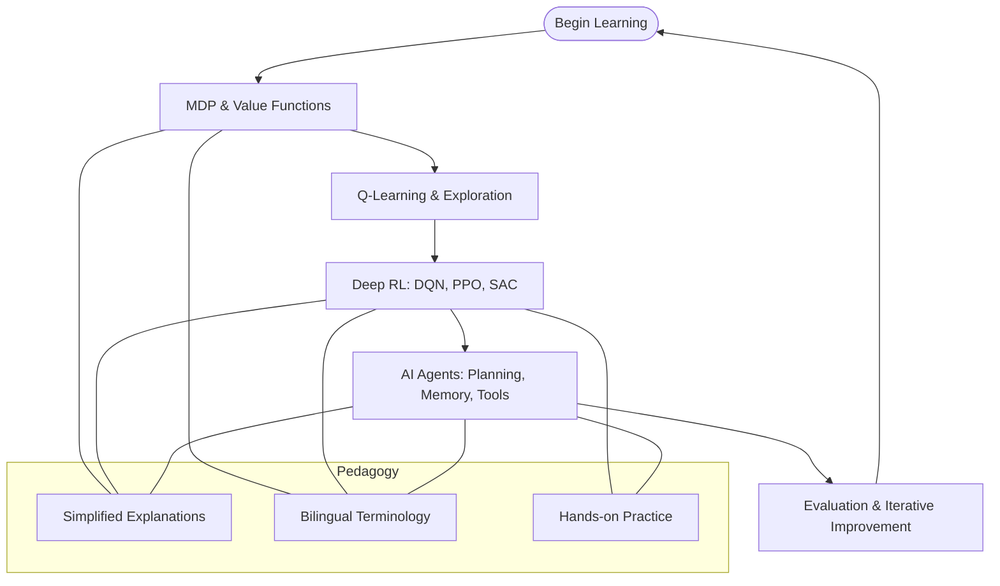
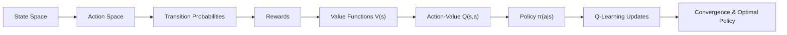
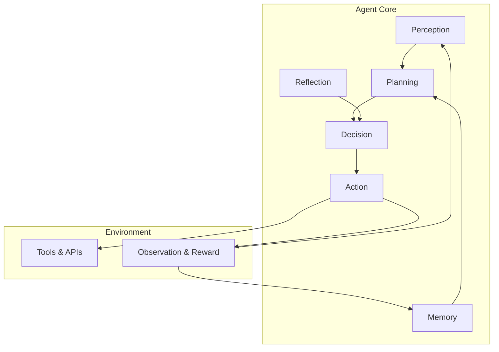
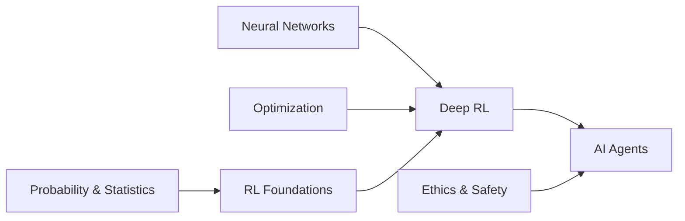
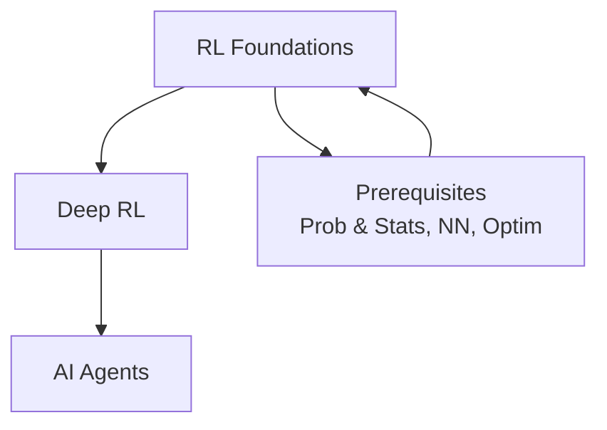

# Reinforcement Learning Education

<cite>
**Referenced Files in This Document**
- [README.md](file://docs/06_Reinforcement_Learning/README.md)
- [README_for_dummy.md](file://docs/06_Reinforcement_Learning/README_for_dummy.md)
- [RL_Foundations_for_dummy.md](file://docs/06_Reinforcement_Learning/RL_Foundations/RL_Foundations_for_dummy.md)
- [Deep_RL.md](file://docs/06_Reinforcement_Learning/Deep_RL/Deep_RL.md)
- [Deep_RL_for_dummy.md](file://docs/06_Reinforcement_Learning/Deep_RL/Deep_RL_for_dummy.md)
- [AI_Agents.md](file://docs/06_Reinforcement_Learning/AI_Agents/AI_Agents.md)
- [Agent-in-nutshell.md](file://docs/06_Reinforcement_Learning/AI_Agents/Agent-in-nutshell.md)
- [README.md](file://README.md)
</cite>

## Table of Contents
1. [Introduction](#introduction)
2. [Project Structure](#project-structure)
3. [Core Components](#core-components)
4. [Architecture Overview](#architecture-overview)
5. [Detailed Component Analysis](#detailed-component-analysis)
6. [Dependency Analysis](#dependency-analysis)
7. [Performance Considerations](#performance-considerations)
8. [Troubleshooting Guide](#troubleshooting-guide)
9. [Conclusion](#conclusion)
10. [Appendices](#appendices)

## Introduction
This document presents a comprehensive reinforcement learning education system designed to bridge theoretical RL foundations with practical implementation and modern AI agent architectures. The curriculum follows a structured learning progression from Markov decision processes and value functions to policy gradient methods, actor-critic frameworks, and advanced autonomous agent systems. It emphasizes pedagogical clarity through simplified explanations, bilingual terminology support, and a seamless integration of theory and hands-on practice.

The system is part of a larger knowledge base that traces concepts to seminal RL research and industry innovations, ensuring learners gain both conceptual understanding and practical skills needed to build intelligent systems capable of autonomous decision-making.

## Project Structure
The reinforcement learning module is organized into three pillars:
- RL Foundations: MDPs, Bellman equations, value functions, Q-learning, exploration-exploitation trade-offs
- Deep RL: DQN, PPO, SAC, actor-critic, and modern deep RL algorithms
- AI Agents: Planning, memory, tool use, multi-agent systems, and autonomous decision-making

```mermaid
graph TB
subgraph "Reinforcement Learning Module"
A["RL Foundations<br/>MDP, Bellman, Q-Learning"]
B["Deep RL<br/>DQN, PPO, SAC, Actor-Critic"]
C["AI Agents<br/>Planning, Memory, Tools, Multi-Agent"]
end
A --> B
B --> C
subgraph "Pedagogy"
D["Simplified Explanations"]
E["Bilingual Terminology"]
F["Hands-on Code"]
end
A --- D
B --- D
C --- D
A --- E
B --- E
C --- E
B --- F
C --- F
```



**Diagram sources**
- [README.md:1-59](file://docs/06_Reinforcement_Learning/README.md#L1-L59)
- [README_for_dummy.md:1-134](file://docs/06_Reinforcement_Learning/README_for_dummy.md#L1-L134)

**Section sources**
- [README.md:1-59](file://docs/06_Reinforcement_Learning/README.md#L1-L59)
- [README_for_dummy.md:1-134](file://docs/06_Reinforcement_Learning/README_for_dummy.md#L1-L134)

## Core Components
- RL Foundations: Introduces MDPs, policies, value functions, Bellman equations, Q-learning, and ε-greedy exploration. Provides conceptual clarity and visual learning aids.
- Deep RL: Bridges tabular RL to high-dimensional domains using neural networks, covering DQN (CNN input, experience replay, target network), PPO (clipped surrogate objectives), SAC (maximum entropy), and actor-critic methods.
- AI Agents: Integrates LLMs with planning, memory, and tool use to form autonomous systems, including ReAct, Reflexion, and multi-agent collaboration patterns.

Pedagogical features:
- Simplified explanations for complex RL concepts
- Bilingual terminology system (English and Chinese)
- Practical code examples and framework integrations
- Clear prerequisite mapping to related topics

**Section sources**
- [RL_Foundations_for_dummy.md:1-561](file://docs/06_Reinforcement_Learning/RL_Foundations/RL_Foundations_for_dummy.md#L1-L561)
- [Deep_RL.md:1-800](file://docs/06_Reinforcement_Learning/Deep_RL/Deep_RL.md#L1-L800)
- [Deep_RL_for_dummy.md:1-653](file://docs/06_Reinforcement_Learning/Deep_RL/Deep_RL_for_dummy.md#L1-L653)
- [AI_Agents.md:1-1287](file://docs/06_Reinforcement_Learning/AI_Agents/AI_Agents.md#L1-L1287)
- [Agent-in-nutshell.md:1-681](file://docs/06_Reinforcement_Learning/AI_Agents/Agent-in-nutshell.md#L1-L681)
- [README.md:1-73](file://README.md#L1-L73)

## Architecture Overview
The RL education architecture progresses from mathematical modeling to algorithmic implementation and finally to autonomous agent systems. The learning pipeline integrates:
- Foundational theory (MDPs, value functions, Bellman recursion)
- Deep RL techniques (function approximation, policy gradients, actor-critic)
- Agent architectures (planning, memory, tool use, multi-agent coordination)



**Diagram sources**
- [README.md:1-59](file://docs/06_Reinforcement_Learning/README.md#L1-L59)
- [Deep_RL.md:1-800](file://docs/06_Reinforcement_Learning/Deep_RL/Deep_RL.md#L1-L800)
- [AI_Agents.md:1-1287](file://docs/06_Reinforcement_Learning/AI_Agents/AI_Agents.md#L1-L1287)

## Detailed Component Analysis

### RL Foundations: MDPs, Value Functions, and Q-Learning
- MDPs: States, actions, transitions, rewards, and goals mapped to real-world scenarios (e.g., navigating a mall).
- Policies: Deterministic and stochastic strategies akin to personal driving rules.
- Value Functions: State-value V(s) and action-value Q(s,a) as "long-term satisfaction" measures.
- Q-Learning: Tabular method for learning optimal action-values with iterative updates and convergence.
- Exploration vs Exploitation: ε-greedy balancing to discover better actions while leveraging known good ones.
- Bellman Equations: Recursive relationship enabling dynamic programming and temporal difference learning.



**Diagram sources**
- [RL_Foundations_for_dummy.md:51-300](file://docs/06_Reinforcement_Learning/RL_Foundations/RL_Foundations_for_dummy.md#L51-L300)

**Section sources**
- [RL_Foundations_for_dummy.md:1-561](file://docs/06_Reinforcement_Learning/RL_Foundations/RL_Foundations_for_dummy.md#L1-L561)

### Deep RL: From Tabular Methods to Neural Networks
- DQN: CNN input for pixel-level tasks, experience replay for stability, target network for reduced bootstrapping variance.
- PPO: Clipped surrogate objectives to stabilize policy updates, entropy bonus for exploration, and generalized advantage estimation.
- SAC: Maximum entropy RL with twin Q-networks, automatic entropy tuning, and off-policy efficiency.
- Actor-Critic: Joint policy and value function learning with TD error feedback.

```mermaid
sequenceDiagram
participant Env as "Environment"
participant Actor as "Actor (Policy)"
participant Critic as "Critic (Value)"
participant Buffer as "Experience Buffer"
Env->>Actor : State s
Actor->>Env : Action a ~ π(·|s)
Env-->>Actor : Reward r, Next State s'
Actor->>Buffer : Store (s,a,r,s')
Critic->>Buffer : Sample batch
Critic->>Critic : TD Target y=r+γV(s')
Critic-->>Actor : TD Error δ
Actor->>Actor : Policy Update (Clipped Surrogate or PG)
Critic->>Critic : Value Update
```

**Diagram sources**
- [Deep_RL.md:75-127](file://docs/06_Reinforcement_Learning/Deep_RL/Deep_RL.md#L75-L127)

**Section sources**
- [Deep_RL.md:1-800](file://docs/06_Reinforcement_Learning/Deep_RL/Deep_RL.md#L1-L800)
- [Deep_RL_for_dummy.md:1-653](file://docs/06_Reinforcement_Learning/Deep_RL/Deep_RL_for_dummy.md#L1-L653)

### AI Agents: Planning, Memory, Tools, and Multi-Agent Systems
- Agent Architecture: Perception → Planning → Decision → Action → Reflection → Memory → Loop.
- ReAct: Alternating reasoning and acting with external tool use.
- Reflexion: Self-evaluation and iterative improvement loops.
- Memory Systems: Short-term, working, and long-term memory with retrieval strategies.
- Multi-Agent Patterns: Hierarchical, peer-to-peer, debate, and voting architectures.
- Safety and Reliability: Risk controls, human-in-the-loop, hallucination mitigation, and auditability.



**Diagram sources**
- [AI_Agents.md:121-133](file://docs/06_Reinforcement_Learning/AI_Agents/AI_Agents.md#L121-L133)

**Section sources**
- [AI_Agents.md:1-1287](file://docs/06_Reinforcement_Learning/AI_Agents/AI_Agents.md#L1-L1287)
- [Agent-in-nutshell.md:1-681](file://docs/06_Reinforcement_Learning/AI_Agents/Agent-in-nutshell.md#L1-L681)

## Dependency Analysis
The RL curriculum builds upon foundational mathematics and deep learning, then extends into agent engineering and safety alignment. Dependencies include:
- Prerequisites: Probability and statistics, neural networks, and optimization
- Interdependencies: RL Foundations inform Deep RL; Deep RL underpins AI Agents
- Cross-cutting: Ethics and safety considerations integrate across all stages



**Diagram sources**
- [README.md:37-42](file://docs/06_Reinforcement_Learning/README.md#L37-L42)
- [Deep_RL.md:726-744](file://docs/06_Reinforcement_Learning/Deep_RL/Deep_RL.md#L726-L744)
- [AI_Agents.md:1021-1037](file://docs/06_Reinforcement_Learning/AI_Agents/AI_Agents.md#L1021-L1037)

**Section sources**
- [README.md:37-42](file://docs/06_Reinforcement_Learning/README.md#L37-L42)
- [Deep_RL.md:726-744](file://docs/06_Reinforcement_Learning/Deep_RL/Deep_RL.md#L726-L744)
- [AI_Agents.md:1021-1037](file://docs/06_Reinforcement_Learning/AI_Agents/AI_Agents.md#L1021-L1037)

## Performance Considerations
- Sample Efficiency: Use experience replay, prioritized replay, and offline RL techniques to reduce online interaction costs.
- Training Stability: Apply target networks, gradient clipping, entropy regularization, and clipped objectives to prevent divergence.
- Exploration: Balance ε-greedy, intrinsic rewards, and maximum entropy methods to avoid premature convergence.
- Scalability: Employ function approximation, distributed training, and curriculum learning for complex environments.
- Safety and Reliability: Implement rate limiting, budget controls, human-in-the-loop safeguards, and hallucination detection in agent deployments.

[No sources needed since this section provides general guidance]

## Troubleshooting Guide
Common issues and remedies:
- Non-convergence in DQN: Monitor Q-value drift, inspect loss curves, reduce learning rate, apply gradient clipping, and verify experience replay and target network updates.
- Policy Collapse in PPO: Reduce clipping range, increase entropy coefficient, and ensure adequate exploration.
- Hallucinations in Agents: Enforce retrieval-augmented generation, cross-check tool outputs, and implement verification prompts.
- Infinite Loops: Set maximum iterations, detect repeating actions, and add progress monitoring.
- Production Challenges: Control latency and cost, maintain robust monitoring, and adopt gradual deployment with A/B testing.

**Section sources**
- [Deep_RL.md:623-702](file://docs/06_Reinforcement_Learning/Deep_RL/Deep_RL.md#L623-L702)
- [AI_Agents.md:1149-1229](file://docs/06_Reinforcement_Learning/AI_Agents/AI_Agents.md#L1149-L1229)

## Conclusion
This reinforcement learning education system offers a structured pathway from fundamental RL theory to modern deep RL and autonomous agent engineering. By combining simplified explanations, bilingual terminology, and practical implementations, learners can develop both conceptual fluency and hands-on expertise. The curriculum’s emphasis on safety, reliability, and iterative improvement prepares practitioners to build trustworthy, high-performing AI systems that learn from experience and act autonomously in complex environments.

[No sources needed since this section summarizes without analyzing specific files]

## Appendices

### Bilingual Terminology System
The curriculum provides core RL and agent terms in both English and Chinese to support multilingual learners and ensure precise academic communication.

Examples:
- Reinforcement Learning (强化学习)
- Reward (奖励)
- Policy (策略)
- Exploration vs Exploitation (探索vs利用)
- Q-Learning (Q-Learning)
- DQN (深度Q网络)
- PPO (近端策略优化)
- Agent (智能体)

**Section sources**
- [README_for_dummy.md:67-79](file://docs/06_Reinforcement_Learning/README_for_dummy.md#L67-L79)

### Learning Progression Map
A visual roadmap of the RL learning journey from fundamentals to advanced agent systems.



**Diagram sources**
- [README.md:5-27](file://docs/06_Reinforcement_Learning/README.md#L5-L27)