# Reinforcement Learning Foundations

<cite>
**Referenced Files in This Document**
- [RL Foundations for dummy](file://docs/06_Reinforcement_Learning/RL_Foundations/RL_Foundations_for_dummy.md)
- [Deep RL for dummy](file://docs/06_Reinforcement_Learning/Deep_RL/Deep_RL_for_dummy.md)
- [AI Agents for dummy](file://docs/06_Reinforcement_Learning/AI_Agents/AI_Agents_for_dummy.md)
- [README for RL](file://docs/06_Reinforcement_Learning/README_for_dummy.md)
- [Probability Statistics](file://docs/01_Fundamentals/Probability_Statistics/Probability_Statistics.md)
</cite>

## Table of Contents
1. [Introduction](#introduction)
2. [Project Structure](#project-structure)
3. [Core Components](#core-components)
4. [Architecture Overview](#architecture-overview)
5. [Detailed Component Analysis](#detailed-component-analysis)
6. [Dependency Analysis](#dependency-analysis)
7. [Performance Considerations](#performance-considerations)
8. [Troubleshooting Guide](#troubleshooting-guide)
9. [Conclusion](#conclusion)
10. [Appendices](#appendices)

## Introduction
This document presents reinforcement learning foundations using a simplified teaching methodology. It explains Markov Decision Processes (MDPs), reward functions, state-action spaces, and the mathematical framework underlying RL. It covers value functions (state-value and action-value), Bellman equations, policy evaluation and improvement, and the exploration-exploitation dilemma. It also introduces transition probability matrices, discount factors, and return calculations. Practical examples include grid world problems, taxi environments, and classic control tasks. Theoretical underpinnings of dynamic programming methods, Monte Carlo methods, and temporal difference learning are summarized, along with policy gradients, value iteration, and policy iteration. The presentation emphasizes accessibility without sacrificing technical accuracy.

## Project Structure
The reinforcement learning materials are organized into three pillars:
- Foundations: MDPs, value functions, Bellman equations, and exploration-exploitation.
- Deep RL: DQN, PPO, SAC, actor-critic, and practical training tips.
- AI Agents: ReAct, long-term memory, tool use, and multi-agent systems.

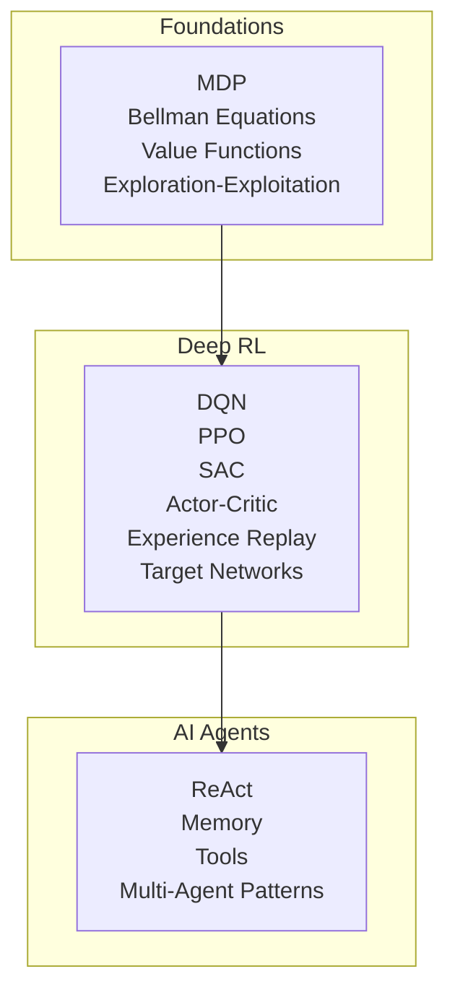

**Section sources**
- [README for RL:1-59](file://docs/06_Reinforcement_Learning/README_for_dummy.md#L1-L59)

## Core Components
- MDPs define the environment’s state transitions, actions, rewards, and goal. They provide the mathematical framework for RL.
- Value functions quantify how good it is to be in a state or to take an action in a given state.
- Bellman equations express recursive relationships among values, enabling iterative computation.
- Policy evaluation computes the value function for a fixed policy; policy improvement improves the policy using the computed value function.
- Exploration vs exploitation balances discovering new actions versus leveraging known good actions.
- Transition probabilities and discount factors govern how future rewards are aggregated and weighted.
- Return calculations combine immediate rewards with discounted future rewards.

These components form the backbone of both tabular and deep reinforcement learning approaches.

**Section sources**
- [RL Foundations for dummy:51-300](file://docs/06_Reinforcement_Learning/RL_Foundations/RL_Foundations_for_dummy.md#L51-L300)

## Architecture Overview
The RL loop connects an agent and an environment:
- The agent observes the current state, selects an action according to its policy, executes the action, receives a reward, and transitions to a new state.
- The agent updates its value function or policy based on the observed outcome.

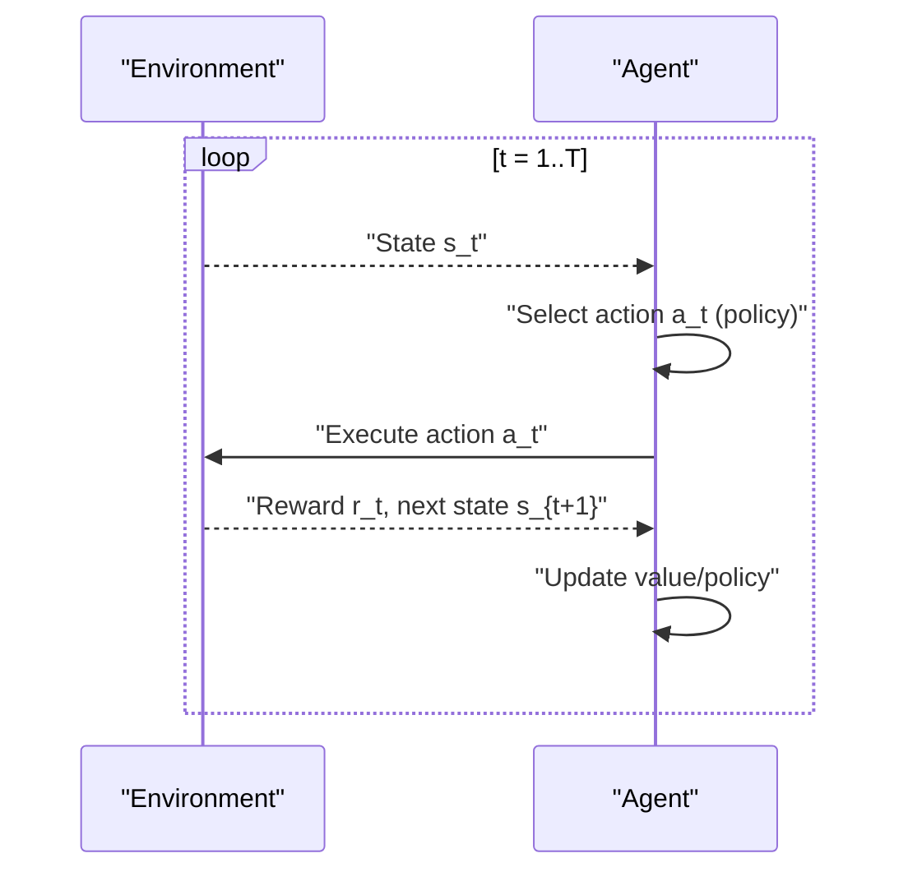

**Section sources**
- [RL Foundations for dummy:304-330](file://docs/06_Reinforcement_Learning/RL_Foundations/RL_Foundations_for_dummy.md#L304-L330)

## Detailed Component Analysis

### Markov Decision Processes (MDPs)
- States represent the situation the agent is in.
- Actions are the choices available to the agent.
- Transitions describe the probabilistic outcomes of actions.
- Rewards indicate the desirability of state/action transitions.
- Goal is to maximize cumulative reward.

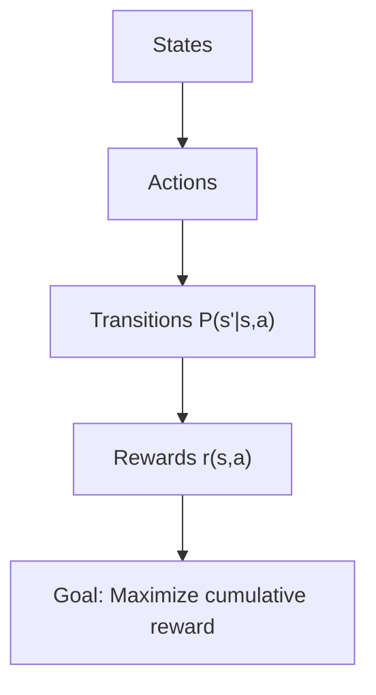

**Section sources**
- [RL Foundations for dummy:51-91](file://docs/06_Reinforcement_Learning/RL_Foundations/RL_Foundations_for_dummy.md#L51-L91)

### Value Functions and Bellman Equations
- State-value function V(s): expected return starting from s.
- Action-value function Q(s,a): expected return starting from s, taking a, then following policy.
- Bellman equations express V and Q recursively in terms of immediate rewards and discounted expectations of future values.

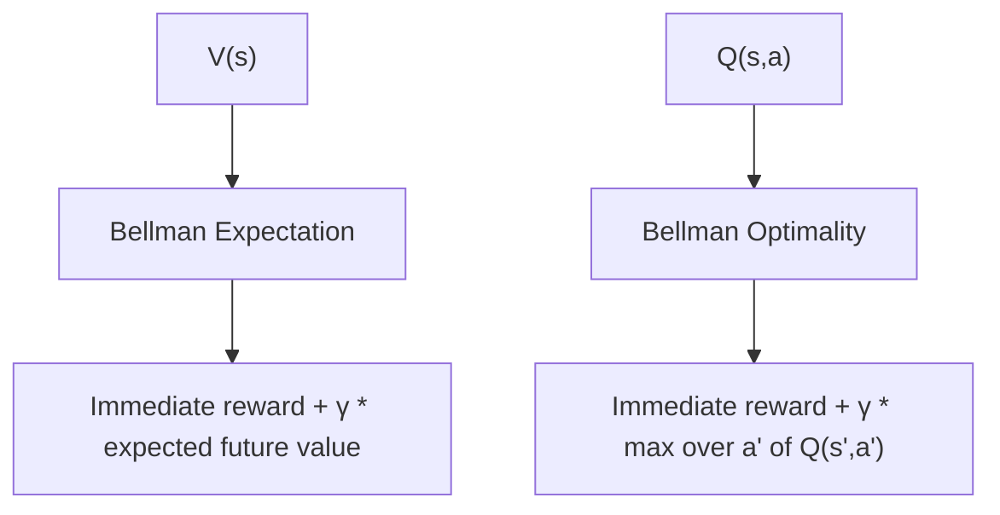

**Section sources**
- [RL Foundations for dummy:262-300](file://docs/06_Reinforcement_Learning/RL_Foundations/RL_Foundations_for_dummy.md#L262-L300)

### Policy Evaluation and Improvement
- Policy evaluation: compute V^π for a fixed π.
- Policy improvement: improve π by acting greedily w.r.t. V^π.
- Policy iteration alternates between evaluation and improvement until convergence.

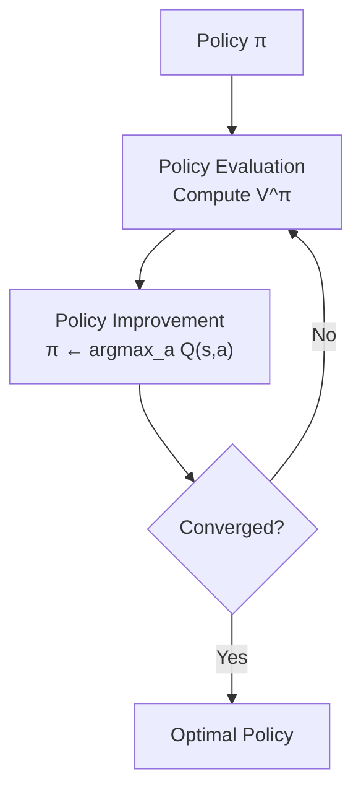

**Section sources**
- [RL Foundations for dummy:262-300](file://docs/06_Reinforcement_Learning/RL_Foundations/RL_Foundations_for_dummy.md#L262-L300)

### Exploration vs Exploitation
- Pure exploitation: always choose the best-known action.
- Pure exploration: randomly try actions to discover better ones.
- ε-greedy balances both: with probability 1-ε exploit; with probability ε explore randomly.
- ε decays over time to shift from exploration to exploitation.

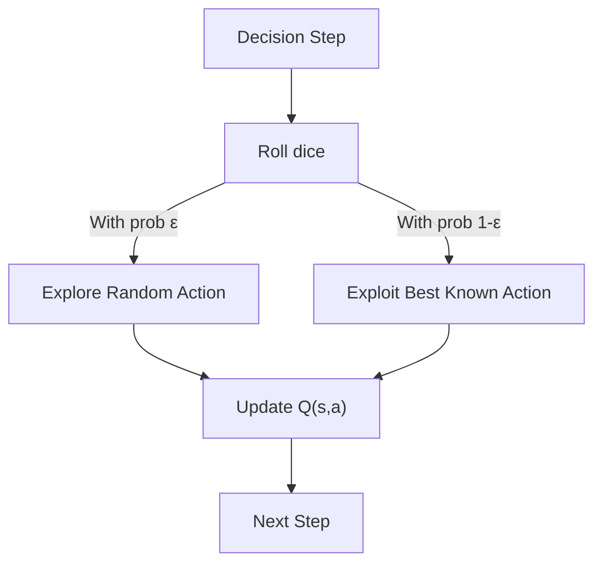

**Section sources**
- [RL Foundations for dummy:225-260](file://docs/06_Reinforcement_Learning/RL_Foundations/RL_Foundations_for_dummy.md#L225-L260)

### Dynamic Programming, Monte Carlo, and Temporal Difference
- Dynamic Programming: uses full model (transitions and rewards) to iteratively update value functions.
- Monte Carlo: estimates values by averaging returns from episodes; requires episodes to complete.
- Temporal Difference (TD): updates based on bootstrapped estimates using one-step transitions.

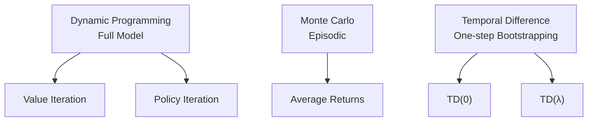

**Section sources**
- [RL Foundations for dummy:262-300](file://docs/06_Reinforcement_Learning/RL_Foundations/RL_Foundations_for_dummy.md#L262-L300)

### Practical Examples
- Grid World: navigate a grid to reach a goal while avoiding obstacles.
- Taxi Environment: pick up and drop off passengers efficiently.
- Classic Control Tasks: balance pole, lander, cart-pole, and others.

These examples illustrate state spaces, action spaces, reward shaping, and policy learning.

**Section sources**
- [RL Foundations for dummy:332-364](file://docs/06_Reinforcement_Learning/RL_Foundations/RL_Foundations_for_dummy.md#L332-L364)

### Policy Gradients and Actor-Critic
- Policy gradients optimize policy parameters directly to maximize expected return.
- Actor-Critic combines a policy network (actor) with a value network (critic) to reduce variance and improve sample efficiency.

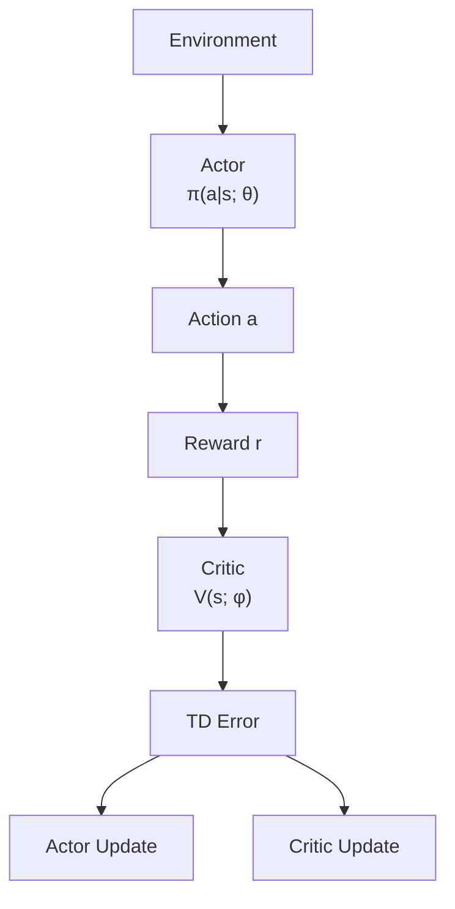

**Section sources**
- [Deep RL for dummy:303-354](file://docs/06_Reinforcement_Learning/Deep_RL/Deep_RL_for_dummy.md#L303-L354)

### Q-Learning and Tabular Methods
- Q-learning learns the optimal action-value function without requiring a model.
- It updates Q(s,a) based on the observed reward and the maximum Q value of the next state.

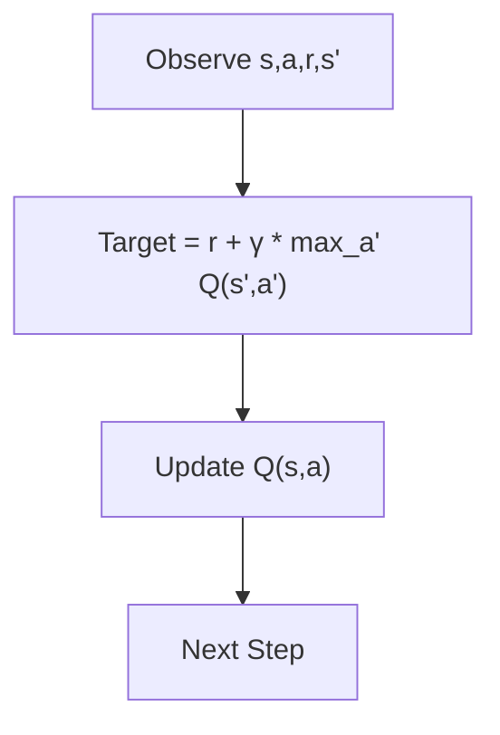

**Section sources**
- [RL Foundations for dummy:161-223](file://docs/06_Reinforcement_Learning/RL_Foundations/RL_Foundations_for_dummy.md#L161-L223)

### Discount Factors and Returns
- Discount factor γ ∈ [0,1] controls the importance of future rewards.
- Returns: episodic return G_t = Σ_{t'=t}^T γ^{t'-t} r_{t'}, and continuing return with V(s) and Q(s,a).

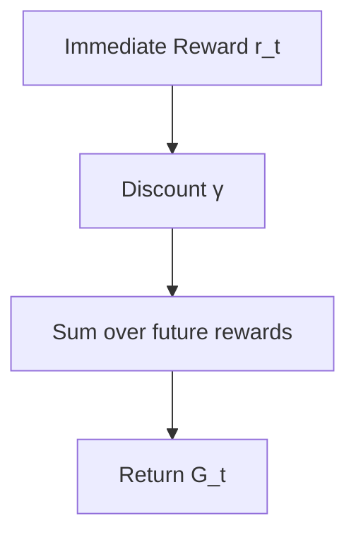

**Section sources**
- [RL Foundations for dummy:287-300](file://docs/06_Reinforcement_Learning/RL_Foundations/RL_Foundations_for_dummy.md#L287-L300)

## Dependency Analysis
- Foundations underpin Deep RL: value functions, Bellman equations, and policy gradients are central to DQN, PPO, SAC, and actor-critic.
- Deep RL builds upon probability/statistics: expectation, sampling, and distributions inform policy gradient and value approximation.
- AI Agents integrate RL concepts with planning, memory, and tool use.

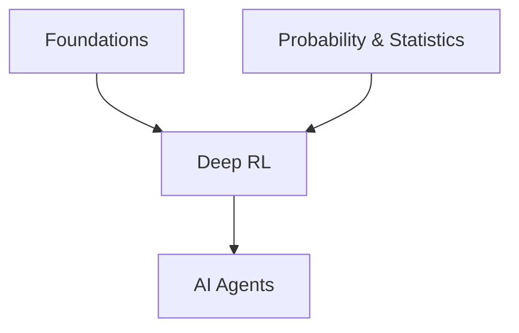

**Section sources**
- [README for RL:37-59](file://docs/06_Reinforcement_Learning/README_for_dummy.md#L37-L59)
- [Probability Statistics:1-622](file://docs/01_Fundamentals/Probability_Statistics/Probability_Statistics.md#L1-L622)

## Performance Considerations
- Sample efficiency: Monte Carlo methods require full episodes; TD methods can learn online with fewer samples.
- Stability: DQN uses experience replay and target networks; PPO uses clipping to stabilize policy updates.
- Exploration: ε-greedy decays over time; entropy regularization encourages exploration in policy gradients.
- Computational cost: Deep RL often requires GPUs and careful hyperparameter tuning.

[No sources needed since this section provides general guidance]

## Troubleshooting Guide
Common issues and remedies:
- Training instability: use target networks (DQN), experience replay, and gradient clipping (PPO).
- Slow convergence: increase exploration initially, decay ε, and use advantage estimation.
- Overfitting: regularize policies, use domain randomization, and monitor validation returns.
- Sparse rewards: introduce reward shaping or intrinsic motivation.

**Section sources**
- [Deep RL for dummy:303-354](file://docs/06_Reinforcement_Learning/Deep_RL/Deep_RL_for_dummy.md#L303-L354)

## Conclusion
Reinforcement learning foundations rest on MDPs, value functions, and Bellman equations. Policy evaluation and improvement, combined with exploration-exploitation trade-offs, enable learning from interaction. Dynamic programming, Monte Carlo, and temporal difference methods offer complementary approaches. Deep RL extends these ideas with neural networks, experience replay, and actor-critic architectures. AI agents integrate RL with planning, memory, and tool use to build autonomous systems.

[No sources needed since this section summarizes without analyzing specific files]

## Appendices

### A. Mathematical Framework Summary
- MDP: states, actions, transitions, rewards, discount.
- Value functions: V(s), Q(s,a).
- Bellman equations: recursive relationships for V and Q.
- Policy evaluation and improvement: iterative policy refinement.
- Exploration-exploitation: ε-greedy and entropy regularization.
- Returns: cumulative discounted rewards.

**Section sources**
- [RL Foundations for dummy:51-300](file://docs/06_Reinforcement_Learning/RL_Foundations/RL_Foundations_for_dummy.md#L51-L300)

### B. Practical RL Examples
- Grid world navigation, taxi routing, and classic control tasks demonstrate state/action spaces and reward design.

**Section sources**
- [RL Foundations for dummy:332-364](file://docs/06_Reinforcement_Learning/RL_Foundations/RL_Foundations_for_dummy.md#L332-L364)

### C. Deep RL Algorithms Overview
- DQN: value learning with experience replay and target networks.
- PPO: stable policy optimization via clipping.
- SAC: maximum entropy RL with actor-critic.
- Actor-critic: joint policy/value learning.

**Section sources**
- [Deep RL for dummy:89-354](file://docs/06_Reinforcement_Learning/Deep_RL/Deep_RL_for_dummy.md#L89-L354)

### D. AI Agents and RL Integration
- ReAct: interleaved reasoning and acting.
- Long-term memory and tool use enable autonomous planning.
- Multi-agent patterns support collaboration and coordination.

**Section sources**
- [AI Agents for dummy:121-134](file://docs/06_Reinforcement_Learning/AI_Agents/AI_Agents_for_dummy.md#L121-L134)