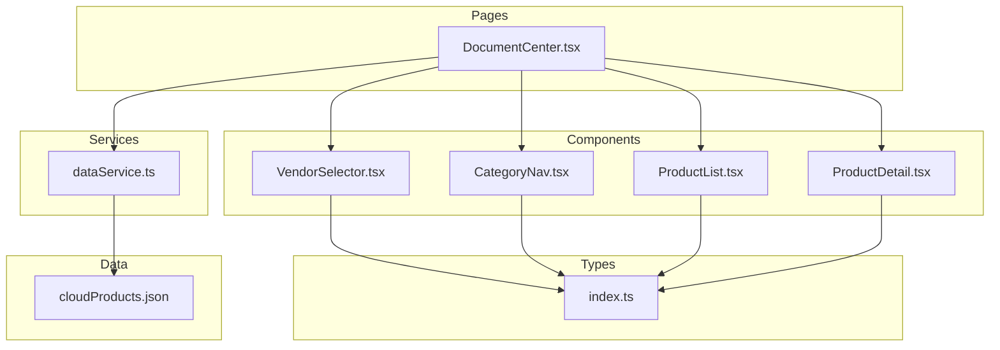
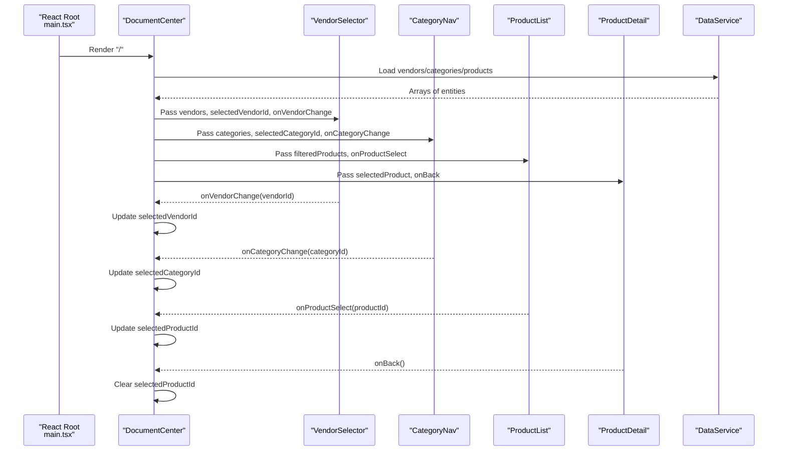
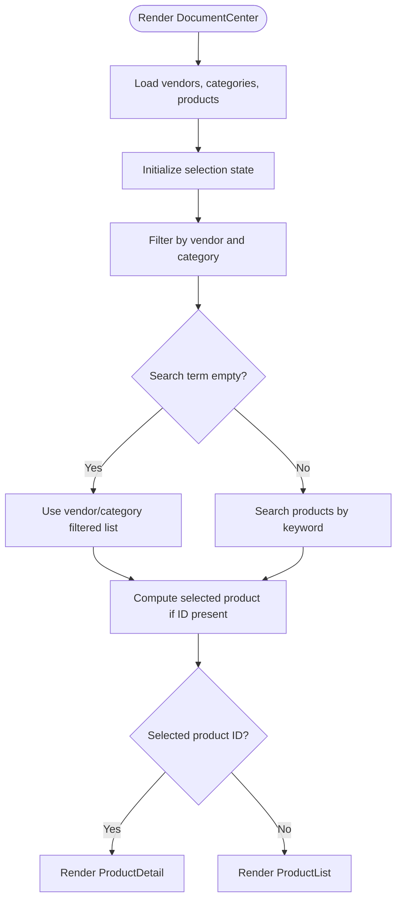
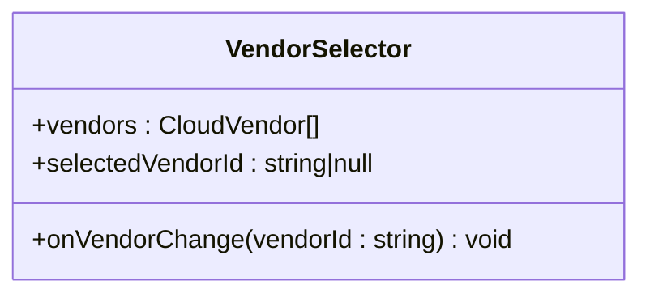
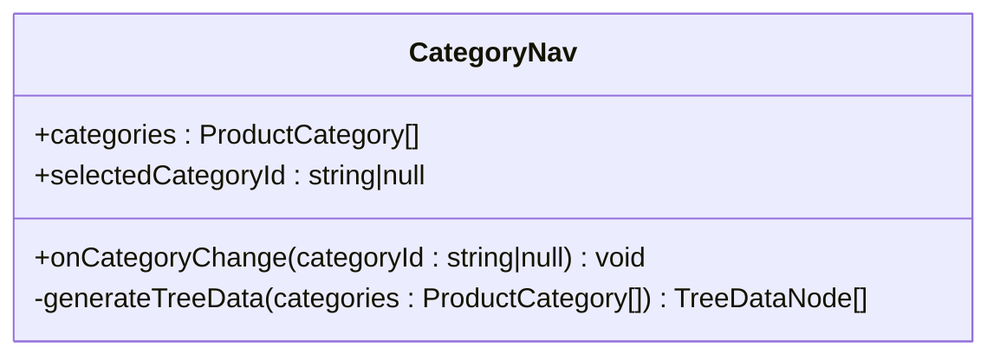
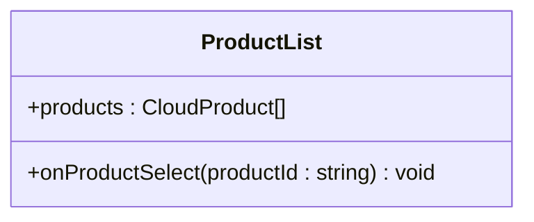
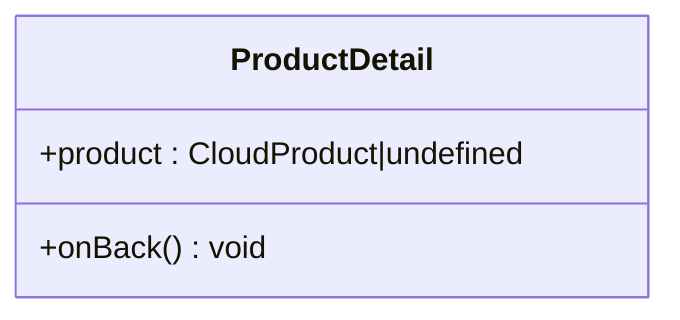
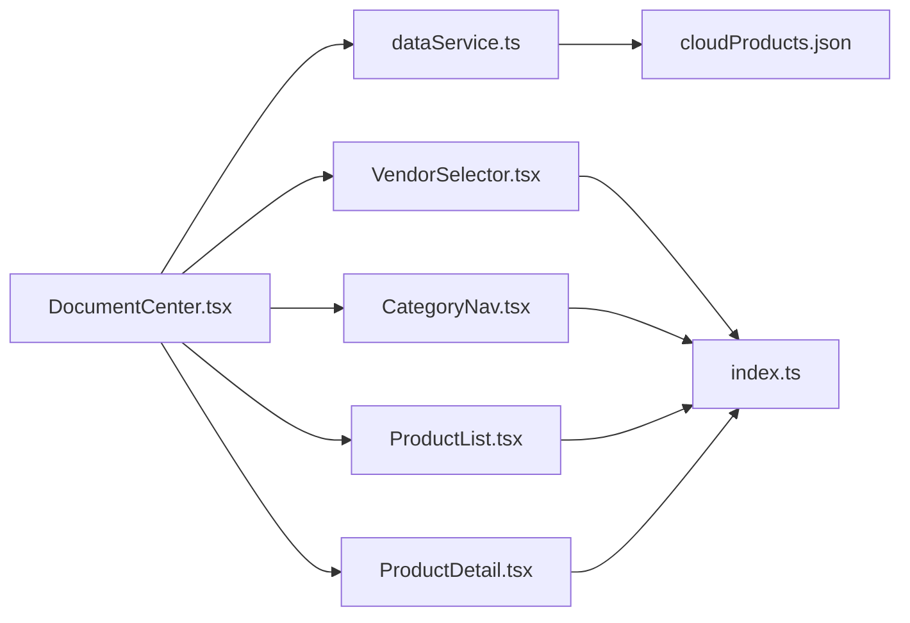

# Component Hierarchy and Relationships

<cite>
**Referenced Files in This Document**
- [DocumentCenter.tsx](file://web/src/pages/DocumentCenter.tsx)
- [CategoryNav.tsx](file://web/src/components/CategoryNav.tsx)
- [VendorSelector.tsx](file://web/src/components/VendorSelector.tsx)
- [ProductList.tsx](file://web/src/components/ProductList.tsx)
- [ProductDetail.tsx](file://web/src/components/ProductDetail.tsx)
- [dataService.ts](file://web/src/services/dataService.ts)
- [index.ts](file://web/src/types/index.ts)
- [main.tsx](file://web/src/main.tsx)
- [cloudProducts.json](file://web/src/data/cloudProducts.json)
</cite>

## Table of Contents
1. [Introduction](#introduction)
2. [Project Structure](#project-structure)
3. [Core Components](#core-components)
4. [Architecture Overview](#architecture-overview)
5. [Detailed Component Analysis](#detailed-component-analysis)
6. [Dependency Analysis](#dependency-analysis)
7. [Performance Considerations](#performance-considerations)
8. [Troubleshooting Guide](#troubleshooting-guide)
9. [Conclusion](#conclusion)

## Introduction
This document explains the component hierarchy and relationships in the React application centered around the DocumentCenter component. It details how state is managed at the top level, how data flows down to child components, and how events propagate upward to coordinate filtering, selection, and navigation. It also covers component composition patterns, prop drilling strategies, conditional rendering, dynamic component creation, reusability, and event handling across the component tree.

## Project Structure
The application follows a clear feature-based structure:
- Pages: Application entry points and top-level containers
- Components: Reusable UI building blocks
- Services: Data access and transformation logic
- Types: Shared TypeScript interfaces
- Data: Static JSON datasets

**Diagram sources**
- [DocumentCenter.tsx:15-145](file://web/src/pages/DocumentCenter.tsx#L15-L145)
- [VendorSelector.tsx:1-40](file://web/src/components/VendorSelector.tsx#L1-L40)
- [CategoryNav.tsx:1-57](file://web/src/components/CategoryNav.tsx#L1-L57)
- [ProductList.tsx:1-99](file://web/src/components/ProductList.tsx#L1-L99)
- [ProductDetail.tsx:1-124](file://web/src/components/ProductDetail.tsx#L1-L124)
- [dataService.ts:1-156](file://web/src/services/dataService.ts#L1-L156)
- [index.ts:1-69](file://web/src/types/index.ts#L1-L69)
- [cloudProducts.json:1-200](file://web/src/data/cloudProducts.json#L1-L200)

**Section sources**
- [main.tsx:1-20](file://web/src/main.tsx#L1-L20)
- [DocumentCenter.tsx:15-145](file://web/src/pages/DocumentCenter.tsx#L15-L145)

## Core Components
- DocumentCenter: Central container managing state and coordinating data flow. It loads vendors, categories, and products, maintains selection state, computes filtered lists, and renders either ProductList or ProductDetail based on selection.
- VendorSelector: Renders a vertical radio group of vendors and notifies the parent of selection changes.
- CategoryNav: Renders a hierarchical tree of categories and notifies the parent of selection changes.
- ProductList: Displays a grid of products with metadata and document entries, emitting selection events.
- ProductDetail: Displays detailed product information and document entries, with a back-to-list action.

Key responsibilities:
- State management: Selection of vendor, category, product, and search term.
- Data coordination: Filtering and memoization to optimize recomputation.
- Conditional rendering: Switching between list and detail views.
- Event handling: Propagating user actions up to the parent for state updates.

**Section sources**
- [DocumentCenter.tsx:15-145](file://web/src/pages/DocumentCenter.tsx#L15-L145)
- [VendorSelector.tsx:7-40](file://web/src/components/VendorSelector.tsx#L7-L40)
- [CategoryNav.tsx:7-57](file://web/src/components/CategoryNav.tsx#L7-L57)
- [ProductList.tsx:9-99](file://web/src/components/ProductList.tsx#L9-L99)
- [ProductDetail.tsx:8-124](file://web/src/components/ProductDetail.tsx#L8-L124)

## Architecture Overview
The DocumentCenter acts as a stateful container that:
- Loads data via dataService
- Maintains selection state for vendor, category, product, and search term
- Computes derived data using useMemo
- Passes props down to child components
- Receives callbacks from children to update state

**Diagram sources**
- [main.tsx:9-19](file://web/src/main.tsx#L9-L19)
- [DocumentCenter.tsx:15-145](file://web/src/pages/DocumentCenter.tsx#L15-L145)
- [VendorSelector.tsx:13-37](file://web/src/components/VendorSelector.tsx#L13-L37)
- [CategoryNav.tsx:13-53](file://web/src/components/CategoryNav.tsx#L13-L53)
- [ProductList.tsx:14-95](file://web/src/components/ProductList.tsx#L14-L95)
- [ProductDetail.tsx:13-120](file://web/src/components/ProductDetail.tsx#L13-L120)
- [dataService.ts:4-156](file://web/src/services/dataService.ts#L4-L156)

## Detailed Component Analysis

### DocumentCenter: Central Container and State Coordinator
- Responsibilities:
  - Load data from dataService
  - Manage selection state: vendorId, categoryId, productId, searchTerm
  - Compute filtered product lists using useMemo
  - Provide handlers for vendor change, category change, product select, back to list, and search
  - Conditionally render ProductList or ProductDetail based on selection
- Data flow:
  - Initial load: vendors, categories, products
  - Derived state: filteredByVendorAndCategory, filteredProducts, selectedProduct
  - Handlers: update selection state and trigger re-computation
- Rendering:
  - Fixed header with search input bound to searchTerm
  - Two sidebars for vendor and category filters
  - Main content area conditionally switches between list and detail

**Diagram sources**
- [DocumentCenter.tsx:15-145](file://web/src/pages/DocumentCenter.tsx#L15-L145)
- [dataService.ts:68-151](file://web/src/services/dataService.ts#L68-L151)

**Section sources**
- [DocumentCenter.tsx:15-145](file://web/src/pages/DocumentCenter.tsx#L15-L145)

### VendorSelector: Vendor Selection Component
- Props:
  - vendors: Array of CloudVendor
  - selectedVendorId: string | null
  - onVendorChange: (vendorId: string) => void
- Behavior:
  - Renders a vertical Radio.Group with vendor buttons
  - Updates parent via onVendorChange when selection changes
- Reusability:
  - Stateless functional component with clear prop contract
  - Can be reused with any vendor list and handler

**Diagram sources**
- [VendorSelector.tsx:7-40](file://web/src/components/VendorSelector.tsx#L7-L40)
- [index.ts:1-7](file://web/src/types/index.ts#L1-L7)

**Section sources**
- [VendorSelector.tsx:7-40](file://web/src/components/VendorSelector.tsx#L7-L40)
- [index.ts:1-7](file://web/src/types/index.ts#L1-L7)

### CategoryNav: Hierarchical Category Navigation
- Props:
  - categories: ProductCategory[]
  - selectedCategoryId: string | null
  - onCategoryChange: (categoryId: string | null) => void
- Behavior:
  - Converts flat categories to Ant Design Tree-compatible nodes
  - Uses defaultExpandAll and selectedKeys to reflect selection
  - Emits onCategoryChange with the selected node key
- Reusability:
  - Self-contained with internal tree generation
  - Accepts any category tree structure

**Diagram sources**
- [CategoryNav.tsx:7-57](file://web/src/components/CategoryNav.tsx#L7-L57)
- [index.ts:9-15](file://web/src/types/index.ts#L9-L15)

**Section sources**
- [CategoryNav.tsx:7-57](file://web/src/components/CategoryNav.tsx#L7-L57)
- [index.ts:9-15](file://web/src/types/index.ts#L9-L15)

### ProductList: Product Grid and Selection
- Props:
  - products: CloudProduct[]
  - onProductSelect: (productId: string) => void
- Behavior:
  - Renders a responsive grid of cards
  - Displays product name, description, features, and document entries
  - Emits onProductSelect when the "文档" button is clicked
- Reusability:
  - Accepts any product array and selection handler
  - Uses Ant Design components for consistent UI

**Diagram sources**
- [ProductList.tsx:9-99](file://web/src/components/ProductList.tsx#L9-L99)
- [index.ts:45-54](file://web/src/types/index.ts#L45-L54)

**Section sources**
- [ProductList.tsx:9-99](file://web/src/components/ProductList.tsx#L9-L99)
- [index.ts:45-54](file://web/src/types/index.ts#L45-L54)

### ProductDetail: Detailed Product View
- Props:
  - product: CloudProduct | undefined
  - onBack: () => void
- Behavior:
  - Renders product details and document entries
  - Displays "产品不存在" when product is undefined
  - Emits onBack when the back button is clicked
- Reusability:
  - Handles missing data gracefully
  - Exposes a simple callback for navigation

**Diagram sources**
- [ProductDetail.tsx:8-124](file://web/src/components/ProductDetail.tsx#L8-L124)
- [index.ts:45-54](file://web/src/types/index.ts#L45-L54)

**Section sources**
- [ProductDetail.tsx:8-124](file://web/src/components/ProductDetail.tsx#L8-L124)
- [index.ts:45-54](file://web/src/types/index.ts#L45-L54)

## Dependency Analysis
- DocumentCenter depends on:
  - dataService for loading and filtering data
  - Ant Design components for layout and UI
  - Child components for rendering and user interaction
- dataService depends on:
  - cloudProducts.json for raw data
  - Types for shape validation and conversion
- Types define shared interfaces used across components and services.

**Diagram sources**
- [DocumentCenter.tsx:15-145](file://web/src/pages/DocumentCenter.tsx#L15-L145)
- [dataService.ts:1-156](file://web/src/services/dataService.ts#L1-L156)
- [index.ts:1-69](file://web/src/types/index.ts#L1-L69)
- [cloudProducts.json:1-200](file://web/src/data/cloudProducts.json#L1-L200)

**Section sources**
- [DocumentCenter.tsx:15-145](file://web/src/pages/DocumentCenter.tsx#L15-L145)
- [dataService.ts:1-156](file://web/src/services/dataService.ts#L1-L156)
- [index.ts:1-69](file://web/src/types/index.ts#L1-L69)

## Performance Considerations
- Memoized computations:
  - Vendor and category filtered list computed with useMemo
  - Final filtered list computed with useMemo
  - Selected product computed with useMemo
- Benefits:
  - Prevents unnecessary re-renders of child components
  - Reduces expensive filtering operations during state changes
- Recommendations:
  - Keep derived data computation inside DocumentCenter
  - Avoid passing large objects as props; pass only necessary fields
  - Consider virtualizing long lists if performance becomes an issue

**Section sources**
- [DocumentCenter.tsx:33-53](file://web/src/pages/DocumentCenter.tsx#L33-L53)

## Troubleshooting Guide
Common issues and resolutions:
- No products displayed:
  - Verify that vendors and categories are loaded and selectedVendorId is set
  - Ensure filteredProducts is not empty after filtering
- Product detail shows "产品不存在":
  - Confirm selectedProductId corresponds to an existing product
  - Check dataService.getProductById for correctness
- Search not working:
  - Ensure searchTerm is updated and passed to dataService.searchProducts
  - Verify searchProducts implementation handles case-insensitive matching
- Category tree not expanding:
  - Confirm generateTreeData recursively builds children
  - Ensure selectedCategoryId is correctly passed to Tree.selectedKeys

**Section sources**
- [DocumentCenter.tsx:42-53](file://web/src/pages/DocumentCenter.tsx#L42-L53)
- [dataService.ts:145-151](file://web/src/services/dataService.ts#L145-L151)
- [CategoryNav.tsx:24-37](file://web/src/components/CategoryNav.tsx#L24-L37)

## Conclusion
The DocumentCenter component orchestrates state and data flow across the application. Through clear prop contracts and event callbacks, VendorSelector, CategoryNav, ProductList, and ProductDetail remain reusable and focused on presentation. Memoized computations ensure efficient updates, while conditional rendering provides a seamless switch between list and detail views. This architecture balances simplicity, scalability, and maintainability.