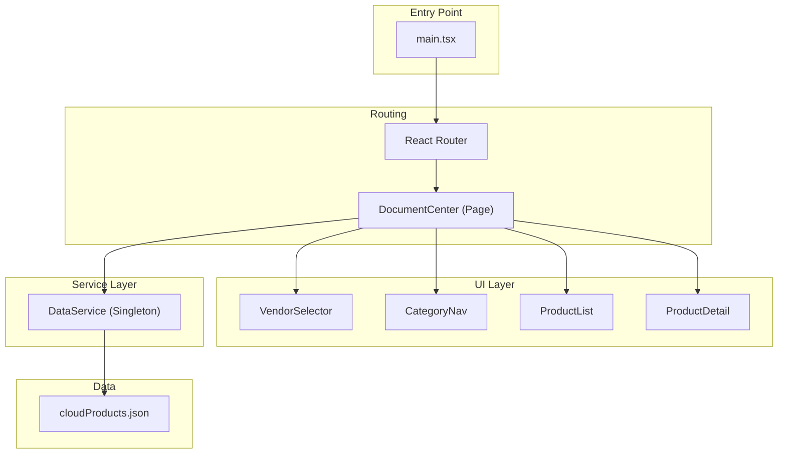
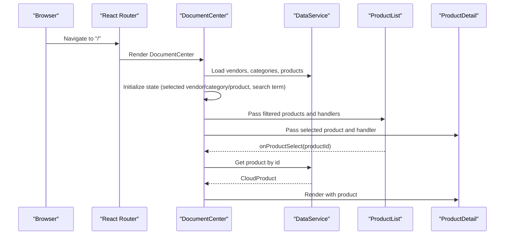
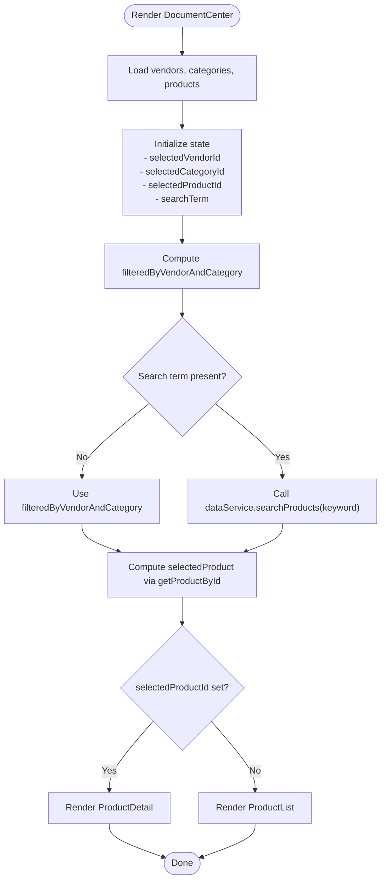
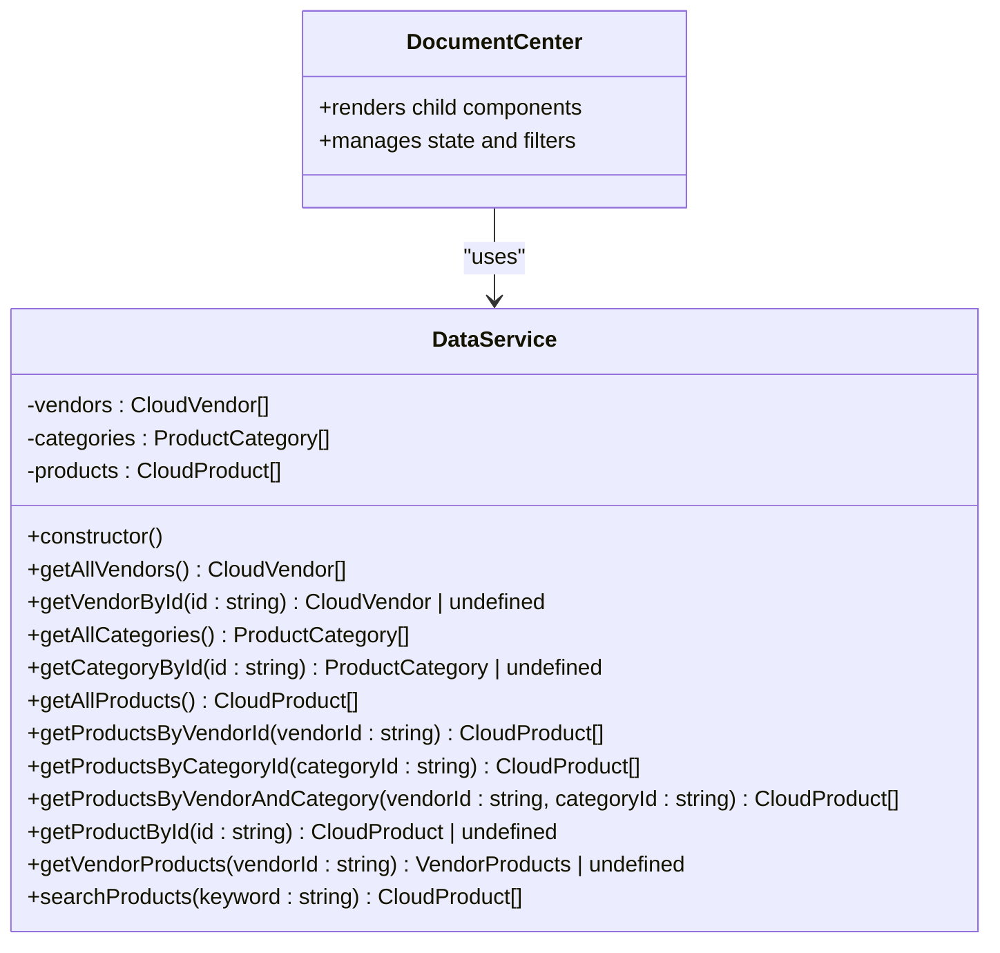
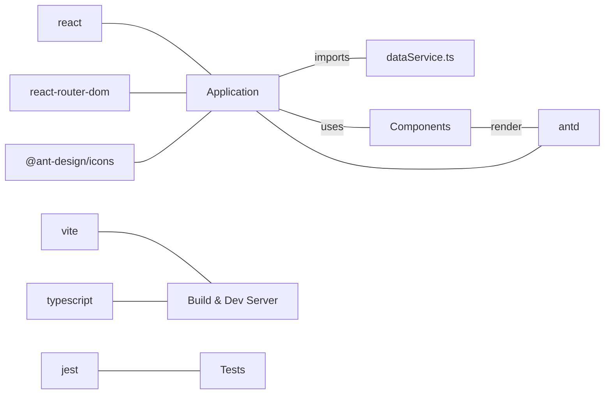

# Frontend Architecture

<cite>
**Referenced Files in This Document**
- [main.tsx](file://web/src/main.tsx)
- [DocumentCenter.tsx](file://web/src/pages/DocumentCenter.tsx)
- [dataService.ts](file://web/src/services/dataService.ts)
- [index.ts](file://web/src/types/index.ts)
- [VendorSelector.tsx](file://web/src/components/VendorSelector.tsx)
- [CategoryNav.tsx](file://web/src/components/CategoryNav.tsx)
- [ProductList.tsx](file://web/src/components/ProductList.tsx)
- [ProductDetail.tsx](file://web/src/components/ProductDetail.tsx)
- [cloudProducts.json](file://web/src/data/cloudProducts.json)
- [package.json](file://web/package.json)
- [dataService.test.ts](file://web/src/services/dataService.test.ts)
- [CategoryNav.test.tsx](file://web/src/components/CategoryNav.test.tsx)
- [ProductDetail.test.tsx](file://web/src/components/ProductDetail.test.tsx)
</cite>

## Table of Contents
1. [Introduction](#introduction)
2. [Project Structure](#project-structure)
3. [Core Components](#core-components)
4. [Architecture Overview](#architecture-overview)
5. [Detailed Component Analysis](#detailed-component-analysis)
6. [Dependency Analysis](#dependency-analysis)
7. [Performance Considerations](#performance-considerations)
8. [Troubleshooting Guide](#troubleshooting-guide)
9. [Conclusion](#conclusion)

## Introduction
This document describes the frontend architecture of a React-based application built with TypeScript and Ant Design. The system follows a component-based architecture with a service layer pattern centered around a singleton data service. The main container component orchestrates state and data flow, while reusable UI components encapsulate presentation logic. The application is configured with Vite for fast development and optimized builds.

## Project Structure
The frontend is organized into feature-focused folders with clear separation of concerns:
- Pages: Top-level route components (e.g., DocumentCenter)
- Components: Reusable UI components (e.g., VendorSelector, CategoryNav, ProductList, ProductDetail)
- Services: Business logic and data access (dataService)
- Types: Shared TypeScript interfaces and type definitions
- Data: Static JSON datasets consumed by the data service
- Root entry: Application bootstrap and routing configuration

**Diagram sources**
- [main.tsx:1-20](file://web/src/main.tsx#L1-L20)
- [DocumentCenter.tsx:1-145](file://web/src/pages/DocumentCenter.tsx#L1-L145)
- [dataService.ts:1-156](file://web/src/services/dataService.ts#L1-L156)
- [cloudProducts.json:1-800](file://web/src/data/cloudProducts.json#L1-L800)

**Section sources**
- [main.tsx:1-20](file://web/src/main.tsx#L1-L20)
- [package.json:1-50](file://web/package.json#L1-L50)

## Core Components
- DocumentCenter: The main container page that manages state, applies filters, and renders child components. It integrates with the data service for loading and filtering data.
- VendorSelector: Renders a radio group of vendors and notifies parent of selection changes.
- CategoryNav: Displays a hierarchical category tree and handles selection via Ant Design Tree.
- ProductList: Presents products in a responsive grid with cards, tags, and links to external resources.
- ProductDetail: Shows detailed information for a selected product, including features and related documents.
- DataService: Singleton service providing CRUD-like operations over static cloud product data.

Key patterns:
- Props-driven composition: Child components receive data and callbacks via props.
- Local state with React hooks: useState and useMemo manage UI state and derived computations.
- Ant Design integration: Consistent UI components and layout primitives.

**Section sources**
- [DocumentCenter.tsx:15-145](file://web/src/pages/DocumentCenter.tsx#L15-L145)
- [VendorSelector.tsx:1-40](file://web/src/components/VendorSelector.tsx#L1-L40)
- [CategoryNav.tsx:1-57](file://web/src/components/CategoryNav.tsx#L1-L57)
- [ProductList.tsx:1-99](file://web/src/components/ProductList.tsx#L1-L99)
- [ProductDetail.tsx:1-124](file://web/src/components/ProductDetail.tsx#L1-L124)
- [dataService.ts:4-156](file://web/src/services/dataService.ts#L4-L156)

## Architecture Overview
The application follows a unidirectional data flow:
- Routing initializes the application and mounts DocumentCenter.
- DocumentCenter loads base data from DataService and maintains local state.
- Child components update state via callback handlers.
- Derived computations are memoized to optimize rendering.

**Diagram sources**
- [main.tsx:9-19](file://web/src/main.tsx#L9-L19)
- [DocumentCenter.tsx:17-53](file://web/src/pages/DocumentCenter.tsx#L17-L53)
- [dataService.ts:25-100](file://web/src/services/dataService.ts#L25-L100)
- [ProductList.tsx:14-40](file://web/src/components/ProductList.tsx#L14-L40)

## Detailed Component Analysis

### DocumentCenter: Main Container and State Orchestrator
Responsibilities:
- Loads base data from the data service.
- Manages local state for selected vendor, category, product, and search term.
- Computes filtered product lists using memoization.
- Handles navigation between list and detail views.

Data flow:
- Initial load: Fetches vendors, categories, and products.
- Filtering: Applies vendor/category filters and optional search term.
- Selection: Updates selected product and toggles detail view.

Performance considerations:
- Uses useMemo to avoid recomputation when dependencies are unchanged.
- Delegates heavy filtering to the data service for consistency and testability.

**Diagram sources**
- [DocumentCenter.tsx:17-53](file://web/src/pages/DocumentCenter.tsx#L17-L53)
- [dataService.ts:68-151](file://web/src/services/dataService.ts#L68-L151)

**Section sources**
- [DocumentCenter.tsx:15-145](file://web/src/pages/DocumentCenter.tsx#L15-L145)

### VendorSelector: Vendor Selection Component
Responsibilities:
- Renders a vertical radio button group of vendors.
- Notifies parent of vendor changes via a callback prop.

Integration:
- Receives vendors array and selected vendor ID from DocumentCenter.
- Emits vendor change events to update the parent’s state.

**Section sources**
- [VendorSelector.tsx:7-37](file://web/src/components/VendorSelector.tsx#L7-L37)
- [DocumentCenter.tsx:113-117](file://web/src/pages/DocumentCenter.tsx#L113-L117)

### CategoryNav: Hierarchical Category Navigation
Responsibilities:
- Converts flat category definitions into a tree structure for Ant Design Tree.
- Handles selection and communicates the chosen category ID to the parent.

Integration:
- Receives categories and selected category ID from DocumentCenter.
- Emits category change events to update the parent’s state.

**Section sources**
- [CategoryNav.tsx:18-53](file://web/src/components/CategoryNav.tsx#L18-L53)
- [DocumentCenter.tsx:120-124](file://web/src/pages/DocumentCenter.tsx#L120-L124)

### ProductList: Product Grid and Interaction
Responsibilities:
- Displays products in a responsive grid with cards.
- Provides quick actions to view documentation and navigate to vendor websites.
- Renders product features as tags and lists related documents.

Integration:
- Receives filtered products and a selection handler from DocumentCenter.
- Triggers navigation to the detail view when a product is selected.

**Section sources**
- [ProductList.tsx:9-99](file://web/src/components/ProductList.tsx#L9-L99)
- [DocumentCenter.tsx:133-137](file://web/src/pages/DocumentCenter.tsx#L133-L137)

### ProductDetail: Detailed Product View
Responsibilities:
- Shows product metadata, features, and related documents.
- Provides navigation back to the product list.
- Handles missing product scenarios gracefully.

Integration:
- Receives a selected product and a back handler from DocumentCenter.

**Section sources**
- [ProductDetail.tsx:8-124](file://web/src/components/ProductDetail.tsx#L8-L124)
- [DocumentCenter.tsx:127-131](file://web/src/pages/DocumentCenter.tsx#L127-L131)

### DataService: Singleton Service Layer
Responsibilities:
- Loads and normalizes static data from cloudProducts.json.
- Exposes methods to query vendors, categories, and products.
- Implements search and hierarchical category lookup.

Singleton pattern:
- Exports a single instance of the DataService class, ensuring centralized data access across the app.

**Diagram sources**
- [dataService.ts:4-156](file://web/src/services/dataService.ts#L4-L156)
- [DocumentCenter.tsx:17-53](file://web/src/pages/DocumentCenter.tsx#L17-L53)

**Section sources**
- [dataService.ts:4-156](file://web/src/services/dataService.ts#L4-L156)
- [cloudProducts.json:1-800](file://web/src/data/cloudProducts.json#L1-L800)

### TypeScript Interfaces and Type System
The application defines a strict type system for data contracts:
- CloudVendor, ProductCategory, CloudProduct, VendorProducts, and related JSON interfaces.
- AppState mirrors the state managed by DocumentCenter.

Benefits:
- Compile-time safety for props and state.
- Clear contracts between components and the service layer.

**Section sources**
- [index.ts:1-69](file://web/src/types/index.ts#L1-L69)
- [DocumentCenter.tsx:62-68](file://web/src/pages/DocumentCenter.tsx#L62-L68)

## Dependency Analysis
External dependencies and their roles:
- React and React DOM: Core UI library and renderer.
- React Router: Client-side routing for single-page navigation.
- Ant Design: UI components and design system.
- Vite: Build tool and dev server.
- TypeScript: Type checking and compilation.
- Jest and Testing Library: Unit and component tests.

**Diagram sources**
- [package.json:15-47](file://web/package.json#L15-L47)
- [main.tsx:3-6](file://web/src/main.tsx#L3-L6)

**Section sources**
- [package.json:15-47](file://web/package.json#L15-L47)

## Performance Considerations
- Memoization: DocumentCenter uses useMemo to compute filtered lists and selected product, preventing unnecessary re-renders.
- Single source of truth: The singleton data service centralizes data access and ensures consistent filtering behavior.
- Lightweight components: Child components are pure presentational components that rely on props, keeping render costs low.
- Ant Design components: Optimized UI primitives with built-in performance characteristics.

Recommendations:
- Consider debouncing search input to reduce frequent filtering calls.
- For very large datasets, consider pagination or virtualized lists.
- Keep the JSON dataset normalized and avoid deep cloning in hot paths.

**Section sources**
- [DocumentCenter.tsx:33-53](file://web/src/pages/DocumentCenter.tsx#L33-L53)
- [dataService.ts:145-151](file://web/src/services/dataService.ts#L145-L151)

## Troubleshooting Guide
Common issues and resolutions:
- No products displayed:
  - Verify that the data service loaded vendors, categories, and products correctly.
  - Confirm that the JSON dataset is valid and accessible.
- Filters not working:
  - Ensure selected vendor/category IDs match the dataset IDs.
  - Check that memoized computations are receiving the correct dependencies.
- Search yields unexpected results:
  - Validate the search keyword normalization and matching logic.
- Tests failing:
  - Review unit tests for the data service and component behavior.

Testing coverage highlights:
- DataService tests validate CRUD-like operations and search.
- Component tests assert rendering, selection, and event handling.

**Section sources**
- [dataService.test.ts:1-170](file://web/src/services/dataService.test.ts#L1-L170)
- [CategoryNav.test.tsx:1-112](file://web/src/components/CategoryNav.test.tsx#L1-L112)
- [ProductDetail.test.tsx:1-115](file://web/src/components/ProductDetail.test.tsx#L1-L115)

## Conclusion
The frontend employs a clean, component-based architecture with a centralized service layer. DocumentCenter acts as the orchestrator, managing state and data flow while delegating UI concerns to focused components. The singleton data service provides a consistent API over static data, and TypeScript enforces strong contracts across the system. With Ant Design, the application achieves a cohesive and responsive user experience. The Vite configuration supports efficient development and production builds.