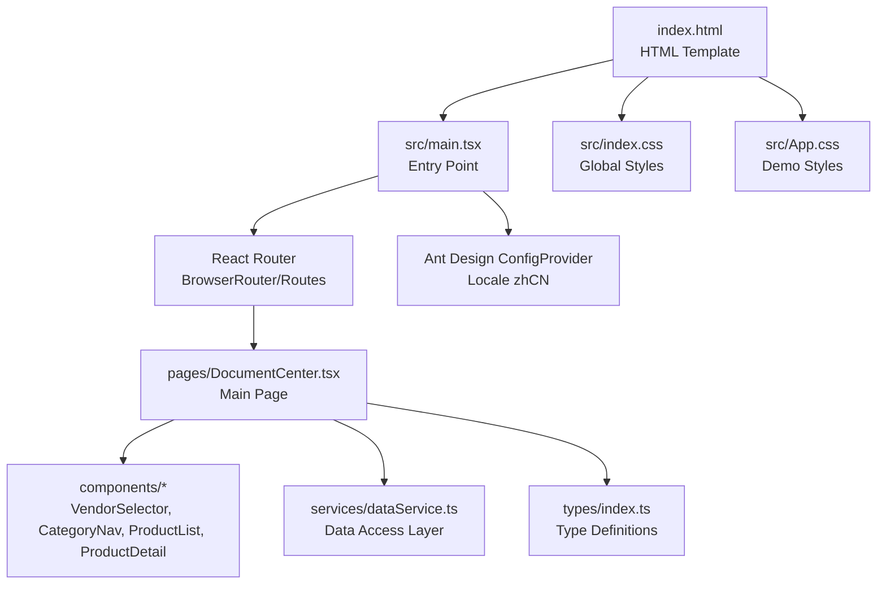
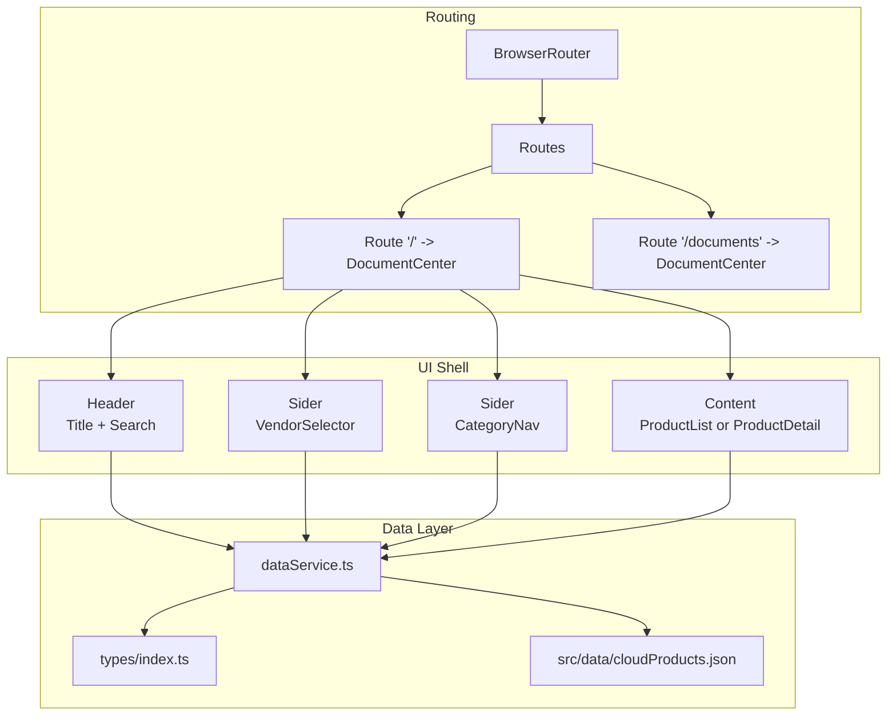
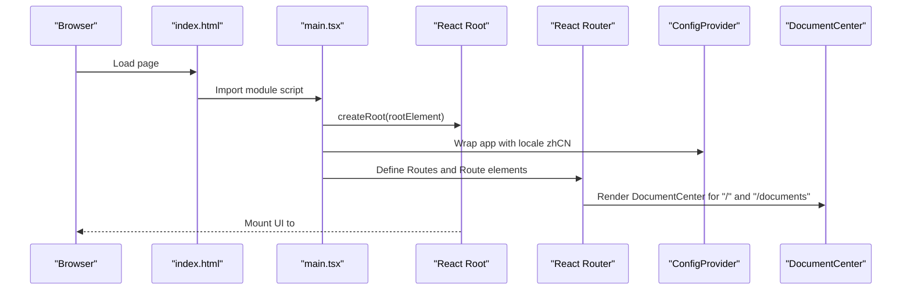
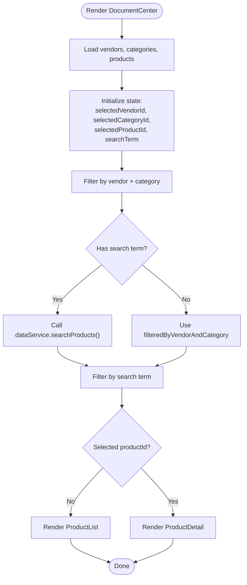
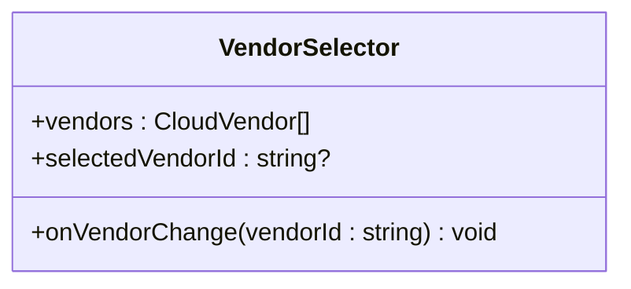
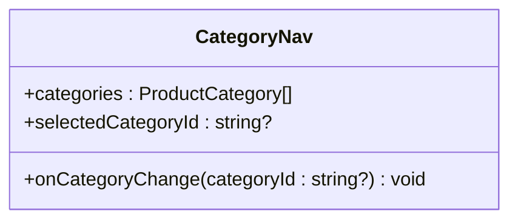
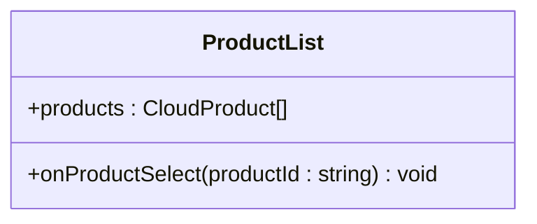
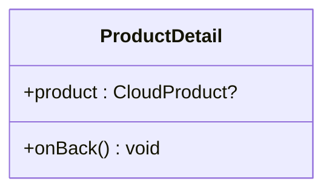
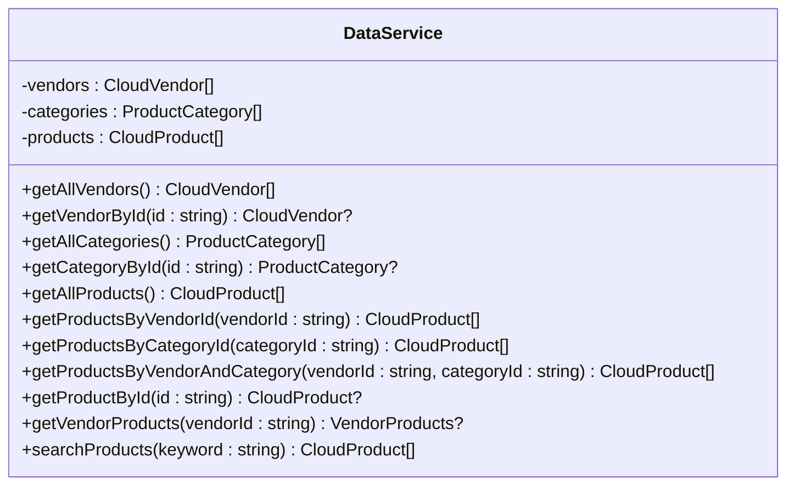
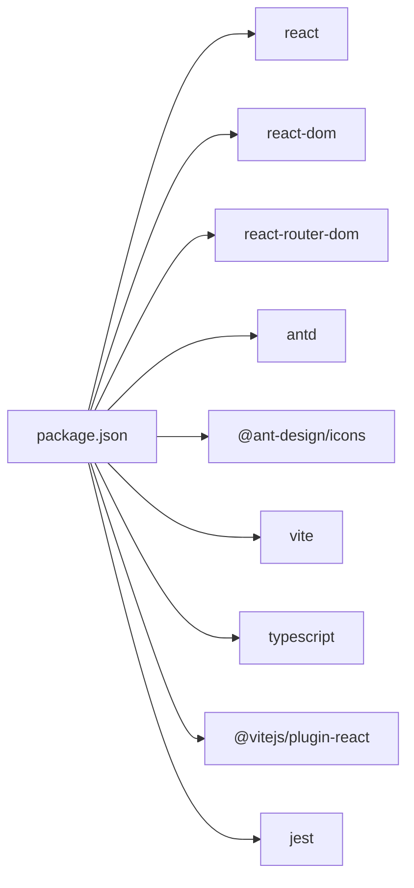

# React Application Structure

<cite>
**Referenced Files in This Document**
- [main.tsx](file://web/src/main.tsx)
- [index.html](file://web/index.html)
- [package.json](file://web/package.json)
- [tsconfig.json](file://web/tsconfig.json)
- [tsconfig.app.json](file://web/tsconfig.app.json)
- [App.css](file://web/src/App.css)
- [index.css](file://web/src/index.css)
- [DocumentCenter.tsx](file://web/src/pages/DocumentCenter.tsx)
- [CategoryNav.tsx](file://web/src/components/CategoryNav.tsx)
- [VendorSelector.tsx](file://web/src/components/VendorSelector.tsx)
- [ProductList.tsx](file://web/src/components/ProductList.tsx)
- [ProductDetail.tsx](file://web/src/components/ProductDetail.tsx)
- [dataService.ts](file://web/src/services/dataService.ts)
- [index.ts](file://web/src/types/index.ts)
</cite>

## Table of Contents
1. [Introduction](#introduction)
2. [Project Structure](#project-structure)
3. [Core Components](#core-components)
4. [Architecture Overview](#architecture-overview)
5. [Detailed Component Analysis](#detailed-component-analysis)
6. [Dependency Analysis](#dependency-analysis)
7. [Performance Considerations](#performance-considerations)
8. [Troubleshooting Guide](#troubleshooting-guide)
9. [Conclusion](#conclusion)
10. [Appendices](#appendices)

## Introduction
This document explains the React application structure and initialization for the CloudMaster web frontend. It covers the entry point, component mounting, routing, global styling, Vite build configuration, development server setup, HTML template, Ant Design integration, TypeScript configuration, component composition patterns, and development workflow. It also outlines hot module replacement behavior, asset handling, production build optimization, and examples of component initialization and state management.

## Project Structure
The web application follows a conventional React + TypeScript + Vite setup with modular components and a single-page application architecture. The entry point initializes the React root, wraps the app with routing and Ant Design providers, and mounts the UI under the DOM root element. Global styles are applied via dedicated CSS files, while Ant Design’s CSS-in-JS provider configures locale and theme globally.

**Diagram sources**
- [index.html](file://web/index.html)
- [main.tsx](file://web/src/main.tsx)
- [DocumentCenter.tsx](file://web/src/pages/DocumentCenter.tsx)
- [VendorSelector.tsx](file://web/src/components/VendorSelector.tsx)
- [CategoryNav.tsx](file://web/src/components/CategoryNav.tsx)
- [ProductList.tsx](file://web/src/components/ProductList.tsx)
- [ProductDetail.tsx](file://web/src/components/ProductDetail.tsx)
- [dataService.ts](file://web/src/services/dataService.ts)
- [index.ts](file://web/src/types/index.ts)
- [index.css](file://web/src/index.css)
- [App.css](file://web/src/App.css)

**Section sources**
- [index.html](file://web/index.html)
- [main.tsx](file://web/src/main.tsx)
- [index.css](file://web/src/index.css)
- [App.css](file://web/src/App.css)

## Core Components
- Entry point and mounting: The application bootstraps by creating a React root on the DOM element with id root and rendering the configured provider stack.
- Routing: React Router is used to define routes that render the main page component.
- Ant Design integration: Ant Design components are globally configured with a locale provider to use Chinese (Simplified) locale.
- Global styling: Two CSS files provide base styles and optional demo styles; the HTML template includes inline base styles and a loading indicator.

Key responsibilities:
- main.tsx: Initializes React root, wraps with providers, and sets up routing.
- index.html: Provides the DOM shell, import map for ES modules, and script entry.
- index.css: Defines global typography, colors, and responsive base styles.
- App.css: Contains optional demo animations and card styles.

**Section sources**
- [main.tsx](file://web/src/main.tsx)
- [index.html](file://web/index.html)
- [index.css](file://web/src/index.css)
- [App.css](file://web/src/App.css)

## Architecture Overview
The application is a single-page application with a fixed header, two navigational sidebars, and a content area. The main page composes smaller components and delegates data access to a service layer. Ant Design components are used for layout, navigation, and interactive elements.

**Diagram sources**
- [main.tsx](file://web/src/main.tsx)
- [DocumentCenter.tsx](file://web/src/pages/DocumentCenter.tsx)
- [VendorSelector.tsx](file://web/src/components/VendorSelector.tsx)
- [CategoryNav.tsx](file://web/src/components/CategoryNav.tsx)
- [ProductList.tsx](file://web/src/components/ProductList.tsx)
- [ProductDetail.tsx](file://web/src/components/ProductDetail.tsx)
- [dataService.ts](file://web/src/services/dataService.ts)
- [index.ts](file://web/src/types/index.ts)

## Detailed Component Analysis

### Entry Point and Bootstrap
The entry point creates the React root and renders the provider stack. It imports the main page component and sets up routing for the root and documents paths. The Ant Design ConfigProvider applies a locale to all Ant components.

**Diagram sources**
- [index.html](file://web/index.html)
- [main.tsx](file://web/src/main.tsx)
- [DocumentCenter.tsx](file://web/src/pages/DocumentCenter.tsx)

**Section sources**
- [main.tsx](file://web/src/main.tsx)
- [index.html](file://web/index.html)

### Document Center Page
The main page orchestrates state and UI composition. It loads data from the service, manages selections for vendor, category, product, and search term, and conditionally renders either the product list or the product detail view. It uses Ant Design layout primitives for structure and integrates search input.

**Diagram sources**
- [DocumentCenter.tsx](file://web/src/pages/DocumentCenter.tsx)
- [dataService.ts](file://web/src/services/dataService.ts)

**Section sources**
- [DocumentCenter.tsx](file://web/src/pages/DocumentCenter.tsx)
- [dataService.ts](file://web/src/services/dataService.ts)

### Vendor Selector Component
This component presents a list of cloud vendors as radio buttons. It accepts the current selection and an event handler to update the parent state.

**Diagram sources**
- [VendorSelector.tsx](file://web/src/components/VendorSelector.tsx)
- [index.ts](file://web/src/types/index.ts)

**Section sources**
- [VendorSelector.tsx](file://web/src/components/VendorSelector.tsx)
- [index.ts](file://web/src/types/index.ts)

### Category Navigation Component
This component renders a hierarchical category tree using Ant Design Tree. It converts flat category data into a tree structure and handles selection events.

**Diagram sources**
- [CategoryNav.tsx](file://web/src/components/CategoryNav.tsx)
- [index.ts](file://web/src/types/index.ts)

**Section sources**
- [CategoryNav.tsx](file://web/src/components/CategoryNav.tsx)
- [index.ts](file://web/src/types/index.ts)

### Product List Component
Displays a grid of product cards with metadata, features, and related documents. Each card includes action buttons to open documentation or the vendor website.

**Diagram sources**
- [ProductList.tsx](file://web/src/components/ProductList.tsx)
- [index.ts](file://web/src/types/index.ts)

**Section sources**
- [ProductList.tsx](file://web/src/components/ProductList.tsx)
- [index.ts](file://web/src/types/index.ts)

### Product Detail Component
Shows detailed information for a selected product, including vendor website, features, and a list of documents with type-tagging and links.

**Diagram sources**
- [ProductDetail.tsx](file://web/src/components/ProductDetail.tsx)
- [index.ts](file://web/src/types/index.ts)

**Section sources**
- [ProductDetail.tsx](file://web/src/components/ProductDetail.tsx)
- [index.ts](file://web/src/types/index.ts)

### Data Service
Provides typed accessors for vendors, categories, and products, and supports filtering and searching. It normalizes JSON data into strongly-typed models.

**Diagram sources**
- [dataService.ts](file://web/src/services/dataService.ts)
- [index.ts](file://web/src/types/index.ts)

**Section sources**
- [dataService.ts](file://web/src/services/dataService.ts)
- [index.ts](file://web/src/types/index.ts)

## Dependency Analysis
The application relies on React, React Router, and Ant Design. The package scripts define development, build, preview, linting, and testing tasks. TypeScript configuration is split across app and node configurations with bundler resolution and JSX transform enabled.

**Diagram sources**
- [package.json](file://web/package.json)

**Section sources**
- [package.json](file://web/package.json)
- [tsconfig.json](file://web/tsconfig.json)
- [tsconfig.app.json](file://web/tsconfig.app.json)

## Performance Considerations
- Memoization: Filtering and derived selections are computed with memoization to avoid unnecessary re-renders.
- Lazy loading: The HTML template uses an import map to load React and related libraries from a CDN, reducing local bundle size during development.
- CSS-in-JS: Ant Design’s ConfigProvider injects styles dynamically; keep locale and theme consistent to minimize reflows.
- Build optimization: Vite performs tree-shaking and code splitting by default; ensure unused imports are removed and consider route-based code splitting for larger apps.

[No sources needed since this section provides general guidance]

## Troubleshooting Guide
- Blank screen after reload: Verify the DOM element with id root exists and the React root is created successfully.
- Ant Design styles missing: Confirm the ConfigProvider is wrapping the application and the locale is set.
- Routing not working: Ensure the Routes and Route definitions match the intended paths and that the main page component is rendered.
- Type errors: Check TypeScript configuration and ensure type references are correct.
- Hot module replacement: Vite enables React fast refresh by default; if updates are not hot, verify plugin configuration and browser console for errors.

**Section sources**
- [main.tsx](file://web/src/main.tsx)
- [index.html](file://web/index.html)
- [package.json](file://web/package.json)

## Conclusion
The application follows a clean, modular structure with a clear separation of concerns. The entry point initializes the React root and providers, routing defines the main page, and Ant Design components provide a cohesive UI. TypeScript and a service layer support maintainability and scalability. Vite streamlines development and builds, while global styles ensure consistent presentation.

[No sources needed since this section summarizes without analyzing specific files]

## Appendices

### Vite and TypeScript Configuration Highlights
- Scripts: Development server, build, preview, lint, test commands.
- TypeScript: References to app and node configs; bundler module resolution; JSX transform enabled.
- Ant Design: ConfigProvider with locale; icons available via dedicated package.

**Section sources**
- [package.json](file://web/package.json)
- [tsconfig.json](file://web/tsconfig.json)
- [tsconfig.app.json](file://web/tsconfig.app.json)
- [main.tsx](file://web/src/main.tsx)

### HTML Template and Asset Loading
- Base styles and loading indicator are embedded in the HTML template.
- Import map resolves React and related packages from a CDN for development speed.
- Module script points to the TypeScript entry file.

**Section sources**
- [index.html](file://web/index.html)

### Component Registration Patterns
- Pages register routes and compose child components.
- Components receive props for data and callbacks, enabling unidirectional data flow.
- Service layer encapsulates data access and normalization.

**Section sources**
- [DocumentCenter.tsx](file://web/src/pages/DocumentCenter.tsx)
- [VendorSelector.tsx](file://web/src/components/VendorSelector.tsx)
- [CategoryNav.tsx](file://web/src/components/CategoryNav.tsx)
- [ProductList.tsx](file://web/src/components/ProductList.tsx)
- [ProductDetail.tsx](file://web/src/components/ProductDetail.tsx)
- [dataService.ts](file://web/src/services/dataService.ts)