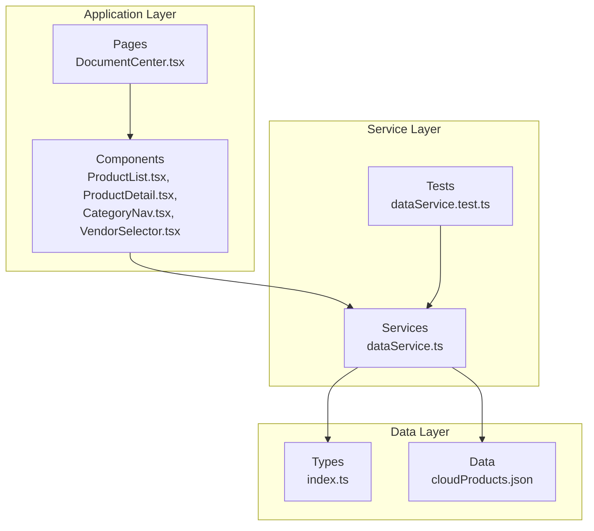
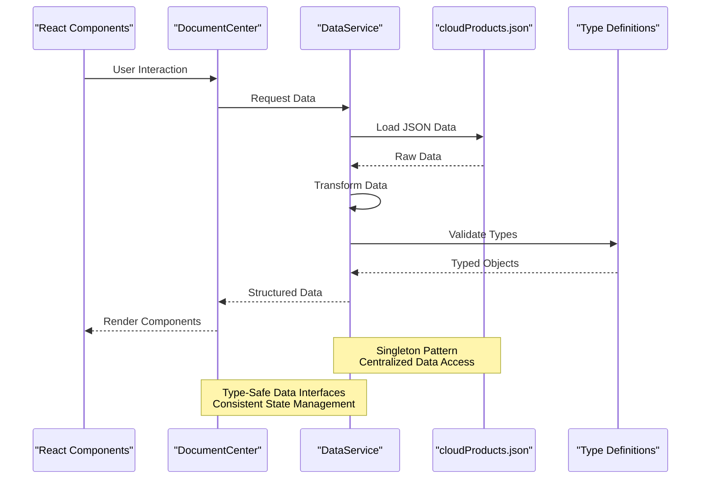
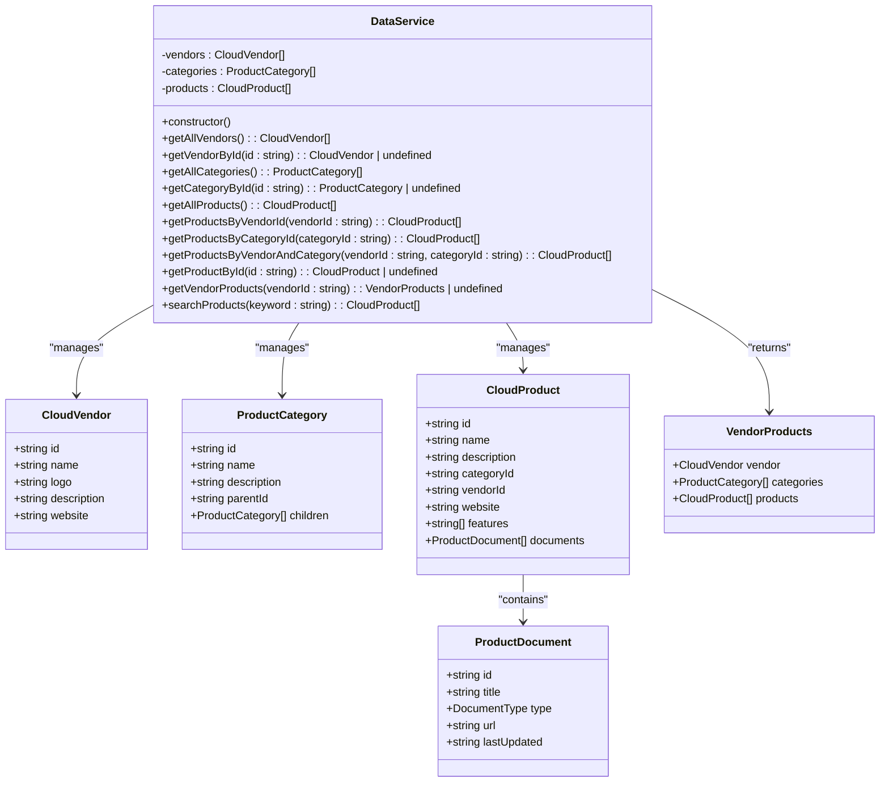
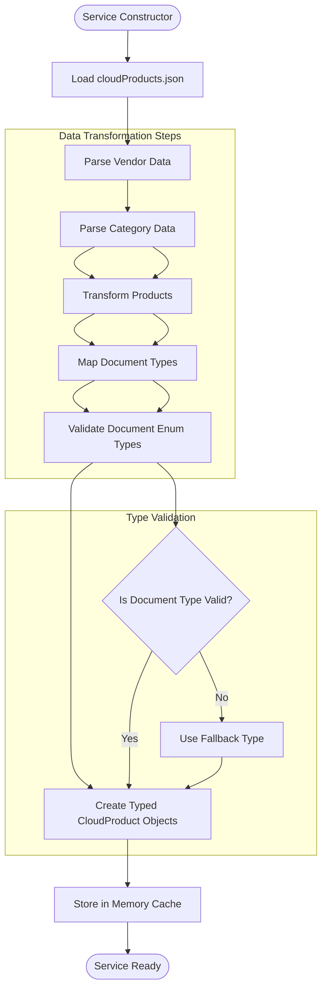
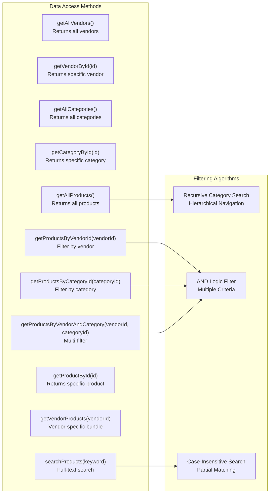
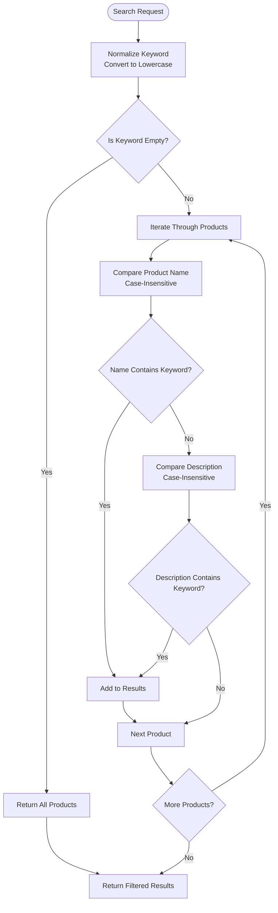
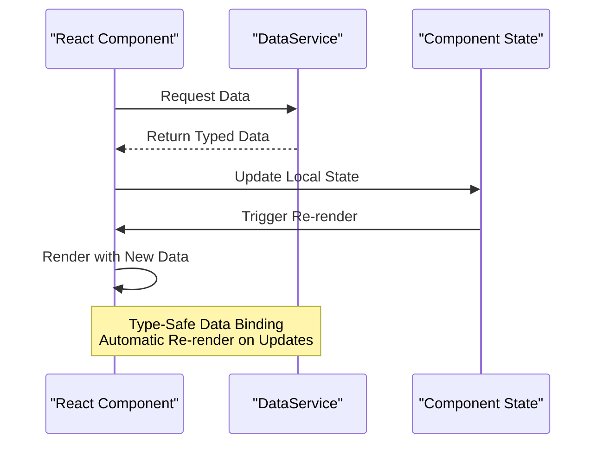
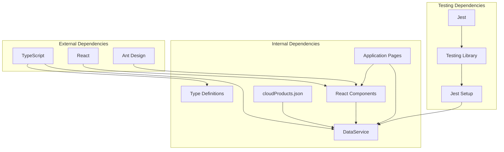

# Service Layer Architecture

<cite>
**Referenced Files in This Document**
- [dataService.ts](file://web/src/services/dataService.ts)
- [dataService.test.ts](file://web/src/services/dataService.test.ts)
- [index.ts](file://web/src/types/index.ts)
- [cloudProducts.json](file://web/src/data/cloudProducts.json)
- [DocumentCenter.tsx](file://web/src/pages/DocumentCenter.tsx)
- [ProductList.tsx](file://web/src/components/ProductList.tsx)
- [ProductDetail.tsx](file://web/src/components/ProductDetail.tsx)
- [CategoryNav.tsx](file://web/src/components/CategoryNav.tsx)
- [VendorSelector.tsx](file://web/src/components/VendorSelector.tsx)
- [main.tsx](file://web/src/main.tsx)
- [jest.config.ts](file://web/jest.config.ts)
- [jest.setup.ts](file://web/jest.setup.ts)
</cite>

## Table of Contents
1. [Introduction](#introduction)
2. [Project Structure](#project-structure)
3. [Core Components](#core-components)
4. [Architecture Overview](#architecture-overview)
5. [Detailed Component Analysis](#detailed-component-analysis)
6. [Dependency Analysis](#dependency-analysis)
7. [Performance Considerations](#performance-considerations)
8. [Troubleshooting Guide](#troubleshooting-guide)
9. [Conclusion](#conclusion)
10. [Appendices](#appendices)

## Introduction
This document provides comprehensive documentation for the service layer architecture and data management patterns in the CloudMaster application. It focuses on the singleton pattern implementation in the data service, centralized data access methods, data transformation logic, filtering algorithms, search functionality, and data manipulation methods. It also covers JSON data structure, data loading patterns, caching strategies, error handling mechanisms, data validation, type-safe data access, and the service layer's role in decoupling components from data sources while providing consistent data interfaces and managing application state. The document includes examples of service method usage, data filtering patterns, integration with React components, and testing strategies for service layer components and data validation approaches.

## Project Structure
The CloudMaster project follows a clear separation of concerns with a dedicated service layer responsible for data management and transformation. The key directories and files relevant to the service layer architecture are organized as follows:

- Services: Contains the data service implementation and its tests
- Types: Defines TypeScript interfaces for data structures
- Data: Holds the JSON dataset used by the service layer
- Components: React components that consume the service layer
- Pages: Application pages that orchestrate state and component rendering
- Tests: Jest configuration and setup for testing the service layer

**Diagram sources**
- [DocumentCenter.tsx:15-145](file://web/src/pages/DocumentCenter.tsx#L15-L145)
- [dataService.ts:4-156](file://web/src/services/dataService.ts#L4-L156)
- [index.ts:1-69](file://web/src/types/index.ts#L1-L69)
- [cloudProducts.json:1-800](file://web/src/data/cloudProducts.json#L1-L800)

**Section sources**
- [main.tsx:1-20](file://web/src/main.tsx#L1-L20)
- [DocumentCenter.tsx:15-145](file://web/src/pages/DocumentCenter.tsx#L15-L145)

## Core Components
The core of the service layer architecture is the DataService class, which implements a singleton pattern to provide centralized access to cloud product data. The service encapsulates data loading, transformation, and manipulation logic while exposing a clean API for React components to consume.

Key characteristics of the core components:

- Singleton Pattern Implementation: The service exports a single instance, ensuring consistent data access across the application
- Centralized Data Access: All data operations are performed through the service, maintaining a single source of truth
- Type-Safe Operations: Comprehensive TypeScript interfaces define data structures and validation rules
- Transformation Layer: Converts raw JSON data into typed objects with validated enumerations
- Filtering and Search Capabilities: Built-in methods for efficient data filtering and keyword search

**Section sources**
- [dataService.ts:4-20](file://web/src/services/dataService.ts#L4-L20)
- [dataService.ts:154-156](file://web/src/services/dataService.ts#L154-L156)

## Architecture Overview
The service layer architecture follows a layered approach where the DataService acts as the central coordinator between the data source (JSON file) and the presentation layer (React components). The architecture ensures loose coupling between components and data sources while providing consistent data interfaces.

**Diagram sources**
- [DocumentCenter.tsx:15-145](file://web/src/pages/DocumentCenter.tsx#L15-L145)
- [dataService.ts:4-156](file://web/src/services/dataService.ts#L4-L156)
- [index.ts:1-69](file://web/src/types/index.ts#L1-L69)
- [cloudProducts.json:1-800](file://web/src/data/cloudProducts.json#L1-L800)

## Detailed Component Analysis

### DataService Singleton Implementation
The DataService implements a singleton pattern through a single exported instance, ensuring that all components access the same data cache and state. The constructor initializes the service by loading and transforming data from the JSON source.

**Diagram sources**
- [dataService.ts:4-156](file://web/src/services/dataService.ts#L4-L156)
- [index.ts:1-69](file://web/src/types/index.ts#L1-L69)

#### Singleton Pattern Implementation Details
The singleton pattern is implemented through a single exported instance created during module initialization. This ensures:

- Single Data Cache: All components share the same data cache, preventing redundant data loading
- Consistent State: Changes to data through one component are reflected across all consumers
- Memory Efficiency: Prevents multiple instances of the same data structure in memory
- Global Access: Provides easy access to data from any component without prop drilling

**Section sources**
- [dataService.ts:154-156](file://web/src/services/dataService.ts#L154-L156)

### Data Loading and Transformation Patterns
The service implements sophisticated data loading and transformation logic to convert raw JSON data into typed objects with validated enumerations. The transformation process handles nested data structures and ensures type safety.

**Diagram sources**
- [dataService.ts:9-20](file://web/src/services/dataService.ts#L9-L20)
- [index.ts:17-23](file://web/src/types/index.ts#L17-L23)

#### Data Structure Transformation
The transformation process converts JSONProduct objects to CloudProduct objects while validating document types. The service ensures that document types conform to the allowed enumeration values ('guide', 'api', 'faq', 'tutorial', 'whitepaper').

**Section sources**
- [dataService.ts:13-19](file://web/src/services/dataService.ts#L13-L19)
- [index.ts:26-32](file://web/src/types/index.ts#L26-L32)

### Centralized Data Access Methods
The service provides a comprehensive set of data access methods that enable components to retrieve specific subsets of data efficiently. These methods are designed to minimize data processing overhead and provide optimal performance.

**Diagram sources**
- [dataService.ts:25-151](file://web/src/services/dataService.ts#L25-L151)

#### Filtering Algorithm Implementation
The service implements several filtering algorithms optimized for different use cases:

- **Category Hierarchy Search**: Recursive algorithm that traverses nested category structures to find matching categories
- **Multi-Criteria Filtering**: AND logic implementation that filters products by multiple criteria simultaneously
- **Text Search Algorithm**: Case-insensitive substring matching with performance optimizations

**Section sources**
- [dataService.ts:47-63](file://web/src/services/dataService.ts#L47-L63)
- [dataService.ts:89-93](file://web/src/services/dataService.ts#L89-L93)
- [dataService.ts:145-151](file://web/src/services/dataService.ts#L145-L151)

### Search Functionality and Data Manipulation
The search functionality implements a robust text matching algorithm that searches across product names and descriptions. The service provides efficient filtering mechanisms that balance performance with accuracy.

**Diagram sources**
- [dataService.ts:145-151](file://web/src/services/dataService.ts#L145-L151)

#### Data Manipulation Methods
The service provides various data manipulation methods for different scenarios:

- **Vendor-Specific Bundles**: getVendorProducts returns vendor, categories, and products in a single object
- **Hierarchical Category Navigation**: getCategoryById supports nested category structures
- **Multi-Dimensional Filtering**: Combined filtering by vendor and category for complex queries

**Section sources**
- [dataService.ts:105-140](file://web/src/services/dataService.ts#L105-L140)
- [dataService.ts:47-63](file://web/src/services/dataService.ts#L47-L63)

### Integration with React Components
The service layer integrates seamlessly with React components through a clean API that enables efficient data binding and state management. Components consume the service through well-defined interfaces that ensure type safety and predictable behavior.

**Diagram sources**
- [DocumentCenter.tsx:15-145](file://web/src/pages/DocumentCenter.tsx#L15-L145)
- [dataService.ts:25-151](file://web/src/services/dataService.ts#L25-L151)

#### Component Integration Patterns
Components integrate with the service layer through several patterns:

- **Direct Service Calls**: Components call service methods directly for data access
- **State Management**: Components manage local state while delegating data operations to the service
- **Memoization**: Service methods leverage memoization to prevent unnecessary computations
- **Type Safety**: All data passed to components maintains strict type checking

**Section sources**
- [DocumentCenter.tsx:17-53](file://web/src/pages/DocumentCenter.tsx#L17-L53)
- [ProductList.tsx:14-99](file://web/src/components/ProductList.tsx#L14-L99)

## Dependency Analysis
The service layer exhibits excellent dependency management with clear separation of concerns and minimal coupling between components.

**Diagram sources**
- [package.json:15-48](file://web/package.json#L15-L48)
- [dataService.ts:1-2](file://web/src/services/dataService.ts#L1-L2)
- [index.ts:1-69](file://web/src/types/index.ts#L1-L69)

### Coupling and Cohesion Analysis
The service layer demonstrates high cohesion within the DataService class while maintaining low coupling with external dependencies:

- **High Cohesion**: All data-related functionality is contained within the DataService class
- **Low Coupling**: Components depend only on the service interface, not on internal implementation details
- **Single Responsibility**: The service focuses exclusively on data management and transformation
- **Interface Stability**: Public methods provide stable contracts for components to consume

**Section sources**
- [dataService.ts:4-156](file://web/src/services/dataService.ts#L4-L156)
- [index.ts:1-69](file://web/src/types/index.ts#L1-L69)

## Performance Considerations
The service layer implements several performance optimizations to ensure efficient data access and manipulation:

### Memory Management
- **Singleton Pattern**: Prevents multiple copies of data in memory
- **Lazy Loading**: Data is loaded once during service initialization
- **Immutable Operations**: Data transformations create new objects rather than mutating existing ones

### Algorithmic Optimizations
- **Early Termination**: Search algorithms terminate early when matches are found
- **Efficient Filtering**: Uses native Array methods optimized for modern JavaScript engines
- **Minimal Object Creation**: Filters reuse existing objects when possible

### Caching Strategies
- **In-Memory Cache**: All data is cached in memory after initial load
- **Computed Properties**: Uses useMemo for expensive calculations
- **State Memoization**: Component state is memoized to prevent unnecessary re-renders

**Section sources**
- [dataService.ts:154-156](file://web/src/services/dataService.ts#L154-L156)
- [DocumentCenter.tsx:33-53](file://web/src/pages/DocumentCenter.tsx#L33-L53)

## Troubleshooting Guide
The service layer includes built-in error handling and validation mechanisms to ensure robust operation:

### Common Issues and Solutions
- **Missing Data**: Service methods return undefined for non-existent items, allowing components to handle gracefully
- **Type Validation**: Document types are validated against allowed enumerations
- **Empty Results**: Search operations return empty arrays for non-matching queries

### Error Handling Mechanisms
- **Safe Navigation**: Methods use optional chaining and undefined checks
- **Graceful Degradation**: Components handle missing data without crashing
- **Type Safety**: TypeScript prevents runtime type errors

**Section sources**
- [dataService.ts:32-34](file://web/src/services/dataService.ts#L32-L34)
- [dataService.ts:98-100](file://web/src/services/dataService.ts#L98-L100)
- [ProductDetail.tsx:14-27](file://web/src/components/ProductDetail.tsx#L14-L27)

## Conclusion
The CloudMaster service layer architecture demonstrates excellent design principles with a well-implemented singleton pattern, centralized data access, and comprehensive type safety. The DataService provides a robust foundation for data management while enabling efficient component integration and maintaining optimal performance through careful caching and filtering strategies.

Key strengths of the architecture include:
- **Type-Safe Data Access**: Comprehensive TypeScript interfaces ensure compile-time validation
- **Efficient Caching**: Singleton pattern with in-memory caching prevents redundant data operations
- **Flexible Filtering**: Multiple filtering algorithms support diverse use cases
- **Robust Error Handling**: Graceful handling of missing data and invalid operations
- **Clean Separation**: Clear boundaries between service layer and presentation layer

The architecture successfully decouples components from data sources while providing consistent data interfaces and managing application state effectively. The comprehensive testing suite ensures reliability and maintainability of the service layer components.

## Appendices

### Service Method Usage Examples
The following examples demonstrate common patterns for using service methods in components:

**Basic Data Retrieval**
- `dataService.getAllVendors()` - Retrieve all cloud vendors
- `dataService.getProductById(productId)` - Get specific product by ID
- `dataService.searchProducts(keyword)` - Perform text search across products

**Filtered Data Access**
- `dataService.getProductsByVendorId(vendorId)` - Filter by vendor
- `dataService.getProductsByCategoryId(categoryId)` - Filter by category
- `dataService.getProductsByVendorAndCategory(vendorId, categoryId)` - Multi-criteria filtering

**Hierarchical Navigation**
- `dataService.getCategoryById(categoryId)` - Navigate category hierarchy
- `dataService.getVendorProducts(vendorId)` - Get vendor-specific bundles

### Testing Strategies
The service layer employs comprehensive testing strategies:

**Unit Testing Approach**
- Individual method testing with Jest framework
- Mock data validation and transformation logic
- Edge case testing for error conditions
- Performance testing for large datasets

**Test Coverage Areas**
- All public service methods
- Data transformation and validation
- Error handling scenarios
- Integration with React components

**Testing Configuration**
- Jest with TypeScript support
- DOM environment for component testing
- Custom setup for emotion and CSS modules
- Coverage reporting for quality assurance

**Section sources**
- [dataService.test.ts:1-170](file://web/src/services/dataService.test.ts#L1-L170)
- [jest.config.ts:1-24](file://web/jest.config.ts#L1-L24)
- [jest.setup.ts:1-59](file://web/jest.setup.ts#L1-L59)