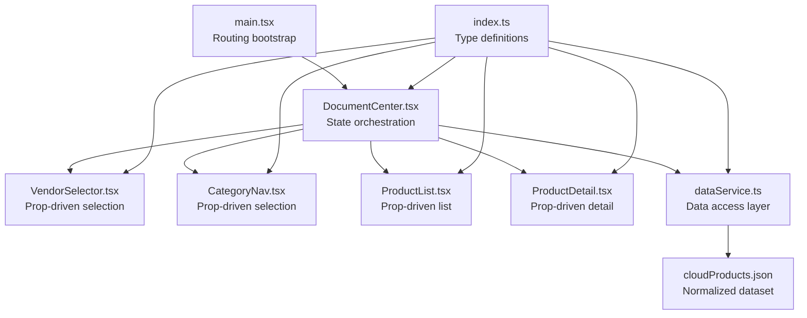
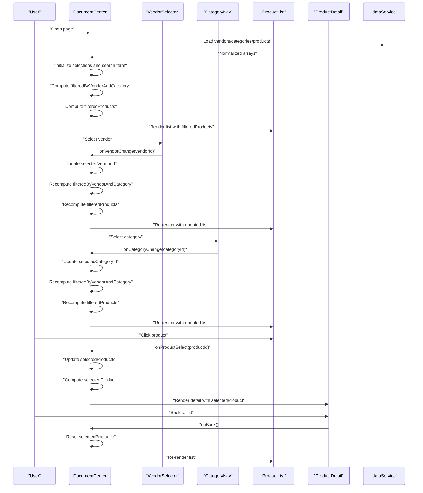
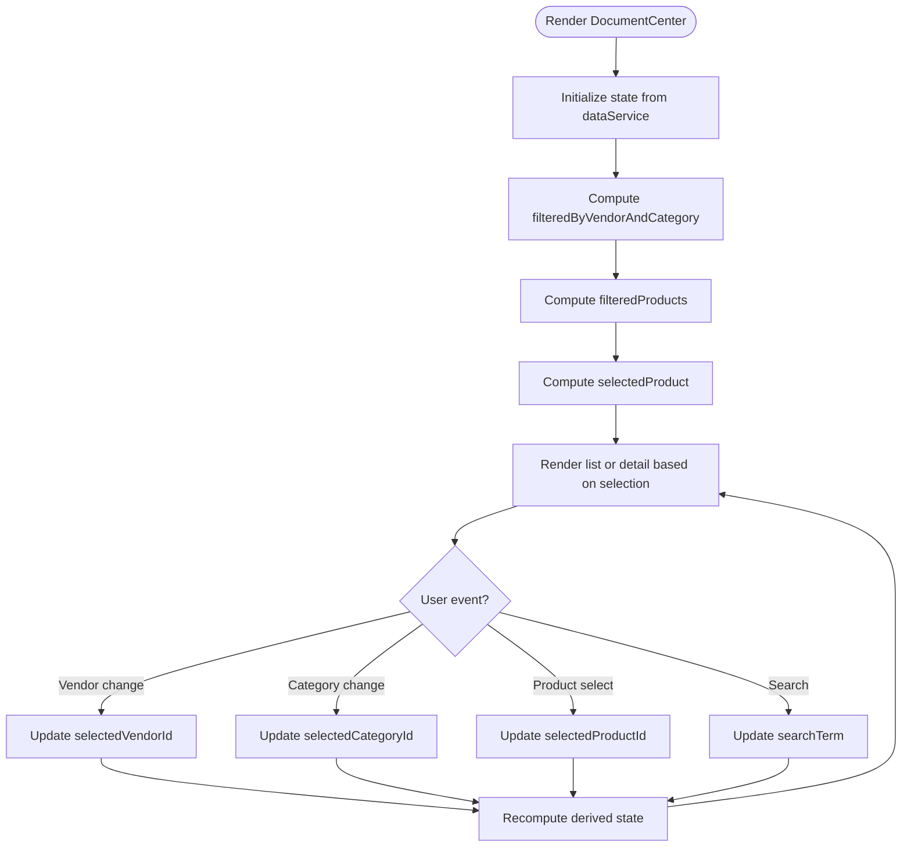
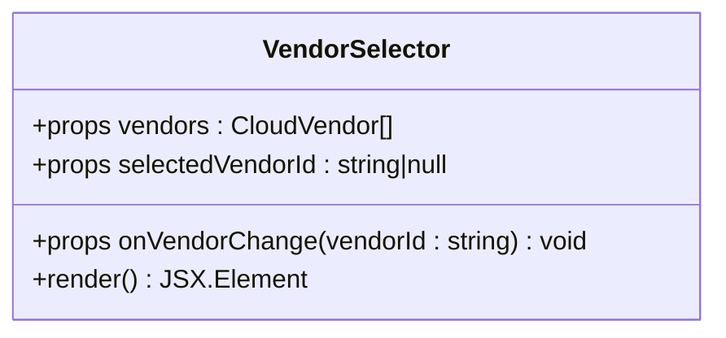
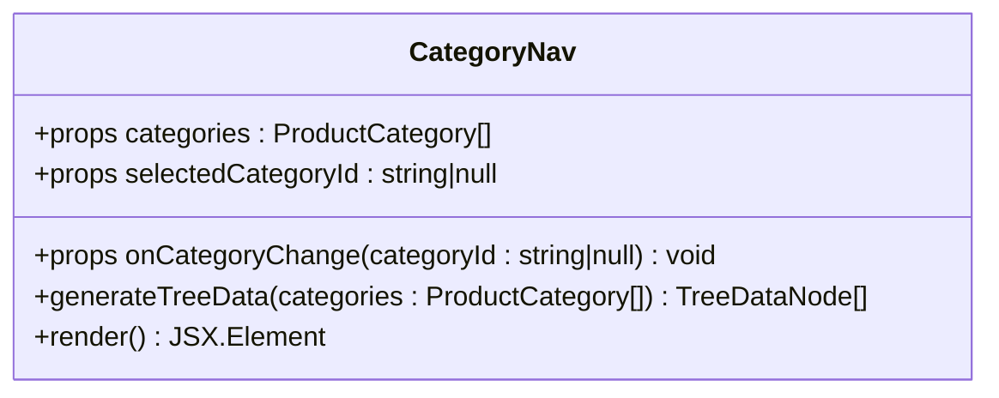
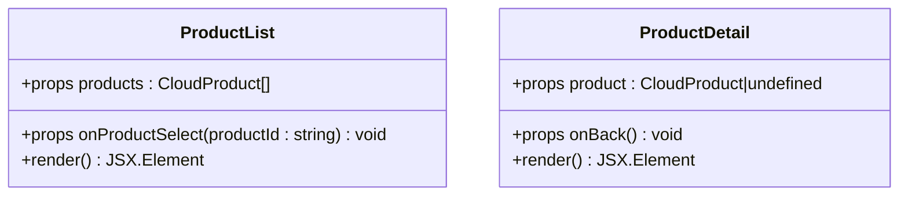
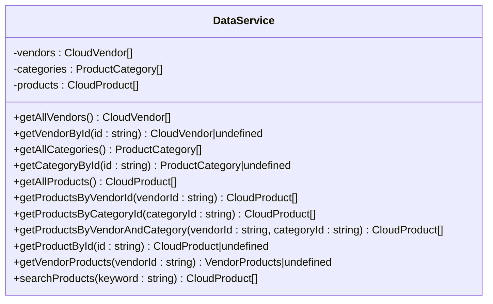
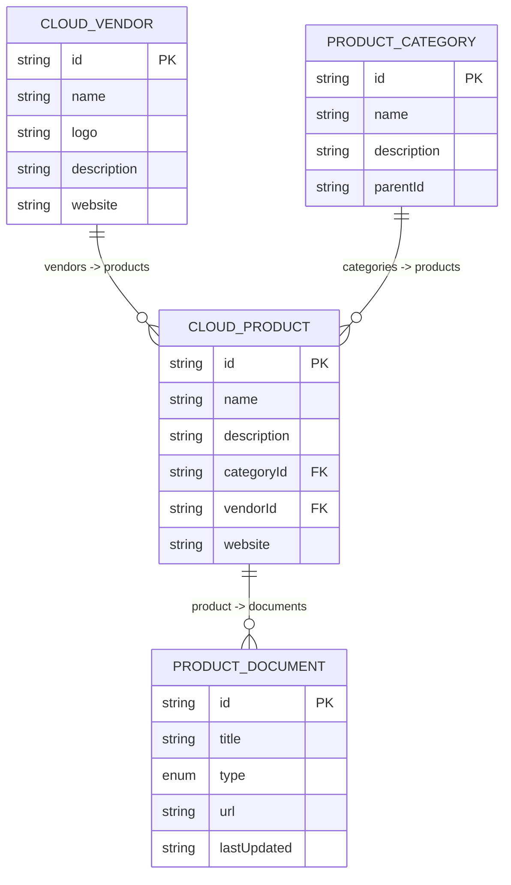
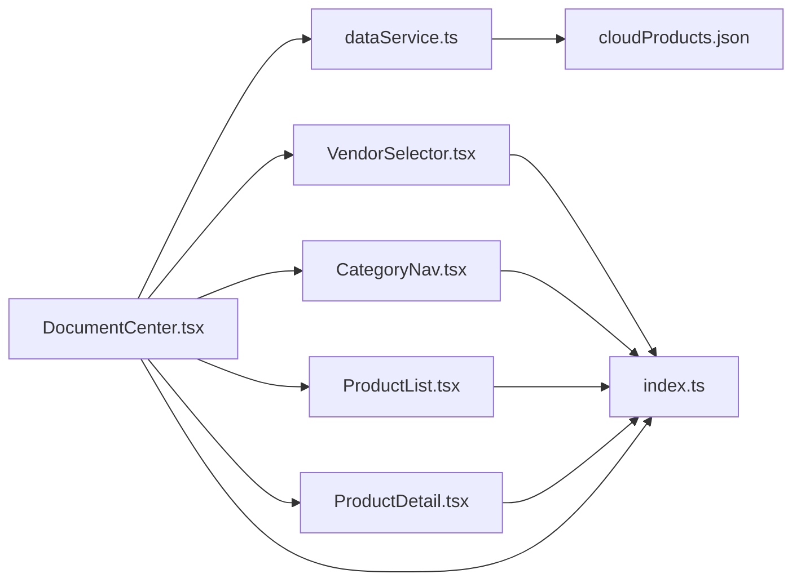

# State Management Patterns

<cite>
**Referenced Files in This Document**
- [DocumentCenter.tsx](file://web/src/pages/DocumentCenter.tsx)
- [index.ts](file://web/src/types/index.ts)
- [dataService.ts](file://web/src/services/dataService.ts)
- [VendorSelector.tsx](file://web/src/components/VendorSelector.tsx)
- [CategoryNav.tsx](file://web/src/components/CategoryNav.tsx)
- [ProductList.tsx](file://web/src/components/ProductList.tsx)
- [ProductDetail.tsx](file://web/src/components/ProductDetail.tsx)
- [main.tsx](file://web/src/main.tsx)
- [package.json](file://web/package.json)
- [cloudProducts.json](file://web/src/data/cloudProducts.json)
</cite>

## Table of Contents
1. [Introduction](#introduction)
2. [Project Structure](#project-structure)
3. [Core Components](#core-components)
4. [Architecture Overview](#architecture-overview)
5. [Detailed Component Analysis](#detailed-component-analysis)
6. [Dependency Analysis](#dependency-analysis)
7. [Performance Considerations](#performance-considerations)
8. [Troubleshooting Guide](#troubleshooting-guide)
9. [Conclusion](#conclusion)

## Introduction
This document explains the state management patterns used in the application’s DocumentCenter. It focuses on React hooks-based state management with useState, useEffect, and useMemo, and documents how component state and application state are distinguished. It also covers TypeScript interfaces for type-safe state definitions, prop contracts, and data models. The document details state update patterns, event handling mechanisms, and state synchronization across components. Finally, it provides performance optimization strategies such as memoization, normalization, and efficient re-rendering, along with best practices for maintaining a clean state architecture.

## Project Structure
The DocumentCenter page orchestrates state and UI composition. It imports service utilities for data access and composes three primary UI components: VendorSelector, CategoryNav, and ProductList/ProductDetail. The application is bootstrapped via a routing wrapper that mounts the DocumentCenter page.

**Diagram sources**
- [main.tsx:1-20](file://web/src/main.tsx#L1-L20)
- [DocumentCenter.tsx:1-145](file://web/src/pages/DocumentCenter.tsx#L1-L145)
- [VendorSelector.tsx:1-40](file://web/src/components/VendorSelector.tsx#L1-L40)
- [CategoryNav.tsx:1-57](file://web/src/components/CategoryNav.tsx#L1-L57)
- [ProductList.tsx:1-99](file://web/src/components/ProductList.tsx#L1-L99)
- [ProductDetail.tsx:1-124](file://web/src/components/ProductDetail.tsx#L1-L124)
- [dataService.ts:1-156](file://web/src/services/dataService.ts#L1-L156)
- [cloudProducts.json:1-2532](file://web/src/data/cloudProducts.json#L1-L2532)
- [index.ts:1-69](file://web/src/types/index.ts#L1-L69)

**Section sources**
- [main.tsx:1-20](file://web/src/main.tsx#L1-L20)
- [DocumentCenter.tsx:1-145](file://web/src/pages/DocumentCenter.tsx#L1-L145)
- [index.ts:1-69](file://web/src/types/index.ts#L1-L69)

## Core Components
- DocumentCenter orchestrates application state and renders either ProductList or ProductDetail based on selection. It defines local state for filters and selections, computes derived data with useMemo, and passes callbacks to child components.
- VendorSelector and CategoryNav are pure presentational components receiving props for data, selection, and change handlers.
- ProductList and ProductDetail consume typed props and render lists or details accordingly.
- dataService encapsulates data loading and filtering logic, exposing typed methods for retrieval and search.

Key hooks and patterns:
- useState: Manages selection state for vendor, category, product, and search term.
- useMemo: Derives filtered product sets and selected product details to avoid recomputation.
- No useEffect usage was identified in the analyzed files; state updates are driven by user events and prop changes.

**Section sources**
- [DocumentCenter.tsx:15-145](file://web/src/pages/DocumentCenter.tsx#L15-L145)
- [VendorSelector.tsx:7-40](file://web/src/components/VendorSelector.tsx#L7-L40)
- [CategoryNav.tsx:7-57](file://web/src/components/CategoryNav.tsx#L7-L57)
- [ProductList.tsx:9-99](file://web/src/components/ProductList.tsx#L9-L99)
- [ProductDetail.tsx:8-124](file://web/src/components/ProductDetail.tsx#L8-L124)
- [dataService.ts:4-156](file://web/src/services/dataService.ts#L4-L156)

## Architecture Overview
The state lifecycle follows a unidirectional flow:
- Initial data is loaded from dataService and normalized in memory.
- Local state in DocumentCenter holds selections and search term.
- Derived state is computed via useMemo from base data and selections.
- Child components receive props and trigger callbacks to update parent state.
- Rendering reflects the current selection and derived filters.

**Diagram sources**
- [DocumentCenter.tsx:15-145](file://web/src/pages/DocumentCenter.tsx#L15-L145)
- [VendorSelector.tsx:13-37](file://web/src/components/VendorSelector.tsx#L13-L37)
- [CategoryNav.tsx:13-57](file://web/src/components/CategoryNav.tsx#L13-L57)
- [ProductList.tsx:14-99](file://web/src/components/ProductList.tsx#L14-L99)
- [ProductDetail.tsx:13-124](file://web/src/components/ProductDetail.tsx#L13-L124)
- [dataService.ts:25-151](file://web/src/services/dataService.ts#L25-L151)

## Detailed Component Analysis

### DocumentCenter: Hooks, Memoization, and Derived State
- Local state:
  - selectedVendorId: string | null
  - selectedCategoryId: string | null
  - selectedProductId: string | null
  - searchTerm: string
- Derived state:
  - filteredByVendorAndCategory: computed from allProducts and selections
  - filteredProducts: computed from filteredByVendorAndCategory and searchTerm
  - selectedProduct: computed from selectedProductId
- Event handlers:
  - handleVendorChange, handleCategoryChange, handleProductSelect, handleBackToList, handleSearch
- Props passed down:
  - VendorSelector receives vendors, selectedVendorId, and onVendorChange
  - CategoryNav receives categories, selectedCategoryId, and onCategoryChange
  - ProductList receives products and onProductSelect
  - ProductDetail receives product and onBack

**Diagram sources**
- [DocumentCenter.tsx:15-145](file://web/src/pages/DocumentCenter.tsx#L15-L145)

**Section sources**
- [DocumentCenter.tsx:15-145](file://web/src/pages/DocumentCenter.tsx#L15-L145)

### VendorSelector: Prop-Driven Selection
- Receives:
  - vendors: CloudVendor[]
  - selectedVendorId: string | null
  - onVendorChange: (vendorId: string) => void
- Behavior:
  - Renders a radio group of vendor options
  - Calls onVendorChange with the chosen vendor id

**Diagram sources**
- [VendorSelector.tsx:7-40](file://web/src/components/VendorSelector.tsx#L7-L40)

**Section sources**
- [VendorSelector.tsx:7-40](file://web/src/components/VendorSelector.tsx#L7-L40)

### CategoryNav: Hierarchical Tree Navigation
- Receives:
  - categories: ProductCategory[]
  - selectedCategoryId: string | null
  - onCategoryChange: (categoryId: string | null) => void
- Behavior:
  - Converts flat categories to Ant Design Tree-compatible nodes
  - Uses defaultExpandAll and selectedKeys to reflect selection
  - Calls onCategoryChange with the selected key

**Diagram sources**
- [CategoryNav.tsx:7-57](file://web/src/components/CategoryNav.tsx#L7-L57)

**Section sources**
- [CategoryNav.tsx:7-57](file://web/src/components/CategoryNav.tsx#L7-L57)

### ProductList and ProductDetail: Type-Safe Rendering
- ProductList:
  - Receives products: CloudProduct[] and onProductSelect
  - Renders cards with features and document entries
- ProductDetail:
  - Receives product: CloudProduct | undefined and onBack
  - Renders product metadata, features, and documents
  - Handles missing product gracefully

**Diagram sources**
- [ProductList.tsx:9-99](file://web/src/components/ProductList.tsx#L9-L99)
- [ProductDetail.tsx:8-124](file://web/src/components/ProductDetail.tsx#L8-L124)

**Section sources**
- [ProductList.tsx:9-99](file://web/src/components/ProductList.tsx#L9-L99)
- [ProductDetail.tsx:8-124](file://web/src/components/ProductDetail.tsx#L8-L124)

### dataService: Centralized Data Access
- Provides typed methods for:
  - Retrieving vendors, categories, and products
  - Filtering by vendor, category, or combined criteria
  - Searching products by keyword
  - Normalizing JSON documents to strict types
- Exports a singleton instance for consumption across components

**Diagram sources**
- [dataService.ts:4-156](file://web/src/services/dataService.ts#L4-L156)

**Section sources**
- [dataService.ts:4-156](file://web/src/services/dataService.ts#L4-L156)

### TypeScript Interfaces: Type-Safe Contracts
- CloudVendor, ProductCategory, CloudProduct, ProductDocument define normalized domain models
- JSONProduct and JSONProductDocument represent raw JSON shapes
- VendorProducts aggregates vendor, categories, and products for scoped views
- AppState captures the global selection state shape

**Diagram sources**
- [index.ts:1-69](file://web/src/types/index.ts#L1-L69)

**Section sources**
- [index.ts:1-69](file://web/src/types/index.ts#L1-L69)

## Dependency Analysis
- DocumentCenter depends on dataService for initial data and filtering/search.
- Child components depend on typed props from DocumentCenter.
- Types are shared across components and services to maintain consistency.
- Routing is handled at the app root and mounts DocumentCenter.

**Diagram sources**
- [DocumentCenter.tsx:1-145](file://web/src/pages/DocumentCenter.tsx#L1-L145)
- [dataService.ts:1-156](file://web/src/services/dataService.ts#L1-L156)
- [VendorSelector.tsx:1-40](file://web/src/components/VendorSelector.tsx#L1-L40)
- [CategoryNav.tsx:1-57](file://web/src/components/CategoryNav.tsx#L1-L57)
- [ProductList.tsx:1-99](file://web/src/components/ProductList.tsx#L1-L99)
- [ProductDetail.tsx:1-124](file://web/src/components/ProductDetail.tsx#L1-L124)
- [index.ts:1-69](file://web/src/types/index.ts#L1-L69)
- [cloudProducts.json:1-2532](file://web/src/data/cloudProducts.json#L1-L2532)

**Section sources**
- [DocumentCenter.tsx:1-145](file://web/src/pages/DocumentCenter.tsx#L1-L145)
- [dataService.ts:1-156](file://web/src/services/dataService.ts#L1-L156)
- [index.ts:1-69](file://web/src/types/index.ts#L1-L69)

## Performance Considerations
- Memoization:
  - Use useMemo to compute filteredByVendorAndCategory and filteredProducts to avoid re-filtering on every render.
  - Use useMemo for selectedProduct to prevent repeated lookups.
- Derived state granularity:
  - Keep base data immutable and derive subsets to minimize unnecessary recomputations.
- Event handler identity:
  - Define event handlers at render boundary to ensure stable references when used with memoized computations.
- Re-render minimization:
  - Pass only required props to child components to reduce downstream re-renders.
- Data normalization:
  - dataService normalizes JSON documents to strict types, enabling efficient lookups and reducing runtime type checks.
- Avoid useEffect:
  - Current implementation relies on declarative props and memoization; adding effects would complicate the predictable flow.

[No sources needed since this section provides general guidance]

## Troubleshooting Guide
- Symptom: Filters not updating after selection
  - Verify that onVendorChange and onCategoryChange are invoked and update state in DocumentCenter.
  - Confirm that useMemo dependencies include the relevant selection keys.
- Symptom: Detail view does not show selected product
  - Ensure selectedProductId is set and that selectedProduct computation runs with the correct dependency.
- Symptom: Search yields unexpected results
  - Confirm that search term is trimmed and that searchProducts is used when searchTerm is non-empty.
- Symptom: Category tree not reflecting selection
  - Ensure selectedCategoryId is passed to Tree as selectedKeys and that onCategoryChange returns the correct key.

**Section sources**
- [DocumentCenter.tsx:32-53](file://web/src/pages/DocumentCenter.tsx#L32-L53)
- [CategoryNav.tsx:44-51](file://web/src/components/CategoryNav.tsx#L44-L51)

## Conclusion
The DocumentCenter employs a clean, hooks-based state management pattern centered on useState and useMemo. State is organized as component-local selections and derived computations, with data access encapsulated in dataService. TypeScript interfaces enforce type safety across the application. The architecture supports efficient re-rendering and straightforward state synchronization through prop drilling and callback handlers. To scale, consider introducing a centralized state library for cross-component sharing while preserving the existing memoization and type-safe patterns.