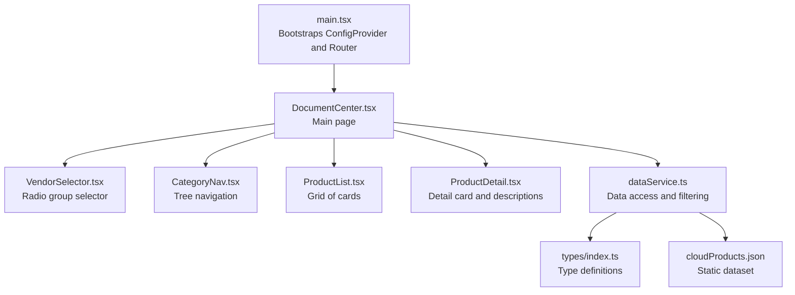
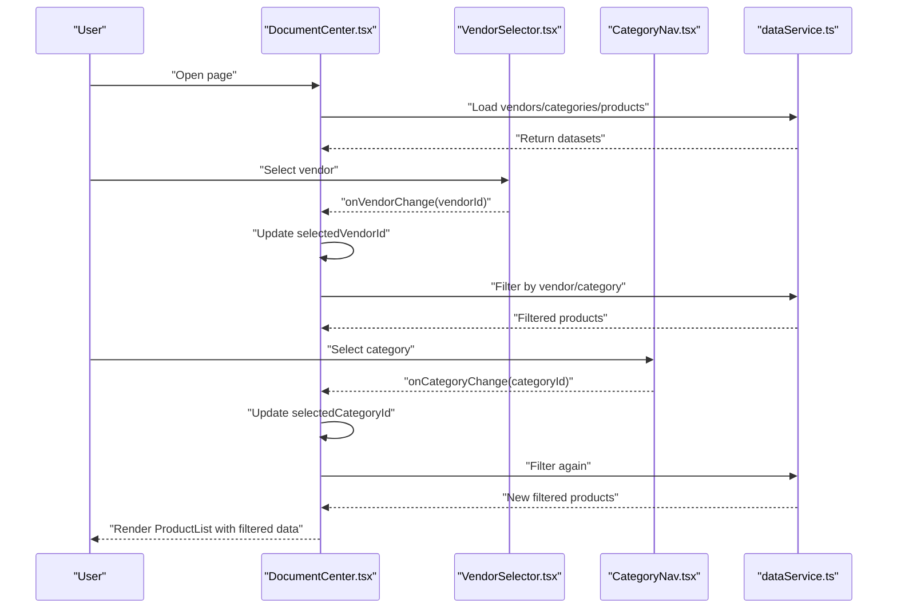
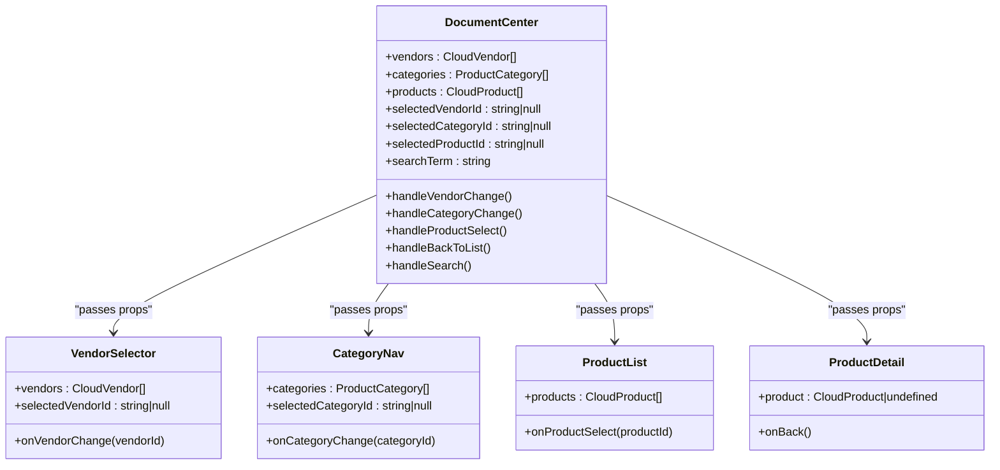
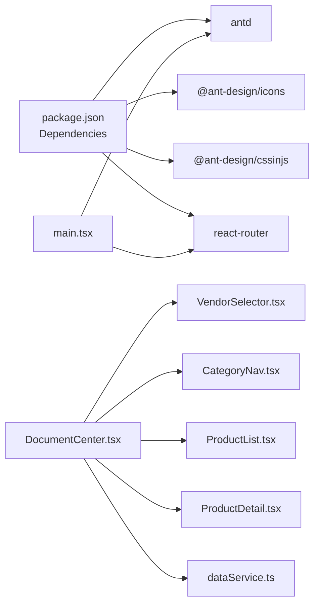

# UI Framework Integration

<cite>
**Referenced Files in This Document**
- [package.json](file://web/package.json)
- [main.tsx](file://web/src/main.tsx)
- [index.css](file://web/src/index.css)
- [App.css](file://web/src/App.css)
- [DocumentCenter.tsx](file://web/src/pages/DocumentCenter.tsx)
- [VendorSelector.tsx](file://web/src/components/VendorSelector.tsx)
- [CategoryNav.tsx](file://web/src/components/CategoryNav.tsx)
- [ProductList.tsx](file://web/src/components/ProductList.tsx)
- [ProductDetail.tsx](file://web/src/components/ProductDetail.tsx)
- [dataService.ts](file://web/src/services/dataService.ts)
- [types/index.ts](file://web/src/types/index.ts)
- [cloudProducts.json](file://web/src/data/cloudProducts.json)
- [VendorSelector.test.tsx](file://web/src/components/VendorSelector.test.tsx)
- [CategoryNav.test.tsx](file://web/src/components/CategoryNav.test.tsx)
</cite>

## Table of Contents
1. [Introduction](#introduction)
2. [Project Structure](#project-structure)
3. [Core Components](#core-components)
4. [Architecture Overview](#architecture-overview)
5. [Detailed Component Analysis](#detailed-component-analysis)
6. [Dependency Analysis](#dependency-analysis)
7. [Performance Considerations](#performance-considerations)
8. [Troubleshooting Guide](#troubleshooting-guide)
9. [Conclusion](#conclusion)
10. [Appendices](#appendices)

## Introduction
This document explains how the Ant Design UI framework is integrated into the frontend application and how custom React components are styled and composed. It covers component usage patterns, theme and locale configuration, responsive design, CSS-in-JS approaches, and the relationship between Ant Design components and custom components. Accessibility, cross-browser compatibility, and mobile responsiveness are addressed alongside practical examples and best practices.

## Project Structure
The UI integration centers around a single-page application built with React and Ant Design. The application bootstraps Ant Design’s ConfigProvider at the root to set locale and theme defaults, and routes to a primary page that composes multiple custom components using Ant Design layout, form, and data-display primitives.

**Diagram sources**
- [main.tsx:1-20](file://web/src/main.tsx#L1-L20)
- [DocumentCenter.tsx:1-145](file://web/src/pages/DocumentCenter.tsx#L1-L145)
- [VendorSelector.tsx:1-40](file://web/src/components/VendorSelector.tsx#L1-L40)
- [CategoryNav.tsx:1-57](file://web/src/components/CategoryNav.tsx#L1-L57)
- [ProductList.tsx:1-99](file://web/src/components/ProductList.tsx#L1-L99)
- [ProductDetail.tsx:1-124](file://web/src/components/ProductDetail.tsx#L1-L124)
- [dataService.ts:1-156](file://web/src/services/dataService.ts#L1-L156)
- [types/index.ts:1-69](file://web/src/types/index.ts#L1-L69)
- [cloudProducts.json:1-800](file://web/src/data/cloudProducts.json#L1-L800)

**Section sources**
- [main.tsx:1-20](file://web/src/main.tsx#L1-L20)
- [DocumentCenter.tsx:1-145](file://web/src/pages/DocumentCenter.tsx#L1-L145)

## Core Components
- Ant Design integration via ConfigProvider for locale and theme defaults.
- Layout composition using Ant Design Layout, Header, Sider, and Content.
- Interactive selection controls using Ant Design Radio and Tree.
- Data presentation using Ant Design Card, Typography, Tag, Space, Button, Descriptions, and Divider.
- Responsive grid using Ant Design Col with responsive breakpoints.
- Icons from @ant-design/icons.

Key integration points:
- Locale configuration at app root.
- Global CSS resets and base styles.
- Component-level inline styles and Ant Design props for layout and appearance.

**Section sources**
- [main.tsx:1-20](file://web/src/main.tsx#L1-L20)
- [index.css:1-69](file://web/src/index.css#L1-L69)
- [App.css:1-43](file://web/src/App.css#L1-L43)
- [DocumentCenter.tsx:1-145](file://web/src/pages/DocumentCenter.tsx#L1-L145)
- [VendorSelector.tsx:1-40](file://web/src/components/VendorSelector.tsx#L1-L40)
- [CategoryNav.tsx:1-57](file://web/src/components/CategoryNav.tsx#L1-L57)
- [ProductList.tsx:1-99](file://web/src/components/ProductList.tsx#L1-L99)
- [ProductDetail.tsx:1-124](file://web/src/components/ProductDetail.tsx#L1-L124)

## Architecture Overview
The application follows a unidirectional data flow:
- The main page loads static data via a service, maintains local state for filters and selections, and passes props down to child components.
- Child components trigger callbacks to update state in the parent, which recomputes filtered results and renders appropriate views.

**Diagram sources**
- [DocumentCenter.tsx:15-79](file://web/src/pages/DocumentCenter.tsx#L15-L79)
- [dataService.ts:25-151](file://web/src/services/dataService.ts#L25-L151)
- [VendorSelector.tsx:13-37](file://web/src/components/VendorSelector.tsx#L13-L37)
- [CategoryNav.tsx:13-53](file://web/src/components/CategoryNav.tsx#L13-L53)

## Detailed Component Analysis

### Ant Design Integration and Theme Setup
- ConfigProvider wraps the application root to set locale and enable theme-related features.
- Global CSS establishes base typography, colors, and motion preferences.
- Ant Design CSS-in-JS is included as a dependency, enabling dynamic token-based theming.

Implementation highlights:
- Root provider sets Chinese locale for date pickers, menus, and other locale-aware components.
- Base CSS defines color scheme, fonts, and button styles to align with Ant Design’s design tokens.

**Section sources**
- [main.tsx:4-11](file://web/src/main.tsx#L4-L11)
- [index.css:1-69](file://web/src/index.css#L1-L69)
- [package.json:15-24](file://web/package.json#L15-L24)

### Layout and Navigation Components
- DocumentCenter composes Ant Design Layout, Header, Sider, and Content to create a fixed header and collapsible side panels.
- VendorSelector uses Ant Design Radio.Group/Radio.Button to present vendor choices.
- CategoryNav uses Ant Design Tree to render hierarchical categories and manage selection.

Responsive behavior:
- Ant Design Col props provide responsive column spans across breakpoints.
- Header is fixed and adapts to viewport width.

Accessibility and UX:
- Buttons and links use semantic roles and focus styles.
- Icons enhance affordance without sacrificing accessibility.

**Section sources**
- [DocumentCenter.tsx:11-141](file://web/src/pages/DocumentCenter.tsx#L11-L141)
- [VendorSelector.tsx:13-37](file://web/src/components/VendorSelector.tsx#L13-L37)
- [CategoryNav.tsx:13-53](file://web/src/components/CategoryNav.tsx#L13-L53)

### Data Presentation Components
- ProductList displays a grid of cards with metadata, tags, and action buttons. It uses Ant Design Card, Typography, Tag, Space, and Button.
- ProductDetail shows a comprehensive card with descriptions, tags, and a list of documents, using Ant Design Descriptions and Divider.

Styling strategies:
- Inline styles for layout and minor tweaks.
- Ant Design props for consistent spacing, borders, and shadows.
- Semantic typography and color usage for readability.

**Section sources**
- [ProductList.tsx:14-98](file://web/src/components/ProductList.tsx#L14-L98)
- [ProductDetail.tsx:13-123](file://web/src/components/ProductDetail.tsx#L13-L123)

### Data Access and Filtering
- dataService encapsulates loading and filtering logic, normalizing JSON data and exposing typed methods.
- Filtering combines vendor and category selection with optional free-text search.

Performance considerations:
- Memoization prevents unnecessary recalculations.
- Local filtering avoids network overhead for small datasets.

**Section sources**
- [dataService.ts:4-155](file://web/src/services/dataService.ts#L4-L155)
- [DocumentCenter.tsx:33-79](file://web/src/pages/DocumentCenter.tsx#L33-L79)
- [types/index.ts:1-69](file://web/src/types/index.ts#L1-L69)
- [cloudProducts.json:1-800](file://web/src/data/cloudProducts.json#L1-L800)

### Component Styling Strategies and CSS Classes
- Global styles define base fonts, colors, and motion preferences.
- Component-level inline styles are used for layout and minor adjustments.
- Ant Design components apply internal CSS classes; tests assert on these classes to verify selection states.

Best practices:
- Prefer Ant Design props for consistent behavior.
- Use minimal inline styles for layout; rely on Ant Design layout primitives.
- Maintain a single source of truth for brand colors via global CSS variables.

**Section sources**
- [index.css:1-69](file://web/src/index.css#L1-L69)
- [App.css:1-43](file://web/src/App.css#L1-L43)
- [VendorSelector.tsx:18-35](file://web/src/components/VendorSelector.tsx#L18-L35)
- [VendorSelector.test.tsx:64-70](file://web/src/components/VendorSelector.test.tsx#L64-L70)
- [CategoryNav.test.tsx:100-110](file://web/src/components/CategoryNav.test.tsx#L100-L110)

### Form Handling and Interactive Elements
- Search input is integrated into the Header with controlled value handling.
- Selection components use controlled props and callback handlers to update state.
- Action buttons open external resources and trigger navigation.

Accessibility:
- Focus management and keyboard navigation supported by Ant Design components.
- Links include rel attributes for security.

**Section sources**
- [DocumentCenter.tsx:99-107](file://web/src/pages/DocumentCenter.tsx#L99-L107)
- [DocumentCenter.tsx:56-78](file://web/src/pages/DocumentCenter.tsx#L56-L78)
- [ProductList.tsx:36-52](file://web/src/components/ProductList.tsx#L36-L52)
- [ProductDetail.tsx:17-26](file://web/src/components/ProductDetail.tsx#L17-L26)

### Responsive Design Implementation
- Ant Design Col provides responsive breakpoints (xs, sm, md, lg, xl, xxl).
- Layout uses fixed header and scrollable content area for mobile usability.
- Typography scales appropriately with base font sizes.

Cross-device considerations:
- Touch-friendly button sizing and spacing.
- Scrollable siders for narrow viewports.

**Section sources**
- [ProductList.tsx:31-92](file://web/src/components/ProductList.tsx#L31-L92)
- [DocumentCenter.tsx:111-140](file://web/src/pages/DocumentCenter.tsx#L111-L140)

### Custom Component Relationships
- DocumentCenter orchestrates data loading and state, passing data and callbacks to VendorSelector, CategoryNav, ProductList, and ProductDetail.
- These components remain reusable and decoupled from data sources.

**Diagram sources**
- [DocumentCenter.tsx:15-79](file://web/src/pages/DocumentCenter.tsx#L15-L79)
- [VendorSelector.tsx:7-37](file://web/src/components/VendorSelector.tsx#L7-L37)
- [CategoryNav.tsx:7-53](file://web/src/components/CategoryNav.tsx#L7-L53)
- [ProductList.tsx:9-98](file://web/src/components/ProductList.tsx#L9-L98)
- [ProductDetail.tsx:8-123](file://web/src/components/ProductDetail.tsx#L8-L123)

## Dependency Analysis
External UI and styling dependencies:
- Ant Design v5 and @ant-design/icons for components and icons.
- @ant-design/cssinjs for CSS-in-JS token support.
- React and React DOM for rendering.
- react-router and react-router-dom for routing.

Internal relationships:
- main.tsx depends on ConfigProvider and locale.
- Pages depend on components and services.
- Components depend on Ant Design primitives and icons.

**Diagram sources**
- [package.json:15-24](file://web/package.json#L15-L24)
- [main.tsx:1-20](file://web/src/main.tsx#L1-L20)
- [DocumentCenter.tsx:1-145](file://web/src/pages/DocumentCenter.tsx#L1-L145)

**Section sources**
- [package.json:15-24](file://web/package.json#L15-L24)
- [main.tsx:1-20](file://web/src/main.tsx#L1-L20)

## Performance Considerations
- Prefer Ant Design props for layout and spacing to avoid custom CSS overhead.
- Use memoization for derived data to prevent re-renders.
- Keep datasets small or paginate to maintain responsiveness.
- Minimize inline styles; leverage Ant Design’s design tokens and CSS-in-JS for scalable theming.

## Troubleshooting Guide
Common issues and resolutions:
- Locale mismatch: Ensure ConfigProvider locale is set consistently at the root.
- Styling conflicts: Avoid overriding Ant Design classes directly; use props or CSS-in-JS.
- Test assertions: When asserting selection states, target Ant Design wrapper classes used by Radio and Tree components.
- Accessibility: Verify focus styles and keyboard navigation work as expected with Ant Design components.

**Section sources**
- [main.tsx:4-11](file://web/src/main.tsx#L4-L11)
- [VendorSelector.test.tsx:64-70](file://web/src/components/VendorSelector.test.tsx#L64-L70)
- [CategoryNav.test.tsx:100-110](file://web/src/components/CategoryNav.test.tsx#L100-L110)

## Conclusion
The application integrates Ant Design seamlessly at the root level and composes it with custom components to deliver a responsive, accessible, and maintainable UI. By leveraging Ant Design’s layout, form, and data-display components, along with controlled props and memoized state, the system achieves a clean separation of concerns and predictable behavior across devices.

## Appendices
- Example patterns:
  - Theme and locale setup at the root.
  - Controlled selection components with callback-driven updates.
  - Responsive grid using Ant Design Col.
  - Data presentation with Ant Design Card and Descriptions.
  - Global CSS for base styles and motion preferences.

[No sources needed since this section provides general guidance]