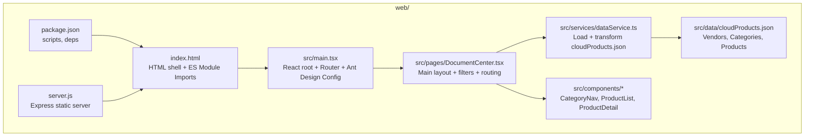
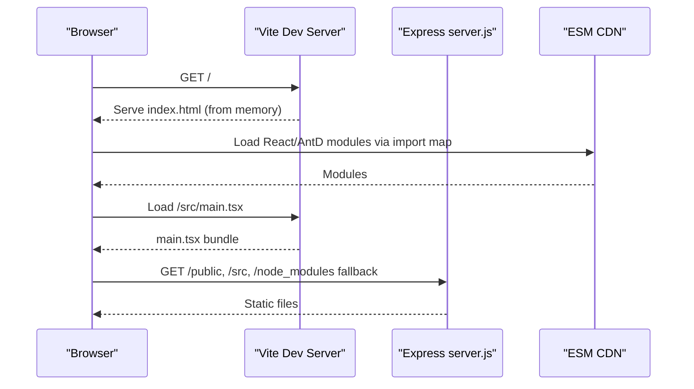
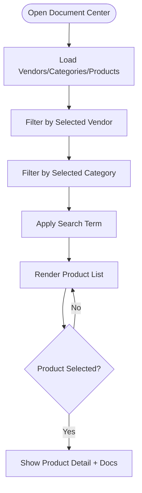
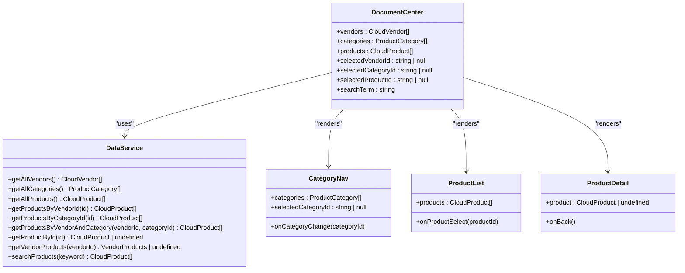
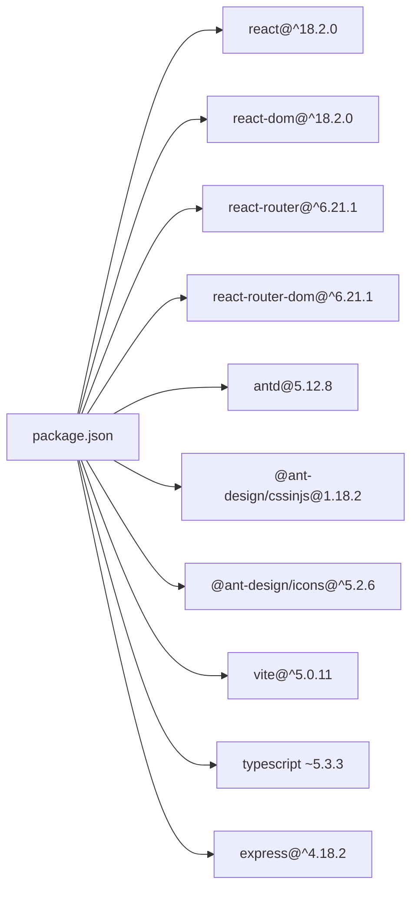

# Getting Started

<cite>
**Referenced Files in This Document**
- [README.md](file://README.md)
- [web/package.json](file://web/package.json)
- [web/index.html](file://web/index.html)
- [web/src/main.tsx](file://web/src/main.tsx)
- [web/server.js](file://web/server.js)
- [web/src/pages/DocumentCenter.tsx](file://web/src/pages/DocumentCenter.tsx)
- [web/src/services/dataService.ts](file://web/src/services/dataService.ts)
- [web/src/data/cloudProducts.json](file://web/src/data/cloudProducts.json)
- [web/src/components/CategoryNav.tsx](file://web/src/components/CategoryNav.tsx)
- [web/src/components/ProductList.tsx](file://web/src/components/ProductList.tsx)
- [web/src/components/ProductDetail.tsx](file://web/src/components/ProductDetail.tsx)
- [web/tsconfig.json](file://web/tsconfig.json)
</cite>

## Table of Contents
1. [Introduction](#introduction)
2. [Project Structure](#project-structure)
3. [Core Components](#core-components)
4. [Architecture Overview](#architecture-overview)
5. [Detailed Component Analysis](#detailed-component-analysis)
6. [Dependency Analysis](#dependency-analysis)
7. [Performance Considerations](#performance-considerations)
8. [Troubleshooting Guide](#troubleshooting-guide)
9. [Conclusion](#conclusion)
10. [Appendices](#appendices)

## Introduction
This guide helps you set up and run the AI Guru Database project locally. It focuses on the frontend application that displays curated cloud product documentation and educational materials. You will learn how to install prerequisites, configure the development environment, run the local server, and navigate the application’s cloud product discovery system and educational content.

The project is a React 18 application with TypeScript, styled with Ant Design 5, built with Vite 5, and served via an Express server for static assets. The educational content is organized under the docs directory, and the cloud product catalog is embedded in the frontend.

## Project Structure
At a high level, the repository contains:
- A React + TypeScript frontend under web/
- An Express server script for serving static assets
- A large JSON dataset of cloud vendors, categories, and products
- A comprehensive docs directory with structured learning materials

**Diagram sources**
- [web/package.json:1-50](file://web/package.json#L1-L50)
- [web/index.html:1-48](file://web/index.html#L1-L48)
- [web/src/main.tsx:1-20](file://web/src/main.tsx#L1-L20)
- [web/src/pages/DocumentCenter.tsx:1-145](file://web/src/pages/DocumentCenter.tsx#L1-L145)
- [web/src/services/dataService.ts:1-156](file://web/src/services/dataService.ts#L1-L156)
- [web/src/data/cloudProducts.json:1-2532](file://web/src/data/cloudProducts.json#L1-L2532)
- [web/server.js:1-17](file://web/server.js#L1-L17)

**Section sources**
- [README.md:1-73](file://README.md#L1-L73)
- [web/package.json:1-50](file://web/package.json#L1-L50)
- [web/index.html:1-48](file://web/index.html#L1-L48)
- [web/src/main.tsx:1-20](file://web/src/main.tsx#L1-L20)
- [web/server.js:1-17](file://web/server.js#L1-L17)

## Core Components
- Frontend framework and runtime
  - React 18.2.0 with React Router for client-side navigation
  - TypeScript for type safety
  - Ant Design 5.12.8 UI components
  - Vite 5.0.11 for fast dev builds and preview
- Backend server
  - Express 4.18.2 to serve static assets and index.html
- Data layer
  - Embedded JSON dataset of cloud vendors, categories, and products
  - A service module that loads and transforms the dataset for UI consumption

Key technologies and versions are declared in the frontend package manifest.

**Section sources**
- [web/package.json:15-48](file://web/package.json#L15-L48)
- [web/src/main.tsx:1-20](file://web/src/main.tsx#L1-L20)
- [web/server.js:1-17](file://web/server.js#L1-L17)
- [web/src/services/dataService.ts:1-156](file://web/src/services/dataService.ts#L1-L156)
- [web/src/data/cloudProducts.json:1-2532](file://web/src/data/cloudProducts.json#L1-L2532)

## Architecture Overview
The application runs as a single-page application served statically. The HTML page declares import maps to load React and Ant Design from a CDN, while the app’s own entry is loaded as a module. The Express server serves the index.html and static assets so the SPA works correctly in development.

**Diagram sources**
- [web/index.html:35-46](file://web/index.html#L35-L46)
- [web/src/main.tsx:1-20](file://web/src/main.tsx#L1-L20)
- [web/server.js:1-17](file://web/server.js#L1-L17)

## Detailed Component Analysis

### Running Locally
Follow these steps to run the project on your machine:

Prerequisites
- Node.js installed (match the versions used by the project dependencies)
- A modern web browser

Installation
- Navigate to the web directory and install dependencies:
  - Use your preferred package manager to install dependencies declared in the package manifest.

Development server
- Start the Vite dev server using the configured script.
- Open the printed URL in your browser.

Preview production build
- Build the project using the provided script.
- Preview the production build using the preview script.

Testing
- Run unit tests with the provided scripts.

Notes
- The Express server script is provided for serving static assets during development. It serves the index.html for all routes and exposes public/, src/, and node_modules/ directories for hot module replacement and debugging.

**Section sources**
- [web/package.json:6-14](file://web/package.json#L6-L14)
- [web/server.js:1-17](file://web/server.js#L1-L17)
- [web/index.html:1-48](file://web/index.html#L1-L48)

### Accessing the Cloud Product Discovery System
The main screen organizes the cloud product catalog by vendor and category, and supports searching. The data is loaded from the embedded JSON dataset and transformed by the data service.

How it works
- The main page initializes lists of vendors, categories, and products.
- Filters by vendor and category narrow the product list.
- A search bar queries the dataset by product name or description.
- Selecting a product opens a detail view with features and linked documentation.

**Diagram sources**
- [web/src/pages/DocumentCenter.tsx:15-78](file://web/src/pages/DocumentCenter.tsx#L15-L78)
- [web/src/services/dataService.ts:67-151](file://web/src/services/dataService.ts#L67-L151)

**Section sources**
- [web/src/pages/DocumentCenter.tsx:1-145](file://web/src/pages/DocumentCenter.tsx#L1-L145)
- [web/src/services/dataService.ts:1-156](file://web/src/services/dataService.ts#L1-L156)
- [web/src/data/cloudProducts.json:1-2532](file://web/src/data/cloudProducts.json#L1-L2532)

### Navigating the Educational Content
The repository includes a comprehensive docs directory covering fundamentals, machine learning, deep learning, NLP/LLMs, computer vision, reinforcement learning, AI engineering, ethics/safety, talks, papers, and interviews. The top-level README links to these resources.

How to use
- Browse the README for thematic links to docs.
- Explore topics by category and subtopics.
- Use the search bar in the cloud product discovery UI to filter products and documentation.

**Section sources**
- [README.md:16-70](file://README.md#L16-L70)

### Component-Level View
The UI is composed of small, focused components that collaborate around the shared data service.

**Diagram sources**
- [web/src/services/dataService.ts:4-156](file://web/src/services/dataService.ts#L4-L156)
- [web/src/pages/DocumentCenter.tsx:15-78](file://web/src/pages/DocumentCenter.tsx#L15-L78)
- [web/src/components/CategoryNav.tsx:7-57](file://web/src/components/CategoryNav.tsx#L7-L57)
- [web/src/components/ProductList.tsx:9-99](file://web/src/components/ProductList.tsx#L9-L99)
- [web/src/components/ProductDetail.tsx:8-124](file://web/src/components/ProductDetail.tsx#L8-L124)

**Section sources**
- [web/src/services/dataService.ts:1-156](file://web/src/services/dataService.ts#L1-L156)
- [web/src/pages/DocumentCenter.tsx:1-145](file://web/src/pages/DocumentCenter.tsx#L1-L145)
- [web/src/components/CategoryNav.tsx:1-57](file://web/src/components/CategoryNav.tsx#L1-L57)
- [web/src/components/ProductList.tsx:1-99](file://web/src/components/ProductList.tsx#L1-L99)
- [web/src/components/ProductDetail.tsx:1-124](file://web/src/components/ProductDetail.tsx#L1-L124)

## Dependency Analysis
The frontend depends on React, React Router, and Ant Design for UI. Vite compiles TypeScript and serves the app. Express serves static assets for development.

**Diagram sources**
- [web/package.json:15-48](file://web/package.json#L15-L48)

**Section sources**
- [web/package.json:15-48](file://web/package.json#L15-L48)

## Performance Considerations
- The dataset is embedded in the frontend. For large datasets, consider lazy-loading or server-side pagination.
- Ant Design components are tree-shaken by the bundler; keep only used components to reduce bundle size.
- Vite’s dev server is optimized for speed; avoid unnecessary plugins and pre-bundling large libraries.

[No sources needed since this section provides general guidance]

## Troubleshooting Guide
Common setup issues and resolutions:
- Node version mismatch
  - Ensure your Node.js version satisfies the project’s engines or peer dependencies. If builds fail, update Node or use a version manager to switch versions.
- Port conflicts
  - The Express server listens on the port specified by an environment variable or defaults to a common development port. Change the port if needed.
- Missing dependencies
  - Reinstall dependencies after cloning or switching branches.
- Hot reload not working
  - Confirm the Vite dev server is running and that the Express static server is serving index.html for all routes.
- CDN module loading errors
  - The HTML uses import maps to load React and Ant Design from a CDN. If network restrictions block the CDN, host the libraries locally or adjust the import map accordingly.

**Section sources**
- [web/server.js:4-6](file://web/server.js#L4-L6)
- [web/index.html:35-46](file://web/index.html#L35-L46)

## Conclusion
You now have the essentials to set up the AI Guru Database project locally, run the development server, explore the cloud product discovery system, and browse the educational content. Use the provided scripts to develop, test, and preview the application, and refer to the troubleshooting section if you encounter issues.

[No sources needed since this section summarizes without analyzing specific files]

## Appendices

### Quick Commands
- Install dependencies
  - Use your package manager to install dependencies declared in the frontend manifest.
- Start development server
  - Run the dev script to launch Vite.
- Preview production build
  - Build and preview using the provided scripts.
- Run tests
  - Execute the test scripts for unit tests.

**Section sources**
- [web/package.json:6-14](file://web/package.json#L6-L14)

### Technology Stack Reference
- React 18.2.0
- TypeScript
- Ant Design 5.12.8
- Express 4.18.2
- Vite 5.0.11

**Section sources**
- [web/package.json:15-48](file://web/package.json#L15-L48)

### TypeScript Configuration Notes
- The project uses a configuration with references to separate app and node configs. Ensure your editor recognizes the workspace configuration.

**Section sources**
- [web/tsconfig.json:1-8](file://web/tsconfig.json#L1-L8)