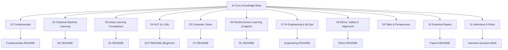
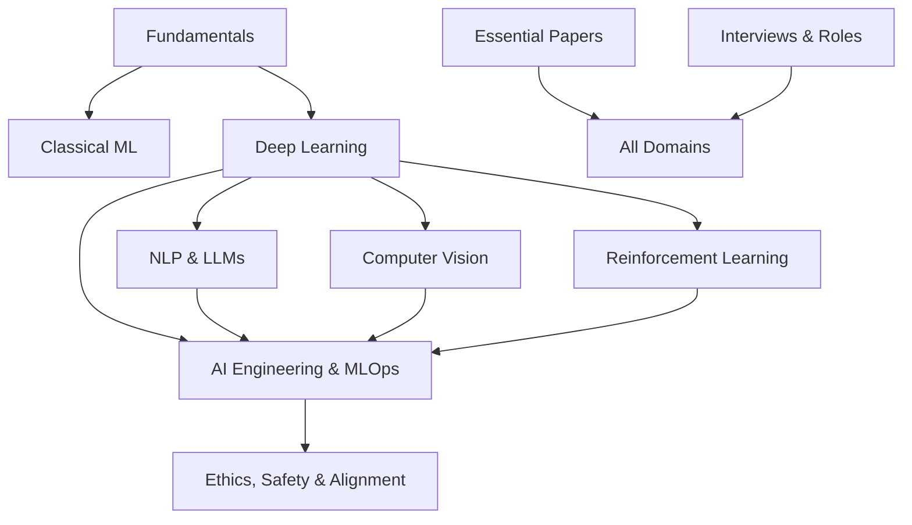

# Project Overview

<cite>
**Referenced Files in This Document**
- [README.md](file://README.md)
- [docs/README.md](file://docs/README.md)
- [docs/README_for_dummy.md](file://docs/README_for_dummy.md)
- [docs/01_Fundamentals/README.md](file://docs/01_Fundamentals/README.md)
- [docs/02_Machine_Learning/README.md](file://docs/02_Machine_Learning/README.md)
- [docs/03_Deep_Learning/README.md](file://docs/03_Deep_Learning/README.md)
- [docs/04_NLP_LLMs/README_for_dummy.md](file://docs/04_NLP_LLMs/README_for_dummy.md)
- [docs/05_Computer_Vision/README.md](file://docs/05_Computer_Vision/README.md)
- [docs/06_Reinforcement_Learning/README.md](file://docs/06_Reinforcement_Learning/README.md)
- [docs/07_AI_Engineering/README.md](file://docs/07_AI_Engineering/README.md)
- [docs/08_Ethics_Safety/README.md](file://docs/08_Ethics_Safety/README.md)
- [docs/10_papers/README.md](file://docs/10_papers/README.md)
- [docs/11_interviews/ai_research_engineer/company_level_question_bank.md](file://docs/11_interviews/ai_research_engineer/company_level_question_bank.md)
</cite>

## Table of Contents
1. [Introduction](#introduction)
2. [Project Structure](#project-structure)
3. [Core Components](#core-components)
4. [Architecture Overview](#architecture-overview)
5. [Detailed Component Analysis](#detailed-component-analysis)
6. [Dependency Analysis](#dependency-analysis)
7. [Performance Considerations](#performance-considerations)
8. [Troubleshooting Guide](#troubleshooting-guide)
9. [Conclusion](#conclusion)
10. [Appendices](#appendices)

## Introduction
AI Guru is a comprehensive, professional, and authoritative AI knowledge base and practice guide. It consolidates top-tier AI knowledge from foundational mathematics to cutting-edge distributed systems, large language models, and AI ethics. The project emphasizes structured learning, bilingual terminology, and practical engineering insights, making it valuable for both beginners and experienced practitioners.

Key highlights:
- Professional depth: covering advanced topics such as singular value decomposition (SVD), ZeRO optimization protocols, and attention mechanisms.
- Authority-backed: tracing concepts to academic papers (arXiv) and engineering practices at leading institutions (Google, OpenAI, NVIDIA).
- Structured learning: a clear, logical progression from fundamentals to specialized domains.
- Bilingual terminology: core concepts presented with both Chinese and English terms for precise academic and professional communication.

Mission:
To serve as a unified, expert-level resource that bridges theory and practice, enabling learners and practitioners to understand and apply modern AI technologies across diverse domains.

Target audience:
- Developers and engineers building or deploying AI systems.
- Researchers seeking authoritative foundations and current practices.
- Students and professionals preparing for roles in AI, NLP, computer vision, reinforcement learning, and AI engineering.
- Career-focused learners targeting interviews and roles in AI research, engineering, product, and safety.

Overall value proposition:
- A single, curated knowledge system spanning eight major AI domains with eleven specialized topics.
- Clear learning pathways, bilingual glossaries, and real-world applications.
- Curated essential papers and industry perspectives to accelerate mastery and job readiness.

## Project Structure
The repository organizes educational content into a taxonomy of eight major AI domains plus supporting resources for talks, essential papers, and interview preparation. Each domain includes topic-specific documents and often a simplified beginner-friendly version.

**Diagram sources**
- [docs/README.md:1-90](file://docs/README.md#L1-L90)
- [README.md:16-73](file://README.md#L16-L73)

**Section sources**
- [docs/README.md:1-90](file://docs/README.md#L1-L90)
- [README.md:16-73](file://README.md#L16-L73)

## Core Components
- Fundamentals: Linear algebra, probability/statistics, data structures/algorithms, and distributed systems form the backbone for all subsequent learning.
- Classical Machine Learning: Supervised and unsupervised learning, feature engineering, and practical modeling techniques.
- Deep Learning Foundations: Neural networks, backpropagation, and training optimization.
- NLP & LLMs: Sequence models, Transformer revolution, LLM architectures, fine-tuning, and prompt engineering.
- Computer Vision: Image classification/detection, segmentation, multimodal vision, and generative models.
- Reinforcement Learning & Agents: RL foundations, deep RL, and agent capabilities.
- AI Engineering & MLOps: Model evaluation, deployment/inference, RAG systems, and MLOps pipelines.
- Ethics, Safety & Alignment: Value alignment, safety red teaming, and governance considerations.
- Talks & Perspectives: Insights from leading figures in AI.
- Essential Papers: Curated reading roadmap across all domains.
- Interviews & Roles: Role-specific interview preparation and question banks.

These components collectively support a structured, end-to-end learning journey from theory to practice.

**Section sources**
- [docs/README.md:1-90](file://docs/README.md#L1-L90)
- [README.md:16-73](file://README.md#L16-L73)

## Architecture Overview
The project’s architecture is a hierarchical knowledge taxonomy designed for progressive learning and cross-domain navigation. Each domain encapsulates topic-specific content and often includes a beginner-friendly companion to ease entry for newcomers.

```mermaid
graph TB
subgraph "Beginner Path"
DummyRoot["Beginner Navigation (README_for_dummy.md)"]
DummyRoot --> DummyFund["Fundamentals (Beginner)"]
DummyRoot --> DummyML["Machine Learning (Beginner)"]
DummyRoot --> DummyDL["Deep Learning (Beginner)"]
DummyRoot --> DummyNLP["NLP & LLMs (Beginner)"]
DummyRoot --> DummyCV["Computer Vision (Beginner)"]
DummyRoot --> DummyRL["Reinforcement Learning (Beginner)"]
DummyRoot --> DummyEng["AI Engineering (Beginner)"]
DummyRoot --> DummyEth["Ethics & Safety (Beginner)"]
end
subgraph "Professional Path"
ProRoot["Professional Navigation (README.md)"]
ProRoot --> ProFund["Fundamentals"]
ProRoot --> ProML["Classical ML"]
ProRoot --> ProDL["Deep Learning"]
ProRoot --> ProNLP["NLP & LLMs"]
ProRoot --> ProCV["Computer Vision"]
ProRoot --> ProRL["Reinforcement Learning"]
ProRoot --> ProEng["AI Engineering & MLOps"]
ProRoot --> ProEth["Ethics, Safety & Alignment"]
ProRoot --> ProPapers["Essential Papers"]
ProRoot --> ProInterviews["Interviews & Roles"]
end
DummyFund --> ProFund
DummyML --> ProML
DummyDL --> ProDL
DummyNLP --> ProNLP
DummyCV --> ProCV
DummyRL --> ProRL
DummyEng --> ProEng
DummyEth --> ProEth
```

**Diagram sources**
- [docs/README_for_dummy.md:1-142](file://docs/README_for_dummy.md#L1-L142)
- [docs/README.md:1-90](file://docs/README.md#L1-L90)
- [README.md:16-73](file://README.md#L16-L73)

## Detailed Component Analysis

### Fundamentals Domain
Purpose:
- Establish mathematical and computational foundations required for advanced AI topics.

Highlights:
- Linear algebra, probability/statistics, data structures/algorithms, and distributed systems.
- Clear prerequisite mapping and bilingual terminology glossary.

Learning pathway:
- Linear algebra → probability/statistics → data structures/algorithms → distributed systems.

Bilingual terminology:
- Concepts like tensor, eigenvalue decomposition, SVD, Bayes’ theorem, entropy, KL divergence, computation graph, All-Reduce, data parallelism, and ZeRO are presented with both Chinese and English.

Beginner accessibility:
- Beginner-friendly companion document simplifies complex ideas without sacrificing accuracy.

**Section sources**
- [docs/01_Fundamentals/README.md:1-59](file://docs/01_Fundamentals/README.md#L1-L59)
- [docs/README_for_dummy.md:30-40](file://docs/README_for_dummy.md#L30-L40)

### Classical Machine Learning Domain
Purpose:
- Cover pre-deep learning methods still widely used in industry, including supervised learning, unsupervised learning, and feature engineering.

Highlights:
- Supervised learning (classification/regression/integrated methods), feature engineering, and unsupervised learning (clustering, dimensionality reduction).
- Strong emphasis on practical skills and model evaluation.

Bilingual terminology:
- Terms such as overfitting, regularization, cross-validation, ensemble learning, gradient boosting, PCA, t-SNE, K-Means, and DBSCAN are documented with both languages.

Beginner accessibility:
- Beginner-friendly companion outlines a simplified learning path and key takeaways.

**Section sources**
- [docs/02_Machine_Learning/README.md:1-58](file://docs/02_Machine_Learning/README.md#L1-L58)
- [docs/README_for_dummy.md:43-52](file://docs/README_for_dummy.md#L43-L52)

### Deep Learning Foundations Domain
Purpose:
- Bridge classical ML with modern neural network techniques, focusing on core concepts and training optimization.

Highlights:
- Neural network basics, backpropagation, activation functions, normalization, and optimization (AdamW, regularization, early stopping).

Beginner accessibility:
- Beginner-friendly companion introduces neural networks and training optimization in accessible language.

**Section sources**
- [docs/03_Deep_Learning/README.md:1-58](file://docs/03_Deep_Learning/README.md#L1-L58)
- [docs/README_for_dummy.md:55-63](file://docs/README_for_dummy.md#L55-L63)

### NLP & LLMs Domain
Purpose:
- Explore language understanding and generation technologies, culminating in large language models and practical prompting.

Highlights:
- Sequence models (RNN, LSTM, GRU), Transformer architecture, LLMs (GPT, BERT, MoE), fine-tuning techniques (LoRA, QLoRA), and prompt engineering.

Beginner accessibility:
- Extensive beginner-friendly documentation explains concepts like tokens, prompts, pretraining, fine-tuning, and why Transformers are powerful.

**Section sources**
- [docs/04_NLP_LLMs/README_for_dummy.md:1-279](file://docs/04_NLP_LLMs/README_for_dummy.md#L1-L279)
- [docs/README_for_dummy.md:66-77](file://docs/README_for_dummy.md#L66-L77)

### Computer Vision Domain
Purpose:
- Cover image classification/detection, segmentation, multimodal vision, and generative models.

Highlights:
- CNNs, ResNet, EfficientNet, YOLO series, Mask R-CNN, generative models (GANs, diffusion models, VAEs).

Beginner accessibility:
- Beginner-friendly companion explains core tasks and models in approachable terms.

**Section sources**
- [docs/05_Computer_Vision/README.md:1-58](file://docs/05_Computer_Vision/README.md#L1-L58)
- [docs/README_for_dummy.md:80-90](file://docs/README_for_dummy.md#L80-L90)

### Reinforcement Learning & Agents Domain
Purpose:
- Introduce RL fundamentals, deep RL, and intelligent agents.

Highlights:
- MDPs, Bellman equations, DQN, PPO, SAC, and agent capabilities (planning, memory, tool use).

Beginner accessibility:
- Beginner-friendly companion outlines foundational concepts and agent behaviors.

**Section sources**
- [docs/06_Reinforcement_Learning/README.md:1-58](file://docs/06_Reinforcement_Learning/README.md#L1-L58)
- [docs/README_for_dummy.md:93-102](file://docs/README_for_dummy.md#L93-L102)

### AI Engineering & MLOps Domain
Purpose:
- Focus on productionizing AI: deployment, inference optimization, RAG systems, and MLOps pipelines.

Highlights:
- Model evaluation (metrics/A/B tests), deployment/inference (vLLM, TensorRT, quantization), RAG (vector databases, hybrid search, reranking), and MLOps (experiment tracking, CI/CD, monitoring).

Beginner accessibility:
- Beginner-friendly companion covers deployment, RAG, MLOps, and evaluation in practical terms.

**Section sources**
- [docs/07_AI_Engineering/README.md:1-62](file://docs/07_AI_Engineering/README.md#L1-L62)
- [docs/README_for_dummy.md:105-115](file://docs/README_for_dummy.md#L105-L115)

### Ethics, Safety & Alignment Domain
Purpose:
- Address trustworthiness and responsibility in AI systems.

Highlights:
- Value alignment (RLHF, DPO), safety red teaming (adversarial examples, prompt injection, jailbreaking), and fairness.

Beginner accessibility:
- Beginner-friendly companion introduces alignment and safety concepts clearly.

**Section sources**
- [docs/08_Ethics_Safety/README.md:1-52](file://docs/08_Ethics_Safety/README.md#L1-L52)
- [docs/README_for_dummy.md:118-126](file://docs/README_for_dummy.md#L118-L126)

### Talks & Perspectives
Purpose:
- Provide curated insights from leading figures in AI, covering safety, open science, platform strategy, and education.

Scope:
- Profiles and quotes from luminaries such as Elon Musk, Fei-Fei Li, Andrew Ng, Geoffrey Hinton, Yann LeCun, Yoshua Bengio, Demis Hassabis, Dario Amodei, Sam Altman, Jensen Huang, Satya Nadella, Sundar Pichai, Bill Gates, Mark Zuckerberg, Mustafa Suleyman, Emad Mostaque, Andrej Karpathy, Richard Socher, Mira Murati, and Sebastian Thrun.

**Section sources**
- [README.md:56-64](file://README.md#L56-L64)

### Essential Papers
Purpose:
- Curate must-read papers across all domains, with a recommended reading path from foundational training/optimization to advanced topics.

Highlights:
- Deep learning basics, visual representation learning, NLP/Transformer, generative models, reinforcement learning, scaling/engineering, and alignment/safety.

**Section sources**
- [docs/10_papers/README.md:1-58](file://docs/10_papers/README.md#L1-L58)

### Interviews & Roles
Purpose:
- Support career-focused learners with role-specific interview preparation and question banks.

Examples:
- AI Research Engineer: questions around platform efficiency, multi-team collaboration, startup constraints, research–engineering balance, and company-specific expectations.

**Section sources**
- [docs/11_interviews/ai_research_engineer/company_level_question_bank.md:1-37](file://docs/11_interviews/ai_research_engineer/company_level_question_bank.md#L1-L37)

## Dependency Analysis
The domains exhibit a layered dependency structure, where earlier domains provide prerequisites for later ones. The beginner-friendly companions depend on the professional documents to maintain consistency while lowering entry barriers.

**Diagram sources**
- [docs/01_Fundamentals/README.md:38-42](file://docs/01_Fundamentals/README.md#L38-L42)
- [docs/02_Machine_Learning/README.md:37-41](file://docs/02_Machine_Learning/README.md#L37-L41)
- [docs/03_Deep_Learning/README.md:1-58](file://docs/03_Deep_Learning/README.md#L1-L58)
- [docs/07_AI_Engineering/README.md:40-46](file://docs/07_AI_Engineering/README.md#L40-L46)
- [docs/10_papers/README.md:5-7](file://docs/10_papers/README.md#L5-L7)

## Performance Considerations
- Learning efficiency: Use the beginner-friendly companions to quickly grasp high-level concepts, then dive into professional documents for depth.
- Practical application: Combine domain-specific knowledge with curated papers and interview prep to accelerate career growth.
- Bilingual terminology: Leveraging both Chinese and English terms improves comprehension and facilitates international collaboration.

[No sources needed since this section provides general guidance]

## Troubleshooting Guide
Common challenges and resolutions:
- Overwhelmed by complexity: Start with beginner-friendly companions to build intuition, then revisit professional documents with context.
- Gaps in prerequisites: Review the Fundamentals domain to strengthen math and CS foundations.
- Difficulty connecting theory to practice: Use the AI Engineering & MLOps domain to bridge concepts with deployment and evaluation.
- Career uncertainty: Consult the Interviews & Roles section to align study goals with job expectations.

**Section sources**
- [docs/README_for_dummy.md:129-139](file://docs/README_for_dummy.md#L129-L139)
- [docs/01_Fundamentals/README.md:38-42](file://docs/01_Fundamentals/README.md#L38-L42)
- [docs/07_AI_Engineering/README.md:40-46](file://docs/07_AI_Engineering/README.md#L40-L46)
- [docs/11_interviews/ai_research_engineer/company_level_question_bank.md:22-34](file://docs/11_interviews/ai_research_engineer/company_level_question_bank.md#L22-L34)

## Conclusion
AI Guru consolidates expert-level AI knowledge across eight major domains with a structured, bilingual approach. It serves as both a learning roadmap and a practical reference, supporting learners from zero to advanced levels while preparing them for careers in AI research, engineering, product, and safety. By combining authoritative content, curated papers, and industry perspectives, the project delivers a comprehensive, accessible, and future-ready AI education ecosystem.

[No sources needed since this section summarizes without analyzing specific files]

## Appendices
- Beginner navigation: [Beginner README](file://docs/README_for_dummy.md)
- Professional navigation: [Professional README](file://docs/README.md)
- Project mission and highlights: [Project README](file://README.md)

[No sources needed since this section aggregates links without analyzing specific files]