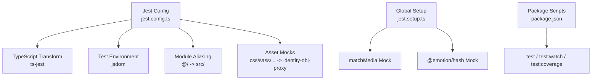
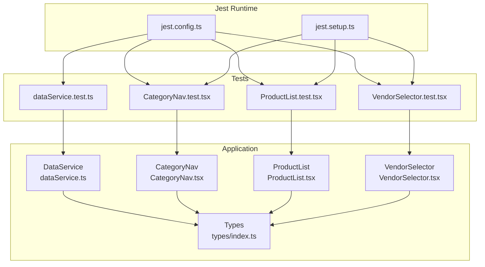
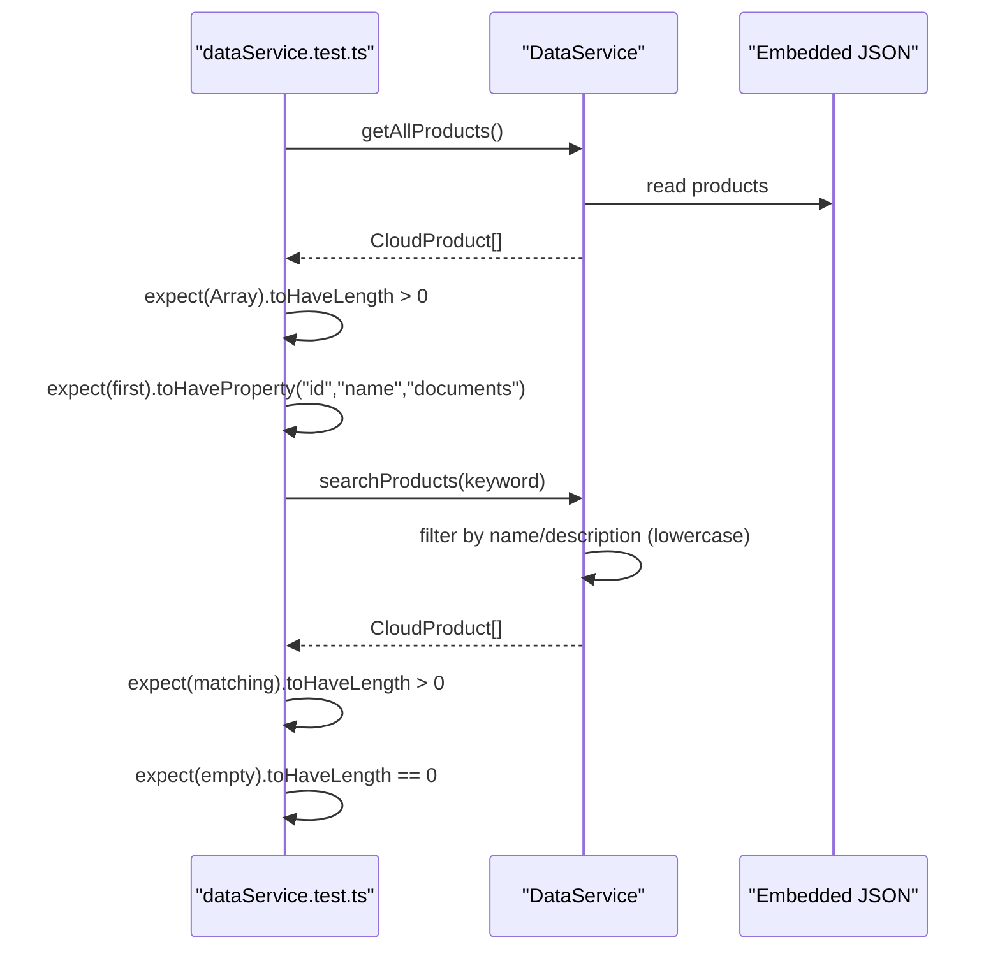
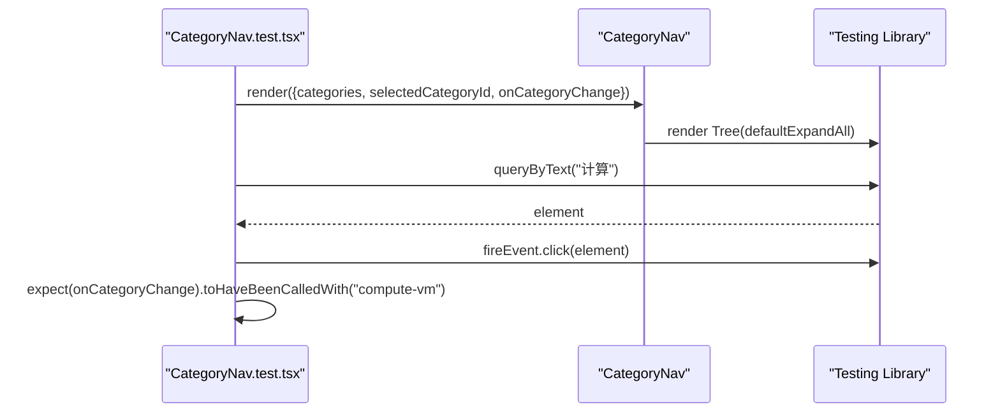
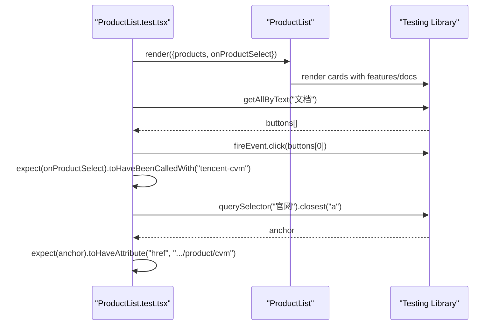
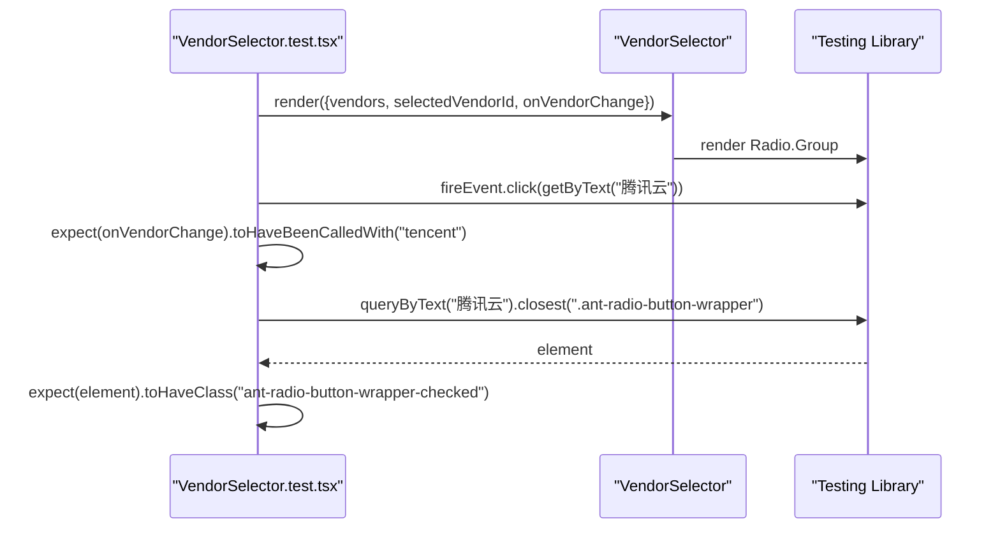
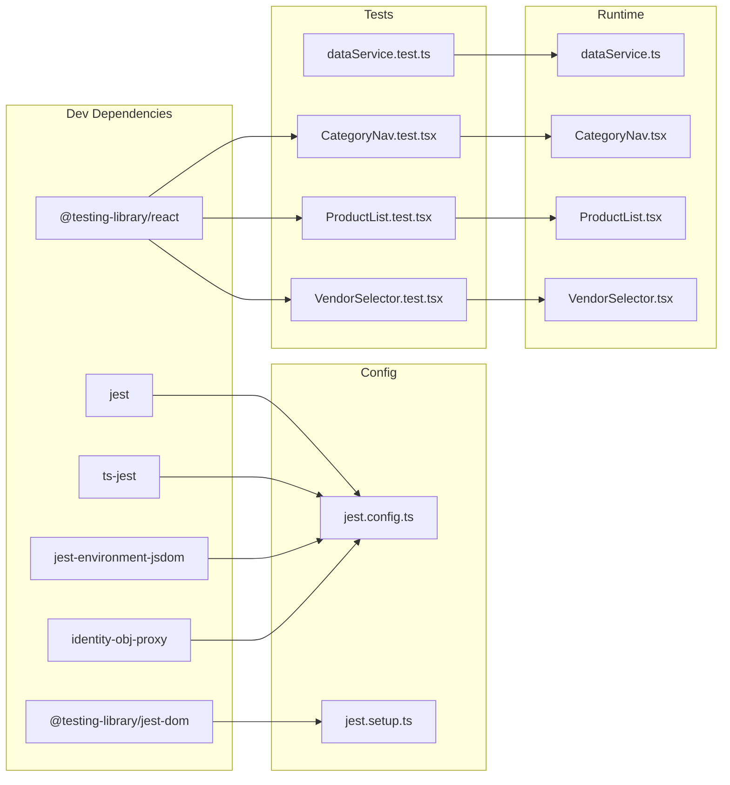

# Testing Strategy

<cite>
**Referenced Files in This Document**
- [jest.config.ts](file://web/jest.config.ts)
- [jest.setup.ts](file://web/jest.setup.ts)
- [package.json](file://web/package.json)
- [dataService.ts](file://web/src/services/dataService.ts)
- [dataService.test.ts](file://web/src/services/dataService.test.ts)
- [CategoryNav.tsx](file://web/src/components/CategoryNav.tsx)
- [CategoryNav.test.tsx](file://web/src/components/CategoryNav.test.tsx)
- [ProductList.tsx](file://web/src/components/ProductList.tsx)
- [ProductList.test.tsx](file://web/src/components/ProductList.test.tsx)
- [VendorSelector.tsx](file://web/src/components/VendorSelector.tsx)
- [VendorSelector.test.tsx](file://web/src/components/VendorSelector.test.tsx)
- [types/index.ts](file://web/src/types/index.ts)
- [testing-library.d.ts](file://web/src/types/testing-library.d.ts)
- [main.tsx](file://web/src/main.tsx)
</cite>

## Table of Contents
1. [Introduction](#introduction)
2. [Project Structure](#project-structure)
3. [Core Components](#core-components)
4. [Architecture Overview](#architecture-overview)
5. [Detailed Component Analysis](#detailed-component-analysis)
6. [Dependency Analysis](#dependency-analysis)
7. [Performance Considerations](#performance-considerations)
8. [Troubleshooting Guide](#troubleshooting-guide)
9. [Conclusion](#conclusion)
10. [Appendices](#appendices)

## Introduction
This document describes the testing strategy and implementation for the frontend application. It explains the Jest configuration, unit testing approaches for React components and data service functions, and coverage requirements. It also documents testing patterns, setup and mocking, assertion strategies, and provides guidance for component and service testing scenarios, integration testing approaches, best practices, CI considerations, and quality assurance processes.

## Project Structure
The testing stack is organized around Jest with TypeScript and React Testing Library. The configuration supports:
- TypeScript compilation via ts-jest
- DOM environment via jsdom
- Module aliasing and asset mocking
- Coverage collection and reporters

Key testing-related files:
- Jest configuration and presets
- Global setup for DOM APIs and third-party modules
- Test suites for services and components
- Type definitions for testing library extensions

**Diagram sources**
- [jest.config.ts:1-24](file://web/jest.config.ts#L1-L24)
- [jest.setup.ts:1-59](file://web/jest.setup.ts#L1-L59)
- [package.json:6-14](file://web/package.json#L6-L14)

**Section sources**
- [jest.config.ts:1-24](file://web/jest.config.ts#L1-L24)
- [jest.setup.ts:1-59](file://web/jest.setup.ts#L1-L59)
- [package.json:6-14](file://web/package.json#L6-L14)

## Core Components
This section outlines the testing approach for the primary units under test:
- Data service: a singleton providing CRUD-like queries over embedded JSON data
- UI components: CategoryNav, ProductList, VendorSelector built with Ant Design
- Types: shared interfaces used across components and tests

Key testing characteristics:
- Service tests validate return types, presence of properties, filtering correctness, and edge cases (empty results)
- Component tests validate rendering, event handling, and UI state via Testing Library queries and user events
- Global setup ensures DOM APIs and third-party modules behave deterministically in tests

**Section sources**
- [dataService.ts:1-156](file://web/src/services/dataService.ts#L1-L156)
- [CategoryNav.tsx:1-57](file://web/src/components/CategoryNav.tsx#L1-L57)
- [ProductList.tsx:1-99](file://web/src/components/ProductList.tsx#L1-L99)
- [VendorSelector.tsx:1-40](file://web/src/components/VendorSelector.tsx#L1-L40)
- [types/index.ts:1-69](file://web/src/types/index.ts#L1-L69)

## Architecture Overview
The testing architecture centers on Jest orchestrating TypeScript compilation and DOM simulation, with global setup enabling realistic component rendering and predictable behavior for external modules.

**Diagram sources**
- [jest.config.ts:1-24](file://web/jest.config.ts#L1-L24)
- [jest.setup.ts:1-59](file://web/jest.setup.ts#L1-L59)
- [dataService.ts:1-156](file://web/src/services/dataService.ts#L1-L156)
- [CategoryNav.tsx:1-57](file://web/src/components/CategoryNav.tsx#L1-L57)
- [ProductList.tsx:1-99](file://web/src/components/ProductList.tsx#L1-L99)
- [VendorSelector.tsx:1-40](file://web/src/components/VendorSelector.tsx#L1-L40)
- [types/index.ts:1-69](file://web/src/types/index.ts#L1-L69)
- [dataService.test.ts:1-170](file://web/src/services/dataService.test.ts#L1-L170)
- [CategoryNav.test.tsx:1-112](file://web/src/components/CategoryNav.test.tsx#L1-L112)
- [ProductList.test.tsx:1-126](file://web/src/components/ProductList.test.tsx#L1-L126)
- [VendorSelector.test.tsx:1-72](file://web/src/components/VendorSelector.test.tsx#L1-L72)

## Detailed Component Analysis

### Data Service Testing
The data service is tested comprehensively for:
- Retrieval of vendors, categories, and products
- Filtering by vendor ID, category ID, and combined filters
- Lookup by ID with undefined fallback
- Aggregated vendor product view
- Keyword-based search returning filtered results

Patterns:
- Assertions verify array types, length, and property presence
- Edge-case assertions confirm empty arrays for invalid IDs
- Search tests validate case-insensitive substring matching and full-result fallback for empty keywords

**Diagram sources**
- [dataService.test.ts:146-168](file://web/src/services/dataService.test.ts#L146-L168)
- [dataService.ts:68-151](file://web/src/services/dataService.ts#L68-L151)

**Section sources**
- [dataService.test.ts:1-170](file://web/src/services/dataService.test.ts#L1-L170)
- [dataService.ts:1-156](file://web/src/services/dataService.ts#L1-L156)

### Category Navigation Component Testing
Component tests validate:
- Rendering of category titles and nested nodes
- Expansion behavior (default expanded)
- Selection callbacks and selected state propagation
- Interaction via user events

Patterns:
- Render with props and assert text presence
- Fire click events and assert callback invocations with expected keys
- Verify selection state via DOM attributes/classes

**Diagram sources**
- [CategoryNav.test.tsx:41-87](file://web/src/components/CategoryNav.test.tsx#L41-L87)
- [CategoryNav.tsx:41-53](file://web/src/components/CategoryNav.tsx#L41-L53)

**Section sources**
- [CategoryNav.test.tsx:1-112](file://web/src/components/CategoryNav.test.tsx#L1-L112)
- [CategoryNav.tsx:1-57](file://web/src/components/CategoryNav.tsx#L1-L57)

### Product List Component Testing
Component tests validate:
- Rendering of product cards and metadata
- Feature tags and document entries
- Click handlers for “文档” buttons
- External links for “官网”

Patterns:
- Assert presence of product names, features, and document titles
- Retrieve all “文档” buttons and simulate clicks to verify callback invocation
- Validate anchor href attributes for external links

**Diagram sources**
- [ProductList.test.tsx:93-124](file://web/src/components/ProductList.test.tsx#L93-L124)
- [ProductList.tsx:26-95](file://web/src/components/ProductList.tsx#L26-L95)

**Section sources**
- [ProductList.test.tsx:1-126](file://web/src/components/ProductList.test.tsx#L1-L126)
- [ProductList.tsx:1-99](file://web/src/components/ProductList.tsx#L1-L99)

### Vendor Selector Component Testing
Component tests validate:
- Rendering of vendor options
- Callback invocation on selection
- Visual indication of selected vendor via Ant Design classes

Patterns:
- Assert vendor names are present
- Simulate clicks and assert callback arguments
- Inspect DOM classes to verify selection state

**Diagram sources**
- [VendorSelector.test.tsx:37-70](file://web/src/components/VendorSelector.test.tsx#L37-L70)
- [VendorSelector.tsx:18-36](file://web/src/components/VendorSelector.tsx#L18-L36)

**Section sources**
- [VendorSelector.test.tsx:1-72](file://web/src/components/VendorSelector.test.tsx#L1-L72)
- [VendorSelector.tsx:1-40](file://web/src/components/VendorSelector.tsx#L1-L40)

### Test Setup and Mock Configuration
Global setup ensures:
- matchMedia is available for responsive components
- @emotion/hash resolves deterministically to avoid runtime errors
- Testing Library matchers are available globally

Module mocking:
- CSS and style modules are mocked via identity-obj-proxy
- Asset imports are handled consistently

**Section sources**
- [jest.setup.ts:1-59](file://web/jest.setup.ts#L1-L59)
- [jest.config.ts:7-11](file://web/jest.config.ts#L7-L11)

### Assertion Strategies
Common assertion patterns across tests:
- expect(instance).toBeInstanceOf(Type)
- expect(arrayLike).toHaveLength(n)
- expect(object).toHaveProperty(key)
- expect(fn).toHaveBeenCalledWith(args)
- expect(element).toBeInTheDocument()
- expect(element).toHaveAttribute("href", value)
- expect(element).toHaveClass(className)

These strategies are applied in service and component tests to validate behavior and rendering.

**Section sources**
- [dataService.test.ts:5-25](file://web/src/services/dataService.test.ts#L5-L25)
- [CategoryNav.test.tsx:52-54](file://web/src/components/CategoryNav.test.tsx#L52-L54)
- [ProductList.test.tsx:61-64](file://web/src/components/ProductList.test.tsx#L61-L64)
- [VendorSelector.test.tsx:32-35](file://web/src/components/VendorSelector.test.tsx#L32-L35)

### Integration Testing Approaches
Integration-style checks occur in component tests by:
- Rendering components with realistic props
- Triggering user interactions (clicks, selections)
- Verifying side effects (callbacks invoked with expected values)
- Ensuring DOM attributes and classes reflect state

These tests combine unit-level assertions with UI interaction patterns to approximate integration behavior within the component layer.

**Section sources**
- [CategoryNav.test.tsx:71-87](file://web/src/components/CategoryNav.test.tsx#L71-L87)
- [ProductList.test.tsx:93-124](file://web/src/components/ProductList.test.tsx#L93-L124)
- [VendorSelector.test.tsx:37-70](file://web/src/components/VendorSelector.test.tsx#L37-L70)

## Dependency Analysis
This section maps testing dependencies and their roles.

**Diagram sources**
- [jest.config.ts:1-24](file://web/jest.config.ts#L1-L24)
- [jest.setup.ts:1-59](file://web/jest.setup.ts#L1-L59)
- [dataService.ts:1-156](file://web/src/services/dataService.ts#L1-L156)
- [CategoryNav.tsx:1-57](file://web/src/components/CategoryNav.tsx#L1-L57)
- [ProductList.tsx:1-99](file://web/src/components/ProductList.tsx#L1-L99)
- [VendorSelector.tsx:1-40](file://web/src/components/VendorSelector.tsx#L1-L40)
- [dataService.test.ts:1-170](file://web/src/services/dataService.test.ts#L1-L170)
- [CategoryNav.test.tsx:1-112](file://web/src/components/CategoryNav.test.tsx#L1-L112)
- [ProductList.test.tsx:1-126](file://web/src/components/ProductList.test.tsx#L1-L126)
- [VendorSelector.test.tsx:1-72](file://web/src/components/VendorSelector.test.tsx#L1-L72)

**Section sources**
- [jest.config.ts:1-24](file://web/jest.config.ts#L1-L24)
- [jest.setup.ts:1-59](file://web/jest.setup.ts#L1-L59)
- [package.json:25-48](file://web/package.json#L25-L48)

## Performance Considerations
- Keep test fixtures minimal and focused to reduce rendering overhead
- Prefer shallow or partial rendering patterns when appropriate to limit DOM traversal
- Use targeted queries (e.g., getByText) to avoid unnecessary DOM scans
- Avoid heavy asynchronous work in tests; rely on deterministic mocks and small datasets

## Troubleshooting Guide
Common issues and resolutions:
- matchMedia not defined: resolved by global mock in setup
- @emotion/hash TypeError: resolved by mocking the module with a deterministic hash
- CSS import errors: resolved by identity-obj-proxy mapping in moduleNameMapper
- Ant Design selection state assertions: inspect wrapper classes for checked state

**Section sources**
- [jest.setup.ts:3-16](file://web/jest.setup.ts#L3-L16)
- [jest.setup.ts:18-57](file://web/jest.setup.ts#L18-L57)
- [jest.config.ts:7-11](file://web/jest.config.ts#L7-L11)

## Conclusion
The testing strategy leverages Jest with ts-jest and jsdom, complemented by React Testing Library for component tests and global setup for reliable DOM and third-party module behavior. Service tests emphasize correctness of filtering and aggregation, while component tests validate rendering, interactivity, and state reflection. Coverage is configured to capture TypeScript sources excluding entry points and type declarations. The approach balances unit-level precision with integration-style checks at the component boundary, supporting maintainable and robust quality assurance.

## Appendices

### Test Coverage Requirements
Coverage configuration collects from TypeScript sources and excludes:
- Application entry points
- Declaration files

Reporters include text, LCOV, and HTML for CI and local inspection.

**Section sources**
- [jest.config.ts:17-23](file://web/jest.config.ts#L17-L23)

### Continuous Integration Considerations
- Use npm scripts to run tests and coverage
- Configure CI to cache node_modules and install dev dependencies
- Publish coverage reports using LCOV/HTML outputs

**Section sources**
- [package.json:6-14](file://web/package.json#L6-L14)
- [jest.config.ts:22-23](file://web/jest.config.ts#L22-L23)

### Writing Effective Tests
- Describe intent clearly with nested describe blocks for feature areas
- Use small, deterministic fixtures
- Prefer user-centric assertions (e.g., “calls callback with expected value”)
- Keep tests isolated and fast

### Quality Assurance Processes
- Run tests locally before committing
- Enforce coverage thresholds in CI
- Review component tests alongside UI changes
- Maintain type-safe props and consistent event handler signatures