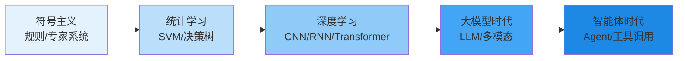
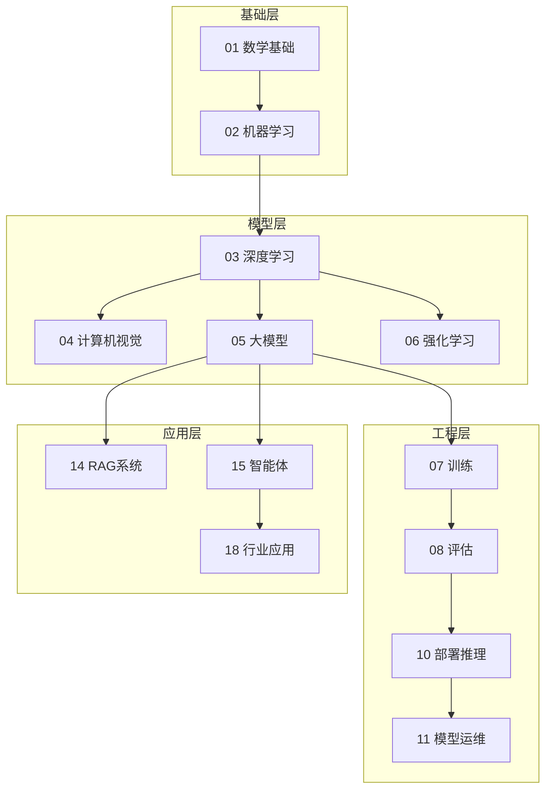

# AI 入门速览 (AI Introduction in a Nutshell)

> 中文简称：AI 入门速览

> **一句话理解**: AI 就是让机器从数据里"总结经验"——经验总结得越好，它在没见过的新问题上表现就越好。

---

## TL;DR

- **AI ⊃ ML ⊃ DL**: 人工智能是目标，机器学习是路径，深度学习是当前最强的实现
- **三次浪潮**: 符号主义（规则）→ 统计学习（特征）→ 深度学习/大模型（表示 + 规模）
- **2026 主线**: 大语言模型（LLM）+ 智能体（Agent）成为应用层事实标准
- **学习路径**: 数学基础 → 机器学习 → 深度学习 → 大模型 → 工程化（训练/评估/部署）
- **不用恐慌**: 工具会替代任务，不会替代"会用工具的人"
- **伦理底线**: 偏见、隐私、安全、透明度——从第一天就要考虑，不是上线后补课

---

## 1. AI 是什么：三个圈的关系

| 概念 | 定义 | 典型代表 |
|------|------|----------|
| **人工智能 (AI)** | 让机器表现出智能行为的总目标 | 下棋、翻译、对话 |
| **机器学习 (ML)** | 从数据中自动学习规律，而非手写规则 | 分类、回归、聚类 |
| **深度学习 (DL)** | 用多层神经网络自动学习特征表示 | CNN、Transformer |
| **大语言模型 (LLM)** | 在海量文本上预训练的超大深度模型 | GPT、Claude、Qwen |

记忆法：**AI 是愿景，ML 是方法论，DL 是发动机，LLM 是当前的旗舰产品**。

---

## 2. 核心概念速查

| 概念 | 一句话解释 |
|------|-----------|
| 训练 (Training) | 用数据调整模型参数的过程，像刷题 |
| 推理 (Inference) | 训练好的模型回答新问题，像考试 |
| 监督学习 | 有标准答案的学习（分类/回归） |
| 无监督学习 | 没有答案，自己找结构（聚类/降维） |
| 强化学习 | 试错 + 奖励，像训练宠物 |
| 过拟合 | 把练习题背下来了，换新题就不会 |
| 泛化 | 举一反三的能力，是 ML 的终极目标 |
| Prompt | 给大模型的指令/上下文，写得好答案就好 |
| Token | 大模型处理文本的最小单位，计费也按它 |
| 幻觉 (Hallucination) | 模型一本正经地胡说八道 |

---

## 3. 技术栈全景：从数学到应用

- **想入门算法**: 走 01 → 02 → 03 主线
- **想做应用**: 直接 05（大模型）→ 14（RAG）→ 15（智能体）
- **想做平台**: 07 → 10 → 11 → 12（架构基建）

---

## 4. 学习路径建议

| 阶段 | 目标 | 时间预算 | 关键动作 |
|------|------|----------|----------|
| 第 1 月 | 建立直觉 | 每天 1h | 读本章 + 跑通第一个 Prompt/API 调用 |
| 第 2-3 月 | 掌握原理 | 每天 1-2h | 机器学习基础 + 神经网络反向传播手推一遍 |
| 第 4-6 月 | 项目实战 | 周末集中 | 做一个 RAG 问答或 Agent 小项目 |
| 持续 | 跟进前沿 | 每周 2h | 读论文精读章 + 业界观点章 |

> 常见误区：先把数学全部学完再动手 ❌ —— 正确姿势是**边做边补**，遇到不懂的概念再回查。

---

## 5. 伦理与未来：入门就要知道的底线

1. **偏见**: 数据有偏见，模型就有偏见——训练数据决定模型三观
2. **隐私**: 用户数据不是免费燃料，合规（GDPR/个保法）是硬约束
3. **安全**: Prompt 注入、越狱、深度伪造——能力越强风险越大
4. **透明**: 高风险场景（医疗/金融/司法）必须可解释、可追责
5. **就业**: AI 替代的是任务不是职业，人机协作是主旋律

---

## 延伸阅读 (Further Reading)

| 主题 | 说明 | 入口 |
|------|------|------|
| 基础概念 | AI 核心概念、术语、历史 | [[00_入门/01_基础入门/index|Fundamentals]] |
| 技术全景 | 技术架构与应用场景 | [[00_入门/02_技术概览/index|Technology Overview]] |
| 学习路径 | 资源、实践、工具 | [[00_入门/03_学习路径/index|Learning Path]] |
| 伦理展望 | 伦理与未来趋势 | [[00_入门/04_伦理与未来/index|Ethics and Future]] |

---

*Last updated: 2026-07-27*

## 相关链接

- [[00_入门/index|AI 入门首页]] — 章节总览
- [[00_入门/README|入门小白指南]] — 零基础版
- [[01_数学基础/index|数学基础]] — 下一站：数学
- [[02_机器学习/index|机器学习]] — 下一站：ML
- [[90_学习/index|学习中心]] — 课程与学习路径
- [[概念/General/ai-fundamentals|AI 基础概念]] — 概念卡片

## 核心知识体系

| 知识层 | 核心内容 | 深度要求 | 学习优先级 |
|--------|----------|----------|------------|
| 基础理论 | 核心概念/数学原理/基本定义 | 深入理解并能推导 | P0 |
| 核心方法 | 主流算法/技术路线/框架工具 | 熟练掌握并能应用 | P0 |
| 工程实践 | 系统设计/性能优化/生产部署 | 独立完成项目 | P1 |
| 前沿研究 | 最新论文/技术趋势/开放问题 | 了解并跟踪 | P2 |
| 行业应用 | 落地案例/最佳实践/经验教训 | 参考并借鉴 | P1 |

## 技术路线对比

| 维度 | 经典方法 | 深度学习方法 | 大模型方法 | 选型建议 |
|------|----------|--------------|------------|----------|
| 数据需求 | 少量标注 | 大量标注 | 海量预训练 | 按数据规模 |
| 计算成本 | 低 | 中-高 | 极高 | 按预算约束 |
| 泛化能力 | 有限 | 良好 | 优秀 | 按任务复杂度 |
| 可解释性 | 高 | 低 | 极低 | 按合规要求 |
| 部署难度 | 简单 | 中等 | 复杂 | 按运维能力 |
| 迭代速度 | 快 | 中 | 慢 | 按业务节奏 |

## 常见问题FAQ

| 问题 | 解答 |
|------|------|
| 如何快速入门该领域? | 先建立直觉(可视化/类比)，再学数学原理，最后代码实现 |
| 需要哪些前置知识? | 线性代数+概率统计+微积分+Python编程基础 |
| 如何选择学习资源? | 经典教材打基础+顶会论文跟前沿+开源项目练实战 |
| 理论学习和实践如何平衡? | 7:3比例——70%时间理解原理，30%时间动手验证 |
| 如何评估自己的掌握程度? | 能向他人清晰解释+能独立实现+能解决变体问题 |

## 核心术语速查

| 术语 | 含义 | 关联概念 |
|------|------|----------|
| Loss Function | 衡量预测与真实值差距 | 交叉熵/MSE/对比损失 |
| Gradient Descent | 沿负梯度方向更新参数 | SGD/Adam/学习率 |
| Overfitting | 模型在训练集过好但泛化差 | 正则化/Dropout/早停 |
| Batch Size | 每次更新的样本数 | 收敛速度/显存/噪声 |
| Epoch | 完整遍历训练集一次 | 训练轮次/早停 |
| Fine-tuning | 在预训练模型上继续训练 | 迁移学习/LoRA/全量 |
| Inference | 模型前向传播产生输出 | 延迟/吞吐/量化 |
| Token | 文本处理的最小单元 | BPE/SentencePiece |

## 推荐资源

| 类型 | 资源 | 适用阶段 |
|------|------|----------|
| 教材 | 领域经典教材(花书/CS229等) | 入门-基础 |
| 课程 | Stanford/MIT在线课程 | 入门-进阶 |
| 论文 | 顶会最佳论文+综述 | 进阶-精通 |
| 代码 | PyTorch/HuggingFace官方示例 | 基础-实战 |
| 社区 | 技术博客+论文读书会 | 全阶段 |
| 竞赛 | Kaggle/天池/学术竞赛 | 基础-进阶 |

## 检查清单

- [ ] 核心概念能向他人清晰解释
- [ ] 数学原理能独立推导
- [ ] 核心算法能手写实现
- [ ] 主流框架和工具已掌握
- [ ] 完成至少一个端到端项目
- [ ] 能阅读和理解领域论文
- [ ] 了解最新技术趋势和开放问题
- [ ] 知识已文档化沉淀
